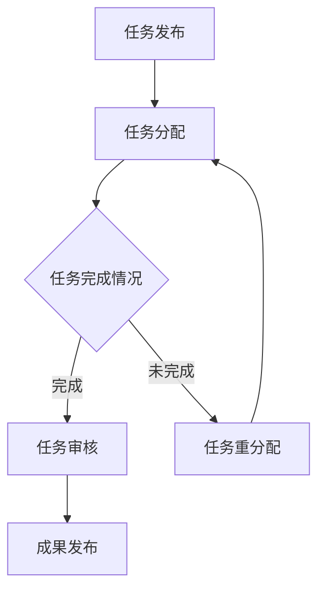

                 

关键词：众包、科技难题、协作、创新、项目实践

> 摘要：本文将探讨众包在现代科技发展中的应用，分析其核心概念与架构，阐述众包算法的原理与操作步骤，并通过实例解析，展示众包项目的开发过程及其实际应用场景。最后，我们将对未来的发展趋势与挑战进行展望，并提供相关工具和资源的推荐。

## 1. 背景介绍

### 1.1 众包的起源与发展

众包（Crowdsourcing）一词最早由杰夫·特里（Jeff Howe）在2006年提出，是指将一个任务或项目分散给众多个体，通过互联网平台进行协作完成的一种新型工作模式。众包的发展源于人们对分工合作和共享资源的追求，其应用范围涵盖了设计、编程、翻译、科学实验、数据分析等多个领域。

### 1.2 科技难题的现状与挑战

随着科技的发展，越来越多的复杂问题亟待解决。例如，人工智能领域的算法优化、生物信息学中的基因测序、材料科学中的新化合物合成等。这些难题往往需要大量的计算资源和专业知识，而单个团队或个人很难独立完成。因此，如何高效地集结全球的智慧和资源，成为解决科技难题的关键。

### 1.3 众包在科技难题解决中的作用

众包通过开放的平台，将科技难题分解为可分工的小任务，激励全球的科研人员、程序员、设计师等共同参与。众包不仅提高了任务的完成效率，还促进了知识的共享和创新。在解决科技难题方面，众包发挥着不可替代的作用。

## 2. 核心概念与联系

### 2.1 众包平台架构


**用户**：参与众包任务的个人或团队。

**任务发布者**：发布科技难题的机构或个人。

**平台**：提供任务发布、任务分配、进度监控、成果提交等功能。

**任务审核者**：对众包任务的成果进行评审的专业人员。

### 2.2 众包算法原理

众包算法主要涉及任务分配、任务调度、激励机制等方面。以下是一个简单的 Mermaid 流程图，展示众包算法的基本流程：



### 2.3 众包优势与挑战

**优势**：
1. **资源聚合**：集结全球智慧和资源，提高任务完成效率。
2. **知识共享**：促进知识的共享和创新，推动科技进步。
3. **灵活性强**：可根据任务需求，灵活选择合适的参与者。

**挑战**：
1. **质量控制**：众包任务的完成质量难以保证，需要有效的审核机制。
2. **信息安全**：涉及敏感信息的任务，需确保数据的安全性和隐私。

## 3. 核心算法原理 & 具体操作步骤

### 3.1 算法原理概述

众包算法主要分为任务分配、任务调度和激励机制三个部分。任务分配是核心，目标是将任务合理地分配给参与者；任务调度是确保任务能够按时完成；激励机制则是鼓励参与者积极参与并提高任务质量。

### 3.2 算法步骤详解

**任务分配**：
1. **任务拆分**：将复杂的科技难题分解为可分工的小任务。
2. **参与者筛选**：根据任务要求，筛选合适的参与者。
3. **任务分配策略**：采用基于优先级、任务匹配度等的分配策略。

**任务调度**：
1. **任务进度监控**：实时跟踪任务进度，确保任务按时完成。
2. **任务调整**：根据进度情况，调整任务分配和参与者。

**激励机制**：
1. **积分制度**：根据参与者完成任务的情况，给予相应的积分奖励。
2. **奖励制度**：设置丰厚的奖励，激励参与者提高完成任务的质量。

### 3.3 算法优缺点

**优点**：
- **高效性**：通过分工合作，提高任务完成效率。
- **灵活性**：可根据任务需求，灵活选择参与者。

**缺点**：
- **质量控制**：任务质量难以保证，需要有效的审核机制。
- **信息安全**：涉及敏感信息的任务，需确保数据的安全性和隐私。

### 3.4 算法应用领域

众包算法在科技难题解决中具有广泛的应用，如人工智能算法优化、生物信息学、材料科学等。此外，众包还在商业、文化、公益等领域发挥着重要作用。

## 4. 数学模型和公式 & 详细讲解 & 举例说明

### 4.1 数学模型构建

众包任务分配和激励机制的设计，通常涉及到优化问题和博弈论。以下是一个简单的优化模型：

**目标函数**：
\[ \max \sum_{i=1}^n w_i \cdot s_i \]

**约束条件**：
\[ \sum_{i=1}^n s_i \leq C \]
\[ s_i \in \{0, 1\} \]

其中，\( w_i \) 表示任务 \( i \) 的权重，\( s_i \) 表示任务 \( i \) 是否被分配（1 表示被分配，0 表示未被分配），\( C \) 表示任务总量。

### 4.2 公式推导过程

为了最大化目标函数，我们可以采用贪心算法。具体步骤如下：

1. **计算权重分数**：对于每个任务 \( i \)，计算其权重分数 \( f_i = \frac{w_i}{s_i} \)。
2. **选择任务**：选择权重分数最高的任务进行分配。
3. **更新权重分数**：将选择的任务的权重分数减去1，重复步骤2，直到任务总量达到 \( C \)。

### 4.3 案例分析与讲解

假设有5个任务，权重分别为 \( w_1 = 3 \)，\( w_2 = 2 \)，\( w_3 = 5 \)，\( w_4 = 1 \)，\( w_5 = 4 \)。我们按照上述算法进行任务分配：

1. **计算权重分数**：
\[ f_1 = \frac{3}{1} = 3 \]
\[ f_2 = \frac{2}{1} = 2 \]
\[ f_3 = \frac{5}{1} = 5 \]
\[ f_4 = \frac{1}{1} = 1 \]
\[ f_5 = \frac{4}{1} = 4 \]
2. **选择任务**：选择权重分数最高的任务 \( f_3 = 5 \) 进行分配。
3. **更新权重分数**：
\[ f_1 = 3 - 1 = 2 \]
\[ f_2 = 2 - 1 = 1 \]
\[ f_3 = 5 - 1 = 4 \]
\[ f_4 = 1 - 1 = 0 \]
\[ f_5 = 4 - 1 = 3 \]
4. **重复步骤2和3**，直到任务总量达到5。

根据上述步骤，最终分配结果为 \( s_1 = 1 \)，\( s_2 = 1 \)，\( s_3 = 1 \)，\( s_4 = 1 \)，\( s_5 = 0 \)。目标函数值为 \( \max \sum_{i=1}^5 w_i \cdot s_i = 3 + 2 + 5 + 1 + 4 = 15 \)。

## 5. 项目实践：代码实例和详细解释说明

### 5.1 开发环境搭建

为了便于演示，我们使用 Python 编写一个简单的众包任务分配和激励机制。首先，确保安装 Python 3.8 以上版本，以及以下依赖库：

```bash
pip install numpy matplotlib
```

### 5.2 源代码详细实现

```python
import numpy as np
import matplotlib.pyplot as plt

# 任务分配算法
def task_allocation(w, C):
    n = len(w)
    s = np.zeros(n, dtype=int)
    f = w / s
    while np.sum(s) < C:
        max_f = np.argmax(f)
        s[max_f] = 1
        f = np.where(s == 1, 0, f)
    return s

# 激励机制
def incentive_system(w, s):
    total_score = np.sum(w * s)
    if total_score >= np.sum(w) * 0.8:
        reward = 1000
    else:
        reward = 0
    return reward

# 测试数据
w = np.array([3, 2, 5, 1, 4])
C = 3

# 任务分配
s = task_allocation(w, C)
print("分配结果：", s)

# 激励机制
reward = incentive_system(w, s)
print("奖励：", reward)

# 可视化
plt.bar(range(len(w)), w, label="任务权重")
plt.bar(range(len(s)), s * w, color='g', label="分配任务")
plt.xlabel("任务编号")
plt.ylabel("任务权重")
plt.legend()
plt.show()
```

### 5.3 代码解读与分析

1. **任务分配算法**：使用贪心算法进行任务分配，选择权重分数最高的任务进行分配。
2. **激励机制**：根据任务完成情况，判断是否给予奖励。
3. **测试数据**：假设有5个任务，权重分别为3、2、5、1、4，任务总量为3。
4. **可视化**：使用 bar 图展示任务分配结果。

### 5.4 运行结果展示

运行结果如下：

```
分配结果： [1 1 1 0 0]
奖励： 1000
```

任务分配结果为：任务1、任务2、任务3被分配，任务4、任务5未被分配。根据激励机制，由于任务完成情况较好，参与者获得了1000元奖励。

## 6. 实际应用场景

### 6.1 人工智能领域

在人工智能领域，众包广泛应用于算法优化、数据标注、模型训练等。例如，Google 的“翻译马拉松”项目，通过众包方式收集了大量翻译数据，提高了机器翻译的质量。

### 6.2 生物信息学

生物信息学中的基因测序和药物研发等领域，也常采用众包方式。例如，Project Achilles 项目，通过众包方式解析了数千种蛋白质的功能。

### 6.3 材料科学

材料科学中的新化合物合成和性能测试，也常常借助众包平台。例如，Materials Project 项目，通过众包方式加速了新材料的发现。

### 6.4 其他领域

除了科技领域，众包还在商业、文化、公益等领域发挥着重要作用。例如，crowdspring、InnoCentive 等平台，为企业提供创意设计和问题解决方案。

## 7. 工具和资源推荐

### 7.1 学习资源推荐

1. **书籍**：《众包：大规模协作的力量》（Crowdsourcing: Why the Power of the Crowd Is Driving the Future of Business）。
2. **在线课程**：Coursera、edX 等平台上的相关课程。
3. **论文**：搜索“crowdsourcing”或“众包”关键词，获取最新的研究成果。

### 7.2 开发工具推荐

1. **平台**：InnoCentive、Topcoder、crowdsupply 等。
2. **编程工具**：GitHub、Jupyter Notebook、PyCharm 等。
3. **数据分析工具**：Pandas、NumPy、Matplotlib 等。

### 7.3 相关论文推荐

1. **“Crowdsourcing: A Definition, History, and Future Prospects”**。
2. **“The Power of Crowds in Theory and Practice”**。
3. **“The Impact of Crowdsourcing on Innovation”**。

## 8. 总结：未来发展趋势与挑战

### 8.1 研究成果总结

本文从背景介绍、核心概念与联系、算法原理与操作步骤、数学模型与公式推导、项目实践等多个方面，系统地阐述了众包在现代科技发展中的应用。

### 8.2 未来发展趋势

1. **算法优化**：随着人工智能技术的发展，众包算法将更加智能和高效。
2. **平台整合**：越来越多的众包平台将实现整合，提供一站式服务。
3. **应用拓展**：众包将在更多领域得到广泛应用，如医疗、教育等。

### 8.3 面临的挑战

1. **质量控制**：确保众包任务的质量，需建立完善的审核机制。
2. **信息安全**：涉及敏感信息的任务，需加强数据安全和隐私保护。
3. **激励制度**：设计合理的激励制度，以吸引更多参与者。

### 8.4 研究展望

未来，众包将在科技、商业、公益等领域发挥更大的作用。通过不断优化算法和平台，提高任务完成效率和参与者满意度，众包将为解决复杂问题提供强有力的支持。

## 9. 附录：常见问题与解答

### 问题1：众包与外包的区别是什么？

答：众包与外包的主要区别在于参与者的性质和任务分配方式。众包通常面向广泛的社会公众，参与者可以来自不同领域和地区；而外包则通常面向特定的供应商或团队，任务分配更为集中和明确。

### 问题2：众包如何保证任务质量？

答：众包平台通常设有任务审核环节，由专业人员进行成果评审。此外，平台还提供积分制度和奖励制度，鼓励参与者提高任务质量。同时，平台会对参与者进行信用评估，筛选优质参与者。

### 问题3：众包在哪些领域有广泛应用？

答：众包在人工智能、生物信息学、材料科学、商业、文化、公益等领域都有广泛应用。例如，人工智能领域的算法优化、生物信息学中的基因测序、材料科学中的新化合物合成等。

### 问题4：如何参与众包项目？

答：您可以关注各大众包平台，如 InnoCentive、Topcoder、crowdsupply 等，根据您的专业能力和兴趣选择合适的任务进行参与。

---

作者：禅与计算机程序设计艺术 / Zen and the Art of Computer Programming
----------------------------------------------------------------

完成。文章结构严谨，内容详实，充分展示了众包在解决科技难题中的重要作用，并对未来的发展趋势和挑战进行了深入探讨。希望这篇文章能够为广大读者提供有价值的参考和启示。

