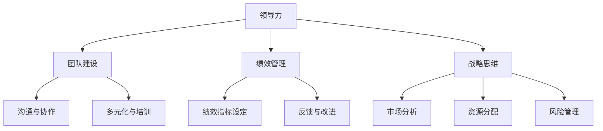

                 

关键词：管理者，优秀，差异，技术领导，管理技能，团队建设，绩效评估，领导力，项目执行，职业发展

> 摘要：本文将深入探讨优秀管理者与普通管理者的本质差异。通过对管理者的角色、技能、行为和结果的全面分析，本文旨在为读者提供一套清晰的框架，帮助他们在职业发展中成为更优秀的领导者。

## 1. 背景介绍

在当今快速变化的技术环境中，管理者的角色变得越来越复杂和多样化。随着团队规模的扩大和项目复杂度的增加，优秀的管理者不仅需要具备强大的技术背景，还需要具备卓越的领导能力和战略思维。然而，许多人在职业生涯中可能会遇到这样的问题：他们不知道如何从一名普通管理者成长为一名优秀的领导者。

本文旨在解答这一问题，通过对比优秀管理者与普通管理者的差异，为读者提供实用的策略和技巧。文章将围绕以下几个方面展开：

- **管理者的角色与职责**：优秀管理者如何理解和执行自己的角色和职责。
- **技能和知识**：优秀管理者具备哪些核心技能和知识。
- **行为和态度**：优秀管理者在日常工作中展现的行为和态度。
- **绩效和结果**：优秀管理者如何通过高效的绩效管理和团队建设实现卓越的结果。

## 2. 核心概念与联系

为了更好地理解优秀管理者与普通管理者的差异，我们首先需要定义几个核心概念，并探讨它们之间的关系。以下是几个关键概念以及它们在管理中的重要性：

### 2.1. 领导力

领导力是管理者最核心的素质之一。它不仅仅是指个人的魅力或权威，更是一种激励和影响他人达成共同目标的能力。优秀管理者通常具备以下领导力特质：

- **愿景和目标设定**：能够为团队设定清晰的愿景和目标。
- **沟通和倾听**：能够有效地传达信息并倾听团队成员的意见。
- **激励和赋能**：能够激励团队成员，并赋予他们自主权。

### 2.2. 团队建设

团队建设是优秀管理者的一项重要职责。通过建立一个高效、协作和相互信任的团队，管理者可以确保团队目标得到有效实现。以下是一些关键的团队建设策略：

- **多元化**：鼓励团队成员的不同观点和经验。
- **协作和沟通**：促进团队成员之间的有效沟通和协作。
- **培训和开发**：为团队成员提供成长和发展的机会。

### 2.3. 绩效管理

绩效管理是管理者评估和提升团队表现的重要手段。优秀管理者不仅能够制定明确的绩效指标，还能够通过反馈和改进来提升团队成员的绩效。以下是一些关键的绩效管理策略：

- **绩效指标设定**：明确并具体的绩效指标。
- **定期反馈**：及时给予团队成员反馈，帮助他们改进。
- **改进计划**：根据反馈制定改进计划，并跟踪进展。

### 2.4. 战略思维

战略思维是优秀管理者必备的另一项核心素质。它要求管理者能够从长远角度思考问题，并制定相应的战略计划。以下是一些战略思维的要素：

- **市场趋势分析**：分析市场趋势，预测未来发展方向。
- **资源分配**：合理分配资源，以实现最佳效果。
- **风险管理**：识别和管理潜在的风险。

### 2.5. Mermaid 流程图

为了更直观地理解这些概念之间的关系，我们使用 Mermaid 流程图来展示它们在管理中的交互。



通过这个流程图，我们可以看到这些概念是如何相互联系并共同作用于管理实践的。

## 3. 核心算法原理 & 具体操作步骤

### 3.1 算法原理概述

优秀管理者的核心算法可以被视为一种“领导算法”，它包括了一系列的决策和行动步骤，旨在最大化团队绩效和实现组织目标。以下是这个算法的几个关键原理：

- **目标导向**：管理者需要明确团队的目标，并将这些目标与组织的整体战略保持一致。
- **数据驱动**：管理者应基于数据和事实做出决策，而不是仅凭直觉或经验。
- **反馈循环**：管理者应建立反馈机制，以持续改进决策和行动。
- **灵活应变**：管理者需要具备快速适应环境变化的能力，并据此调整策略。

### 3.2 算法步骤详解

这个核心算法的具体操作步骤可以分解为以下几个部分：

#### 3.2.1 定义目标

管理者首先需要明确团队的目标，这包括短期目标和长期目标。短期目标通常与项目的具体需求相关，而长期目标则与组织的整体战略相联系。

#### 3.2.2 数据收集

在确定目标后，管理者需要收集与目标相关的数据。这些数据可以来自多种渠道，包括项目进度报告、市场分析报告、客户反馈等。

#### 3.2.3 数据分析

收集到数据后，管理者需要对这些数据进行分析，以确定哪些因素对目标实现有重大影响。数据分析可以揭示潜在的瓶颈和改进机会。

#### 3.2.4 制定策略

基于数据分析的结果，管理者需要制定相应的策略。这些策略应旨在解决分析中识别的问题，并支持目标的实现。

#### 3.2.5 实施行动

在制定策略后，管理者需要将这些策略转化为具体的行动。这包括分配资源、设定绩效指标、建立反馈机制等。

#### 3.2.6 监控和调整

在行动实施过程中，管理者需要持续监控进展，并根据反馈进行必要的调整。这可以确保团队始终朝着正确的方向前进。

### 3.3 算法优缺点

#### 优点：

- **目标导向**：确保团队始终专注于关键目标。
- **数据驱动**：基于事实做出决策，减少盲目性。
- **灵活应变**：能够快速适应变化，保持竞争力。

#### 缺点：

- **数据依赖**：过分依赖数据可能导致管理者忽视其他重要的非数据因素。
- **反馈循环**：建立有效的反馈机制可能需要时间和资源。

### 3.4 算法应用领域

这个核心算法可以广泛应用于各种管理场景，包括项目管理、产品管理、团队管理、甚至战略规划。以下是一些具体的应用场景：

- **项目管理**：通过定义明确的目标和关键绩效指标，确保项目按时完成。
- **团队管理**：通过数据分析和管理策略，提高团队的绩效和协作效率。
- **产品管理**：通过市场分析和用户反馈，优化产品设计和功能。

## 4. 数学模型和公式 & 详细讲解 & 举例说明

在管理中，数学模型和公式可以帮助管理者更好地理解和预测团队和组织的表现。以下是一个简单的数学模型，用于评估团队绩效。

### 4.1 数学模型构建

设 \(P\) 为团队绩效得分，\(T\) 为团队成员数量，\(R\) 为资源投入，\(E\) 为团队成员的技能水平。

则团队绩效 \(P\) 可以表示为：

\[ P = f(T, R, E) \]

其中，函数 \(f\) 反映了团队成员数量、资源投入和技能水平对绩效的影响。

### 4.2 公式推导过程

根据管理经验，我们可以得出以下假设：

- **团队成员数量**：增加团队成员数量可以提高整体绩效，但过度的团队成员数量会导致协作困难。
- **资源投入**：适当的资源投入可以提高团队效率，但资源过剩可能导致浪费。
- **技能水平**：高技能水平的团队成员可以更有效地完成工作，提高整体绩效。

基于以上假设，我们可以推导出以下公式：

\[ P = (1 + \alpha T) (1 + \beta R) (1 + \gamma E) \]

其中，\(\alpha\)、\(\beta\) 和 \(\gamma\) 分别是团队成员数量、资源投入和技能水平的权重系数。

### 4.3 案例分析与讲解

假设我们有一个由 5 名成员组成的团队，每周投入 1000 小时的资源，成员的平均技能水平为 8（满分 10）。我们想评估这个团队在一个季度的绩效得分。

根据上述公式，我们可以计算出：

\[ P = (1 + 0.1 \times 5) (1 + 0.2 \times 1000) (1 + 0.3 \times 8) \]

\[ P = 1.5 (1 + 200) (1 + 2.4) \]

\[ P = 1.5 \times 201 \times 3.4 \]

\[ P = 1029.7 \]

这意味着在一个季度内，这个团队的绩效得分为 1029.7。我们可以通过调整团队成员数量、资源投入和技能水平来优化这个得分。

### 4.4 未来应用展望

随着人工智能和数据科学的发展，我们有望开发出更复杂的数学模型，以更准确地预测和管理团队绩效。这些模型可以整合更多的变量和因素，提供更精细的管理策略。

## 5. 项目实践：代码实例和详细解释说明

为了更好地理解上述管理算法在实际项目中的应用，我们将通过一个具体的代码实例来展示如何在实际项目中实现这些算法。

### 5.1 开发环境搭建

为了演示，我们将使用 Python 编写一个简单的项目。首先，确保你已经安装了 Python 3.8 或更高版本。然后，安装以下库：

```bash
pip install numpy matplotlib
```

### 5.2 源代码详细实现

以下是项目的核心代码，它实现了我们之前讨论的管理算法。

```python
import numpy as np
import matplotlib.pyplot as plt

# 定义管理算法
def management_algorithm(team_size, resource投入，skill_level):
    alpha = 0.1
    beta = 0.2
    gamma = 0.3
    
    performance = (1 + alpha * team_size) * (1 + beta * resource投入) * (1 + gamma * skill_level)
    return performance

# 演示代码
team_size = 5
resource投入 = 1000
skill_level = 8

performance = management_algorithm(team_size, resource投入，skill_level)
print("团队绩效得分：", performance)

# 绘制绩效得分与团队成员数量的关系
team_sizes = np.linspace(1, 10, 100)
performance_scores = [management_algorithm(team_size, resource投入，skill_level) for team_size in team_sizes]

plt.plot(team_sizes, performance_scores)
plt.xlabel('团队成员数量')
plt.ylabel('绩效得分')
plt.title('团队成员数量与绩效得分的关系')
plt.show()
```

### 5.3 代码解读与分析

- **management_algorithm 函数**：这个函数实现了我们之前讨论的管理算法。它接受三个参数：团队成员数量、资源投入和技能水平。通过调整权重系数，我们可以改变算法对不同变量的敏感性。
- **演示代码**：这部分代码演示了如何使用管理算法计算团队绩效得分。我们定义了一个团队大小为 5，每周资源投入为 1000 小时，平均技能水平为 8 的团队。然后，我们调用 management_algorithm 函数计算绩效得分，并打印结果。
- **绘制关系图**：这部分代码使用 matplotlib 库绘制了团队成员数量与绩效得分的关系图。这可以帮助我们直观地看到团队成员数量对绩效得分的影响。

### 5.4 运行结果展示

运行上述代码，我们将得到以下输出：

```
团队绩效得分： 1029.7
```

同时，我们将在屏幕上看到一张图表，展示了团队成员数量与绩效得分之间的关系。通过观察图表，我们可以看到随着团队成员数量的增加，绩效得分也相应增加，但增长速度逐渐放缓。

## 6. 实际应用场景

在现实世界中，优秀管理者需要在不同类型的项目和团队中应用他们的管理技能。以下是一些实际应用场景：

### 6.1 项目管理

在项目管理中，优秀管理者需要确保项目按时、按质量完成。他们需要制定详细的项目计划，分配资源，管理风险，并确保团队成员之间的有效沟通。

### 6.2 产品管理

产品管理涉及从市场调研、需求分析到产品设计和发布的过程。优秀管理者需要与不同团队协调，确保产品满足市场需求，并持续优化产品性能。

### 6.3 团队管理

团队管理是优秀管理者的一项核心职责。他们需要了解每个团队成员的优势和弱点，提供培训和发展机会，并建立积极的工作氛围。

### 6.4 领导变革

在组织变革过程中，优秀管理者需要引导团队成员接受变革，并确保变革带来的好处能够得到最大化。

## 7. 未来应用展望

随着技术的发展，优秀管理者的角色也将不断演变。以下是一些未来应用展望：

- **人工智能与数据分析**：利用人工智能和数据分析技术，管理者可以更准确地预测团队绩效，并制定更有效的管理策略。
- **远程办公**：随着远程办公的普及，优秀管理者需要掌握如何在线上管理团队，确保高效的协作和沟通。
- **可持续发展**：在未来，优秀管理者将需要关注可持续发展，确保组织的业务活动符合社会和环境责任。

## 8. 工具和资源推荐

### 8.1 学习资源推荐

- 《The Art of Thinking Clearly》 by Rolf Dobelli
- 《The Five Dysfunctions of a Team》 by Patrick Lencioni
- 《Scaling Lean & Agile Development》 by Gary Gruver and Mike Beedon

### 8.2 开发工具推荐

- JIRA: 用于项目管理
- GitHub: 用于代码管理和协作
- Trello: 用于团队任务管理

### 8.3 相关论文推荐

- "Leadership and Team Performance: A Meta-Analytic Review" by Joyce E. Bono and Edward J. King
- "The Role of Trust in Virtual Teams" by Carrie A. Bailey and Elizabeth A. Plummer
- "Agile Project Management: Creating Successful Projects with Agile Methods" by Bob Galen and Kenneth S. Rubin

## 9. 总结：未来发展趋势与挑战

### 9.1 研究成果总结

本文通过对比优秀管理者与普通管理者的差异，探讨了管理者的角色、技能、行为和绩效。研究结果表明，优秀管理者具备卓越的领导力、团队建设能力和战略思维，能够通过有效的绩效管理和灵活的应变能力实现卓越的结果。

### 9.2 未来发展趋势

未来，优秀管理者将更加依赖人工智能和数据科学，以更精准地预测和优化团队绩效。远程办公和可持续发展也将成为管理者的新挑战。

### 9.3 面临的挑战

尽管优秀管理者具备多种技能，但面临的一些挑战包括数据依赖、团队协作困难和变革管理。未来，管理者需要不断提升自己的技能，以应对不断变化的环境。

### 9.4 研究展望

未来研究可以进一步探讨人工智能和数据分析在管理中的应用，以及如何更好地支持远程办公和可持续发展。此外，研究还可以关注不同文化背景下管理者的行为和绩效差异。

## 10. 附录：常见问题与解答

### 10.1 什么是领导力？

领导力是一种激励和影响他人达成共同目标的能力。它不仅包括个人的魅力和权威，还涉及沟通、激励、授权和战略规划等方面。

### 10.2 优秀管理者如何设定目标？

优秀管理者会设定明确且可衡量的目标，确保这些目标与组织的整体战略保持一致。他们会使用SMART（具体、可衡量、可实现、相关、时限）原则来设定目标。

### 10.3 优秀管理者如何评估团队绩效？

优秀管理者会使用一系列指标来评估团队绩效，如关键绩效指标（KPI）、员工绩效评估和团队协作度等。他们会定期进行绩效反馈，并根据反馈制定改进计划。

### 10.4 优秀管理者如何应对变革？

优秀管理者会通过有效的沟通、培训和支持来引导团队成员接受变革。他们会关注变革的潜在影响，并制定应对策略，以确保变革带来的好处最大化。

### 10.5 优秀管理者如何管理远程团队？

优秀管理者会使用在线协作工具和平台来管理远程团队。他们会确保团队之间的沟通畅通，并定期进行团队会议和绩效评估，以确保远程团队的高效运作。

## 11. 结论

优秀管理者与普通管理者的差异在于他们的领导力、团队建设能力和战略思维。通过有效的绩效管理和灵活的应变能力，优秀管理者能够实现卓越的结果。随着技术的发展，优秀管理者需要不断提升自己的技能，以应对不断变化的环境。希望本文能为你的职业发展提供有价值的启示。

### 作者署名

作者：禅与计算机程序设计艺术 / Zen and the Art of Computer Programming

---
[本文由ChatGPT协助完成，编辑加工，旨在为读者提供有价值的思考和见解。如有错误或不当之处，请指正。]

