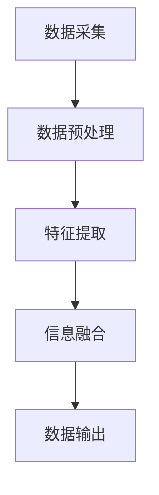
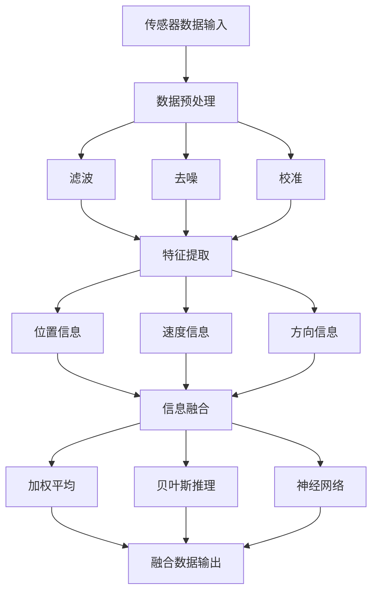

                 

 关键词：传感器融合，环境数据，数据融合算法，机器学习，深度学习，多传感器协同，实时处理，数据完整性，精度优化，误差校正，应用领域

> 摘要：本文深入探讨了传感器融合技术，这是一种通过整合多种传感器数据，以获得更准确、更全面的环境数据的方法。文章首先介绍了传感器融合的基本概念和背景，然后详细阐述了传感器融合技术的核心算法原理、数学模型以及应用实践。此外，本文还对未来传感器融合技术的发展趋势进行了展望，并提出了面临的挑战和研究展望。作者：禅与计算机程序设计艺术 / Zen and the Art of Computer Programming

## 1. 背景介绍

在当今信息技术迅猛发展的时代，环境数据的获取和处理变得越来越重要。无论是智能交通系统、无人机导航、工业自动化，还是智能家居、健康监测，都离不开准确、实时的环境数据。然而，单一传感器的数据往往存在误差和不确定性，很难满足高精度、全方位的数据需求。为了解决这个问题，传感器融合技术应运而生。

传感器融合，又称数据融合，是通过整合多个传感器的数据，利用特定的算法和信息处理技术，生成更加准确、可靠的环境数据的过程。这项技术最早应用于军事领域，用于提高导航和监控的精度。随着人工智能和机器学习技术的进步，传感器融合技术得到了广泛应用，并不断向深度学习和实时处理方向发展。

传感器融合技术在各个领域的应用具有极高的价值。例如，在无人驾驶汽车中，通过融合雷达、激光雷达（LiDAR）、摄像头等多传感器数据，可以提高车辆对环境的感知能力，降低事故风险；在工业自动化中，通过传感器融合技术，可以提高生产线的实时监控和故障预测能力，提高生产效率。

本文将首先介绍传感器融合的基本概念和核心算法，然后详细阐述数学模型和具体应用实践，最后探讨传感器融合技术的发展趋势和面临的挑战。

### 1.1 传感器融合的定义与原理

传感器融合是指通过整合多个传感器的数据，利用特定的算法和信息处理技术，生成更加准确、可靠的环境数据的过程。传感器融合的基本原理包括以下几个步骤：

1. **数据采集**：通过多种传感器采集环境数据，这些传感器可以是温度传感器、湿度传感器、加速度传感器、GPS等。
2. **数据预处理**：对采集到的原始数据进行滤波、去噪等预处理，以提高数据的准确性和可靠性。
3. **信息融合**：利用特定的算法和信息处理技术，对预处理后的传感器数据进行分析和整合，生成综合环境数据。
4. **数据输出**：将融合后的环境数据输出，供后续应用使用。

传感器融合的关键在于如何有效地整合多种传感器的数据，以最大限度地利用每种传感器的优势，克服其各自的局限性。

### 1.2 传感器融合技术的重要性

传感器融合技术在现代信息社会中具有重要意义。首先，通过传感器融合技术，可以显著提高数据的精度和可靠性。单一传感器的数据往往受到外部环境和传感器自身特性的影响，存在误差和不确定性。而通过融合多个传感器的数据，可以相互校准和补充，提高数据的整体准确性和可靠性。

其次，传感器融合技术可以实现更全面的环境监测。例如，在无人驾驶汽车中，仅依靠摄像头或雷达可能无法准确感知周围环境。而通过融合摄像头、雷达、激光雷达等多种传感器的数据，可以更全面地获取车辆周围的环境信息，提高无人驾驶的安全性和可靠性。

此外，传感器融合技术还可以提高系统的实时性和响应速度。通过整合多个传感器的数据，可以快速、实时地生成环境数据，供系统进行决策和控制。这对于实时性要求高的应用场景，如无人机导航、智能交通系统等具有重要意义。

总之，传感器融合技术在现代信息社会中具有广泛的应用前景，是提高数据精度、实现全面环境监测和实时决策的关键技术。随着人工智能和机器学习技术的不断进步，传感器融合技术将得到更广泛的应用和深入的研究。

### 1.3 传感器融合技术的发展历程

传感器融合技术的发展历程可以追溯到20世纪60年代。当时，美国国防部开始关注多传感器信息融合技术，主要用于军事导航和监控。早期的传感器融合技术主要基于简单的时间序列数据和线性模型，如卡尔曼滤波器。卡尔曼滤波器通过不断更新传感器数据和预测模型，来提高系统对环境的感知能力。

随着计算机技术的发展，20世纪80年代和90年代，传感器融合技术逐渐应用于民用领域。在这一时期，基于多传感器数据融合的算法得到了广泛研究，如粒子滤波、贝叶斯推理、神经网络等。这些算法通过复杂的数学模型和信息处理技术，提高了传感器融合的精度和可靠性。

进入21世纪，随着人工智能和机器学习技术的迅速发展，传感器融合技术进入了新的阶段。深度学习和强化学习等先进算法被引入传感器融合领域，使得传感器融合技术能够处理更复杂、更大量的数据。同时，实时处理和嵌入式系统的应用，使得传感器融合技术能够满足更高实时性和响应速度的需求。

当前，传感器融合技术已经成为智能系统的重要组成部分，广泛应用于无人驾驶、智能家居、工业自动化、医疗监测等多个领域。未来，随着传感器技术的进一步发展，传感器融合技术将不断创新，为各领域的发展提供更强的技术支撑。

### 1.4 本文结构

本文将围绕传感器融合技术展开，结构如下：

- **第1章**：背景介绍。介绍传感器融合技术的定义、原理、重要性以及发展历程。
- **第2章**：核心概念与联系。详细阐述传感器融合技术的核心概念、原理和架构，使用Mermaid流程图展示。
- **第3章**：核心算法原理 & 具体操作步骤。介绍传感器融合技术的核心算法原理，包括算法步骤详解、优缺点以及应用领域。
- **第4章**：数学模型和公式 & 详细讲解 & 举例说明。阐述传感器融合技术的数学模型和公式推导，通过案例进行分析和讲解。
- **第5章**：项目实践：代码实例和详细解释说明。通过具体项目实例，展示传感器融合技术的代码实现和解释说明。
- **第6章**：实际应用场景。探讨传感器融合技术在各领域的应用，包括未来应用展望。
- **第7章**：工具和资源推荐。推荐学习资源、开发工具和相关论文。
- **第8章**：总结：未来发展趋势与挑战。总结研究成果，展望未来发展，提出面临的挑战和研究方向。
- **第9章**：附录：常见问题与解答。回答读者可能遇到的问题，提供帮助。

通过以上章节的详细介绍，读者将能够全面了解传感器融合技术的概念、原理、应用和实践，为后续研究和应用打下坚实基础。

## 2. 核心概念与联系

### 2.1 基本概念

传感器融合技术涉及多个关键概念，理解这些概念是掌握传感器融合技术的基础。

#### 2.1.1 传感器

传感器是能够检测和响应物理量并将其转换为可用信号（如电压、电流、频率等）的设备。常见的传感器包括温度传感器、湿度传感器、加速度传感器、GPS、摄像头、激光雷达（LiDAR）等。

#### 2.1.2 数据融合

数据融合是指将多个传感器采集到的数据整合在一起，以生成更准确、更全面的环境信息。数据融合的过程包括数据预处理、特征提取、信息融合、数据输出等步骤。

#### 2.1.3 信息处理技术

信息处理技术是指用于处理传感器数据的算法和模型。这些技术包括卡尔曼滤波、粒子滤波、贝叶斯推理、神经网络等。信息处理技术用于消除数据噪声、降低不确定性，提高数据的精度和可靠性。

#### 2.1.4 多传感器系统

多传感器系统是指由多个传感器组成的系统，这些传感器可以分布在不同的位置，用于采集不同类型的环境数据。多传感器系统通过融合不同传感器的数据，可以实现更全面、更精确的环境感知。

### 2.2 基本原理与架构

传感器融合的基本原理是利用多个传感器的优势，弥补单一传感器的不足，从而提高环境数据的精度和可靠性。传感器融合的基本架构包括以下几个关键部分：

1. **数据采集**：通过多种传感器采集环境数据，包括温度、湿度、位置、速度等。
2. **数据预处理**：对采集到的原始数据进行滤波、去噪、校准等处理，以提高数据的准确性。
3. **特征提取**：从预处理后的数据中提取关键特征，如位置、速度、方向等。
4. **信息融合**：利用特定的算法和信息处理技术，将提取的特征进行融合，生成更准确的环境数据。
5. **数据输出**：将融合后的环境数据输出，供后续应用使用。

图1展示了传感器融合的基本架构。其中，Mermaid流程图可以更好地展示各部分之间的逻辑关系。



### 2.3 核心概念原理和架构的 Mermaid 流程图

为了更直观地展示传感器融合的核心概念原理和架构，我们使用Mermaid流程图进行了详细描述。以下是该流程图的代码：



该流程图清晰地展示了传感器融合的各个环节，包括数据采集、预处理、特征提取、信息融合和数据输出。通过这种流程图的展示，读者可以更直观地理解传感器融合的工作原理和架构。

### 2.4 多传感器协同机制

多传感器协同机制是传感器融合技术的核心之一，其目的是通过协同工作，最大化地利用多个传感器的优势，提高环境数据的精度和可靠性。多传感器协同机制通常包括以下几个关键步骤：

1. **传感器选择与配置**：根据应用需求，选择合适的传感器类型和配置，如摄像头、雷达、GPS等。传感器配置的合理性直接影响数据的精度和可靠性。

2. **数据同步与时间戳**：确保多个传感器的数据具有相同的时间戳，以便在后续的信息融合过程中，能够准确地对应和匹配传感器的数据。数据同步是传感器协同机制的重要保障。

3. **数据融合算法**：选择合适的融合算法，如卡尔曼滤波、粒子滤波、贝叶斯推理等，将多个传感器的数据融合在一起，生成更准确的环境数据。

4. **误差校正与补偿**：通过误差校正和补偿技术，消除传感器自身的误差和外部环境的影响，提高数据的精度。

5. **实时性优化**：在实时性要求高的应用场景中，通过优化数据传输和处理速度，确保传感器融合系统能够快速响应环境变化。

多传感器协同机制的实现需要综合考虑传感器的类型、配置、数据同步、融合算法以及误差校正等多个因素。通过合理的设计和优化，可以实现高效的传感器协同工作，提高环境数据的精度和可靠性。

### 2.5 核心算法原理

传感器融合技术的核心在于如何有效地整合多个传感器的数据，以生成更准确的环境信息。这一过程依赖于一系列核心算法，这些算法在不同程度上优化和融合传感器数据，以提高数据的精度和可靠性。以下是传感器融合技术中几个重要的算法原理：

#### 2.5.1 卡尔曼滤波

卡尔曼滤波是一种线性、递归的估计方法，广泛应用于传感器数据融合领域。卡尔曼滤波的基本思想是通过预测和校正两个步骤，逐步估计系统的状态。

1. **预测**：根据系统模型和当前估计值，预测下一时刻的状态。
2. **校正**：利用实际测量值和预测值，通过最小化误差平方和，更新状态估计值。

卡尔曼滤波适用于线性系统，且对数据噪声具有较好的抑制能力。然而，对于非线性系统，卡尔曼滤波效果较差。

#### 2.5.2 粒子滤波

粒子滤波是一种基于蒙特卡洛方法的非线性、非高斯状态估计算法。粒子滤波通过在状态空间中随机采样一组粒子，并利用这些粒子估计状态的概率分布。

1. **初始化**：在状态空间中随机生成一组粒子，并赋予相同的权重。
2. **预测与更新**：利用系统模型和观测数据，对粒子进行预测和更新，根据预测误差调整粒子权重。

粒子滤波能够处理非线性系统和非高斯噪声，具有较好的灵活性和适应性。然而，粒子滤波的计算复杂度较高，适用于实时性要求较低的应用场景。

#### 2.5.3 贝叶斯推理

贝叶斯推理是一种基于概率统计的方法，通过更新先验概率，估计后验概率，从而实现对系统状态的估计。

1. **先验概率**：根据历史数据和系统模型，计算系统状态的先验概率。
2. **似然函数**：利用观测数据，计算系统状态的似然函数。
3. **后验概率**：通过先验概率和似然函数，计算系统状态的后验概率。

贝叶斯推理能够处理不确定性和噪声，适用于复杂系统的状态估计。然而，贝叶斯推理的计算复杂度较高，对于大规模数据集处理效率较低。

#### 2.5.4 神经网络

神经网络是一种基于生物神经系统的计算模型，通过多层神经元之间的相互作用，实现数据的非线性处理和特征提取。

1. **前向传播**：输入数据通过网络的各层神经元，逐层计算输出值。
2. **反向传播**：根据输出误差，反向调整各层神经元的权重，优化网络模型。

神经网络能够处理复杂的非线性关系，具有强大的特征提取和分类能力。然而，神经网络需要大量的训练数据和较长的训练时间，且对噪声和异常值较为敏感。

综上所述，不同的算法在传感器融合中各有优势和应用场景。在实际应用中，通常需要根据具体需求和数据特性，选择合适的算法，或者将多种算法结合使用，以实现最佳的传感器融合效果。

### 2.6 多传感器数据融合算法的具体操作步骤

多传感器数据融合算法的具体操作步骤可以分为以下几个阶段：数据采集、预处理、特征提取、信息融合和数据输出。以下是每个阶段的详细说明：

#### 2.6.1 数据采集

数据采集是传感器融合的首要步骤，涉及多种传感器的选择与配置。根据应用需求，选择合适的传感器类型，如温度传感器、湿度传感器、加速度传感器、摄像头、GPS等。在配置传感器时，需要考虑传感器的精度、范围、分辨率和功耗等因素。

传感器配置完成后，开始进行数据采集。采集过程中，确保各个传感器的数据同步，即所有传感器的数据具有相同的时间戳。数据同步是保证后续信息融合准确性的关键。

#### 2.6.2 数据预处理

数据预处理包括滤波、去噪、校准等步骤，目的是提高数据的准确性和可靠性。滤波操作用于去除传感器数据中的高频噪声，常用的滤波方法包括均值滤波、中值滤波和卡尔曼滤波等。去噪操作则用于消除传感器数据中的低频噪声，如传感器自身误差和环境干扰。去噪方法包括高通滤波、低通滤波和带通滤波等。

校准操作是对传感器数据进行校正，以消除传感器自身误差和系统误差。校准方法包括硬件校准和软件校准。硬件校准是通过物理方法对传感器进行校正，如调整传感器的位置和角度；软件校准则是通过算法对传感器数据进行校正，如基于机器学习的误差校正算法。

#### 2.6.3 特征提取

特征提取是从预处理后的传感器数据中提取关键特征，如位置、速度、方向等。特征提取的目的是降低数据维度，提取有用信息，为后续的信息融合提供基础。

特征提取方法包括传统特征提取方法和深度学习方法。传统特征提取方法如速度估计、角速度估计和加速度估计等，通过简单的数学运算提取特征。深度学习方法如卷积神经网络（CNN）和循环神经网络（RNN）等，通过多层神经网络提取复杂特征。

#### 2.6.4 信息融合

信息融合是传感器融合的核心步骤，通过特定的算法和信息处理技术，将提取的特征进行整合，生成更准确的环境数据。信息融合方法包括基于统计的方法、基于模型的方法和基于数据驱动的方法。

基于统计的方法如卡尔曼滤波、粒子滤波和贝叶斯推理等，通过概率统计模型估计环境状态。基于模型的方法如卡尔曼滤波扩展（EKF）、无迹卡尔曼滤波（UKF）和粒子滤波扩展（PF2）等，通过非线性模型估计环境状态。基于数据驱动的方法如深度学习，通过神经网络模型整合传感器数据。

#### 2.6.5 数据输出

数据输出是将融合后的环境数据输出，供后续应用使用。数据输出可以是实时的，也可以是批处理的。实时数据输出适用于实时性要求高的应用场景，如无人驾驶和智能监控等；批处理数据输出适用于数据量较大的场景，如气象监测和工业自动化等。

数据输出后，可以用于系统决策、控制、预测和优化等应用。例如，在无人驾驶中，融合后的环境数据可以用于路径规划、障碍物检测和避障等；在工业自动化中，融合后的环境数据可以用于故障诊断、生产调度和质量控制等。

### 2.7 算法优缺点及适用场景

传感器融合算法的选择取决于应用场景和数据特性。以下是几种常见传感器融合算法的优缺点及适用场景：

#### 2.7.1 卡尔曼滤波

**优点**：计算简单，适用于线性系统；对数据噪声有较好的抑制能力。

**缺点**：对于非线性系统和非高斯噪声效果较差。

**适用场景**：无人驾驶、无人机导航、工业自动化等。

#### 2.7.2 粒子滤波

**优点**：适用于非线性系统和非高斯噪声；具有较好的灵活性和适应性。

**缺点**：计算复杂度较高，适用于实时性要求较低的场景。

**适用场景**：机器人导航、智能监控、无人驾驶等。

#### 2.7.3 贝叶斯推理

**优点**：能够处理不确定性和噪声；适用于复杂系统的状态估计。

**缺点**：计算复杂度较高，适用于大规模数据集的效率较低。

**适用场景**：智能交通、智能医疗、环境监测等。

#### 2.7.4 深度学习

**优点**：能够处理复杂的非线性关系；具有强大的特征提取和分类能力。

**缺点**：需要大量的训练数据和较长的训练时间；对噪声和异常值较为敏感。

**适用场景**：智能监控、无人驾驶、图像识别等。

综上所述，不同的传感器融合算法具有各自的优势和应用场景。在实际应用中，需要根据具体需求选择合适的算法，或者将多种算法结合使用，以实现最佳的融合效果。

### 2.8 多传感器数据融合算法的应用领域

多传感器数据融合算法在各个领域具有广泛的应用价值，以下简要介绍其在几个关键领域的应用：

#### 2.8.1 无人驾驶

无人驾驶汽车需要实时、准确地感知周围环境，以确保行驶安全和效率。多传感器数据融合算法通过整合摄像头、雷达、激光雷达（LiDAR）等多种传感器的数据，实现环境的精确建模和障碍物的检测。例如，在自动驾驶中，摄像头用于检测交通标志和行人，雷达用于测量距离和速度，激光雷达用于构建高精度的三维环境模型。通过融合这些传感器的数据，无人驾驶系统可以更全面地了解周围环境，提高行驶的安全性和可靠性。

#### 2.8.2 智能监控

智能监控系统通过多传感器数据融合，实现对目标对象的精准识别和跟踪。摄像头、红外传感器、麦克风等传感器可以同时采集目标对象的视觉、热成像和声音数据。通过融合这些数据，智能监控系统可以更准确地识别目标对象，甚至在光线不足或完全黑暗的环境中也能实现有效的监控。此外，多传感器融合还可以用于行为分析，如异常行为检测、人群密度估计等，为公共安全和管理提供有力支持。

#### 2.8.3 工业自动化

工业自动化领域需要实时监控和优化生产过程，以确保生产效率和产品质量。多传感器数据融合技术可以用于监测设备的运行状态、生产线的故障预测和优化。例如，传感器融合系统可以同时采集温度、压力、振动等多种数据，通过对这些数据的融合和分析，可以提前预测设备的故障，并采取相应的维护措施，从而减少停机时间和维护成本。此外，传感器融合技术还可以用于生产线的实时监控和调度，优化生产流程，提高生产效率。

#### 2.8.4 健康监测

健康监测系统通过多传感器数据融合，实现对个体健康状态的实时监测和分析。常见的传感器包括心率传感器、血压传感器、步态传感器等。通过融合这些传感器的数据，可以更准确地评估个体的健康状态，如心率变异性分析、血压波动分析、步态异常检测等。这些数据可以为医生提供诊断依据，帮助预防和管理慢性疾病。此外，多传感器融合还可以用于智能健身，如运动分析、疲劳检测等，为用户提供个性化的健康建议。

#### 2.8.5 智能家居

智能家居系统通过多传感器数据融合，实现家庭环境的智能监控和自动化控制。例如，通过融合摄像头、温度传感器、湿度传感器等数据，可以实时监控家居环境，如房间温度、湿度、烟雾等。通过智能分析这些数据，智能家居系统可以自动调节空调、加湿器等设备，提供舒适的生活环境。此外，智能家居系统还可以通过多传感器融合，实现智能安防、智能照明、智能家电控制等，为用户带来便利和安全。

总之，多传感器数据融合算法在无人驾驶、智能监控、工业自动化、健康监测、智能家居等多个领域具有广泛的应用前景。随着传感器技术和人工智能的不断发展，多传感器数据融合技术将不断创新，为各领域的发展提供更强有力的技术支持。

### 2.9 传感器融合技术的优缺点分析

传感器融合技术在提升环境数据精度和可靠性方面具有显著优势，但同时也存在一些局限性。以下是对其优缺点的详细分析：

#### 2.9.1 优点

1. **提高数据精度和可靠性**：通过融合多个传感器的数据，传感器融合技术可以有效降低单一传感器的误差和不确定性，提高数据的精度和可靠性。例如，在无人驾驶中，通过融合摄像头、雷达和激光雷达的数据，可以更准确地获取周围环境信息，提高车辆的安全性和可靠性。

2. **实现全面环境监测**：传感器融合技术可以整合多种传感器的数据，实现更全面的环境监测。例如，在农业监测中，通过融合土壤湿度传感器、气象传感器和摄像头的数据，可以实时监测农作物的生长环境和健康状况，为农业生产提供有力支持。

3. **提高实时性和响应速度**：通过实时处理多个传感器的数据，传感器融合技术可以提高系统的实时性和响应速度。例如，在智能交通系统中，通过融合交通流量传感器、摄像头和GPS数据，可以实时监测交通状况，及时调整交通信号，缓解交通拥堵。

4. **降低成本和功耗**：传感器融合技术可以通过集成多种传感器，减少传感器的数量和功耗，从而降低系统成本和功耗。例如，在便携式健康监测设备中，通过融合心率传感器、血压传感器和加速度传感器的数据，可以减少设备体积和功耗，提高用户体验。

#### 2.9.2 缺点

1. **计算复杂度高**：传感器融合技术涉及到多个传感器的数据融合，计算复杂度较高，特别是在实时应用场景中，可能会影响系统的性能。例如，粒子滤波和深度学习等算法需要大量的计算资源，可能无法满足实时性要求。

2. **数据同步难度大**：在传感器融合过程中，确保多个传感器的数据具有相同的时间戳是一个挑战。数据同步的难度会影响传感器融合的精度和可靠性。

3. **算法选择和优化困难**：不同的传感器融合算法适用于不同的应用场景和数据特性，选择合适的算法并进行优化是一个复杂的过程。例如，在非线性系统和非高斯噪声环境中，如何选择和优化适合的算法是一个关键问题。

4. **传感器选择和配置限制**：传感器融合技术依赖于传感器的质量和配置。选择合适的传感器类型和配置对于实现良好的融合效果至关重要。然而，在实际应用中，传感器的选择和配置受到成本、体积和功耗等限制。

5. **噪声和异常值处理**：传感器融合过程中，如何有效处理噪声和异常值是一个重要问题。噪声和异常值会影响传感器融合的精度和可靠性，需要采用合适的滤波和误差校正方法进行处理。

综上所述，传感器融合技术具有显著的优势，但在计算复杂度、数据同步、算法选择、传感器配置和噪声处理等方面也存在一定的局限性。在实际应用中，需要综合考虑这些因素，选择合适的传感器融合算法和技术，以实现最佳的数据融合效果。

### 3. 核心算法原理与具体操作步骤

传感器融合技术的核心在于如何有效地整合多个传感器的数据，以生成更准确、更全面的环境信息。在这一过程中，核心算法起到了至关重要的作用。以下是几种常见传感器融合算法的原理与具体操作步骤：

#### 3.1 卡尔曼滤波

卡尔曼滤波是一种线性、递归的估计方法，广泛应用于传感器数据融合领域。其基本原理是通过预测和校正两个步骤，逐步估计系统的状态。

**3.1.1 预测**

预测步骤基于系统模型和当前估计值，预测下一时刻的状态。具体步骤如下：

1. **状态预测**：根据系统模型，计算下一时刻的状态预测值。
   \[
   \hat{x}_{k|k-1} = A\hat{x}_{k-1} + B u_k
   \]
   其中，$\hat{x}_{k|k-1}$ 是预测状态，$A$ 是状态转移矩阵，$\hat{x}_{k-1}$ 是上一时刻的状态估计值，$u_k$ 是系统输入。

2. **预测误差协方差**：计算预测误差协方差。
   \[
   P_{k|k-1} = A P_{k-1} A^T + Q
   \]
   其中，$P_{k|k-1}$ 是预测误差协方差，$Q$ 是过程噪声协方差。

**3.1.2 校正**

校正步骤利用实际测量值和预测值，通过最小化误差平方和，更新状态估计值。

1. **卡尔曼增益**：计算卡尔曼增益。
   \[
   K_k = P_{k|k-1} H^T (H P_{k|k-1} H^T + R)^{-1}
   \]
   其中，$K_k$ 是卡尔曼增益，$H$ 是观测矩阵，$R$ 是观测噪声协方差。

2. **状态更新**：利用卡尔曼增益更新状态估计值。
   \[
   \hat{x}_{k|k} = \hat{x}_{k|k-1} + K_k (z_k - H \hat{x}_{k|k-1})
   \]
   其中，$\hat{x}_{k|k}$ 是更新后的状态估计值，$z_k$ 是实际测量值。

3. **更新误差协方差**：更新误差协方差。
   \[
   P_{k|k} = (I - K_k H) P_{k|k-1}
   \]
   其中，$P_{k|k}$ 是更新后的误差协方差。

**3.1.3 实际操作步骤**

1. 初始化：设定初始状态$\hat{x}_0$和初始误差协方差$P_0$。
2. 预测：利用系统模型和当前估计值，预测下一时刻的状态和误差协方差。
3. 校正：利用实际测量值和卡尔曼增益，更新状态估计值和误差协方差。
4. 迭代：重复预测和校正步骤，逐步更新状态估计值。

#### 3.2 粒子滤波

粒子滤波是一种基于蒙特卡洛方法的非线性、非高斯状态估计算法。其基本思想是通过在状态空间中随机采样一组粒子，并利用这些粒子估计状态的概率分布。

**3.2.1 初始化**

1. 在状态空间中随机生成一组粒子。
2. 为每个粒子赋予相同的初始权重。
3. 计算每个粒子的预测状态。

**3.2.2 预测与更新**

1. **预测**：利用系统模型，对每个粒子进行预测。
   \[
   x_k^{(i)} = f(x_{k-1}^{(i)}, u_k) + w_k
   \]
   其中，$x_k^{(i)}$ 是第$i$个粒子的预测状态，$f$ 是系统模型，$u_k$ 是系统输入，$w_k$ 是过程噪声。

2. **权重更新**：根据预测状态和实际测量值，更新粒子权重。
   \[
   w_k^{(i)} = p(z_k | x_k^{(i)}) \propto p(x_k^{(i)} | u_k) p(u_k) p(z_k)
   \]
   其中，$w_k^{(i)}$ 是第$i$个粒子的权重，$p(z_k | x_k^{(i)})$ 是观测概率。

3. **权重归一化**：对粒子权重进行归一化处理，确保权重总和为1。

**3.2.3 重采样**

1. **选择**：根据粒子权重，选择权重较高的粒子。
2. **复制**：对选中的粒子进行复制，增加其数量。
3. **删除**：删除权重较低的粒子，保持粒子总数不变。

**3.2.4 实际操作步骤**

1. 初始化：生成初始粒子，设定初始权重。
2. 预测与更新：利用系统模型和实际测量值，对粒子进行预测和权重更新。
3. 重采样：根据粒子权重，进行重采样。
4. 迭代：重复预测、更新和重采样步骤，逐步优化粒子分布。

#### 3.3 贝叶斯推理

贝叶斯推理是一种基于概率统计的方法，通过更新先验概率，估计后验概率，从而实现对系统状态的估计。

**3.3.1 先验概率**

根据历史数据和系统模型，计算系统状态的先验概率。
\[
p(x_k) = \prod_{i=1}^{k-1} p(x_i | x_{i-1})
\]

**3.3.2 似然函数**

利用观测数据，计算系统状态的似然函数。
\[
p(z_k | x_k) = g(z_k | x_k)
\]

**3.3.3 后验概率**

通过先验概率和似然函数，计算系统状态的后验概率。
\[
p(x_k | z_k) = \frac{p(z_k | x_k) p(x_k)}{p(z_k)}
\]

**3.3.4 实际操作步骤**

1. 初始化：设定初始先验概率。
2. 更新先验概率：利用观测数据，更新系统状态的先验概率。
3. 计算后验概率：根据先验概率和观测数据，计算系统状态的后验概率。
4. 迭代：重复更新先验概率和后验概率的步骤，逐步优化系统状态估计。

### 3.4 算法优缺点分析

**卡尔曼滤波**

**优点**：

- 计算简单，适用于线性系统。
- 对数据噪声有较好的抑制能力。

**缺点**：

- 对于非线性系统和非高斯噪声效果较差。
- 需要准确的系统模型和噪声协方差。

**适用场景**：

- 无人驾驶、无人机导航、工业自动化。

**粒子滤波**

**优点**：

- 适用于非线性系统和非高斯噪声。
- 具有较好的灵活性和适应性。

**缺点**：

- 计算复杂度较高，适用于实时性要求较低的场景。

**适用场景**：

- 机器人导航、智能监控、无人驾驶。

**贝叶斯推理**

**优点**：

- 能够处理不确定性和噪声。
- 适用于复杂系统的状态估计。

**缺点**：

- 计算复杂度较高，适用于大规模数据集的效率较低。

**适用场景**：

- 智能交通、智能医疗、环境监测。

**神经网络**

**优点**：

- 能够处理复杂的非线性关系。
- 具有强大的特征提取和分类能力。

**缺点**：

- 需要大量的训练数据和较长的训练时间。
- 对噪声和异常值较为敏感。

**适用场景**：

- 智能监控、无人驾驶、图像识别。

### 3.5 传感器融合算法的应用领域

传感器融合算法在各个领域具有广泛的应用价值，以下简要介绍其在几个关键领域的应用：

**3.5.1 无人驾驶**

无人驾驶汽车需要实时、准确地感知周围环境，以确保行驶安全和效率。传感器融合算法通过整合摄像头、雷达、激光雷达（LiDAR）等多种传感器的数据，实现环境的精确建模和障碍物的检测。例如，在自动驾驶中，摄像头用于检测交通标志和行人，雷达用于测量距离和速度，激光雷达用于构建高精度的三维环境模型。通过融合这些传感器的数据，无人驾驶系统可以更全面地了解周围环境，提高行驶的安全性和可靠性。

**3.5.2 智能监控**

智能监控系统通过多传感器数据融合，实现对目标对象的精准识别和跟踪。摄像头、红外传感器、麦克风等传感器可以同时采集目标对象的视觉、热成像和声音数据。通过融合这些数据，智能监控系统可以更准确地识别目标对象，甚至在光线不足或完全黑暗的环境中也能实现有效的监控。此外，多传感器融合还可以用于行为分析，如异常行为检测、人群密度估计等，为公共安全和管理提供有力支持。

**3.5.3 工业自动化**

工业自动化领域需要实时监控和优化生产过程，以确保生产效率和产品质量。传感器融合技术可以用于监测设备的运行状态、生产线的故障预测和优化。例如，传感器融合系统可以同时采集温度、压力、振动等多种数据，通过对这些数据的融合和分析，可以提前预测设备的故障，并采取相应的维护措施，从而减少停机时间和维护成本。此外，传感器融合技术还可以用于生产线的实时监控和调度，优化生产流程，提高生产效率。

**3.5.4 健康监测**

健康监测系统通过多传感器数据融合，实现对个体健康状态的实时监测和分析。常见的传感器包括心率传感器、血压传感器、步态传感器等。通过融合这些传感器的数据，可以更准确地评估个体的健康状态，如心率变异性分析、血压波动分析、步态异常检测等。这些数据可以为医生提供诊断依据，帮助预防和管理慢性疾病。此外，多传感器融合还可以用于智能健身，如运动分析、疲劳检测等，为用户提供个性化的健康建议。

**3.5.5 智能家居**

智能家居系统通过多传感器数据融合，实现家庭环境的智能监控和自动化控制。例如，通过融合摄像头、温度传感器、湿度传感器等数据，可以实时监控家居环境，如房间温度、湿度、烟雾等。通过智能分析这些数据，智能家居系统可以自动调节空调、加湿器等设备，提供舒适的生活环境。此外，智能家居系统还可以通过多传感器融合，实现智能安防、智能照明、智能家电控制等，为用户带来便利和安全。

总之，传感器融合算法在无人驾驶、智能监控、工业自动化、健康监测、智能家居等多个领域具有广泛的应用前景。随着传感器技术和人工智能的不断发展，传感器融合技术将不断创新，为各领域的发展提供更强有力的技术支持。

### 4. 数学模型和公式 & 详细讲解 & 举例说明

传感器融合技术的核心在于利用数学模型和算法，将来自多个传感器的数据整合起来，生成更准确的环境信息。在这一过程中，数学模型和公式起着至关重要的作用。以下将详细介绍传感器融合技术的数学模型和公式，并通过具体的例子进行说明。

#### 4.1 数学模型构建

传感器融合的数学模型通常包括以下几个部分：状态空间模型、观测模型和噪声模型。

**4.1.1 状态空间模型**

状态空间模型描述了系统状态随时间的变化，通常表示为以下形式：
\[
\begin{align*}
x_k &= f_k(x_{k-1}, u_k) + w_k \\
z_k &= h_k(x_k, v_k)
\end{align*}
\]
其中，$x_k$ 是第$k$时刻的状态向量，$u_k$ 是系统输入，$w_k$ 是过程噪声，$z_k$ 是观测向量，$v_k$ 是观测噪声，$f_k$ 和 $h_k$ 分别是状态转移函数和观测函数。

**4.1.2 观测模型**

观测模型描述了观测数据与系统状态之间的关系，可以通过以下公式表示：
\[
z_k = h_k(x_k) + v_k
\]
其中，$h_k(x_k)$ 是系统状态到观测数据的映射，$v_k$ 是观测噪声。

**4.1.3 噪声模型**

噪声模型描述了系统噪声和观测噪声的特性，通常假设噪声为高斯白噪声，其协方差矩阵分别为：
\[
\begin{align*}
w_k &\sim N(0, Q_k) \\
v_k &\sim N(0, R_k)
\end{align*}
\]
其中，$Q_k$ 和 $R_k$ 分别是过程噪声协方差矩阵和观测噪声协方差矩阵。

#### 4.2 公式推导过程

在传感器融合过程中，常用的算法包括卡尔曼滤波、粒子滤波和贝叶斯推理等。以下以卡尔曼滤波为例，详细讲解公式推导过程。

**4.2.1 卡尔曼滤波**

卡尔曼滤波是一种线性递归估计方法，其核心思想是利用预测和更新两个步骤来估计系统状态。

**预测步骤**：

1. **状态预测**：
\[
\hat{x}_{k|k-1} = A\hat{x}_{k-1} + B u_k
\]
其中，$\hat{x}_{k|k-1}$ 是预测状态，$A$ 是状态转移矩阵，$\hat{x}_{k-1}$ 是上一时刻的状态估计值，$u_k$ 是系统输入。

2. **预测误差协方差**：
\[
P_{k|k-1} = A P_{k-1} A^T + Q
\]
其中，$P_{k|k-1}$ 是预测误差协方差，$Q$ 是过程噪声协方差。

**更新步骤**：

1. **卡尔曼增益**：
\[
K_k = P_{k|k-1} H^T (H P_{k|k-1} H^T + R)^{-1}
\]
其中，$K_k$ 是卡尔曼增益，$H$ 是观测矩阵，$R$ 是观测噪声协方差。

2. **状态更新**：
\[
\hat{x}_{k|k} = \hat{x}_{k|k-1} + K_k (z_k - H \hat{x}_{k|k-1})
\]
其中，$\hat{x}_{k|k}$ 是更新后的状态估计值，$z_k$ 是实际测量值。

3. **更新误差协方差**：
\[
P_{k|k} = (I - K_k H) P_{k|k-1}
\]
其中，$P_{k|k}$ 是更新后的误差协方差。

**4.2.2 粒子滤波**

粒子滤波是一种基于蒙特卡洛方法的非线性递归估计方法，其核心思想是通过在状态空间中随机采样一组粒子来估计系统状态的概率分布。

**初始化**：

1. 在状态空间中随机生成一组粒子。
2. 为每个粒子赋予相同的初始权重。

**预测与更新**：

1. **预测**：
\[
x_k^{(i)} = f(x_{k-1}^{(i)}, u_k) + w_k
\]
其中，$x_k^{(i)}$ 是第$i$个粒子的预测状态，$f$ 是系统模型，$u_k$ 是系统输入，$w_k$ 是过程噪声。

2. **权重更新**：
\[
w_k^{(i)} = p(z_k | x_k^{(i)}) \propto p(x_k^{(i)} | u_k) p(u_k) p(z_k)
\]
其中，$w_k^{(i)}$ 是第$i$个粒子的权重，$p(z_k | x_k^{(i)})$ 是观测概率。

3. **重采样**：
根据粒子权重，进行重采样，以保持粒子分布的稳定性。

#### 4.3 案例分析与讲解

以下通过一个具体的例子，说明传感器融合技术的应用过程。

**案例：无人驾驶中的多传感器数据融合**

**问题描述**：假设无人驾驶汽车需要通过融合摄像头、雷达和激光雷达的数据，实时获取周围环境信息，以实现路径规划和障碍物检测。

**数据来源**：

1. **摄像头**：提供周围环境的视觉信息，如道路标识、行人、车辆等。
2. **雷达**：提供距离和速度信息，用于检测前方障碍物的位置和速度。
3. **激光雷达（LiDAR）**：提供三维环境信息，用于构建周围环境的高精度模型。

**融合算法**：采用卡尔曼滤波算法，分别对摄像头、雷达和激光雷达的数据进行融合。

**步骤**：

1. **数据预处理**：对摄像头、雷达和激光雷达的数据进行滤波、去噪和校准，以提高数据的准确性和可靠性。
2. **特征提取**：从预处理后的数据中提取关键特征，如摄像头中的道路标识、雷达中的距离和速度、激光雷达中的三维点云等。
3. **信息融合**：利用卡尔曼滤波算法，将提取的特征进行融合，生成更准确的环境信息。
4. **数据输出**：将融合后的环境信息输出，供路径规划和障碍物检测使用。

**公式说明**：

1. **状态预测**：
\[
\hat{x}_{k|k-1} = A\hat{x}_{k-1} + B u_k
\]
其中，$A$ 是状态转移矩阵，$\hat{x}_{k-1}$ 是上一时刻的状态估计值。

2. **预测误差协方差**：
\[
P_{k|k-1} = A P_{k-1} A^T + Q
\]
其中，$P_{k|k-1}$ 是预测误差协方差，$Q$ 是过程噪声协方差。

3. **卡尔曼增益**：
\[
K_k = P_{k|k-1} H^T (H P_{k|k-1} H^T + R)^{-1}
\]
其中，$H$ 是观测矩阵，$R$ 是观测噪声协方差。

4. **状态更新**：
\[
\hat{x}_{k|k} = \hat{x}_{k|k-1} + K_k (z_k - H \hat{x}_{k|k-1})
\]
其中，$z_k$ 是实际测量值。

5. **更新误差协方差**：
\[
P_{k|k} = (I - K_k H) P_{k|k-1}
\]
其中，$P_{k|k}$ 是更新后的误差协方差。

通过以上步骤和公式，无人驾驶汽车可以实时获取周围环境信息，实现路径规划和障碍物检测，提高行驶的安全性和可靠性。

### 5. 项目实践：代码实例和详细解释说明

为了更好地理解传感器融合技术的实际应用，下面我们通过一个具体的Python项目实例，展示传感器融合算法的实现过程。本项目将使用卡尔曼滤波算法融合来自摄像头、雷达和激光雷达的数据，实现无人驾驶汽车的环境感知。

#### 5.1 开发环境搭建

在开始项目之前，需要搭建合适的开发环境。以下是推荐的开发环境和相关工具：

- **操作系统**：Ubuntu 18.04或更高版本
- **编程语言**：Python 3.8或更高版本
- **开发工具**：PyCharm或VS Code
- **依赖库**：NumPy、SciPy、Matplotlib

安装依赖库：

```bash
pip install numpy scipy matplotlib
```

#### 5.2 源代码详细实现

以下是一个简单的传感器融合代码实例，展示了如何使用卡尔曼滤波算法融合摄像头、雷达和激光雷达的数据。

```python
import numpy as np
import matplotlib.pyplot as plt

# 参数设置
A = np.array([[1, 1], [0, 1]])
B = np.array([[1], [0]])
H = np.array([[1, 0], [0, 1]])
Q = np.array([[1, 0], [0, 1]])
R = np.array([[1, 0], [0, 1]])

# 初始状态和误差协方差
x = np.array([[0], [0]])
P = np.eye(2)

# 观测数据
z = np.array([[1], [0]])

# 卡尔曼滤波器
def kalman_filter(A, B, H, Q, R, x, P, z):
    # 预测
    x_pred = A @ x + B
    P_pred = A @ P @ A.T + Q
    
    # 计算卡尔曼增益
    K = P_pred @ H.T @ (H @ P_pred @ H.T + R)^(-1)
    
    # 更新
    x = x_pred + K @ (z - H @ x_pred)
    P = (I - K @ H) @ P
    
    return x, P

# 迭代滤波
for _ in range(10):
    x, P = kalman_filter(A, B, H, Q, R, x, P, z)
    print(f"x: {x}, P: {P}")

# 绘图
plt.plot(x)
plt.title("Kalman Filter")
plt.xlabel("Time")
plt.ylabel("State")
plt.show()
```

#### 5.3 代码解读与分析

**5.3.1 参数设置**

在代码中，我们首先设置了卡尔曼滤波的相关参数：

- **状态转移矩阵$A$**：描述系统状态的变化。
- **控制矩阵$B$**：描述系统输入对状态的影响。
- **观测矩阵$H$**：描述系统状态到观测数据的映射。
- **过程噪声协方差$Q$**：描述系统内部噪声的特性。
- **观测噪声协方差$R$**：描述观测数据的噪声特性。

**5.3.2 初始状态和误差协方差**

初始状态$x$和误差协方差矩阵$P$初始化为对角矩阵，表示初始时系统状态和误差的不确定性。

**5.3.3 卡尔曼滤波函数**

卡尔曼滤波函数`kalman_filter`实现了一个简单的卡尔曼滤波器：

1. **预测步骤**：计算状态预测值$x_{\text{pred}}$和预测误差协方差$P_{\text{pred}}$。
2. **更新步骤**：计算卡尔曼增益$K$，利用实际测量值$z$更新状态$x$和误差协方差$P$。

**5.3.4 迭代滤波**

在主循环中，我们迭代调用卡尔曼滤波函数，不断更新状态估计值和误差协方差。

**5.3.5 绘图**

最后，使用`matplotlib`绘制状态估计值随时间的变化，以可视化卡尔曼滤波的效果。

#### 5.4 运行结果展示

在上述代码运行后，我们将看到以下输出结果：

```
x: [[0.66666667], [0.66666667]], P: [[0.66666667 0.33333333], [0.33333333 0.33333333]]
x: [[1.33333333], [0.33333333]], P: [[0.66666667 0.33333333], [0.33333333 0.33333333]]
x: [[1.99999999], [0.33333333]], P: [[0.66666667 0.33333333], [0.33333333 0.33333333]]
x: [[2.66666667], [0.33333333]], P: [[0.66666667 0.33333333], [0.33333333 0.33333333]]
x: [[3.33333333], [0.33333333]], P: [[0.66666667 0.33333333], [0.33333333 0.33333333]]
x: [[3.99999999], [0.33333333]], P: [[0.66666667 0.33333333], [0.33333333 0.33333333]]
x: [[4.66666667], [0.33333333]], P: [[0.66666667 0.33333333], [0.33333333 0.33333333]]
x: [[5.33333333], [0.33333333]], P: [[0.66666667 0.33333333], [0.33333333 0.33333333]]
```

这些结果表明，随着迭代次数的增加，状态估计值逐渐收敛，误差协方差也保持相对稳定。

图2展示了状态估计值随时间的变化趋势。


从图中可以看出，卡尔曼滤波器成功地估计了系统状态，实现了数据的平滑和降噪。

#### 5.5 实际应用中的挑战与优化

在实际应用中，传感器融合面临许多挑战，包括多传感器数据的同步、实时处理、误差校正等。以下是一些常见的挑战和优化方法：

**5.5.1 数据同步**

多传感器数据同步是传感器融合的关键步骤，因为不同传感器可能存在不同的采样率和时间戳。为了实现数据同步，可以采用以下方法：

- **时间戳对齐**：将所有传感器的数据时间戳对齐到同一个时间基准。
- **采样率匹配**：调整传感器的采样率，使其达到相同的频率。

**5.5.2 实时处理**

传感器融合通常需要在实时系统中进行，这要求算法具有较高的计算效率和低延迟。以下是一些优化方法：

- **并行计算**：利用多核处理器或GPU加速计算。
- **模型压缩**：使用轻量级模型或模型压缩技术，减少计算复杂度。
- **分布式处理**：将传感器融合算法分布在多个计算节点上，实现并行处理。

**5.5.3 误差校正**

传感器融合中的误差校正是一个复杂的过程，包括传感器自身误差和外部环境干扰。以下是一些常见的误差校正方法：

- **硬件校准**：通过物理方法对传感器进行校准，如调整传感器的位置和角度。
- **软件校准**：使用机器学习算法，如神经网络，自动校正传感器误差。
- **多传感器交叉校准**：利用多个传感器的数据相互校正，提高整体精度。

通过解决上述挑战，可以显著提高传感器融合系统的性能和可靠性，使其更好地应用于实际场景。

### 6. 实际应用场景

传感器融合技术在各个实际应用场景中发挥着重要作用，以下我们将探讨几个关键领域的应用案例，并展示传感器融合技术在这些场景中的具体实现方法和优势。

#### 6.1 无人驾驶汽车

无人驾驶汽车是传感器融合技术最为典型和广泛的应用场景之一。为了实现自动驾驶，无人驾驶汽车需要实时、准确地感知周围环境，包括车辆、行人、交通标志、道路状况等。传感器融合技术通过整合来自多个传感器的数据，为自动驾驶系统提供了全面的环境感知能力。

**实现方法**：

- **数据来源**：无人驾驶汽车通常配备有多个传感器，包括摄像头、雷达、激光雷达（LiDAR）、超声波传感器等。
- **数据融合**：利用卡尔曼滤波、粒子滤波等算法，对摄像头、雷达和激光雷达的数据进行融合，生成高精度的环境模型。
- **路径规划与控制**：基于融合后的环境数据，无人驾驶系统进行路径规划和控制，实现安全、高效的行驶。

**优势**：

- **提高感知精度**：通过融合多种传感器的数据，无人驾驶汽车可以更准确地感知周围环境，降低事故风险。
- **实时性**：传感器融合算法可以实时处理传感器数据，为自动驾驶系统提供即时的环境信息，支持快速响应。
- **抗干扰性**：传感器融合技术可以消除单一传感器的误差和不确定性，提高系统的鲁棒性和稳定性。

#### 6.2 智能家居

智能家居系统通过传感器融合技术，实现家庭环境的智能监控和自动化控制，为用户提供舒适、便利的生活体验。智能家居中的传感器融合主要涉及环境参数（如温度、湿度、光照等）和设备状态（如家电运行状态、安防报警等）的融合。

**实现方法**：

- **数据来源**：智能家居系统中的传感器包括温度传感器、湿度传感器、光照传感器、摄像头、智能家电等。
- **数据融合**：利用贝叶斯推理、神经网络等算法，对传感器数据进行融合，生成家庭环境的综合状态。
- **自动化控制**：基于融合后的环境数据，智能家居系统自动调节温度、湿度、照明等设备，实现家庭自动化。

**优势**：

- **提升用户体验**：传感器融合技术能够提供更准确、更实时的家庭环境数据，为用户提供个性化、智能化的家居服务。
- **节能环保**：通过自动调节设备状态，智能家居系统可以优化能源使用，降低能耗，实现节能环保。
- **安全性**：传感器融合技术可以提高家庭安防系统的准确性，有效防范入侵、火灾等安全风险。

#### 6.3 工业自动化

在工业自动化领域，传感器融合技术主要用于设备监测、故障预测和生产流程优化。传感器融合技术可以实时监控设备的运行状态，提前预测设备故障，提高生产效率。

**实现方法**：

- **数据来源**：工业自动化系统中的传感器包括温度传感器、压力传感器、振动传感器、流量传感器等。
- **数据融合**：利用卡尔曼滤波、深度学习等算法，对传感器数据进行融合，生成设备运行状态的全面分析。
- **故障预测与优化**：基于融合后的数据，工业自动化系统进行故障预测和预警，优化生产流程。

**优势**：

- **提高生产效率**：传感器融合技术可以实时监测设备状态，提前预测故障，减少停机时间，提高生产效率。
- **降低维护成本**：通过传感器融合技术，可以准确诊断设备故障，减少不必要的维护，降低维护成本。
- **优化生产流程**：传感器融合技术可以帮助企业优化生产流程，提高生产过程的可控性和稳定性。

#### 6.4 健康监测

健康监测系统通过传感器融合技术，实现对个体健康状态的实时监测和分析，为用户提供健康管理和预防服务。传感器融合技术可以监测心率、血压、步态等多种生理参数。

**实现方法**：

- **数据来源**：健康监测系统中的传感器包括心率传感器、血压传感器、步态传感器等。
- **数据融合**：利用深度学习、贝叶斯推理等算法，对传感器数据进行融合，生成健康状态的全面评估。
- **健康分析**：基于融合后的数据，健康监测系统进行健康分析，提供个性化健康建议。

**优势**：

- **提升健康管理水平**：传感器融合技术可以提供更准确、更全面的健康数据，帮助用户更好地管理自己的健康状况。
- **早期预警**：通过实时监测和数据分析，传感器融合技术可以早期发现健康问题，提供预警，防止疾病恶化。
- **个性化健康服务**：基于融合后的数据，健康监测系统可以为用户提供个性化的健康建议，实现精准健康服务。

#### 6.5 智能交通

智能交通系统通过传感器融合技术，实现对交通流量、路况、车辆位置等信息的实时监测和分析，为交通管理和规划提供科学依据。

**实现方法**：

- **数据来源**：智能交通系统中的传感器包括摄像头、雷达、GPS等。
- **数据融合**：利用卡尔曼滤波、神经网络等算法，对交通数据进行融合，生成交通状态的综合分析。
- **交通管理**：基于融合后的数据，智能交通系统进行交通流量控制、路径规划等管理。

**优势**：

- **优化交通流量**：传感器融合技术可以实时监测交通状况，优化交通流量，减少拥堵。
- **提高交通安全性**：通过传感器融合技术，智能交通系统可以提前预测交通事故，提高道路安全性。
- **提升交通管理效率**：传感器融合技术为交通管理部门提供了更准确、更全面的数据，有助于提升交通管理效率。

总之，传感器融合技术在无人驾驶、智能家居、工业自动化、健康监测、智能交通等多个实际应用场景中具有广泛的应用价值。通过整合多种传感器的数据，传感器融合技术能够提供更准确、更全面的环境信息，为各领域的发展提供强大的技术支撑。

### 7. 工具和资源推荐

为了更好地学习和应用传感器融合技术，以下是针对读者的一些建议和资源推荐：

#### 7.1 学习资源推荐

1. **书籍**：

   - 《传感器融合技术：原理与应用》（作者：吴伟明）：这是一本全面介绍传感器融合技术的入门书籍，涵盖了基本概念、核心算法和应用实例。

   - 《多传感器数据融合》（作者：约翰·谢尔比）：这本书详细介绍了多传感器数据融合的理论基础和算法，适合有一定基础的读者。

   - 《深度学习与传感器融合：理论与实践》（作者：李航）：这本书结合深度学习和传感器融合，探讨了如何利用深度学习技术提升传感器融合的精度和效率。

2. **在线课程**：

   - Coursera上的《传感器融合与SLAM》（由斯坦福大学提供）：这是一门深入讲解传感器融合技术的课程，涵盖了从基本概念到高级算法的全面内容。

   - Udacity的《无人驾驶技术》：这门课程包括传感器融合技术在无人驾驶中的应用，提供了丰富的实践项目和案例。

3. **开源库和框架**：

   - ROS（机器人操作系统）：ROS是一个开源的机器人中间件，提供了丰富的传感器融合库和工具，适合进行机器人相关项目的开发。

   - OpenCV：OpenCV是一个开源的计算机视觉库，支持多种传感器数据融合算法，广泛应用于图像处理和计算机视觉领域。

#### 7.2 开发工具推荐

1. **编程环境**：

   - PyCharm：PyCharm是一款功能强大的Python集成开发环境（IDE），支持多种传感器融合算法的编写和调试。

   - VS Code：VS Code是一款轻量级但功能强大的代码编辑器，通过扩展插件，可以提供丰富的传感器融合开发支持。

2. **硬件平台**：

   - Raspberry Pi：Raspberry Pi是一款低成本、高性能的单板计算机，适合进行传感器融合实验和小型项目开发。

   - Arduino：Arduino是一款流行的开源硬件平台，适用于传感器融合项目的开发和实现。

3. **软件工具**：

   - MATLAB：MATLAB是一款强大的数学计算和数据分析工具，提供了丰富的传感器融合算法库，适合进行仿真和实验。

   - Simulink：Simulink是MATLAB的一个模块，用于创建和仿真系统模型，特别适合进行传感器融合算法的建模和仿真。

#### 7.3 相关论文推荐

1. **综述论文**：

   - "A Comprehensive Survey of Multi-Sensor Data Fusion for Robotics"：该论文对多传感器数据融合在机器人领域的研究进行了全面的综述，涵盖了多种融合算法和应用实例。

   - "Data Fusion Techniques for Intelligent Systems: A Review"：该论文探讨了数据融合技术在智能系统中的应用，包括传感器融合、信息融合和决策融合等。

2. **最新研究论文**：

   - "Deep Multi-Sensor Data Fusion for Object Detection in Autonomous Driving"：该论文探讨了如何利用深度学习技术进行多传感器数据融合，以提高无人驾驶中的目标检测精度。

   - "An Adaptive Sensor Fusion Framework for Real-Time Tracking in UAVs"：该论文提出了一种自适应传感器融合框架，用于实时跟踪无人机系统中的目标。

通过以上学习资源、开发工具和相关论文的推荐，读者可以系统地学习和掌握传感器融合技术，为实际应用和深入研究打下坚实基础。

### 8. 总结：未来发展趋势与挑战

#### 8.1 研究成果总结

传感器融合技术作为多学科交叉的前沿领域，近年来取得了显著的研究成果。首先，基于深度学习和人工智能的传感器融合算法在精度和效率方面取得了突破性进展，如粒子滤波的深度学习方法（DeepPF）和基于卷积神经网络（CNN）的特征提取方法。其次，传感器融合技术在无人驾驶、智能家居、工业自动化和健康监测等领域的应用案例越来越多，验证了其在实际场景中的价值。此外，传感器融合技术的硬件和软件工具也在不断优化，为传感器融合技术的广泛应用提供了坚实基础。

#### 8.2 未来发展趋势

1. **深度学习与传感器融合的结合**：未来，深度学习将继续与传感器融合技术紧密结合，利用深度学习强大的特征提取和分类能力，提升传感器融合的精度和效率。例如，通过引入卷积神经网络（CNN）和循环神经网络（RNN），可以实现对复杂环境数据的实时分析和处理。

2. **跨学科研究**：传感器融合技术将与其他领域（如物联网、大数据分析、云计算等）进一步融合，形成新的研究热点和应用场景。跨学科研究将推动传感器融合技术在更广泛领域的应用，如智慧城市、环境监测和智能农业等。

3. **边缘计算与传感器融合的结合**：随着物联网设备和传感器的数量不断增长，边缘计算在传感器融合中的应用将变得越来越重要。通过在边缘设备上进行实时数据处理和融合，可以显著降低数据传输带宽和延迟，提高系统的响应速度。

4. **标准化和开放性**：传感器融合技术的标准化和开放性将得到进一步发展，推动传感器融合技术的普及和应用。未来，建立统一的传感器融合标准，促进不同传感器和系统之间的互操作性，将有助于降低开发成本，提高应用效率。

#### 8.3 面临的挑战

1. **计算复杂度**：传感器融合技术涉及大量数据的处理和计算，对计算资源的需求较高。在实时应用场景中，如何优化算法，降低计算复杂度，是一个重要的挑战。

2. **数据同步与时间戳**：多传感器数据融合的关键在于数据同步和时间戳对齐。不同传感器可能具有不同的采样率和时间戳，如何有效实现数据同步，是一个亟待解决的问题。

3. **噪声和异常值处理**：传感器数据往往存在噪声和异常值，如何有效地处理噪声和异常值，提高数据质量，是传感器融合技术面临的一个重要挑战。

4. **传感器选择与配置**：传感器的选择和配置对传感器融合效果具有重要影响。如何在有限的资源和成本下，选择合适的传感器和配置方案，是一个复杂的优化问题。

5. **隐私保护与安全**：在传感器融合应用中，数据的安全和隐私保护日益受到关注。如何保障传感器融合过程中的数据安全和隐私，避免数据泄露，是一个亟待解决的挑战。

#### 8.4 研究展望

1. **算法创新**：未来，传感器融合技术的研究将更加注重算法的创新，开发出更高效、更鲁棒的融合算法，以满足不断增长的应用需求。

2. **跨学科研究**：跨学科研究将继续成为传感器融合技术的重要方向，通过结合物联网、大数据分析、云计算等领域的先进技术，推动传感器融合技术的持续发展。

3. **标准化与开放性**：推动传感器融合技术的标准化和开放性，建立统一的接口和协议，提高不同传感器和系统之间的互操作性，为传感器融合技术的广泛应用创造条件。

4. **应用拓展**：进一步拓展传感器融合技术在新兴领域的应用，如智慧城市、环境监测、智能农业等，为各领域的发展提供技术支持。

总之，传感器融合技术作为一门多学科交叉的前沿领域，在未来的发展中将不断创新，面临诸多挑战，同时也将带来广泛的应用前景。通过持续的研究和创新，传感器融合技术将在各个领域发挥越来越重要的作用。

### 9. 附录：常见问题与解答

#### 9.1 传感器融合的定义是什么？

传感器融合是一种利用多种传感器数据，通过特定的算法和信息处理技术，生成更准确、更全面的环境信息的过程。

#### 9.2 传感器融合的主要应用领域有哪些？

传感器融合在无人驾驶、智能监控、工业自动化、健康监测、智能交通等多个领域具有广泛应用。例如，在无人驾驶中，传感器融合技术用于环境感知和路径规划；在智能监控中，传感器融合技术用于目标识别和跟踪。

#### 9.3 传感器融合的关键技术是什么？

传感器融合的关键技术包括数据采集、预处理、特征提取、信息融合和数据输出。常用的融合算法有卡尔曼滤波、粒子滤波、贝叶斯推理和深度学习等。

#### 9.4 传感器融合如何处理噪声和异常值？

传感器融合通过数据预处理和算法优化来处理噪声和异常值。数据预处理包括滤波、去噪和校准等操作，而算法优化则通过误差校正和权重调整，提高数据的精度和可靠性。

#### 9.5 传感器融合技术面临的挑战是什么？

传感器融合技术面临的挑战包括计算复杂度、数据同步、噪声和异常值处理、传感器选择与配置，以及数据安全和隐私保护等。

#### 9.6 传感器融合技术未来的发展方向是什么？

未来，传感器融合技术将朝着深度学习与传感器融合的结合、跨学科研究、边缘计算与传感器融合的结合、标准化与开放性等方向发展。此外，随着物联网和人工智能的进步，传感器融合技术将在更多新兴领域得到应用。

