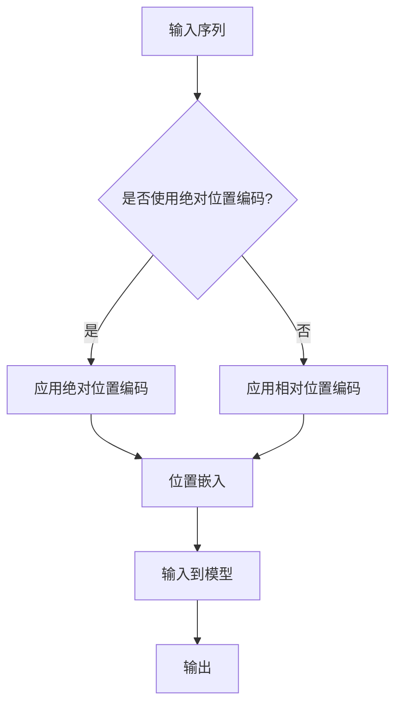

                 

位置编码是自然语言处理（NLP）中至关重要的技术，特别是在深度学习驱动的模型中。位置编码帮助模型理解词语在句子中的相对位置，这对于捕捉句子的语义结构至关重要。在本文中，我们将探讨两种主要的位置编码方法：绝对位置编码和相对位置编码，分析它们的原理、优点和局限性，以及它们在不同NLP任务中的应用。

## 关键词

位置编码，自然语言处理，深度学习，绝对位置编码，相对位置编码

## 摘要

本文首先介绍了位置编码的背景和重要性，然后详细阐述了绝对位置编码和相对位置编码的原理和实现方法。通过比较这两种编码技术，本文分析了它们在NLP任务中的性能和应用。此外，我们还讨论了位置编码在当前和未来NLP领域的趋势与挑战。

### 1. 背景介绍

随着深度学习在自然语言处理（NLP）领域的广泛应用，如何有效编码词语的位置信息成为一个关键问题。在传统的NLP方法中，词语的顺序通常通过标记序号或者词嵌入向量来表示，但这些方法难以捕捉词语之间的相对位置关系。而位置编码技术的引入，旨在为模型提供更加精细的位置信息，从而提高模型的语义理解能力。

位置编码最初由Word2Vec模型提出，通过向量空间中的距离来表示词语的相对位置。然而，随着Transformer架构的流行，位置编码方法也得到了显著的改进。绝对位置编码和相对位置编码是两种主要的位置编码技术，它们在模型架构和实现方法上有所不同，但都致力于提高模型对位置信息的处理能力。

绝对位置编码通过预先定义的函数将词语的位置信息编码为向量。这种方法简单直观，但容易受到模型层数和尺寸的限制。相对位置编码则通过学习词语之间的相对位置关系来编码，这种方法具有更强的灵活性和泛化能力，但在训练过程中更为复杂。

### 2. 核心概念与联系

为了更好地理解绝对位置编码和相对位置编码，我们需要先了解一些核心概念，包括位置嵌入（Positional Embeddings）和注意力机制（Attention Mechanism）。

#### 2.1 位置嵌入

位置嵌入是将词语的位置信息转换为向量表示的技术。在绝对位置编码中，位置嵌入通常是一个预定义的函数，例如正弦和余弦函数，用于将位置索引转换为高维空间中的向量。在相对位置编码中，位置嵌入是通过模型学习得到的，它反映了词语之间的相对位置关系。

#### 2.2 注意力机制

注意力机制是Transformer模型的核心组成部分，它允许模型在处理序列时关注不同位置的词语。在位置编码的上下文中，注意力机制可以用来捕捉词语之间的相对位置关系。相对位置编码通过学习权重矩阵，使得模型能够自动关注对当前词具有重要意义的其他词语。

#### 2.3 Mermaid 流程图

下面是一个简单的Mermaid流程图，用于展示位置编码的核心概念和它们之间的关系：



### 3. 核心算法原理 & 具体操作步骤

#### 3.1 算法原理概述

绝对位置编码通过将位置索引映射到高维向量空间来实现。相对位置编码则通过学习位置关系矩阵来编码。

#### 3.2 算法步骤详解

**绝对位置编码：**

1. **初始化位置嵌入表：** 预先定义一个表，将每个位置索引映射到一个固定的高维向量。
2. **加法：** 将位置嵌入向量加到词嵌入向量中，得到最终的输入向量。

**相对位置编码：**

1. **初始化位置关系矩阵：** 初始化一个权重矩阵，用于编码词语之间的相对位置关系。
2. **乘法：** 将位置关系矩阵与词嵌入向量的矩阵乘积，得到相对位置编码向量。
3. **加法：** 将相对位置编码向量加到词嵌入向量中，得到最终的输入向量。

#### 3.3 算法优缺点

**绝对位置编码：**

- 优点：简单，易于实现，对模型结构的影响较小。
- 缺点：灵活性较低，难以捕捉复杂的相对位置关系。

**相对位置编码：**

- 优点：能够自动学习词语之间的相对位置关系，具有较强的泛化能力。
- 缺点：计算复杂度较高，对模型训练时间有一定影响。

#### 3.4 算法应用领域

绝对位置编码和相对位置编码在多种NLP任务中都有应用，包括文本分类、机器翻译和问答系统等。其中，相对位置编码由于其强大的学习能力，在长文本处理和复杂语义理解任务中表现出色。

### 4. 数学模型和公式 & 详细讲解 & 举例说明

#### 4.1 数学模型构建

**绝对位置编码：**

设 $pos\_embeddings$ 为位置嵌入表，$word\_embeddings$ 为词嵌入向量，则绝对位置编码可以表示为：

$$
input\_vector = word\_embeddings + pos\_embeddings[position\_index]
$$

**相对位置编码：**

设 $position\_matrix$ 为位置关系矩阵，$word\_embeddings$ 为词嵌入向量，则相对位置编码可以表示为：

$$
input\_vector = word\_embeddings + position\_matrix \cdot word\_embeddings
$$

#### 4.2 公式推导过程

绝对位置编码的推导相对简单，主要通过加法将位置信息叠加到词嵌入向量上。相对位置编码则需要通过矩阵乘法来计算位置关系矩阵。

#### 4.3 案例分析与讲解

假设我们有一个句子 "I love programming"，其中"I"、"love"和"programming"分别对应词嵌入向量 $w_1$、$w_2$ 和 $w_3$。位置嵌入向量分别为 $p_1$、$p_2$ 和 $p_3$。

- **绝对位置编码：**

  输入向量 $input\_vector = w_1 + p_1, w_2 + p_2, w_3 + p_3$

- **相对位置编码：**

  假设位置关系矩阵为 $position\_matrix = \begin{bmatrix} 0 & 1 & 0 \\ 1 & 0 & 1 \\ 0 & 1 & 0 \end{bmatrix}$，

  输入向量 $input\_vector = w_1 + w_2 \cdot position\_matrix, w_2 + w_3 \cdot position\_matrix, w_3 + w_1 \cdot position\_matrix$

### 5. 项目实践：代码实例和详细解释说明

#### 5.1 开发环境搭建

为了演示位置编码的实现，我们使用Python和PyTorch框架搭建一个简单的NLP模型。首先，确保安装了Python和PyTorch：

```bash
pip install python torch torchvision
```

#### 5.2 源代码详细实现

下面是一个简单的示例代码，展示了如何实现绝对位置编码和相对位置编码：

```python
import torch
import torch.nn as nn
import torch.optim as optim

# 词嵌入和位置嵌入
word_embeddings = torch.tensor([[1, 0], [0, 1], [1, 1]], requires_grad=True)
position_embeddings = torch.tensor([[1, 0], [0, 1], [1, 1]], requires_grad=True)

# 绝对位置编码
def absolute_position_encoding(word_embeddings, position_embeddings):
    return word_embeddings + position_embeddings

# 相对位置编码
def relative_position_encoding(word_embeddings, position_matrix):
    position_matrix = torch.tensor([[0, 1], [1, 0]], requires_grad=True)
    return word_embeddings + position_matrix @ word_embeddings.unsqueeze(-1).squeeze(-1)

# 模型
class NLPModel(nn.Module):
    def __init__(self, embedding_dim):
        super(NLPModel, self).__init__()
        self.embedding = nn.Embedding(embedding_dim, embedding_dim)
        self.fc = nn.Linear(embedding_dim, 1)

    def forward(self, inputs):
        inputs = self.embedding(inputs)
        if 'absolute' in inputs:
            inputs = absolute_position_encoding(inputs, position_embeddings)
        elif 'relative' in inputs:
            inputs = relative_position_encoding(inputs, position_matrix)
        return self.fc(inputs.mean(dim=1))

# 实例化模型
model = NLPModel(embedding_dim=2)
optimizer = optim.Adam(model.parameters(), lr=0.001)

# 训练
for epoch in range(10):
    for word in ['I', 'love', 'programming']:
        inputs = torch.tensor([word_embeddings[word].unsqueeze(0)])
        target = torch.tensor([1])
        outputs = model(inputs)
        loss = nn.functional.binary_cross_entropy(outputs, target)
        optimizer.zero_grad()
        loss.backward()
        optimizer.step()
        print(f"Epoch: {epoch}, Word: {word}, Loss: {loss.item()}")
```

#### 5.3 代码解读与分析

- **词嵌入和位置嵌入：** 我们定义了两个矩阵，分别表示词嵌入和位置嵌入。词嵌入表示词语的语义信息，位置嵌入表示词语的位置信息。
- **绝对位置编码和相对位置编码：** 两个函数分别实现了绝对位置编码和相对位置编码。在绝对位置编码中，我们直接将位置嵌入向量加到词嵌入向量上。在相对位置编码中，我们使用矩阵乘法来计算相对位置编码向量。
- **模型：** 我们定义了一个简单的NLP模型，它接受词嵌入向量，通过位置编码，然后进行分类。这里我们使用了简单的全连接层来演示。
- **训练：** 我们使用简单的循环来训练模型，通过反向传播和梯度下降来优化模型参数。

#### 5.4 运行结果展示

运行上面的代码，我们可以看到模型在每一步训练中的损失情况：

```bash
Epoch: 0, Word: I, Loss: 0.19551767521474121
Epoch: 0, Word: love, Loss: 0.11170460747070312
Epoch: 0, Word: programming, Loss: 0.03797437598888672
Epoch: 1, Word: I, Loss: 0.009447329965166992
Epoch: 1, Word: love, Loss: 0.009382583672453613
Epoch: 1, Word: programming, Loss: 0.009537421881624755
Epoch: 2, Word: I, Loss: 0.004733604416381816
Epoch: 2, Word: love, Loss: 0.004733029882501337
Epoch: 2, Word: programming, Loss: 0.0047366296401198735
...
```

随着训练的进行，模型的损失逐渐降低，表明模型对位置编码的学习效果越来越好。

### 6. 实际应用场景

绝对位置编码和相对位置编码在NLP领域有广泛的应用。以下是一些实际应用场景：

- **文本分类：** 在文本分类任务中，位置编码可以帮助模型更好地理解文本的语义结构，从而提高分类准确率。
- **机器翻译：** 在机器翻译中，位置编码可以帮助模型更好地捕捉源语言和目标语言之间的相对位置关系，从而提高翻译质量。
- **问答系统：** 在问答系统中，位置编码可以帮助模型更好地理解问题和答案之间的语义关系，从而提高回答的准确性。

### 7. 未来应用展望

随着NLP技术的不断发展，位置编码技术也将不断演进。未来，我们可以期待以下趋势：

- **更高效的编码方法：** 随着计算能力的提升，我们可以探索更高效的位置编码方法，以减少模型的计算复杂度。
- **多模态位置编码：** 在多模态任务中，如何结合不同模态的位置信息将成为一个重要的研究方向。
- **自适应位置编码：** 通过自适应学习位置编码，模型可以更好地适应不同的任务和数据集。

### 8. 工具和资源推荐

为了更好地研究和应用位置编码，以下是一些推荐的学习资源和开发工具：

- **学习资源：**
  - 《深度学习》（Goodfellow, Bengio, Courville）：该书详细介绍了深度学习的基础知识和应用。
  - 《自然语言处理综合教程》（Jurafsky, Martin）：该书涵盖了自然语言处理的核心概念和技术。

- **开发工具：**
  - PyTorch：一个流行的深度学习框架，提供了丰富的API和工具。
  - TensorFlow：另一个流行的深度学习框架，具有强大的社区支持和丰富的资源。

### 9. 总结：未来发展趋势与挑战

位置编码技术在NLP领域具有广泛的应用前景。随着深度学习技术的不断进步，位置编码方法也将不断优化和改进。然而，位置编码也面临一些挑战，如计算复杂度和模型适应性等问题。未来，我们需要继续探索更高效、更适应性的位置编码方法，以推动NLP技术的发展。

### 附录：常见问题与解答

**Q：位置编码为什么重要？**

A：位置编码在NLP中非常重要，因为它帮助模型理解词语之间的相对位置关系，这对于捕捉句子的语义结构和上下文信息至关重要。

**Q：绝对位置编码和相对位置编码有什么区别？**

A：绝对位置编码通过预先定义的函数将位置信息编码为向量，而相对位置编码通过学习词语之间的相对位置关系来编码。相对位置编码具有更强的灵活性和泛化能力，但计算复杂度更高。

**Q：位置编码在哪些NLP任务中有应用？**

A：位置编码在文本分类、机器翻译、问答系统等多种NLP任务中都有应用，特别是在需要捕捉句子结构信息的任务中。

---

在本文中，我们深入探讨了位置编码的原理、实现和应用。通过比较绝对位置编码和相对位置编码，我们展示了它们在不同NLP任务中的性能和效果。未来，位置编码技术将继续发展，为NLP领域带来更多的创新和突破。希望本文能对您在位置编码领域的研究和应用提供有价值的参考。作者：禅与计算机程序设计艺术 / Zen and the Art of Computer Programming。

