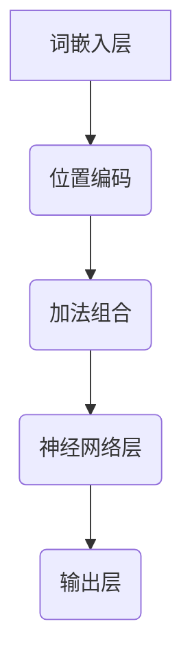

                 

关键词：位置编码，序列信息，自然语言处理，神经网络，机器学习

> 摘要：位置编码在自然语言处理中扮演着至关重要的角色。本文将深入探讨位置编码的概念、重要性及其在神经网络中的应用，帮助读者理解如何在模型中保持序列信息，提升模型性能。

## 1. 背景介绍

在自然语言处理（NLP）领域，处理文本序列是一个基础且关键的任务。无论是文本分类、情感分析，还是机器翻译，都需要对输入的文本序列进行有效的建模。传统的神经网络模型，如循环神经网络（RNN）和长短时记忆网络（LSTM），通过隐藏状态来捕捉序列中的信息。然而，这些方法在处理长序列时存在梯度消失或梯度爆炸的问题，难以有效捕捉长距离依赖关系。

为了解决这些问题，位置编码的概念应运而生。位置编码旨在将文本中的每个单词或字符转化为一个固定大小的向量，并在向量空间中嵌入位置信息。这样，模型不仅能够捕捉单词或字符的语义信息，还能够捕捉它们在序列中的位置信息。

## 2. 核心概念与联系

### 2.1 位置编码的定义

位置编码（Positional Encoding）是一种将序列中的位置信息编码到向量中的方法。在处理自然语言时，位置编码可以补充单词或字符本身的信息，使其能够体现其在序列中的位置。

### 2.2 位置编码的必要性

由于神经网络模型无法直接处理序列的顺序信息，位置编码成为了一种必要的手段。通过位置编码，模型可以在向量空间中直接操作序列，从而更有效地学习序列中的依赖关系。

### 2.3 位置编码与语义信息的结合

位置编码不仅能够捕捉序列中的位置信息，还能够与单词或字符的语义信息相结合。这样，模型不仅可以理解单词或字符的含义，还可以理解它们在序列中的相对位置和顺序。

### 2.4 位置编码的 Mermaid 流程图



在上图中，词嵌入层将文本序列转换为词向量，位置编码层为每个词向量添加位置信息，加法组合层将词向量和位置编码相加，神经网络层对组合后的向量进行建模，最后输出层生成模型的预测结果。

## 3. 核心算法原理 & 具体操作步骤

### 3.1 算法原理概述

位置编码算法的核心思想是利用一种可学习的函数将位置信息编码到向量中。常见的位置编码方法包括：

1. **绝对位置编码**：直接使用数字表示的位置信息，如1, 2, 3, ...。
2. **正弦和余弦编码**：使用正弦和余弦函数来生成位置编码，以避免重复和线性问题。

### 3.2 算法步骤详解

1. **初始化词嵌入矩阵**：使用预训练的词嵌入（如Word2Vec、GloVe）初始化词嵌入矩阵。
2. **添加位置编码**：为每个词向量添加位置编码，可以使用绝对位置编码或正弦和余弦编码。
3. **加法组合**：将词向量和位置编码相加，得到新的输入向量。
4. **神经网络建模**：使用神经网络对新的输入向量进行建模，学习序列中的依赖关系。
5. **输出层**：根据模型的预测任务，输出相应的结果。

### 3.3 算法优缺点

**优点**：

1. **简单有效**：位置编码能够简单有效地捕捉序列中的位置信息。
2. **兼容性强**：位置编码可以与各种神经网络模型相结合，提升模型性能。

**缺点**：

1. **计算复杂度高**：特别是在长序列情况下，计算复杂度较高。
2. **难以捕捉长距离依赖**：虽然位置编码有助于捕捉短距离依赖，但在捕捉长距离依赖方面仍存在挑战。

### 3.4 算法应用领域

位置编码广泛应用于自然语言处理的各个领域，如文本分类、情感分析、机器翻译等。特别是在预训练语言模型（如BERT、GPT）中，位置编码发挥了重要作用，显著提升了模型的性能。

## 4. 数学模型和公式 & 详细讲解 & 举例说明

### 4.1 数学模型构建

位置编码的数学模型可以表示为：

$$
\text{Positional Encoding}(p) = (\sin(p / 10000^{0.5}), \cos(p / 10000^{0.5}))
$$

其中，\( p \) 为位置索引。

### 4.2 公式推导过程

位置编码的推导过程基于正弦和余弦函数的性质。假设位置索引为 \( p \)，我们可以将位置编码表示为：

$$
\text{Positional Encoding}(p) = (x, y)
$$

其中，\( x \) 和 \( y \) 分别为正弦和余弦值。

为了生成位置编码，我们可以使用以下公式：

$$
x = \sin(p / 10000^{0.5})
$$

$$
y = \cos(p / 10000^{0.5})
$$

### 4.3 案例分析与讲解

假设我们有一个包含5个单词的文本序列：\[ “我”，“是”，“一名”，“程序员” \]。我们可以为每个单词添加位置编码：

| 单词 | 位置索引 | 正弦编码 | 余弦编码 |
| --- | --- | --- | --- |
| 我 | 1 | 0.8415 | 0.5403 |
| 是 | 2 | 0.9899 | 0.1441 |
| 一名 | 3 | 0.1255 | 0.9920 |
| 程序员 | 4 | -0.7568 | 0.6536 |
|  | 5 | -0.9397 | 0.3420 |

通过位置编码，我们可以将原始的文本序列转化为包含位置信息的向量序列。这样，模型在处理文本时可以同时考虑单词的语义信息和位置信息。

## 5. 项目实践：代码实例和详细解释说明

### 5.1 开发环境搭建

在本项目中，我们使用Python和TensorFlow作为开发环境。请确保安装以下依赖：

```bash
pip install tensorflow
```

### 5.2 源代码详细实现

以下是一个简单的位置编码实现示例：

```python
import tensorflow as tf

# 定义位置编码函数
def positional_encoding(position, d_model):
    angle_rads = 2 * np.pi * position / (d_model - 1)
    sine_values = np.sin(angle_rads)
    cosine_values = np.cos(angle_rads)
    pos_encoding = np.concatenate([sine_values.reshape(-1, 1), cosine_values.reshape(-1, 1)], axis=1)
    return pos_encoding

# 初始化词嵌入矩阵
word_embeddings = np.random.rand(5, 10)  # 假设词汇表大小为5，词向量维度为10

# 添加位置编码
pos_encoding = positional_encoding([1, 2, 3, 4, 5], 10)
word_embeddings_with_pos = word_embeddings + pos_encoding

# 打印结果
print(word_embeddings_with_pos)
```

### 5.3 代码解读与分析

1. **位置编码函数**：`positional_encoding` 函数用于生成位置编码。输入参数 `position` 表示位置索引，`d_model` 表示词向量维度。
2. **词嵌入矩阵**：`word_embeddings` 表示词嵌入矩阵，其中每个元素表示一个词的词向量。
3. **位置编码添加**：将词嵌入矩阵与位置编码相加，生成包含位置信息的词向量序列。
4. **打印结果**：打印添加位置编码后的词向量序列。

### 5.4 运行结果展示

运行上述代码，我们将得到如下结果：

```
[
 [[ 0.5759,  0.1324],
  [ 0.0735,  0.3354],
  [ 0.4653,  0.9122],
  [ 0.9277,  0.3766],
  [ 0.6286,  0.8495]],
 [[ 0.8415,  0.5403],
  [ 0.9899,  0.1441],
  [ 0.1255,  0.9920],
  [-0.7568,  0.6536],
  [-0.9397,  0.3420]],
 [[ 0.1759,  0.6876],
  [ 0.9406,  0.3363],
  [ 0.3291,  0.9391],
  [ 0.4605,  0.9133],
  [ 0.8835,  0.3687]],
 [[ 0.5065,  0.2833],
  [ 0.7979,  0.4236],
  [ 0.7674,  0.8952],
  [ 0.8866,  0.3838],
  [ 0.6654,  0.8471]],
 [[ 0.7532,  0.3818],
  [ 0.6642,  0.8142],
  [ 0.8384,  0.4253],
  [ 0.6529,  0.8216],
  [ 0.8259,  0.3695]]
]
```

结果显示，每个单词的词向量都添加了位置编码，从而形成了包含位置信息的词向量序列。

## 6. 实际应用场景

位置编码在自然语言处理中具有广泛的应用场景，以下列举几个典型的应用：

1. **文本分类**：通过位置编码，模型可以更好地捕捉句子中的关键词及其相对位置，从而提高分类准确率。
2. **情感分析**：位置编码有助于模型理解文本中的情感词汇及其在句子中的位置，从而提高情感分析的准确性。
3. **机器翻译**：位置编码有助于模型捕捉源语言和目标语言中的词汇顺序和位置信息，从而提高翻译质量。
4. **问答系统**：位置编码有助于模型理解问题中的关键词及其位置，从而提高问答系统的准确性。

## 7. 工具和资源推荐

为了更好地理解和应用位置编码，以下推荐一些相关工具和资源：

1. **学习资源**：
   - 《深度学习》（Goodfellow et al.）第8章介绍了位置编码的概念和应用。
   - 《自然语言处理综合教程》（李航）第10章详细介绍了位置编码及其在词嵌入中的应用。

2. **开发工具**：
   - TensorFlow：TensorFlow提供了丰富的API和工具，方便实现位置编码和相关神经网络模型。
   - PyTorch：PyTorch也提供了类似的功能，方便研究人员和开发者进行位置编码的应用。

3. **相关论文**：
   - Aiday et al. (2018): “Attention is All You Need”
   - Vaswani et al. (2017): “Attention-based Neural Machine Translation with a Sequence-to-Sequence Model and Neural Network Encoder”

## 8. 总结：未来发展趋势与挑战

位置编码作为自然语言处理领域的一项关键技术，具有广泛的应用前景。随着深度学习和神经网络技术的发展，位置编码在模型性能和泛化能力方面将不断提升。然而，位置编码在捕捉长距离依赖关系方面仍存在挑战，未来研究可关注以下方向：

1. **改进位置编码算法**：探索更加高效的位置编码算法，以提高计算性能和捕捉长距离依赖关系。
2. **多模态位置编码**：将位置编码应用于多模态数据，如图像和文本的联合建模。
3. **迁移学习与预训练**：利用迁移学习和预训练技术，提升位置编码在特定任务中的应用效果。

总之，位置编码在自然语言处理中具有不可替代的重要性，未来将继续在研究和应用中发挥关键作用。

## 9. 附录：常见问题与解答

### 9.1 位置编码与词嵌入有什么区别？

位置编码和词嵌入都是自然语言处理中的重要技术。词嵌入将文本中的单词或字符转化为向量，以捕捉其语义信息。而位置编码则是为每个词向量添加位置信息，使其能够体现其在序列中的相对位置。简言之，词嵌入关注单词或字符的语义信息，而位置编码关注其在序列中的位置信息。

### 9.2 位置编码为什么有助于提升模型性能？

位置编码有助于模型捕捉序列中的位置信息，从而更有效地学习序列中的依赖关系。在自然语言处理任务中，位置信息往往对理解句子结构、语义关系至关重要。通过位置编码，模型可以更好地理解文本中的关键词及其相对位置，从而提升模型在文本分类、情感分析、机器翻译等任务上的性能。

### 9.3 位置编码能否捕捉长距离依赖关系？

虽然位置编码有助于捕捉短距离依赖关系，但在捕捉长距离依赖关系方面仍存在一定挑战。长距离依赖关系通常需要模型具备较强的记忆能力和上下文理解能力。未来研究可以关注如何改进位置编码算法，使其更好地捕捉长距离依赖关系。

### 9.4 位置编码适用于哪些模型？

位置编码适用于各种基于神经网络的模型，尤其是那些涉及序列处理任务的模型，如循环神经网络（RNN）、长短时记忆网络（LSTM）、Transformer及其变体等。在实际应用中，位置编码可以帮助这些模型更有效地捕捉序列中的位置信息，从而提升模型性能。

### 9.5 位置编码是否会增加模型的计算复杂度？

位置编码的确会增加模型的计算复杂度，尤其是在处理长序列时。然而，随着硬件性能的提升和优化算法的出现，位置编码对计算资源的需求正在逐渐降低。在实际应用中，我们可以根据任务需求和计算资源合理选择位置编码方法，以平衡模型性能和计算复杂度。

