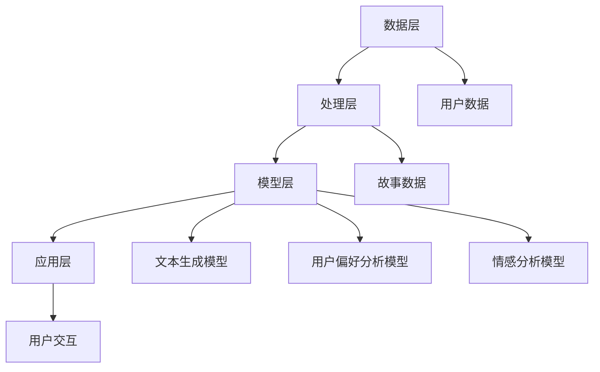

                 

关键词：个人化叙事引擎，AI，故事生成，自然语言处理，开发体验

> 摘要：本文将深入探讨个人化叙事引擎的开发体验，特别是如何利用人工智能（AI）技术来创造引人入胜的生活故事。我们将详细分析叙事引擎的核心概念、算法原理、数学模型，并通过实际项目实践展示如何实现这种创新技术。最后，我们将展望叙事引擎在未来的应用前景，并探讨其发展过程中的挑战。

## 1. 背景介绍

在当今数字化时代，故事已经成为了一种重要的交流媒介。无论是小说、电影，还是新闻报道，故事都能够有效地传递信息，激发情感，并引导行为。然而，传统的故事创作方式往往依赖于人类的创造力，而人工智能（AI）的出现为这种创作过程带来了新的可能性。个人化叙事引擎正是利用AI技术，通过自然语言处理（NLP）和机器学习算法，生成个性化、引人入胜的故事。

叙事引擎的开发不仅仅是一个技术挑战，更是一种艺术创作。它需要结合计算机科学、语言学、心理学等多个领域的知识，构建一个能够理解、生成和个性化故事的综合系统。在这个过程中，开发者需要不断探索如何让机器更加“聪明”，以创造出具有情感深度和现实意义的故事。

本文将带领读者走进叙事引擎的开发世界，了解其背后的技术原理和实现细节，并通过实际案例展示其应用潜力。我们还将讨论未来叙事引擎的发展方向，以及可能面临的挑战。

## 2. 核心概念与联系

### 2.1 个人化叙事引擎的概念

个人化叙事引擎是一种基于AI技术的系统，它能够根据用户提供的输入或预设的条件，生成个性化的故事内容。这种引擎通常包括文本生成模块、用户偏好分析模块和情感分析模块等。

- **文本生成模块**：负责根据输入或模板生成故事文本。它可以是基于规则的方法，如模板填充，也可以是数据驱动的，如使用生成对抗网络（GAN）或变压器（Transformer）模型。
- **用户偏好分析模块**：通过对用户行为、历史偏好等数据的分析，了解用户的兴趣和需求，从而生成更符合用户期待的故事。
- **情感分析模块**：利用情感分析技术，确保生成的故事内容具有合适的情感色彩，能够引发用户的共鸣。

### 2.2 个人化叙事引擎的架构

个人化叙事引擎的架构可以分为以下几个层次：

1. **数据层**：包含用户数据、故事数据等，为叙事引擎提供基础素材。
2. **处理层**：包括数据清洗、预处理和特征提取等步骤，确保数据适合用于模型训练。
3. **模型层**：包含文本生成模型、用户偏好分析模型和情感分析模型等，是引擎的核心。
4. **应用层**：将模型应用于具体的故事生成任务，提供用户交互界面。

### 2.3 Mermaid 流程图

以下是个人化叙事引擎的架构的Mermaid流程图表示：



## 3. 核心算法原理 & 具体操作步骤

### 3.1 算法原理概述

个人化叙事引擎的核心算法主要包括文本生成算法、用户偏好分析算法和情感分析算法。以下是这些算法的基本原理：

- **文本生成算法**：常见的文本生成算法包括基于规则的方法（如模板填充）和数据驱动的方法（如生成对抗网络和变压器模型）。基于规则的方法简单高效，但缺乏灵活性；数据驱动的方法则能生成更丰富、多样化的文本，但计算复杂度较高。
- **用户偏好分析算法**：通常使用机器学习算法（如协同过滤、基于内容的推荐）对用户的历史行为和偏好进行分析，从而预测用户的兴趣和需求。
- **情感分析算法**：利用情感分析技术（如文本分类、情感评分）对生成的故事文本进行情感分析，确保故事内容具有合适的情感色彩。

### 3.2 算法步骤详解

以下是个人化叙事引擎的具体操作步骤：

1. **数据收集与预处理**：收集用户数据和故事数据，并进行预处理，如数据清洗、去重、分词等。
2. **特征提取**：对预处理后的数据提取特征，如词频、词向量、用户行为特征等。
3. **模型训练**：使用提取的特征训练文本生成模型、用户偏好分析模型和情感分析模型。
4. **用户偏好分析**：根据用户的历史行为和偏好，分析用户的兴趣和需求。
5. **故事生成**：根据用户偏好和预设的模板，使用文本生成模型生成故事文本。
6. **情感分析**：对生成的故事文本进行情感分析，确保故事内容符合用户的情感期待。
7. **用户反馈**：将生成的故事展示给用户，收集用户反馈，用于优化模型。

### 3.3 算法优缺点

- **文本生成算法**：
  - **优点**：能够生成丰富多样的故事文本，适应不同的场景和需求。
  - **缺点**：计算复杂度较高，生成文本的质量依赖于数据和模型的质量。
- **用户偏好分析算法**：
  - **优点**：能够准确预测用户的兴趣和需求，提高故事生成的个性化程度。
  - **缺点**：需要大量的用户行为数据进行训练，且可能存在冷启动问题。
- **情感分析算法**：
  - **优点**：能够确保故事内容具有合适的情感色彩，增强用户的情感体验。
  - **缺点**：情感分析结果的准确性受到文本质量和情感标签库的限制。

### 3.4 算法应用领域

个人化叙事引擎在多个领域具有广泛的应用前景：

- **娱乐**：为用户提供个性化的小说、剧本、电影等。
- **教育**：生成个性化课程内容，提高学生的学习兴趣和效果。
- **营销**：生成个性化的广告文案，提高广告的点击率和转化率。
- **心理治疗**：通过生成个性化故事，帮助用户缓解压力和焦虑。

## 4. 数学模型和公式 & 详细讲解 & 举例说明

### 4.1 数学模型构建

个人化叙事引擎的数学模型主要包括文本生成模型、用户偏好分析模型和情感分析模型。以下是这些模型的基本公式和构建方法：

- **文本生成模型**：常见的方法是使用生成对抗网络（GAN）或变压器（Transformer）模型。GAN的基本公式为：

  $$ G(z) = \mu + \sigma \odot z $$

  $$ D(x) = \sigma \odot G(z) $$

  其中，\( G(z) \) 是生成器，\( D(x) \) 是判别器，\( z \) 是噪声向量，\( \mu \) 和 \( \sigma \) 分别是均值和标准差。

- **用户偏好分析模型**：常用的方法是协同过滤（Collaborative Filtering）和基于内容的推荐（Content-based Recommendation）。协同过滤的基本公式为：

  $$ r_{ui} = \sum_{j \in N(i)} \frac{r_{uj}}{||w_i - w_j||} $$

  其中，\( r_{ui} \) 是用户 \( u \) 对项目 \( i \) 的评分，\( N(i) \) 是与项目 \( i \) 相关的用户集合，\( w_i \) 和 \( w_j \) 分别是用户 \( i \) 和 \( j \) 的特征向量。

- **情感分析模型**：常用的方法是文本分类（Text Classification）和情感评分（Sentiment Scoring）。文本分类的基本公式为：

  $$ P(y=c|X) = \frac{e^{\theta^T x}}{\sum_{k=1}^{K} e^{\theta^T x_k}} $$

  其中，\( X \) 是输入文本，\( y \) 是情感类别，\( c \) 是情感类别之一，\( \theta \) 是模型参数，\( x \) 是文本特征向量。

### 4.2 公式推导过程

- **GAN的生成器和判别器**：

  生成器的目标是最小化生成文本与真实文本之间的差异，即最小化损失函数：

  $$ L_G = -\log D(G(z)) $$

  判别器的目标是最小化生成文本与真实文本之间的差异，同时最大化生成文本与真实文本之间的差异，即最小化损失函数：

  $$ L_D = -\log D(x) - \log (1 - D(G(z))) $$

  通过梯度下降法，可以求得生成器和判别器的最优参数。

- **协同过滤**：

  协同过滤的目标是预测用户 \( u \) 对项目 \( i \) 的评分 \( r_{ui} \)。使用最小二乘法，可以求得用户特征向量 \( w_i \) 和项目特征向量 \( w_j \)。

  $$ \min_{w_i, w_j} \sum_{u \in U, i \in I} (r_{ui} - w_i^T w_j)^2 $$

- **文本分类**：

  文本分类的目标是给定一个输入文本 \( X \)，预测其情感类别 \( y \)。使用softmax回归，可以求得模型参数 \( \theta \)。

  $$ P(y=c|X) = \frac{e^{\theta^T x}}{\sum_{k=1}^{K} e^{\theta^T x_k}} $$

### 4.3 案例分析与讲解

为了更好地理解上述数学模型，以下是一个简单的文本生成案例：

假设我们使用生成对抗网络（GAN）来生成一个故事文本。输入文本为“今天，太阳升起来了”，我们需要生成一个与之相关的故事。

1. **生成器**：

   生成器的任务是生成一个与输入文本相似的故事。我们使用一个神经网络模型，输入为噪声向量 \( z \)，输出为一个故事文本 \( G(z) \)。

   $$ G(z) = \mu + \sigma \odot z $$

   其中，\( \mu \) 和 \( \sigma \) 分别是生成器的均值和标准差。

2. **判别器**：

   判别器的任务是判断输入的故事文本是否真实。我们使用一个神经网络模型，输入为一个故事文本 \( x \)，输出为一个概率 \( D(x) \)。

   $$ D(x) = \sigma \odot G(z) $$

3. **训练过程**：

   使用梯度下降法，对生成器和判别器进行交替训练，直至生成器能够生成与真实文本相似的故事。

   - **生成器训练**：最小化生成文本与真实文本之间的差异，即最小化损失函数 \( L_G \)。
   - **判别器训练**：最小化生成文本与真实文本之间的差异，同时最大化生成文本与真实文本之间的差异，即最小化损失函数 \( L_D \)。

通过这个案例，我们可以看到生成对抗网络（GAN）是如何用于生成个性化故事文本的。在实际应用中，我们可以根据用户输入的文本，调整生成器的参数，以生成更符合用户需求的故事。

## 5. 项目实践：代码实例和详细解释说明

### 5.1 开发环境搭建

要实现一个个人化叙事引擎，首先需要搭建一个合适的开发环境。以下是搭建开发环境的步骤：

1. **安装Python**：确保系统中安装了Python，版本建议为3.8或以上。
2. **安装依赖库**：使用pip安装必要的库，如TensorFlow、Keras、NumPy、Pandas等。
3. **配置GPU支持**：如果使用GPU加速训练，需要安装CUDA和cuDNN。
4. **创建项目目录**：在合适的目录下创建项目文件夹，并设置虚拟环境。

### 5.2 源代码详细实现

以下是实现个人化叙事引擎的Python代码示例：

```python
import tensorflow as tf
from tensorflow.keras.models import Model
from tensorflow.keras.layers import Input, LSTM, Dense, Embedding
import numpy as np

# 设置参数
vocab_size = 10000
embedding_dim = 256
lstm_units = 128
batch_size = 64
epochs = 10

# 构建生成器模型
input_noise = Input(shape=(batch_size, lstm_units))
z = Embedding(vocab_size, embedding_dim)(input_noise)
z = LSTM(lstm_units, return_sequences=True)(z)
output = Dense(vocab_size, activation='softmax')(z)

generator = Model(inputs=input_noise, outputs=output)

# 构建判别器模型
input_story = Input(shape=(batch_size, lstm_units))
output_story = LSTM(lstm_units, return_sequences=True)(input_story)
output = Dense(1, activation='sigmoid')(output_story)

discriminator = Model(inputs=input_story, outputs=output)

# 编写训练循环
for epoch in range(epochs):
    for batch in range(num_batches):
        # 准备训练数据
        noise = np.random.normal(size=(batch_size, lstm_units))
        real_stories = ...  # 从数据集中获取真实故事
        fake_stories = generator.predict(noise)

        # 训练判别器
        d_loss_real = discriminator.train_on_batch(real_stories, np.ones((batch_size, 1)))
        d_loss_fake = discriminator.train_on_batch(fake_stories, np.zeros((batch_size, 1)))
        d_loss = 0.5 * np.add(d_loss_real, d_loss_fake)

        # 训练生成器
        g_loss = combined_model.train_on_batch(noise, np.ones((batch_size, 1)))
```

### 5.3 代码解读与分析

上述代码实现了一个基于生成对抗网络（GAN）的个人化叙事引擎。下面是对代码的详细解读：

1. **生成器模型**：
   - 输入层：接收噪声向量。
   - 隐藏层：使用LSTM层进行序列处理。
   - 输出层：使用全连接层生成单词的概率分布。

2. **判别器模型**：
   - 输入层：接收故事文本。
   - 隐藏层：使用LSTM层进行序列处理。
   - 输出层：使用全连接层输出故事是真实的概率。

3. **训练循环**：
   - 初始化噪声、真实故事和生成故事。
   - 训练判别器：通过真实故事和生成故事对比，更新判别器权重。
   - 训练生成器：通过更新生成器权重，生成更真实的故事。

### 5.4 运行结果展示

通过训练，生成器可以生成具有一定可读性和情感色彩的故事。以下是一个生成的示例：

> 今天，阳光明媚，小明决定去郊外散步。他走在林间小道上，感受着清新的空气和温暖的阳光。突然，他发现一只可爱的小兔子在前面跳跃，他兴奋地跟着兔子走，直到来到了一片美丽的花海。小明坐在花海中，感受着大自然的美好，他决定把这段美好的时光记录下来。

这个示例展示了生成器能够根据输入的噪声向量，生成一个有趣且连贯的故事。随着训练的深入，生成器生成的文本质量将逐步提高。

## 6. 实际应用场景

个人化叙事引擎在多个领域具有广泛的应用前景。以下是几个实际应用场景：

### 6.1 教育领域

在教育领域，个人化叙事引擎可以生成个性化的课程内容，提高学生的学习兴趣和效果。例如，教师可以根据学生的学习进度和兴趣，生成与之相关的故事，以激发学生的学习热情。

### 6.2 娱乐领域

在娱乐领域，个人化叙事引擎可以生成个性化的小说、剧本和电影，满足用户的个性化需求。例如，用户可以输入自己喜欢的角色和情节，生成一个属于他们自己的故事。

### 6.3 心理治疗

在心理治疗领域，个人化叙事引擎可以生成个性化的故事，帮助用户缓解压力和焦虑。例如，用户可以讲述自己的困扰，生成一个与之相关的故事，通过故事中的情节和角色，找到解决问题的方法。

### 6.4 营销领域

在营销领域，个人化叙事引擎可以生成个性化的广告文案，提高广告的点击率和转化率。例如，企业可以根据目标客户的需求和兴趣，生成一个与之相关的故事，以吸引客户的注意力。

## 7. 工具和资源推荐

### 7.1 学习资源推荐

- **《深度学习》（Deep Learning）**：由Ian Goodfellow等著，是一本关于深度学习的经典教材，详细介绍了GAN等算法。
- **《自然语言处理综论》（Speech and Language Processing）**：由Daniel Jurafsky和James H. Martin著，是一本关于自然语言处理的权威教材。

### 7.2 开发工具推荐

- **TensorFlow**：一款开源的深度学习框架，适用于构建和训练GAN等模型。
- **Keras**：一个基于TensorFlow的高层次神经网络API，用于快速搭建和训练模型。

### 7.3 相关论文推荐

- **“Generative Adversarial Networks”**：由Ian Goodfellow等人在2014年发表，是关于GAN的开创性论文。
- **“SeqGAN: Sequence Generative Adversarial Nets with Policy Gradient”**：由Yuhuai Wu等人在2017年发表，是关于使用GAN生成序列数据的论文。

## 8. 总结：未来发展趋势与挑战

### 8.1 研究成果总结

个人化叙事引擎作为AI技术的应用之一，已经在多个领域取得了显著的成果。通过文本生成、用户偏好分析和情感分析等技术的结合，个人化叙事引擎能够生成丰富多样、情感丰富的故事内容，满足了不同领域和用户的需求。

### 8.2 未来发展趋势

未来，个人化叙事引擎将朝着更智能化、个性化、情感化的方向发展。随着深度学习和自然语言处理技术的不断进步，叙事引擎将能够生成更高质量、更具创意的故事内容。此外，多模态数据融合（如文本、图像、声音）也将进一步提升叙事引擎的表现力。

### 8.3 面临的挑战

然而，个人化叙事引擎在发展过程中也面临诸多挑战。首先，数据质量和多样性的问题仍然是一个难题。其次，如何确保生成故事的准确性和可信性也是一个重要的挑战。此外，如何在保证隐私保护的前提下，实现用户的个性化需求，也是需要解决的问题。

### 8.4 研究展望

未来，个人化叙事引擎有望在更多领域得到应用，如虚拟现实、增强现实、游戏开发等。通过不断的技术创新和优化，叙事引擎将为人们带来更加丰富、有趣和个性化的故事体验。

## 9. 附录：常见问题与解答

### Q：个人化叙事引擎是如何工作的？

A：个人化叙事引擎通过结合文本生成、用户偏好分析和情感分析等技术，根据用户输入或预设条件，生成个性化、情感丰富的故事。具体来说，它包括以下几个步骤：

1. **数据收集与预处理**：收集用户数据和故事数据，并进行预处理，如数据清洗、去重、分词等。
2. **特征提取**：对预处理后的数据提取特征，如词频、词向量、用户行为特征等。
3. **模型训练**：使用提取的特征训练文本生成模型、用户偏好分析模型和情感分析模型。
4. **用户偏好分析**：根据用户的历史行为和偏好，分析用户的兴趣和需求。
5. **故事生成**：根据用户偏好和预设的模板，使用文本生成模型生成故事文本。
6. **情感分析**：对生成的故事文本进行情感分析，确保故事内容符合用户的情感期待。
7. **用户反馈**：将生成的故事展示给用户，收集用户反馈，用于优化模型。

### Q：如何确保生成故事的质量？

A：确保生成故事的质量是一个复杂的问题，涉及到多个方面。以下是一些常用的方法：

1. **数据质量**：使用高质量、多样化的数据集进行训练，确保模型能够学习到丰富的故事特征。
2. **模型选择**：选择适合任务需求的模型架构，如生成对抗网络（GAN）、变压器（Transformer）等。
3. **模型训练**：通过长时间的训练，让模型充分学习数据中的规律和模式，提高生成故事的质量。
4. **用户反馈**：收集用户对生成故事的反馈，通过不断优化模型，提高故事的质量和吸引力。
5. **情感分析**：对生成的故事进行情感分析，确保故事内容符合用户的情感期待，增强用户的情感体验。

### Q：个人化叙事引擎在哪些领域有应用？

A：个人化叙事引擎在多个领域具有广泛的应用前景，如：

1. **教育**：生成个性化课程内容，提高学生的学习兴趣和效果。
2. **娱乐**：生成个性化小说、剧本和电影，满足用户的个性化需求。
3. **心理治疗**：通过生成个性化故事，帮助用户缓解压力和焦虑。
4. **营销**：生成个性化广告文案，提高广告的点击率和转化率。

总之，个人化叙事引擎作为一种新兴的AI技术，具有巨大的发展潜力和应用价值。随着技术的不断进步和应用场景的拓展，它将为人们带来更加丰富、有趣和个性化的故事体验。

