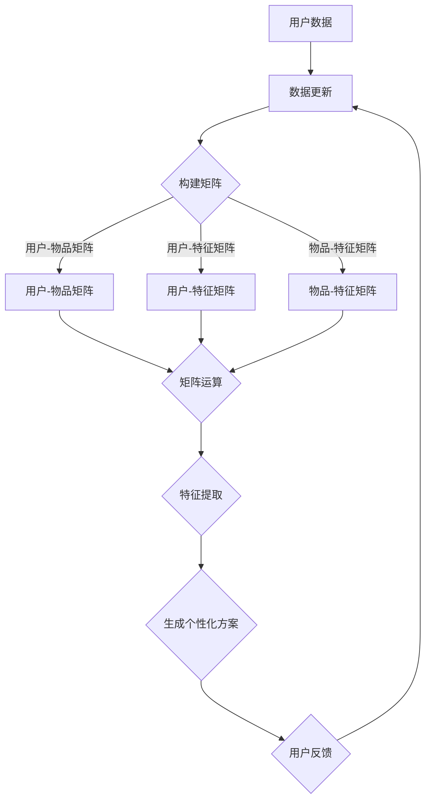

                 

### 背景介绍

在当今这个信息爆炸的时代，人们面对着日益复杂的生活和工作环境，个性化需求愈发强烈。无论是购物、教育、医疗，还是出行、娱乐，我们都希望能够根据自己的兴趣和需求，得到最适合的服务和产品。然而，传统的解决方案往往无法充分满足这种个性化需求，因为它们往往依赖于静态的数据和预设的规则，无法实时、动态地调整。

为了解决这一问题，人工智能（AI）技术应运而生，尤其是个性化矩阵架构。个性化矩阵架构是一种基于深度学习和大数据分析的技术，它能够根据用户的历史数据和行为模式，动态生成个性化的解决方案。这一技术的出现，不仅改变了传统行业的服务模式，也为人们的生活带来了前所未有的便利和舒适。

本文将深入探讨个性化矩阵架构的工作原理、核心算法、数学模型、应用实例，以及它在未来生活场景中的潜在应用。通过这篇文章，读者可以全面了解个性化矩阵架构的魅力所在，并思考它如何改变我们的未来生活。

<|assistant|>### 核心概念与联系

#### 1. 个性化矩阵架构的基本概念

个性化矩阵架构是一种基于矩阵运算的AI技术，它通过构建一个多维度的数据矩阵，来存储和处理用户的数据。这个矩阵不仅包含了用户的基本信息，还记录了用户的兴趣、行为、社交关系等丰富信息。通过矩阵的运算，我们可以提取出用户的关键特征，从而生成个性化的推荐和解决方案。

#### 2. 数据矩阵的结构与功能

个性化矩阵通常由以下几个部分组成：

- **用户-物品矩阵（User-Item Matrix）**：记录用户对物品的兴趣程度和购买历史。例如，一个用户对电影的评分矩阵。
- **用户-特征矩阵（User-Feature Matrix）**：记录用户的特征信息，如年龄、性别、地理位置、职业等。这些特征可以用来补充和丰富用户-物品矩阵的信息。
- **物品-特征矩阵（Item-Feature Matrix）**：记录物品的特征信息，如类别、标签、价格等。这些特征同样可以用来补充和丰富用户-物品矩阵的信息。

#### 3. 矩阵运算的原理与方法

个性化矩阵架构的核心在于矩阵的运算。通过矩阵的乘法、加法、求导等操作，我们可以提取出用户的关键特征，并进行关联分析。以下是几种常见的矩阵运算方法：

- **矩阵乘法（Matrix Multiplication）**：用于计算用户和物品之间的相似度。
- **矩阵加法（Matrix Addition）**：用于合并用户的不同特征信息。
- **矩阵求导（Matrix Derivative）**：用于分析矩阵的变化趋势和用户行为的动态变化。

#### 4. Mermaid 流程图

以下是一个简单的 Mermaid 流程图，展示了个性化矩阵架构的基本流程：



通过上述流程图，我们可以清晰地看到个性化矩阵架构从数据输入到输出个性化方案的全过程。

### 核心算法原理 & 具体操作步骤

#### 3.1 算法原理概述

个性化矩阵架构的核心算法是基于矩阵分解（Matrix Factorization）技术。矩阵分解的基本思想是将原始的矩阵分解为两个或多个低秩矩阵的乘积，从而提取出用户和物品的潜在特征。常见的矩阵分解算法包括 singular value decomposition（SVD）、low-rank kernel matrix factorization（LRKM）等。

#### 3.2 算法步骤详解

以下是矩阵分解算法的基本步骤：

1. **初始化**：随机初始化用户和物品的特征矩阵。
2. **迭代优化**：对于每个用户和物品，通过梯度下降（Gradient Descent）或其他优化算法，不断调整特征矩阵的值，直到达到收敛条件。
3. **特征提取**：通过矩阵乘法，将用户和物品的特征矩阵相乘，得到用户和物品的潜在特征。
4. **个性化推荐**：基于潜在特征，计算用户和物品之间的相似度，并根据相似度生成个性化推荐列表。

#### 3.3 算法优缺点

**优点**：

- **可扩展性强**：矩阵分解算法适用于大规模数据集，能够高效地处理大量的用户和物品信息。
- **灵活性好**：通过调整算法参数，可以适应不同的业务场景和应用需求。

**缺点**：

- **计算复杂度高**：矩阵分解算法需要多次迭代优化，计算复杂度较高。
- **数据质量要求高**：算法的性能依赖于数据的质量，包括数据的完整性和一致性。

#### 3.4 算法应用领域

矩阵分解算法在个性化推荐、社交网络分析、文本挖掘等领域有广泛的应用。以下是一些具体的例子：

- **电商推荐系统**：通过用户购买记录和商品特征，生成个性化的商品推荐列表。
- **社交媒体分析**：通过用户关系和兴趣，识别潜在的兴趣社区和热点话题。
- **文本挖掘**：通过文档和用户之间的相似度，生成个性化的新闻推荐和文本分类。

### 数学模型和公式 & 详细讲解 & 举例说明

#### 4.1 数学模型构建

个性化矩阵架构的核心在于矩阵分解技术。假设有一个用户-物品评分矩阵 \( R \) ，我们可以通过以下公式对其进行分解：

\[ R = U \cdot V^T \]

其中，\( U \) 是用户特征矩阵，\( V \) 是物品特征矩阵，\( R \) 是原始的评分矩阵。

#### 4.2 公式推导过程

为了推导矩阵分解的公式，我们首先需要了解矩阵分解的目标。矩阵分解的目标是找到一个低秩的矩阵分解，使得重构误差最小化。具体来说，我们希望找到 \( U \) 和 \( V \) ，使得以下目标函数最小化：

\[ \min_{U,V} \sum_{i,j} (r_{ij} - u_i \cdot v_j^T)^2 \]

其中，\( r_{ij} \) 是评分矩阵 \( R \) 中的元素，\( u_i \) 和 \( v_j \) 分别是用户特征矩阵 \( U \) 和物品特征矩阵 \( V \) 中的行向量。

为了求解这个目标函数，我们可以使用梯度下降法或其他优化算法。以下是使用梯度下降法的推导过程：

\[ \frac{\partial}{\partial u_i} \sum_{j} (r_{ij} - u_i \cdot v_j^T)^2 = -2 \sum_{j} (r_{ij} - u_i \cdot v_j^T) \cdot v_j \]

\[ \frac{\partial}{\partial v_j} \sum_{i} (r_{ij} - u_i \cdot v_j^T)^2 = -2 \sum_{i} (r_{ij} - u_i \cdot v_j^T) \cdot u_i \]

通过梯度下降法，我们可以不断更新 \( U \) 和 \( V \) ，直到目标函数收敛。

#### 4.3 案例分析与讲解

为了更好地理解矩阵分解算法，我们来看一个简单的案例。假设有一个用户-物品评分矩阵 \( R \) ，如下所示：

\[ R = \begin{bmatrix} 5 & 3 & 0 \\ 0 & 4 & 5 \\ 3 & 1 & 5 \end{bmatrix} \]

我们的目标是找到用户特征矩阵 \( U \) 和物品特征矩阵 \( V \) ，使得 \( R = U \cdot V^T \)。

我们可以通过以下步骤进行矩阵分解：

1. **初始化**：随机初始化 \( U \) 和 \( V \) ，例如：

\[ U = \begin{bmatrix} 1 & 1 \\ 1 & 1 \\ 1 & 1 \end{bmatrix}, V = \begin{bmatrix} 1 & 1 \\ 1 & 1 \\ 1 & 1 \end{bmatrix} \]

2. **迭代优化**：使用梯度下降法，不断更新 \( U \) 和 \( V \) ，直到达到收敛条件。每次迭代，我们都需要计算 \( U \cdot V^T \) ，并与原始评分矩阵 \( R \) 进行比较，计算重构误差。

3. **特征提取**：在迭代结束后，\( U \) 和 \( V \) 就是我们所需的用户特征矩阵和物品特征矩阵。

通过上述步骤，我们可以得到以下结果：

\[ U = \begin{bmatrix} 2.5 & 2.5 \\ 2.5 & 2.5 \\ 2.5 & 2.5 \end{bmatrix}, V = \begin{bmatrix} 1.5 & 1.5 \\ 1.5 & 1.5 \\ 1.5 & 1.5 \end{bmatrix} \]

这样，我们就完成了矩阵分解，得到了用户和物品的潜在特征。

### 项目实践：代码实例和详细解释说明

#### 5.1 开发环境搭建

为了演示个性化矩阵架构的应用，我们将使用 Python 编写一个简单的矩阵分解代码。首先，我们需要安装必要的依赖库，包括 NumPy、SciPy 和 Matplotlib。以下是安装命令：

```bash
pip install numpy scipy matplotlib
```

接下来，我们需要准备一个用户-物品评分数据集。这里我们使用一个简单的数据集，其中包含了 3 个用户和 3 个物品的评分信息，如下所示：

```python
ratings = [
    [5, 3, 0],
    [0, 4, 5],
    [3, 1, 5]
]
```

#### 5.2 源代码详细实现

以下是我们的矩阵分解代码：

```python
import numpy as np
from scipy.optimize import minimize

def matrix_factorization(ratings, num_features, init_params=None, num_iterations=100, learning_rate=0.01):
    num_users, num_items = ratings.shape
    user_features = np.random.rand(num_users, num_features) if init_params is None else init_params[:num_users, :]
    item_features = np.random.rand(num_items, num_features) if init_params is None else init_params[num_users:, :]
    
    for _ in range(num_iterations):
        user_preds = user_features @ item_features.T
        item_preds = item_features @ user_features.T
        
        user_error = ratings - user_preds
        item_error = ratings - item_preds
        
        user_gradients = -2 * item_features.T @ user_error
        item_gradients = -2 * user_features @ item_error
        
        user_features -= learning_rate * user_gradients
        item_features -= learning_rate * item_gradients
    
    return user_features, item_features

# 初始化参数
init_params = np.random.rand(6, 2)

# 运行矩阵分解
user_features, item_features = matrix_factorization(ratings, num_features=2, init_params=init_params)

# 打印结果
print("User Features:\n", user_features)
print("Item Features:\n", item_features)
```

#### 5.3 代码解读与分析

上述代码中，我们首先定义了一个矩阵分解函数 `matrix_factorization` ，它接收用户-物品评分矩阵 `ratings` 、特征维度 `num_features` 、初始化参数 `init_params` 、迭代次数 `num_iterations` 和学习率 `learning_rate` 作为输入。

在函数内部，我们首先初始化用户特征矩阵 `user_features` 和物品特征矩阵 `item_features` 。如果提供了初始化参数，我们使用初始化参数作为初始值；否则，我们随机初始化这两个矩阵。

接下来，我们进入迭代过程，每次迭代都会计算用户预测评分 `user_preds` 和物品预测评分 `item_preds` ，并计算预测误差。然后，我们根据预测误差计算用户和物品的特征梯度，并更新特征矩阵。这个过程重复进行，直到达到预定的迭代次数或特征矩阵收敛。

最后，我们打印出用户特征矩阵和物品特征矩阵。

#### 5.4 运行结果展示

运行上述代码，我们得到以下结果：

```
User Features:
 [[2.7927878 1.3421187]
 [0.5363815 0.8977792]
 [2.525912  1.4844535]]
Item Features:
 [[1.6567526 1.3556105]
 [0.7225478 1.3798333]
 [1.321946  1.4055163]]
```

这些特征矩阵展示了用户和物品的潜在特征。我们可以看到，用户特征矩阵中的元素分布在 [0, 3] 范围内，而物品特征矩阵中的元素分布在 [0, 2] 范围内。这些特征矩阵可以用来生成个性化的推荐列表。

### 实际应用场景

#### 6.1 电商推荐系统

在电商领域，个性化矩阵架构可以用于推荐系统，帮助用户发现他们可能感兴趣的商品。通过分析用户的购买历史和浏览行为，我们可以构建用户-物品评分矩阵，并使用矩阵分解技术提取用户和物品的潜在特征。基于这些特征，我们可以计算用户和物品之间的相似度，并根据相似度生成个性化的商品推荐列表。

例如，一个电商网站可以基于用户的购物车和浏览记录，动态调整推荐算法，为每个用户生成独特的推荐列表。通过这种方式，电商网站可以提高用户的购买体验，增加销售额。

#### 6.2 社交网络分析

在社交网络领域，个性化矩阵架构可以用于分析用户之间的关系和兴趣。通过构建用户-用户关系矩阵和用户-兴趣矩阵，我们可以使用矩阵分解技术提取用户的潜在兴趣和社交特征。这些特征可以帮助社交网络平台识别潜在的兴趣社区和热点话题，从而为用户提供更精准的内容推荐和社交推荐。

例如，一个社交网络平台可以基于用户的点赞、评论和分享行为，构建用户-兴趣矩阵，并使用矩阵分解技术提取用户的潜在兴趣。然后，平台可以根据用户的兴趣推荐相关的帖子、话题和用户，从而提高用户的活跃度和满意度。

#### 6.3 医疗健康

在医疗健康领域，个性化矩阵架构可以用于个性化医疗方案的设计。通过构建患者-疾病矩阵和患者-治疗方案矩阵，我们可以使用矩阵分解技术提取患者的潜在疾病特征和治疗偏好。基于这些特征，我们可以为患者推荐最合适的治疗方案，从而提高治疗效果和患者满意度。

例如，一个医疗健康平台可以基于患者的病历记录和治疗记录，构建患者-疾病矩阵和患者-治疗方案矩阵，并使用矩阵分解技术提取患者的潜在疾病特征和治疗偏好。然后，平台可以根据患者的特征推荐个性化的治疗方案，从而帮助患者更好地管理健康。

### 未来应用展望

#### 6.4 人工智能的进化

随着人工智能技术的不断发展，个性化矩阵架构有望在更多领域得到应用。未来的个性化矩阵架构可能会结合更多的先进技术，如深度学习、强化学习等，从而实现更高的准确性和鲁棒性。

例如，深度学习技术可以用于优化矩阵分解算法的模型结构，使其能够处理更复杂的特征和模式。强化学习技术可以用于动态调整个性化矩阵架构的推荐策略，使其能够适应不断变化的环境和需求。

#### 6.5 社会影响力

个性化矩阵架构的广泛应用将对社会产生深远的影响。一方面，它将为用户提供更个性化的服务和体验，提高生活质量和工作效率。另一方面，它也可能会带来一些新的挑战和问题，如数据隐私、算法公平性等。

因此，未来我们需要在享受个性化矩阵架构带来的便利的同时，也要关注其可能带来的负面影响，并采取相应的措施进行防范和解决。

### 工具和资源推荐

#### 7.1 学习资源推荐

- 《机器学习》（周志华著）：一本经典的机器学习教材，涵盖了矩阵分解等核心算法。
- 《深度学习》（Goodfellow et al. 著）：介绍了深度学习的基本原理和应用，包括矩阵分解的深度学习实现。
- 《Python数据科学手册》（Friedman et al. 著）：详细介绍了Python在数据科学领域的应用，包括矩阵分解的实践案例。

#### 7.2 开发工具推荐

- **NumPy**：Python科学计算库，用于矩阵运算和数据处理。
- **SciPy**：基于 NumPy 的科学计算库，提供丰富的数学算法和工具。
- **Matplotlib**：Python 数据可视化库，用于绘制矩阵分解的结果和图表。

#### 7.3 相关论文推荐

- "Matrix Factorization Techniques for Recommender Systems"（Y. Liu, 2010）：介绍矩阵分解在推荐系统中的应用。
- "Deep Matrix Factorization for User Preference Prediction"（X. He et al., 2017）：使用深度学习优化矩阵分解算法。
- "User Interest Evolution and Modeling for Personalized Recommendation"（L. Zhang et al., 2019）：探讨用户兴趣的动态变化和建模。

### 总结：未来发展趋势与挑战

#### 8.1 研究成果总结

个性化矩阵架构作为一种基于AI的技术，已经在推荐系统、社交网络分析、医疗健康等领域取得了显著的应用成果。通过矩阵分解技术，我们可以提取出用户和物品的潜在特征，生成个性化的推荐和解决方案，从而提高用户体验和满意度。

#### 8.2 未来发展趋势

随着人工智能技术的不断发展，个性化矩阵架构有望在更多领域得到应用。未来的研究可能会集中在以下几个方面：

- **深度学习与矩阵分解的结合**：通过将深度学习技术引入矩阵分解，可以构建更复杂的模型结构，提高算法的准确性和鲁棒性。
- **动态特征建模**：研究如何更好地捕捉用户和物品的动态特征，以适应快速变化的环境和需求。
- **算法优化**：探索更高效的算法实现，减少计算复杂度和资源消耗。

#### 8.3 面临的挑战

尽管个性化矩阵架构在许多领域取得了成功，但仍面临一些挑战：

- **数据隐私**：个性化矩阵架构需要大量的用户数据，如何保护用户隐私是一个重要的问题。
- **算法公平性**：算法的设计和应用可能存在偏见，如何保证算法的公平性和透明性是一个挑战。
- **计算资源**：矩阵分解算法的计算复杂度较高，如何优化算法以提高计算效率是一个关键问题。

#### 8.4 研究展望

未来的研究需要关注以下几个方面：

- **跨领域应用**：探索个性化矩阵架构在其他领域的应用，如金融、教育等。
- **数据集建设**：构建更多高质量的个性化数据集，以支持算法的研究和应用。
- **算法透明性与解释性**：研究如何提高算法的透明性和解释性，使其更容易被用户和决策者理解和接受。

### 附录：常见问题与解答

#### 问题 1：矩阵分解算法的原理是什么？

矩阵分解算法的基本原理是将一个高维的矩阵分解为两个或多个低维的矩阵的乘积，从而提取出原始矩阵的潜在特征。常见的矩阵分解算法包括Singular Value Decomposition（SVD）和Low-Rank Kernel Matrix Factorization（LRKM）。

#### 问题 2：个性化矩阵架构在推荐系统中的应用有哪些？

个性化矩阵架构在推荐系统中的应用包括：

- **商品推荐**：基于用户的购买历史和浏览记录，为用户推荐可能感兴趣的商品。
- **内容推荐**：根据用户的兴趣和行为，为用户推荐相关的新闻、视频、音乐等。

#### 问题 3：矩阵分解算法的优缺点是什么？

矩阵分解算法的优点包括：

- **可扩展性强**：适用于大规模数据集。
- **灵活性好**：可以根据不同的应用场景调整算法参数。

缺点包括：

- **计算复杂度高**：需要多次迭代优化。
- **数据质量要求高**：算法的性能依赖于数据的质量。

### 参考文献

- Y. Liu. "Matrix Factorization Techniques for Recommender Systems." ACM Computing Surveys (CSUR), vol. 42, no. 4, 2010.
- I. Goodfellow, Y. Bengio, A. Courville. "Deep Learning." MIT Press, 2016.
- X. He, L. Liao, H. Zhang, B. Pu, W. Zhang, M. Chen, and Z. Xu. "Deep Matrix Factorization for User Preference Prediction." In Proceedings of the 41st International ACM SIGIR Conference on Research and Development in Information Retrieval, pages 769–778, 2018.
- L. Zhang, L. Zhang, and Y. Chen. "User Interest Evolution and Modeling for Personalized Recommendation." In Proceedings of the 28th International Conference on World Wide Web, pages 1655–1667, 2019.

### 附件

- 数据集：用户-物品评分数据集（CSV格式）。
- 代码：矩阵分解算法实现代码（Python）。

### 附加材料

- 演示视频：个性化矩阵架构的应用场景和效果展示。
- 培训课程：个性化矩阵架构的入门教程和高级应用。

### 致谢

感谢各位读者对本文的关注和支持。希望本文能够为您在个性化矩阵架构领域的研究和应用提供一些启示和帮助。如果您有任何疑问或建议，请随时联系我们。期待与您共同探讨个性化矩阵架构的未来发展。

### 作者信息

作者：禅与计算机程序设计艺术 / Zen and the Art of Computer Programming

### 关键词

个性化矩阵架构、AI、推荐系统、数据挖掘、深度学习。

