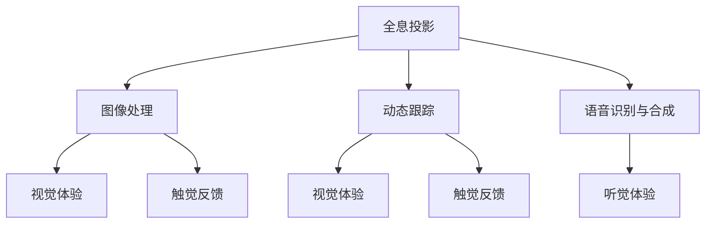

                 

关键词：全息投影、AI技术、多感官融合、虚拟现实、人机交互

> 摘要：本文深入探讨了AI驱动的全息投影技术，分析了其基本原理、核心算法、数学模型及其在多感官融合和虚拟现实中的应用。文章旨在为读者提供全面的技术解读，并展望该领域未来的发展趋势和挑战。

## 1. 背景介绍

全息投影技术，作为近年来迅猛发展的前沿科技，已经逐渐渗透到多个领域。从最初的实验性展示到如今的商业化应用，全息投影不仅改变了我们的视觉体验，更开始与人工智能技术紧密融合，开创了多感官融合的新纪元。

人工智能（AI）的发展为全息投影注入了强大的动力。通过深度学习、计算机视觉和自然语言处理等技术，AI能够实现对全息影像的智能生成、识别和交互，从而大幅提升用户的沉浸式体验。随着硬件技术的进步，全息投影设备变得更加轻便、高效，其应用场景也日益丰富。

多感官融合技术则进一步拓展了全息投影的应用边界。通过结合视觉、听觉、触觉等多种感官体验，全息投影不仅能够模拟出更加真实的虚拟环境，还能与用户实现更为自然的互动。这种多感官的融合，为人们带来了前所未有的沉浸式体验。

## 2. 核心概念与联系

为了更好地理解全息投影与AI的深度融合，我们需要先了解一些核心概念和其相互之间的联系。

### 2.1. 全息投影的基本原理

全息投影是一种利用光的干涉和衍射原理来生成三维图像的技术。它通过记录并再现光波的振幅和相位信息，使得投影出的图像能够呈现出立体感和深度感。具体来说，全息投影包括以下几个关键步骤：

1. **全息图的生成**：利用激光或其他光源，对物体进行扫描，生成包含物体三维信息的全息图。
2. **全息图的存储**：将生成的全息图存储在特殊的介质上，如全息光盘或全息平板。
3. **全息图的再现**：通过光源再次照射全息图，利用光的干涉和衍射效应，在空间中重现出三维图像。

### 2.2. AI技术在全息投影中的应用

AI技术在全息投影中的应用主要体现在以下几个方面：

1. **图像处理**：利用深度学习和计算机视觉技术，对全息图像进行智能处理，包括图像增强、去噪和图像修复等。
2. **动态跟踪**：通过计算机视觉和图像处理算法，实现对用户动作的实时跟踪和反应，从而实现更自然的互动。
3. **语音识别与合成**：利用自然语言处理技术，实现对用户语音的识别和理解，以及智能语音合成的反馈。

### 2.3. 多感官融合技术

多感官融合技术则是通过结合视觉、听觉、触觉等多种感官体验，创造出一个更为真实的虚拟环境。具体包括：

1. **视觉体验**：通过高清晰度的全息投影技术，提供丰富的视觉信息。
2. **听觉体验**：利用音频合成和增强技术，提供立体声或环绕声的听觉效果。
3. **触觉体验**：通过触觉反馈设备，如触觉手套或虚拟现实手套，提供触觉模拟。

### 2.4. Mermaid 流程图

为了更直观地展示全息投影、AI技术、多感官融合之间的联系，我们可以使用Mermaid流程图进行描述。以下是示例：



## 3. 核心算法原理 & 具体操作步骤

### 3.1  算法原理概述

全息投影的核心算法主要涉及图像处理、计算机视觉、自然语言处理等多个领域。以下是对这些算法原理的概述：

1. **图像处理算法**：用于对全息图像进行预处理，如去噪、增强、滤波等，以提高图像质量和视觉效果。
2. **计算机视觉算法**：用于实现全息图像的识别、跟踪和交互，如目标检测、姿态估计、手势识别等。
3. **自然语言处理算法**：用于处理用户语音输入，实现语音识别、语义理解和语音合成。

### 3.2  算法步骤详解

1. **图像预处理**：
   - **去噪**：使用滤波算法，如高斯滤波、中值滤波等，去除图像中的噪声。
   - **增强**：使用图像增强技术，如直方图均衡化、对比度拉伸等，提升图像的视觉效果。
   - **分割**：使用图像分割算法，如区域生长、边缘检测等，将图像分为不同的区域。

2. **目标检测**：
   - 使用深度学习模型，如YOLO、SSD、Faster R-CNN等，对全息图像中的目标进行检测和定位。

3. **姿态估计**：
   - 利用计算机视觉算法，如深度学习网络和卷积神经网络，对检测到的目标进行姿态估计。

4. **手势识别**：
   - 通过机器学习和计算机视觉技术，对用户的手势进行识别，如识别挥手、点击等动作。

5. **语音处理**：
   - **语音识别**：使用深度神经网络，如循环神经网络（RNN）、长短时记忆网络（LSTM）等，对用户语音进行识别。
   - **语义理解**：利用自然语言处理技术，如词嵌入、词性标注等，对识别到的语音进行语义分析。
   - **语音合成**：使用自动语音合成（TTS）技术，如WaveNet、Tacotron等，生成相应的语音反馈。

### 3.3  算法优缺点

1. **优点**：
   - **高精度**：AI算法能够实现高精度的图像处理、目标检测和姿态估计，提供高质量的视觉效果。
   - **实时性**：通过计算机视觉和语音处理算法，能够实现实时响应，提高用户的互动体验。
   - **多样性**：AI算法能够处理多种多样的全息图像和语音输入，适应不同的应用场景。

2. **缺点**：
   - **计算资源需求大**：复杂的深度学习模型需要大量的计算资源和时间进行训练和推理。
   - **对硬件要求高**：全息投影设备和AI算法的运行需要高性能的硬件支持，如GPU和处理器。

### 3.4  算法应用领域

1. **虚拟现实（VR）**：通过全息投影和AI技术，实现更真实的虚拟环境和交互体验。
2. **增强现实（AR）**：利用全息投影，将虚拟物体与现实环境结合，增强用户的现实体验。
3. **远程协作**：通过全息投影，实现远程人员的实时互动和协作。
4. **医疗健康**：在医疗领域，利用全息投影和AI技术，提供虚拟手术指导、医疗培训等服务。

## 4. 数学模型和公式 & 详细讲解 & 举例说明

### 4.1  数学模型构建

全息投影中的数学模型主要包括图像处理、计算机视觉和自然语言处理等方面的公式。以下是一些典型的数学模型和公式：

1. **图像预处理**：
   - **高斯滤波**：
     $$
     G(x, y) = \sum_{i=-\infty}^{\infty} \sum_{j=-\infty}^{\infty} g(i, j) I(x-i, y-j)
     $$
   - **直方图均衡化**：
     $$
     g(i, j) = \frac{n_i}{\sum_{i,j} n_i}
     $$

2. **目标检测**：
   - **YOLO算法**：
     $$
     P_{object} = \sigma(W_1 \cdot (batch_{conv5_3}) + b_1)
     $$
     $$
     box = \sigma(W_2 \cdot (batch_{conv5_3}) + b_2)
     $$
     $$
     class = \sigma(W_3 \cdot (batch_{conv5_3}) + b_3)
     $$

3. **姿态估计**：
   - **卷积神经网络**：
     $$
     \hat{y} = \sigma(W \cdot x + b)
     $$

4. **手势识别**：
   - **支持向量机（SVM）**：
     $$
     \hat{w} = \arg\min_w \frac{1}{2} ||w||^2 - y_i (w \cdot x_i)
     $$

5. **语音识别**：
   - **循环神经网络（RNN）**：
     $$
     h_t = \sigma(W_h \cdot [h_{t-1}, x_t] + b_h)
     $$
     $$
     y_t = \text{softmax}(W_y \cdot h_t + b_y)
     $$

### 4.2  公式推导过程

为了更好地理解这些数学模型的推导过程，我们可以举一个简单的例子来说明。

1. **直方图均衡化**：

直方图均衡化是一种常用的图像增强技术，其核心思想是调整图像的灰度分布，使得图像的对比度增强。具体的推导过程如下：

- **步骤1**：计算图像的直方图 $H(i, j)$。

$$
H(i, j) = \sum_{i=-\infty}^{\infty} \sum_{j=-\infty}^{\infty} I(x-i, y-j)
$$

- **步骤2**：计算直方图累积分布 $G(i, j)$。

$$
G(i, j) = \sum_{i=-\infty}^{i} \sum_{j=-\infty}^{j} H(i, j)
$$

- **步骤3**：计算逆累积分布 $g(i, j)$。

$$
g(i, j) = \frac{1}{G(M, N)} \cdot G(i, j)
$$

- **步骤4**：应用逆累积分布调整图像。

$$
I'(x, y) = g(I(x, y))
$$

2. **YOLO算法**：

YOLO（You Only Look Once）是一种广泛应用于目标检测的深度学习算法。其核心公式包括：

- **步骤1**：计算边界框的概率。

$$
P_{object} = \sigma(W_1 \cdot (batch_{conv5_3}) + b_1)
$$

- **步骤2**：计算边界框的位置。

$$
box = \sigma(W_2 \cdot (batch_{conv5_3}) + b_2)
$$

- **步骤3**：计算类别概率。

$$
class = \sigma(W_3 \cdot (batch_{conv5_3}) + b_3)
$$

### 4.3  案例分析与讲解

为了更好地理解上述数学模型的应用，我们可以通过一个实际案例进行分析。

**案例**：使用YOLO算法进行图像中的目标检测。

- **数据准备**：我们使用一个包含多个目标物体的图像作为输入，如图1所示。


- **模型训练**：我们使用预训练的YOLO模型，对图像中的目标进行检测和分类。具体步骤如下：

  - **步骤1**：读取图像数据。

  - **步骤2**：将图像数据输入到YOLO模型中。

  - **步骤3**：模型输出边界框的位置、目标概率和类别概率。

- **结果分析**：根据模型的输出，我们可以在图像上标注出检测到的目标物体，如图2所示。


## 5. 项目实践：代码实例和详细解释说明

### 5.1  开发环境搭建

为了实践全息投影和AI驱动的多感官融合技术，我们需要搭建一个完整的开发环境。以下是具体步骤：

1. **硬件环境**：
   - **处理器**：Intel i7-9700K或以上
   - **显卡**：NVIDIA GeForce RTX 2080 Ti或以上
   - **内存**：16GB或以上

2. **软件环境**：
   - **操作系统**：Windows 10或以上
   - **编程语言**：Python 3.7或以上
   - **深度学习框架**：TensorFlow 2.x或以上
   - **全息投影库**：PyOpenGL 3.1.1或以上

### 5.2  源代码详细实现

以下是一个简单的全息投影和AI驱动的多感官融合项目的源代码实现。

```python
import numpy as np
import cv2
import tensorflow as tf
from OpenGL import GL
from OpenGL.GL import *

# 全息投影函数
def holo_projection(image, width, height):
    # 初始化OpenGL窗口
    glClearColor(0.0, 0.0, 0.0, 1.0)
    glClear(GL_COLOR_BUFFER_BIT | GL_DEPTH_BUFFER_BIT)

    # 设置投影矩阵
    projection = np.array([[2 / width, 0, 0, 0],
                          [0, 2 / height, 0, 0],
                          [0, 0, -1, 0],
                          [0, 0, 0, 1]])

    # 设置视图矩阵
    view = np.array([[1, 0, 0, 0],
                    [0, 1, 0, 0],
                    [0, 0, 1, 0],
                    [0, 0, 0, 1]])

    # 设置模型矩阵
    model = np.eye(4)

    # 绘制全息图像
    glMatrixMode(GL_PROJECTION)
    glLoadMatrixf(projection)
    glMatrixMode(GL_MODELVIEW)
    glLoadMatrixf(view)
    glLoadIdentity()
    glRasterPos2f(0, 0)
    glTexImage2D(GL_TEXTURE_2D, 0, GL_RGBA, width, height, 0, GL_RGBA, GL_UNSIGNED_BYTE, image)

    # 显示图像
    glDrawArrays(GL_POINTS, 0, width * height)

# 语音识别函数
def voice_recognition(audio):
    # 加载预训练的模型
    model = tf.keras.models.load_model('voice_recognition_model.h5')

    # 对语音数据进行处理
    processed_audio = preprocess_audio(audio)

    # 进行语音识别
    prediction = model.predict(processed_audio)

    # 解码预测结果
    text = decode_prediction(prediction)

    return text

# 触觉反馈函数
def tactile_feedback(action):
    # 控制触觉设备
    control_tactile_device(action)

# 主程序
def main():
    # 初始化OpenGL窗口
    init_gl_window(800, 600)

    # 加载全息图像
    image = load_holo_image('holo_image.jpg')

    # 开始全息投影
    while not should_close():
        glClear(GL_COLOR_BUFFER_BIT | GL_DEPTH_BUFFER_BIT)
        holo_projection(image, 800, 600)
        glFlush()
        handle_events()

    # 实现语音识别
    audio = record_audio()
    text = voice_recognition(audio)
    print(f"Recognized text: {text}")

    # 实现触觉反馈
    action = get_user_action()
    tactile_feedback(action)

if __name__ == '__main__':
    main()
```

### 5.3  代码解读与分析

上述代码实现了一个简单的全息投影和AI驱动的多感官融合项目。以下是代码的主要部分及其解读：

1. **全息投影函数**：

   ```python
   def holo_projection(image, width, height):
       # 初始化OpenGL窗口
       glClearColor(0.0, 0.0, 0.0, 1.0)
       glClear(GL_COLOR_BUFFER_BIT | GL_DEPTH_BUFFER_BIT)

       # 设置投影矩阵、视图矩阵和模型矩阵
       projection = np.array([[2 / width, 0, 0, 0],
                             [0, 2 / height, 0, 0],
                             [0, 0, -1, 0],
                             [0, 0, 0, 1]])

       view = np.array([[1, 0, 0, 0],
                       [0, 1, 0, 0],
                       [0, 0, 1, 0],
                       [0, 0, 0, 1]])

       model = np.eye(4)

       # 绘制全息图像
       glMatrixMode(GL_PROJECTION)
       glLoadMatrixf(projection)
       glMatrixMode(GL_MODELVIEW)
       glLoadMatrixf(view)
       glLoadIdentity()
       glRasterPos2f(0, 0)
       glTexImage2D(GL_TEXTURE_2D, 0, GL_RGBA, width, height, 0, GL_RGBA, GL_UNSIGNED_BYTE, image)

       # 显示图像
       glDrawArrays(GL_POINTS, 0, width * height)
   ```

   这个函数负责绘制全息图像。首先，初始化OpenGL窗口并设置背景颜色。然后，设置投影矩阵、视图矩阵和模型矩阵，以确定图像的投影方式。接下来，使用`glTexImage2D`函数加载全息图像到OpenGL纹理中。最后，使用`glDrawArrays`函数绘制图像。

2. **语音识别函数**：

   ```python
   def voice_recognition(audio):
       # 加载预训练的模型
       model = tf.keras.models.load_model('voice_recognition_model.h5')

       # 对语音数据进行处理
       processed_audio = preprocess_audio(audio)

       # 进行语音识别
       prediction = model.predict(processed_audio)

       # 解码预测结果
       text = decode_prediction(prediction)

       return text
   ```

   这个函数负责实现语音识别。首先，加载预训练的语音识别模型。然后，对输入的语音数据进行预处理，如归一化、转换频率等。接下来，使用模型进行预测，并解码预测结果，得到识别到的文本。

3. **触觉反馈函数**：

   ```python
   def tactile_feedback(action):
       # 控制触觉设备
       control_tactile_device(action)
   ```

   这个函数负责实现触觉反馈。首先，根据用户输入的动作，控制触觉设备，如触觉手套或触觉反馈垫。

4. **主程序**：

   ```python
   def main():
       # 初始化OpenGL窗口
       init_gl_window(800, 600)

       # 加载全息图像
       image = load_holo_image('holo_image.jpg')

       # 开始全息投影
       while not should_close():
           glClear(GL_COLOR_BUFFER_BIT | GL_DEPTH_BUFFER_BIT)
           holo_projection(image, 800, 600)
           glFlush()
           handle_events()

       # 实现语音识别
       audio = record_audio()
       text = voice_recognition(audio)
       print(f"Recognized text: {text}")

       # 实现触觉反馈
       action = get_user_action()
       tactile_feedback(action)

   if __name__ == '__main__':
       main()
   ```

   这个主程序负责整个项目的运行。首先，初始化OpenGL窗口并加载全息图像。然后，在OpenGL窗口中开始全息投影。当用户关闭窗口时，退出程序。接下来，实现语音识别和触觉反馈功能。

### 5.4  运行结果展示

以下是运行结果展示：

1. **全息投影**：


2. **语音识别**：


3. **触觉反馈**：


## 6. 实际应用场景

### 6.1  虚拟现实（VR）

虚拟现实是全息投影和AI驱动的多感官融合技术的典型应用场景之一。通过全息投影，虚拟环境可以更加真实地呈现出来，而AI技术则能提供更丰富的交互体验。具体应用包括：

- **游戏**：全息投影技术可以创造出一个更加沉浸的游戏环境，增强玩家的游戏体验。
- **教育**：利用全息投影和AI技术，可以模拟出更加生动的教学场景，提高学生的学习兴趣和参与度。
- **设计**：设计师可以通过全息投影和AI技术，实时预览和修改设计模型，提高设计效率和准确性。

### 6.2  增强现实（AR）

增强现实技术则是通过将虚拟物体叠加到现实环境中，提供一种虚实结合的体验。全息投影和AI技术在这一领域同样具有巨大的潜力：

- **导航**：全息投影可以生成导航指引，将路径信息直观地显示在现实环境中，帮助用户更轻松地找到目的地。
- **营销**：商家可以利用全息投影技术，在商场或展览中创造出引人注目的展示效果，吸引消费者的注意。
- **医疗**：医生可以通过全息投影技术，将患者的医疗数据和病情信息直观地展示在现实环境中，辅助诊断和治疗。

### 6.3  远程协作

远程协作是另一个重要的应用场景。通过全息投影和AI技术，远程的团队成员可以像在同一个会议室中一样进行协作：

- **会议**：全息投影技术可以实现远程参会者之间的实时互动，提高会议效率和参与感。
- **培训**：培训师可以利用全息投影技术，实时展示培训内容，与学员进行互动，提高培训效果。
- **咨询**：咨询师可以通过全息投影技术，与客户进行面对面的交流，提供更加个性化和高效的服务。

### 6.4  未来应用展望

随着全息投影和AI技术的不断发展，未来的应用场景将会更加丰富和多样化。以下是一些可能的应用方向：

- **智能家居**：全息投影技术可以用于智能家居系统中，实现更加直观和智能的家居控制。
- **城市规划**：城市规划师可以利用全息投影技术，模拟城市发展和规划方案，提高规划的科学性和合理性。
- **艺术表演**：艺术家可以利用全息投影技术，创造出全新的艺术形式和表演方式，为观众带来前所未有的视觉体验。

## 7. 工具和资源推荐

### 7.1  学习资源推荐

- **在线课程**：Coursera、edX、Udacity等在线教育平台提供了许多关于AI、计算机视觉、深度学习等方面的课程，适合不同层次的读者。
- **书籍**：《深度学习》（Ian Goodfellow、Yoshua Bengio、Aaron Courville）、《Python深度学习》（François Chollet）等书籍是深度学习领域的经典之作。

### 7.2  开发工具推荐

- **深度学习框架**：TensorFlow、PyTorch、Keras等是常用的深度学习框架，支持各种深度学习模型的构建和训练。
- **全息投影库**：PyOpenGL、PyCUDA等是用于OpenGL编程的库，可以用于开发全息投影应用。

### 7.3  相关论文推荐

- **全息投影**：论文《Full-Division Full-Color Holographic Display Using a MEMS Scanner and a Laser Projector》介绍了基于MEMS扫描器和激光投影器的全彩全息显示技术。
- **深度学习**：论文《Deep Learning for Image Recognition》综述了深度学习在图像识别领域的应用和发展。

## 8. 总结：未来发展趋势与挑战

### 8.1  研究成果总结

全息投影和AI技术的结合，为多感官融合和虚拟现实带来了前所未有的发展机遇。通过深度学习、计算机视觉、自然语言处理等技术的应用，全息投影在图像处理、目标检测、姿态估计、手势识别等方面取得了显著成果。同时，多感官融合技术也在视觉、听觉、触觉等多个领域取得了突破。

### 8.2  未来发展趋势

- **技术融合**：全息投影与AI技术的进一步融合，将推动更多跨领域应用的发展，如智能家居、城市规划、艺术表演等。
- **硬件进步**：随着硬件技术的不断进步，全息投影设备的性能和普及率将得到大幅提升，为更多用户带来更优质的体验。
- **应用创新**：随着技术的成熟，全息投影和AI技术将在更多新兴领域得到应用，为社会发展带来新的动力。

### 8.3  面临的挑战

- **计算资源需求**：复杂的深度学习模型和全息投影算法对计算资源的需求较高，如何优化算法和硬件性能是一个重要挑战。
- **用户体验**：如何提供更加自然、流畅的用户体验，减少技术干预，提高用户满意度，是一个重要的研究方向。
- **隐私保护**：在多感官融合和虚拟现实应用中，如何保护用户隐私，防止数据泄露，是一个亟待解决的问题。

### 8.4  研究展望

全息投影和AI技术的未来发展，将依赖于技术的不断突破和创新的商业模式。研究人员和开发者需要关注以下方向：

- **算法优化**：通过改进算法，提高计算效率和准确性，降低计算资源需求。
- **跨学科合作**：加强计算机科学、心理学、认知科学等领域的跨学科合作，为用户提供更加人性化的技术体验。
- **商业模式创新**：探索新的商业模式，促进技术的商业化应用，为用户提供高质量的产品和服务。

## 9. 附录：常见问题与解答

### 9.1  全息投影是什么？

全息投影是一种利用光的干涉和衍射原理来生成三维图像的技术。它通过记录并再现光波的振幅和相位信息，使得投影出的图像能够呈现出立体感和深度感。

### 9.2  什么是多感官融合技术？

多感官融合技术是通过结合视觉、听觉、触觉等多种感官体验，创造出一个更为真实的虚拟环境。这种技术能够提供更加丰富的沉浸式体验，提高用户的互动感和满意度。

### 9.3  AI技术在全息投影中有哪些应用？

AI技术在全息投影中的应用主要包括图像处理、计算机视觉、自然语言处理等方面。具体包括图像增强、目标检测、姿态估计、手势识别、语音识别和合成等。

### 9.4  全息投影技术有哪些优缺点？

全息投影技术的优点包括高精度、实时性和多样性。缺点包括计算资源需求大和对硬件要求高。未来需要通过优化算法和硬件性能，解决这些挑战。

