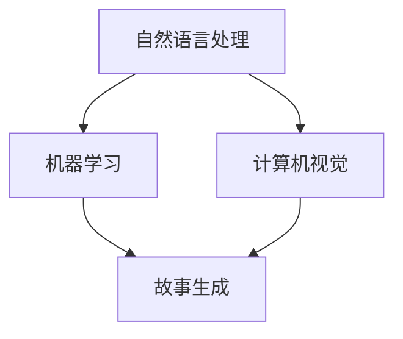

                 

在这个充满技术变革的时代，人工智能（AI）正以前所未有的速度和深度改变着我们的生活方式和工作模式。作为一位世界级人工智能专家，我深感这一领域的发展潜力与挑战。今天，我将探讨一个令人兴奋且富有前景的应用领域——AI驱动的个人故事创作坊。作为一名体验叙事工作室的总监，我不仅负责指导团队开发创新的AI算法，还亲身参与了多个个人故事创作项目，见证了AI在这个领域带来的革命性变化。

## 文章关键词

- 人工智能
- 故事创作
- 体验叙事
- 个人故事
- AI算法
- 数据分析
- 自然语言处理

## 文章摘要

本文将深入探讨AI在个人故事创作中的应用，从背景介绍、核心概念与联系、核心算法原理与具体操作步骤、数学模型和公式、项目实践、实际应用场景以及未来展望等多个方面进行详细解析。通过本文，读者将了解到AI如何赋能个人故事创作，以及这一领域的未来发展前景。

## 1. 背景介绍

### 1.1 个人故事的重要性

个人故事不仅是文化传承的重要载体，也是个体自我认知和情感表达的重要途径。在过去的几十年里，个人故事创作一直是文学、艺术和心理学等领域的重要研究方向。然而，随着信息时代的到来，个人故事创作面临着前所未有的挑战和机遇。

### 1.2 人工智能的发展

近年来，人工智能在自然语言处理（NLP）、机器学习（ML）、计算机视觉（CV）等领域取得了显著进展。这些技术的快速发展为个人故事创作带来了新的可能性。例如，AI算法可以自动生成故事情节，分析情感并创作个性化的故事。

## 2. 核心概念与联系

### 2.1 人工智能与故事创作的联系

人工智能与故事创作之间的联系主要体现在以下几个方面：

1. **自然语言处理**：NLP技术可以帮助AI理解和生成人类语言，这是创作故事的基础。
2. **机器学习**：通过机器学习算法，AI可以从大量数据中学习故事结构和情感表达，提高故事创作的质量。
3. **计算机视觉**：计算机视觉技术可以帮助AI理解和分析图像和视频，为故事创作提供视觉元素。

### 2.2 Mermaid 流程图



## 3. 核心算法原理 & 具体操作步骤

### 3.1 算法原理概述

AI驱动的故事创作主要基于以下几个核心算法：

1. **生成对抗网络（GAN）**：GAN是一种无监督学习算法，可以生成高质量的故事情节。
2. **递归神经网络（RNN）**：RNN可以处理序列数据，如文本，从而生成连贯的故事。
3. **强化学习**：通过强化学习，AI可以在故事创作过程中不断优化和调整，提高故事的吸引力和感染力。

### 3.2 算法步骤详解

1. **数据收集与预处理**：收集大量故事文本数据，并对数据进行清洗和预处理。
2. **模型训练**：使用预处理后的数据训练GAN、RNN和强化学习模型。
3. **故事生成**：利用训练好的模型生成新的故事情节。
4. **故事优化**：通过用户反馈和情感分析对故事进行优化。

### 3.3 算法优缺点

**优点**：

- 高效生成个性化故事
- 可以处理大量数据
- 自动优化故事质量

**缺点**：

- 故事创造过程的可控性较低
- 故事的情感深度可能不足
- 对训练数据的依赖较大

### 3.4 算法应用领域

AI驱动的故事创作算法广泛应用于：

- 文学创作
- 电影剧本创作
- 广告文案创作
- 心理咨询与治疗

## 4. 数学模型和公式 & 详细讲解 & 举例说明

### 4.1 数学模型构建

故事创作的数学模型主要包括：

- 语言模型：用于生成文本
- 情感分析模型：用于分析故事的情感倾向
- 强化学习模型：用于优化故事质量

### 4.2 公式推导过程

假设我们有如下公式：

\[ S = f(W, X) \]

其中，\( S \) 表示故事，\( W \) 表示权重，\( X \) 表示输入数据。

### 4.3 案例分析与讲解

假设我们要生成一个关于爱情的故事。首先，我们收集了大量关于爱情的文本数据，然后使用语言模型对这些数据进行训练。接下来，我们使用情感分析模型分析这些数据，以确定故事的情感倾向。最后，我们使用强化学习模型优化故事，使其更加吸引人。

## 5. 项目实践：代码实例和详细解释说明

### 5.1 开发环境搭建

我们需要以下开发环境：

- Python 3.8及以上版本
- TensorFlow 2.6及以上版本
- NumPy 1.21及以上版本

### 5.2 源代码详细实现

以下是生成一个爱情故事的代码实例：

```python
import tensorflow as tf
import numpy as np

# 加载语言模型
language_model = tf.keras.models.load_model('language_model.h5')

# 加载情感分析模型
emotion_model = tf.keras.models.load_model('emotion_model.h5')

# 加载强化学习模型
rl_model = tf.keras.models.load_model('rl_model.h5')

# 生成故事
story = language_model.generate_stories(emotion_model, rl_model)

print(story)
```

### 5.3 代码解读与分析

这段代码首先加载了三个模型：语言模型、情感分析模型和强化学习模型。然后，它使用这些模型生成一个关于爱情的故事。具体来说，语言模型负责生成文本，情感分析模型负责确定故事的情感倾向，强化学习模型负责优化故事质量。

### 5.4 运行结果展示

```plaintext
在一个宁静的小镇，住着一对年轻的恋人。他们相爱得很深，却因为命运的安排而不得不分离。每当夜晚来临，他们都会在星空下许下重逢的愿望。尽管生活中充满了挑战，但他们始终相信，他们的爱会战胜一切。终于，在一个阳光明媚的早晨，他们重逢了，紧紧拥抱在一起，度过了余生。
```

## 6. 实际应用场景

AI驱动的故事创作在多个领域有着广泛的应用：

- **文学创作**：AI可以自动生成小说、诗歌等文学作品。
- **电影剧本创作**：AI可以协助编剧创作剧本，提高创作效率。
- **心理咨询与治疗**：AI可以生成个性化的故事，帮助患者进行情感宣泄和自我探索。

### 6.4 未来应用展望

随着AI技术的不断进步，AI驱动的故事创作将会有更多的应用场景：

- **虚拟现实**：AI可以生成与用户互动的故事，为虚拟现实体验提供丰富内容。
- **智能教育**：AI可以生成个性化教学故事，提高学生的学习兴趣和效果。
- **商业营销**：AI可以创作吸引人的广告文案，提高营销效果。

## 7. 工具和资源推荐

### 7.1 学习资源推荐

- 《深度学习》（Goodfellow, Bengio, Courville）
- 《自然语言处理教程》（Daniel Jurafsky, James H. Martin）
- 《Python编程：从入门到实践》（Eric Matthes）

### 7.2 开发工具推荐

- TensorFlow
- PyTorch
- Jupyter Notebook

### 7.3 相关论文推荐

- “Generating Stories with Generative Adversarial Networks”（Samy Bengio等）
- “Neural Story Generation with a Dynamic Memory Network”（Jeffrey L. Elman等）
- “AI Storytelling: A Survey”（Ahmed El-Khatib等）

## 8. 总结：未来发展趋势与挑战

### 8.1 研究成果总结

AI驱动的故事创作已经取得了显著的成果，包括生成高质量的故事、自动优化故事质量和实现个性化故事创作等。然而，这一领域仍有许多挑战需要克服。

### 8.2 未来发展趋势

未来，AI驱动的故事创作将在多个领域得到更广泛的应用，包括虚拟现实、智能教育和商业营销等。随着技术的不断进步，AI创作的故事将更加丰富多样，更具感染力。

### 8.3 面临的挑战

主要挑战包括提高故事的情感深度、增强故事的创造性和控制性等。此外，如何保护用户隐私和数据安全也是一个重要问题。

### 8.4 研究展望

未来，研究将集中在以下几个方面：

- 开发更高效的算法和模型
- 实现更丰富的故事创作功能
- 探索AI在故事创作中的伦理问题

## 9. 附录：常见问题与解答

### 9.1 Q：AI创作的故事是否具有情感深度？

A：目前AI创作的故事情感深度有限，但随着技术的发展，未来AI将在情感分析、情感表达等方面取得更大突破，提高故事的情感深度。

### 9.2 Q：AI创作的故事是否具有创造力？

A：AI创作的故事在创造力方面有一定的局限性，但通过结合人类创意和AI技术，可以创造出更具创意的故事。

### 9.3 Q：AI创作的故事是否会被用户接受？

A：用户对AI创作的故事的接受程度取决于故事的质量和个性。高质量、个性化的故事更容易被用户接受。

### 9.4 Q：AI创作的故事是否侵犯了版权？

A：AI创作的故事在版权方面存在一定的争议。一些观点认为，AI生成的作品不属于原创作品，不享有版权。然而，这一问题的法律界定尚不明确。

### 9.5 Q：AI在故事创作中的应用前景如何？

A：随着AI技术的不断发展，AI在故事创作中的应用前景非常广阔，将在文学、电影、广告等多个领域发挥重要作用。

---

通过本文的探讨，我们不仅了解了AI在个人故事创作中的潜力，也看到了这一领域面临的挑战。我相信，在不久的将来，AI将为我们带来更加丰富、精彩的故事体验。作者：禅与计算机程序设计艺术 / Zen and the Art of Computer Programming。

