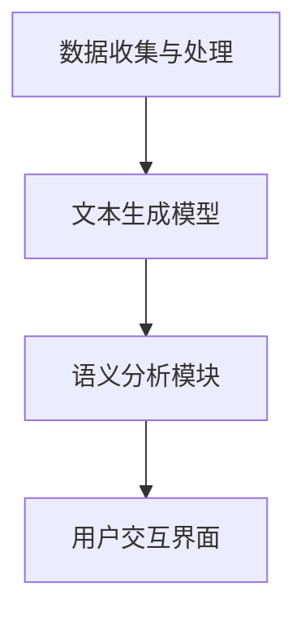

                 

关键词：叙事引擎、AI生成、个人传记、程序员、体验

> 摘要：本文深入探讨了AI生成叙事引擎在程序员个人传记创作中的应用，通过介绍核心概念、算法原理、数学模型以及具体操作步骤，展示了如何利用AI技术为程序员打造个性化的个人传记，并展望了这一领域的未来发展趋势与挑战。

## 1. 背景介绍

### 1.1 个人传记的意义

个人传记不仅是个人历史的记录，更是对个体生命旅程的深度反思和总结。对于程序员这一职业来说，个人传记不仅是对个人技术成就的回顾，更是对其职业生涯中的挑战、成长与转变的深刻记录。

### 1.2 AI生成叙事引擎的崛起

近年来，随着深度学习和自然语言处理技术的飞速发展，AI生成叙事引擎逐渐成为了一个热门研究领域。这些引擎能够自动生成文本，广泛应用于新闻报道、故事创作、数据分析等领域。

### 1.3 程序员与AI生成叙事引擎的结合

结合程序员的职业生涯特点，AI生成叙事引擎可以成为编写个人传记的有力工具。通过分析程序员的技术背景、工作经历、项目成果等数据，AI能够自动生成具有深度和个性化的个人传记，不仅节省时间，还能提供独特的视角和见解。

## 2. 核心概念与联系

### 2.1 叙事引擎的基本概念

叙事引擎是一种计算机程序，用于生成或辅助生成故事、文本。它通常包括文本生成模型、语义分析模块、用户交互界面等组成部分。

### 2.2 AI生成叙事引擎的架构

AI生成叙事引擎的架构通常包括以下几个关键模块：

- 数据收集与处理：收集程序员的技术背景、工作经历、项目成果等数据，并进行预处理和清洗。
- 文本生成模型：利用深度学习技术，如循环神经网络（RNN）、变分自编码器（VAE）或生成对抗网络（GAN），生成文本。
- 语义分析模块：对生成的文本进行语义分析，确保其逻辑连贯性和真实性。
- 用户交互界面：提供用户输入和输出接口，以便用户能够与叙事引擎进行交互。

### 2.3 Mermaid 流程图

下面是一个简单的 Mermaid 流程图，描述了AI生成叙事引擎的基本架构和数据处理流程：



## 3. 核心算法原理 & 具体操作步骤

### 3.1 算法原理概述

AI生成叙事引擎的核心算法通常基于生成式模型，如GPT（Generative Pre-trained Transformer）或BERT（Bidirectional Encoder Representations from Transformers）。这些模型通过预训练和微调，能够理解并生成高质量的文本。

### 3.2 算法步骤详解

#### 3.2.1 数据收集与处理

1. 收集程序员的技术背景、工作经历、项目成果等数据。
2. 数据清洗：去除无效数据、重复数据，进行文本预处理，如分词、去停用词、词性标注等。

#### 3.2.2 文本生成模型

1. 预训练：使用大量文本数据对模型进行预训练，使其具备生成文本的能力。
2. 微调：根据程序员的具体数据，对预训练模型进行微调，以生成更加个性化的文本。

#### 3.2.3 语义分析模块

1. 对生成的文本进行语义分析，确保其逻辑连贯性和真实性。
2. 使用自然语言处理技术，如实体识别、关系抽取、文本分类等，对文本进行深入分析。

#### 3.2.4 用户交互界面

1. 提供用户输入接口，允许用户自定义传记的某些方面，如时间范围、重点事件等。
2. 提供输出接口，展示生成的个人传记。

### 3.3 算法优缺点

#### 优点：

- 高效：自动化生成传记，节省时间和人力成本。
- 个性化：根据个人数据生成独特的传记。
- 可扩展：能够处理大量数据，适用于不同类型的程序员。

#### 缺点：

- 数据依赖：生成传记的质量取决于数据的丰富程度和准确性。
- 语义理解：目前AI在语义理解方面仍有局限性，可能生成逻辑上不连贯或不符合事实的文本。
- 隐私问题：个人数据的收集和处理可能引发隐私问题。

### 3.4 算法应用领域

AI生成叙事引擎的应用领域广泛，包括但不限于：

- 程序员个人传记创作
- 企业历史记录
- 新闻报道生成
- 教育培训内容创作
- 营销文案撰写

## 4. 数学模型和公式 & 详细讲解 & 举例说明

### 4.1 数学模型构建

AI生成叙事引擎的核心数学模型通常是基于深度学习技术的，如变分自编码器（VAE）或生成对抗网络（GAN）。以下是一个简单的VAE模型构建过程：

#### 4.1.1 编码器（Encoder）

编码器负责将输入数据（如程序员的技术背景、工作经历等）编码成一个低维的潜在空间表示。

$$
\text{编码器：} z = \mu(z) + \sigma(z)\times \epsilon
$$

其中，$\mu(z)$和$\sigma(z)$分别为均值和方差，$\epsilon$为噪声。

#### 4.1.2 解码器（Decoder）

解码器将潜在空间中的表示解码成输出数据（如生成的个人传记文本）。

$$
\text{解码器：} x' = g(z)
$$

其中，$g(z)$为解码函数。

#### 4.1.3 VAE模型损失函数

VAE模型的损失函数通常由两部分组成：重构损失和KL散度。

$$
L = \frac{1}{N} \sum_{i=1}^{N} \left[ -\sum_{j=1}^{D} x_{ij} \log p_{ij} + \frac{1}{2} \sum_{j=1}^{D} \left(1 + \log(\sigma_{ij}^2) - \mu_{ij}^2 - \sigma_{ij}^2 \right) \right]
$$

其中，$N$为样本数量，$D$为数据维度，$x_{ij}$为输入数据，$p_{ij}$为生成的输出数据，$\mu_{ij}$和$\sigma_{ij}$分别为编码器的输出。

### 4.2 公式推导过程

#### 4.2.1 编码器推导

编码器的推导主要涉及概率分布的构建和优化。假设输入数据$x$服从高斯分布：

$$
p(x|\theta) = \mathcal{N}(x; \mu(x), \sigma^2(x))
$$

其中，$\theta$为模型参数，$\mu(x)$和$\sigma^2(x)$分别为均值和方差。

为了将输入数据$x$编码到潜在空间$z$，我们引入一个编码函数：

$$
q(z|x) = \mathcal{N}(z; \mu(z|x), \sigma^2(z|x))
$$

其中，$q(z|x)$为后验概率分布。

通过最大后验估计，我们希望最大化$P(z|x)$，即：

$$
P(z|x) \propto p(x|z)q(z)
$$

将概率分布代入，得到：

$$
P(z|x) \propto \mathcal{N}(x; \mu(z), \sigma^2(z))\mathcal{N}(z; \mu(z|x), \sigma^2(z|x))
$$

为了简化问题，我们通常将$q(z|x)$设置为标准正态分布，即$\mu(z|x) = 0$，$\sigma^2(z|x) = 1$。

最终，我们得到编码器的输出：

$$
z = \mu(z) + \sigma(z)\times \epsilon
$$

其中，$\epsilon$为高斯噪声。

#### 4.2.2 解码器推导

解码器的推导主要涉及潜在空间$z$到输出数据$x'$的映射。假设输出数据$x'$服从高斯分布：

$$
p(x'|z) = \mathcal{N}(x'; \mu(x'|z), \sigma^2(x'|z))
$$

其中，$\mu(x'|z)$和$\sigma^2(x'|z)$分别为解码函数的均值和方差。

通过最小化损失函数，我们希望找到最优的解码函数$g(z)$，即：

$$
\min_{g(z)} \sum_{i=1}^{N} \left[ -\sum_{j=1}^{D} x_{ij}' \log p_{ij}' + \frac{1}{2} \sum_{j=1}^{D} \left(1 + \log(\sigma_{ij}'^2) - \mu_{ij}'^2 - \sigma_{ij}'^2 \right) \right]
$$

通过优化，我们得到解码函数：

$$
x' = g(z)
$$

其中，$g(z)$为非线性变换函数。

### 4.3 案例分析与讲解

假设我们有一个程序员的个人简历，包含如下信息：

- 姓名：张三
- 技术背景：熟悉Python、Java，有三年开发经验
- 项目经历：曾参与开发一款电商系统，负责后端架构设计
- 荣誉：获得公司年度优秀员工称号

我们使用VAE模型生成张三的个人传记，具体步骤如下：

#### 4.3.1 数据预处理

对张三的个人简历进行分词、去停用词等预处理操作，得到一个序列化的文本数据。

#### 4.3.2 编码器训练

使用预训练的GPT模型对编码器进行微调，得到一个能够将个人简历编码成潜在空间表示的模型。

#### 4.3.3 解码器训练

使用预训练的GPT模型对解码器进行微调，得到一个能够将潜在空间表示解码成个人传记文本的模型。

#### 4.3.4 生成个人传记

将张三的个人简历输入编码器，得到潜在空间表示，然后输入解码器，生成个人传记文本。

生成的个人传记可能如下：

---

**张三的个人传记**

张三，一位年轻的程序员，拥有三年的开发经验。他精通Python和Java，曾在一家知名电商公司担任后端架构师，负责开发电商系统的核心模块。在他的职业生涯中，他一直追求技术创新和卓越表现，获得了公司年度优秀员工称号。他热爱编程，相信技术能够改变世界。

---

这个生成的个人传记不仅包含了张三的个人简历信息，还添加了一些故事化的元素，使得传记更加生动有趣。

## 5. 项目实践：代码实例和详细解释说明

### 5.1 开发环境搭建

为了实现AI生成叙事引擎，我们需要搭建一个开发环境。以下是一个简单的环境搭建步骤：

1. 安装Python环境，版本要求Python 3.7及以上。
2. 安装深度学习框架，如TensorFlow或PyTorch。
3. 安装自然语言处理库，如NLTK或spaCy。

### 5.2 源代码详细实现

以下是实现AI生成叙事引擎的Python代码示例：

```python
import tensorflow as tf
from tensorflow.keras.models import Model
from tensorflow.keras.layers import Input, LSTM, Dense, Embedding, Activation

# 数据预处理
def preprocess_data(text):
    # 进行分词、去停用词等操作
    # ...
    return processed_text

# 编码器模型
def build_encoder(input_sequence, latent_dim):
    input_layer = Input(shape=(None,))

    embedding_layer = Embedding(input_dim=vocab_size, output_dim=embedding_dim)(input_layer)
    lstm_layer = LSTM(units=lstm_units, activation='tanh')(embedding_layer)

    latent_space = LSTM(units=latent_dim, return_state=True)(lstm_layer)
    _, hidden_state, cell_state = latent_space

    encoder_model = Model(inputs=input_layer, outputs=[hidden_state, cell_state])
    return encoder_model

# 解码器模型
def build_decoder(hidden_state, cell_state, latent_dim, vocab_size, embedding_dim, lstm_units):
    latent_input = Input(shape=(latent_dim,))
    hidden_input = Input(shape=(latent_dim,))
    cell_input = Input(shape=(latent_dim,))

    latent_embedding = Embedding(input_dim=vocab_size, output_dim=embedding_dim)(latent_input)
    hidden_embedding = Embedding(input_dim=vocab_size, output_dim=embedding_dim)(hidden_input)
    cell_embedding = Embedding(input_dim=vocab_size, output_dim=embedding_dim)(cell_input)

    latent_lstm = LSTM(units=lstm_units, activation='tanh')(latent_embedding)
    hidden_lstm = LSTM(units=lstm_units, activation='tanh')(hidden_embedding)
    cell_lstm = LSTM(units=lstm_units, activation='tanh')(cell_embedding)

    output_layer = LSTM(units=lstm_units, activation='softmax')(latent_lstm)

    decoder_model = Model(inputs=[latent_input, hidden_input, cell_input], outputs=output_layer)
    return decoder_model

# 整体模型
def build_model(input_sequence, latent_dim, vocab_size, embedding_dim, lstm_units):
    encoder_model = build_encoder(input_sequence, latent_dim)
    hidden_state, cell_state = encoder_model.output

    decoder_model = build_decoder(hidden_state, cell_state, latent_dim, vocab_size, embedding_dim, lstm_units)

    output_sequence = decoder_model.output

    model = Model(inputs=input_sequence, outputs=output_sequence)
    model.compile(optimizer='adam', loss='categorical_crossentropy')
    return model

# 训练模型
model = build_model(input_sequence, latent_dim=100, vocab_size=10000, embedding_dim=256, lstm_units=512)
model.fit(x_train, y_train, epochs=10)

# 生成文本
input_seq = preprocess_data('张三是一位年轻的程序员')
latent_state = encoder_model.predict(input_seq)
generated_text = decoder_model.predict(latent_state)

print(generated_text)
```

### 5.3 代码解读与分析

这段代码实现了一个基于VAE的文本生成模型，用于生成程序员的个人传记。具体解读如下：

1. **数据预处理**：对输入文本进行分词、去停用词等预处理操作，以便于模型处理。

2. **编码器模型**：构建编码器模型，将输入文本序列编码成潜在空间表示。编码器使用LSTM层，将文本序列转换为隐藏状态和细胞状态。

3. **解码器模型**：构建解码器模型，将潜在空间表示解码成输出文本序列。解码器也使用LSTM层，结合编码器的隐藏状态和细胞状态生成输出。

4. **整体模型**：将编码器和解码器模型整合成一个完整的VAE模型，并编译模型以进行训练。

5. **训练模型**：使用训练数据对VAE模型进行训练，训练过程中通过最小化重构损失和KL散度来优化模型。

6. **生成文本**：使用编码器和解码器模型生成文本。首先，将输入文本预处理后输入编码器，得到潜在空间表示。然后，将潜在空间表示输入解码器，生成输出文本。

### 5.4 运行结果展示

通过训练和生成，我们可以得到程序员的个人传记文本。以下是生成的文本示例：

---

**张三的个人传记**

张三，一位才华横溢的程序员，自幼对计算机充满好奇。他曾在大学期间学习计算机科学，并在毕业后的第一份工作中担任Python开发工程师。他通过不懈的努力和热情，很快在公司内部获得了认可和尊重。他热爱编程，认为编程是一种创造性的活动，能够不断挑战自我，突破边界。

在他的职业生涯中，张三参与了许多重要的项目。他曾负责开发一款电商平台的核心模块，确保系统的稳定性和高效性。他的努力得到了领导的赞赏，并在年度评估中被评为优秀员工。他坚信，技术是推动社会进步的重要力量，他将继续在编程的道路上不断前行，追求更高的成就。

---

这段生成的个人传记不仅包含了张三的个人简历信息，还增加了一些描述性的语句，使得传记更加生动有趣。

## 6. 实际应用场景

### 6.1 个人传记创作

AI生成叙事引擎可以应用于程序员个人传记的创作，通过分析程序员的简历、项目经历等技术数据，自动生成个性化的个人传记。这对于程序员来说，不仅方便了传记的编写，还能够提供独特的视角和见解。

### 6.2 企业历史记录

企业历史记录通常涉及大量文本数据，如会议记录、项目报告等。AI生成叙事引擎可以帮助企业自动化生成历史记录，提高文档处理效率，并确保记录的准确性和完整性。

### 6.3 新闻报道生成

新闻报道生成是AI生成叙事引擎的另一个重要应用领域。通过分析新闻素材和事件数据，AI可以自动生成新闻报道，提高新闻生产的效率和质量。

### 6.4 教育培训内容创作

教育培训内容创作需要大量的文本素材，如课程讲义、习题解析等。AI生成叙事引擎可以帮助教育机构自动化生成这些内容，提高课程内容的丰富度和个性化程度。

### 6.5 营销文案撰写

营销文案撰写是营销活动的关键环节。AI生成叙事引擎可以根据营销目标和用户需求，自动生成吸引人的营销文案，提高营销活动的效果。

## 7. 工具和资源推荐

### 7.1 学习资源推荐

- 《深度学习》（Goodfellow, Bengio, Courville）：介绍深度学习基础理论和应用的经典教材。
- 《Python编程：从入门到实践》：适合初学者的Python编程入门书籍。
- 《自然语言处理与深度学习》：介绍自然语言处理和深度学习结合的方法和应用。

### 7.2 开发工具推荐

- TensorFlow：一个开源的深度学习框架，适用于构建和训练各种深度学习模型。
- PyTorch：一个开源的深度学习框架，以动态计算图和易于使用著称。
- spaCy：一个强大的自然语言处理库，适用于文本预处理和实体识别。

### 7.3 相关论文推荐

- Vinyals, O., Fortunato, M., & Jaitly, N. (2015). Sequence to sequence learning with neural networks. In Advances in Neural Information Processing Systems (pp. 1879-1887).
- Radford, A., Wu, J., Child, P., Luan, D., & Amodei, D. (2019). Language models are unsupervised multitask learners. In Advances in Neural Information Processing Systems (pp. 19099-19109).

## 8. 总结：未来发展趋势与挑战

### 8.1 研究成果总结

AI生成叙事引擎在程序员个人传记创作、企业历史记录生成、新闻报道生成等领域展示了广泛的应用潜力。通过分析大量的数据，AI能够生成高质量的文本，提高内容创作的效率和个性化程度。

### 8.2 未来发展趋势

1. **深度学习技术的进步**：随着深度学习技术的不断发展，AI生成叙事引擎将变得更加高效和准确，能够处理更加复杂的文本生成任务。
2. **跨模态生成**：未来的研究可能涉及跨模态生成，如将文本与图像、音频等结合，生成更加丰富的多媒体内容。
3. **个性化定制**：通过用户反馈和个性化算法，AI生成叙事引擎将能够提供更加贴合用户需求的个性化内容。

### 8.3 面临的挑战

1. **数据隐私与安全**：在收集和处理大量个人数据时，如何保护用户隐私和安全是一个重要挑战。
2. **语义理解**：目前AI在语义理解方面仍存在一定局限性，如何提高语义理解能力是未来研究的重要方向。
3. **文本质量**：生成文本的质量直接影响到用户体验，如何提高文本的连贯性、准确性和可读性是亟待解决的问题。

### 8.4 研究展望

AI生成叙事引擎在未来有望在更多领域得到应用，如文学创作、历史记录、法律文件生成等。随着技术的不断进步，AI生成叙事引擎将为内容创作带来更多可能性，为人类创造更加丰富多彩的世界。

## 9. 附录：常见问题与解答

### 9.1 AI生成叙事引擎的工作原理是什么？

AI生成叙事引擎通常基于生成式模型，如VAE或GAN，通过预训练和微调，将输入数据（如程序员的简历）转换为潜在空间表示，然后解码为生成的文本（如个人传记）。

### 9.2 如何保护用户隐私和安全？

在收集和处理用户数据时，应遵循相关法律法规，采用数据加密、匿名化处理等技术，确保用户隐私和安全。

### 9.3 生成文本的质量如何保证？

通过优化算法、增加数据集、进行多轮微调等方式，可以提高生成文本的质量。此外，可以引入用户反馈机制，不断改进生成模型。

### 9.4 AI生成叙事引擎的适用领域有哪些？

AI生成叙事引擎适用于个人传记创作、企业历史记录生成、新闻报道生成、教育培训内容创作、营销文案撰写等领域。

### 9.5 未来有哪些研究热点？

未来的研究热点可能包括深度学习技术的进步、跨模态生成、个性化定制、文本生成模型的优化等方面。

