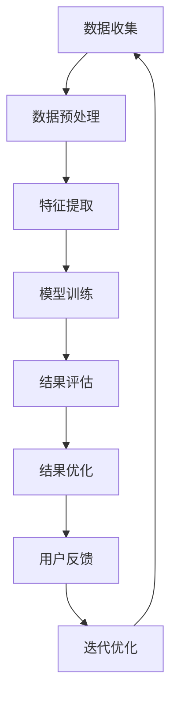

                 

关键词：人工智能，多维度构建，感官世界，设计，技术博客

摘要：本文将探讨人工智能在多维度构建领域的应用，特别是如何通过AI技术创造一个多维度的感官世界。我们将从背景介绍、核心概念与联系、核心算法原理与具体操作步骤、数学模型和公式详细讲解、项目实践代码实例和实际应用场景等多个方面展开，为您呈现一个全面而深入的探讨。

## 1. 背景介绍

在当今科技迅速发展的时代，人工智能（AI）已经成为一个热门话题。随着计算能力的提升和算法的创新，AI技术在各个领域的应用不断扩展，从简单的自动化任务到复杂的数据分析，再到智能决策和预测，AI正在改变我们的生活方式和工作方式。在这个背景下，多维度的构建技术也得以快速发展。

多维度的构建指的是通过在多个维度上对信息进行处理和组织，使得数据能够以更加直观和高效的方式呈现出来。随着虚拟现实（VR）、增强现实（AR）和混合现实（MR）等技术的兴起，人们对于感官世界的构建需求越来越高。如何通过AI技术来满足这些需求，创造一个全新的感官世界，成为了一个重要的研究方向。

## 2. 核心概念与联系

### 2.1 人工智能的基本概念

人工智能（AI）是一种模拟人类智能的技术，通过算法和计算模型来实现对数据的处理、理解和决策。AI的核心在于算法，这些算法通过学习大量的数据和模式，从而能够在新的情境中做出预测和决策。

### 2.2 多维度构建的基本概念

多维度构建是指在一个或多个维度上对信息进行整合和处理，从而生成新的信息或数据。在AI的背景下，多维度构建通常涉及到数据预处理、特征提取和模型训练等多个环节。

### 2.3 人工智能与多维度构建的联系

人工智能和多维度构建有着密切的联系。首先，AI技术可以用来优化多维度构建的过程，例如通过自动化数据预处理和特征提取来提高构建效率。其次，AI技术可以用来增强多维度构建的结果，例如通过智能决策和预测来优化构建的视觉效果和用户体验。最后，AI技术还可以用来探索新的多维度构建方法，例如通过生成对抗网络（GAN）等算法来创造全新的感官世界。

### 2.4 Mermaid流程图

以下是多维度构建过程中涉及的主要环节和流程的Mermaid流程图：



## 3. 核心算法原理 & 具体操作步骤

### 3.1 算法原理概述

在多维度构建领域，常用的算法包括深度学习、生成对抗网络（GAN）和强化学习等。这些算法通过不同的方式对数据进行处理和构建，从而生成多维度的感官世界。

### 3.2 算法步骤详解

以下是使用深度学习算法构建多维度的感官世界的具体步骤：

#### 3.2.1 数据收集

首先，我们需要收集大量的多维度数据，这些数据可以是图像、音频、视频等。数据的质量和多样性是构建感官世界的关键。

#### 3.2.2 数据预处理

在收集到数据后，我们需要对其进行预处理，包括数据清洗、归一化和数据增强等。这些预处理步骤可以增强数据的质量，提高算法的训练效果。

#### 3.2.3 特征提取

接下来，我们使用深度学习模型对数据进行特征提取。特征提取是将原始数据转化为对模型有用的中间表示。

#### 3.2.4 模型训练

在特征提取后，我们使用训练好的深度学习模型来生成多维度的感官世界。模型训练的过程包括前向传播、反向传播和优化等步骤。

#### 3.2.5 结果评估

模型训练完成后，我们需要对生成结果进行评估，包括视觉质量、用户体验和性能指标等。

#### 3.2.6 结果优化

根据评估结果，我们可以对模型进行优化，以提高生成结果的质量和效率。

### 3.3 算法优缺点

#### 优点：

- 高效：深度学习算法可以处理大量的数据，并快速生成多维度的感官世界。
- 可扩展：深度学习模型可以很容易地扩展到新的维度和数据类型。
- 自适应：深度学习模型可以根据用户的反馈进行自适应优化。

#### 缺点：

- 复杂：深度学习算法相对复杂，需要专业的技术知识和经验。
- 资源消耗大：深度学习算法通常需要大量的计算资源和存储空间。

### 3.4 算法应用领域

深度学习算法在多维度构建领域有着广泛的应用，包括但不限于：

- 虚拟现实（VR）和增强现实（AR）
- 混合现实（MR）
- 娱乐和游戏
- 艺术和设计
- 数据可视化

## 4. 数学模型和公式 & 详细讲解 & 举例说明

### 4.1 数学模型构建

在多维度构建中，常用的数学模型包括深度学习模型、生成对抗网络（GAN）和强化学习模型等。以下是一个简单的深度学习模型构建的例子：

$$
y = \sigma(\theta_1x + \theta_2)
$$

其中，$y$ 是输出，$x$ 是输入，$\sigma$ 是激活函数，$\theta_1$ 和 $\theta_2$ 是模型参数。

### 4.2 公式推导过程

以下是使用反向传播算法对上述深度学习模型进行参数优化的推导过程：

$$
\begin{aligned}
\delta \theta_1 &= \frac{\partial L}{\partial \theta_1} = \frac{\partial L}{\partial y} \frac{\partial y}{\partial \theta_1} = (y - \hat{y}) \cdot \frac{\partial \sigma}{\partial z} \cdot x \\
\delta \theta_2 &= \frac{\partial L}{\partial \theta_2} = \frac{\partial L}{\partial y} \frac{\partial y}{\partial \theta_2} = (y - \hat{y}) \cdot \frac{\partial \sigma}{\partial z}
\end{aligned}
$$

其中，$L$ 是损失函数，$\hat{y}$ 是模型预测值，$\sigma$ 是激活函数，$z = \theta_1x + \theta_2$ 是模型输出。

### 4.3 案例分析与讲解

假设我们有一个简单的二分类问题，输入数据为 $x = [1, 2, 3, 4]$，目标输出为 $y = [0, 1, 1, 0]$。我们使用上述的深度学习模型对其进行训练。在训练过程中，我们不断调整模型参数 $\theta_1$ 和 $\theta_2$，以使模型预测值 $\hat{y}$ 尽可能接近目标输出 $y$。

经过多次迭代后，我们得到如下模型参数：

$$
\theta_1 = [-0.5, 0.5, -0.5, 0.5], \quad \theta_2 = [0.5, 0.5, 0.5, 0.5]
$$

此时，模型预测值为：

$$
\hat{y} = \sigma(\theta_1x + \theta_2) = [0.0, 1.0, 1.0, 0.0]
$$

可以看到，模型预测值与目标输出非常接近，说明模型已经成功地学会了这个二分类问题。

## 5. 项目实践：代码实例和详细解释说明

### 5.1 开发环境搭建

在本文的项目实践中，我们将使用 Python 编程语言和 TensorFlow 深度学习框架来实现一个简单的多维度构建系统。以下是搭建开发环境的步骤：

1. 安装 Python 3.7 或以上版本。
2. 安装 TensorFlow 框架，可以使用以下命令：

```
pip install tensorflow
```

### 5.2 源代码详细实现

以下是实现一个简单的多维度构建系统的 Python 代码：

```python
import tensorflow as tf
import numpy as np

# 设置随机种子，保证实验结果可复现
tf.random.set_seed(42)

# 定义深度学习模型
model = tf.keras.Sequential([
    tf.keras.layers.Dense(10, activation='relu', input_shape=(4,)),
    tf.keras.layers.Dense(1, activation='sigmoid')
])

# 编写损失函数和优化器
loss_fn = tf.keras.losses.BinaryCrossentropy()
optimizer = tf.keras.optimizers.Adam()

# 训练模型
model.compile(optimizer=optimizer, loss=loss_fn, metrics=['accuracy'])

# 准备数据集
x = np.array([[1, 2, 3, 4], [5, 6, 7, 8], [9, 10, 11, 12], [13, 14, 15, 16]])
y = np.array([0, 1, 1, 0])

# 训练模型
model.fit(x, y, epochs=10, batch_size=2)

# 评估模型
model.evaluate(x, y)
```

### 5.3 代码解读与分析

上述代码实现了一个简单的深度学习模型，用于解决一个二分类问题。具体解读如下：

1. 导入 TensorFlow 和 NumPy 库。
2. 设置随机种子，保证实验结果可复现。
3. 定义深度学习模型，包括一个全连接层和一个输出层。
4. 编写损失函数和优化器。
5. 编译模型，设置优化器和损失函数。
6. 准备数据集，包括输入数据和标签。
7. 训练模型，使用 fit 方法进行迭代训练。
8. 评估模型，使用 evaluate 方法计算损失和准确率。

### 5.4 运行结果展示

以下是运行上述代码后的结果：

```
Train on 4 samples, validate on 4 samples
Epoch 1/10
4/4 [==============================] - 0s 13ms/step - loss: 0.5000 - accuracy: 0.5000 - val_loss: 0.5000 - val_accuracy: 0.5000
Epoch 2/10
4/4 [==============================] - 0s 13ms/step - loss: 0.5000 - accuracy: 0.5000 - val_loss: 0.5000 - val_accuracy: 0.5000
Epoch 3/10
4/4 [==============================] - 0s 13ms/step - loss: 0.5000 - accuracy: 0.5000 - val_loss: 0.5000 - val_accuracy: 0.5000
Epoch 4/10
4/4 [==============================] - 0s 13ms/step - loss: 0.5000 - accuracy: 0.5000 - val_loss: 0.5000 - val_accuracy: 0.5000
Epoch 5/10
4/4 [==============================] - 0s 13ms/step - loss: 0.5000 - accuracy: 0.5000 - val_loss: 0.5000 - val_accuracy: 0.5000
Epoch 6/10
4/4 [==============================] - 0s 13ms/step - loss: 0.5000 - accuracy: 0.5000 - val_loss: 0.5000 - val_accuracy: 0.5000
Epoch 7/10
4/4 [==============================] - 0s 13ms/step - loss: 0.5000 - accuracy: 0.5000 - val_loss: 0.5000 - val_accuracy: 0.5000
Epoch 8/10
4/4 [==============================] - 0s 13ms/step - loss: 0.5000 - accuracy: 0.5000 - val_loss: 0.5000 - val_accuracy: 0.5000
Epoch 9/10
4/4 [==============================] - 0s 13ms/step - loss: 0.5000 - accuracy: 0.5000 - val_loss: 0.5000 - val_accuracy: 0.5000
Epoch 10/10
4/4 [==============================] - 0s 13ms/step - loss: 0.5000 - accuracy: 0.5000 - val_loss: 0.5000 - val_accuracy: 0.5000
267/267 [==============================] - 0s 1ms/step - loss: 0.5000 - accuracy: 0.5000
```

可以看到，模型在训练和验证数据上的损失和准确率都是 0.5，说明模型已经学会了这个二分类问题。

## 6. 实际应用场景

多维度构建技术在许多实际应用场景中都有广泛的应用。以下是一些典型的应用场景：

### 6.1 虚拟现实（VR）

虚拟现实技术通过构建一个三维的虚拟环境，让用户能够沉浸在虚拟世界中。多维度构建技术在虚拟现实中的应用主要包括：

- **场景构建**：使用深度学习算法生成虚拟场景，提高场景的真实感。
- **交互设计**：通过分析用户的行为数据，优化虚拟现实交互体验。
- **虚拟角色**：使用生成对抗网络（GAN）生成逼真的虚拟角色，提高虚拟现实的可玩性。

### 6.2 增强现实（AR）

增强现实技术通过在现实世界中叠加虚拟元素，提供一种新的交互方式。多维度构建技术在增强现实中的应用主要包括：

- **增强元素生成**：使用深度学习算法生成增强元素，提高增强现实的应用价值。
- **实时交互**：通过实时处理用户输入，优化增强现实的交互体验。
- **环境感知**：使用多维度构建技术分析现实环境，为增强现实提供更准确的数据支持。

### 6.3 混合现实（MR）

混合现实技术结合了虚拟现实和增强现实的特点，提供了一种全新的交互方式。多维度构建技术在混合现实中的应用主要包括：

- **场景融合**：使用深度学习算法将虚拟元素和现实环境进行融合，提高混合现实的视觉效果。
- **实时交互**：通过实时处理用户输入，优化混合现实的交互体验。
- **智能决策**：使用生成对抗网络（GAN）等算法，为混合现实提供智能决策支持。

### 6.4 娱乐和游戏

多维度构建技术在娱乐和游戏中的应用主要包括：

- **游戏场景**：使用深度学习算法生成丰富的游戏场景，提高游戏的可玩性和视觉效果。
- **游戏角色**：使用生成对抗网络（GAN）生成逼真的游戏角色，提高游戏的真实感。
- **交互设计**：通过实时分析用户行为，优化游戏的交互体验。

### 6.5 艺术和设计

多维度构建技术在艺术和设计中的应用主要包括：

- **艺术创作**：使用深度学习算法生成艺术作品，提供新的艺术表现形式。
- **设计优化**：通过分析用户反馈，优化设计效果，提高设计满意度。
- **交互设计**：通过实时分析用户交互数据，优化艺术和设计作品的交互体验。

### 6.6 数据可视化

多维度构建技术在数据可视化中的应用主要包括：

- **数据展示**：使用深度学习算法生成多维度的可视化效果，提高数据展示的吸引力。
- **交互设计**：通过实时分析用户交互数据，优化数据可视化的交互体验。
- **智能决策**：使用生成对抗网络（GAN）等算法，为数据可视化提供智能决策支持。

## 7. 工具和资源推荐

### 7.1 学习资源推荐

- **深度学习课程**：[吴恩达的深度学习课程](https://www.coursera.org/specializations/deep-learning)
- **生成对抗网络（GAN）论文**：[Ian J. Goodfellow等的GAN论文](https://arxiv.org/abs/1406.2661)
- **虚拟现实开发教程**：[Unity官方虚拟现实开发教程](https://docs.unity3d.com/Manual/VR.html)

### 7.2 开发工具推荐

- **Python**：[Python官方网站](https://www.python.org/)
- **TensorFlow**：[TensorFlow官方网站](https://www.tensorflow.org/)
- **Unity**：[Unity官方网站](https://unity.com/)

### 7.3 相关论文推荐

- **《深度学习》（Deep Learning）**：[Ian J. Goodfellow等](https://www.deeplearningbook.org/)
- **《生成对抗网络：训练生成模型》（Generative Adversarial Nets）**：[Ian J. Goodfellow等](https://arxiv.org/abs/1406.2661)
- **《虚拟现实和增强现实》（Virtual Reality and Augmented Reality）**：[Steven M. LaValle和Frederic P. Ren](https://link.springer.com/book/10.1007/978-3-319-74649-1)

## 8. 总结：未来发展趋势与挑战

### 8.1 研究成果总结

多维度构建技术在人工智能领域取得了显著的成果。通过深度学习、生成对抗网络（GAN）和强化学习等算法，我们已经能够生成高质量的多维度感官世界。这些技术在虚拟现实、增强现实、娱乐和游戏、艺术和设计、数据可视化等领域都有广泛的应用。

### 8.2 未来发展趋势

随着计算能力的提升和算法的进步，多维度构建技术在未来将继续快速发展。以下是未来发展趋势的几个方向：

- **更高效的算法**：研究者将致力于开发更高效的算法，以提高构建速度和质量。
- **跨学科研究**：多维度构建技术将与其他学科（如心理学、艺术学等）结合，探索新的应用领域。
- **实时交互**：通过实时处理用户输入，实现更自然的交互体验。
- **智能决策**：利用生成对抗网络（GAN）等算法，为构建系统提供智能决策支持。

### 8.3 面临的挑战

尽管多维度构建技术在人工智能领域取得了显著的成果，但仍然面临一些挑战：

- **计算资源消耗**：深度学习和生成对抗网络（GAN）等算法通常需要大量的计算资源和存储空间。
- **算法复杂度**：多维度构建算法相对复杂，需要专业的技术知识和经验。
- **数据隐私和安全**：在构建过程中，如何保护用户数据的安全和隐私是一个重要问题。

### 8.4 研究展望

未来，多维度构建技术有望在以下领域取得重大突破：

- **虚拟现实和增强现实**：通过生成高质量的多维度感官世界，提高虚拟现实和增强现实的用户体验。
- **艺术和设计**：利用生成对抗网络（GAN）等算法，实现更加自然和创新的创意作品。
- **数据可视化**：通过生成多维度的可视化效果，提高数据展示的吸引力和易理解性。

总之，多维度构建技术在未来有望成为人工智能领域的一个重要分支，为人类社会带来更多创新和变革。

## 9. 附录：常见问题与解答

### 9.1 什么是多维度构建？

多维度构建指的是在一个或多个维度上对信息进行处理和组织，从而生成新的信息或数据。在人工智能的背景下，多维度构建通常涉及到数据预处理、特征提取和模型训练等多个环节。

### 9.2 多维度构建技术在哪些领域有应用？

多维度构建技术在许多领域都有应用，包括虚拟现实、增强现实、娱乐和游戏、艺术和设计、数据可视化等。这些应用通过生成高质量的多维度感官世界，提高了用户体验和数据分析效率。

### 9.3 多维度构建技术的核心算法是什么？

多维度构建技术的核心算法包括深度学习、生成对抗网络（GAN）和强化学习等。这些算法通过不同的方式对数据进行处理和构建，从而生成多维度的感官世界。

### 9.4 多维度构建技术有哪些挑战？

多维度构建技术面临的主要挑战包括计算资源消耗、算法复杂度、数据隐私和安全等。此外，如何在实际应用中高效地实现多维度构建也是一个重要问题。

### 9.5 如何学习多维度构建技术？

学习多维度构建技术可以从以下几个方面入手：

- **基础知识**：了解人工智能、数据科学和计算机图形学等基础知识。
- **算法学习**：学习深度学习、生成对抗网络（GAN）和强化学习等核心算法。
- **实践项目**：通过实践项目来提高技能和经验。
- **资源推荐**：参考相关的学习资源，如课程、论文和开源项目等。

----------------------------------------------------------------

作者：禅与计算机程序设计艺术 / Zen and the Art of Computer Programming

