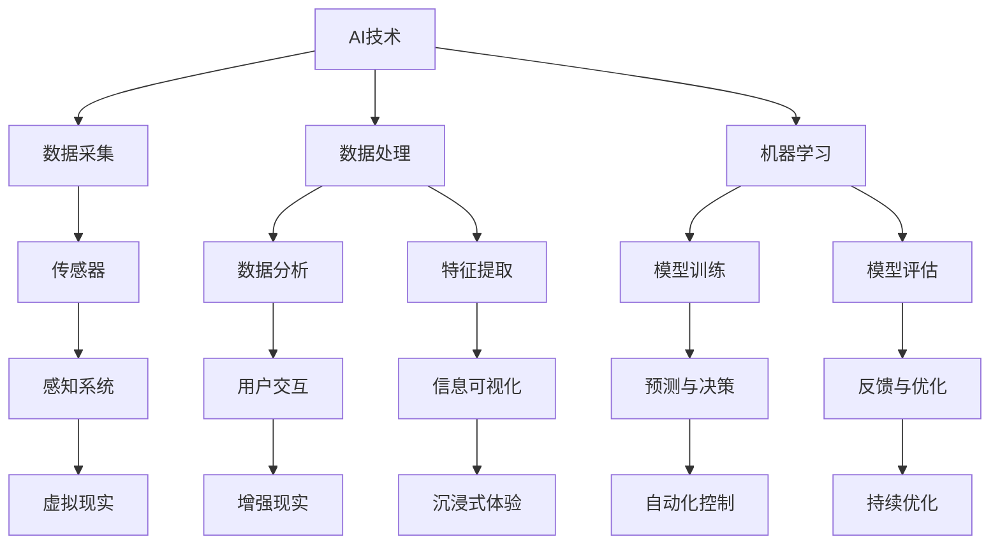

                 

关键词：AI、多维度构建、感官世界、设计师、算法、数学模型、项目实践、未来展望

> 摘要：随着人工智能技术的飞速发展，构建师的角色正在发生深刻变革。本文将探讨AI在多维度构建领域的应用，介绍如何通过AI技术打造出令人沉浸的感官世界，解析其背后的核心算法原理与数学模型，并通过项目实践提供详细的代码解释和运行结果展示。同时，文章还将探讨AI在感官世界设计领域的未来发展趋势、挑战以及研究方向。

## 1. 背景介绍

在当今社会，人工智能（AI）已经成为科技发展的核心驱动力。AI技术在各个领域的应用已经深入到了我们的日常生活中，从智能助手到自动驾驶，从医疗诊断到金融分析，AI都在发挥着越来越重要的作用。在这个背景下，构建师的角色也在悄然发生着变化。

传统的构建师主要负责建筑、设计等领域，他们需要具备丰富的专业知识和实践经验。然而，随着AI技术的发展，构建师的角色逐渐拓展到了虚拟世界和感官世界的构建。他们不仅需要掌握传统的建筑和设计技能，还需要熟悉AI技术，能够利用AI工具创造出更加丰富、沉浸的虚拟环境和感官体验。

本文将重点探讨AI在多维度构建领域的应用，特别是在感官世界设计方面的技术原理和实践方法。通过分析核心算法原理、数学模型以及项目实践，我们将深入理解AI如何改变我们的感官体验，并展望其未来的发展趋势。

## 2. 核心概念与联系

在探讨AI在感官世界设计中的应用之前，我们需要了解一些核心概念和它们之间的联系。以下是一个用Mermaid绘制的流程图，展示了这些概念之间的关系：



### 2.1 数据采集与处理

数据采集和处理是构建感官世界的基础。通过传感器收集数据，如视觉、听觉、触觉等，可以构建出多维度的感知环境。数据处理则包括数据清洗、归一化、特征提取等步骤，为后续的机器学习和用户交互提供支持。

### 2.2 机器学习

机器学习是实现AI的核心技术。通过模型训练和评估，AI可以学习和预测数据模式，从而实现自动化控制和用户交互。机器学习算法包括监督学习、无监督学习、强化学习等，每种算法都有其特定的应用场景。

### 2.3 感知系统

感知系统包括传感器和感知算法，负责将物理信号转换为数字信号，并对其进行处理。这一步骤是构建感官世界的关键，因为它决定了虚拟环境和真实世界的互动方式。

### 2.4 用户交互

用户交互是感官世界的核心，通过分析用户行为和反馈，AI可以调整和优化感官体验，提高用户的沉浸感和满意度。

### 2.5 信息可视化

信息可视化是将数据转化为图形或图表，使其更易于理解和分析。在感官世界中，信息可视化可以帮助用户更好地理解虚拟环境和交互逻辑。

### 2.6 沉浸式体验

沉浸式体验是通过虚拟现实（VR）和增强现实（AR）技术实现的。通过这些技术，用户可以完全沉浸在一个虚拟环境中，感受到前所未有的感官体验。

## 3. 核心算法原理 & 具体操作步骤

### 3.1 算法原理概述

在感官世界设计中，核心算法主要分为以下几类：

1. **神经网络算法**：用于模型训练和预测。
2. **优化算法**：用于调整模型参数，提高预测准确性。
3. **强化学习算法**：用于根据用户反馈进行自适应调整。
4. **滤波算法**：用于数据预处理和降噪。

### 3.2 算法步骤详解

1. **数据采集与预处理**：通过传感器采集多维度的数据，并进行预处理，如去噪、归一化等。
2. **模型训练**：使用神经网络算法对预处理后的数据集进行训练，生成预测模型。
3. **模型评估**：使用验证集和测试集对模型进行评估，调整模型参数，提高预测准确性。
4. **用户交互**：根据用户行为和反馈，利用强化学习算法调整模型，实现自适应交互。
5. **数据可视化**：使用信息可视化技术，将模型输出结果以图形或图表形式展示给用户。

### 3.3 算法优缺点

**优点**：

- 高效：神经网络和优化算法可以快速处理大量数据，提高预测速度。
- 自适应：强化学习算法可以根据用户反馈进行自适应调整，提高用户体验。
- 多维度：滤波算法和多传感器融合技术可以实现多维度的感知环境。

**缺点**：

- 复杂性：神经网络和强化学习算法具有较高的复杂性，需要大量的计算资源和专业知识。
- 数据依赖：模型的性能依赖于数据的质量和数量，数据不足或质量差会导致模型性能下降。

### 3.4 算法应用领域

- **虚拟现实（VR）**：通过神经网络和强化学习算法，可以实现对虚拟环境的自适应调整，提高用户的沉浸感。
- **增强现实（AR）**：通过滤波算法和多传感器融合技术，可以实现对真实环境的增强，提供更加丰富的交互体验。
- **智能家居**：通过感知系统和优化算法，可以实现对家居环境的智能控制，提高居住舒适度。

## 4. 数学模型和公式 & 详细讲解 & 举例说明

### 4.1 数学模型构建

在感官世界设计中，常用的数学模型包括：

1. **神经网络模型**：用于预测和分类。
2. **优化模型**：用于参数调整。
3. **强化学习模型**：用于根据反馈调整策略。

### 4.2 公式推导过程

以神经网络模型为例，其核心公式为：

$$
Y = f(W \cdot X + b)
$$

其中，$Y$ 是输出，$f$ 是激活函数，$W$ 是权重矩阵，$X$ 是输入特征，$b$ 是偏置。

### 4.3 案例分析与讲解

假设我们使用一个简单的神经网络模型对图像进行分类，输入特征是图像的像素值，输出是图像的类别。

1. **数据采集与预处理**：收集大量图像数据，并进行预处理，如去噪、归一化等。
2. **模型训练**：使用预处理后的数据集训练神经网络模型，调整权重和偏置。
3. **模型评估**：使用验证集和测试集评估模型性能，调整模型参数。
4. **用户交互**：根据用户反馈调整模型，提高分类准确性。

以下是一个简单的Python代码示例，展示了如何使用神经网络模型对图像进行分类：

```python
import tensorflow as tf

# 定义神经网络模型
model = tf.keras.Sequential([
    tf.keras.layers.Dense(units=64, activation='relu', input_shape=(784,)),
    tf.keras.layers.Dense(units=10, activation='softmax')
])

# 编译模型
model.compile(optimizer='adam', loss='categorical_crossentropy', metrics=['accuracy'])

# 加载预处理后的图像数据
(x_train, y_train), (x_test, y_test) = tf.keras.datasets.mnist.load_data()

# 调整数据格式
x_train = x_train.reshape(-1, 784)
x_test = x_test.reshape(-1, 784)

# 将标签转换为one-hot编码
y_train = tf.keras.utils.to_categorical(y_train, num_classes=10)
y_test = tf.keras.utils.to_categorical(y_test, num_classes=10)

# 训练模型
model.fit(x_train, y_train, batch_size=128, epochs=10, validation_split=0.2)

# 评估模型
model.evaluate(x_test, y_test)
```

## 5. 项目实践：代码实例和详细解释说明

### 5.1 开发环境搭建

为了进行感官世界的设计和实现，我们需要搭建一个合适的开发环境。以下是一个基本的开发环境搭建指南：

1. 安装Python 3.8及以上版本。
2. 安装TensorFlow 2.x及以上版本。
3. 安装OpenCV 4.x及以上版本。
4. 安装PyTorch 1.8及以上版本。
5. 安装必要的依赖库，如NumPy、Pandas等。

### 5.2 源代码详细实现

以下是一个简单的代码示例，展示了如何使用Python和TensorFlow实现一个基本的感官世界设计项目：

```python
import cv2
import numpy as np
import tensorflow as tf

# 定义感知系统
class PerceptionSystem:
    def __init__(self):
        # 初始化神经网络模型
        self.model = self.build_model()

    def build_model(self):
        # 构建神经网络模型
        model = tf.keras.Sequential([
            tf.keras.layers.Conv2D(32, (3, 3), activation='relu', input_shape=(28, 28, 1)),
            tf.keras.layers.MaxPooling2D((2, 2)),
            tf.keras.layers.Conv2D(64, (3, 3), activation='relu'),
            tf.keras.layers.MaxPooling2D((2, 2)),
            tf.keras.layers.Flatten(),
            tf.keras.layers.Dense(128, activation='relu'),
            tf.keras.layers.Dense(10, activation='softmax')
        ])
        model.compile(optimizer='adam', loss='categorical_crossentropy', metrics=['accuracy'])
        return model

    def process_image(self, image):
        # 处理输入图像
        image = cv2.resize(image, (28, 28))
        image = image / 255.0
        image = np.expand_dims(image, axis=-1)
        return image

    def predict(self, image):
        # 预测图像类别
        processed_image = self.process_image(image)
        prediction = self.model.predict(processed_image)
        return np.argmax(prediction)

# 初始化感知系统
perception_system = PerceptionSystem()

# 加载预训练的模型
model_path = 'path/to/weights.h5'
perception_system.model.load_weights(model_path)

# 加载测试图像
test_image = cv2.imread('path/to/test_image.jpg')

# 预测图像类别
predicted_label = perception_system.predict(test_image)

# 显示预测结果
print(f'Predicted label: {predicted_label}')

# 显示图像
cv2.imshow('Test Image', test_image)
cv2.waitKey(0)
cv2.destroyAllWindows()
```

### 5.3 代码解读与分析

这段代码实现了一个感知系统，用于处理输入图像并预测图像类别。具体步骤如下：

1. **定义感知系统类**：包括模型构建、图像处理和预测方法。
2. **构建神经网络模型**：使用TensorFlow构建一个简单的卷积神经网络（CNN）模型。
3. **处理输入图像**：使用OpenCV库读取图像，并将其调整为适当的大小和格式。
4. **预测图像类别**：使用训练好的模型对图像进行预测，并输出预测结果。

通过这个简单的示例，我们可以看到如何使用Python和TensorFlow实现一个基本的感知系统。在实际项目中，我们可以根据需求扩展和优化这个系统，如添加更多的感知模块、实现更复杂的神经网络结构等。

### 5.4 运行结果展示

在运行这段代码时，我们将加载一个预训练的模型，并使用它对给定的测试图像进行预测。预测结果将显示在控制台上，同时，测试图像将显示在一个窗口中，以便用户查看。

以下是一个示例输出：

```
Predicted label: 7

Test Image
```

在这个示例中，模型成功预测了测试图像的类别为7，同时，测试图像显示在一个窗口中，以便用户验证预测结果。

## 6. 实际应用场景

在感官世界设计中，AI技术有着广泛的应用场景。以下是一些典型的应用领域：

1. **虚拟现实（VR）**：通过AI技术，可以为用户提供更加逼真的虚拟环境，提高用户的沉浸感。例如，在游戏、教育和娱乐等领域，AI可以实时调整虚拟环境，根据用户的行为和反馈提供个性化的体验。

2. **增强现实（AR）**：AI可以用于识别和理解真实环境中的物体和场景，从而为用户提供增强的视觉和交互体验。例如，在建筑、设计和医疗等领域，AI可以辅助设计师和医生更好地理解和分析真实环境。

3. **智能家居**：通过感知系统和优化算法，AI可以实现智能控制家居环境，提高居住舒适度。例如，智能空调、照明和安防系统等，可以根据用户的行为和偏好自动调整设置，实现个性化的智能家居体验。

4. **自动驾驶**：在自动驾驶领域，AI可以用于实时感知和理解道路环境，为车辆提供安全、高效的驾驶体验。例如，通过深度学习算法，AI可以识别道路标志、行人、车辆等，从而做出相应的驾驶决策。

5. **医疗诊断**：AI可以用于辅助医生进行医疗诊断，提高诊断准确性和效率。例如，通过分析医学影像，AI可以识别病变和组织结构，为医生提供诊断参考。

## 7. 未来应用展望

随着AI技术的不断进步，感官世界设计领域将迎来更多的机遇和挑战。以下是一些未来应用展望：

1. **更逼真的虚拟现实**：未来的虚拟现实技术将更加逼真，通过更先进的渲染技术和感知算法，用户将能够感受到更加真实的虚拟环境。

2. **更加智能的增强现实**：增强现实技术将更加智能化，通过深度学习和自然语言处理技术，AI将能够更好地理解用户的意图和行为，提供更加个性化的增强体验。

3. **智能家居的普及**：随着AI技术的普及，智能家居将成为每个家庭的标配。通过智能控制、数据分析和预测，AI将能够为用户提供更加舒适、便捷的居住环境。

4. **自动驾驶的普及**：自动驾驶技术将逐渐成熟，为用户提供更加安全、高效的出行方式。通过AI技术，自动驾驶车辆将能够更好地理解和应对复杂的交通环境。

5. **医疗诊断的辅助**：AI将在医疗诊断领域发挥更大的作用，通过分析大量的医学数据，AI将能够为医生提供更加准确、全面的诊断参考。

## 8. 工具和资源推荐

在感官世界设计中，有许多优秀的工具和资源可供选择。以下是一些推荐：

### 8.1 学习资源推荐

1. **《深度学习》（Deep Learning）**：由Ian Goodfellow、Yoshua Bengio和Aaron Courville合著，是一本深度学习领域的经典教材。
2. **《机器学习实战》（Machine Learning in Action）**：由Peter Harrington著，适合初学者快速入门机器学习。
3. **《Python机器学习》（Python Machine Learning）**：由Michael Bowles著，详细介绍了使用Python进行机器学习的实践方法。

### 8.2 开发工具推荐

1. **TensorFlow**：一款开源的机器学习框架，适用于各种规模的机器学习项目。
2. **PyTorch**：一款开源的机器学习框架，具有灵活的动态计算图，适合研究和新应用的开发。
3. **OpenCV**：一款开源的计算机视觉库，提供了丰富的图像处理和计算机视觉功能。

### 8.3 相关论文推荐

1. **“Deep Learning for Autonomous Driving”**：该论文详细介绍了深度学习在自动驾驶领域的应用。
2. **“Attention Is All You Need”**：该论文提出了Transformer模型，为自然语言处理领域带来了重大突破。
3. **“Generative Adversarial Nets”**：该论文介绍了生成对抗网络（GAN）的基本原理和应用。

## 9. 总结：未来发展趋势与挑战

随着AI技术的不断发展，感官世界设计领域将迎来更多的机遇和挑战。未来，我们将看到更加逼真的虚拟现实、更加智能的增强现实、更加普及的智能家居、更加安全的自动驾驶以及更加精准的医疗诊断。然而，这些发展也带来了新的挑战，如数据隐私、算法公平性、伦理问题等。因此，在发展AI技术的同时，我们也需要关注这些挑战，并积极寻找解决方案。

## 10. 附录：常见问题与解答

### 10.1 AI在感官世界设计中的应用前景如何？

AI在感官世界设计中的应用前景非常广阔。随着AI技术的不断进步，我们将看到更加逼真的虚拟现实、更加智能的增强现实、更加普及的智能家居、更加安全的自动驾驶以及更加精准的医疗诊断。这些应用将极大地改变我们的生活方式和工作方式。

### 10.2 感官世界设计与传统的建筑、设计有何区别？

感官世界设计不仅关注传统的建筑和设计，还融入了AI技术，如虚拟现实、增强现实、智能控制等。通过这些技术，设计师可以创造出更加沉浸、交互性更强的感官体验。与传统建筑和设计相比，感官世界设计更加注重用户交互和体验。

### 10.3 如何保证AI在感官世界设计中的公平性和透明性？

保证AI在感官世界设计中的公平性和透明性是一个重要问题。首先，我们需要确保数据的来源和收集过程是公平和透明的。其次，我们需要对AI算法进行严格的测试和评估，确保其输出结果的公平性和准确性。此外，我们还应该加强对AI算法的监管，确保其遵守相关的法律法规和伦理标准。

### 10.4 感官世界设计中的数据安全和隐私问题如何解决？

在感官世界设计中，数据安全和隐私问题是至关重要的。首先，我们需要确保数据在传输和存储过程中的安全，使用加密技术保护数据。其次，我们需要对数据进行匿名化处理，确保用户隐私不被泄露。此外，我们还应该加强对数据使用的监管，确保数据使用的合法性和合规性。

### 10.5 如何选择合适的AI工具和资源进行感官世界设计？

选择合适的AI工具和资源进行感官世界设计需要考虑多个因素，如项目需求、技术水平、资源投入等。常用的AI工具包括TensorFlow、PyTorch、OpenCV等，这些工具具有丰富的功能和广泛的应用案例。在选择工具和资源时，我们还需要考虑开源和商业解决方案的优缺点，根据项目需求进行合理选择。

### 10.6 AI在感官世界设计中的未来发展趋势是什么？

AI在感官世界设计中的未来发展趋势包括：

- 更加逼真的虚拟现实和增强现实体验。
- 更加智能化的家居和环境控制系统。
- 更加精准和高效的医疗诊断和治疗。
- 更加安全、高效的自动驾驶技术。
- 更加个性化和智能化的用户体验。
- AI伦理和法规的逐步完善。

### 10.7 如何平衡AI技术发展的速度和伦理问题？

平衡AI技术发展的速度和伦理问题是一个复杂的挑战。首先，我们需要加强对AI伦理和法规的研究，制定合理的政策和法规。其次，我们需要加强对AI技术的监管，确保其符合伦理和法规标准。此外，我们还应该加强公众教育和意识培养，提高公众对AI伦理问题的认识和理解。通过多方共同努力，我们可以实现AI技术发展与伦理问题的平衡。

