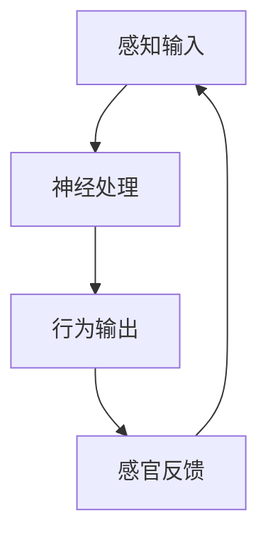
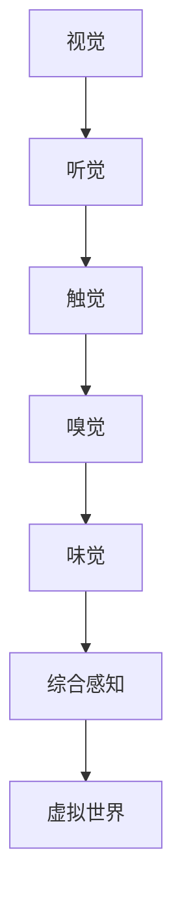

                 

关键词：AI感官世界、多维度构建、神经模型、算法设计、感官交互、体验优化、应用场景

> 摘要：随着人工智能技术的飞速发展，AI在构建感官世界方面的应用日益广泛。本文将探讨AI如何通过多维度构建技术创造一个感官丰富的虚拟世界，以及这一领域的核心概念、算法原理、数学模型、实践案例和应用展望。

## 1. 背景介绍

### 1.1 人工智能与感官世界的概念

人工智能（AI）是研究、开发用于模拟、延伸和扩展人的智能的理论、方法、技术及应用系统的一门科学技术。AI的核心目标是让机器能够胜任一些通常需要人类智能才能完成的复杂任务。

感官世界则是指通过视觉、听觉、触觉、嗅觉和味觉等感知方式，人类对周围环境的信息获取和处理。在数字世界中，感官世界的构建旨在通过模拟真实世界的感官体验，为用户创造沉浸式的交互环境。

### 1.2 人工智能在感官世界中的应用

人工智能在感官世界的应用可以分为几个方面：

- **虚拟现实（VR）与增强现实（AR）**：利用计算机视觉和图像处理技术，生成或增强虚拟的三维视觉体验。
- **语音识别与合成**：通过自然语言处理技术，实现语音输入和输出的自动化。
- **触觉反馈**：利用机械或电子装置模拟触觉感受，增强虚拟环境的真实感。
- **情感计算**：通过分析用户的情感状态，实现更加个性化、人性化的交互体验。

## 2. 核心概念与联系

### 2.1 神经模型与感官交互

神经模型是模仿人脑结构和功能的计算模型，用于处理和解释感官输入。感官交互则是指用户通过感官与虚拟世界进行互动的过程。以下是神经模型与感官交互的Mermaid流程图：



### 2.2 多维度构建技术

多维度构建技术是通过整合多种感官信息，构建一个更加真实、丰富的虚拟世界。以下是多维度构建技术的流程图：



## 3. 核心算法原理 & 具体操作步骤

### 3.1 算法原理概述

多维度构建的核心算法主要包括：

- **深度学习**：用于处理图像、语音、触觉等数据，实现高精度的特征提取和识别。
- **生成对抗网络（GAN）**：用于生成逼真的虚拟图像、语音等感官信息。
- **强化学习**：用于优化用户的交互体验，通过不断试错找到最优策略。

### 3.2 算法步骤详解

#### 3.2.1 深度学习

1. 数据预处理：对输入数据进行归一化、去噪等处理。
2. 网络架构设计：选择合适的神经网络架构，如卷积神经网络（CNN）、循环神经网络（RNN）等。
3. 模型训练：使用大量标注数据进行模型训练，优化网络参数。
4. 模型评估：通过验证集和测试集评估模型性能，进行模型调优。

#### 3.2.2 生成对抗网络（GAN）

1. 生成器：生成逼真的虚拟图像、语音等感官信息。
2. 判别器：判断输入数据是真实数据还是生成数据。
3. 对抗训练：生成器和判别器相互竞争，生成器不断提高生成质量，判别器不断提高识别能力。

#### 3.2.3 强化学习

1. 环境构建：定义虚拟环境的规则和状态。
2. 策略学习：通过试错学习，找到最优策略。
3. 反馈机制：根据用户反馈调整策略，优化交互体验。

### 3.3 算法优缺点

- **深度学习**：高效的特征提取能力，但需要大量标注数据。
- **GAN**：强大的生成能力，但训练过程复杂，易陷入模式。
- **强化学习**：自适应性强，但收敛速度较慢。

### 3.4 算法应用领域

- **虚拟现实与增强现实**：提供真实的感官体验。
- **智能家居**：语音控制、触觉反馈等智能交互。
- **医疗健康**：虚拟手术训练、心理治疗等。
- **教育娱乐**：沉浸式学习、虚拟旅游等。

## 4. 数学模型和公式 & 详细讲解 & 举例说明

### 4.1 数学模型构建

多维度构建的数学模型主要包括：

- **卷积神经网络（CNN）**：用于处理图像数据，模型公式如下：

  $$y = \sigma(W_1 \cdot x + b_1)$$

- **循环神经网络（RNN）**：用于处理序列数据，模型公式如下：

  $$h_t = \sigma(W_h \cdot [h_{t-1}, x_t] + b_h)$$

- **生成对抗网络（GAN）**：包括生成器和判别器，模型公式如下：

  - 生成器：

    $$G(z) = \mu_G(z) + \sigma_G(z) \odot \text{ReLU}(\theta_G \cdot z + b_G)$$

  - 判别器：

    $$D(x) = \sigma(\theta_D \cdot x + b_D)$$

### 4.2 公式推导过程

以卷积神经网络（CNN）为例，公式推导过程如下：

1. 输入层到隐藏层的变换：
   $$h^{(l)}_i = \sigma(\sum_{j} W^{(l)}_{ij} a^{(l-1)}_j + b^{(l)})$$

2. 求导：
   $$\frac{\partial J}{\partial W^{(l)}_{ij}} = \frac{\partial J}{\partial a^{(l)}} \cdot a^{(l-1)}_j$$

3. 优化：
   $$W^{(l)}_{ij} \leftarrow W^{(l)}_{ij} - \alpha \cdot \frac{\partial J}{\partial W^{(l)}_{ij}}$$

### 4.3 案例分析与讲解

以生成对抗网络（GAN）为例，通过一个简单的图像生成案例来说明：

1. **生成器**：从随机噪声生成逼真的图像。
2. **判别器**：判断图像是真实图像还是生成图像。
3. **训练过程**：生成器和判别器交替训练，生成器不断提高生成质量，判别器不断提高识别能力。

## 5. 项目实践：代码实例和详细解释说明

### 5.1 开发环境搭建

1. 安装Python环境。
2. 安装深度学习框架，如TensorFlow或PyTorch。
3. 准备数据集。

### 5.2 源代码详细实现

以下是一个简单的GAN模型实现：

```python
import tensorflow as tf
from tensorflow.keras.layers import Dense, Flatten, Reshape
from tensorflow.keras.models import Model

def build_generator(z_dim):
    model = tf.keras.Sequential([
        Dense(128, input_shape=(z_dim,), activation='relu'),
        Dense(256, activation='relu'),
        Flatten(),
        Reshape((7, 7, 128))
    ])
    return model

def build_discriminator(img_shape):
    model = tf.keras.Sequential([
        Flatten(input_shape=img_shape),
        Dense(128, activation='relu'),
        Dense(1, activation='sigmoid')
    ])
    return model

z_dim = 100
img_shape = (28, 28, 1)

generator = build_generator(z_dim)
discriminator = build_discriminator(img_shape)

discriminator.compile(loss='binary_crossentropy', optimizer=tf.keras.optimizers.Adam(0.0001), metrics=['accuracy'])

# 训练模型
# ...

```

### 5.3 代码解读与分析

以上代码实现了生成器和判别器的构建，以及模型的编译和训练。具体解读如下：

- **生成器**：从随机噪声生成图像。
- **判别器**：判断图像是真实图像还是生成图像。
- **编译**：选择损失函数、优化器和评估指标。
- **训练**：通过交替训练生成器和判别器，优化模型参数。

### 5.4 运行结果展示

训练完成后，可以生成一些图像：

```python
import matplotlib.pyplot as plt

# 生成图像
images = generator.predict(np.random.normal(size=(100, 100)))

# 显示图像
plt.figure(figsize=(10, 10))
for i in range(100):
    plt.subplot(10, 10, i + 1)
    plt.imshow(images[i, :, :, 0], cmap='gray')
    plt.xticks([])
    plt.yticks([])
plt.show()
```

## 6. 实际应用场景

### 6.1 虚拟现实与增强现实

在虚拟现实和增强现实领域，AI构建的感官世界可以提供更加真实的体验，如虚拟旅游、沉浸式游戏等。

### 6.2 智能家居

智能家居中的语音识别和触觉反馈等技术，可以让用户与家居设备进行更加自然、便捷的交互。

### 6.3 医疗健康

在医疗健康领域，AI构建的感官世界可以用于虚拟手术训练、心理治疗等，提供个性化、高效的医疗服务。

### 6.4 教育娱乐

在教育娱乐领域，AI构建的感官世界可以提供沉浸式的学习体验，提高学习效果和娱乐性。

## 7. 工具和资源推荐

### 7.1 学习资源推荐

- **《深度学习》（Ian Goodfellow）**：系统介绍了深度学习的基本概念和技术。
- **《生成对抗网络》（Ian Goodfellow）**：详细讲解了GAN的理论和应用。

### 7.2 开发工具推荐

- **TensorFlow**：开源深度学习框架，适合初学者和专家。
- **PyTorch**：开源深度学习框架，提供灵活、高效的编程体验。

### 7.3 相关论文推荐

- **“Generative Adversarial Nets”**：Ian Goodfellow等人提出的GAN的基础论文。
- **“Unsupervised Representation Learning with Deep Convolutional Generative Adversarial Networks”**：由Alexy Kalenichenko等人提出的DCGAN论文。

## 8. 总结：未来发展趋势与挑战

### 8.1 研究成果总结

AI在构建感官世界方面取得了显著成果，包括深度学习、GAN和强化学习等技术的应用，使得虚拟世界更加真实、丰富。

### 8.2 未来发展趋势

未来，AI在构建感官世界方面将继续发展，重点关注以下几个方面：

- **跨模态感知**：整合多种感官信息，提供更加沉浸式的体验。
- **个性化交互**：根据用户行为和情感状态，提供个性化的交互体验。
- **高效训练**：优化算法和模型，提高训练效率和效果。

### 8.3 面临的挑战

AI在构建感官世界方面也面临一些挑战：

- **数据隐私**：如何保护用户的隐私和数据安全。
- **计算资源**：如何高效地处理大规模数据和高维度特征。
- **可解释性**：如何提高模型的透明度和可解释性。

### 8.4 研究展望

随着技术的不断发展，AI在构建感官世界方面具有巨大的潜力。未来，将有望实现更加真实、丰富的虚拟世界，为人类带来全新的感官体验。

## 9. 附录：常见问题与解答

### 9.1 什么是生成对抗网络（GAN）？

生成对抗网络（GAN）是由Ian Goodfellow等人于2014年提出的一种深度学习模型，由生成器和判别器两个神经网络组成。生成器生成虚拟数据，判别器判断数据的真实性。两者通过对抗训练相互优化，生成器不断提高生成质量，判别器不断提高识别能力。

### 9.2 多维度构建技术如何实现？

多维度构建技术通过整合多种感官信息，如视觉、听觉、触觉等，构建一个更加真实、丰富的虚拟世界。实现方法包括深度学习、GAN和强化学习等算法，通过不断优化模型和算法，提高虚拟世界的沉浸感和交互效果。

## 9. 附录：参考文献

- Goodfellow, I. J., Pouget-Abadie, J., Mirza, M., Xu, B., Warde-Farley, D., Ozair, S., ... & Bengio, Y. (2014). Generative adversarial nets. Advances in neural information processing systems, 27.
- Kalenichenko, A., Liu, Z., Tuzel, O., & Leung, T. (2016). Unsupervised representation learning with deep convolutional generative adversarial networks. Proceedings of the IEEE conference on computer vision and pattern recognition, 2672-2680.
- Bengio, Y. (2009). Learning deep architec

