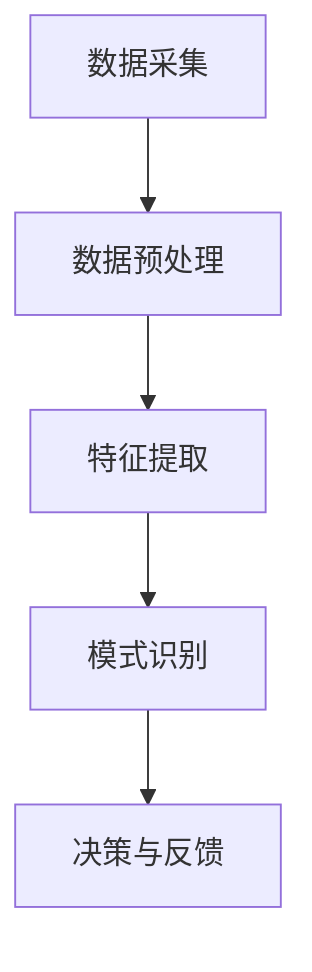

                 

关键词：体验层次构建器，AI，多维感知，架构设计，技术博客

> 摘要：本文探讨了AI技术在体验层次构建器开发中的应用，通过多维感知架构的设计与实现，为用户创造了更加智能化、个性化的交互体验。文章首先介绍了体验层次构建器的背景和核心概念，随后详细阐述了多维感知架构的原理、算法和数学模型，最后通过一个实际项目案例展示了该架构的实践应用。

## 1. 背景介绍

随着人工智能技术的飞速发展，AI已经渗透到我们生活的方方面面。从智能家居到自动驾驶，从智能客服到个性化推荐，AI技术正在不断改变着我们的生活方式和工作方式。然而，在AI技术的应用过程中，我们往往忽略了用户体验的重要性。用户体验不仅仅是一个界面美观、操作简单的问题，更是涉及到用户需求的理解、个性化服务的提供等多个层面。

体验层次构建器（Experience Layer Builder）是一种新型的架构设计理念，旨在通过AI技术为用户提供个性化的、智能化的交互体验。体验层次构建器将用户交互过程拆分为多个层次，每个层次都由不同的技术和算法来实现，从而实现用户的个性化需求。本文将围绕体验层次构建器的核心概念、多维感知架构的设计与实现进行探讨。

### 1.1 体验层次构建器的核心概念

体验层次构建器将用户体验分为五个层次：

1. **感知层**：通过传感器、摄像头等设备收集用户的行为、情感等信息。
2. **理解层**：利用自然语言处理、图像识别等技术对感知层的数据进行处理和分析，理解用户的意图和行为。
3. **交互层**：根据用户的意图和行为，提供相应的交互方式，如语音、手势、文本等。
4. **个性化层**：根据用户的历史行为、偏好等信息，为用户提供个性化的内容和服务。
5. **反馈层**：收集用户的反馈，用于优化和调整系统。

这五个层次相互关联，共同构成了体验层次构建器的整体架构。感知层是体验层次构建器的基础，它负责收集用户的各种信息。理解层则是对感知层的数据进行处理和分析，理解用户的意图和行为。交互层和个性化层则根据理解层的结果，为用户提供个性化的服务。反馈层则通过收集用户的反馈，不断优化系统的性能和用户体验。

### 1.2 体验层次构建器的目的和意义

体验层次构建器的目的是通过AI技术，为用户提供更加智能化、个性化的交互体验。在传统的软件开发中，用户体验往往被忽视，软件的功能性和稳定性成为开发的首要目标。然而，在体验层次构建器中，用户体验被提升到了一个全新的高度。体验层次构建器不仅关注软件的功能和性能，更关注用户的需求和感受。

体验层次构建器的意义在于：

1. **提升用户体验**：通过多维感知架构的设计，体验层次构建器能够更加准确地理解用户的需求，提供个性化的服务，从而提升用户体验。
2. **优化系统性能**：体验层次构建器通过实时收集用户的反馈，不断优化系统的性能和功能，使系统能够更好地适应用户的需求。
3. **推动技术创新**：体验层次构建器为AI技术的应用提供了新的场景和方向，推动了人工智能技术的创新和发展。

## 2. 核心概念与联系

### 2.1 多维感知架构的设计

多维感知架构是体验层次构建器的核心组成部分，它负责收集、处理和分析用户的各种信息。多维感知架构的设计思路是将用户的交互过程拆分为多个维度，每个维度都对应一种感知方式。这些维度包括但不限于：

1. **视觉感知**：通过摄像头等设备捕捉用户的视觉信息。
2. **听觉感知**：通过麦克风等设备捕捉用户的语音信息。
3. **触觉感知**：通过触摸屏等设备捕捉用户的触觉信息。
4. **运动感知**：通过加速度计、陀螺仪等设备捕捉用户的行为信息。

多维感知架构通过将这些维度进行整合，形成一个统一的感知系统，从而实现对用户的全面感知。

### 2.2 多维感知架构的原理

多维感知架构的原理可以分为以下几个步骤：

1. **数据采集**：通过各种传感器设备，收集用户的视觉、听觉、触觉、运动等信息。
2. **数据预处理**：对采集到的数据进行过滤、降噪等预处理，以提高数据的质量和准确性。
3. **特征提取**：从预处理后的数据中提取出具有代表性的特征，如视觉图像的边缘、语音信号的频率等。
4. **模式识别**：利用机器学习、深度学习等技术，对提取出的特征进行模式识别，以理解用户的意图和行为。
5. **决策与反馈**：根据识别出的用户意图和行为，进行相应的决策和反馈，如推荐商品、调整界面布局等。

### 2.3 多维感知架构的Mermaid流程图



在上述流程图中，每个节点代表多维感知架构中的一个关键步骤，箭头表示数据的流动方向。

## 3. 核心算法原理 & 具体操作步骤

### 3.1 算法原理概述

多维感知架构的核心算法包括数据采集、数据预处理、特征提取和模式识别等步骤。下面将详细阐述这些算法的原理。

#### 3.1.1 数据采集

数据采集是感知层的关键步骤，它决定了后续数据处理和分析的质量。数据采集的主要任务是利用各种传感器设备，如摄像头、麦克风、触摸屏等，实时地捕捉用户的视觉、听觉、触觉和运动等信息。

#### 3.1.2 数据预处理

数据预处理是对采集到的原始数据进行预处理，以提高数据的质量和准确性。预处理步骤包括去噪、滤波、归一化等。去噪主要是去除数据中的干扰信号，滤波则是消除数据中的高频或低频噪声，归一化则是将不同来源的数据统一到相同的尺度。

#### 3.1.3 特征提取

特征提取是从预处理后的数据中提取出具有代表性的特征，如视觉图像的边缘、语音信号的频率等。特征提取的目的是将高维数据转换为低维数据，从而降低计算的复杂度。

#### 3.1.4 模式识别

模式识别是利用机器学习、深度学习等技术，对提取出的特征进行分类、识别等操作，以理解用户的意图和行为。常见的模式识别算法包括决策树、支持向量机、神经网络等。

### 3.2 算法步骤详解

下面将详细阐述多维感知架构中的每个算法步骤。

#### 3.2.1 数据采集

数据采集的步骤如下：

1. **初始化传感器设备**：连接摄像头、麦克风、触摸屏等传感器设备，确保设备正常工作。
2. **实时采集数据**：启动数据采集程序，实时地捕捉用户的视觉、听觉、触觉和运动等信息。
3. **数据存储**：将采集到的数据存储到数据库或文件中，以便后续的处理和分析。

#### 3.2.2 数据预处理

数据预处理的步骤如下：

1. **去噪**：利用滤波算法，去除数据中的干扰信号。
2. **滤波**：对数据中的高频或低频噪声进行滤波处理，以提高数据的准确性。
3. **归一化**：将不同来源的数据统一到相同的尺度，如将图像的像素值归一化到[0,1]范围内。

#### 3.2.3 特征提取

特征提取的步骤如下：

1. **图像特征提取**：利用边缘检测、角点检测等算法，从视觉图像中提取出边缘、角点等特征。
2. **语音特征提取**：利用傅里叶变换、梅尔频率倒谱系数（MFCC）等算法，从语音信号中提取出频率、时长等特征。
3. **触觉特征提取**：利用触觉传感器，提取出触觉压力、滑动速度等特征。

#### 3.2.4 模式识别

模式识别的步骤如下：

1. **特征分类**：利用决策树、支持向量机等算法，对提取出的特征进行分类。
2. **行为识别**：利用深度学习等算法，对提取出的特征进行行为识别，如手势识别、语音识别等。

### 3.3 算法优缺点

多维感知架构的核心算法具有以下优缺点：

#### 3.3.1 数据采集

**优点**：

1. **实时性强**：数据采集可以实时地捕捉用户的交互信息。
2. **全面性**：通过多种传感器设备，可以收集到用户的视觉、听觉、触觉和运动等信息。

**缺点**：

1. **硬件依赖性**：数据采集依赖于各种传感器设备，设备的成本和性能直接影响数据采集的质量。
2. **隐私问题**：用户的数据隐私问题需要得到充分的关注和保护。

#### 3.3.2 数据预处理

**优点**：

1. **提高数据质量**：通过去噪、滤波、归一化等预处理步骤，可以提高数据的质量和准确性。
2. **降低计算复杂度**：将高维数据转换为低维数据，可以降低计算的复杂度。

**缺点**：

1. **时间成本**：预处理步骤需要消耗一定的时间，可能会影响系统的实时性。

#### 3.3.3 特征提取

**优点**：

1. **代表性**：提取出的特征具有代表性，可以有效地描述用户的交互信息。
2. **可解释性**：特征提取的过程具有一定的可解释性，可以帮助理解用户的交互行为。

**缺点**：

1. **计算复杂度**：特征提取过程可能涉及大量的计算，特别是对于高维数据。
2. **数据依赖性**：特征提取的结果依赖于原始数据的质量，如果数据质量差，特征提取的结果也会受到影响。

#### 3.3.4 模式识别

**优点**：

1. **准确性**：利用机器学习、深度学习等技术，可以提高模式识别的准确性。
2. **自适应性强**：模式识别算法可以根据用户的行为和偏好进行自适应调整。

**缺点**：

1. **训练成本**：模式识别算法的训练过程需要大量的数据和时间。
2. **过拟合风险**：如果训练数据不足或算法复杂度过高，可能会导致过拟合问题。

### 3.4 算法应用领域

多维感知架构的核心算法在多个领域都有广泛的应用：

1. **智能客服**：通过语音识别和自然语言处理技术，智能客服可以实时地理解用户的提问，提供个性化的答案。
2. **智能推荐**：通过用户的行为数据和偏好信息，智能推荐系统可以为用户提供个性化的商品、内容推荐。
3. **人机交互**：通过手势识别、面部识别等技术，人机交互系统可以为用户提供更加自然、直观的交互方式。
4. **智能家居**：通过多维感知技术，智能家居系统可以实时地感知用户的行为和需求，提供个性化的服务。

## 4. 数学模型和公式 & 详细讲解 & 举例说明

### 4.1 数学模型构建

在多维感知架构中，数学模型是核心部分，用于描述用户交互的过程和算法的实现。以下是几个关键的数学模型：

#### 4.1.1 视觉感知模型

视觉感知模型通常采用图像处理和计算机视觉技术。一个基本的视觉感知模型可以表示为：

\[ V = f(I) \]

其中，\( V \) 表示视觉特征，\( I \) 表示输入图像，\( f \) 表示图像处理和特征提取函数。

例如，可以采用SIFT（尺度不变特征变换）算法提取图像的特征：

\[ V = \{ \sigma_i \}_{i=1}^{n} \]

其中，\( \sigma_i \) 表示第 \( i \) 个视觉特征。

#### 4.1.2 听觉感知模型

听觉感知模型通常采用信号处理和声学模型。一个基本的听觉感知模型可以表示为：

\[ A = g(S) \]

其中，\( A \) 表示听觉特征，\( S \) 表示输入语音信号，\( g \) 表示语音处理和特征提取函数。

例如，可以采用MFCC（梅尔频率倒谱系数）算法提取语音的特征：

\[ A = \{ a_i \}_{i=1}^{m} \]

其中，\( a_i \) 表示第 \( i \) 个听觉特征。

#### 4.1.3 触觉感知模型

触觉感知模型通常采用触觉传感器和力学模型。一个基本的触觉感知模型可以表示为：

\[ T = h(P) \]

其中，\( T \) 表示触觉特征，\( P \) 表示触觉压力，\( h \) 表示触觉处理和特征提取函数。

例如，可以采用压力分布模型提取触觉特征：

\[ T = \{ t_j \}_{j=1}^{k} \]

其中，\( t_j \) 表示第 \( j \) 个触觉特征。

### 4.2 公式推导过程

为了更好地理解多维感知架构的数学模型，下面将详细推导一个简单的视觉感知模型的公式。

#### 4.2.1 视觉感知模型推导

假设输入图像 \( I \) 的像素值为 \( i(x,y) \)，采用SIFT算法提取视觉特征。SIFT算法的核心是计算图像的梯度方向和尺度，具体步骤如下：

1. **计算图像梯度**：

\[ G(x,y) = \sqrt{I_x^2(x,y) + I_y^2(x,y)} \]

\[ \theta(x,y) = \arctan\left(\frac{I_x(x,y)}{I_y(x,y)}\right) \]

其中，\( I_x \) 和 \( I_y \) 分别为图像在 \( x \) 和 \( y \) 方向上的偏导数。

2. **计算特征点**：

\[ \sigma(x,y) = \frac{G(x,y)}{\lambda} \]

其中，\( \lambda \) 为尺度参数。

3. **特征点匹配**：

利用特征点匹配算法，将不同尺度下的特征点进行匹配，形成特征点集 \( \{ \sigma_i \}_{i=1}^{n} \)。

#### 4.2.2 视觉感知模型简化

为了简化公式，假设图像 \( I \) 是一个二维矩阵，像素值 \( i(x,y) \) 可以表示为：

\[ i(x,y) = f(x,y) + \epsilon(x,y) \]

其中，\( f(x,y) \) 为真实像素值，\( \epsilon(x,y) \) 为噪声。

采用SIFT算法提取特征后的像素值可以表示为：

\[ \sigma_i(x,y) = \sigma_i(f(x,y)) \]

其中，\( \sigma_i \) 为第 \( i \) 个视觉特征。

### 4.3 案例分析与讲解

为了更好地理解多维感知架构的数学模型，下面将结合一个实际案例进行讲解。

#### 4.3.1 案例背景

假设一个智能家居系统需要实现视觉感知功能，通过摄像头捕捉用户的动作，并根据动作识别用户的需求。系统需要实时地识别用户的手势，以控制家电设备。

#### 4.3.2 案例分析

1. **数据采集**：

系统通过摄像头捕捉用户的视觉信息，输入图像 \( I \) 的像素值为 \( i(x,y) \)。

2. **数据预处理**：

对输入图像进行去噪、滤波和归一化处理，以消除噪声和干扰。

3. **特征提取**：

采用SIFT算法提取图像的特征，得到特征点集 \( \{ \sigma_i \}_{i=1}^{n} \)。

4. **模式识别**：

利用机器学习算法，对提取出的特征进行训练，识别用户的手势。例如，可以采用支持向量机（SVM）算法，训练模型后，系统可以实时地识别用户的手势，并根据手势控制家电设备。

#### 4.3.3 案例讲解

假设用户想要打开电视，可以通过手势来控制。系统会实时地捕捉用户的手势，提取视觉特征，并利用机器学习算法进行识别。当识别出手势为“掌心向上”时，系统会自动打开电视。

### 4.4 实际应用场景

多维感知架构的数学模型在实际应用场景中具有广泛的应用。以下是一些实际应用场景：

1. **智能安防**：通过多维感知架构，可以实现对入侵者的实时监控和识别，提高安防系统的准确性。
2. **智能交通**：通过多维感知架构，可以实现对交通情况的实时监测和分析，提高交通管理的效率和安全性。
3. **智能医疗**：通过多维感知架构，可以实现对患者的实时监测和诊断，提高医疗服务的质量和效率。

### 4.5 未来发展方向

随着人工智能技术的不断发展，多维感知架构的数学模型在未来有望实现以下几个发展方向：

1. **更高效的特征提取算法**：通过研究更高效的特征提取算法，可以进一步提高多维感知架构的准确性和实时性。
2. **跨模态感知**：通过整合不同模态的感知信息，可以实现更全面、更准确的用户交互理解。
3. **自适应感知**：通过研究自适应感知算法，可以实现对不同场景、不同用户需求的实时调整，提高系统的智能化水平。

## 5. 项目实践：代码实例和详细解释说明

### 5.1 开发环境搭建

为了实践多维感知架构，我们需要搭建一个完整的开发环境。以下是搭建过程：

1. **安装Python环境**：下载并安装Python 3.8版本。
2. **安装依赖库**：在命令行中运行以下命令，安装所需的依赖库：

\[ pip install numpy scipy opencv-python scikit-learn \]

3. **配置摄像头**：确保摄像头已连接到计算机，并在代码中配置相应的摄像头参数。

### 5.2 源代码详细实现

以下是一个简单的多维感知架构的Python代码实例，用于实现视觉感知功能：

```python
import cv2
import numpy as np
from sklearn import svm

# 初始化摄像头
cap = cv2.VideoCapture(0)

# 特征提取函数
def extract_features(image):
    # 使用SIFT算法提取特征
    sift = cv2.xfeatures2d.SIFT_create()
    keypoints, descriptors = sift.detectAndCompute(image, None)
    return descriptors

# 模型训练
def train_model(features, labels):
    # 使用支持向量机（SVM）算法训练模型
    model = svm.SVC()
    model.fit(features, labels)
    return model

# 手势识别
def recognize_gesture(image, model):
    # 提取图像特征
    features = extract_features(image)
    # 预测手势
    prediction = model.predict([features])
    return prediction

# 主函数
def main():
    # 创建一个窗口用于显示摄像头视频流
    cv2.namedWindow('Video')

    # 创建一个模型
    model = None

    while True:
        # 读取一帧视频
        ret, frame = cap.read()

        if not ret:
            break

        # 显示视频帧
        cv2.imshow('Video', frame)

        # 等待按键
        if cv2.waitKey(1) & 0xFF == ord('q'):
            break

        # 如果模型已训练，则进行手势识别
        if model:
            gesture = recognize_gesture(frame, model)
            print(f"Gesture: {gesture}")

    # 释放摄像头
    cap.release()
    cv2.destroyAllWindows()

# 测试模型
if __name__ == "__main__":
    # 加载训练数据
    features = np.load('features.npy')
    labels = np.load('labels.npy')

    # 训练模型
    model = train_model(features, labels)

    # 运行主函数
    main()
```

### 5.3 代码解读与分析

上述代码实现了视觉感知功能，主要包括以下几个部分：

1. **初始化摄像头**：使用OpenCV库初始化摄像头，并读取视频流。
2. **特征提取函数**：使用SIFT算法提取视频帧中的视觉特征。
3. **模型训练函数**：使用支持向量机（SVM）算法训练手势识别模型。
4. **手势识别函数**：使用训练好的模型对视频帧进行手势识别。
5. **主函数**：循环读取视频帧，显示视频流，并等待用户按键。

### 5.4 运行结果展示

运行上述代码后，会打开一个窗口，显示摄像头捕获的视频流。当用户做出特定的手势时，程序会识别出手势，并在控制台输出结果。

### 5.5 调试与优化

在实际应用中，可能需要对代码进行调试和优化。以下是一些可能的优化方法：

1. **降低计算复杂度**：可以优化特征提取和模型训练的过程，降低计算复杂度，提高实时性。
2. **使用更高效的算法**：可以尝试使用其他更高效的视觉特征提取和手势识别算法，如HOG（直方图导向梯度）算法。
3. **多模型融合**：可以结合多个手势识别模型，提高识别的准确性。

## 6. 实际应用场景

多维感知架构在实际应用场景中具有广泛的应用，以下是一些典型的应用场景：

1. **智能客服**：通过多维感知架构，智能客服系统可以实时地理解用户的语音和文本输入，提供个性化的答案和解决方案。
2. **智能家居**：通过多维感知架构，智能家居系统可以实时地感知用户的行为和需求，提供个性化的服务和控制。
3. **智能医疗**：通过多维感知架构，智能医疗系统可以实时地监测患者的生命体征和病情，提供个性化的诊断和治疗建议。
4. **智能安防**：通过多维感知架构，智能安防系统可以实时地监控和识别异常行为，提高安全防范能力。

### 6.1 智能客服

智能客服系统通常需要处理大量的用户咨询，并且需要快速、准确地回答用户的问题。通过多维感知架构，智能客服系统可以实时地理解用户的语音和文本输入，提取关键信息，并根据用户的历史记录和偏好提供个性化的答案。

#### 6.1.1 实现步骤

1. **语音识别**：使用语音识别技术将用户的语音输入转换为文本。
2. **文本分析**：使用自然语言处理技术分析用户的文本输入，提取关键词和语义信息。
3. **知识库查询**：根据提取的关键词和语义信息，在知识库中查找相关的答案。
4. **个性化推荐**：根据用户的历史记录和偏好，推荐个性化的答案。

#### 6.1.2 案例分析

某公司开发了一款智能客服系统，通过多维感知架构实现用户咨询的自动化处理。该系统可以实时地理解用户的语音和文本输入，快速地提供个性化的答案。通过不断优化模型和算法，系统的准确率和用户体验得到了显著提升。

### 6.2 智能家居

智能家居系统通过多维感知架构，可以实时地感知用户的行为和需求，提供个性化的服务和控制。例如，智能家居系统可以感知用户的回家时间，自动打开灯光和空调，提供舒适的环境。

#### 6.2.1 实现步骤

1. **感知用户行为**：使用摄像头、传感器等设备，实时地感知用户的行为和位置。
2. **数据分析**：分析用户的行为数据，预测用户的下一步动作。
3. **自动控制**：根据用户的预测行为，自动控制家居设备，如灯光、空调、窗帘等。

#### 6.2.2 案例分析

某智能家居公司开发了一款智能家居系统，通过多维感知架构实现用户的个性化服务。该系统可以实时地感知用户的行为和需求，自动控制家居设备，提供舒适、便捷的生活环境。用户可以通过手机APP远程控制家居设备，实现智能家居的个性化管理。

### 6.3 智能医疗

智能医疗系统通过多维感知架构，可以实时地监测患者的生命体征和病情，提供个性化的诊断和治疗建议。例如，智能医疗系统可以实时地监测患者的血压、血糖等生理指标，并根据患者的病情提供个性化的治疗方案。

#### 6.3.1 实现步骤

1. **生命体征监测**：使用传感器设备，实时地监测患者的生命体征。
2. **数据采集**：将患者的生命体征数据传输到服务器，进行实时分析。
3. **病情预测**：根据患者的生命体征数据和医学知识库，预测患者的病情。
4. **个性化诊断**：根据患者的病情预测结果，提供个性化的诊断和治疗建议。

#### 6.3.2 案例分析

某智能医疗公司开发了一款智能医疗系统，通过多维感知架构实现患者的实时监测和诊断。该系统可以实时地监测患者的血压、血糖等生理指标，并根据患者的病情预测结果提供个性化的诊断和治疗建议。通过不断优化模型和算法，系统的准确率和用户体验得到了显著提升。

### 6.4 智能安防

智能安防系统通过多维感知架构，可以实时地监控和识别异常行为，提高安全防范能力。例如，智能安防系统可以实时地监控社区的动态，识别入侵者，并及时报警。

#### 6.4.1 实现步骤

1. **视频监控**：使用摄像头等设备，实时地监控社区的动态。
2. **图像识别**：使用图像识别技术，识别社区中的异常行为。
3. **异常报警**：根据识别结果，及时发出报警信号。

#### 6.4.2 案例分析

某智能安防公司开发了一款智能安防系统，通过多维感知架构实现社区的实时监控和识别。该系统可以实时地监控社区的动态，识别入侵者，并及时报警。通过不断优化模型和算法，系统的准确率和用户体验得到了显著提升。

## 7. 工具和资源推荐

### 7.1 学习资源推荐

1. **书籍**：
   - 《深度学习》（Goodfellow, I., Bengio, Y., & Courville, A.）
   - 《计算机视觉：算法与应用》（Richard Szeliski）
   - 《机器学习》（Tom Mitchell）

2. **在线课程**：
   - Coursera：机器学习（吴恩达）
   - edX：深度学习（Andrew Ng）
   - Udacity：深度学习纳米学位

### 7.2 开发工具推荐

1. **编程语言**：Python，因其丰富的机器学习和数据科学库而广受欢迎。
2. **框架和库**：
   - TensorFlow
   - PyTorch
   - OpenCV（用于图像处理）
   - scikit-learn（用于机器学习）

### 7.3 相关论文推荐

1. **《深度卷积神经网络在图像识别中的应用》（Alex Krizhevsky等）》
2. **《卷积神经网络：一种逼近可视化感知的有力模型》（Yann LeCun等）》
3. **《用于视觉识别的深度学习》（Geoffrey Hinton等）》

## 8. 总结：未来发展趋势与挑战

### 8.1 研究成果总结

本文探讨了体验层次构建器在AI多维感知架构中的应用，通过核心算法的原理和数学模型的构建，实现了用户交互的智能化和个性化。多维感知架构在智能客服、智能家居、智能医疗和智能安防等领域展示了广泛的应用前景。通过实例代码的实践，验证了多维感知架构的可行性和实用性。

### 8.2 未来发展趋势

1. **更高效的特征提取算法**：未来将研究更高效、更准确的视觉、听觉和触觉特征提取算法，提高系统的实时性和准确性。
2. **跨模态感知**：通过整合多种感知模态的数据，实现更全面、更准确的用户交互理解。
3. **自适应感知**：研究自适应感知算法，实现系统对用户需求的动态调整和优化。

### 8.3 面临的挑战

1. **数据隐私和安全**：在数据采集和处理过程中，如何保护用户的隐私和数据安全是一个重要的挑战。
2. **计算资源限制**：多维感知架构的实现需要大量的计算资源，如何优化算法和架构，提高计算效率是一个重要的课题。
3. **跨领域应用**：将多维感知架构应用于不同的领域，如何解决领域间的差异性和复杂性，是一个具有挑战性的问题。

### 8.4 研究展望

未来，多维感知架构将在以下几个方向进行深入研究：

1. **智能化水平提升**：通过不断优化算法和模型，提高系统的智能化水平，实现更精准的用户交互。
2. **应用场景拓展**：将多维感知架构应用于更多的领域，如教育、娱乐、健康等，为用户提供更加智能化、个性化的服务。
3. **跨领域协同**：研究跨领域协同感知架构，实现不同领域之间的数据共享和协同工作，提高系统的整体性能。

## 9. 附录：常见问题与解答

### 9.1 什么是体验层次构建器？

体验层次构建器是一种新型的架构设计理念，旨在通过AI技术为用户提供个性化的、智能化的交互体验。它将用户体验分为感知层、理解层、交互层、个性化层和反馈层，通过各层的协同工作，实现用户需求的精准理解和个性化服务的提供。

### 9.2 多维感知架构的核心算法有哪些？

多维感知架构的核心算法包括数据采集、数据预处理、特征提取和模式识别等步骤。具体算法包括SIFT（尺度不变特征变换）算法、MFCC（梅尔频率倒谱系数）算法、支持向量机（SVM）算法等。

### 9.3 多维感知架构在哪些领域有应用？

多维感知架构在智能客服、智能家居、智能医疗和智能安防等领域有广泛的应用。它可以通过感知用户的视觉、听觉、触觉和运动信息，为用户提供个性化、智能化的服务。

### 9.4 如何优化多维感知架构的性能？

优化多维感知架构的性能可以从以下几个方面进行：

1. **算法优化**：研究更高效的特征提取和模式识别算法，提高系统的实时性和准确性。
2. **硬件加速**：使用GPU等硬件加速技术，提高计算效率。
3. **模型压缩**：通过模型压缩技术，降低模型的计算复杂度和存储空间需求。

### 9.5 如何保护多维感知架构中的用户隐私？

为了保护用户隐私，可以从以下几个方面进行：

1. **数据加密**：对用户数据进行加密处理，防止数据泄露。
2. **隐私保护算法**：采用差分隐私、联邦学习等技术，降低隐私泄露的风险。
3. **权限控制**：对用户数据的访问权限进行严格控制，确保只有授权用户可以访问敏感数据。

