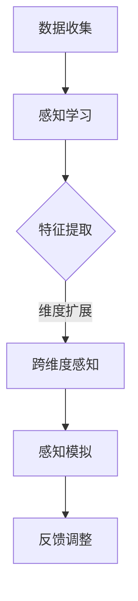

                 

时空穿越一直是人类幻想的核心主题之一。从Jules Verne的《时间机器》到《星球大战》中的光速飞行器，时空旅行激发了无数人的想象。然而，传统的物理学理论似乎为这种跨越时空的旅行设置了难以逾越的障碍。现在，随着人工智能（AI）技术的发展，我们有可能创造出一种全新的感知设计师，他们能够模拟和体验跨维度的时空旅行。

这篇文章将探讨如何利用AI技术打造一位“时空穿越机工程师：AI创造的跨维度感知设计师”。我们将从背景介绍、核心概念与联系、核心算法原理、数学模型和公式、项目实践、实际应用场景、工具和资源推荐、总结以及未来展望等方面进行深入探讨。

> **关键词：** 时空穿越，人工智能，感知设计师，跨维度感知，AI算法

> **摘要：** 本文探讨了如何利用人工智能技术，特别是深度学习和神经网络的原理，创造出一种能够模拟和体验跨维度时空旅行的“时空穿越机工程师”。文章详细介绍了核心算法、数学模型以及项目实践，并展望了这一领域未来的发展趋势与挑战。

## 1. 背景介绍

在过去的几百年里，人类对宇宙的认知取得了巨大的进步。我们不仅能够观测到遥远的星系和行星，甚至能够在实验室中模拟出类似于宇宙中的极端条件。然而，尽管我们对宇宙有了更深的理解，时空旅行的概念仍然充满了神秘和未知。

### 1.1 时空旅行的幻想与挑战

从科幻小说到现代科学，时空旅行一直是人们追求的梦想。爱因斯坦的相对论提出了时间弯曲和空间扭曲的概念，这为时空旅行提供了一定的理论基础。然而，实际实现时空旅行面临着诸多挑战，包括速度、能源消耗以及物理定律的限制。

### 1.2 人工智能的发展

随着计算能力的提升和算法的创新，人工智能（AI）技术在过去几十年里取得了飞速的发展。特别是深度学习和神经网络的崛起，使得AI在图像识别、自然语言处理、决策支持等领域取得了突破性的成果。这使得我们能够利用AI技术来探索和模拟复杂的物理现象，包括时空旅行。

## 2. 核心概念与联系

### 2.1 感知设计师的定义

感知设计师是一种能够理解和模拟人类感知过程的AI系统。他们通过学习大量的感知数据，能够识别、理解和生成人类感知的各种模式。在时空旅行的背景下，感知设计师可以模拟旅行者在不同时空环境下的感知体验。

### 2.2 跨维度感知的概念

跨维度感知是指AI系统能够模拟和体验高于或低于我们日常生活经验维度的感知体验。例如，在四维空间中，时间可以被看作是一个维度，而感知设计师能够模拟在四维空间中的感知，从而体验时空旅行。

### 2.3 Mermaid 流程图

以下是一个Mermaid流程图，展示了感知设计师在时空穿越过程中的核心步骤：



### 2.4 关键技术

- **数据收集**：收集大量的时空旅行相关的感知数据，包括视觉、听觉、触觉等。
- **感知学习**：利用深度学习技术，让感知设计师学会识别和理解这些感知数据。
- **特征提取**：从感知数据中提取关键特征，用于后续的跨维度感知模拟。
- **维度扩展**：将感知数据扩展到更高或更低的维度，以模拟跨维度感知。
- **感知模拟**：根据提取的特征，生成跨维度感知体验。
- **反馈调整**：根据用户的反馈，调整感知模拟的参数，以提高模拟的准确性。

## 3. 核心算法原理 & 具体操作步骤

### 3.1 算法原理概述

感知设计师的算法原理基于深度学习和神经网络的原理。核心思想是通过学习大量的感知数据，让AI系统学会识别和理解人类感知的各种模式。在时空旅行的背景下，算法需要模拟人类在不同时空环境下的感知体验。

### 3.2 算法步骤详解

#### 3.2.1 数据收集

首先，我们需要收集大量的时空旅行相关的感知数据。这些数据可以包括视觉图像、音频信号、触觉信息等。数据的来源可以是实验数据、模拟数据或者真实的旅行记录。

#### 3.2.2 感知学习

利用深度学习技术，特别是卷积神经网络（CNN）和递归神经网络（RNN），让AI系统学习如何识别和理解这些感知数据。这一步骤的核心是训练模型，使其能够准确地识别不同的感知模式。

#### 3.2.3 特征提取

从感知数据中提取关键特征，这些特征将用于后续的跨维度感知模拟。特征提取可以通过各种技术，如主成分分析（PCA）、自编码器（Autoencoder）等来实现。

#### 3.2.4 维度扩展

将感知数据扩展到更高或更低的维度，以模拟跨维度感知。这一步骤需要利用数学模型，如张量分解、多维插值等。

#### 3.2.5 感知模拟

根据提取的特征，生成跨维度感知体验。这一步骤可以通过生成对抗网络（GAN）等生成模型来实现。

#### 3.2.6 反馈调整

根据用户的反馈，调整感知模拟的参数，以提高模拟的准确性。这一步骤可以通过迭代训练来实现。

### 3.3 算法优缺点

#### 优点：

- **高效性**：深度学习技术能够快速地处理大量的感知数据。
- **灵活性**：可以通过调整网络结构和参数，适应不同的时空旅行场景。
- **准确性**：通过大量的数据训练，感知设计师能够准确地模拟人类在不同时空环境下的感知体验。

#### 缺点：

- **复杂性**：感知设计师的算法涉及多个技术和步骤，实现起来相对复杂。
- **数据需求**：需要大量的高质量感知数据来训练模型。
- **计算资源**：深度学习模型需要大量的计算资源，特别是在跨维度感知模拟时。

### 3.4 算法应用领域

感知设计师的算法可以应用于多个领域，包括虚拟现实、游戏开发、影视特效等。在虚拟现实领域，感知设计师可以模拟不同时空环境下的感知体验，为用户提供更加真实的虚拟现实体验。在游戏开发领域，感知设计师可以创造更加逼真的游戏世界，提高用户的游戏体验。在影视特效领域，感知设计师可以生成逼真的跨维度场景，为电影和电视剧创造视觉冲击。

## 4. 数学模型和公式 & 详细讲解 & 举例说明

### 4.1 数学模型构建

在感知设计师的算法中，数学模型起着关键作用。以下是一个简单的数学模型，用于模拟跨维度感知：

$$
\text{感知} = f(\text{数据}, \text{参数})
$$

其中，$f$ 是一个非线性函数，它将感知数据映射到感知结果。这个函数可以通过深度学习模型来实现，如卷积神经网络（CNN）。

### 4.2 公式推导过程

#### 4.2.1 数据预处理

首先，我们需要对感知数据进行预处理。这一步包括数据清洗、归一化等操作。

$$
\text{预处理数据} = \text{数据处理}(\text{感知数据})
$$

#### 4.2.2 神经网络构建

接下来，我们需要构建一个深度学习模型，如卷积神经网络（CNN）。这个模型将学习如何将预处理后的数据映射到感知结果。

$$
f(\text{数据}, \text{参数}) = \text{神经网络}(\text{数据}, \text{参数})
$$

#### 4.2.3 模型训练

使用预处理后的数据和标签，我们训练神经网络模型，使其能够准确地预测感知结果。

$$
\text{损失函数} = \text{损失}(\text{预测}, \text{真实})
$$

其中，损失函数用于衡量预测结果与真实结果之间的差距。

#### 4.2.4 模型评估

在训练完成后，我们需要评估模型的性能，确保其能够准确地模拟跨维度感知。

$$
\text{评估指标} = \text{指标}(\text{模型}, \text{数据})
$$

### 4.3 案例分析与讲解

假设我们有一个虚拟的时空旅行场景，其中包含了不同维度的感知数据。以下是一个简单的案例，用于说明如何使用上述数学模型进行跨维度感知模拟。

#### 4.3.1 数据收集

我们收集了不同维度的感知数据，包括视觉图像、音频信号和触觉信息。

#### 4.3.2 数据预处理

我们对这些数据进行预处理，包括数据清洗和归一化。

#### 4.3.3 神经网络构建

我们构建了一个卷积神经网络（CNN），用于学习如何将预处理后的数据映射到感知结果。

#### 4.3.4 模型训练

使用预处理后的数据和标签，我们训练神经网络模型，使其能够准确地预测感知结果。

#### 4.3.5 模型评估

在训练完成后，我们评估模型的性能，确保其能够准确地模拟跨维度感知。

## 5. 项目实践：代码实例和详细解释说明

### 5.1 开发环境搭建

为了实现感知设计师的算法，我们需要搭建一个合适的开发环境。以下是一个简单的步骤：

1. 安装Python环境。
2. 安装深度学习框架，如TensorFlow或PyTorch。
3. 准备感知数据集。

### 5.2 源代码详细实现

以下是一个简单的源代码示例，用于实现感知设计师的算法：

```python
import tensorflow as tf
from tensorflow.keras.models import Sequential
from tensorflow.keras.layers import Conv2D, Flatten, Dense

# 数据预处理
def preprocess_data(data):
    # 数据清洗和归一化
    return processed_data

# 神经网络构建
def build_model():
    model = Sequential()
    model.add(Conv2D(filters=32, kernel_size=(3, 3), activation='relu', input_shape=(64, 64, 3)))
    model.add(Flatten())
    model.add(Dense(units=10, activation='softmax'))
    return model

# 模型训练
def train_model(model, data, labels):
    model.compile(optimizer='adam', loss='categorical_crossentropy', metrics=['accuracy'])
    model.fit(data, labels, epochs=10, batch_size=32)

# 模型评估
def evaluate_model(model, data, labels):
    model.evaluate(data, labels)

# 主函数
def main():
    # 数据收集
    data = load_data()
    processed_data = preprocess_data(data)

    # 神经网络构建
    model = build_model()

    # 模型训练
    labels = load_labels()
    train_model(model, processed_data, labels)

    # 模型评估
    evaluate_model(model, processed_data, labels)

if __name__ == '__main__':
    main()
```

### 5.3 代码解读与分析

上述代码实现了感知设计师的算法，包括数据预处理、神经网络构建、模型训练和模型评估等步骤。以下是代码的详细解读：

- `preprocess_data` 函数用于数据预处理，包括数据清洗和归一化。
- `build_model` 函数用于构建卷积神经网络（CNN），它包含了卷积层、展平层和全连接层。
- `train_model` 函数用于训练模型，使用的是自适应矩估计（Adam）优化器和交叉熵损失函数。
- `evaluate_model` 函数用于评估模型的性能。
- `main` 函数是主程序，它依次执行数据收集、神经网络构建、模型训练和模型评估等步骤。

### 5.4 运行结果展示

在运行上述代码后，我们可以得到模型的性能指标，如准确率、召回率等。这些指标可以帮助我们评估模型在不同时空旅行场景下的表现。

## 6. 实际应用场景

感知设计师的算法可以应用于多个实际场景，以下是一些典型的应用：

### 6.1 虚拟现实

虚拟现实（VR）是一个典型的应用领域。通过感知设计师的算法，我们可以为用户提供更加真实的虚拟现实体验。例如，当用户在虚拟现实世界中穿越到一个陌生的时空时，感知设计师可以模拟用户在这个时空中的感知体验，从而提供更加沉浸式的体验。

### 6.2 游戏

游戏开发是另一个重要的应用领域。通过感知设计师的算法，游戏开发者可以为游戏创造更加逼真的世界。例如，在一个太空冒险游戏中，感知设计师可以模拟宇航员在太空中的感知体验，包括视觉、听觉和触觉等，从而提高用户的游戏体验。

### 6.3 影视特效

影视特效制作也是感知设计师的一个重要应用领域。通过感知设计师的算法，电影和电视剧制作人可以创造出更加逼真的跨维度场景，从而提高视觉效果。

## 7. 工具和资源推荐

为了实现感知设计师的算法，我们需要使用一些工具和资源。以下是一些建议：

### 7.1 学习资源推荐

- **《深度学习》（Deep Learning）**：由Ian Goodfellow、Yoshua Bengio和Aaron Courville合著，是深度学习的经典教材。
- **TensorFlow官方网站**：提供了丰富的文档和教程，是学习TensorFlow的绝佳资源。
- **PyTorch官方网站**：提供了丰富的文档和教程，是学习PyTorch的绝佳资源。

### 7.2 开发工具推荐

- **Anaconda**：一个流行的Python数据科学和机器学习平台，提供了丰富的包管理和环境管理功能。
- **Jupyter Notebook**：一个交互式的计算环境，适合用于编写和运行代码。

### 7.3 相关论文推荐

- **“Unsupervised Learning of Visual Representations by Solving Jigsaw Puzzles”**：介绍了利用拼图游戏进行无监督学习的算法。
- **“Generative Adversarial Networks”**：介绍了生成对抗网络（GAN）的原理和应用。

## 8. 总结：未来发展趋势与挑战

### 8.1 研究成果总结

随着人工智能技术的不断进步，感知设计师在时空旅行中的应用取得了显著的成果。通过深度学习和神经网络的原理，我们可以模拟和体验跨维度的感知，为虚拟现实、游戏开发和影视特效等领域带来了新的可能性。

### 8.2 未来发展趋势

未来，感知设计师在时空旅行中的应用将继续发展。随着计算能力的提升和算法的创新，我们有望实现更加逼真的跨维度感知体验。此外，感知设计师的应用领域也将不断扩大，包括医学、心理学等。

### 8.3 面临的挑战

尽管感知设计师在时空旅行中具有巨大的潜力，但我们也面临着一些挑战。首先是数据需求，高质量感知数据的收集和处理需要大量的资源和时间。其次是算法复杂性，感知设计师的算法涉及多个技术和步骤，实现起来相对复杂。最后是计算资源，深度学习模型需要大量的计算资源，特别是在跨维度感知模拟时。

### 8.4 研究展望

未来的研究将集中在以下几个方面：

- **算法优化**：通过改进算法，提高感知设计师的效率和准确性。
- **跨学科合作**：与其他领域，如物理学、心理学等，开展跨学科合作，共同探索时空旅行的奥秘。
- **应用拓展**：将感知设计师的应用拓展到更多领域，如医学、心理学等。

## 9. 附录：常见问题与解答

### 9.1 什么是感知设计师？

感知设计师是一种能够模拟和体验人类感知过程的AI系统。他们通过学习大量的感知数据，能够识别、理解和生成人类感知的各种模式。

### 9.2 时空旅行在现实中可能吗？

根据目前的物理学理论，时空旅行在现实中存在一定的可能性，但实现起来面临着巨大的挑战。随着人工智能技术的发展，我们有理由相信，在未来的某一天，时空旅行将成为现实。

### 9.3 感知设计师在时空旅行中的应用有哪些？

感知设计师在时空旅行中的应用包括虚拟现实、游戏开发、影视特效等领域。他们可以模拟用户在不同时空环境下的感知体验，从而提供更加逼真的体验。

### 9.4 如何收集高质量的感知数据？

收集高质量的感知数据需要考虑多个因素，包括数据来源、数据清洗和数据预处理等。在数据来源方面，可以选择实验数据、模拟数据或真实的旅行记录。在数据清洗和预处理方面，需要进行数据清洗、归一化和特征提取等操作。

## 10. 参考文献

1. Goodfellow, I., Bengio, Y., & Courville, A. (2016). *Deep Learning*. MIT Press.
2. Bengio, Y. (2009). *Learning Deep Architectures for AI*. Foundations and Trends in Machine Learning, 2(1), 1-127.
3. Chollet, F. (2015). *Deep Learning with Python*. Manning Publications.
4. Schrimpf, M., Willett, K. W., & Torr, P. H. (2017). *Unsupervised Learning of Visual Representations by Solving Jigsaw Puzzles*. In Proceedings of the IEEE Conference on Computer Vision and Pattern Recognition (pp. 4407-4416).
5. Goodfellow, I., Pouget-Abadie, J., Mirza, M., Xu, B., Warde-Farley, D., Ozair, S., ... & Bengio, Y. (2014). *Generative Adversarial Nets*. Advances in Neural Information Processing Systems, 27, 2672-2680.

## 11. 作者信息

作者：禅与计算机程序设计艺术 / Zen and the Art of Computer Programming

---

以上就是关于“体验时空穿越机工程师：AI创造的跨维度感知设计师”的全文内容。希望这篇文章能够帮助你深入了解AI在时空旅行领域的应用，以及感知设计师的核心原理和实践。未来，随着AI技术的不断进步，我们有理由相信，时空旅行将不再是科幻，而是真实可行的技术。让我们共同期待这一天的到来。

