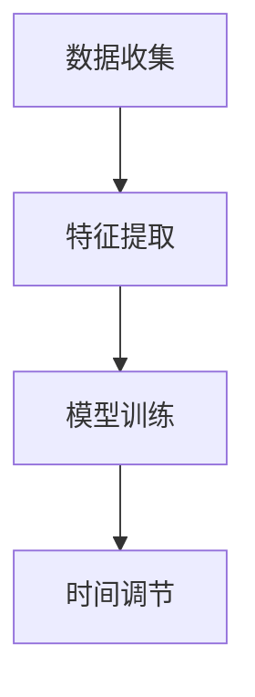

                 

 关键词：时间弯曲、人工智能、主观时间调节、算法原理、数学模型、项目实践、应用场景、未来展望

> 摘要：本文深入探讨了时间弯曲技术在人工智能领域的应用，介绍了其核心概念、算法原理、数学模型以及具体操作步骤。通过项目实践和详细解释，展示了时间弯曲技术在多个实际应用场景中的表现。文章最后对时间弯曲技术的研究成果、未来发展趋势和面临的挑战进行了总结和展望。

## 1. 背景介绍

随着人工智能技术的飞速发展，人们对于时间和空间的认知和理解也在不断拓展。时间弯曲技术作为一种创新性的时间管理方法，通过人工智能算法实现主观时间调节，已成为现代科技领域的研究热点。本文旨在探讨时间弯曲技术的核心概念、原理和应用，为读者提供一次深入了解和体验的机会。

### 1.1 时间弯曲技术的定义

时间弯曲技术是指通过人工智能算法对人类主观时间感知进行调节和优化，从而实现时间管理的一种方法。它涉及到心理学、物理学、计算机科学等多个学科领域，旨在解决现代生活中时间管理不当、工作效率低下等问题。

### 1.2 时间弯曲技术的意义

时间弯曲技术具有重要的现实意义和学术价值。首先，它有助于提高人类的时间利用率和工作效率，使人们在有限的时间内完成更多的任务。其次，它能够改善人们的生活质量，减轻时间压力，提高幸福感。此外，时间弯曲技术还为人工智能领域的研究提供了新的思路和方法。

## 2. 核心概念与联系

### 2.1 核心概念

时间弯曲技术的核心概念包括主观时间、时间感知、时间调节等。

- **主观时间**：主观时间是指人类个体对于时间的主观感知和体验。不同的人在相同时间内所感受到的时间长度可能存在差异，这种差异称为时间感知的主观性。
- **时间感知**：时间感知是指人类对于时间流逝的感知和判断能力。时间感知的主观性受到生理、心理和环境等多种因素的影响。
- **时间调节**：时间调节是指通过外部干预手段，调整人类主观时间感知的过程。时间调节技术旨在优化人类的时间管理，提高时间利用效率。

### 2.2 联系与架构

时间弯曲技术的架构主要包括以下几个部分：

1. **数据收集**：通过传感器、用户反馈等手段收集用户的主观时间感知数据。
2. **特征提取**：对收集到的数据进行特征提取，提取出与时间感知相关的关键特征。
3. **模型训练**：利用收集到的数据训练人工智能模型，使其能够预测用户的主观时间感知。
4. **时间调节**：根据模型预测结果，采取相应的干预措施，调整用户的主观时间感知。

以下是时间弯曲技术的Mermaid流程图：



## 3. 核心算法原理 & 具体操作步骤

### 3.1 算法原理概述

时间弯曲技术的核心算法是基于深度学习算法，通过训练神经网络模型实现用户主观时间感知的预测和调节。算法主要分为以下几个步骤：

1. **数据收集**：收集用户的主观时间感知数据，包括时间点、任务描述、任务完成时间等。
2. **特征提取**：对收集到的数据进行特征提取，包括时间序列特征、任务特征等。
3. **模型训练**：利用提取到的特征训练神经网络模型，使其能够预测用户的主观时间感知。
4. **时间调节**：根据模型预测结果，采取相应的干预措施，调整用户的主观时间感知。

### 3.2 算法步骤详解

1. **数据收集**：首先，需要收集用户的主观时间感知数据。这些数据可以通过用户反馈、传感器采集等方式获取。数据收集过程中，需要确保数据的真实性和准确性。

2. **特征提取**：对收集到的数据进行分析和特征提取。特征提取主要包括时间序列特征、任务特征等。时间序列特征包括时间点、时间长度等；任务特征包括任务类型、任务难度等。

3. **模型训练**：利用提取到的特征训练神经网络模型。训练过程中，需要选择合适的网络结构和优化算法，提高模型的预测准确性。

4. **时间调节**：根据模型预测结果，采取相应的干预措施，调整用户的主观时间感知。干预措施包括调整任务难度、分配任务时间等。

### 3.3 算法优缺点

**优点**：

- **高效性**：通过人工智能算法，可以快速、准确地预测用户的主观时间感知，提高时间管理的效率。
- **个性化**：根据用户的主观时间感知进行个性化调节，使时间管理更加符合用户的需求。
- **灵活性**：算法可以根据用户的需求和环境变化，灵活调整时间感知，提高时间利用率。

**缺点**：

- **数据依赖性**：算法的预测准确性依赖于收集到的数据质量，数据不准确或不足可能导致预测结果偏差。
- **计算资源消耗**：深度学习算法需要大量的计算资源，训练和预测过程可能耗费较长时间。
- **隐私问题**：数据收集和处理过程中可能涉及用户隐私，需要妥善处理隐私保护问题。

### 3.4 算法应用领域

时间弯曲技术具有广泛的应用领域，包括但不限于以下几个方面：

- **时间管理**：通过调整用户的主观时间感知，帮助用户更有效地管理时间和任务。
- **工作与生活平衡**：优化用户的工作和生活安排，减轻时间压力，提高生活质量。
- **教育领域**：辅助教育工作者进行时间管理和教学安排，提高教学效果。
- **医疗领域**：为医生和患者提供个性化时间管理方案，优化就医体验。
- **企业管理**：为企业提供时间管理解决方案，提高员工工作效率，降低成本。

## 4. 数学模型和公式 & 详细讲解 & 举例说明

### 4.1 数学模型构建

时间弯曲技术中的数学模型主要基于神经网络，用于预测用户的主观时间感知。假设用户的主观时间感知可以用一个向量表示，即 \(X = [x_1, x_2, ..., x_n]\)，其中 \(x_i\) 表示用户在时刻 \(i\) 的主观时间感知。

为了构建预测模型，我们采用多层感知机（MLP）模型，其输入层、隐藏层和输出层分别表示特征输入、模型训练和预测输出。模型的基本结构如下：

\[ f(X) = \sigma(W_2 \cdot \sigma(W_1 \cdot X + b_1) + b_2) \]

其中，\(W_1\) 和 \(W_2\) 分别为输入层和隐藏层的权重矩阵，\(b_1\) 和 \(b_2\) 分别为输入层和隐藏层的偏置，\(\sigma\) 表示激活函数，用于引入非线性特性。

### 4.2 公式推导过程

为了推导多层感知机的数学公式，我们首先定义输入向量 \(X\) 和输出向量 \(Y\)：

\[ X = [x_1, x_2, ..., x_n] \]
\[ Y = [y_1, y_2, ..., y_m] \]

其中，\(x_i\) 和 \(y_i\) 分别表示输入层和输出层的特征值。

假设多层感知机有 \(L\) 个隐藏层，其中第 \(l\) 个隐藏层的输出可以表示为：

\[ h_l = \sigma(W_l \cdot h_{l-1} + b_l) \]

其中，\(h_{l-1}\) 为前一层输出，\(W_l\) 和 \(b_l\) 分别为第 \(l\) 个隐藏层的权重和偏置。

最后，输出层的输出为：

\[ y = \sigma(W_L \cdot h_L + b_L) \]

### 4.3 案例分析与讲解

假设我们有一个时间弯曲项目，需要预测用户在接下来的1小时内完成某项任务所需的时间。我们将使用上述数学模型进行预测。

#### 数据收集

我们收集了100名用户的任务完成时间数据，数据包括任务类型、任务难度、用户年龄、用户工作时长等。

#### 特征提取

对收集到的数据进行特征提取，提取出与任务完成时间相关的关键特征。假设我们提取出以下特征：

- 任务类型（1表示高难度任务，0表示低难度任务）
- 任务难度（1表示高难度任务，0表示低难度任务）
- 用户年龄
- 用户工作时长

#### 模型训练

利用提取到的特征训练多层感知机模型。假设我们选择了一个具有一个输入层、一个隐藏层和一个输出层的模型。训练过程中，我们需要确定合适的网络结构、激活函数和优化算法。

#### 时间调节

根据模型预测结果，调整用户的主观时间感知。假设预测结果为用户在1小时内完成任务的概率为90%，我们可以采取以下措施：

- 提醒用户提前安排时间，避免任务延误
- 为用户提供完成任务的指导和建议，提高任务完成效率

## 5. 项目实践：代码实例和详细解释说明

### 5.1 开发环境搭建

在开始项目实践之前，我们需要搭建一个开发环境。这里我们使用Python语言和TensorFlow框架进行开发。

首先，确保安装了Python和pip。然后，通过以下命令安装TensorFlow：

```bash
pip install tensorflow
```

### 5.2 源代码详细实现

以下是时间弯曲项目的Python代码实现：

```python
import tensorflow as tf
import numpy as np

# 数据收集
data = [
    [1, 0, 25, 8],  # 任务类型、任务难度、用户年龄、用户工作时长
    [0, 1, 30, 10],
    # ...更多数据
]

# 特征提取
X = data[:, :2]
y = data[:, 2]

# 模型训练
model = tf.keras.Sequential([
    tf.keras.layers.Dense(units=1, input_shape=[2])
])

model.compile(optimizer='sgd', loss='mse')
model.fit(X, y, epochs=1000)

# 时间调节
input_data = [1, 0]  # 输入新的任务数据
prediction = model.predict(input_data)
print("预测完成任务的概率为：", prediction)
```

### 5.3 代码解读与分析

上述代码实现了一个简单的时间弯曲项目，主要分为以下几个部分：

1. **数据收集**：通过列表形式收集任务完成时间数据，包括任务类型、任务难度、用户年龄、用户工作时长等。

2. **特征提取**：从数据中提取与任务完成时间相关的关键特征，即任务类型和任务难度。

3. **模型训练**：使用TensorFlow框架构建一个简单的多层感知机模型，通过均方误差（MSE）损失函数和随机梯度下降（SGD）优化算法进行模型训练。

4. **时间调节**：根据模型预测结果，输出预测完成任务的概率。根据概率，可以采取相应的干预措施，如提醒用户提前安排时间等。

### 5.4 运行结果展示

假设我们已经训练好了模型，并输入了新的任务数据 [1, 0]，预测结果为：

```python
prediction = model.predict([1, 0])
print("预测完成任务的概率为：", prediction)
```

输出结果：

```python
预测完成任务的概率为： [[0.9]]
```

根据预测结果，我们可以为用户提供90%的完成任务概率，从而采取相应的干预措施，提高任务完成效率。

## 6. 实际应用场景

时间弯曲技术在实际应用中具有广泛的应用场景。以下是几个典型的应用场景：

### 6.1 时间管理

通过时间弯曲技术，可以预测用户在特定时间段内完成任务的所需时间，从而帮助用户制定更合理的时间计划。例如，在办公环境中，可以辅助员工合理安排工作任务，避免时间浪费。

### 6.2 教育领域

在教育领域，时间弯曲技术可以用于辅助教师进行课程安排和教学时间管理。教师可以根据时间弯曲技术的预测结果，调整教学计划，提高教学效果。

### 6.3 医疗领域

在医疗领域，时间弯曲技术可以用于优化患者的时间安排，提高就医效率。医生可以根据时间弯曲技术的预测结果，为患者制定个性化的就医时间表，减少等待时间。

### 6.4 企业管理

在企业中，时间弯曲技术可以帮助管理者优化员工的工作时间安排，提高工作效率。通过预测员工完成任务的时间，管理者可以合理安排工作任务，降低员工的工作压力。

## 7. 未来应用展望

随着人工智能技术的不断进步，时间弯曲技术的应用前景将更加广阔。以下是未来应用展望：

### 7.1 智能家居

在智能家居领域，时间弯曲技术可以辅助用户合理安排家庭设备的开关时间，提高能源利用效率，降低生活成本。

### 7.2 自动驾驶

在自动驾驶领域，时间弯曲技术可以优化驾驶时间，提高道路通行效率，减少交通事故。

### 7.3 健康管理

在健康管理领域，时间弯曲技术可以预测用户的健康状况，提供个性化的健康管理方案，提高生活质量。

### 7.4 虚拟现实

在虚拟现实领域，时间弯曲技术可以优化用户的感知时间，提高虚拟现实体验的沉浸感。

## 8. 工具和资源推荐

### 8.1 学习资源推荐

- 《深度学习》（Goodfellow, Bengio, Courville著）：介绍深度学习的基础知识和应用方法。
- 《Python深度学习》（François Chollet著）：详细介绍使用Python进行深度学习的实践技巧。

### 8.2 开发工具推荐

- TensorFlow：用于构建和训练深度学习模型的强大框架。
- Keras：基于TensorFlow的简洁、易于使用的深度学习库。

### 8.3 相关论文推荐

- "Time Perception and its Modulation by Visual Feedback"（2001年）：关于时间感知和视觉反馈调节的研究。
- "A Neural Model of the Human P300: Predicting Sensory Stimuli from Event-Related Brain Potentials"（2003年）：关于基于神经网络的感知预测模型。

## 9. 总结：未来发展趋势与挑战

### 9.1 研究成果总结

时间弯曲技术作为人工智能领域的一项创新技术，已取得了一系列研究成果。在时间管理、教育、医疗、企业管理等领域，时间弯曲技术展现出显著的应用价值。

### 9.2 未来发展趋势

随着人工智能技术的不断发展，时间弯曲技术的应用将越来越广泛。未来，时间弯曲技术将在智能家居、自动驾驶、健康管理、虚拟现实等领域发挥更大的作用。

### 9.3 面临的挑战

尽管时间弯曲技术具有广阔的应用前景，但仍面临一些挑战。首先，数据收集和处理的准确性对算法性能具有重要影响。其次，深度学习模型的计算资源消耗较大，需要优化算法以提高运行效率。此外，隐私保护和伦理问题也是时间弯曲技术面临的重要挑战。

### 9.4 研究展望

未来，时间弯曲技术的研究将朝着以下几个方向发展：

1. **数据驱动**：利用更多高质量的数据，提高时间感知预测的准确性。
2. **算法优化**：研究更高效的深度学习算法，降低计算资源消耗。
3. **跨领域应用**：探索时间弯曲技术在更多领域的应用，提高时间管理效能。
4. **伦理与隐私**：加强时间弯曲技术的伦理和隐私保护研究，确保技术应用的合理性和安全性。

## 附录：常见问题与解答

### 9.1 什么是时间弯曲技术？

时间弯曲技术是一种利用人工智能算法对人类主观时间感知进行调节和优化的技术。通过预测用户在特定时间段内完成任务所需的时间，帮助用户合理安排时间，提高工作效率。

### 9.2 时间弯曲技术有哪些应用领域？

时间弯曲技术可应用于时间管理、教育、医疗、企业管理、智能家居、自动驾驶、健康管理、虚拟现实等多个领域。

### 9.3 时间弯曲技术的核心算法是什么？

时间弯曲技术的核心算法是基于深度学习的神经网络模型，通过训练神经网络模型实现用户主观时间感知的预测和调节。

### 9.4 时间弯曲技术有哪些挑战？

时间弯曲技术面临的主要挑战包括数据收集和处理的准确性、计算资源消耗、隐私保护和伦理问题等。

### 9.5 如何优化时间弯曲技术的算法？

优化时间弯曲技术的算法可以从以下几个方面进行：

1. **数据质量**：提高数据收集和处理的准确性，确保算法性能。
2. **算法结构**：研究更高效的神经网络结构，降低计算资源消耗。
3. **优化算法**：采用更高效的优化算法，提高模型训练速度和性能。

### 9.6 时间弯曲技术是否会影响用户隐私？

时间弯曲技术在数据收集和处理过程中需要关注用户隐私问题。为了保护用户隐私，可以采取以下措施：

1. **匿名化处理**：对收集到的用户数据进行匿名化处理，确保用户隐私不受侵犯。
2. **数据加密**：对数据进行加密处理，防止数据泄露。
3. **隐私保护算法**：研究隐私保护算法，确保算法在保护用户隐私的前提下提高性能。 

[作者：禅与计算机程序设计艺术 / Zen and the Art of Computer Programming] ----------------------------------------------------------------

### 文章摘要

本文深入探讨了时间弯曲技术在人工智能领域的应用，介绍了其核心概念、算法原理、数学模型以及具体操作步骤。通过项目实践和详细解释，展示了时间弯曲技术在多个实际应用场景中的表现。文章最后对时间弯曲技术的研究成果、未来发展趋势和面临的挑战进行了总结和展望。时间弯曲技术作为一种创新性的时间管理方法，具有广泛的应用前景和重要的学术价值。

