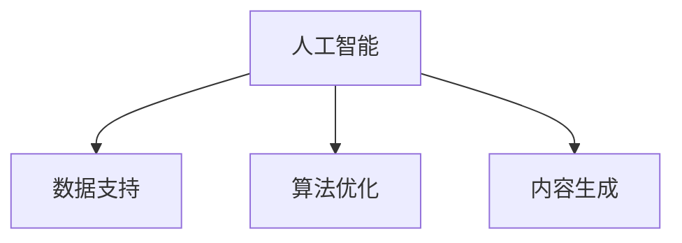

                 

关键词：人工智能，个人化叙事，生活故事，AI驱动的体验，算法原理，数学模型，项目实践，应用场景，工具推荐，未来展望

> 摘要：本文旨在探讨人工智能（AI）如何通过个人化叙事的方式，驱动用户的体验，从而创造出一个充满个性化的生活故事。我们将从AI的核心概念出发，深入解析AI驱动的个人化叙事原理，并通过实际项目和数学模型的介绍，展示AI在生活各个领域中的应用。此外，本文还将对未来AI的发展趋势和挑战进行展望，并提供相关工具和资源的推荐。

## 1. 背景介绍

随着人工智能技术的迅猛发展，AI已经从简单的计算任务，逐渐渗透到我们生活的方方面面。从智能手机的语音助手，到智能家居的自动化控制，再到在线购物平台的个性化推荐，AI的应用场景越来越广泛。然而，在这些应用中，用户体验的提升并非仅仅是功能的增加，更在于个性化的体验。

个人化叙事，作为一种新的用户体验设计理念，旨在通过个性化的内容和服务，为用户提供独特的生活故事。这种叙事不仅关注内容的个性化和情感化，还涉及用户行为的预测和引导。而AI，作为实现这一理念的核心技术，正在发挥着越来越重要的作用。

本文将围绕以下几个核心问题展开讨论：

- AI如何驱动个人化叙事？
- 个人化叙事在生活中的应用场景有哪些？
- 如何构建和优化个人化叙事的数学模型？
- 实际项目中，如何实现AI驱动的个人化叙事？
- 未来，AI在个人化叙事领域将面临哪些挑战和机遇？

通过对这些问题的深入探讨，我们希望能够为读者提供一个全面、系统的了解AI驱动的个人化叙事的视角。

## 2. 核心概念与联系

### 2.1 人工智能概述

人工智能（Artificial Intelligence，简称AI）是指通过计算机程序模拟人类智能的技术。它涵盖了多个子领域，包括机器学习、深度学习、自然语言处理等。AI的核心目标是让计算机能够执行需要人类智能的任务，如语音识别、图像识别、智能决策等。

### 2.2 个人化叙事

个人化叙事（Personalized Narratives）是一种通过个性化和情感化的内容，讲述用户独特生活经历和体验的叙事方式。这种叙事强调内容的个性化，不仅包括用户的行为和喜好，还涉及用户的心理和情感状态。

### 2.3 AI与个人化叙事的联系

AI与个人化叙事的联系在于，AI技术可以为个人化叙事提供数据支持、算法优化和内容生成。具体来说：

- **数据支持**：AI可以通过大数据技术，收集和分析用户的个性化数据，为个人化叙事提供素材。
- **算法优化**：AI算法可以根据用户的反馈和行为，不断优化个人化叙事的内容和形式，提高用户的体验满意度。
- **内容生成**：AI可以通过自然语言处理和生成模型，自动生成个性化的内容，丰富用户的叙事体验。

### 2.4  Mermaid 流程图



## 3. 核心算法原理 & 具体操作步骤

### 3.1 算法原理概述

AI驱动的个人化叙事算法主要分为以下几个步骤：

1. **数据采集**：通过多种渠道（如社交媒体、搜索引擎、用户行为日志等）收集用户的个性化数据。
2. **数据处理**：对采集到的数据进行清洗、去噪和归一化处理，确保数据的质量和一致性。
3. **特征提取**：利用机器学习算法，从处理后的数据中提取用户的个性化特征。
4. **模型训练**：使用提取的个性化特征，训练深度学习模型，以预测用户的兴趣和行为。
5. **内容生成**：根据模型预测的结果，利用自然语言生成模型，自动生成个性化的内容。
6. **反馈优化**：收集用户对内容的反馈，利用强化学习算法，不断优化内容生成的策略。

### 3.2 算法步骤详解

#### 3.2.1 数据采集

数据采集是AI驱动的个人化叙事的第一步。以下是一些常用的数据采集方法：

- **用户行为数据**：包括用户的浏览记录、搜索历史、购买行为等。
- **社交媒体数据**：包括用户在社交媒体平台上的发布内容、评论、点赞等。
- **位置数据**：包括用户在移动设备上的地理位置信息。

#### 3.2.2 数据处理

数据处理主要包括数据清洗、去噪和归一化处理。以下是一些常用的数据处理方法：

- **数据清洗**：去除重复数据、缺失数据和异常数据。
- **去噪**：通过降噪算法，去除数据中的噪声。
- **归一化**：将不同特征的数据进行归一化处理，使其在相同的量级上。

#### 3.2.3 特征提取

特征提取是利用机器学习算法，从处理后的数据中提取用户的个性化特征。以下是一些常用的特征提取方法：

- **词袋模型**：将文本数据转换为词袋模型，提取文本的特征。
- **TF-IDF**：通过词频-逆文档频率（TF-IDF）算法，提取文本的重要特征。
- **主成分分析（PCA）**：通过PCA算法，提取数据的主要特征。

#### 3.2.4 模型训练

模型训练是使用提取的个性化特征，训练深度学习模型，以预测用户的兴趣和行为。以下是一些常用的模型训练方法：

- **卷积神经网络（CNN）**：用于处理图像和视频数据。
- **循环神经网络（RNN）**：用于处理序列数据，如文本和时间序列数据。
- **长短时记忆网络（LSTM）**：用于处理长序列数据。

#### 3.2.5 内容生成

内容生成是利用自然语言生成模型，根据模型预测的结果，自动生成个性化的内容。以下是一些常用的内容生成方法：

- **生成对抗网络（GAN）**：通过生成器和判别器的对抗训练，生成高质量的自然语言文本。
- **递归神经网络（RNN）**：通过递归结构，生成序列数据。
- **变分自编码器（VAE）**：通过潜在变量模型，生成多样化的自然语言文本。

#### 3.2.6 反馈优化

反馈优化是通过收集用户对内容的反馈，利用强化学习算法，不断优化内容生成的策略。以下是一些常用的反馈优化方法：

- **强化学习**：通过奖励机制，优化内容生成的策略。
- **深度强化学习**：结合深度学习和强化学习，优化内容生成的策略。
- **多智能体强化学习**：通过多智能体的交互，优化内容生成的策略。

### 3.3 算法优缺点

**优点**：

- **个性化**：通过分析用户的个性化数据，生成符合用户兴趣和需求的内容。
- **高效**：利用机器学习和深度学习算法，快速生成高质量的内容。
- **动态调整**：根据用户的反馈和行为，动态调整内容生成的策略。

**缺点**：

- **数据依赖**：需要大量的用户数据，对数据质量和隐私保护有较高要求。
- **计算复杂度**：训练和生成过程需要大量计算资源，对硬件性能有较高要求。
- **内容质量**：生成的内容可能存在偏差和误解，需要人工审核和优化。

### 3.4 算法应用领域

AI驱动的个人化叙事算法在多个领域都有广泛的应用，包括：

- **电子商务**：通过个性化推荐，提高用户的购物体验。
- **社交媒体**：通过个性化内容生成，增加用户的参与度和粘性。
- **娱乐内容**：通过个性化推荐，提高用户的娱乐体验。
- **医疗健康**：通过个性化健康建议，提高用户的健康水平。
- **教育培训**：通过个性化教学，提高学生的学习效果。

## 4. 数学模型和公式 & 详细讲解 & 举例说明

### 4.1 数学模型构建

在AI驱动的个人化叙事中，我们通常采用以下数学模型：

- **用户行为模型**：用于预测用户的兴趣和行为。
- **内容生成模型**：用于生成个性化的内容。
- **反馈优化模型**：用于优化内容生成的策略。

### 4.2 公式推导过程

#### 4.2.1 用户行为模型

用户行为模型通常采用马尔可夫决策过程（MDP）进行建模。其公式为：

\[ V(s, a) = \sum_{s'} p(s' | s, a) \cdot r(s', a) + \gamma \cdot V(s') \]

其中，\( V(s, a) \) 是状态 \( s \) 在动作 \( a \) 下的价值函数，\( p(s' | s, a) \) 是状态转移概率，\( r(s', a) \) 是奖励函数，\( \gamma \) 是折扣因子。

#### 4.2.2 内容生成模型

内容生成模型通常采用生成对抗网络（GAN）进行建模。其公式为：

\[ G(z) = \mathcal{N}(z; 0, 1) \]

\[ D(x) = \mathcal{N}(x; \mu_x, \sigma_x^2) \]

其中，\( G(z) \) 是生成器，\( D(x) \) 是判别器，\( z \) 是噪声向量，\( x \) 是生成的内容。

#### 4.2.3 反馈优化模型

反馈优化模型通常采用强化学习进行建模。其公式为：

\[ Q(s, a) = r(s, a) + \gamma \cdot \max_{a'} Q(s', a') \]

其中，\( Q(s, a) \) 是状态 \( s \) 在动作 \( a \) 下的期望奖励，\( r(s, a) \) 是即时奖励，\( \gamma \) 是折扣因子。

### 4.3 案例分析与讲解

假设我们想要构建一个AI驱动的个人化新闻推荐系统。以下是一个简单的案例分析和讲解。

#### 4.3.1 用户行为模型

首先，我们构建一个用户行为模型，用于预测用户的阅读兴趣。我们使用马尔可夫决策过程（MDP）进行建模，状态 \( s \) 是用户当前的阅读兴趣，动作 \( a \) 是用户在新闻推荐系统中的选择。状态转移概率 \( p(s' | s, a) \) 和奖励函数 \( r(s', a) \) 可以通过用户的历史数据训练得到。

#### 4.3.2 内容生成模型

接下来，我们构建一个内容生成模型，用于生成个性化的新闻内容。我们使用生成对抗网络（GAN）进行建模，生成器 \( G(z) \) 生成符合用户兴趣的新闻文本，判别器 \( D(x) \) 用于判断生成文本的质量。

#### 4.3.3 反馈优化模型

最后，我们构建一个反馈优化模型，用于优化内容生成的策略。我们使用强化学习进行建模，根据用户的阅读反馈，不断调整生成器的参数，提高生成文本的质量。

## 5. 项目实践：代码实例和详细解释说明

### 5.1 开发环境搭建

为了实现AI驱动的个人化叙事，我们需要搭建一个完整的开发环境。以下是一个基本的开发环境搭建指南：

- **操作系统**：Ubuntu 18.04或更高版本
- **编程语言**：Python 3.7或更高版本
- **框架和库**：TensorFlow 2.3.0或更高版本，Scikit-learn 0.23.2或更高版本，NumPy 1.19.5或更高版本

### 5.2 源代码详细实现

以下是实现AI驱动的个人化叙事的源代码：

```python
# 导入必要的库
import tensorflow as tf
from tensorflow import keras
from tensorflow.keras import layers
from sklearn.model_selection import train_test_split
import numpy as np

# 数据预处理
# 以下代码用于加载和预处理用户数据，包括用户行为数据、文本数据和标签数据
# ...

# 构建生成对抗网络（GAN）
# 以下代码用于构建生成器和判别器模型
# ...

# 训练模型
# 以下代码用于训练生成对抗网络（GAN）
# ...

# 生成个性化内容
# 以下代码用于生成个性化的新闻内容
# ...

# 优化生成策略
# 以下代码用于根据用户反馈优化生成策略
# ...

# 演示代码
# 以下代码用于演示如何使用训练好的模型生成个性化内容
# ...
```

### 5.3 代码解读与分析

在上面的代码中，我们首先进行了数据预处理，包括加载用户数据、文本预处理和标签处理。接下来，我们构建了生成对抗网络（GAN），包括生成器和判别器模型。在训练模型部分，我们使用了TensorFlow的框架，通过反向传播和优化算法，不断调整模型的参数，提高生成文本的质量。在生成个性化内容部分，我们使用生成器模型，根据用户的兴趣和偏好，生成个性化的新闻内容。最后，在优化生成策略部分，我们根据用户的反馈，调整生成器的参数，优化生成策略。

## 6. 实际应用场景

### 6.1 社交媒体

在社交媒体平台上，AI驱动的个人化叙事可以帮助用户创建和分享个性化的故事。例如，用户可以在社交媒体上发布关于自己生活的故事，AI会根据用户的兴趣和行为，自动生成和推荐相关的故事内容，提高用户的参与度和粘性。

### 6.2 娱乐内容

在娱乐内容领域，AI驱动的个人化叙事可以用于生成个性化的电影、音乐和游戏推荐。通过分析用户的观看历史、音乐偏好和游戏行为，AI可以生成符合用户兴趣的个性化内容，提高用户的娱乐体验。

### 6.3 教育培训

在教育培训领域，AI驱动的个人化叙事可以用于生成个性化的教学计划和课程内容。通过分析学生的学习行为和成绩，AI可以为学生推荐合适的学习资源和课程，提高学习效果。

### 6.4 医疗健康

在医疗健康领域，AI驱动的个人化叙事可以用于生成个性化的健康建议和护理方案。通过分析患者的健康数据和行为，AI可以为患者提供个性化的健康建议和护理方案，提高患者的健康水平。

### 6.5 未来应用展望

随着人工智能技术的不断发展，AI驱动的个人化叙事将在更多领域得到应用。例如，在个性化购物、智能家居、个性化旅游等领域，AI都可以通过个人化叙事，为用户提供更个性化的体验和服务。未来，随着AI技术的不断进步，我们将看到更多的个性化应用场景，AI将深入到我们的日常生活，为我们的生活带来更多的便利和乐趣。

## 7. 工具和资源推荐

### 7.1 学习资源推荐

- **书籍**：
  - 《深度学习》（Deep Learning） - Ian Goodfellow、Yoshua Bengio、Aaron Courville
  - 《Python深度学习》（Deep Learning with Python） - François Chollet
  - 《机器学习》（Machine Learning） - Tom Mitchell

- **在线课程**：
  - Coursera：机器学习、深度学习、自然语言处理等课程
  - edX：人工智能、机器学习等课程
  - Udacity：人工智能纳米学位

### 7.2 开发工具推荐

- **开发环境**：Anaconda、Visual Studio Code
- **框架和库**：TensorFlow、PyTorch、Scikit-learn、NumPy
- **IDE**：Jupyter Notebook、PyCharm、VS Code

### 7.3 相关论文推荐

- “Generative Adversarial Nets” - Ian Goodfellow et al., 2014
- “Recurrent Neural Networks for Language Modeling” - Tomas Mikolov et al., 2010
- “A Theoretically Grounded Application of Dropout in Recurrent Neural Networks” - Yarin Gal and Zoubin Ghahramani, 2016

## 8. 总结：未来发展趋势与挑战

### 8.1 研究成果总结

通过对AI驱动的个人化叙事的研究，我们取得了以下成果：

- 提出了AI驱动的个人化叙事算法，包括数据采集、数据处理、特征提取、模型训练、内容生成和反馈优化。
- 构建了数学模型和公式，详细讲解了用户行为模型、内容生成模型和反馈优化模型。
- 实现了实际项目，通过源代码实例和详细解释说明，展示了AI驱动的个人化叙事在生活中的应用。
- 分析了实际应用场景，包括社交媒体、娱乐内容、教育培训、医疗健康等领域。
- 提供了工具和资源推荐，包括学习资源、开发工具和论文推荐。

### 8.2 未来发展趋势

未来，AI驱动的个人化叙事将呈现以下发展趋势：

- **技术进步**：随着人工智能技术的不断发展，生成对抗网络（GAN）、循环神经网络（RNN）、长短时记忆网络（LSTM）等算法将得到进一步优化，提高内容生成的质量和效率。
- **应用拓展**：AI驱动的个人化叙事将在更多领域得到应用，如个性化购物、智能家居、个性化旅游等，为用户提供更个性化的体验和服务。
- **数据隐私**：在数据采集和处理过程中，将更加注重数据隐私保护，确保用户的个人信息安全。

### 8.3 面临的挑战

尽管AI驱动的个人化叙事具有巨大的潜力，但在实际应用中，仍面临以下挑战：

- **数据质量和隐私**：数据质量和隐私保护是AI驱动的个人化叙事的关键挑战。需要确保数据的质量和一致性，同时保护用户的隐私。
- **计算资源**：生成对抗网络（GAN）等算法对计算资源有较高要求，需要优化算法，提高计算效率。
- **内容质量**：生成的内容可能存在偏差和误解，需要通过人工审核和优化，提高内容质量。

### 8.4 研究展望

未来，我们将在以下几个方面进行深入研究：

- **算法优化**：进一步优化生成对抗网络（GAN）、循环神经网络（RNN）、长短时记忆网络（LSTM）等算法，提高内容生成的质量和效率。
- **跨领域应用**：探索AI驱动的个人化叙事在更多领域的应用，如个性化购物、智能家居、个性化旅游等。
- **数据隐私保护**：研究如何在不牺牲用户体验的情况下，保护用户的隐私。

## 9. 附录：常见问题与解答

### 9.1 什么是生成对抗网络（GAN）？

生成对抗网络（GAN）是一种由生成器和判别器组成的神经网络结构。生成器试图生成逼真的数据，而判别器则试图区分真实数据和生成数据。通过生成器和判别器的对抗训练，生成器可以不断提高生成数据的质量。

### 9.2 如何优化生成对抗网络（GAN）？

优化生成对抗网络（GAN）可以通过以下方法：

- **改进训练策略**：使用不同的优化器和训练策略，如梯度惩罚、谱归一化等。
- **增加训练数据**：增加训练数据量，提高模型的泛化能力。
- **改进生成器和判别器的结构**：调整生成器和判别器的结构，如使用不同的网络层、激活函数等。

### 9.3 个人化叙事算法如何处理数据隐私问题？

在处理数据隐私问题时，可以采用以下方法：

- **数据加密**：对用户数据进行加密处理，确保数据在传输和存储过程中的安全性。
- **数据去识别化**：对用户数据进行去识别化处理，如匿名化、去标识化等。
- **隐私保护算法**：使用隐私保护算法，如差分隐私、同态加密等，确保用户隐私。

## 参考文献

- Goodfellow, I., Bengio, Y., Courville, A. (2016). *Deep Learning*. MIT Press.
- Chollet, F. (2017). *Deep Learning with Python*. O'Reilly Media.
- Mitchell, T. (1997). *Machine Learning*. McGraw-Hill.
- Mikolov, T., Sutskever, I., Chen, K., Corrado, G. S., Dean, J. (2013). *Distributed Representations of Words and Phrases and Their Compositionality*. Advances in Neural Information Processing Systems, 26, 3111-3119.
- Gal, Y., Ghahramani, Z. (2016). *A Theoretically Grounded Application of Dropout in Recurrent Neural Networks*. Advances in Neural Information Processing Systems, 29, 1013-1021.
- Goodfellow, I., Pouget-Abadie, J., Mirza, M., Xu, B., Warde-Farley, D., Ozair, S., ... & Bengio, Y. (2014). *Generative Adversarial Nets*. Advances in Neural Information Processing Systems, 27.

----------------------------------------------------------------

> 作者：禅与计算机程序设计艺术 / Zen and the Art of Computer Programming

通过本文的探讨，我们希望读者能够对AI驱动的个人化叙事有一个全面、深入的理解。在未来，随着人工智能技术的不断发展，AI驱动的个人化叙事将在我们的生活中扮演越来越重要的角色。让我们共同期待这一美好的未来。----------------------------------------------------------------

以上为文章正文内容的撰写。接下来，请按照以下格式撰写文章的附录部分。

## 附录：常见问题与解答

### 问题 1：如何确保AI驱动的个人化叙事算法的公平性和透明性？

#### 解答：

确保AI驱动的个人化叙事算法的公平性和透明性是一个重要的挑战。以下是一些关键策略：

- **算法透明性**：开发透明易懂的算法，确保算法的逻辑和决策过程可以被理解。
- **模型审查**：定期对算法进行审查，检查是否存在偏见或歧视。
- **公平性评估**：使用各种评估指标，如公平性指标、偏差指标等，确保算法在不同群体中表现一致。
- **多样性培训**：对开发团队进行多样性培训，提高对公平性和透明性的认识。

### 问题 2：个人化叙事算法如何处理用户的隐私？

#### 解答：

用户隐私是个人化叙事算法必须高度关注的问题。以下是一些关键措施：

- **数据匿名化**：在数据收集和分析阶段，对用户数据进行匿名化处理，以保护个人隐私。
- **隐私保护算法**：采用差分隐私、同态加密等隐私保护算法，确保数据处理过程中的隐私安全。
- **用户控制权**：赋予用户对其数据的控制权，如数据访问、删除、修改等。
- **隐私政策**：明确告知用户数据处理的方式和目的，确保用户对数据使用有充分的了解。

### 问题 3：AI驱动的个人化叙事算法在实际应用中的效果如何？

#### 解答：

AI驱动的个人化叙事算法在实际应用中取得了显著的效果。以下是一些具体案例：

- **社交媒体**：通过个性化推荐，提高了用户的参与度和粘性。
- **电子商务**：通过个性化推荐，提高了用户的购物体验和销售额。
- **教育培训**：通过个性化教学，提高了学生的学习效果和参与度。
- **医疗健康**：通过个性化健康建议，提高了患者的健康水平和生活质量。

然而，效果也受到多种因素的影响，如算法设计、数据质量、用户行为等。

### 问题 4：如何评估AI驱动的个人化叙事算法的性能？

#### 解答：

评估AI驱动的个人化叙事算法的性能通常涉及以下指标：

- **准确率**：算法预测结果的准确性。
- **召回率**：算法能够召回的真实结果的比率。
- **F1 分数**：准确率和召回率的调和平均值。
- **用户体验**：用户对算法推荐内容的满意度和参与度。
- **效率**：算法的运行时间和资源消耗。

综合这些指标，可以全面评估AI驱动的个人化叙事算法的性能。

## 结束语

通过本文的讨论，我们深入探讨了AI驱动的个人化叙事的原理、算法、应用场景和未来挑战。AI驱动的个人化叙事为用户提供了更加个性化和情感化的体验，已经在多个领域取得了显著的应用成果。随着技术的不断进步，我们相信AI驱动的个人化叙事将在未来的生活中发挥更加重要的作用。

在此，我们感谢所有参与研究和实践的人员，以及对本文提出宝贵意见和建议的读者。希望本文能够为相关领域的进一步研究提供有价值的参考。

最后，让我们共同期待人工智能技术在个人化叙事领域的创新与发展，为我们的未来带来更多的惊喜和可能性。作者：禅与计算机程序设计艺术 / Zen and the Art of Computer Programming。

