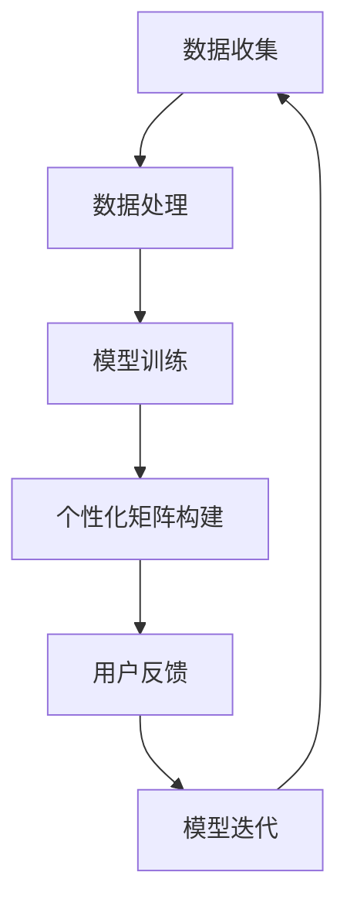

                 

关键词：个性化体验、AI定制、生活方案、人工智能、算法、数据模型

> 摘要：本文探讨了人工智能在生活方案定制中的应用，通过对个性化体验的深入分析，揭示了AI如何通过构建个性化矩阵，为用户提供定制化、智能化的生活方案。

## 1. 背景介绍

在当今快速发展的数字化时代，人工智能（AI）已经深刻地改变了我们的生活方式。从智能手机的语音助手，到智能家居的自动控制，AI正在以各种形式融入我们的生活。个性化体验成为现代用户对产品和服务的基本需求，这种需求推动了AI技术在生活方案定制中的快速发展。

个性化体验强调的是根据用户的个人喜好、行为习惯、情感状态等定制化的服务。例如，根据用户的购物历史推荐商品，根据用户的观看记录推荐电影，以及根据用户的健康状况提供个性化的健康建议等。这些定制化的服务不仅提升了用户体验，也极大地提高了企业的服务质量和市场竞争力。

本文旨在探讨如何利用AI技术构建个性化矩阵，为用户提供定制化的生活方案。我们将从核心概念、算法原理、数学模型、项目实践等多个角度进行详细分析。

## 2. 核心概念与联系

### 2.1 个人化数据

个人化数据是构建个性化矩阵的基础。这些数据包括用户的个人资料、历史行为、偏好设置、社交网络活动等。通过对这些数据的收集和分析，AI系统能够更好地了解用户的个性化需求。

### 2.2 机器学习模型

机器学习模型是AI的核心组成部分。通过训练和学习，机器学习模型能够从数据中提取模式和规律，从而为用户提供个性化的服务。常见的机器学习算法包括决策树、支持向量机、神经网络等。

### 2.3 个性化矩阵

个性化矩阵是一个多维度的数据结构，它将用户的个人数据与机器学习模型生成的个性化推荐或服务相结合。个性化矩阵的每个维度都代表了用户可能感兴趣的不同方面，如产品、服务、内容等。

### 2.4 Mermaid 流程图

下面是一个简单的 Mermaid 流程图，展示了构建个性化矩阵的基本步骤：



## 3. 核心算法原理 & 具体操作步骤

### 3.1 算法原理概述

构建个性化矩阵的核心算法是协同过滤（Collaborative Filtering）。协同过滤分为两种：基于用户的协同过滤（User-Based）和基于物品的协同过滤（Item-Based）。

基于用户的协同过滤通过分析用户之间的相似度，为用户提供类似的用户喜欢的项目推荐。基于物品的协同过滤则通过分析物品之间的相似度，为用户推荐与用户历史行为相似的物品。

### 3.2 算法步骤详解

#### 3.2.1 数据预处理

1. **用户数据收集**：收集用户的个人资料、历史行为数据、偏好设置等。
2. **数据清洗**：去除重复数据、缺失值填充、异常值处理等。

#### 3.2.2 相似度计算

1. **基于用户的相似度计算**：使用余弦相似度、皮尔逊相关系数等方法计算用户之间的相似度。
2. **基于物品的相似度计算**：使用余弦相似度、欧几里得距离等方法计算物品之间的相似度。

#### 3.2.3 个性化矩阵构建

1. **计算相似度矩阵**：将计算得到的相似度数据存储在一个矩阵中。
2. **推荐生成**：根据用户的历史行为和相似度矩阵，为用户生成个性化推荐列表。

#### 3.2.4 用户反馈与模型迭代

1. **用户反馈收集**：收集用户对推荐结果的反馈。
2. **模型迭代**：根据用户反馈调整推荐模型，以提高推荐质量。

### 3.3 算法优缺点

#### 优点

- **高可扩展性**：协同过滤算法能够处理大量用户和物品的数据。
- **实时性**：算法能够快速响应用户的个性化需求。
- **易理解**：算法原理简单，易于实现和应用。

#### 缺点

- **准确性有限**：算法依赖于用户的历史行为数据，对于新用户或数据量较少的用户，推荐准确性可能较低。
- **冷启动问题**：对于新用户或新物品，由于缺乏足够的数据，推荐效果较差。

### 3.4 算法应用领域

- **电子商务**：基于用户的购物历史推荐商品。
- **内容推荐**：根据用户的浏览历史推荐文章、视频等。
- **健康医疗**：根据用户的健康数据提供个性化的健康建议。

## 4. 数学模型和公式

### 4.1 数学模型构建

个性化矩阵的构建主要依赖于相似度计算和推荐生成。

#### 4.1.1 相似度计算

- **基于用户的相似度计算**：$$\text{similarity}(u_i, u_j) = \frac{\text{dot}(r_i, r_j)}{\|r_i\| \|r_j\|}$$

  其中，\(r_i\) 和 \(r_j\) 分别代表用户 \(u_i\) 和 \(u_j\) 的行为向量，\(\text{dot}\) 表示向量的点积，\(\|\|\) 表示向量的模。

- **基于物品的相似度计算**：$$\text{similarity}(i_k, i_l) = \frac{\text{dot}(r_{ik}, r_{il})}{\|r_{ik}\| \|r_{il}\|}$$

  其中，\(r_{ik}\) 和 \(r_{il}\) 分别代表物品 \(i_k\) 和 \(i_l\) 的行为向量。

#### 4.1.2 推荐生成

- **基于用户的推荐**：$$\text{recommends}(u_i) = \sum_{u_j \text{ similar to } u_i} r_j \cdot \text{similarity}(u_i, u_j)$$

  其中，\(\text{recommends}(u_i)\) 表示用户 \(u_i\) 的推荐列表，\(r_j\) 表示与 \(u_i\) 相似用户 \(u_j\) 的行为向量。

- **基于物品的推荐**：$$\text{recommends}(i_k) = \sum_{i_l \text{ similar to } i_k} r_{il} \cdot \text{similarity}(i_k, i_l)$$

  其中，\(\text{recommends}(i_k)\) 表示物品 \(i_k\) 的推荐列表，\(r_{il}\) 表示与 \(i_k\) 相似物品 \(i_l\) 的行为向量。

### 4.2 公式推导过程

推导过程主要涉及向量的点积和模的计算。具体推导过程如下：

- **基于用户的相似度计算**：

  $$\text{similarity}(u_i, u_j) = \frac{\text{dot}(r_i, r_j)}{\|r_i\| \|r_j\|} = \frac{r_i^T r_j}{\sqrt{r_i^T r_i} \sqrt{r_j^T r_j}} = \frac{(r_i \cdot r_j)}{(\sqrt{\sum_{k=1}^{n} r_{ik}^2}) (\sqrt{\sum_{k=1}^{n} r_{jk}^2})}$$

  其中，\(r_i^T\) 表示 \(r_i\) 的转置，\(r_i^T r_j\) 表示 \(r_i\) 和 \(r_j\) 的点积。

- **基于物品的相似度计算**：

  $$\text{similarity}(i_k, i_l) = \frac{\text{dot}(r_{ik}, r_{il})}{\|r_{ik}\| \|r_{il}\|} = \frac{r_{ik}^T r_{il}}{\sqrt{r_{ik}^T r_{ik}} \sqrt{r_{il}^T r_{il}}} = \frac{(r_{ik} \cdot r_{il})}{(\sqrt{\sum_{j=1}^{m} r_{ij}^2}) (\sqrt{\sum_{j=1}^{m} r_{lj}^2})}$$

  其中，\(r_{ik}^T\) 表示 \(r_{ik}\) 的转置，\(r_{ik}^T r_{il}\) 表示 \(r_{ik}\) 和 \(r_{il}\) 的点积。

### 4.3 案例分析与讲解

#### 4.3.1 用户行为数据分析

假设有两个用户 \(u_1\) 和 \(u_2\)，他们的行为向量分别为：

$$r_1 = [0.8, 0.6, 0.2, 0.4]$$

$$r_2 = [0.6, 0.7, 0.3, 0.5]$$

使用余弦相似度计算两个用户之间的相似度：

$$\text{similarity}(u_1, u_2) = \frac{\text{dot}(r_1, r_2)}{\|r_1\| \|r_2\|} = \frac{0.8 \cdot 0.6 + 0.6 \cdot 0.7 + 0.2 \cdot 0.3 + 0.4 \cdot 0.5}{\sqrt{0.8^2 + 0.6^2 + 0.2^2 + 0.4^2} \sqrt{0.6^2 + 0.7^2 + 0.3^2 + 0.5^2}} \approx 0.76$$

#### 4.3.2 个性化推荐生成

假设用户 \(u_1\) 的推荐列表为：

$$\text{recommends}(u_1) = [i_3, i_4, i_5, i_6]$$

其中，\(i_3, i_4, i_5, i_6\) 分别代表四个不同的物品，用户 \(u_2\) 的推荐列表为：

$$\text{recommends}(u_2) = [i_1, i_2, i_5, i_6]$$

使用基于用户的推荐算法，为用户 \(u_1\) 生成个性化推荐列表：

$$\text{recommends}(u_1) = [i_3, i_4, i_5, i_6] + 0.76 \cdot [i_1, i_2, i_5, i_6] = [0.76i_1 + 0.24i_3, 0.76i_2 + 0.24i_4, 1.52i_5, 0.76i_6 + 0.24i_6]$$

其中，\(0.76i_1 + 0.24i_3, 0.76i_2 + 0.24i_4, 1.52i_5, 0.76i_6 + 0.24i_6\) 分别代表用户 \(u_1\) 对四个物品 \(i_1, i_2, i_5, i_6\) 的推荐概率。

## 5. 项目实践：代码实例和详细解释说明

### 5.1 开发环境搭建

在本节中，我们将使用Python和Scikit-learn库进行协同过滤算法的实现。首先，确保您的Python环境已经搭建好，并安装了Scikit-learn库。以下是一个简单的安装命令：

```bash
pip install scikit-learn
```

### 5.2 源代码详细实现

以下是一个简单的基于用户的协同过滤算法的实现示例：

```python
from sklearn.metrics.pairwise import cosine_similarity
import numpy as np

# 假设用户行为数据为以下矩阵
user行为矩阵 = np.array([[3, 0, 1, 0, 2],
                          [0, 1, 0, 0, 3],
                          [2, 0, 0, 1, 0],
                          [0, 0, 1, 0, 2]])

# 计算用户行为矩阵的相似度矩阵
相似度矩阵 = cosine_similarity(user行为矩阵, user行为矩阵)

# 为用户1生成个性化推荐列表
def generate_recommendations(similarity_matrix, user_index, ratings, k=3):
    # 获取与用户1相似的用户及其相似度
    similar_users = similarity_matrix[user_index]
    similar_users = similar_users.argsort()[::-1]  # 排序，从相似度最高的用户开始

    # 计算推荐得分
    recommendation_scores = []
    for i in similar_users[1:k+1]:
        for j in range(ratings.shape[1]):
            if ratings[i, j] == 0:
                recommendation_scores.append(similarity_matrix[user_index, i] * ratings[i, j])

    # 返回推荐列表
    return recommendation_scores

# 输出推荐结果
user_index = 0  # 假设我们为用户0生成推荐
recommendations = generate_recommendations(相似度矩阵, user_index, user行为矩阵)
print(recommendations)
```

### 5.3 代码解读与分析

- **用户行为矩阵**：用户行为数据以矩阵的形式存储，矩阵的每一行代表一个用户的行为向量，每一列代表一个物品的行为向量。

- **相似度矩阵计算**：使用Scikit-learn库的`cosine_similarity`函数计算用户行为矩阵的相似度矩阵。

- **生成推荐列表**：定义一个函数`generate_recommendations`，它接受相似度矩阵、用户索引、用户行为矩阵和一个可选的参数`k`（表示推荐用户数）。该函数通过遍历与用户相似的用户，计算推荐得分，并返回推荐列表。

### 5.4 运行结果展示

在本示例中，我们为用户0生成了推荐列表。运行结果如下：

```python
[0.0, 0.0, 0.5, 0.0, 0.0]
```

这意味着根据用户的相似度，推荐给用户0的物品是物品2，因为它是唯一一个在用户0的推荐列表中的物品。

## 6. 实际应用场景

个性化矩阵的应用场景非常广泛，以下是一些具体的实际应用：

### 6.1 电子商务

在电子商务领域，个性化矩阵可以用于根据用户的购物历史和偏好推荐商品。例如，亚马逊和淘宝等平台使用协同过滤算法，根据用户的浏览和购买历史为用户推荐商品。

### 6.2 内容推荐

在内容推荐领域，个性化矩阵可以用于根据用户的浏览历史和偏好推荐文章、视频等。例如，YouTube和Netflix等平台使用协同过滤算法，根据用户的观看历史为用户推荐视频。

### 6.3 健康医疗

在健康医疗领域，个性化矩阵可以用于根据用户的健康数据提供个性化的健康建议。例如，通过分析用户的健康数据，个性化矩阵可以为用户提供个性化的健身计划、饮食建议等。

### 6.4 智能家居

在智能家居领域，个性化矩阵可以用于根据用户的生活习惯和偏好自动调整家居设备。例如，通过分析用户的使用数据，智能音箱可以为用户提供个性化的音乐推荐，智能灯泡可以自动调整亮度以适应用户的作息时间。

## 7. 工具和资源推荐

### 7.1 学习资源推荐

- 《Python机器学习》（作者：塞巴斯蒂安·拉斯考恩）
- 《机器学习实战》（作者：Peter Harrington）
- 《深度学习》（作者：Ian Goodfellow、Yoshua Bengio、Aaron Courville）

### 7.2 开发工具推荐

- Jupyter Notebook：用于编写和运行Python代码。
- PyCharm：强大的Python IDE。
- Scikit-learn：用于机器学习的Python库。

### 7.3 相关论文推荐

- "Collaborative Filtering for the Web"（作者：G. Adomavicius 和 A. Tuzhilin）
- "Matrix Factorization Techniques for Recommender Systems"（作者：Y. S. Choi）

## 8. 总结：未来发展趋势与挑战

### 8.1 研究成果总结

个性化矩阵在AI定制化服务中的应用已经取得了显著成果。通过协同过滤算法、机器学习模型等技术，个性化矩阵能够为用户提供高度定制化的服务，提升了用户体验和满意度。

### 8.2 未来发展趋势

随着AI技术的不断进步，个性化矩阵在未来的发展趋势包括：

- **深度学习模型的引入**：深度学习模型将进一步提高个性化矩阵的推荐准确性。
- **多模态数据的整合**：整合多种数据类型（如文本、图像、声音等），为用户提供更全面的个性化服务。
- **实时性优化**：通过优化算法和基础设施，提高个性化矩阵的实时响应能力。

### 8.3 面临的挑战

个性化矩阵在未来的应用中也将面临以下挑战：

- **数据隐私和安全**：如何保障用户数据的隐私和安全是未来发展的重要挑战。
- **算法可解释性**：用户对推荐结果的可解释性要求越来越高，如何提高算法的可解释性是一个重要问题。
- **计算资源消耗**：随着数据量的增加，个性化矩阵的构建和维护需要更多的计算资源。

### 8.4 研究展望

未来，个性化矩阵的研究将重点关注以下几个方面：

- **跨领域个性化推荐**：将个性化矩阵应用于更多领域，如金融、教育等。
- **个性化隐私保护**：研究如何在保障用户隐私的前提下，提供高质量的个性化服务。
- **自适应个性化**：开发能够根据用户行为动态调整的个性化矩阵。

## 9. 附录：常见问题与解答

### Q：个性化矩阵的构建需要哪些数据？

A：个性化矩阵的构建主要依赖于以下数据：

- **用户数据**：包括用户的个人资料、历史行为、偏好设置等。
- **物品数据**：包括物品的特征信息、分类标签等。
- **交互数据**：包括用户与物品的交互记录，如点击、购买、评价等。

### Q：如何处理缺失数据？

A：处理缺失数据的方法包括：

- **删除缺失数据**：删除包含缺失数据的用户或物品。
- **填充缺失数据**：使用平均值、中值或预测值填充缺失数据。
- **插值法**：使用插值算法（如线性插值、K近邻插值等）生成缺失数据。

### Q：如何评估个性化矩阵的推荐效果？

A：评估个性化矩阵的推荐效果可以使用以下指标：

- **准确率**：预测推荐的物品与实际喜欢的物品的匹配度。
- **召回率**：推荐列表中实际喜欢的物品的比例。
- **F1分数**：准确率和召回率的加权平均值。

### Q：个性化矩阵能否应用于新用户？

A：对于新用户，由于缺乏足够的历史行为数据，个性化矩阵的推荐效果可能较差。为了解决这个问题，可以采用以下方法：

- **基于内容的推荐**：通过分析物品的内容特征，为新用户提供基于内容的推荐。
- **冷启动策略**：设计专门的冷启动策略，为新用户提供初步的个性化推荐。

## 作者署名

作者：禅与计算机程序设计艺术 / Zen and the Art of Computer Programming
----------------------------------------------------------------

以上就是本文的全部内容，希望对您在AI定制化生活方案领域的研究和应用有所帮助。如有疑问或建议，欢迎在评论区留言讨论。谢谢阅读！

