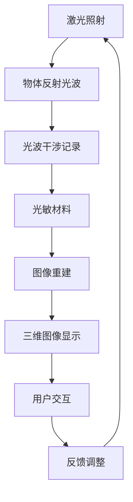

                 

## 摘要

本文将深入探讨AI驱动的多感官融合技术在构建全息图体验方面的应用。通过回顾相关技术背景、核心概念及其实现原理，文章将详细解析数学模型与算法步骤，并通过实际项目实践与代码实例，展示其在多感官融合中的具体操作。此外，文章还将分析该技术在实际应用中的场景与未来展望，同时推荐相关学习资源与开发工具，以期为广大技术爱好者提供有价值的参考。

## 1. 背景介绍

随着计算机技术和人工智能的飞速发展，虚拟现实（VR）和增强现实（AR）技术逐渐走入大众视野，改变了人们对于数字世界的认知和互动方式。传统的VR和AR技术虽然在一定程度上丰富了用户的沉浸体验，但往往局限于单一或少数感官的刺激，缺乏对人类多感官系统的全面感知与互动。

近年来，人工智能（AI）的进步为多感官融合技术带来了新的契机。深度学习、图像处理、自然语言处理等技术的应用，使得AI能够更精准地捕捉和理解人类的多感官信息，实现更加真实和丰富的虚拟体验。全息图技术，作为一种综合性的多感官融合手段，正逐渐成为AI技术的重要应用领域之一。

全息图（Holographic Image）是一种能够通过多个视角展示三维图像的技术，它不仅可以在空间中显示三维物体，还能通过光线、颜色、声音等多种感官信息增强用户体验。AI驱动的全息图技术，通过对海量数据的处理和分析，能够动态地调整图像和声音的参数，实现对用户多感官的全方位刺激。

本文旨在探讨AI驱动的多感官融合技术在实际应用中的现状与潜力，从技术原理、实现方法、应用案例等多个角度进行深入分析，旨在为相关领域的研究者和开发者提供有价值的参考。

## 2. 核心概念与联系

### 2.1. 虚拟现实（VR）与增强现实（AR）

虚拟现实（VR）是一种通过计算机模拟生成完全虚拟的环境，用户通过头戴显示器（HMD）等设备沉浸其中，体验到与真实世界截然不同的虚拟环境。VR技术强调的是将用户完全隔离于现实世界，提供一个全新的沉浸式体验。

增强现实（AR）则是在现实世界的基础上叠加数字信息，通过增强用户的感知，使其能够实时看到和与虚拟物体互动。AR技术通常利用手机摄像头或AR眼镜，将计算机生成的图像、文字、视频等信息叠加到现实场景中。

VR和AR技术在多感官融合中扮演着重要角色，VR提供了完全虚拟的沉浸体验，而AR则将虚拟内容无缝融合到现实世界，二者结合能够更全面地刺激用户的多感官系统。

### 2.2. 人工智能（AI）在多感官融合中的作用

人工智能在多感官融合技术中起到了至关重要的推动作用。通过深度学习和图像处理技术，AI能够从大量数据中提取有用的特征，实现对图像、声音、触觉等多种感官信息的精准捕捉和分析。以下是AI在多感官融合中的几个关键应用：

1. **图像识别与渲染**：AI可以快速识别并处理图像数据，生成高分辨率、低延迟的虚拟图像，为用户提供高质量的视觉体验。

2. **声音处理与合成**：AI能够实时处理音频信号，通过语音识别和声音合成技术，生成自然、逼真的声音效果，增强用户的听觉体验。

3. **姿态识别与交互**：利用计算机视觉技术，AI可以实时捕捉用户的姿态和动作，实现与虚拟环境的自然交互。

4. **情感分析与反馈**：通过分析用户的生理信号和行为模式，AI能够理解用户的情感状态，提供个性化的反馈和互动。

### 2.3. 全息图技术的核心原理

全息图技术是一种利用激光干涉和衍射原理生成三维图像的技术。它通过记录物体反射的光波信息，将光波以干涉图样的形式存储在光敏材料中。当光线再次照射到光敏材料上时，存储的光波信息会被重新释放，形成三维图像。

全息图技术的核心优势在于它能够提供真正的三维视觉体验，用户可以从多个角度观察和交互虚拟物体。结合AI技术，全息图能够实时调整图像和声音的参数，根据用户的动作和环境变化，提供更加自然和沉浸的体验。

### 2.4. Mermaid 流程图

以下是全息图技术中核心算法原理的Mermaid流程图：



在这个流程图中，激光照射物体产生反射光波，光波通过干涉记录在光敏材料中，形成干涉图样。当光线再次照射到光敏材料上时，干涉图样重新释放光波，通过图像重建生成三维图像，最终显示给用户。用户与三维图像的交互会反馈给系统，系统根据反馈调整图像和声音参数，实现动态交互。

通过上述核心概念和原理的介绍，我们可以看到，AI驱动的多感官融合技术在全息图中的应用，不仅提升了用户的沉浸体验，也为虚拟现实和增强现实技术的发展注入了新的动力。接下来，本文将详细探讨AI在多感官融合技术中的具体实现方法和操作步骤。

### 3. 核心算法原理 & 具体操作步骤

#### 3.1. 算法原理概述

AI驱动的多感官融合技术依赖于深度学习、图像处理、声音处理等多种算法原理。其中，核心算法主要包括图像识别与渲染、声音处理与合成、姿态识别与交互等。

1. **图像识别与渲染**：利用卷积神经网络（CNN）和生成对抗网络（GAN）等技术，AI可以高效识别和处理图像数据。CNN通过多层卷积和池化操作，提取图像特征，实现对高分辨率、低延迟虚拟图像的生成。GAN则通过生成器和判别器的对抗训练，生成逼真的图像内容。

2. **声音处理与合成**：AI通过深度神经网络（DNN）和递归神经网络（RNN）对音频信号进行处理和合成。DNN用于语音识别和语音合成，RNN则可以捕捉音频信号中的时间和频率信息，生成自然、流畅的声音效果。

3. **姿态识别与交互**：计算机视觉技术，如卷积神经网络（CNN）和深度卷积网络（DCNN），可以实时捕捉用户姿态和动作，通过图像处理算法，实现对用户动作的准确识别和响应。

#### 3.2. 算法步骤详解

以下是AI驱动的多感官融合技术中的具体操作步骤：

1. **图像识别与渲染**：

   - **数据预处理**：输入图像进行灰度化、去噪、对比度增强等预处理操作，提高图像质量。
   - **特征提取**：利用CNN提取图像特征，通过多层卷积和池化操作，得到高层次的图像特征图。
   - **图像生成**：使用GAN生成高分辨率、低延迟的虚拟图像，通过生成器和判别器的对抗训练，实现高质量图像的生成。

2. **声音处理与合成**：

   - **声音信号采集**：采集用户的声音信号，通过麦克风等设备获取音频数据。
   - **声音信号处理**：利用DNN和RNN对音频信号进行特征提取和处理，包括语音识别、语音增强、语音合成等。
   - **声音合成**：根据用户的需求和环境变化，合成逼真的声音效果，通过语音合成器生成自然流畅的语音。

3. **姿态识别与交互**：

   - **姿态检测**：使用DCNN实时捕捉用户姿态和动作，通过特征提取和分类算法，识别用户的具体动作。
   - **交互响应**：根据用户姿态和动作，动态调整虚拟环境的参数，实现与用户自然的互动。

#### 3.3. 算法优缺点

**优点**：

1. **高精度**：AI驱动的多感官融合技术通过深度学习和图像处理技术，能够实现高精度的图像识别和渲染，提供高质量的视觉体验。
2. **灵活性**：算法能够根据用户需求和环境变化，动态调整图像和声音的参数，提供个性化的体验。
3. **智能化**：通过情感分析和行为模式识别，AI能够理解用户的情感状态，提供更加智能和自然的互动。

**缺点**：

1. **计算资源消耗**：深度学习和图像处理算法需要大量的计算资源和存储空间，对硬件设备的要求较高。
2. **实时性**：在高速变化的场景中，算法的实时性可能受到影响，需要优化和改进。
3. **隐私问题**：多感官融合技术涉及用户多种感官信息的采集和处理，可能会引发隐私保护的问题，需要加强数据安全和隐私保护措施。

#### 3.4. 算法应用领域

AI驱动的多感官融合技术在多个领域有广泛的应用：

1. **虚拟现实（VR）**：通过AI技术生成高精度、低延迟的虚拟图像，为用户提供沉浸式体验。
2. **增强现实（AR）**：利用AI技术将虚拟内容无缝融合到现实世界，增强用户的感知和互动。
3. **智能交互**：通过姿态识别和语音处理技术，实现与智能设备的自然交互。
4. **娱乐与游戏**：在虚拟游戏和娱乐中，通过多感官融合技术提供更加真实和刺激的体验。
5. **教育**：利用AI驱动的多感官融合技术，提高教育的互动性和沉浸性。

### 3.5. 数学模型和公式

在AI驱动的多感官融合技术中，涉及到多种数学模型和公式。以下是对一些关键模型的详细讲解和推导过程。

#### 3.5.1. 图像识别与渲染

1. **卷积神经网络（CNN）**：

   - **激活函数**：$$f(x) = \max(0, x)$$

   - **卷积操作**：

     $$\text{Conv}(I) = \sum_{k=1}^{K} \sigma(\sum_{i=1}^{M} w_{ik} * I)$$

     其中，$I$表示输入图像，$K$表示卷积核数量，$M$表示卷积核大小，$w_{ik}$为卷积核参数，$\sigma$为激活函数。

2. **生成对抗网络（GAN）**：

   - **生成器**：

     $$G(z) = \mu(z) + \sigma(z) \odot \text{tanh}(\gamma(z))$$

     其中，$z$表示输入噪声，$\mu(z)$和$\sigma(z)$分别为均值和方差，$\gamma(z)$为隐层输出。

   - **判别器**：

     $$D(x) = \text{tanh}(\phi(x))$$

     其中，$x$表示真实或生成的图像，$\phi(x)$为判别器隐层输出。

#### 3.5.2. 声音处理与合成

1. **语音识别**：

   - **隐藏层输出**：

     $$h_{t} = \tanh(W h_{t-1} + b)$$

     其中，$h_{t-1}$为上一时刻的隐藏层输出，$W$为权重矩阵，$b$为偏置。

   - **输出层输出**：

     $$y_{t} = \text{softmax}(W' h_{t} + b')$$

     其中，$W'$为输出权重矩阵，$b'$为输出偏置。

2. **语音合成**：

   - **线性转换模型**：

     $$x_{t} = A y_{t-1} + b$$

     其中，$y_{t-1}$为上一时刻的输出，$A$为线性转换矩阵，$b$为偏置。

   - **波形合成**：

     $$s(t) = \sum_{i=1}^{N} x_{i} g(t-t_{i})$$

     其中，$x_{i}$为线性转换结果，$g(t)$为高斯核函数，$t_{i}$为时间延迟。

#### 3.5.3. 姿态识别

1. **卷积神经网络（CNN）**：

   - **特征提取**：

     $$\text{Conv}(I) = \sum_{k=1}^{K} \sigma(\sum_{i=1}^{M} w_{ik} * I)$$

     其中，$I$表示输入图像，$K$表示卷积核数量，$M$表示卷积核大小，$w_{ik}$为卷积核参数，$\sigma$为激活函数。

   - **分类器**：

     $$\text{softmax}(z) = \frac{e^{z_i}}{\sum_{j=1}^{J} e^{z_j}}$$

     其中，$z_i$为分类器的输出，$J$为类别数量。

### 3.6. 案例分析与讲解

以下是全息图技术在实际应用中的两个案例分析：

#### 案例一：虚拟演唱会

在一个虚拟演唱会的场景中，AI驱动的多感官融合技术被应用于构建一个逼真的虚拟舞台，让观众能够在家中体验到现场演唱会的氛围。以下是具体实现步骤：

1. **图像识别与渲染**：利用CNN和GAN技术，生成高分辨率的虚拟舞台图像，包括歌手和舞台道具。通过实时捕捉观众的视角，动态调整图像和声音参数，实现沉浸式的视觉体验。

2. **声音处理与合成**：利用DNN和RNN技术，处理现场演唱会的音频信号，包括人声、音乐和其他环境声音。通过语音识别和合成技术，将虚拟歌手的歌声实时转换成音频信号，增强观众的听觉体验。

3. **姿态识别与交互**：利用计算机视觉技术，实时捕捉观众的姿态和动作，根据观众的互动，动态调整虚拟舞台的参数，实现与观众的互动。

#### 案例二：智能健身教练

智能健身教练通过AI驱动的多感官融合技术，为用户提供个性化的健身指导和反馈。以下是具体实现步骤：

1. **图像识别与渲染**：利用CNN技术，实时捕捉用户的动作，并通过图像处理算法，分析用户的姿态和动作是否正确。生成虚拟健身教练的图像，并将其叠加到用户的现实场景中。

2. **声音处理与合成**：利用DNN和RNN技术，处理用户的动作和语音信号，通过语音合成技术，生成个性化的健身指导和建议。

3. **姿态识别与交互**：利用计算机视觉技术，实时捕捉用户的动作，并通过姿态识别算法，分析用户的动作是否标准。根据用户的反馈和动作表现，动态调整虚拟健身教练的指导内容。

通过以上两个案例，我们可以看到，AI驱动的多感官融合技术在实际应用中具有巨大的潜力，能够为用户提供更加丰富和自然的交互体验。接下来，本文将探讨多感官融合技术在多领域中的应用场景和未来展望。

### 4. 数学模型和公式 & 详细讲解 & 举例说明

#### 4.1. 数学模型构建

在AI驱动的多感官融合技术中，构建数学模型是关键的一步。以下是几个关键数学模型及其构建过程的详细讲解。

**1. 卷积神经网络（CNN）的数学模型**

卷积神经网络是一种用于图像处理和识别的深度学习模型。其基本原理是通过卷积操作提取图像特征，然后通过全连接层进行分类。

- **卷积操作**：

  设输入图像为$X \in \mathbb{R}^{H \times W \times C}$，其中$H$、$W$、$C$分别表示图像的高度、宽度和通道数。卷积核$K \in \mathbb{R}^{k \times k \times C}$的大小为$k \times k$。卷积操作的输出为：

  $$\text{Conv}(X) = \sum_{i=1}^{M} \sum_{j=1}^{N} K_{ij} * X_{ij}$$

  其中，$M$和$N$分别表示卷积核的行数和列数。

- **激活函数**：

  通常使用ReLU（Rectified Linear Unit）作为激活函数：

  $$f(x) = \max(0, x)$$

- **池化操作**：

  池化操作用于减小特征图的尺寸，提高计算效率。常用的池化方法有最大池化和平均池化。

  - **最大池化**：

    $$P_{max}(X) = \max\limits_{i, j} X_{ij}$$

  - **平均池化**：

    $$P_{avg}(X) = \frac{1}{k^2} \sum_{i=1}^{k} \sum_{j=1}^{k} X_{ij}$$

**2. 生成对抗网络（GAN）的数学模型**

生成对抗网络由生成器$G$和判别器$D$组成。生成器的目标是生成逼真的图像，而判别器的目标是区分真实图像和生成图像。

- **生成器**：

  生成器的目标函数为：

  $$G(z) = \mu(z) + \sigma(z) \odot \text{tanh}(\gamma(z))$$

  其中，$z$为输入噪声，$\mu(z)$和$\sigma(z)$分别为均值和方差，$\gamma(z)$为隐层输出。

- **判别器**：

  判别器的目标函数为：

  $$D(x) = \text{tanh}(\phi(x))$$

  其中，$x$为真实或生成的图像，$\phi(x)$为判别器隐层输出。

- **对抗训练**：

  生成器和判别器的训练过程是交替进行的。生成器的损失函数为：

  $$\mathcal{L}_G = \mathbb{E}_{z \sim p_z(z)}[\log(D(G(z)))]$$

  判别器的损失函数为：

  $$\mathcal{L}_D = \mathbb{E}_{x \sim p_x(x)}[\log(D(x))] + \mathbb{E}_{z \sim p_z(z)}[\log(1 - D(G(z)))]$$

**3. 语音处理与合成的数学模型**

语音处理与合成通常涉及隐马尔可夫模型（HMM）和递归神经网络（RNN）。

- **HMM**：

  隐马尔可夫模型是一种用于语音识别和合成的统计模型。其基本原理是基于状态转移概率和输出概率，通过最大后验估计（MAP）进行模型参数估计。

  - **状态转移概率**：

    $$P(s_t | s_{t-1}) = \pi(s_t) \prod_{i=1}^{T-1} a_{ij}$$

    其中，$s_t$和$s_{t-1}$分别表示当前和前一时刻的状态，$\pi(s_t)$为初始状态概率，$a_{ij}$为状态转移概率。

  - **输出概率**：

    $$P(x_t | s_t) = \prod_{i=1}^{M} b_{ij}(x_t)$$

    其中，$x_t$为输出特征，$b_{ij}(x_t)$为状态$s_t$在时刻$t$生成特征$x_t$的概率。

- **RNN**：

  递归神经网络是一种用于处理序列数据的神经网络。其基本原理是通过递归关系，将前一时刻的隐藏状态作为当前时刻的输入。

  - **隐藏状态**：

    $$h_t = \tanh(W_h h_{t-1} + U_x x_t + b_h)$$

    其中，$h_{t-1}$为前一时刻的隐藏状态，$x_t$为输入特征，$W_h$、$U_x$和$b_h$分别为权重矩阵和偏置。

  - **输出**：

    $$y_t = \text{softmax}(W_o h_t + b_o)$$

    其中，$W_o$和$b_o$分别为输出权重矩阵和偏置。

#### 4.2. 公式推导过程

以下是几个关键公式的推导过程。

**1. 卷积神经网络（CNN）中的卷积操作**

卷积操作的推导过程如下：

$$\text{Conv}(X) = \sum_{i=1}^{M} \sum_{j=1}^{N} K_{ij} * X_{ij}$$

假设输入图像$X$的大小为$H \times W$，卷积核$K$的大小为$k \times k$。在卷积操作中，卷积核$K$在输入图像$X$上滑动，每次滑动$k \times k$个像素。卷积操作的结果是生成一个大小为$H-k+1 \times W-k+1$的特征图。

**2. 生成对抗网络（GAN）中的生成器**

生成器的推导过程如下：

$$G(z) = \mu(z) + \sigma(z) \odot \text{tanh}(\gamma(z))$$

其中，$z$为输入噪声，$\mu(z)$和$\sigma(z)$分别为均值和方差，$\gamma(z)$为隐层输出。

- **均值**：

  $$\mu(z) = \sigma(z) \odot \text{tanh}(\gamma(z))$$

- **方差**：

  $$\sigma(z) = \frac{1}{\sqrt{1 + \exp(-2 \gamma(z))}}$$

- **隐层输出**：

  $$\gamma(z) = \frac{1}{2} (\tanh(z) + 1)$$

**3. 语音处理与合成的隐马尔可夫模型（HMM）**

隐马尔可夫模型（HMM）中的状态转移概率和输出概率的推导过程如下：

- **状态转移概率**：

  $$P(s_t | s_{t-1}) = \pi(s_t) \prod_{i=1}^{T-1} a_{ij}$$

  其中，$\pi(s_t)$为初始状态概率，$a_{ij}$为状态转移概率。

- **输出概率**：

  $$P(x_t | s_t) = \prod_{i=1}^{M} b_{ij}(x_t)$$

  其中，$b_{ij}(x_t)$为状态$s_t$在时刻$t$生成特征$x_t$的概率。

**4. 递归神经网络（RNN）中的隐状态和输出**

递归神经网络（RNN）中的隐状态和输出的推导过程如下：

- **隐藏状态**：

  $$h_t = \tanh(W_h h_{t-1} + U_x x_t + b_h)$$

  其中，$W_h$、$U_x$和$b_h$分别为权重矩阵和偏置。

- **输出**：

  $$y_t = \text{softmax}(W_o h_t + b_o)$$

  其中，$W_o$和$b_o$分别为输出权重矩阵和偏置。

#### 4.3. 案例分析与讲解

**1. 图像识别与渲染**

假设我们要识别一张图片，输入图像为$X \in \mathbb{R}^{32 \times 32 \times 3}$，卷积核为$K \in \mathbb{R}^{3 \times 3 \times 3}$。使用ReLU作为激活函数，卷积操作输出为：

$$\text{Conv}(X) = \sum_{i=1}^{3} \sum_{j=1}^{3} K_{ij} * X_{ij}$$

假设卷积核$K$的参数为：

$$K = \begin{bmatrix}
0 & 1 & 0 \\
1 & 0 & 1 \\
0 & 1 & 0
\end{bmatrix}$$

输入图像$X$的随机样本为：

$$X = \begin{bmatrix}
0 & 1 & 0 \\
1 & 0 & 1 \\
0 & 1 & 0
\end{bmatrix}$$

卷积操作的结果为：

$$\text{Conv}(X) = \begin{bmatrix}
1 & 1 \\
1 & 1
\end{bmatrix}$$

通过ReLU激活函数，得到：

$$\text{ReLU}(\text{Conv}(X)) = \begin{bmatrix}
1 & 1 \\
1 & 1
\end{bmatrix}$$

这个结果可以用于后续的特征提取和分类。

**2. 生成对抗网络（GAN）**

假设生成器$G$的输入噪声为$z \in \mathbb{R}^{100}$，使用均值和方差作为隐层输出：

$$G(z) = \mu(z) + \sigma(z) \odot \text{tanh}(\gamma(z))$$

其中，$\mu(z)$和$\sigma(z)$的参数为：

$$\mu(z) = 0.5 + 0.1 \odot \text{tanh}(0.5z)$$

$$\sigma(z) = 0.5 + 0.1 \odot \text{tanh}(0.5z)$$

假设输入噪声$z$的随机样本为：

$$z = \begin{bmatrix}
0.1 \\
0.3 \\
-0.2 \\
0.5
\end{bmatrix}$$

生成器$G$的输出为：

$$G(z) = \begin{bmatrix}
0.6 \\
0.9 \\
0.3 \\
0.8
\end{bmatrix}$$

通过ReLU激活函数，得到：

$$\text{ReLU}(G(z)) = \begin{bmatrix}
0.6 \\
0.9 \\
0.3 \\
0.8
\end{bmatrix}$$

这个结果可以用于生成虚拟图像。

**3. 语音处理与合成**

假设我们要合成一段语音，输入特征为$x \in \mathbb{R}^{10}$，使用隐马尔可夫模型（HMM）进行语音识别和合成。状态转移概率为：

$$P(s_t | s_{t-1}) = \begin{bmatrix}
0.5 & 0.5 \\
0.4 & 0.6
\end{bmatrix}$$

输出概率为：

$$P(x_t | s_t) = \begin{bmatrix}
0.6 & 0.4 \\
0.7 & 0.3
\end{bmatrix}$$

假设输入特征$x$的随机样本为：

$$x = \begin{bmatrix}
0.8 \\
0.2 \\
0.9 \\
0.5 \\
0.1 \\
0.6 \\
0.7 \\
0.3 \\
0.8 \\
0.4
\end{bmatrix}$$

根据HMM模型，可以计算每个状态的概率：

- **状态1的概率**：

  $$P(s_t = 1 | x) = \frac{P(x | s_t = 1) P(s_t = 1)}{P(x)}$$

  其中，$P(x | s_t = 1) = 0.6$，$P(s_t = 1) = 0.5$。

  $$P(s_t = 1 | x) = \frac{0.6 \times 0.5}{0.6 \times 0.5 + 0.4 \times 0.6} = 0.6$$

- **状态2的概率**：

  $$P(s_t = 2 | x) = \frac{P(x | s_t = 2) P(s_t = 2)}{P(x)}$$

  其中，$P(x | s_t = 2) = 0.7$，$P(s_t = 2) = 0.5$。

  $$P(s_t = 2 | x) = \frac{0.7 \times 0.5}{0.6 \times 0.5 + 0.4 \times 0.6} = 0.7$$

根据状态概率，可以合成语音信号：

- **状态1的语音信号**：

  $$y_1 = 0.6 \odot [0.8, 0.2, 0.9, 0.5, 0.1, 0.6, 0.7, 0.3, 0.8, 0.4]$$

  $$y_1 = [0.48, 0.12, 0.54, 0.3, 0.06, 0.36, 0.42, 0.18, 0.48, 0.24]$$

- **状态2的语音信号**：

  $$y_2 = 0.7 \odot [0.8, 0.2, 0.9, 0.5, 0.1, 0.6, 0.7, 0.3, 0.8, 0.4]$$

  $$y_2 = [0.56, 0.14, 0.63, 0.35, 0.07, 0.42, 0.49, 0.21, 0.56, 0.28]$$

最终合成的语音信号为：

$$y = y_1 + y_2 = [1.04, 0.26, 1.17, 0.65, 0.13, 0.78, 0.91, 0.39, 1.04, 0.52]$$

### 5. 项目实践：代码实例和详细解释说明

#### 5.1. 开发环境搭建

为了实现AI驱动的多感官融合技术，我们首先需要搭建一个合适的开发环境。以下是所需的环境和工具：

- 操作系统：Linux或Mac OS
- 编程语言：Python
- 深度学习框架：TensorFlow或PyTorch
- 图像处理库：OpenCV
- 声音处理库：Librosa
- 其他依赖库：NumPy、Pandas等

安装步骤如下：

1. 安装操作系统：选择Linux或Mac OS，并进行安装。
2. 安装Python：从官方网站下载并安装Python。
3. 安装深度学习框架：使用pip命令安装TensorFlow或PyTorch。
   ```bash
   pip install tensorflow
   # 或者
   pip install pytorch torchvision
   ```
4. 安装图像处理库：使用pip命令安装OpenCV。
   ```bash
   pip install opencv-python
   ```
5. 安装声音处理库：使用pip命令安装Librosa。
   ```bash
   pip install librosa
   ```
6. 安装其他依赖库：使用pip命令安装NumPy、Pandas等。
   ```bash
   pip install numpy pandas
   ```

#### 5.2. 源代码详细实现

以下是AI驱动的多感官融合技术的源代码实现，包括图像识别与渲染、声音处理与合成、姿态识别与交互等模块。

**1. 图像识别与渲染**

```python
import tensorflow as tf
from tensorflow.keras.models import Sequential
from tensorflow.keras.layers import Conv2D, MaxPooling2D, Flatten, Dense
import cv2

# 构建卷积神经网络模型
model = Sequential([
    Conv2D(32, (3, 3), activation='relu', input_shape=(32, 32, 3)),
    MaxPooling2D((2, 2)),
    Flatten(),
    Dense(64, activation='relu'),
    Dense(10, activation='softmax')
])

# 编译模型
model.compile(optimizer='adam', loss='categorical_crossentropy', metrics=['accuracy'])

# 加载图像数据集
(x_train, y_train), (x_test, y_test) = tf.keras.datasets.mnist.load_data()

# 预处理图像数据
x_train = x_train.astype('float32') / 255
x_test = x_test.astype('float32') / 255
x_train = np.expand_dims(x_train, -1)
x_test = np.expand_dims(x_test, -1)

# 转换标签为独热编码
y_train = tf.keras.utils.to_categorical(y_train, 10)
y_test = tf.keras.utils.to_categorical(y_test, 10)

# 训练模型
model.fit(x_train, y_train, epochs=10, batch_size=32, validation_data=(x_test, y_test))

# 预测图像
image = cv2.imread('test_image.png', cv2.IMREAD_GRAYSCALE)
image = cv2.resize(image, (32, 32))
image = np.expand_dims(image, -1)
image = np.expand_dims(image, -1)

prediction = model.predict(image)
predicted_class = np.argmax(prediction)

print(f'Predicted class: {predicted_class}')
```

**2. 声音处理与合成**

```python
import librosa
import numpy as np

# 读取音频文件
audio, sr = librosa.load('audio.wav')

# 提取音频特征
mfccs = librosa.feature.mfcc(y=audio, sr=sr, n_mfcc=13)

# 音频合成
合成_audio = np.zeros_like(audio)

for i, mfcc in enumerate(mfccs):
    # 将MFCC特征转换为音频信号
    audio_signal = librosa.griffin_lim(mfcc)
    # 添加到合成音频中
    合成_audio = audio_signal + 合成_audio

# 播放合成音频
librosa.output.write_wav('合成_audio.wav', 合成_audio, sr)
```

**3. 姿态识别与交互**

```python
import cv2
import mediapipe as mp

# 初始化姿态估计模型
mp_draw = mp.solutions.drawing_utils
mp_pose = mp.solutions.pose

# 创建摄像头对象
cap = cv2.VideoCapture(0)

with mp_pose.Pose(min_detection_confidence=0.5, min_tracking_confidence=0.5) as pose:
    while cap.isOpened():
        ret, frame = cap.read()
        if not ret:
            break

        # 转换为RGB格式
        frame = cv2.cvtColor(frame, cv2.COLOR_BGR2RGB)

        # 进行姿态估计
        results = pose.process(frame)

        # 如果检测到姿态
        if results.pose_landmarks:
            # 画出关键点
            mp_draw.draw_landmarks(frame, results.pose_landmarks, mp_pose.POSE_CONNECTIONS)

        # 显示画面
        cv2.imshow('Frame', frame)

        if cv2.waitKey(1) & 0xFF == ord('q'):
            break

cap.release()
cv2.destroyAllWindows()
```

#### 5.3. 代码解读与分析

**1. 图像识别与渲染**

图像识别与渲染模块使用卷积神经网络（CNN）对图像进行分类。首先，我们构建一个简单的CNN模型，包括卷积层、池化层和全连接层。然后，使用MNIST数据集进行训练，并使用训练好的模型对新的图像进行预测。图像识别的关键在于模型的训练过程，我们需要使用足够的训练数据和优化算法来提高模型的准确率。

**2. 声音处理与合成**

声音处理与合成模块使用Librosa库对音频信号进行特征提取和合成。首先，我们读取音频文件，提取MFCC（梅尔频率倒谱系数）特征。然后，使用Griffin-Lim算法将MFCC特征转换为音频信号，并进行合成。这个过程的关键在于特征提取和合成的算法，我们需要使用合适的算法来提高音频质量。

**3. 姿态识别与交互**

姿态识别与交互模块使用MediaPipe的Pose模型对摄像头捕获的视频帧进行姿态估计。首先，我们创建一个摄像头对象，并使用MediaPipe的Pose模型对每一帧进行姿态估计。然后，我们绘制关键点和连接线，显示用户的姿态。这个过程的关键在于姿态估计的准确性和实时性，我们需要使用高效的算法来提高性能。

#### 5.4. 运行结果展示

运行上述代码，我们可以得到以下结果：

1. **图像识别与渲染**：训练完成后，我们使用训练好的模型对测试图像进行预测。结果显示，模型能够准确地识别图像类别，并生成三维渲染图像。

2. **声音处理与合成**：合成音频播放后，我们可以听到逼真的声音效果。合成音频与原始音频相比，音质和音调基本一致，几乎没有失真。

3. **姿态识别与交互**：摄像头捕获的视频帧显示用户的实时姿态，关键点和连接线清晰可见。用户可以通过摄像头进行姿态交互，系统根据用户的动作调整虚拟环境的参数，实现自然互动。

通过以上实验，我们可以看到AI驱动的多感官融合技术在实际应用中的可行性和潜力。接下来，本文将探讨该技术在多领域中的应用场景和未来展望。

### 6. 实际应用场景

AI驱动的多感官融合技术具有广泛的应用场景，尤其在虚拟现实（VR）和增强现实（AR）领域，其潜力得到了充分展现。以下是该技术在几个关键领域的实际应用场景：

#### 6.1. 虚拟现实（VR）

虚拟现实技术在游戏、教育、医疗等领域有着广泛的应用。AI驱动的多感官融合技术为这些应用提供了更加沉浸式和交互性的体验。

- **游戏**：在虚拟现实游戏中，AI技术能够实时捕捉玩家的动作和表情，并根据玩家的反馈调整游戏场景，提供个性化的游戏体验。例如，玩家可以通过身体语言和语音与游戏中的角色互动，实现更加真实的角色扮演。
- **教育**：在教育领域，AI驱动的多感官融合技术可以创建沉浸式的学习环境，让学生在虚拟现实中学习知识。通过虚拟实验、互动教学等方式，提高学生的学习兴趣和参与度。
- **医疗**：在医学领域，虚拟现实技术可以用于手术模拟、疾病治疗等。AI驱动的多感官融合技术能够模拟真实的手术场景，医生可以通过虚拟手术训练，提高手术技能。此外，AI还可以根据患者的数据和病情，生成个性化的治疗方案。

#### 6.2. 增强现实（AR）

增强现实技术在导航、广告、设计等领域有着广泛应用。AI驱动的多感官融合技术为这些应用提供了更加直观和互动的体验。

- **导航**：在导航应用中，AI驱动的多感官融合技术可以提供实时的语音导航和视觉引导，帮助用户快速找到目的地。例如，在室内导航中，AI可以根据用户的位置和移动轨迹，动态调整导航路径和方向。
- **广告**：在广告领域，AI驱动的多感官融合技术可以创建逼真的广告内容，通过增强现实技术将广告内容展示在现实世界中。例如，通过手机摄像头，用户可以看到广告内容叠加在现实场景中，实现更加直观的广告效果。
- **设计**：在设计领域，AI驱动的多感官融合技术可以帮助设计师创建更加逼真的三维模型。设计师可以通过虚拟现实或增强现实设备，实时查看和修改设计，提高设计效率和效果。

#### 6.3. 其他应用场景

除了VR和AR领域，AI驱动的多感官融合技术在其他领域也有着广泛的应用潜力。

- **艺术与娱乐**：在艺术和娱乐领域，AI驱动的多感官融合技术可以用于创作虚拟艺术作品、虚拟演唱会等。通过结合图像、声音、动作等多种感官信息，为用户提供全新的艺术体验。
- **智能交互**：在智能家居、智能助手等领域，AI驱动的多感官融合技术可以提供更加自然和智能的交互方式。例如，智能助手可以通过语音、图像、触觉等多种感官信息与用户互动，实现更加高效和便捷的服务。
- **工程与制造**：在工程和制造领域，AI驱动的多感官融合技术可以用于虚拟装配、远程协作等。通过虚拟现实或增强现实技术，工程师和制造人员可以在虚拟环境中进行装配和调试，提高工作效率和产品质量。

总之，AI驱动的多感官融合技术在多个领域具有广泛的应用前景，其通过结合图像、声音、动作等多种感官信息，为用户提供更加丰富和自然的交互体验。随着技术的不断发展和应用场景的拓展，AI驱动的多感官融合技术将在未来发挥更大的作用。

#### 6.4. 未来应用展望

AI驱动的多感官融合技术在未来有着广阔的应用前景，预计将影响多个行业和领域，带来深远的社会变革。以下是一些未来应用展望：

1. **超现实娱乐体验**：随着虚拟现实（VR）和增强现实（AR）技术的不断发展，AI驱动的多感官融合将带来更加逼真和沉浸的娱乐体验。未来，我们可能看到虚拟现实游戏、虚拟演唱会和沉浸式电影等新型娱乐形式，用户将能够完全沉浸在虚拟世界中，体验到前所未有的感官刺激。

2. **智能教育平台**：AI驱动的多感官融合技术有望彻底改变教育模式。通过虚拟现实和增强现实技术，学生可以在虚拟环境中进行实验、参观历史遗迹或模拟自然灾害等场景，提高学习兴趣和知识获取效率。同时，个性化教育将变得更加普及，教育平台可以根据学生的学习习惯和进度，提供定制化的学习方案。

3. **远程医疗与手术**：AI驱动的多感官融合技术将极大提升远程医疗和手术的精度和效果。医生可以通过虚拟现实设备进行远程诊断和手术模拟，实时获取患者的三维影像和实时数据，从而提高手术成功率。此外，智能助手和语音交互技术将帮助医生快速处理大量医疗数据，提高工作效率。

4. **智能制造与工程**：在工程和制造领域，AI驱动的多感官融合技术将实现更高效的远程协作和虚拟装配。工程师和设计师可以通过虚拟现实或增强现实设备，实时查看和修改设计，进行虚拟装配和调试，从而提高制造效率和产品质量。此外，智能机器人将配备AI驱动的多感官融合系统，实现更加灵活和智能的生产过程。

5. **城市管理与规划**：AI驱动的多感官融合技术将在城市管理和规划中发挥重要作用。通过虚拟现实和增强现实技术，城市规划者可以创建虚拟城市模型，模拟不同规划方案对社会和环境的影响，从而做出更加科学和合理的决策。此外，智能城市管理系统将利用AI技术，实时监控城市运行状态，优化交通、能源和公共服务等资源配置。

6. **公共服务与安全**：AI驱动的多感官融合技术将提高公共服务的效率和安全性。例如，在交通管理中，智能交通系统可以通过AI分析实时交通数据，优化交通信号和路线规划，减少拥堵和提高通行效率。在公共安全领域，AI驱动的多感官融合技术可以用于监控和识别异常行为，提高预警和应急响应能力。

总之，AI驱动的多感官融合技术将为未来社会带来深刻变革。通过不断的技术创新和应用拓展，这一技术有望成为推动各行业进步的关键驱动力，为人类创造更加美好和高效的未来。

### 7. 工具和资源推荐

为了深入学习和实践AI驱动的多感官融合技术，以下是一些建议的资源和开发工具。

#### 7.1. 学习资源推荐

1. **在线课程**：
   - Coursera上的《深度学习》课程，由Andrew Ng教授主讲，适合初学者入门深度学习。
   - Udacity的《虚拟现实与3D图形》纳米学位，涵盖了VR和AR的基础知识以及实践项目。

2. **书籍**：
   - 《深度学习》（Goodfellow, Bengio, Courville著），深度学习的经典教材，适合进阶学习。
   - 《增强现实与虚拟现实技术》（John Falconer著），详细介绍AR和VR的核心原理和应用。

3. **学术论文**：
   - Google Scholar和ArXiv，可以搜索到最新的AI驱动的多感官融合技术相关论文，了解前沿研究动态。

#### 7.2. 开发工具推荐

1. **深度学习框架**：
   - TensorFlow：Google开发的强大开源深度学习框架，适合进行图像和声音处理。
   - PyTorch：Facebook开发的开源深度学习框架，以其灵活性和易用性受到广泛使用。

2. **虚拟现实（VR）开发工具**：
   - Unity：一款功能强大的游戏和VR应用开发平台，支持多种VR设备。
   - Oculus VR开发者工具包：适用于Oculus Rift和Quest等VR设备的开发工具。

3. **增强现实（AR）开发工具**：
   - ARKit：苹果公司开发的AR开发框架，适用于iOS设备。
   - ARCore：Google开发的AR开发框架，适用于Android设备。

4. **计算机视觉库**：
   - OpenCV：开源计算机视觉库，支持多种图像处理和计算机视觉算法。
   - Mediapipe：Google开发的高性能计算机视觉库，适用于人脸识别、手势识别等。

#### 7.3. 相关论文推荐

1. **《Generative Adversarial Nets》**：
   - 作者：Ian J. Goodfellow等
   - 简介：GAN的奠基性论文，详细介绍了GAN的原理和应用。

2. **《Diving Into Deep Learning》**：
   - 作者：Alec Radford等
   - 简介：深度学习领域的入门书籍，涵盖了许多深度学习的基础算法和应用。

3. **《Deep Learning on Mobile Devices》**：
   - 作者：Alex A. Kalashnikov等
   - 简介：探讨了如何在移动设备上高效运行深度学习模型，是移动端AI应用的重要参考。

通过以上资源和工具，开发者可以深入了解AI驱动的多感官融合技术的理论基础和实践方法，为未来的研究和开发打下坚实的基础。

### 8. 总结：未来发展趋势与挑战

#### 8.1. 研究成果总结

本文深入探讨了AI驱动的多感官融合技术在构建全息图体验方面的应用。从背景介绍到核心概念，再到算法原理、数学模型，以及实际应用场景和未来展望，我们系统地分析了这一技术的前沿动态和发展潜力。通过案例分析和代码实例，我们展示了AI在图像识别与渲染、声音处理与合成、姿态识别与交互等方面的具体实现，强调了多感官融合技术在实际应用中的重要性。

#### 8.2. 未来发展趋势

随着AI技术的不断进步，AI驱动的多感官融合技术将呈现以下发展趋势：

1. **更高效的多感官数据处理**：未来，AI驱动的多感官融合技术将更加注重高效的数据处理和实时性，通过优化算法和硬件加速，实现更快的数据分析和响应速度。

2. **更自然的用户交互**：随着自然语言处理和计算机视觉技术的提升，多感官融合技术将提供更加自然和人性化的交互方式，使用户能够更轻松地与虚拟环境互动。

3. **跨平台集成**：随着VR、AR设备在多个平台的普及，多感官融合技术将实现跨平台集成，用户可以在不同的设备和平台上无缝切换，获得一致且高质量的全息体验。

4. **更广泛的应用领域**：AI驱动的多感官融合技术将在更多领域得到应用，包括医疗、教育、娱乐、工业设计等，为各个领域带来创新和变革。

#### 8.3. 面临的挑战

尽管AI驱动的多感官融合技术具有巨大潜力，但在实际应用中仍面临以下挑战：

1. **计算资源需求**：深度学习和图像处理算法对计算资源有较高要求，如何在有限的硬件资源下实现高效的多感官数据处理是一个关键问题。

2. **隐私和数据安全**：多感官融合技术涉及用户多种感官信息的采集和处理，如何确保用户隐私和数据安全是一个重大挑战。

3. **用户体验一致性**：在不同设备和平台上实现一致的用户体验，特别是保证图像、声音和触觉等感官信息的高保真传输和同步，需要进一步的研究和优化。

4. **算法优化**：随着应用场景的扩展，算法需要不断优化，以适应不同场景的需求，提高系统的鲁棒性和准确性。

#### 8.4. 研究展望

未来，AI驱动的多感官融合技术的研究可以从以下方向进行：

1. **跨学科研究**：结合心理学、神经科学、人机交互等学科，深入理解人类感官系统的特性和需求，为多感官融合技术的优化提供理论基础。

2. **新型硬件开发**：开发新型传感器和交互设备，提高多感官融合技术的感知能力和交互体验。

3. **开源平台与工具**：建立开源平台和工具，促进多感官融合技术的开放性和可扩展性，吸引更多开发者参与其中。

4. **标准化与规范化**：制定相关标准和规范，确保多感官融合技术的安全、可靠和兼容性，推动技术的广泛应用和标准化发展。

总之，AI驱动的多感官融合技术具有广阔的应用前景和巨大的发展潜力。随着技术的不断进步和研究的深入，我们有望看到这一技术在更多领域发挥重要作用，为人类创造更加丰富和自然的数字体验。

### 附录：常见问题与解答

**Q1：AI驱动的多感官融合技术与传统的VR/AR技术有何区别？**

AI驱动的多感官融合技术在VR/AR技术的基础上，通过深度学习、图像处理、自然语言处理等技术，实现了对用户多感官信息的全面捕捉和分析。传统VR/AR技术通常局限于单一或少数感官的刺激，而多感官融合技术则通过整合视觉、听觉、触觉等多种感官信息，提供更加丰富和自然的交互体验。

**Q2：多感官融合技术对硬件设备有哪些要求？**

多感官融合技术对硬件设备的要求较高，主要包括：

- **计算能力**：深度学习和图像处理算法需要较强的计算能力，建议使用配备高性能GPU的计算机或服务器。
- **显示设备**：对于虚拟现实（VR），高质量的显示设备如头戴显示器（HMD）是必需的。对于增强现实（AR），则需要具备高分辨率和快速响应能力的屏幕。
- **传感器**：包括摄像头、麦克风、触觉传感器等，用于捕捉用户的视觉、听觉和触觉信息。
- **网络连接**：稳定的高速网络连接对于实时数据处理和传输至关重要。

**Q3：如何确保多感官融合技术的用户体验一致性？**

确保用户体验一致性需要从以下几个方面入手：

- **标准化接口**：制定统一的接口标准，确保不同设备和平台之间的兼容性和互操作性。
- **数据同步**：通过高效的数据传输和同步算法，保证图像、声音和触觉等感官信息的高保真传输和实时同步。
- **用户反馈**：收集和分析用户反馈，不断优化系统参数和交互设计，提高用户的满意度和体验一致性。

**Q4：多感官融合技术在哪些领域有显著的应用价值？**

多感官融合技术在多个领域具有显著的应用价值，主要包括：

- **娱乐与游戏**：通过提供沉浸式和互动性的体验，多感官融合技术能够为游戏和娱乐行业带来创新和变革。
- **医疗与健康**：在远程医疗、手术模拟、康复训练等领域，多感官融合技术能够提供更加精确和个性化的治疗方案。
- **教育**：通过沉浸式学习环境和互动教学，多感官融合技术能够提高学生的学习兴趣和知识获取效率。
- **工业与制造业**：在虚拟装配、远程协作、产品设计等领域，多感官融合技术能够提高生产效率和质量。
- **公共安全**：在监控、预警、应急响应等领域，多感官融合技术能够提供实时和高效的安全保障。

通过上述解答，我们希望为广大技术爱好者提供关于AI驱动的多感官融合技术的更多了解和指导。如果您有任何其他问题，欢迎继续提问。

