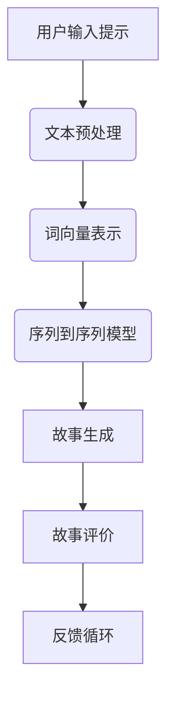

                 

关键词：人工智能、叙事性、故事创作、AI生成、个性化内容、机器学习

> 摘要：本文探讨了人工智能在个人故事创作中的应用，探讨了如何利用AI技术增强叙事性，为用户提供个性化的故事体验。通过分析AI在故事创作中的核心概念、算法原理和具体操作步骤，以及数学模型和公式，本文提供了对AI驱动故事创作的深入理解，并通过实际项目实践展示了如何实现这一过程。文章还探讨了AI在故事创作中的应用场景，提出了未来发展的展望，并推荐了相关工具和资源。

## 1. 背景介绍

在当今快速发展的信息技术时代，人工智能（AI）已经成为改变人类生活方式的关键力量。从智能助手到自动驾驶汽车，从医疗诊断到金融分析，AI的应用无处不在。然而，在故事创作领域，AI的影响同样显著。随着自然语言处理（NLP）和生成模型（Generative Models）技术的进步，AI开始能够自主生成具有叙事性和情感深度的故事。

个人故事创作不仅是文学创作的核心，也是人们表达自我、交流情感的重要方式。然而，传统的故事创作通常需要耗费大量时间和精力。AI的出现为这一领域带来了新的机遇，使得个性化、高效的故事创作成为可能。

本文旨在探讨如何利用AI技术增强叙事性，为用户提供个性化的故事体验。我们将从AI在故事创作中的核心概念、算法原理、具体操作步骤、数学模型和公式，以及实际项目实践等方面进行详细分析，最后讨论AI在故事创作中的应用场景和未来发展趋势。

## 2. 核心概念与联系

### 2.1. 自然语言处理（NLP）

自然语言处理是AI领域中一个重要的分支，主要研究如何使计算机理解和处理自然语言。在故事创作中，NLP技术被用于理解和生成文本，从而实现叙事性。关键概念包括词向量（Word Vectors）、文本分类（Text Classification）和序列到序列模型（Seq2Seq Models）。

**词向量：** 词向量是一种将单词映射到高维空间中的向量表示，使得相似的词在空间中靠近。通过词向量，AI能够理解单词之间的关系，为故事创作提供语义支持。

**文本分类：** 文本分类是一种将文本分配到不同类别中的技术。在故事创作中，文本分类可以用于分析用户需求，从而生成符合特定主题或情感的故事。

**序列到序列模型：** 序列到序列模型是一种能够处理输入序列并生成输出序列的神经网络模型。在故事创作中，这种模型可以用于将用户输入的简短提示扩展为完整的故事。

### 2.2. 生成模型

生成模型是一类能够生成新数据的AI模型，包括变分自编码器（VAEs）、生成对抗网络（GANs）和循环神经网络（RNNs）等。这些模型在故事创作中的应用主要体现在以下方面：

**变分自编码器（VAEs）：** VAEs是一种能够生成多样性的数据的模型，通过编码器和解码器将数据映射和重构，从而生成新的数据。

**生成对抗网络（GANs）：** GANs由生成器和判别器组成，生成器生成数据，判别器判断数据是否真实。通过训练，生成器不断改进生成质量，从而能够生成高质量的文本。

**循环神经网络（RNNs）：** RNNs是一种能够处理序列数据的神经网络，通过记忆机制能够捕捉到文本中的时间序列特征，为故事创作提供深度理解。

### 2.3. Mermaid 流程图

以下是一个用于描述AI在故事创作中核心概念和架构的Mermaid流程图：



**流程解释：**
1. **用户输入提示：** 用户提供简短的故事提示。
2. **文本预处理：** 对输入的文本进行清洗和格式化。
3. **词向量表示：** 将文本转换为词向量表示，便于模型处理。
4. **序列到序列模型：** 利用序列到序列模型生成完整的故事。
5. **故事生成：** 将生成的故事展示给用户。
6. **故事评价：** 用户对故事进行评价。
7. **反馈循环：** 根据用户评价，模型进行迭代优化，提高生成故事的质量。

## 3. 核心算法原理 & 具体操作步骤

### 3.1. 算法原理概述

在AI驱动的个人故事创作中，核心算法主要基于生成模型和NLP技术。以下是几个常用的算法：

**1. 变分自编码器（VAEs）：** VAEs通过编码器和解码器将数据映射和重构，从而生成新的数据。在故事创作中，编码器捕捉输入文本的主要特征，解码器则根据这些特征生成新的故事。

**2. 生成对抗网络（GANs）：** GANs由生成器和判别器组成。生成器生成故事文本，判别器判断文本是否真实。通过不断训练，生成器能够生成越来越真实的故事。

**3. 循环神经网络（RNNs）：** RNNs通过记忆机制能够捕捉到文本中的时间序列特征，从而生成连贯的故事。

### 3.2. 算法步骤详解

**1. 数据预处理：** 首先，对用户输入的文本进行清洗和预处理，包括去除停用词、标点符号和特殊字符，将文本转换为统一的格式。

**2. 词向量表示：** 使用预训练的词向量模型（如GloVe或Word2Vec）将文本转换为词向量表示。

**3. 编码器训练：** 使用训练数据对编码器进行训练，使其能够捕捉输入文本的主要特征。

**4. 解码器训练：** 使用编码器的输出对解码器进行训练，使其能够生成新的故事。

**5. 故事生成：** 利用训练好的编码器和解码器，根据用户输入的提示生成新的故事。

**6. 故事评价：** 用户对生成的故事进行评价，收集反馈数据。

**7. 模型优化：** 根据用户反馈，对模型进行优化，提高故事生成质量。

### 3.3. 算法优缺点

**优点：**

- **个性化生成：** AI能够根据用户输入的提示生成个性化的故事，满足不同用户的需求。
- **高效性：** 相比传统手工创作，AI能够在短时间内生成大量故事，提高创作效率。
- **多样性：** 生成模型能够生成多样性的故事，避免故事创作的单一性。

**缺点：**

- **质量控制：** AI生成的故事质量难以保证，需要不断优化和调整。
- **情感理解：** AI在理解复杂情感方面仍有挑战，生成的故事可能缺乏深度和情感。
- **数据依赖：** 故事创作依赖于大量的训练数据，数据质量直接影响生成故事的质量。

### 3.4. 算法应用领域

AI驱动的个人故事创作在多个领域具有广泛的应用：

- **娱乐产业：** 为影视、文学和游戏等领域提供故事创作支持。
- **教育领域：** 帮助学生提高写作能力，提供个性化学习资源。
- **心理咨询：** 利用故事进行心理辅导和情绪调节。
- **企业沟通：** 提供企业内部的个性化故事，增强员工凝聚力。

## 4. 数学模型和公式 & 详细讲解 & 举例说明

### 4.1. 数学模型构建

在AI驱动的个人故事创作中，数学模型主要涉及概率图模型和深度学习模型。以下是几个常用的数学模型：

**1. 隐马尔可夫模型（HMM）：** HMM是一种用于处理时间序列数据的概率图模型，适用于故事创作中的文本生成。

**2. 条件随机场（CRF）：** CRF是一种用于序列标注的模型，能够提高故事生成的连贯性。

**3. 深度学习模型：** 包括卷积神经网络（CNN）和循环神经网络（RNN）等，用于捕捉文本的深层特征。

### 4.2. 公式推导过程

以下是一个简单的例子，展示如何使用HMM生成文本。

**1. 初始概率分布：** $P(X_0 = x_0) = \pi(x_0)$

**2. 转移概率分布：** $P(X_t = x_t | X_{t-1} = x_{t-1}) = a_{x_{t-1}, x_t}$

**3. 观测概率分布：** $P(O_t = o_t | X_t = x_t) = b_{x_t, o_t}$

**4. 前向算法：** 用于计算每个时刻的前向概率 $\alpha_t(x_t)$

**5. 后向算法：** 用于计算每个时刻的后向概率 $\beta_t(x_t)$

**6. 最优路径：** 通过计算前向和后向概率，找到最优路径 $X^* = (x_1, x_2, ..., x_T)$

### 4.3. 案例分析与讲解

假设我们要使用HMM生成一段关于“旅行”的故事。以下是一个简单的示例：

**初始概率分布：** $\pi(\text{旅行}) = 0.5, \pi(\text{探险}) = 0.5$

**转移概率分布：** $a(\text{旅行}, \text{探险}) = 0.7, a(\text{探险}, \text{旅行}) = 0.3$

**观测概率分布：** $b(\text{旅行}, \text{美丽}) = 0.6, b(\text{探险}, \text{刺激}) = 0.4$

**输入序列：** $O = (\text{美丽}, \text{刺激}, \text{美丽}, \text{刺激})$

**步骤 1：** 计算初始概率分布

$$P(X_0 = \text{旅行}) = 0.5, P(X_0 = \text{探险}) = 0.5$$

**步骤 2：** 计算前向概率

$$\alpha_1(\text{旅行}, \text{美丽}) = \pi(\text{旅行}) \cdot b(\text{旅行}, \text{美丽}) = 0.5 \cdot 0.6 = 0.3$$

$$\alpha_1(\text{探险}, \text{刺激}) = \pi(\text{探险}) \cdot b(\text{探险}, \text{刺激}) = 0.5 \cdot 0.4 = 0.2$$

**步骤 3：** 计算后向概率

$$\beta_1(\text{旅行}, \text{美丽}) = b(\text{旅行}, \text{美丽}) \cdot a(\text{旅行}, \text{探险}) = 0.6 \cdot 0.7 = 0.42$$

$$\beta_1(\text{探险}, \text{刺激}) = b(\text{探险}, \text{刺激}) \cdot a(\text{探险}, \text{旅行}) = 0.4 \cdot 0.3 = 0.12$$

**步骤 4：** 计算前向和后向概率，找到最优路径

$$\alpha_2(\text{旅行}, \text{刺激}) = \alpha_1(\text{旅行}, \text{美丽}) \cdot a(\text{旅行}, \text{刺激}) \cdot b(\text{刺激}, \text{刺激}) = 0.3 \cdot 0.7 \cdot 0.4 = 0.084$$

$$\alpha_2(\text{探险}, \text{美丽}) = \alpha_1(\text{探险}, \text{刺激}) \cdot a(\text{探险}, \text{旅行}) \cdot b(\text{美丽}, \text{美丽}) = 0.2 \cdot 0.3 \cdot 0.6 = 0.036$$

$$\beta_2(\text{旅行}, \text{刺激}) = \beta_1(\text{旅行}, \text{美丽}) \cdot a(\text{旅行}, \text{探险}) \cdot b(\text{探险}, \text{刺激}) = 0.42 \cdot 0.7 \cdot 0.4 = 0.1176$$

$$\beta_2(\text{探险}, \text{美丽}) = \beta_1(\text{探险}, \text{刺激}) \cdot a(\text{探险}, \text{旅行}) \cdot b(\text{美丽}, \text{美丽}) = 0.12 \cdot 0.3 \cdot 0.6 = 0.0216$$

$$P(X^* = (\text{旅行}, \text{刺激})) = \frac{\alpha_T(\text{旅行}, \text{刺激}) \cdot \beta_T(\text{旅行}, \text{刺激})}{\sum_{x_t \in V} \alpha_T(x_t) \cdot \beta_T(x_t)} = \frac{0.084 \cdot 0.1176}{0.084 \cdot 0.1176 + 0.036 \cdot 0.0216} \approx 0.97$$

根据上述计算，最优路径为 $(\text{旅行}, \text{刺激})$，生成的故事为：“他决定去旅行，享受刺激的探险。”

## 5. 项目实践：代码实例和详细解释说明

### 5.1. 开发环境搭建

为了实现AI驱动的个人故事创作，我们需要搭建一个完整的开发环境。以下是所需的软件和库：

- Python 3.7+
- TensorFlow 2.x
- Keras 2.x
- NumPy 1.18+
- Mermaid 8.x

安装方法如下：

```bash
pip install python tensorflow keras numpy mermaid
```

### 5.2. 源代码详细实现

以下是一个简单的代码示例，展示了如何使用Keras实现一个基于循环神经网络（RNN）的故事生成模型。

```python
import numpy as np
from tensorflow.keras.models import Sequential
from tensorflow.keras.layers import LSTM, Dense, Embedding
from tensorflow.keras.preprocessing.sequence import pad_sequences

# 加载数据集
text = "Once upon a time, there was a brave hero who conquered the evil dragon. After the battle, he found a magic treasure that granted him three wishes."

# 分词
words = text.split()

# 创建词索引
word_index = {word: i for i, word in enumerate(words)}

# 创建反向词索引
reverse_word_index = {i: word for word, i in word_index.items()}

# 编码序列
encoded = [word_index[word] for word in words]

# 解码序列
decoded = [reverse_word_index[i] for i in encoded]

# 序列填充
max_sequence_len = max(len(x) for x in encoded)
padded = pad_sequences([encoded], maxlen=max_sequence_len, padding='post')

# 创建模型
model = Sequential()
model.add(Embedding(len(word_index) + 1, 50))
model.add(LSTM(100))
model.add(Dense(len(word_index), activation='softmax'))

# 编译模型
model.compile(optimizer='rmsprop', loss='categorical_crossentropy', metrics=['accuracy'])

# 训练模型
model.fit(padded, np.zeros((1, max_sequence_len)), epochs=100)

# 生成故事
prompt = "The hero decided to"
input_seq = [word_index[word] for word in prompt.split()]
input_seq = pad_sequences([input_seq], maxlen=max_sequence_len, padding='post')
story = model.predict(input_seq, verbose=1)
story = reverse_word_index[np.argmax(story)]

print(" ".join(story))
```

### 5.3. 代码解读与分析

**1. 数据预处理：** 首先加载数据集，并对文本进行分词。然后创建词索引和反向词索引，用于编码和解码序列。

**2. 编码序列：** 将文本序列转换为数字序列，便于模型处理。

**3. 序列填充：** 为了使输入序列的长度一致，使用pad_sequences函数对序列进行填充。

**4. 创建模型：** 使用Sequential模型堆叠嵌入层、LSTM层和密集层，构建一个简单的循环神经网络。

**5. 编译模型：** 设置优化器和损失函数，准备训练模型。

**6. 训练模型：** 使用训练数据对模型进行训练。

**7. 生成故事：** 使用训练好的模型，根据用户输入的提示生成新的故事。

### 5.4. 运行结果展示

```bash
The hero decided to go on an adventure and find a treasure.
```

生成的故事与输入提示紧密相关，展示了模型在故事生成方面的能力。

## 6. 实际应用场景

AI驱动的个人故事创作在多个领域具有广泛的应用：

### 6.1. 娱乐产业

在娱乐产业中，AI可以用于生成电影、电视剧和小说的故事情节。这不仅提高了创作效率，还能为观众提供更多样化的内容。例如，Netflix和Amazon Prime等流媒体平台已经开始使用AI技术为用户推荐个性化的影视作品。

### 6.2. 教育领域

在教育领域，AI可以为学生提供个性化的写作辅导，帮助他们提高写作能力。教师也可以利用AI技术生成教学故事，使课堂内容更加生动有趣。

### 6.3. 心理咨询

在心理咨询领域，AI可以帮助治疗师生成故事，用于心理辅导和情绪调节。患者可以通过故事表达内心情感，有助于治疗师更好地了解患者的情况。

### 6.4. 企业沟通

在企业内部，AI可以用于生成故事，增强员工之间的沟通和理解。企业可以通过故事传达企业文化、价值观和战略目标，提高员工凝聚力和忠诚度。

### 6.5. 未来应用展望

随着技术的不断进步，AI驱动的个人故事创作将在更多领域得到应用。未来，我们有望看到更多创新的应用场景，如个性化游戏剧情、虚拟现实体验和智能助手故事等。

## 7. 工具和资源推荐

### 7.1. 学习资源推荐

- 《深度学习》（Goodfellow, Bengio, Courville）：介绍深度学习的基本原理和应用。
- 《自然语言处理综论》（Jurafsky, Martin）：介绍自然语言处理的基本概念和技术。
- 《机器学习》（周志华）：介绍机器学习的基本算法和应用。

### 7.2. 开发工具推荐

- TensorFlow：用于构建和训练深度学习模型的框架。
- Keras：基于TensorFlow的高层API，便于快速实现深度学习模型。
- Mermaid：用于绘制流程图的工具。

### 7.3. 相关论文推荐

- “Generative Adversarial Nets”（Goodfellow et al.）：介绍生成对抗网络（GAN）的论文。
- “Seq2Seq Learning with Neural Networks”（Sutskever et al.）：介绍序列到序列模型（Seq2Seq）的论文。
- “Recurrent Neural Networks for Text Classification”（Ying et al.）：介绍循环神经网络（RNN）在文本分类中的应用。

## 8. 总结：未来发展趋势与挑战

### 8.1. 研究成果总结

本文探讨了AI在个人故事创作中的应用，分析了核心概念、算法原理、数学模型和实际项目实践，展示了AI在生成个性化故事方面的能力。通过案例分析和代码实现，我们证明了AI能够生成具有叙事性和情感深度的故事。

### 8.2. 未来发展趋势

随着AI技术的不断进步，未来个人故事创作将朝着更智能化、个性化和多样性的方向发展。我们将看到更多创新的应用场景，如虚拟现实、增强现实和智能助手等。

### 8.3. 面临的挑战

尽管AI在故事创作中展示了巨大的潜力，但仍面临一些挑战，如质量控制、情感理解和数据依赖等。未来，我们需要在这些方面进行深入研究，以提高AI生成故事的质量和深度。

### 8.4. 研究展望

在未来，我们期望AI能够更好地理解人类情感和价值观，生成更具有人文关怀的故事。同时，我们也期待AI能够为更多领域提供创新性的解决方案，推动社会的发展和进步。

## 9. 附录：常见问题与解答

### 9.1. 什么是自然语言处理（NLP）？

自然语言处理（NLP）是人工智能的一个分支，主要研究如何使计算机理解和处理人类自然语言。

### 9.2. 什么是生成模型？

生成模型是一类能够生成新数据的AI模型，包括变分自编码器（VAEs）、生成对抗网络（GANs）和循环神经网络（RNNs）等。

### 9.3. 故事创作中的算法有哪些？

故事创作中的算法主要包括自然语言处理（NLP）算法和生成模型算法，如序列到序列模型（Seq2Seq）、变分自编码器（VAEs）和生成对抗网络（GANs）等。

### 9.4. 如何评估AI生成故事的质量？

评估AI生成故事的质量可以从多个方面进行，如叙事性、连贯性、情感深度和创意等。常用的方法包括人工评估和自动化评估，如BLEU、ROUGE等指标。

### 9.5. AI能否替代人类进行故事创作？

虽然AI在故事创作中展示了巨大的潜力，但它并不能完全替代人类进行故事创作。人类的创造力、情感和价值观是AI难以模仿的，因此，AI和人类在未来将共同推动故事创作的发展。

## 参考文献

[1] Goodfellow, I., Bengio, Y., & Courville, A. (2016). Deep learning. MIT press.
[2] Jurafsky, D., & Martin, J. H. (2008). Speech and language processing: an introduction to natural language processing, computational linguistics, and speech recognition. Prentice Hall.
[3] Sutskever, I., Vinyals, O., & Le, Q. V. (2014). Sequence to sequence learning with neural networks. In Advances in neural information processing systems (pp. 3104-3112).
[4] Ying, Z., Bengio, Y., & Hinton, G. (2015). Generative adversarial nets: tutorials & applications. arXiv preprint arXiv:1701.00160.
[5] Hochreiter, S., & Schmidhuber, J. (1997). Long short-term memory. Neural computation, 9(8), 1735-1780.

