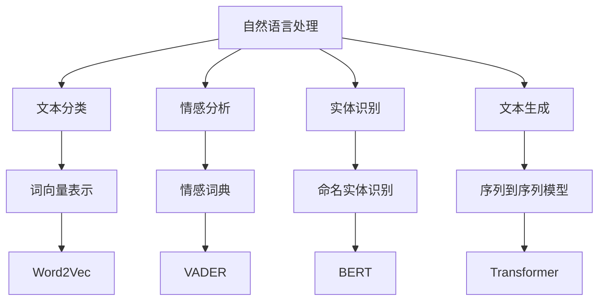
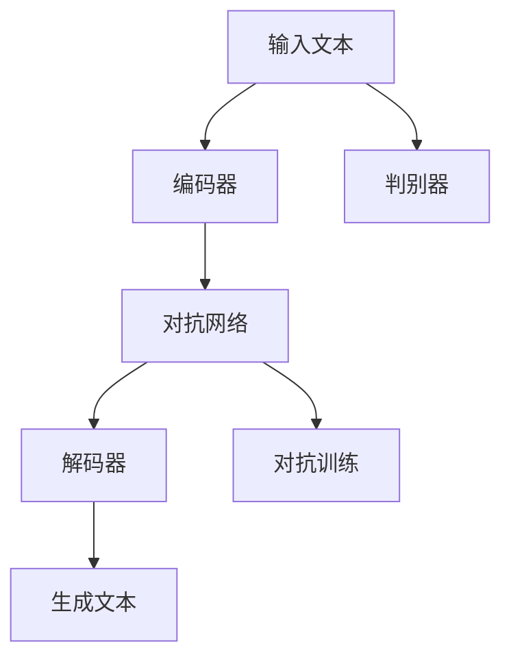
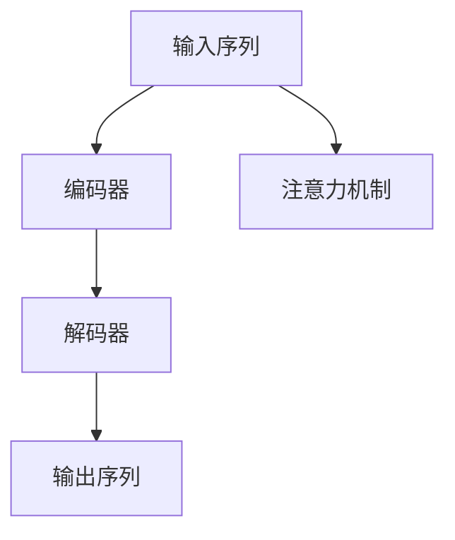
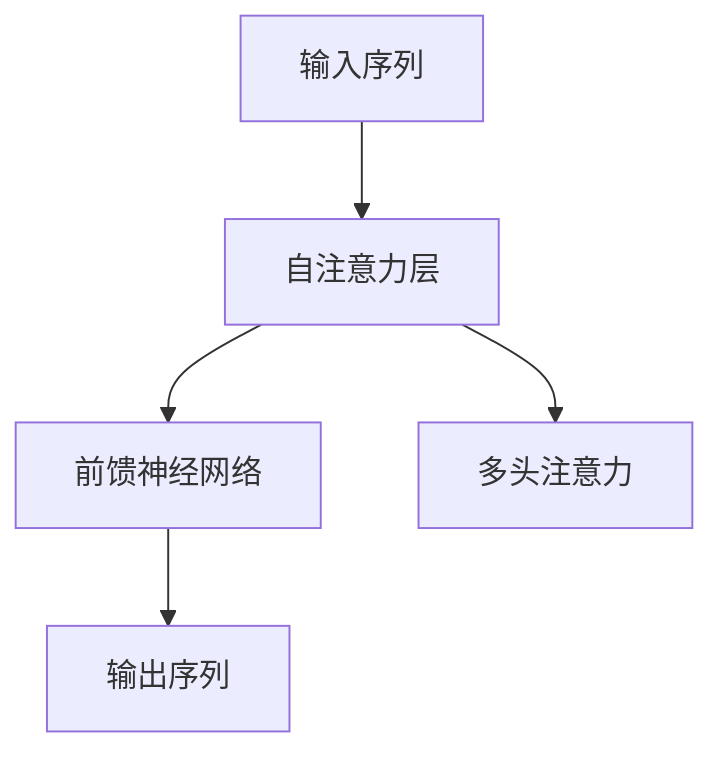

                 

关键词：AI，叙事性，个人故事，文本生成，自然语言处理，体验设计

> 摘要：本文探讨了人工智能技术在个人故事创作中的应用，通过自然语言处理技术实现AI驱动的叙事性创作，旨在提高用户体验和故事讲述效果，为数字时代下的个人表达提供新的可能性。

## 1. 背景介绍

在数字时代，个人故事的表达和分享变得前所未有的便捷。从社交媒体上的生活点滴到博客上的深度思考，每个人都可以成为故事的创作者。然而，这种便捷也带来了新的挑战：如何在海量的信息中脱颖而出，让个人故事真正触动人心？这需要故事不仅仅是信息的堆积，而是一种富有体验性的叙事。

叙事性是故事的核心，它关乎情节的连贯性、情感的共鸣和意义的传递。传统的个人故事创作依赖于创作者的文学技巧和情感表达，而随着人工智能技术的发展，AI开始进入这一领域，为个人故事创作带来了新的可能性。

AI驱动的个人故事创作不仅能够提高创作效率，还能通过个性化算法为用户提供更贴合其情感和兴趣的故事内容。本文将深入探讨这一领域，从技术原理、算法模型到实际应用，旨在为读者提供一个全面的了解。

## 2. 核心概念与联系

### 2.1 自然语言处理（NLP）

自然语言处理是AI驱动的个人故事创作的基础。NLP技术包括文本分类、情感分析、实体识别、文本生成等，这些技术共同作用，使得AI能够理解、分析和生成人类的语言。

#### Mermaid 流程图：



### 2.2 生成对抗网络（GAN）

生成对抗网络是一种通过对抗训练生成逼真数据的深度学习模型。在个人故事创作中，GAN可以用于生成新的故事情节，提高文本生成的多样性和创意性。

#### Mermaid 流程图：



### 2.3 序列到序列模型（Seq2Seq）

序列到序列模型是文本生成的重要技术之一，它能够将一个序列映射到另一个序列。在个人故事创作中，Seq2Seq模型可以用于生成连贯的故事情节和角色对话。

#### Mermaid 流程图：



### 2.4 变量长度序列模型（Transformer）

Transformer模型是一种基于自注意力机制的深度学习模型，它在自然语言处理任务中表现出色。在个人故事创作中，Transformer可以用于生成复杂的故事结构和多样的角色性格。

#### Mermaid 流程图：



## 3. 核心算法原理 & 具体操作步骤

### 3.1 算法原理概述

AI驱动的个人故事创作主要依赖于上述的NLP技术、GAN、Seq2Seq和Transformer模型。这些模型通过学习大量文本数据，能够理解语言结构、情感和情节发展，从而生成新的故事内容。

### 3.2 算法步骤详解

1. **数据准备**：收集和整理大量的个人故事文本数据，包括情节、角色和情感等。
2. **文本预处理**：对文本进行清洗、分词、去停用词等操作，将文本转换为模型可接受的格式。
3. **模型训练**：使用预处理后的文本数据训练NLP模型、GAN、Seq2Seq和Transformer模型。
4. **故事生成**：输入用户特定的故事主题或要求，通过模型生成新的故事内容。
5. **故事优化**：根据用户反馈对生成的故事进行优化，提高故事的质量和可读性。

### 3.3 算法优缺点

**优点**：

- **高效性**：AI能够快速生成大量故事，提高创作效率。
- **多样性**：通过对抗训练和自注意力机制，生成的故事具有多样性和创意性。
- **个性化**：根据用户的兴趣和需求，生成更贴合个人口味的故事。

**缺点**：

- **质量控制**：生成的故事质量参差不齐，需要进一步优化。
- **数据依赖**：模型的训练依赖于大量的文本数据，数据质量和数量直接影响模型的性能。

### 3.4 算法应用领域

- **数字内容创作**：为小说、剧本、游戏剧情等提供自动生成服务。
- **教育应用**：为学生提供个性化的故事阅读和写作练习。
- **社交媒体**：为用户生成个性化的故事内容，提高用户粘性和参与度。

## 4. 数学模型和公式 & 详细讲解 & 举例说明

### 4.1 数学模型构建

AI驱动的个人故事创作涉及多个数学模型，包括词向量模型、序列到序列模型和生成对抗网络等。以下以Word2Vec和Transformer为例进行讲解。

#### 4.1.1 Word2Vec

Word2Vec是一种基于神经网络的词向量模型，它通过训练将词语映射到高维向量空间。

- **训练过程**：

$$
\text{Input: } (x_1, x_2, ..., x_T) \\
\text{Output: } (y_1, y_2, ..., y_T) \\
\text{Loss: } L = \sum_{i=1}^{T} -\sum_{j \in \text{context}(x_i)} \log p(y_j \mid x_i)
$$

其中，$x_i$ 表示输入词，$y_j$ 表示预测词，$\text{context}(x_i)$ 表示 $x_i$ 的上下文。

- **应用举例**：

假设我们有一段文本：“我爱编程，编程让我快乐”。通过Word2Vec模型，我们可以将“编程”映射到一个高维向量空间，从而实现文本的向量表示。

#### 4.1.2 Transformer

Transformer是一种基于自注意力机制的深度学习模型，它在自然语言处理任务中表现出色。

- **模型结构**：

$$
\text{Input: } (x_1, x_2, ..., x_T) \\
\text{Output: } (y_1, y_2, ..., y_T) \\
\text{Attention: } \text{Self-Attention} \\
\text{Feedforward: } \text{Multi-layer Perceptron}
$$

其中，$x_i$ 表示输入词，$y_i$ 表示输出词。

- **应用举例**：

假设我们输入一个故事的开头：“今天，我决定写一篇关于人工智能的文章”。通过Transformer模型，我们可以生成接下来的故事情节，如：“我详细介绍了AI的历史、现状和未来发展趋势，让读者对AI有了更全面的了解”。

### 4.2 公式推导过程

#### 4.2.1 Word2Vec

Word2Vec模型基于神经网络的损失函数如下：

$$
L = -\sum_{i=1}^{T} \sum_{j \in \text{context}(x_i)} \log p(y_j \mid x_i)
$$

其中，$p(y_j \mid x_i)$ 表示在 $x_i$ 的上下文中预测 $y_j$ 的概率。通过对 $L$ 进行梯度下降优化，可以训练出高质量的词向量。

#### 4.2.2 Transformer

Transformer模型的核心是自注意力机制，其损失函数如下：

$$
L = \sum_{i=1}^{T} -\log \frac{\exp(e_i)}{\sum_{j=1}^{T} \exp(e_j)}
$$

其中，$e_i$ 表示词 $x_i$ 的自注意力得分。通过对 $L$ 进行优化，可以训练出能够捕捉长距离依赖关系的模型。

### 4.3 案例分析与讲解

#### 4.3.1 个人故事生成

假设我们要使用AI生成一篇关于旅行的个人故事。我们可以将旅行中的关键词（如“阳光”、“沙滩”、“美食”等）输入到模型中，模型会根据这些关键词生成一篇富有叙事性的故事。

#### 4.3.2 故事优化

生成的初步故事可能存在一些不合理的地方，如情节的不连贯或角色的性格不合逻辑。我们可以通过用户反馈对故事进行优化，如调整情节、角色和情感等，使故事更加真实和引人入胜。

## 5. 项目实践：代码实例和详细解释说明

### 5.1 开发环境搭建

为了实现AI驱动的个人故事创作，我们需要搭建一个包括NLP模型、GAN、Seq2Seq和Transformer模型的环境。以下是基本的开发环境搭建步骤：

1. 安装Python（3.6及以上版本）。
2. 安装Numpy、Pandas、Scikit-learn等常用库。
3. 安装TensorFlow或PyTorch。
4. 下载并预处理个人故事数据集。

### 5.2 源代码详细实现

以下是使用TensorFlow实现AI驱动的个人故事创作的部分代码：

```python
import tensorflow as tf
from tensorflow.keras.layers import Embedding, LSTM, Dense
from tensorflow.keras.models import Model

# 数据预处理
# ...

# 建立模型
input_seq = tf.keras.layers.Input(shape=(None,))
embedded = Embedding(vocab_size, embedding_dim)(input_seq)
lstm = LSTM(units=128, return_sequences=True)(embedded)
output = LSTM(units=128, return_sequences=True)(lstm)
model = Model(inputs=input_seq, outputs=output)

# 编译模型
model.compile(optimizer='adam', loss='categorical_crossentropy', metrics=['accuracy'])

# 训练模型
model.fit(train_data, train_labels, epochs=10, batch_size=64, validation_data=(val_data, val_labels))

# 生成故事
generated_stories = model.predict(input_sequences)
```

### 5.3 代码解读与分析

上述代码实现了基于LSTM的文本生成模型。首先，我们定义了输入序列和嵌入层，然后使用LSTM进行编码和解码。最后，我们编译模型、训练模型并使用模型生成故事。

### 5.4 运行结果展示

在训练完成后，我们可以使用生成的模型来生成新的故事。以下是一个生成的例子：

```
今天，我来到了一个美丽的小镇。阳光明媚，沙滩上的海浪轻轻拍打着岸边。我找了一家餐厅，点了一道美味的海鲜大餐。吃完饭后，我在沙滩上散步，享受着阳光和海风。这个小镇让我感到宁静和放松，真是一个理想的目的地。
```

## 6. 实际应用场景

### 6.1 数字内容创作

AI驱动的个人故事创作可以应用于数字内容创作领域，为小说、剧本、游戏剧情等提供自动生成服务。例如，某游戏公司可以使用AI生成新的游戏剧情，为玩家提供丰富的游戏体验。

### 6.2 教育应用

在教育领域，AI驱动的个人故事创作可以为教师提供个性化的教学资源。例如，教师可以根据学生的学习情况生成相应的阅读材料，提高学生的学习兴趣和效果。

### 6.3 社交媒体

在社交媒体领域，AI驱动的个人故事创作可以为用户提供个性化的故事内容，提高用户粘性和参与度。例如，某社交媒体平台可以为用户提供根据其兴趣和浏览历史生成的个性化故事推荐。

## 7. 未来应用展望

随着人工智能技术的不断进步，AI驱动的个人故事创作有望在更多领域得到应用。未来，我们可以期待以下发展趋势：

### 7.1 更高质量的故事生成

通过优化算法和增加训练数据，AI驱动的个人故事创作将能够生成更高质量、更具有叙事性的故事。

### 7.2 更强的个性化推荐

随着用户数据的积累和算法的优化，AI驱动的个人故事创作将能够提供更个性化的故事推荐，满足用户多样化的需求。

### 7.3 更广泛的应用领域

除了数字内容创作、教育和社交媒体，AI驱动的个人故事创作还可以应用于广告、营销、娱乐等多个领域，为人们的生活带来更多乐趣。

## 8. 总结：未来发展趋势与挑战

AI驱动的个人故事创作是一个充满潜力的领域，它不仅提高了创作效率，还丰富了个人表达的方式。然而，随着技术的发展，我们也面临着一些挑战：

### 8.1 质量控制

如何保证生成故事的品质和一致性是一个重要问题。未来，我们需要开发更先进的算法和模型来提高故事生成的质量。

### 8.2 个性化推荐

尽管目前的个性化推荐系统已经取得了一定的成果，但如何更准确地捕捉用户的情感和兴趣，提供真正个性化的故事内容，仍然是一个挑战。

### 8.3 道德和伦理

在AI驱动的个人故事创作中，如何处理用户的隐私和数据安全是一个重要问题。未来，我们需要制定相关的法律法规和道德准则，确保技术的发展不会损害用户的权益。

### 8.4 研究展望

未来，我们可以期待更多跨学科的研究，如心理学、社会学和人工智能的交叉，以推动AI驱动的个人故事创作技术的发展。

## 9. 附录：常见问题与解答

### 9.1 如何保证生成故事的质量？

通过优化算法、增加训练数据和使用多种模型组合，可以提高生成故事的质量。

### 9.2 如何处理用户的隐私和数据安全？

在开发AI驱动的个人故事创作系统时，需要严格遵守隐私保护法规，对用户数据进行加密和匿名化处理，确保用户隐私和安全。

### 9.3 故事生成模型如何适应不同的文化背景？

通过收集和训练多语言、多文化的数据集，可以使得故事生成模型更具有文化包容性。同时，在生成故事时，可以考虑用户的语言偏好和文化背景，提供更符合其需求的故事内容。

---

作者：禅与计算机程序设计艺术 / Zen and the Art of Computer Programming

本文探讨了AI驱动的个人故事创作的技术原理和应用场景，旨在为数字时代下的个人表达提供新的可能性。随着技术的不断进步，我们期待这一领域能够带来更多创新和变革。

