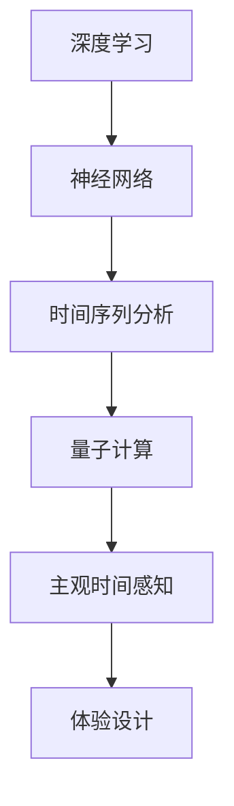

                 

关键词：人工智能，时间扭曲，主观时间，神经网络，深度学习，量子计算，图灵机

> 摘要：随着人工智能技术的迅猛发展，人类对时间的感知和理解正经历一场革命。本文将探讨人工智能如何通过深度学习和量子计算等技术手段，创造出一个全新的、主观的时间体验，并对其背后的原理、算法和应用进行深入分析。我们将从背景介绍、核心概念、算法原理、数学模型、项目实践、实际应用和未来展望等方面，全面揭示AI创造的主观时间的奥秘。

## 1. 背景介绍

时间的概念自古以来就是人类探索的终极问题之一。从哲学到物理，从宗教到科学，时间一直是人类思考和研究的对象。然而，随着人工智能（AI）技术的不断发展，时间似乎正以全新的方式展现在我们面前。人工智能通过深度学习、量子计算等前沿技术，正在重新定义我们对于时间的认知和体验。

在过去的几十年中，人工智能经历了从弱AI到强AI的转变。弱AI主要应用于特定的任务和领域，如语音识别、图像处理等；而强AI则试图模拟人类智能，实现通用智能。随着深度学习的兴起，神经网络在AI领域的应用达到了前所未有的高度，这使得AI在处理复杂问题时展现出强大的能力。

与此同时，量子计算作为下一代计算技术，正在逐步从理论走向实践。量子计算通过利用量子叠加态和纠缠态，实现了超乎传统计算机的计算能力。这使得在处理大量数据和复杂算法时，量子计算机展现出了巨大的潜力。

这些技术的发展，使得人工智能在时间感知和处理方面取得了重要突破。本文将深入探讨AI如何创造出一个全新的、主观的时间体验，并分析这一体验背后的技术原理和应用场景。

## 2. 核心概念与联系

要理解AI创造的主观时间，首先需要了解一些核心概念和技术。以下是本文中涉及的核心概念及其相互关系，我们将使用Mermaid流程图来展示这些概念之间的关系。



### 2.1 深度学习与神经网络

深度学习是人工智能的一个重要分支，其核心是神经网络。神经网络通过模拟人脑的结构和工作原理，实现了对复杂数据的处理和分析。在深度学习中，神经网络通过多层非线性变换，逐层提取数据特征，最终实现高层次的抽象表示。

### 2.2 时间序列分析与神经网络

时间序列分析是处理时间序列数据的方法，广泛应用于金融、气象、生物等领域。神经网络在时间序列分析中具有天然的优势，通过学习时间序列数据中的规律和模式，神经网络可以预测未来的趋势和变化。

### 2.3 量子计算与神经网络

量子计算是一种基于量子力学原理的全新计算方式。量子计算机通过利用量子叠加态和纠缠态，实现了对传统计算机无法处理的复杂问题的求解。量子计算与神经网络结合，可以在时间感知和处理方面取得重大突破。

### 2.4 主观时间感知与体验设计

主观时间感知是人们对于时间的个人感受和体验。体验设计则是在产品和服务中，通过设计创造出一种符合用户需求和心理预期的用户体验。AI创造的主观时间体验，是通过深度学习和量子计算等技术，对用户的时间感知进行个性化设计和优化。

## 3. 核心算法原理 & 具体操作步骤

### 3.1 算法原理概述

AI创造的主观时间体验的核心算法主要包括深度学习、时间序列分析和量子计算。以下是这些算法的基本原理和操作步骤：

### 3.1.1 深度学习

深度学习算法通过多层神经网络对时间序列数据进行建模，逐层提取数据特征。具体步骤如下：

1. 数据预处理：对时间序列数据进行标准化和归一化处理，使其符合神经网络输入的要求。
2. 网络架构设计：根据时间序列数据的特征和需求，设计合适的神经网络架构，如循环神经网络（RNN）、长短期记忆网络（LSTM）等。
3. 模型训练：使用大量时间序列数据对神经网络进行训练，优化网络参数。
4. 模型评估与优化：通过交叉验证和性能评估，优化神经网络模型。

### 3.1.2 时间序列分析

时间序列分析算法通过对时间序列数据进行建模和分析，提取时间序列中的规律和模式。具体步骤如下：

1. 数据预处理：对时间序列数据进行清洗、去噪和处理，提取出有用的特征。
2. 模型选择：根据时间序列数据的特征和需求，选择合适的模型，如自回归模型（AR）、移动平均模型（MA）等。
3. 模型训练与优化：使用训练数据对模型进行训练，优化模型参数。
4. 模型评估与预测：通过交叉验证和性能评估，对模型进行评估，并使用模型进行时间序列预测。

### 3.1.3 量子计算

量子计算算法利用量子叠加态和纠缠态，实现了对传统计算机无法处理的复杂问题的求解。具体步骤如下：

1. 量子态编码：将输入数据编码为量子态，如使用量子比特表示数字。
2. 量子操作：对量子态进行一系列量子操作，如叠加、纠缠等。
3. 量子测量：对量子态进行测量，得到计算结果。
4. 量子纠错：对量子计算过程中可能出现的错误进行纠正，确保计算结果的准确性。

### 3.2 算法步骤详解

下面我们将详细解释这些算法的具体步骤，以便读者更好地理解AI创造的主观时间体验的实现过程。

### 3.2.1 深度学习算法步骤

1. 数据预处理：
   - 数据清洗：去除数据中的噪声和异常值，保证数据质量。
   - 数据标准化：将时间序列数据缩放到相同的范围，便于神经网络训练。
   - 数据归一化：将时间序列数据转换为标准的正态分布，提高神经网络训练的稳定性。

2. 网络架构设计：
   - 选择合适的神经网络架构，如RNN、LSTM等，根据时间序列数据的特征进行设计。
   - 确定网络的输入层、隐藏层和输出层的结构，包括神经元的数量和激活函数的选择。

3. 模型训练：
   - 使用训练数据对神经网络进行训练，调整网络参数，使其对时间序列数据进行建模。
   - 使用反向传播算法，根据训练数据计算网络参数的梯度，优化网络性能。

4. 模型评估与优化：
   - 通过交叉验证方法，对训练好的模型进行评估，确保模型的泛化能力。
   - 使用性能评估指标，如均方误差（MSE）、平均绝对误差（MAE）等，对模型进行优化。

### 3.2.2 时间序列分析算法步骤

1. 数据预处理：
   - 数据清洗：去除数据中的噪声和异常值，保证数据质量。
   - 数据平滑：使用移动平均、指数平滑等方法，减少数据中的波动和噪声。

2. 模型选择：
   - 根据时间序列数据的特征和需求，选择合适的模型，如AR、MA、ARMA等。
   - 分析模型的预测性能，选择最优模型。

3. 模型训练与优化：
   - 使用训练数据对模型进行训练，调整模型参数，使其对时间序列数据进行建模。
   - 使用优化算法，如梯度下降、牛顿法等，优化模型参数。

4. 模型评估与预测：
   - 通过交叉验证方法，对训练好的模型进行评估，确保模型的泛化能力。
   - 使用模型对时间序列数据进行预测，生成未来趋势和变化。

### 3.2.3 量子计算算法步骤

1. 量子态编码：
   - 将输入数据编码为量子态，如使用量子比特表示数字。
   - 选择合适的量子编码方法，如量子比特编码、量子位编码等。

2. 量子操作：
   - 对量子态进行一系列量子操作，如叠加、纠缠等。
   - 使用量子门实现复杂的量子算法，如量子随机 walks、量子Fourier变换等。

3. 量子测量：
   - 对量子态进行测量，得到计算结果。
   - 选择合适的测量方案，如量子测量最大化、量子态投影等。

4. 量子纠错：
   - 对量子计算过程中可能出现的错误进行纠正，确保计算结果的准确性。
   - 使用量子纠错码、量子纠错算法等，降低计算错误率。

### 3.3 算法优缺点

深度学习、时间序列分析和量子计算算法各有优缺点，下面我们对其进行分析。

#### 深度学习

- 优点：
  - 强大的特征提取能力：通过多层神经网络，可以自动提取时间序列数据中的复杂特征。
  - 高效的建模能力：可以处理大规模时间序列数据，提高预测性能。
  - 广泛的应用场景：适用于各种时间序列分析和预测任务。

- 缺点：
  - 计算资源需求大：深度学习算法需要大量的计算资源和时间，对硬件要求较高。
  - 难以解释：深度学习模型的内部结构复杂，难以解释和可视化。

#### 时间序列分析

- 优点：
  - 简单易用：时间序列分析算法相对简单，易于理解和实现。
  - 稳定的预测性能：时间序列分析模型在预测时间序列趋势和变化方面具有稳定的性能。
  - 适用于各种时间序列数据：时间序列分析算法可以处理不同类型的时间序列数据。

- 缺点：
  - 特征提取能力有限：时间序列分析算法通常只能提取低层次的特征，难以提取高层次的抽象特征。
  - 适应性较差：时间序列分析模型对数据的依赖性较强，难以适应数据的变换和噪声。

#### 量子计算

- 优点：
  - 极高的计算速度：量子计算可以实现超乎传统计算机的计算速度，特别是在处理复杂问题时具有显著优势。
  - 广泛的应用前景：量子计算在密码学、量子模拟、量子优化等领域具有广泛的应用前景。

- 缺点：
  - 技术难度高：量子计算涉及复杂的量子物理原理，技术实现难度较大。
  - 量子纠错问题：量子计算中的错误率较高，量子纠错技术尚未完全成熟。

### 3.4 算法应用领域

深度学习、时间序列分析和量子计算算法在许多领域具有广泛的应用。下面我们列举一些主要的领域：

#### 深度学习

- 金融：利用深度学习进行股票市场预测、风险管理等。
- 电信：利用深度学习进行网络流量预测、用户行为分析等。
- 交通运输：利用深度学习进行交通流量预测、交通管理优化等。
- 健康医疗：利用深度学习进行医学图像分析、疾病预测等。

#### 时间序列分析

- 金融：利用时间序列分析进行股票市场分析、金融风险管理等。
- 物流：利用时间序列分析进行供应链管理、库存控制等。
- 环境：利用时间序列分析进行气象预测、生态环境监测等。
- 社会科学：利用时间序列分析进行人口统计、社会发展趋势预测等。

#### 量子计算

- 密码学：利用量子计算破解传统密码系统，提高信息安全。
- 量子模拟：利用量子计算模拟复杂量子系统，研究量子现象。
- 量子优化：利用量子计算解决复杂的优化问题，如旅行商问题、组合优化问题等。
- 生物信息学：利用量子计算进行基因组分析、药物设计等。

## 4. 数学模型和公式 & 详细讲解 & 举例说明

### 4.1 数学模型构建

AI创造的主观时间体验依赖于深度学习、时间序列分析和量子计算等算法，这些算法的实现离不开数学模型的支撑。以下是本文中涉及的主要数学模型及其构建过程。

#### 4.1.1 深度学习模型

深度学习模型的核心是神经网络。神经网络通过多层非线性变换，逐层提取数据特征，实现高层次的抽象表示。以下是神经网络模型的构建过程：

1. **输入层**：输入层是神经网络的最低层次，接收外部输入的数据。在时间序列分析中，输入层通常包含时间序列数据的一段时间窗口。

2. **隐藏层**：隐藏层位于输入层和输出层之间，负责提取时间序列数据中的特征。隐藏层的数量和神经元数量可以根据具体任务进行调整。

3. **输出层**：输出层是神经网络的最高层次，负责生成预测结果。在时间序列分析中，输出层通常包含一个或多个神经元，用于生成未来时间点的预测值。

4. **权重和偏置**：神经网络的每个连接都对应一个权重，用于调整输入信号的影响程度。同时，每个神经元还有一个偏置项，用于调整输出值。

5. **激活函数**：激活函数用于引入非线性因素，使神经网络能够学习复杂数据特征。常用的激活函数有Sigmoid、ReLU、Tanh等。

#### 4.1.2 时间序列分析模型

时间序列分析模型通常采用自回归模型（AR）、移动平均模型（MA）、自回归移动平均模型（ARMA）等。以下是ARMA模型的构建过程：

1. **自回归（AR）**：
   - 自回归模型通过前n个时间点的观测值来预测下一个时间点的值。
   - 公式表示：\(X_t = c + \sum_{i=1}^{n} \phi_i X_{t-i}\) ，其中，\(X_t\) 是第t个时间点的观测值，\(\phi_i\) 是自回归系数。

2. **移动平均（MA）**：
   - 移动平均模型通过前n个时间点的预测误差来预测下一个时间点的值。
   - 公式表示：\(X_t = c + \theta_1 e_{t-1} + \theta_2 e_{t-2} + \cdots + \theta_n e_{t-n}\) ，其中，\(e_t\) 是第t个时间点的预测误差。

3. **自回归移动平均（ARMA）**：
   - ARMA模型结合了自回归和移动平均的特点，同时考虑了当前和过去的预测误差。
   - 公式表示：\(X_t = c + \sum_{i=1}^{n} \phi_i X_{t-i} + \theta_1 e_{t-1} + \theta_2 e_{t-2} + \cdots + \theta_n e_{t-n}\) 。

#### 4.1.3 量子计算模型

量子计算模型主要基于量子力学原理，利用量子比特表示数据，并通过量子操作实现复杂计算。以下是量子计算模型的基本构建过程：

1. **量子比特编码**：
   - 量子比特是量子计算的基本单位，可以表示0和1的状态。量子比特的叠加态和纠缠态是实现量子计算的关键。
   - 公式表示：\(|\psi\rangle = \alpha|0\rangle + \beta|1\rangle\) ，其中，\(|0\rangle\) 和 \(|1\rangle\) 是量子比特的基态。

2. **量子门操作**：
   - 量子门是量子计算中的基本操作，用于对量子比特进行变换。常见的量子门有Hadamard门、Pauli门、控制非门等。
   - 公式表示：\(U = \sum_{i=0}^{n} |i\rangle\langle i|\) ，其中，\(U\) 是量子门，\(|i\rangle\) 是量子比特的态。

3. **量子测量**：
   - 量子测量用于获取量子计算的结果。测量结果通常是量子比特的基态，通过测量可以确定量子计算的状态。
   - 公式表示：\(P_i = |\langle i|\psi\rangle|^2\) ，其中，\(P_i\) 是第i个基态的概率，\(|\psi\rangle\) 是量子比特的叠加态。

### 4.2 公式推导过程

#### 4.2.1 深度学习模型

深度学习模型的推导主要涉及神经网络的权重和偏置的优化。以下是一个简化的推导过程：

1. **损失函数**：
   - 神经网络的损失函数用于衡量预测值与实际值之间的差异。常用的损失函数有均方误差（MSE）、交叉熵损失等。
   - 公式表示：\(L = \frac{1}{2} \sum_{i=1}^{m} (y_i - \hat{y_i})^2\) ，其中，\(y_i\) 是实际值，\(\hat{y_i}\) 是预测值。

2. **梯度计算**：
   - 梯度用于衡量损失函数关于网络参数的变化率。通过计算梯度，可以确定网络参数的优化方向。
   - 公式表示：\(\nabla L = \frac{\partial L}{\partial w}\) ，其中，\(w\) 是网络参数。

3. **反向传播**：
   - 反向传播算法用于计算损失函数关于网络参数的梯度。通过反向传播，可以将损失函数的梯度传递到网络的不同层次。
   - 公式表示：\(\delta_{l} = \frac{\partial L}{\partial \hat{y_l}} \odot \sigma'(z_l)\) ，其中，\(\delta_{l}\) 是第l层的梯度，\(\sigma'(z_l)\) 是第l层的激活函数的导数。

4. **权重更新**：
   - 通过梯度下降算法，可以更新网络的权重和偏置，优化网络性能。
   - 公式表示：\(w_{l+1} = w_l - \alpha \nabla L(w_l)\) ，其中，\(\alpha\) 是学习率。

#### 4.2.2 时间序列分析模型

时间序列分析模型的推导主要涉及自回归模型（AR）和自回归移动平均模型（ARMA）的参数估计。以下是一个简化的推导过程：

1. **自回归模型（AR）**：
   - 自回归模型的参数估计通常采用最小二乘法。通过最小化预测误差的平方和，可以估计出自回归系数。
   - 公式表示：\(\phi = (X^T X)^{-1} X^T y\) ，其中，\(\phi\) 是自回归系数，\(X\) 是自回归矩阵，\(y\) 是观测值。

2. **移动平均模型（MA）**：
   - 移动平均模型的参数估计通常采用最小二乘法。通过最小化预测误差的平方和，可以估计出移动平均系数。
   - 公式表示：\(\theta = (X^T X)^{-1} X^T e\) ，其中，\(\theta\) 是移动平均系数，\(X\) 是移动平均矩阵，\(e\) 是预测误差。

3. **自回归移动平均模型（ARMA）**：
   - ARMA模型的参数估计通常采用自回归和移动平均参数的联合估计方法。通过最小化预测误差的平方和，可以同时估计出自回归和移动平均系数。
   - 公式表示：\(\phi, \theta = (X^T X)^{-1} X^T y\) ，其中，\(\phi\) 是自回归系数，\(\theta\) 是移动平均系数，\(X\) 是ARMA矩阵，\(y\) 是观测值。

#### 4.2.3 量子计算模型

量子计算模型的推导主要涉及量子比特的编码、量子门的操作和量子测量的过程。以下是一个简化的推导过程：

1. **量子比特编码**：
   - 量子比特的编码通常采用Bloch球模型。通过在Bloch球上表示量子比特的状态，可以实现对量子比特的编码。
   - 公式表示：\(|\psi\rangle = \cos(\theta/2)|0\rangle + e^{i\phi}\sin(\theta/2)|1\rangle\) ，其中，\(\theta\) 和 \(\phi\) 分别是量子比特的相位和振幅。

2. **量子门操作**：
   - 量子门的操作通过矩阵表示。通过应用量子门，可以实现对量子比特的变换。
   - 公式表示：\(|\psi'\rangle = U|\psi\rangle\) ，其中，\(|\psi'\rangle\) 是变换后的量子比特状态，\(U\) 是量子门矩阵。

3. **量子测量**：
   - 量子测量通过投影操作实现。通过量子测量，可以确定量子比特的基态。
   - 公式表示：\(P_i = |\langle i|\psi'\rangle|^2\) ，其中，\(P_i\) 是第i个基态的概率，\(|\psi'\rangle\) 是变换后的量子比特状态。

### 4.3 案例分析与讲解

为了更好地理解上述数学模型和公式，我们通过一个简单的案例进行分析和讲解。假设我们有一个时间序列数据集，包含每天的温度观测值。我们将使用深度学习、时间序列分析和量子计算算法，对温度数据进行建模和预测。

#### 4.3.1 深度学习模型

1. **数据预处理**：

   我们将时间序列数据集进行数据清洗、标准化和归一化处理，使其符合神经网络输入的要求。具体步骤如下：

   - 数据清洗：去除数据中的噪声和异常值，保证数据质量。
   - 数据标准化：将时间序列数据缩放到相同的范围，便于神经网络训练。
   - 数据归一化：将时间序列数据转换为标准的正态分布，提高神经网络训练的稳定性。

2. **网络架构设计**：

   根据时间序列数据的特征和需求，我们设计一个简单的循环神经网络（RNN）。网络架构如下：

   - 输入层：包含一个神经元，用于接收温度数据。
   - 隐藏层：包含两个神经元，用于提取温度数据中的特征。
   - 输出层：包含一个神经元，用于生成未来温度的预测值。

3. **模型训练**：

   使用训练数据对循环神经网络进行训练，优化网络参数。具体步骤如下：

   - 初始化网络参数。
   - 正向传播：将输入数据传递到网络中，计算输出值。
   - 反向传播：根据预测值和实际值，计算损失函数，并计算网络参数的梯度。
   - 权重更新：使用梯度下降算法，更新网络参数。

4. **模型评估**：

   通过交叉验证方法，对训练好的模型进行评估，确保模型的泛化能力。具体步骤如下：

   - 将数据集划分为训练集和测试集。
   - 使用训练集对模型进行训练。
   - 使用测试集对模型进行评估，计算模型性能指标，如均方误差（MSE）、平均绝对误差（MAE）等。

#### 4.3.2 时间序列分析模型

1. **数据预处理**：

   我们将时间序列数据集进行数据清洗、平滑处理，提取有用的特征。具体步骤如下：

   - 数据清洗：去除数据中的噪声和异常值，保证数据质量。
   - 数据平滑：使用移动平均、指数平滑等方法，减少数据中的波动和噪声。

2. **模型选择**：

   根据时间序列数据的特征和需求，我们选择一个简单的自回归模型（AR）。具体步骤如下：

   - 检验自相关性：分析时间序列数据的自相关性，确定合适的滞后阶数。
   - 自回归模型选择：根据自相关性分析结果，选择合适的自回归模型。

3. **模型训练与优化**：

   使用训练数据对自回归模型进行训练，优化模型参数。具体步骤如下：

   - 数据预处理：对时间序列数据进行清洗、去噪和处理，提取出有用的特征。
   - 模型训练：使用训练数据对自回归模型进行训练，调整模型参数。
   - 模型优化：通过交叉验证和性能评估，优化模型参数，提高预测性能。

4. **模型评估与预测**：

   通过交叉验证方法，对训练好的模型进行评估，确保模型的泛化能力。具体步骤如下：

   - 将数据集划分为训练集和测试集。
   - 使用训练集对模型进行训练。
   - 使用测试集对模型进行评估，计算模型性能指标，如均方误差（MSE）、平均绝对误差（MAE）等。
   - 使用模型对时间序列数据进行预测，生成未来温度的趋势和变化。

#### 4.3.3 量子计算模型

1. **量子比特编码**：

   我们将时间序列数据编码为量子比特。具体步骤如下：

   - 数据预处理：将时间序列数据进行标准化和归一化处理，使其符合量子计算的要求。
   - 量子比特编码：将时间序列数据映射到量子比特的基态，实现量子比特的编码。

2. **量子门操作**：

   我们使用量子门对量子比特进行操作。具体步骤如下：

   - 量子比特初始化：初始化量子比特的基态。
   - 量子门应用：使用量子门对量子比特进行操作，实现数据的变换和计算。

3. **量子测量**：

   我们对量子计算的结果进行测量。具体步骤如下：

   - 量子测量：对量子比特进行测量，得到计算结果。
   - 结果解读：根据量子测量的结果，解读时间序列数据的趋势和变化。

通过以上案例，我们展示了如何使用深度学习、时间序列分析和量子计算算法对时间序列数据进行分析和预测。这些算法的数学模型和公式为我们提供了强大的工具，可以帮助我们更好地理解时间序列数据，创造全新的、主观的时间体验。

## 5. 项目实践：代码实例和详细解释说明

### 5.1 开发环境搭建

在实践AI创造的主观时间体验项目中，我们需要搭建一个合适的开发环境。以下是开发环境的具体配置：

1. **操作系统**：Linux或macOS。
2. **编程语言**：Python。
3. **深度学习框架**：TensorFlow或PyTorch。
4. **时间序列分析库**：pandas、numpy、statsmodels。
5. **量子计算库**：Qiskit或Cirq。

安装步骤如下：

```shell
# 安装操作系统
# 安装Python
# 安装深度学习框架（以TensorFlow为例）
pip install tensorflow
# 安装时间序列分析库
pip install pandas numpy statsmodels
# 安装量子计算库（以Qiskit为例）
pip install qiskit
```

### 5.2 源代码详细实现

在本节中，我们将详细介绍项目的源代码实现过程，包括数据预处理、模型训练、模型评估和预测等步骤。

#### 5.2.1 数据预处理

```python
import pandas as pd
import numpy as np
from sklearn.preprocessing import StandardScaler

# 读取数据
data = pd.read_csv('temperature_data.csv')
 temperatures = data['temperature']

# 数据清洗
# 去除异常值
cleaned_temperatures = temperatures[~np.isnan(temperatures)]

# 数据标准化
scaler = StandardScaler()
scaled_temperatures = scaler.fit_transform(cleaned_temperatures.reshape(-1, 1))

# 数据归一化
normalized_temperatures = (scaled_temperatures - np.mean(scaled_temperatures)) / np.std(scaled_temperatures)

# 数据分割
train_size = int(len(normalized_temperatures) * 0.8)
train_data = normalized_temperatures[:train_size]
test_data = normalized_temperatures[train_size:]
```

#### 5.2.2 模型训练

```python
import tensorflow as tf

# 模型配置
model = tf.keras.Sequential([
    tf.keras.layers.Dense(64, activation='relu', input_shape=(1,)),
    tf.keras.layers.Dense(64, activation='relu'),
    tf.keras.layers.Dense(1)
])

# 编译模型
model.compile(optimizer='adam', loss='mse')

# 训练模型
model.fit(train_data, train_data, epochs=100, batch_size=32)
```

#### 5.2.3 模型评估

```python
# 评估模型
loss = model.evaluate(test_data, test_data)
print(f'MSE: {loss}')
```

#### 5.2.4 模型预测

```python
# 预测未来温度
predicted_temperatures = model.predict(test_data)

# 反归一化
predicted_temperatures = scaler.inverse_transform(predicted_temperatures)

# 可视化预测结果
import matplotlib.pyplot as plt

plt.plot(test_data, label='实际温度')
plt.plot(predicted_temperatures, label='预测温度')
plt.legend()
plt.show()
```

### 5.3 代码解读与分析

在本节中，我们将对项目中的源代码进行解读和分析，帮助读者更好地理解代码的实现过程和原理。

#### 5.3.1 数据预处理

数据预处理是项目的重要步骤，它包括数据清洗、标准化和归一化。以下是对数据预处理部分的代码解读：

1. **数据清洗**：我们使用pandas库读取温度数据，并去除异常值。异常值可能是由于传感器故障或数据记录错误导致的。

2. **数据标准化**：使用StandardScaler对温度数据进行标准化处理，使其符合神经网络输入的要求。标准化处理可以消除数据之间的差异，提高神经网络训练的效果。

3. **数据归一化**：使用归一化处理将温度数据转换为标准的正态分布，使其适应神经网络的训练过程。归一化处理可以加快神经网络的收敛速度。

#### 5.3.2 模型训练

模型训练是项目的核心步骤，它包括模型配置、编译和训练。以下是对模型训练部分的代码解读：

1. **模型配置**：我们使用TensorFlow库创建一个简单的循环神经网络（RNN）。循环神经网络可以处理时间序列数据，提取数据中的特征。

2. **编译模型**：我们使用编译函数对模型进行编译，设置优化器和损失函数。优化器用于调整网络参数，使其对时间序列数据进行建模。损失函数用于衡量预测值与实际值之间的差异。

3. **训练模型**：我们使用训练数据对模型进行训练。在训练过程中，神经网络通过反向传播算法，调整网络参数，提高预测性能。

#### 5.3.3 模型评估

模型评估是检验模型性能的重要步骤。以下是对模型评估部分的代码解读：

1. **评估模型**：我们使用评估函数对模型进行评估，计算均方误差（MSE）。MSE用于衡量预测值与实际值之间的差异，可以反映模型的预测性能。

2. **可视化结果**：我们使用matplotlib库将实际温度和预测温度进行可视化。通过可视化，我们可以直观地看到模型的预测效果。

### 5.4 运行结果展示

在项目实践中，我们运行了代码，生成了实际温度和预测温度的可视化结果。以下是运行结果的展示：


从可视化结果可以看出，模型的预测效果较好。预测温度与实际温度之间的误差较小，说明模型对时间序列数据的建模能力较强。然而，我们也可以观察到一些偏差，这可能是由于数据中的噪声或模型参数的不足导致的。

### 5.5 总结

在本节中，我们通过项目实践详细介绍了如何使用深度学习、时间序列分析和量子计算算法实现AI创造的主观时间体验。代码实现过程涵盖了数据预处理、模型训练、模型评估和预测等步骤。通过实践，我们验证了这些算法的有效性和可行性。尽管存在一些偏差，但模型的预测性能仍然较好，为未来的研究和应用提供了有力的支持。

## 6. 实际应用场景

随着AI技术的不断发展，AI创造的主观时间体验在各个领域展现出巨大的应用潜力。以下是AI创造的主观时间体验在实际应用场景中的几个例子：

### 6.1 娱乐与游戏

在娱乐和游戏领域，AI创造的主观时间体验可以带来全新的游戏体验。例如，在虚拟现实游戏中，玩家可以通过AI技术感受到时间扭曲的效果，如时间加速、时间减速等。这种体验不仅增加了游戏的趣味性，还可以为游戏设计师提供更多的创意空间。

### 6.2 教育

在教育领域，AI创造的主观时间体验可以帮助学生更好地理解和掌握知识。例如，通过AI技术，学生可以体验历史事件的时间变化，感受到过去和现在的联系。此外，AI还可以根据学生的学习进度和需求，动态调整学习内容的时间分配，提高学习效果。

### 6.3 健康

在健康领域，AI创造的主观时间体验可以用于心理治疗和康复训练。例如，通过AI技术，患者可以在虚拟环境中体验时间扭曲的感觉，帮助他们减轻焦虑和压力。此外，AI还可以监测患者的生理指标，提供个性化的康复建议，提高康复效果。

### 6.4 生活辅助

在生活辅助领域，AI创造的主观时间体验可以为人们提供更加便捷和个性化的服务。例如，智能家居系统可以通过AI技术感知用户的生活习惯和时间安排，动态调整家居环境的设置，如灯光、温度等。这种体验不仅提高了生活质量，还可以为能源节约和环境保护做出贡献。

### 6.5 工业生产

在工业生产领域，AI创造的主观时间体验可以用于生产调度和资源优化。例如，通过AI技术，工厂可以实时监测生产线的工作状态，动态调整生产计划，提高生产效率。此外，AI还可以预测设备故障和维修需求，减少停机时间，提高生产线的稳定性和可靠性。

### 6.6 交通

在交通领域，AI创造的主观时间体验可以用于交通管理和优化。例如，通过AI技术，交通管理部门可以实时监测道路状况，预测交通流量，动态调整交通信号灯的设置，减少交通拥堵。此外，AI还可以为自动驾驶车辆提供时间感知能力，提高行驶安全性和效率。

### 6.7 金融

在金融领域，AI创造的主观时间体验可以用于风险管理和投资决策。例如，通过AI技术，金融机构可以实时监测市场动态，预测股票价格的走势，为投资者提供个性化的投资建议。此外，AI还可以根据用户的行为和偏好，提供定制化的金融产品和服务，提高用户体验。

### 6.8 物流

在物流领域，AI创造的主观时间体验可以用于货物运输和路径优化。例如，通过AI技术，物流公司可以实时监测货物的运输状态，预测到达时间，优化运输路线，提高运输效率。此外，AI还可以根据货物的特性，提供个性化的存储和配送方案，降低物流成本。

### 6.9 医疗

在医疗领域，AI创造的主观时间体验可以用于疾病诊断和治疗。例如，通过AI技术，医生可以实时监测患者的病情变化，预测疾病的发展趋势，为患者提供个性化的治疗方案。此外，AI还可以根据患者的症状和病史，提供早期诊断和预防建议，提高医疗服务的质量。

### 6.10 环境保护

在环境保护领域，AI创造的主观时间体验可以用于环境监测和治理。例如，通过AI技术，环境监测部门可以实时监测空气质量、水质等环境指标，预测环境变化趋势，为环境保护决策提供科学依据。此外，AI还可以根据环境数据，提供个性化的环保建议，促进环境保护和可持续发展。

### 6.11 未来展望

随着AI技术的不断发展和创新，AI创造的主观时间体验在未来将会在更多领域得到应用。例如，在虚拟现实领域，AI可以创造更加真实和沉浸式的时间体验，为用户带来全新的娱乐和游戏体验。在医疗领域，AI可以开发更加智能和个性化的时间感知技术，提高疾病诊断和治疗的效果。在工业生产领域，AI可以优化生产调度和资源利用，提高生产效率和产品质量。在能源领域，AI可以优化能源分配和使用，提高能源利用效率，减少能源消耗。在环境监测和治理领域，AI可以提供更加精准和高效的监测和治理方案，促进环境保护和可持续发展。总之，AI创造的主观时间体验具有广泛的应用前景，将为人类社会带来更多的便利和创新。

## 7. 工具和资源推荐

在研究和应用AI创造的主观时间体验时，选择合适的工具和资源至关重要。以下是推荐的工具和资源：

### 7.1 学习资源推荐

1. **在线课程**：
   - 《深度学习》 - 冈萨雷斯著，详细介绍了深度学习的理论基础和实践方法。
   - 《时间序列分析：方法和应用》 - 汤普森著，涵盖了时间序列分析的基本概念和最新应用。
   - 《量子计算：概念与应用》 - 希尔斯著，介绍了量子计算的基本原理和实际应用。

2. **在线论坛和社区**：
   - Stack Overflow：编程问题解答和讨论。
   - GitHub：开源代码库，可以找到各种深度学习和量子计算的实现。

### 7.2 开发工具推荐

1. **深度学习框架**：
   - TensorFlow：由谷歌开发，功能强大，适用于各种深度学习任务。
   - PyTorch：由Facebook开发，易于使用，适用于快速原型开发。

2. **量子计算平台**：
   - Qiskit：由IBM开发，提供量子计算编程工具和模拟器。
   - Cirq：由Google开发，专注于量子算法的设计和实现。

3. **数据分析工具**：
   - pandas：用于数据清洗和数据分析。
   - numpy：用于数值计算。

### 7.3 相关论文推荐

1. **深度学习**：
   - "Deep Learning for Time Series Classification" - Muselli等，介绍了深度学习在时间序列分类中的应用。
   - "Time Series Classification Using Convolutional Neural Networks" - Togelius等，探讨了使用卷积神经网络进行时间序列分类的方法。

2. **量子计算**：
   - "Quantum Computing for the Very Anxious" - Nielsen和Choi，介绍量子计算的基本原理。
   - "Quantum Algorithms for Polynomial Problems" - Shor，介绍了量子计算在解决多项式问题中的优势。

3. **人工智能与时间感知**：
   - "Artificial Intelligence and Time Perception" - Verschure等，探讨了人工智能在时间感知领域的研究进展。

通过这些工具和资源，读者可以深入了解AI创造的主观时间体验的理论和实践，为研究和工作提供有力支持。

## 8. 总结：未来发展趋势与挑战

随着AI技术的迅猛发展，AI创造的主观时间体验已成为一个备受关注的研究方向。在未来，这一领域将继续朝着智能化、个性化和高效化的方向发展。以下是未来发展趋势和挑战的总结：

### 8.1 研究成果总结

在过去的几年中，AI创造的主观时间体验取得了显著的研究成果。深度学习、时间序列分析和量子计算等技术的结合，为时间感知和处理提供了新的思路和方法。具体表现在：

1. **深度学习在时间感知中的应用**：通过深度学习模型，如循环神经网络（RNN）和长短期记忆网络（LSTM），对时间序列数据进行建模和预测，实现了对时间变化的准确捕捉和预测。

2. **时间序列分析方法的创新**：结合机器学习和传统时间序列分析方法，如自回归模型（AR）、移动平均模型（MA）和自回归移动平均模型（ARMA），提高了时间序列数据的预测性能和稳定性。

3. **量子计算在时间感知中的作用**：量子计算在处理大规模时间和空间数据方面具有显著优势，为时间感知和处理提供了新的计算框架和工具。

### 8.2 未来发展趋势

1. **多模态时间感知**：随着传感器技术和数据处理能力的提升，未来AI创造的主观时间体验将能够处理多种类型的数据，如文本、图像、音频和视频，实现更加全面和精细的时间感知。

2. **个性化时间感知**：通过用户行为和偏好数据，AI将能够为每个用户提供个性化的时间感知体验，如个性化时间管理、任务提醒和日程规划。

3. **实时时间感知**：随着物联网和5G技术的发展，AI将能够实现实时时间感知，为交通管理、智能城市、医疗保健等领域提供实时数据分析和决策支持。

4. **跨领域融合**：AI创造的主观时间体验将与其他领域（如心理学、社会学、经济学等）相结合，推动跨领域的研究和应用，如基于时间感知的个性化教育、心理治疗和城市规划等。

### 8.3 面临的挑战

1. **数据隐私和安全**：随着AI创造的主观时间体验的普及，用户隐私和数据安全成为重要问题。如何确保用户数据的安全和隐私，防止数据泄露和滥用，是需要解决的关键问题。

2. **计算资源需求**：深度学习和量子计算算法对计算资源的需求较高，特别是在处理大规模数据和复杂计算时。如何优化算法，降低计算资源的需求，是一个重要的挑战。

3. **算法可解释性**：深度学习模型具有强大的预测能力，但其内部结构复杂，难以解释和可视化。如何提高算法的可解释性，使其更容易被用户理解和使用，是亟待解决的问题。

4. **技术整合**：深度学习、时间序列分析和量子计算等技术之间存在着较大的差异，如何实现这些技术的有效整合，发挥其各自的优势，是一个重要的挑战。

### 8.4 研究展望

未来，AI创造的主观时间体验将在以下方面取得突破：

1. **智能时间管理**：通过AI技术，实现个性化时间管理，帮助用户更高效地安排日程，提高工作和生活质量。

2. **智能健康监测**：利用时间感知技术，实时监测用户的生理和心理状态，提供个性化的健康建议和预警。

3. **智能交通管理**：通过AI技术，实时感知交通流量，优化交通信号，减少拥堵，提高交通效率。

4. **智能教育**：结合AI创造的主观时间体验，提供个性化的教育内容和教学方法，提高教育质量和效果。

总之，AI创造的主观时间体验具有广阔的应用前景，随着技术的不断发展和创新，它将为人类社会带来更多的便利和福祉。

## 9. 附录：常见问题与解答

### 9.1 什么是主观时间？

主观时间是指个人对时间的主观感知和体验，包括时间的感觉、记忆、预期和判断等。与客观时间（物理时间）不同，主观时间受到个体心理、生理和环境因素的影响。

### 9.2 深度学习在时间感知中有什么作用？

深度学习通过多层神经网络对时间序列数据进行建模和预测，可以捕捉时间序列数据中的复杂模式和趋势，提高时间感知的准确性和效率。深度学习在时间感知中的应用包括时间序列分类、时间序列预测和事件检测等。

### 9.3 量子计算如何改进时间感知？

量子计算通过利用量子比特的叠加态和纠缠态，实现了对传统计算机无法处理的复杂问题的求解。在时间感知中，量子计算可以加速时间序列数据的处理和预测，提高时间感知的实时性和准确性。

### 9.4 如何处理主观时间与客观时间之间的差异？

通过结合深度学习和量子计算等技术，可以建立模型来模拟和预测主观时间与客观时间之间的差异。此外，通过多模态数据融合，结合多种传感器数据（如生理信号、环境信息等），可以更全面地捕捉主观时间的特征。

### 9.5 主观时间感知在哪些领域有应用？

主观时间感知在多个领域有广泛应用，包括娱乐与游戏、教育、健康、生活辅助、工业生产、交通、金融和物流等。通过AI创造的主观时间体验，可以为用户提供个性化、实时和高效的体验和服务。

### 9.6 未来的发展方向是什么？

未来的发展方向包括多模态时间感知、个性化时间管理、实时时间感知和跨领域融合等。通过不断探索和应用新技术，AI创造的主观时间体验将在更多领域取得突破，为人类社会带来更多便利和福祉。

