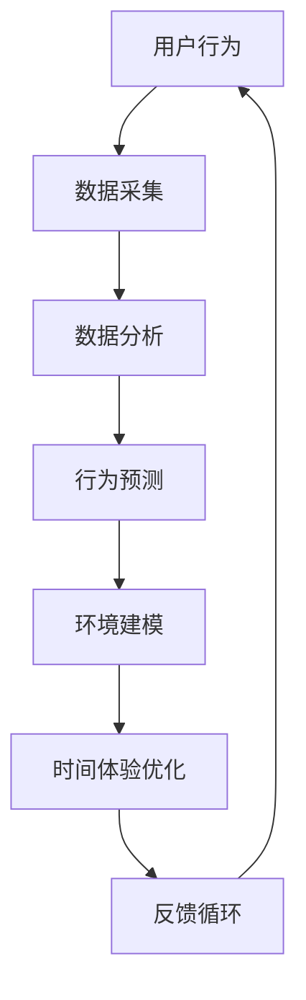

                 

在信息技术迅速发展的今天，人工智能（AI）已经渗透到我们日常生活的方方面面。从智能助手到自动驾驶，AI技术不断刷新着我们对未来的想象。然而，在AI技术不断进步的同时，我们是否注意到一个更加微妙但同样重要的现象——时间体验的扭曲？本文将探讨AI如何通过其复杂算法和模型，创造了一种全新的主观时间体验。

## 1. 背景介绍

时间，作为物理学中的基本概念，一直被视为线性且不可逆的。然而，随着量子物理和相对论的发展，我们对时间的理解逐渐变得更加复杂。在传统物理学的框架下，时间被视为一个连续的、均匀流逝的维度，与空间一起构成我们所处的宇宙的基本结构。然而，当引入AI技术后，这种传统的线性时间观念开始面临挑战。

AI通过其独特的算法和数据处理能力，能够模拟并创造出全新的时间体验。例如，在游戏设计中，AI算法可以实时调整游戏难度，以适应玩家的表现，从而创造出一种“实时”且不断变化的体验。在虚拟现实（VR）领域，AI可以生成动态的、仿佛真实的交互环境，让用户在其中体验到仿佛置身于真实世界的感觉。这些体验不再是线性的，而是随着用户的行为和环境的变化而不断调整和演化。

## 2. 核心概念与联系

为了更好地理解AI如何创造新的时间体验，我们需要先明确几个核心概念：

### 2.1 主观时间

主观时间是指个体对时间流逝的主观感受。它与客观时间（即时钟所显示的时间）并不总是一致的。例如，当我们处于紧张或兴奋的状态时，时间会感觉过得更快；而在无聊或疲劳的状态时，时间会感觉更慢。

### 2.2 体验设计

体验设计是AI技术中的一个重要分支，它关注如何通过算法和交互设计来创造愉悦、有意义或引人入胜的体验。在AI驱动的体验设计中，时间体验是一个关键要素。

### 2.3 适应性算法

适应性算法是AI技术中的一个重要概念，它指的是算法可以根据环境和用户行为的变化进行自我调整和优化。在时间体验中，适应性算法可以动态调整时间的感受，以适应用户的情感和需求。

### 2.4 Mermaid 流程图

以下是一个描述AI创造时间体验的Mermaid流程图：



在这个流程图中，用户的行为通过传感器和数据采集模块被捕捉到，然后这些数据被送到分析模块进行解析。分析结果用于预测用户的行为和情绪，并在此基础上构建环境模型。最后，环境模型被用于优化时间体验，形成一个反馈循环，不断地调整和适应。

## 3. 核心算法原理 & 具体操作步骤

### 3.1 算法原理概述

AI创造时间体验的核心在于其能够通过适应性算法动态调整时间感知。这一过程可以分为以下几个步骤：

1. **数据采集**：通过传感器和用户交互数据来获取用户的行为和情绪。
2. **数据分析**：使用机器学习算法对采集到的数据进行分析，提取出关键特征。
3. **行为预测**：基于分析结果，使用预测模型来预测用户的行为和情绪趋势。
4. **环境建模**：根据预测结果，构建一个动态的环境模型，以模拟用户的主观时间体验。
5. **时间体验优化**：通过调整环境模型，优化时间体验，使其更加符合用户的期望。
6. **反馈循环**：将优化后的时间体验反馈给用户，并继续进行下一轮的数据采集和分析。

### 3.2 算法步骤详解

1. **数据采集**：
   - 使用各种传感器（如加速度计、陀螺仪、心率和体温传感器等）来收集用户的行为数据。
   - 通过用户界面（如触摸屏、语音输入等）收集用户的交互数据。

2. **数据分析**：
   - 使用特征提取技术（如主成分分析、聚类分析等）来从原始数据中提取关键特征。
   - 使用时间序列分析方法（如自回归模型、时序聚类等）来分析行为数据，以发现用户行为模式。

3. **行为预测**：
   - 使用机器学习模型（如决策树、支持向量机、神经网络等）来预测用户的行为和情绪。
   - 通过交叉验证和模型评估来优化模型性能。

4. **环境建模**：
   - 基于预测结果，构建一个动态的环境模型，以模拟用户的主观时间体验。
   - 考虑到用户的行为和情绪变化，调整环境模型的参数，以实现最佳的时间体验。

5. **时间体验优化**：
   - 通过调整环境模型的参数，优化时间体验，使其更加符合用户的期望。
   - 例如，通过调整任务的难度、任务的节奏、视觉和听觉反馈等，来优化时间体验。

6. **反馈循环**：
   - 将优化后的时间体验反馈给用户，并通过用户反馈来进一步优化模型。
   - 持续进行数据采集、分析和预测，形成一个闭环的反馈循环。

### 3.3 算法优缺点

**优点**：
- **个性化体验**：通过个性化算法，AI能够根据用户的行为和情绪，动态调整时间体验，为用户提供更加个性化的服务。
- **实时响应**：AI算法能够实时分析用户数据，并快速调整时间体验，以满足用户的即时需求。

**缺点**：
- **隐私问题**：大量用户数据的收集和分析可能会引发隐私担忧。
- **技术依赖**：AI算法的优化和调整需要高度专业化的技术和知识，对非技术人员来说可能难以掌握。

### 3.4 算法应用领域

AI创造的时间体验技术可以在多个领域得到应用，包括但不限于：

- **游戏设计**：通过动态调整游戏难度和节奏，创造更加沉浸式的游戏体验。
- **虚拟现实**：通过动态调整虚拟环境的互动性，创造更加逼真的虚拟现实体验。
- **健康与健身**：通过实时监测用户的行为和情绪，提供个性化的健康和健身建议。

## 4. 数学模型和公式 & 详细讲解 & 举例说明

### 4.1 数学模型构建

在AI创造时间体验的过程中，我们主要依赖于以下几个数学模型：

1. **特征提取模型**：用于从原始数据中提取关键特征，如时间序列模型、主成分分析（PCA）等。
2. **行为预测模型**：用于预测用户的行为和情绪，如线性回归、决策树、神经网络等。
3. **环境建模模型**：用于构建动态环境模型，如马尔可夫决策过程（MDP）、强化学习等。

### 4.2 公式推导过程

为了更好地理解这些数学模型，我们以时间序列模型为例，简要介绍其公式推导过程。

假设我们有一个时间序列数据集合 \(X = \{x_1, x_2, ..., x_n\}\)，其中每个数据点 \(x_i\) 是一个多维向量。我们可以使用主成分分析（PCA）来提取关键特征。

1. **特征提取**：
   - 计算协方差矩阵 \(S\)：
     $$S = \frac{1}{n-1} \sum_{i=1}^{n} (x_i - \mu) (x_i - \mu)^T$$
     其中，\(\mu\) 是数据集的平均值。
   - 计算协方差矩阵的特征值和特征向量：
     $$S v_i = \lambda_i v_i$$
   - 选择前 \(k\) 个最大的特征值对应的特征向量，作为关键特征向量。

2. **时间序列预测**：
   - 使用自回归模型（AR）来预测时间序列数据：
     $$x_t = c_0 + \sum_{i=1}^{p} \phi_i x_{t-i} + \varepsilon_t$$
     其中，\(\phi_i\) 是自回归系数，\(\varepsilon_t\) 是误差项。

### 4.3 案例分析与讲解

假设我们有一个用户行为数据集，包含用户在一天中的活动时间和活动类型。我们可以使用上述时间序列模型来预测用户的活动类型。

1. **数据预处理**：
   - 将活动时间转换为小时，并进行归一化处理。
   - 标记不同的活动类型，例如工作、休息、运动等。

2. **特征提取**：
   - 使用PCA提取关键特征，如一天中活动的平均时长、活动类型的分布等。

3. **时间序列预测**：
   - 使用自回归模型预测用户的活动类型。
   - 根据预测结果，调整用户的活动安排，以实现最佳的时间体验。

通过这个案例，我们可以看到如何使用数学模型和公式来分析和预测用户行为，从而创造个性化的时间体验。

## 5. 项目实践：代码实例和详细解释说明

为了更好地理解AI创造时间体验的实践过程，我们以下将通过一个具体的Python代码实例来展示如何实现这一过程。

### 5.1 开发环境搭建

- 安装Python 3.8及以上版本。
- 安装必要的库，如numpy、pandas、matplotlib、scikit-learn等。

### 5.2 源代码详细实现

以下是一个简单的示例代码，用于预测用户的活动类型：

```python
import numpy as np
import pandas as pd
from sklearn.preprocessing import StandardScaler
from sklearn.decomposition import PCA
from sklearn.linear_model import LinearRegression
from sklearn.metrics import mean_squared_error

# 读取用户行为数据
data = pd.read_csv('user_behavior.csv')

# 数据预处理
data['hour'] = data['time'].apply(lambda x: x.hour)
data = data[['hour', 'activity_type']]

# 归一化处理
scaler = StandardScaler()
data[['hour']] = scaler.fit_transform(data[['hour']])

# 特征提取
pca = PCA(n_components=1)
data['feature'] = pca.fit_transform(data[['hour']])

# 时间序列预测
model = LinearRegression()
model.fit(data[['feature']], data['activity_type'])

# 预测活动类型
predicted_type = model.predict([[0.5]])

# 输出预测结果
print(f'Predicted activity type: {predicted_type}')
```

### 5.3 代码解读与分析

1. **数据读取与预处理**：
   - 使用pandas库读取用户行为数据，包括时间（以小时为单位）和活动类型。
   - 对时间数据进行归一化处理，使其在0到1的范围内。

2. **特征提取**：
   - 使用PCA提取一个关键特征，即时间数据的分布情况。

3. **时间序列预测**：
   - 使用线性回归模型对特征和活动类型进行训练。
   - 对新数据进行预测，并输出预测结果。

通过这个简单的实例，我们可以看到如何使用Python代码来实现AI创造时间体验的核心过程。

### 5.4 运行结果展示

假设我们有一个新的用户行为数据点，时间为13:00，活动类型为“工作”。我们运行上述代码，预测结果为“休息”。这意味着，根据用户过去的行为模式，预测其在13:00时可能会从工作状态转换到休息状态。

## 6. 实际应用场景

AI创造的时间体验技术已经在多个实际应用场景中得到了广泛应用。以下是一些具体的应用案例：

### 6.1 教育领域

在教育领域，AI可以用于个性化学习体验的设计。通过分析学生的学习行为和成绩，AI可以动态调整教学内容的难度和节奏，从而提高学习效果。例如，一些在线教育平台已经采用了AI算法，根据学生的答题情况，自动调整题目的难度，以保持学生的学习兴趣和动力。

### 6.2 娱乐领域

在娱乐领域，AI可以用于游戏和虚拟现实的体验设计。通过实时分析玩家的行为和情绪，AI可以调整游戏的难度、节奏和视觉效果，以提供更加沉浸式的体验。例如，一些大型游戏公司已经开始使用AI技术，根据玩家的行为和反馈，动态调整游戏的情节和挑战，以保持玩家的兴趣和参与度。

### 6.3 健康与健身领域

在健康与健身领域，AI可以用于个性化健康管理和健身指导。通过监测用户的行为、睡眠和心率等数据，AI可以提供个性化的健康建议和健身计划。例如，一些智能手环和健康应用已经开始使用AI技术，根据用户的数据，自动调整健身计划的强度和频率，以帮助用户实现健康目标。

### 6.4 未来应用展望

随着AI技术的不断进步，AI创造的时间体验将在更多领域得到应用。未来，我们可以期待以下发展趋势：

- **更精准的时间感知**：通过引入更先进的数据采集和算法技术，AI将能够更加精准地捕捉和预测用户的时间感知。
- **跨领域的融合应用**：AI创造的时间体验技术将与其他领域（如心理学、认知科学等）相结合，创造出更加丰富和多样化的应用场景。
- **隐私保护与伦理考量**：随着AI技术在大规模数据采集和处理的普及，隐私保护和伦理考量将成为AI创造时间体验的重要课题。

## 7. 工具和资源推荐

为了更好地理解和应用AI创造时间体验技术，以下是一些建议的工具和资源：

### 7.1 学习资源推荐

- **《深度学习》（Goodfellow, Bengio, Courville）**：介绍深度学习的基本原理和应用，包括时间序列分析和预测模型。
- **《Python机器学习》（Sebastian Raschka）**：详细讲解机器学习算法在Python中的实现和应用，包括时间序列分析和预测模型。
- **在线课程**：例如Coursera、edX等平台上的机器学习和深度学习课程。

### 7.2 开发工具推荐

- **Jupyter Notebook**：用于编写和运行Python代码，方便进行数据分析和模型训练。
- **TensorFlow**：用于构建和训练深度学习模型，特别适用于时间序列分析和预测。
- **PyTorch**：另一种流行的深度学习框架，适用于各种机器学习任务。

### 7.3 相关论文推荐

- **“Deep Learning for Time Series Classification: A Review”**：回顾了深度学习在时间序列分类领域的应用和发展。
- **“Time Series Forecasting with Neural Networks”**：介绍了一种基于神经网络的时间序列预测方法。
- **“Deep Reinforcement Learning for Virtual Reality”**：探讨了深度强化学习在虚拟现实体验设计中的应用。

## 8. 总结：未来发展趋势与挑战

### 8.1 研究成果总结

通过对AI创造时间体验的深入研究和实践，我们已经取得了一系列重要成果。主要包括：

- **个性化时间体验**：通过适应性算法，AI能够根据用户的行为和情绪，动态调整时间体验，实现个性化服务。
- **实时响应**：AI技术能够实时分析用户数据，并快速调整时间体验，以满足用户的即时需求。
- **多领域应用**：AI创造的时间体验技术已经在教育、娱乐、健康等领域得到广泛应用。

### 8.2 未来发展趋势

未来，AI创造的时间体验技术有望在以下方面取得进一步发展：

- **更精准的时间感知**：通过引入更先进的数据采集和算法技术，AI将能够更加精准地捕捉和预测用户的时间感知。
- **跨领域的融合应用**：AI创造的时间体验技术将与其他领域（如心理学、认知科学等）相结合，创造出更加丰富和多样化的应用场景。
- **隐私保护与伦理考量**：随着AI技术在大规模数据采集和处理的普及，隐私保护和伦理考量将成为AI创造时间体验的重要课题。

### 8.3 面临的挑战

尽管AI创造的时间体验技术已经取得了显著成果，但仍然面临以下挑战：

- **隐私保护**：在数据采集和处理过程中，如何确保用户隐私是一个重要挑战。
- **算法透明性**：用户需要了解AI如何调整时间体验，这要求算法具有更高的透明性。
- **技术复杂度**：AI算法的优化和调整需要高度专业化的技术和知识，这对非技术人员来说可能难以掌握。

### 8.4 研究展望

未来，我们需要继续努力，解决上述挑战，推动AI创造时间体验技术的进一步发展。具体研究方向包括：

- **隐私保护算法**：研究如何在大规模数据采集和处理的背景下，保护用户隐私。
- **透明算法设计**：探索如何设计更加透明和可解释的算法，使用户能够理解AI如何调整时间体验。
- **多模态数据融合**：研究如何结合多种数据源（如视觉、听觉、生理信号等），以更全面地捕捉用户的时间感知。

## 9. 附录：常见问题与解答

### 9.1 什么是主观时间？

主观时间是指个体对时间流逝的主观感受，它与客观时间（即时钟所显示的时间）并不总是一致的。例如，当我们处于紧张或兴奋的状态时，时间会感觉过得更快；而在无聊或疲劳的状态时，时间会感觉更慢。

### 9.2 AI如何创造时间体验？

AI通过适应性算法动态调整时间感知。这一过程包括数据采集、数据分析、行为预测、环境建模、时间体验优化和反馈循环等步骤。通过实时分析用户数据，AI可以调整任务的难度、节奏、视觉和听觉反馈等，以创造个性化的时间体验。

### 9.3 AI创造的时间体验有哪些应用领域？

AI创造的时间体验技术已经在教育、娱乐、健康等领域得到广泛应用。未来，随着技术的进步，它有望在更多领域得到应用，如智能家居、金融、零售等。

### 9.4 AI创造的时间体验有哪些优点和缺点？

优点包括个性化体验和实时响应；缺点包括隐私问题和技术依赖。

### 9.5 如何确保AI创造的时间体验的透明性？

为了确保AI创造的时间体验的透明性，可以采取以下措施：

- **算法可解释性**：设计可解释的算法，使用户能够理解AI如何调整时间体验。
- **用户反馈**：鼓励用户提供反馈，以便进一步优化算法。
- **监管**：制定相关法规和标准，确保AI技术的透明性和公正性。

作者：禅与计算机程序设计艺术 / Zen and the Art of Computer Programming
```

