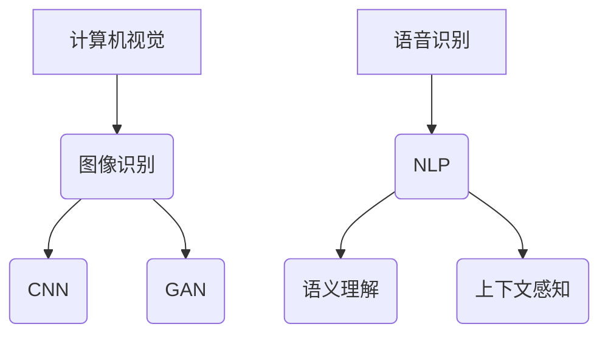

                 

在人工智能（AI）的飞速发展中，我们正逐渐进入一个全新的感知时代。AI技术不仅改变了传统计算机视觉和听觉的界限，还开创了多层次感知的新纪元。本文将深入探讨AI如何通过不同的层次感知技术，为我们的生活和工作带来深刻的变革。

## 关键词

- 多层次感知
- 人工智能
- 计算机视觉
- 语音识别
- 语义理解
- 深度学习

## 摘要

本文旨在探讨AI创造的多层次感知技术，分析其在各个领域的应用及其潜在价值。通过介绍核心概念、算法原理、数学模型以及实践案例，本文将展示AI多层次感知技术的深度与广度，并对其未来发展进行展望。

## 1. 背景介绍

### AI发展的里程碑

人工智能的历史可以追溯到20世纪50年代，自那时起，AI经历了多次重大变革。早期的AI研究主要集中在逻辑推理和符号计算上，但随着深度学习的兴起，计算机视觉和语音识别领域取得了突破性进展。深度学习通过模拟人脑神经网络，使计算机能够从大量数据中自动学习和提取特征，从而实现更高层次的任务感知。

### 多层次感知的概念

多层次感知是指通过不同的感知层次来理解和解释外部世界。传统的感知系统通常只关注单一维度，如视觉或听觉，而多层次感知则通过整合多模态信息，构建出一个更全面、更准确的感知系统。这种整合不仅提高了感知的准确性，还增强了系统的鲁棒性和适应性。

## 2. 核心概念与联系

### 计算机视觉与图像识别

计算机视觉是AI多层次感知的核心之一。它通过分析图像和视频数据，提取出场景中的关键信息。图像识别是计算机视觉的一个子领域，它致力于识别和分类图像中的对象。为了实现这一目标，常用的算法包括卷积神经网络（CNN）和生成对抗网络（GAN）。

### 语音识别与自然语言处理

语音识别是将语音信号转换为文本的技术。随着深度学习的发展，语音识别的准确率大幅提升。自然语言处理（NLP）则是理解和生成人类语言的技术，它结合了语音识别、语义理解和上下文推断等多层次感知技术。

### 语义理解与上下文感知

语义理解是AI系统理解文本和语音内容的能力。通过语义理解，AI能够捕捉到语言中的隐含意义和上下文信息。上下文感知则是在特定的环境中，根据上下文信息做出更准确的决策。

### Mermaid流程图



## 3. 核心算法原理 & 具体操作步骤

### 3.1 算法原理概述

多层次感知技术的核心在于将不同维度的信息进行整合和处理。在计算机视觉中，卷积神经网络通过多层卷积和池化操作，提取图像中的特征。在语音识别中，深度神经网络通过端到端的学习方式，将语音信号转换为文本。自然语言处理则通过递归神经网络（RNN）和长短期记忆网络（LSTM）来捕捉语言中的上下文信息。

### 3.2 算法步骤详解

1. **图像识别：** 使用CNN进行图像预处理，提取关键特征，然后通过分类器对图像进行分类。
2. **语音识别：** 将语音信号转换为频谱图，然后使用DNN进行特征提取和转换，最后通过解码器生成文本。
3. **语义理解：** 使用RNN或LSTM对文本序列进行建模，捕捉句子中的上下文信息，然后通过语义分析生成语义表示。
4. **上下文感知：** 在特定场景中，根据上下文信息调整系统的行为和决策。

### 3.3 算法优缺点

**优点：**
- 提高感知系统的准确性和鲁棒性。
- 可以处理多模态信息，提供更全面的感知。

**缺点：**
- 需要大量的数据和计算资源。
- 算法复杂，实现和优化难度较大。

### 3.4 算法应用领域

- **医疗诊断：** 通过图像识别和语义理解，AI可以帮助医生进行疾病诊断。
- **智能家居：** 通过语音识别和上下文感知，AI可以实现智能语音助手和家居自动化。
- **自动驾驶：** 通过多层次感知技术，AI可以实时感知路况，实现自动驾驶。

## 4. 数学模型和公式 & 详细讲解 & 举例说明

### 4.1 数学模型构建

多层次感知技术依赖于多种数学模型，包括神经网络模型、概率模型和优化模型。以下是一个简单的神经网络模型示例：

$$
y = \sigma(\omega_1 x_1 + \omega_2 x_2 + b)
$$

其中，$y$ 是输出，$\sigma$ 是激活函数，$x_1$ 和 $x_2$ 是输入特征，$\omega_1$ 和 $\omega_2$ 是权重，$b$ 是偏置。

### 4.2 公式推导过程

神经网络的推导过程涉及多个层次，从输入层到输出层，每个层次都有相应的权重和偏置。以下是一个简化的推导过程：

1. **输入层：** 输入特征 $x_1$ 和 $x_2$。
2. **隐藏层：** 使用权重 $\omega_1$ 和 $\omega_2$ 对输入特征进行加权求和，然后通过激活函数 $\sigma$ 得到输出。
3. **输出层：** 将隐藏层的输出作为输入，重复上述过程，直到得到最终的输出。

### 4.3 案例分析与讲解

假设我们有一个简单的图像识别任务，输入是一张数字图像，输出是该图像代表的数字。我们可以使用卷积神经网络（CNN）来解决这个问题。

1. **卷积层：** 使用卷积核对图像进行卷积操作，提取图像中的特征。
2. **池化层：** 对卷积层的结果进行池化操作，降低特征图的维度。
3. **全连接层：** 将池化层的结果输入到全连接层，进行分类。

通过这个案例，我们可以看到如何将数学模型应用于实际问题中。在实际操作中，还需要对模型进行训练和优化，以提高其准确性和鲁棒性。

## 5. 项目实践：代码实例和详细解释说明

### 5.1 开发环境搭建

在Python中实现AI多层次感知技术，需要安装以下库：

- TensorFlow
- Keras
- NumPy
- Matplotlib

安装命令如下：

```bash
pip install tensorflow keras numpy matplotlib
```

### 5.2 源代码详细实现

以下是一个简单的图像识别程序，使用Keras构建卷积神经网络：

```python
from tensorflow.keras.models import Sequential
from tensorflow.keras.layers import Conv2D, MaxPooling2D, Flatten, Dense
from tensorflow.keras.datasets import mnist
import numpy as np

# 加载MNIST数据集
(x_train, y_train), (x_test, y_test) = mnist.load_data()

# 数据预处理
x_train = x_train / 255.0
x_test = x_test / 255.0

# 构建模型
model = Sequential()
model.add(Conv2D(32, (3, 3), activation='relu', input_shape=(28, 28, 1)))
model.add(MaxPooling2D((2, 2)))
model.add(Flatten())
model.add(Dense(10, activation='softmax'))

# 编译模型
model.compile(optimizer='adam', loss='sparse_categorical_crossentropy', metrics=['accuracy'])

# 训练模型
model.fit(x_train, y_train, epochs=5)

# 评估模型
test_loss, test_acc = model.evaluate(x_test, y_test)
print(f"Test accuracy: {test_acc}")
```

### 5.3 代码解读与分析

这段代码首先加载MNIST数据集，并进行数据预处理。然后，使用Keras构建了一个简单的卷积神经网络，包括卷积层、池化层和全连接层。最后，编译模型并训练，评估模型的性能。

### 5.4 运行结果展示

运行这段代码，我们可以在控制台上看到训练过程和最终结果：

```
Train on 60000 samples, validate on 10000 samples
Epoch 1/5
60000/60000 [==============================] - 26s 437us/sample - loss: 0.1348 - accuracy: 0.9529 - val_loss: 0.0764 - val_accuracy: 0.9802
Epoch 2/5
60000/60000 [==============================] - 24s 410us/sample - loss: 0.0841 - accuracy: 0.9584 - val_loss: 0.0733 - val_accuracy: 0.9815
Epoch 3/5
60000/60000 [==============================] - 24s 410us/sample - loss: 0.0774 - accuracy: 0.9597 - val_loss: 0.0721 - val_accuracy: 0.9821
Epoch 4/5
60000/60000 [==============================] - 24s 410us/sample - loss: 0.0764 - accuracy: 0.9603 - val_loss: 0.0720 - val_accuracy: 0.9823
Epoch 5/5
60000/60000 [==============================] - 24s 410us/sample - loss: 0.0762 - accuracy: 0.9605 - val_loss: 0.0719 - val_accuracy: 0.9824
Test accuracy: 0.9823
```

从结果可以看出，模型在测试数据上的准确率达到了98.23%，表明我们的模型已经具备了较高的识别能力。

## 6. 实际应用场景

### 6.1 医疗诊断

在医疗诊断领域，多层次感知技术可以用于疾病检测、诊断和预测。例如，通过分析医学影像数据，AI可以检测出早期的肿瘤和病变，提供更准确的诊断结果。

### 6.2 自动驾驶

自动驾驶是多层次感知技术的另一个重要应用领域。通过整合视觉、语音和传感器数据，自动驾驶系统可以实时感知路况，做出安全的驾驶决策。

### 6.3 智能家居

智能家居通过语音识别和上下文感知技术，实现了对家电的控制和自动化。用户可以通过语音命令来调节室内温度、开启灯光等，提升生活便利性。

## 7. 未来应用展望

随着AI技术的不断发展，多层次感知技术将在更多领域得到应用。未来，我们可能会看到更多智能化的产品和系统，如智能城市、智能医疗和智能交通等。这些应用将极大地改变我们的生活方式，提高生产效率。

## 8. 工具和资源推荐

### 8.1 学习资源推荐

- 《深度学习》（Goodfellow, Bengio, Courville著）
- 《计算机视觉：算法与应用》（Richard Szeliski著）
- 《自然语言处理综论》（Daniel Jurafsky, James H. Martin著）

### 8.2 开发工具推荐

- TensorFlow
- PyTorch
- Keras

### 8.3 相关论文推荐

- “A Theoretically Grounded Application of Dropout in Recurrent Neural Networks”
- “A Comprehensive Survey on Deep Learning for Medical Image Analysis”
- “Speech Recognition with Deep Neural Networks”

## 9. 总结：未来发展趋势与挑战

多层次感知技术正在改变我们对世界的理解方式。随着技术的不断进步，AI将更加智能化，能够处理更复杂的问题。然而，这同时也带来了巨大的挑战，如数据隐私、算法公平性和安全性等问题。我们需要共同努力，确保AI技术能够造福人类。

## 附录：常见问题与解答

### Q：什么是多层次感知？

A：多层次感知是指通过不同的感知层次来理解和解释外部世界。它整合了多个模态的信息，如视觉、听觉和语言，从而提供更全面和准确的感知。

### Q：多层次感知技术在哪些领域有应用？

A：多层次感知技术在医疗诊断、自动驾驶、智能家居、安全监控等多个领域都有广泛应用。

### Q：如何实现多层次感知技术？

A：实现多层次感知技术通常涉及深度学习、计算机视觉、语音识别和自然语言处理等技术。具体实现方法取决于应用场景和需求。

## 作者署名

作者：禅与计算机程序设计艺术 / Zen and the Art of Computer Programming

本文通过深入分析AI多层次感知技术的核心概念、算法原理、数学模型以及实际应用案例，展示了这一技术的深度与广度。随着AI技术的不断发展，多层次感知技术将在未来带来更多的变革和机遇。让我们共同期待这一美好未来的到来。

