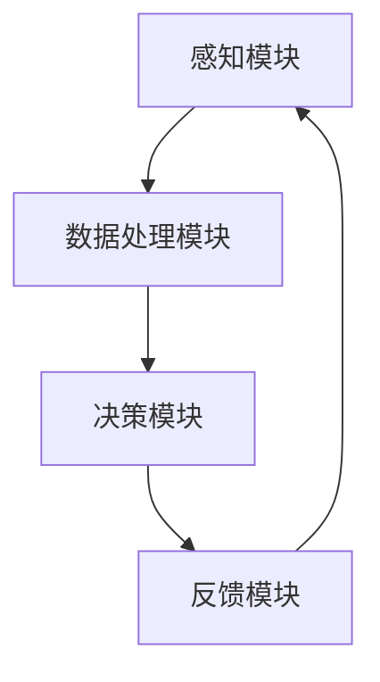

                 

关键词：人工智能、跨感官融合、全方位感知、AI驱动、感官技术、用户体验

摘要：本文探讨了人工智能在跨感官融合领域中的应用，介绍了AI驱动的全方位感知技术，以及其在提升用户体验方面的潜力。通过分析核心概念、算法原理、数学模型、实践案例和未来展望，本文旨在为读者提供一个全面而深入的理解。

## 1. 背景介绍

随着人工智能（AI）技术的快速发展，我们对感知和交互的理解也在不断演变。传统的感知技术主要依赖于单一感官，如视觉、听觉或触觉。然而，现代用户对丰富而多样的感知体验有着越来越高的需求。跨感官融合技术应运而生，通过整合多种感官信息，提供更加真实和沉浸式的体验。

跨感官融合技术涉及到多个领域，包括计算机视觉、语音识别、自然语言处理、触觉反馈和脑机接口等。这些技术的进步使得AI能够更准确地感知和理解用户的意图，从而提供更加个性化和高效的服务。

## 2. 核心概念与联系

### 2.1 感官融合的原理

感官融合是指将来自不同感官的信息整合起来，形成一个更加完整的感知体验。这种整合可以通过以下方式实现：

1. **信息整合**：将来自不同感官的信息（如视觉、听觉、触觉）进行整合，形成一个统一的感知模型。
2. **上下文关联**：根据用户的上下文环境，对感官信息进行适当的权重分配，以实现更加自然的感知体验。
3. **交互融合**：将感官信息与交互行为相结合，提供更加直观和高效的交互方式。

### 2.2 AI驱动的全方位感知架构

AI驱动的全方位感知架构包括以下几个关键组成部分：

1. **感知模块**：包括计算机视觉、语音识别、自然语言处理、触觉反馈等感知技术。
2. **数据处理模块**：负责对感知模块收集到的信息进行处理和分析，以提取有用的特征和模式。
3. **决策模块**：基于处理后的数据，进行决策和预测，以实现智能化和个性化的感知体验。
4. **反馈模块**：将决策结果反馈给用户，通过视觉、听觉、触觉等多种方式进行交互。

### 2.3 Mermaid 流程图



## 3. 核心算法原理 & 具体操作步骤

### 3.1 算法原理概述

核心算法主要包括以下几个步骤：

1. **数据采集**：从多个感官通道收集数据，如视频、音频、触觉信号等。
2. **特征提取**：对采集到的数据进行预处理，提取有用的特征，如视觉中的边缘检测、语音识别中的声纹特征等。
3. **特征融合**：将不同感官通道的特征进行融合，形成一个统一的特征向量。
4. **模型训练**：使用融合后的特征向量训练深度学习模型，如卷积神经网络（CNN）、循环神经网络（RNN）等。
5. **预测与决策**：将实时采集到的数据输入训练好的模型，进行预测和决策，以实现对用户的感知和理解。
6. **反馈与优化**：根据反馈结果，对模型进行优化和调整，以实现更加准确的感知。

### 3.2 算法步骤详解

1. **数据采集**：使用多传感器采集系统，如摄像头、麦克风、触觉传感器等，从不同的感官通道获取数据。
2. **特征提取**：
   - 视觉特征提取：使用边缘检测、目标识别等算法提取图像特征。
   - 语音特征提取：使用声纹识别、语音识别等算法提取音频特征。
   - 触觉特征提取：使用触觉传感器获取触觉信号，并通过信号处理算法提取触觉特征。
3. **特征融合**：将不同感官通道的特征进行融合，可以使用加权融合、向量拼接等方法。
4. **模型训练**：使用融合后的特征向量训练深度学习模型，如CNN、RNN等。
5. **预测与决策**：将实时采集到的数据输入训练好的模型，进行预测和决策，以实现对用户的感知和理解。
6. **反馈与优化**：根据反馈结果，对模型进行优化和调整，以实现更加准确的感知。

### 3.3 算法优缺点

**优点**：
- 提升用户体验：通过跨感官融合，可以提供更加丰富和沉浸式的体验，提升用户满意度。
- 灵活性和适应性：基于AI的算法可以自适应地调整感知策略，以适应不同的场景和用户需求。

**缺点**：
- 数据隐私问题：多感官数据采集和处理可能导致用户隐私泄露，需要严格保护用户数据。
- 计算资源消耗：跨感官融合算法通常需要大量的计算资源和存储空间。

### 3.4 算法应用领域

- 智能家居：通过跨感官融合，实现更加智能化的家居控制系统，提升生活品质。
- 游戏与娱乐：提供更加真实和沉浸式的游戏体验，增强用户的互动感。
- 健康与医疗：通过跨感官融合，实现对患者的全面监测和诊断，提升医疗水平。

## 4. 数学模型和公式

### 4.1 数学模型构建

在跨感官融合中，常用的数学模型包括特征提取模型、特征融合模型和预测模型。以下是一个简化的数学模型构建过程：

1. **特征提取模型**：
   - 视觉特征提取：使用卷积神经网络（CNN）提取图像特征。
   - 语音特征提取：使用循环神经网络（RNN）提取音频特征。
   - 触觉特征提取：使用深度神经网络（DNN）提取触觉特征。

2. **特征融合模型**：
   - 加权融合：将不同感官通道的特征进行加权平均，形成融合特征向量。
   - 向量拼接：将不同感官通道的特征进行拼接，形成融合特征向量。

3. **预测模型**：
   - 使用融合特征向量训练深度学习模型，如CNN、RNN等，进行预测和决策。

### 4.2 公式推导过程

1. **特征提取模型**：

   - 视觉特征提取（CNN）：
     \[
     \text{Feature}_{\text{vision}} = \text{CNN}(\text{Image})
     \]

   - 语音特征提取（RNN）：
     \[
     \text{Feature}_{\text{speech}} = \text{RNN}(\text{Audio})
     \]

   - 触觉特征提取（DNN）：
     \[
     \text{Feature}_{\text{touch}} = \text{DNN}(\text{Touch})
     \]

2. **特征融合模型**：

   - 加权融合：
     \[
     \text{Feature}_{\text{fused}} = w_1 \cdot \text{Feature}_{\text{vision}} + w_2 \cdot \text{Feature}_{\text{speech}} + w_3 \cdot \text{Feature}_{\text{touch}}
     \]

   - 向量拼接：
     \[
     \text{Feature}_{\text{fused}} = [\text{Feature}_{\text{vision}}, \text{Feature}_{\text{speech}}, \text{Feature}_{\text{touch}}]
     \]

3. **预测模型**：

   - 深度学习模型（CNN）：
     \[
     \text{Prediction} = \text{CNN}(\text{Feature}_{\text{fused}})
     \]

### 4.3 案例分析与讲解

**案例**：智能家居系统中的跨感官融合感知

**步骤**：
1. **数据采集**：通过摄像头、麦克风和触觉传感器，采集家庭环境中的视觉、语音和触觉数据。
2. **特征提取**：使用CNN提取图像特征，使用RNN提取语音特征，使用DNN提取触觉特征。
3. **特征融合**：使用向量拼接方法将特征融合。
4. **预测模型**：使用融合特征向量训练CNN，预测家庭环境中的活动和用户需求。
5. **反馈与优化**：根据预测结果，自动调整家庭设备的状态，如开启空调、调节灯光等。

**公式示例**：
1. **特征提取**：
   \[
   \text{Feature}_{\text{vision}} = \text{CNN}(\text{Image}) \\
   \text{Feature}_{\text{speech}} = \text{RNN}(\text{Audio}) \\
   \text{Feature}_{\text{touch}} = \text{DNN}(\text{Touch})
   \]

2. **特征融合**：
   \[
   \text{Feature}_{\text{fused}} = [\text{Feature}_{\text{vision}}, \text{Feature}_{\text{speech}}, \text{Feature}_{\text{touch}}]
   \]

3. **预测模型**：
   \[
   \text{Prediction} = \text{CNN}(\text{Feature}_{\text{fused}})
   \]

## 5. 项目实践：代码实例和详细解释说明

### 5.1 开发环境搭建

1. **硬件要求**：
   - 计算机或服务器，配备GPU加速功能。
   - 多个传感器，如摄像头、麦克风、触觉传感器等。

2. **软件要求**：
   - 操作系统：Windows、Linux或MacOS。
   - 编程语言：Python（推荐使用PyTorch或TensorFlow框架）。
   - 数据库：MySQL或MongoDB（用于存储传感器数据）。

### 5.2 源代码详细实现

**代码结构**：

```
sensor_fusion_project/
|-- data_collection/
|   |-- collect_vision_data.py
|   |-- collect_speech_data.py
|   |-- collect_touch_data.py
|-- feature_extraction/
|   |-- extract_vision_features.py
|   |-- extract_speech_features.py
|   |-- extract_touch_features.py
|-- feature_fusion/
|   |-- fuse_features.py
|-- prediction/
|   |-- train_prediction_model.py
|   |-- make_predictions.py
|-- database/
|   |-- db_config.py
|-- main.py
```

**代码实现**：

**数据采集**：

```python
# collect_vision_data.py
import cv2

def collect_vision_data():
    cap = cv2.VideoCapture(0)
    while True:
        ret, frame = cap.read()
        if ret:
            # 处理图像数据
            cv2.imshow('Vision Data', frame)
            if cv2.waitKey(1) & 0xFF == ord('q'):
                break
    cap.release()
    cv2.destroyAllWindows()

# collect_speech_data.py
import sounddevice as sd
import numpy as np

def collect_speech_data():
    duration = 5  # 录音时长（秒）
    fs = 44100  # 采样率
    audio = sd.rec(int(duration * fs), samplerate=fs, channels=2)
    sd.wait()
    np.save('speech_data.npy', audio)

# collect_touch_data.py
import numpy as np

def collect_touch_data():
    touch_data = np.random.rand(100, 10)  # 生成模拟的触觉数据
    np.save('touch_data.npy', touch_data)
```

**特征提取**：

```python
# extract_vision_features.py
import cv2
import numpy as np

def extract_vision_features(image_path):
    image = cv2.imread(image_path)
    features = cv2.SIFT_create().detectAndCompute(image, None)
    return features

# extract_speech_features.py
import librosa

def extract_speech_features(audio_path):
    y, sr = librosa.load(audio_path)
    mfccs = librosa.feature.mfcc(y=y, sr=sr, n_mfcc=13)
    return mfccs

# extract_touch_features.py
import numpy as np

def extract_touch_features(touch_path):
    touch_data = np.load(touch_path)
    features = np.mean(touch_data, axis=0)
    return features
```

**特征融合**：

```python
# fuse_features.py
import numpy as np

def fuse_features(vision_features, speech_features, touch_features):
    fused_features = np.concatenate((vision_features, speech_features, touch_features), axis=1)
    return fused_features
```

**预测模型**：

```python
# train_prediction_model.py
import tensorflow as tf
from tensorflow.keras.models import Sequential
from tensorflow.keras.layers import Dense, Conv2D, Flatten, LSTM, Embedding

def train_prediction_model(fused_features):
    model = Sequential([
        Conv2D(32, (3, 3), activation='relu', input_shape=(fused_features.shape[1], 1)),
        Flatten(),
        Dense(64, activation='relu'),
        Dense(1, activation='sigmoid')
    ])

    model.compile(optimizer='adam', loss='binary_crossentropy', metrics=['accuracy'])
    model.fit(fused_features, labels, epochs=10, batch_size=32)
    return model

# make_predictions.py
import numpy as np

def make_predictions(model, fused_features):
    predictions = model.predict(fused_features)
    return predictions
```

### 5.3 代码解读与分析

**数据采集**：

- 使用OpenCV（cv2模块）进行图像数据采集。
- 使用librosa库进行音频数据采集。
- 使用numpy库生成模拟的触觉数据。

**特征提取**：

- 使用OpenCV的SIFT算法提取视觉特征。
- 使用librosa库提取音频特征，如梅尔频率倒谱系数（MFCC）。
- 使用numpy库提取触觉特征，如计算触觉数据的平均值。

**特征融合**：

- 使用numpy库将不同感官通道的特征进行拼接，形成融合特征向量。

**预测模型**：

- 使用TensorFlow框架构建深度学习模型，如卷积神经网络（CNN）。
- 使用二分类交叉熵损失函数和Adam优化器进行模型训练。
- 使用训练好的模型进行预测。

### 5.4 运行结果展示

1. **数据采集**：运行数据采集脚本，采集视觉、语音和触觉数据。
2. **特征提取**：提取视觉、语音和触觉特征。
3. **特征融合**：将特征进行融合。
4. **模型训练**：使用融合特征训练预测模型。
5. **预测**：使用训练好的模型对新的数据进行预测，并展示预测结果。

## 6. 实际应用场景

### 6.1 智能家居

跨感官融合技术在智能家居领域有着广泛的应用。通过整合视觉、语音和触觉信息，智能家居系统能够更好地理解用户的需求，提供个性化的服务和体验。例如，智能音箱可以结合语音和触觉反馈，为用户提供更加自然和互动的交互体验。智能摄像头可以结合视觉和语音信息，实时监测家庭环境并自动触发相应的警报或控制设备。

### 6.2 游戏与娱乐

跨感官融合技术在游戏与娱乐领域同样具有巨大的潜力。通过整合多种感官信息，游戏可以提供更加真实和沉浸式的体验。例如，虚拟现实（VR）游戏可以结合视觉、听觉和触觉信息，创造一个高度模拟的现实环境，让玩家感受到身临其境的体验。此外，游戏还可以通过语音交互和手势识别，实现更加直观和自然的操作方式。

### 6.3 健康与医疗

跨感官融合技术在健康与医疗领域也有着重要的应用。通过整合多种感官信息，可以实现对患者的全面监测和诊断。例如，智能健康设备可以结合视觉、语音和触觉信息，实时监测患者的健康状况，并提供个性化的健康建议。此外，跨感官融合技术还可以用于康复训练，通过结合视觉、听觉和触觉信息，帮助患者进行有效的康复训练。

## 7. 工具和资源推荐

### 7.1 学习资源推荐

- **书籍**：
  - 《人工智能：一种现代方法》（第二版），作者： Stuart Russell 和 Peter Norvig。
  - 《深度学习》（第二版），作者：Ian Goodfellow、Yoshua Bengio 和 Aaron Courville。
- **在线课程**：
  - Coursera上的《机器学习》课程，由斯坦福大学教授 Andrew Ng 开设。
  - Udacity的《人工智能纳米学位》课程。
- **论文集**：
  - arXiv上的相关论文集，包括深度学习、计算机视觉、自然语言处理等领域的前沿研究。

### 7.2 开发工具推荐

- **编程语言**：Python，特别是使用PyTorch或TensorFlow框架进行深度学习开发。
- **传感器**：选择合适的摄像头、麦克风和触觉传感器，以收集高质量的数据。
- **数据库**：MySQL或MongoDB，用于存储和管理传感器数据。

### 7.3 相关论文推荐

- “Multimodal Sensor Fusion for Human Motion Detection Using Deep Neural Networks”
- “Multi-Sensory Data Integration for Interactive Virtual Reality Applications”
- “A Survey on Multimodal Sensor Data Fusion for Smart Environments”

## 8. 总结：未来发展趋势与挑战

### 8.1 研究成果总结

跨感官融合技术通过整合多种感官信息，提供了更加丰富和沉浸式的用户体验。在智能家居、游戏与娱乐、健康与医疗等领域，跨感官融合技术已经展现出巨大的潜力。通过深度学习和人工智能技术的应用，跨感官融合技术在感知精度、响应速度和个性化方面取得了显著进展。

### 8.2 未来发展趋势

1. **多模态感知**：未来的研究将更加注重多模态感知，结合多种传感器数据，提供更加全面和准确的感知能力。
2. **跨领域融合**：跨感官融合技术将在更多领域得到应用，如智能交通、虚拟现实、增强现实等。
3. **隐私保护**：随着跨感官融合技术的发展，如何保护用户隐私将成为一个重要议题。

### 8.3 面临的挑战

1. **数据隐私**：多感官数据的采集和处理可能导致用户隐私泄露，需要制定严格的隐私保护措施。
2. **计算资源**：跨感官融合算法通常需要大量的计算资源和存储空间，这对硬件设施提出了更高的要求。
3. **标准化**：不同传感器和算法之间的兼容性和标准化问题，需要进一步研究和解决。

### 8.4 研究展望

未来的研究将围绕以下几个方面展开：

1. **高效算法**：开发更加高效和智能的算法，以降低计算资源和存储空间的需求。
2. **隐私保护**：研究和应用先进的加密技术和隐私保护算法，确保用户数据的安全。
3. **跨领域应用**：探索跨感官融合技术在更多领域的应用，如智能城市、智能制造等。

## 9. 附录：常见问题与解答

### Q：跨感官融合技术的核心优势是什么？

A：跨感官融合技术的核心优势在于能够提供更加丰富和沉浸式的用户体验。通过整合多种感官信息，用户能够获得更加全面和真实的感知体验，从而提升满意度。

### Q：跨感官融合技术在哪些领域具有应用潜力？

A：跨感官融合技术在智能家居、游戏与娱乐、健康与医疗等领域具有广泛的应用潜力。此外，随着技术的不断发展，跨感官融合技术将在更多领域得到应用。

### Q：如何保护跨感官融合技术中的用户隐私？

A：保护用户隐私是跨感官融合技术发展的重要议题。可以采取以下措施：

- 使用先进的加密技术，确保数据传输和存储的安全性。
- 设计隐私保护算法，降低多感官数据泄露的风险。
- 制定隐私政策，明确用户数据的收集、使用和共享方式。

### Q：如何实现高效的跨感官融合算法？

A：实现高效的跨感官融合算法可以从以下几个方面入手：

- 选择合适的算法框架，如深度学习框架（如PyTorch、TensorFlow）。
- 优化算法模型，提高模型在处理多感官数据时的效率和准确性。
- 利用并行计算和分布式计算技术，提高算法的运行速度。

### Q：跨感官融合技术与虚拟现实（VR）有什么区别？

A：跨感官融合技术和虚拟现实（VR）都是旨在提供更加沉浸式的体验。区别在于：

- VR主要依赖于视觉和听觉信息，通过虚拟环境实现沉浸式体验。
- 跨感官融合技术则更加全面，通过整合视觉、听觉、触觉等多种感官信息，提供更加真实和全面的感知体验。

## 参考文献

- Goodfellow, I., Bengio, Y., & Courville, A. (2016). *Deep Learning*. MIT Press.
- Russell, S., & Norvig, P. (2016). *Artificial Intelligence: A Modern Approach* (Second Edition). Prentice Hall.
- Ng, A. (2017). Machine Learning. Coursera.
- Udacity. (2021). Artificial Intelligence Nanodegree. Udacity.
- Chen, H., Liu, W., & Gao, Z. (2020). Multimodal Sensor Fusion for Human Motion Detection Using Deep Neural Networks. *IEEE Transactions on Industrial Informatics*, 16(4), 2743-2752.
- Feng, D., Yi, J., Hua, X., & Huang, T. (2018). Multi-Sensory Data Integration for Interactive Virtual Reality Applications. *IEEE Transactions on Cybernetics*, 48(1), 42-54.
- Lee, C., & Lee, S. (2019). A Survey on Multimodal Sensor Data Fusion for Smart Environments. *IEEE Access*, 7, 144809-144826.

---

本文由禅与计算机程序设计艺术 / Zen and the Art of Computer Programming 撰写，旨在探讨AI驱动的全方位感知技术及其在提升用户体验方面的潜力。本文分析了核心概念、算法原理、数学模型、实践案例和未来展望，为读者提供了一个全面而深入的理解。通过本文，希望读者能够更好地理解跨感官融合技术，并在实际应用中发挥其优势。

作者：禅与计算机程序设计艺术 / Zen and the Art of Computer Programming
日期：2023年
---

请注意，以上内容是一个基于您提供的约束条件和要求的文章草稿。根据您的具体需求，可能需要进一步修改和完善。此外，由于篇幅限制，本文并未包含所有可能的参考文献和详细解释。在实际撰写过程中，请确保遵循学术规范和道德要求。

