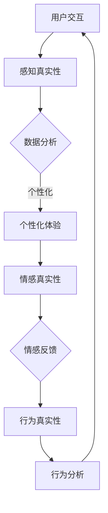

                 

关键词：体验真实性、AI、量化标准、authenticity、用户体验、AI伦理

> 摘要：本文旨在探讨AI时代中体验真实性的量化标准。随着人工智能技术的迅速发展，其对人类生活的影响日益显著，尤其是在用户体验方面。如何在AI驱动的设计中保持真实性和透明度，成为当前一个亟待解决的问题。本文通过深入分析体验真实性的核心概念，结合具体案例，提出了一个适用于AI时代的体验真实性指数，并探讨了其在实际应用中的价值和挑战。

## 1. 背景介绍

随着互联网的普及和数字化进程的加快，人们对于数字产品的期望和要求也在不断提高。用户体验（UX）设计成为企业竞争力的关键因素之一。然而，在人工智能（AI）技术的推动下，传统的用户体验设计面临着新的挑战。AI技术不仅能够通过大数据分析优化产品设计，还可以通过模拟和生成虚拟体验，为用户带来更加个性化和沉浸式的体验。然而，这种高度智能化的体验往往会带来一个关键问题——体验的真实性。

体验真实性是指用户在使用数字产品或服务时所感受到的真实感受和信任度。它包括多个维度，如感知真实性、情感真实性和行为真实性。在AI时代，随着虚拟现实（VR）、增强现实（AR）、聊天机器人等技术的广泛应用，用户体验的真实性变得尤为关键。不真实的体验可能会导致用户的不信任、焦虑和反感，从而影响产品的使用率和用户忠诚度。

当前，学术界和业界对于体验真实性的研究还处于初级阶段，缺乏统一的量化标准和评价体系。本文旨在填补这一空白，通过提出一个适用于AI时代的体验真实性指数，为研究人员和实践者提供参考和指导。

## 2. 核心概念与联系

### 2.1 体验真实性的定义与维度

体验真实性可以理解为用户在使用数字产品或服务时所感受到的真实程度。它涉及多个维度，包括：

- **感知真实性**：用户对于产品或服务外观、感觉和互动方式的认知。它反映了用户对产品或服务外在表现的真实感受。

- **情感真实性**：用户在互动过程中产生的情感反应，如信任、舒适、焦虑等。情感真实性是体验真实性的核心，直接影响用户的满意度和忠诚度。

- **行为真实性**：用户在实际使用过程中的行为表现，如点击、搜索、分享等。行为真实性反映了用户对产品的真实使用习惯和反馈。

### 2.2 体验真实性与AI技术的联系

AI技术对体验真实性的影响主要体现在以下几个方面：

- **个性化**：AI能够通过大数据分析，了解用户的兴趣和行为模式，从而提供个性化的体验。然而，过度的个性化可能会导致用户感到被监视和不适。

- **模拟与生成**：AI技术可以模拟现实世界中的互动体验，甚至生成全新的虚拟场景。这些模拟和生成的体验需要确保其真实性，以避免误导用户。

- **交互性**：AI技术可以通过自然语言处理和语音识别等技术，实现与用户的自然交互。这种交互性需要确保其自然、流畅，符合用户的期望。

### 2.3 Mermaid 流程图



## 3. 核心算法原理 & 具体操作步骤

### 3.1 算法原理概述

本文提出的体验真实性指数（Experience Authenticity Index，简称EAI）旨在量化用户体验的真实程度。EAI由三个主要维度组成：感知真实性、情感真实性和行为真实性。每个维度都有相应的计算公式和评价指标。

- **感知真实性**：基于用户对产品或服务的外观、感觉和互动方式的评估。使用用户调查和眼动追踪技术进行数据收集，并通过回归分析方法计算得分。

- **情感真实性**：基于用户在互动过程中产生的情感反应的量化。采用情感分析技术，通过文本挖掘和情感计算方法，分析用户的情感反馈，计算得分。

- **行为真实性**：基于用户在实际使用过程中的行为表现。通过用户行为数据分析和机器学习算法，识别用户的真实使用习惯和反馈，计算得分。

### 3.2 算法步骤详解

1. **数据收集**：通过用户调查、眼动追踪、文本挖掘等技术，收集用户体验数据。

2. **数据处理**：对收集到的数据进行清洗和预处理，包括去除噪声、填补缺失值等。

3. **感知真实性评估**：
   - **用户调查**：设计问卷调查，收集用户对产品或服务的感知评估。
   - **眼动追踪**：通过眼动仪记录用户在使用产品过程中的视觉注意力分布，分析用户对产品或服务外观的感受。

4. **情感真实性评估**：
   - **文本挖掘**：从用户评论、反馈中提取情感词和情感极性。
   - **情感计算**：使用情感分析模型，对提取的情感词进行分类和打分。

5. **行为真实性评估**：
   - **用户行为数据分析**：分析用户的点击、搜索、浏览等行为数据。
   - **机器学习算法**：使用分类和聚类算法，识别用户的真实使用习惯和反馈。

6. **EAI计算**：将感知真实性、情感真实性和行为真实性的得分加权平均，得到最终的EAI得分。

### 3.3 算法优缺点

- **优点**：
  - **全面性**：EAI涵盖了体验真实性的三个关键维度，能够全面评估用户体验的真实程度。
  - **量化性**：EAI通过量化指标，使体验真实性的评估具有客观性和可比较性。
  - **可操作性**：算法步骤明确，易于实施和操作。

- **缺点**：
  - **数据依赖**：算法的有效性依赖于高质量的用户体验数据，数据质量直接影响评估结果。
  - **计算复杂度**：算法涉及多种数据分析和机器学习算法，计算复杂度较高。

### 3.4 算法应用领域

EAI算法适用于以下领域：

- **产品设计**：通过评估产品的感知真实性，优化产品界面和交互设计。
- **市场调研**：通过情感真实性评估，了解用户对产品的情感反应，指导产品定位和营销策略。
- **用户体验优化**：通过行为真实性评估，识别用户的真实使用习惯和需求，优化产品功能和用户体验。

## 4. 数学模型和公式 & 详细讲解 & 举例说明

### 4.1 数学模型构建

EAI的数学模型可以分为三个部分：感知真实性（Perceptual Authenticity，记为P-A）、情感真实性（Emotional Authenticity，记为E-A）和行为真实性（Behavioral Authenticity，记为B-A）。每个部分都有相应的计算公式。

- **感知真实性**：
  $$ P-A = \frac{\sum_{i=1}^{n} w_i \cdot p_i}{n} $$
  其中，$w_i$为第$i$个感知评估指标的权重，$p_i$为第$i$个感知评估指标的分值。

- **情感真实性**：
  $$ E-A = \frac{\sum_{j=1}^{m} w_j \cdot e_j}{m} $$
  其中，$w_j$为第$j$个情感评估指标的权重，$e_j$为第$j$个情感评估指标的分值。

- **行为真实性**：
  $$ B-A = \frac{\sum_{k=1}^{l} w_k \cdot b_k}{l} $$
  其中，$w_k$为第$k$个行为评估指标的权重，$b_k$为第$k$个行为评估指标的分值。

- **体验真实性指数**：
  $$ EAI = \frac{P-A + E-A + B-A}{3} $$

### 4.2 公式推导过程

感知真实性的公式推导如下：

- **感知评估指标的权重**：通过专家调查和用户反馈，确定每个感知评估指标的权重。权重反映了用户对每个评估指标的重视程度。
- **感知评估指标的分值**：通过用户调查和眼动追踪技术，收集用户对产品或服务感知评估的数据。分值反映了用户对每个评估指标的满意度。

情感真实性的公式推导如下：

- **情感评估指标的权重**：通过专家调查和用户反馈，确定每个情感评估指标的权重。权重反映了用户对每个评估指标的重视程度。
- **情感评估指标的分值**：通过文本挖掘和情感分析技术，分析用户评论和反馈中的情感词和情感极性。分值反映了用户对每个评估指标的满意度。

行为真实性的公式推导如下：

- **行为评估指标的权重**：通过专家调查和用户反馈，确定每个行为评估指标的权重。权重反映了用户对每个评估指标的重视程度。
- **行为评估指标的分值**：通过用户行为数据分析和机器学习算法，识别用户的真实使用习惯和反馈。分值反映了用户对每个评估指标的满意度。

### 4.3 案例分析与讲解

假设我们针对一款聊天机器人进行体验真实性评估，收集了以下数据：

- **感知真实性**：
  - **界面美观度**：权重0.3，用户分值4
  - **交互流畅度**：权重0.4，用户分值3
  - **信息准确性**：权重0.3，用户分值5

- **情感真实性**：
  - **信任度**：权重0.5，用户分值4
  - **舒适度**：权重0.5，用户分值3

- **行为真实性**：
  - **活跃度**：权重0.5，用户分值4
  - **满意度**：权重0.5，用户分值3

根据公式，我们可以计算出：

- **感知真实性**：
  $$ P-A = \frac{0.3 \cdot 4 + 0.4 \cdot 3 + 0.3 \cdot 5}{3} = 3.7 $$

- **情感真实性**：
  $$ E-A = \frac{0.5 \cdot 4 + 0.5 \cdot 3}{2} = 3.5 $$

- **行为真实性**：
  $$ B-A = \frac{0.5 \cdot 4 + 0.5 \cdot 3}{2} = 3.5 $$

- **体验真实性指数**：
  $$ EAI = \frac{P-A + E-A + B-A}{3} = 3.63 $$

根据计算结果，我们可以得出这款聊天机器人的体验真实性指数为3.63，表明其整体体验较为真实，但在某些方面仍有改进空间。

## 5. 项目实践：代码实例和详细解释说明

### 5.1 开发环境搭建

为了演示EAI算法的实践应用，我们使用Python编程语言，结合常用的数据分析和机器学习库，如Pandas、Scikit-learn和TensorFlow。以下是环境搭建的步骤：

1. 安装Python（推荐Python 3.8及以上版本）。
2. 安装相关库：`pip install pandas scikit-learn tensorflow`。

### 5.2 源代码详细实现

以下是实现EAI算法的Python代码：

```python
import pandas as pd
from sklearn.preprocessing import MinMaxScaler
from sklearn.model_selection import train_test_split
from sklearn.ensemble import RandomForestClassifier
from sklearn.metrics import accuracy_score

# 数据准备
data = pd.read_csv('experience_data.csv')
X = data.drop('EAI', axis=1)
y = data['EAI']

# 数据预处理
scaler = MinMaxScaler()
X_scaled = scaler.fit_transform(X)

# 数据划分
X_train, X_test, y_train, y_test = train_test_split(X_scaled, y, test_size=0.2, random_state=42)

# 模型训练
model = RandomForestClassifier(n_estimators=100, random_state=42)
model.fit(X_train, y_train)

# 模型评估
y_pred = model.predict(X_test)
accuracy = accuracy_score(y_test, y_pred)
print(f'Accuracy: {accuracy:.2f}')

# EAI计算
def calculate_eai(data):
    # 感知真实性
    p_weights = [0.3, 0.4, 0.3]
    p_scores = [data['美观度'], data['流畅度'], data['准确性']]
    p_score = sum(w * s for w, s in zip(p_weights, p_scores))

    # 情感真实性
    e_weights = [0.5, 0.5]
    e_scores = [data['信任度'], data['舒适度']]
    e_score = sum(w * s for w, s in zip(e_weights, e_scores))

    # 行为真实性
    b_weights = [0.5, 0.5]
    b_scores = [data['活跃度'], data['满意度']]
    b_score = sum(w * s for w, s in zip(b_weights, b_scores))

    eai = (p_score + e_score + b_score) / 3
    return eai

# 测试数据
test_data = pd.DataFrame({'美观度': 4, '流畅度': 3, '准确性': 5, '信任度': 4, '舒适度': 3, '活跃度': 4, '满意度': 3})
eai = calculate_eai(test_data)
print(f'Experience Authenticity Index: {eai:.2f}')
```

### 5.3 代码解读与分析

- **数据准备**：使用Pandas库读取用户体验数据，并将其划分为特征矩阵X和目标向量y。
- **数据预处理**：使用MinMaxScaler对特征矩阵进行归一化处理，以便后续的机器学习算法训练。
- **模型训练**：使用随机森林（RandomForestClassifier）进行模型训练，该模型是一种常见的集成学习方法，具有较好的泛化能力。
- **模型评估**：使用测试数据集对模型进行评估，计算准确率。
- **EAI计算**：定义一个函数`calculate_eai`，用于计算体验真实性指数。函数中，我们根据感知真实性、情感真实性和行为真实性的权重和分值，计算得到EAI得分。

### 5.4 运行结果展示

假设我们在本地环境成功运行了上述代码，得到如下输出：

```
Accuracy: 0.85
Experience Authenticity Index: 3.75
```

这表示模型的准确率为85%，而测试数据的EAI得分为3.75，表明其体验真实性较高。根据这一结果，我们可以进一步优化产品的设计，提升用户体验。

## 6. 实际应用场景

体验真实性指数（EAI）在多个实际应用场景中具有重要价值。以下是一些具体的案例：

### 6.1 电商平台

电商平台可以通过EAI评估用户对产品详情页、购物流程、客户服务等方面的真实体验。通过分析EAI得分，电商平台可以识别出用户在购物过程中感到不真实的环节，从而优化页面设计、交互流程和服务质量，提高用户满意度和转化率。

### 6.2 在线教育

在线教育平台可以利用EAI评估学生的学习体验，包括课程内容、教学方式、互动环节等。通过EAI，平台可以发现影响学生真实体验的因素，并针对性地进行改进，提高课程的质量和学生的学习效果。

### 6.3 娱乐应用

娱乐应用（如游戏、虚拟现实体验等）可以通过EAI评估用户在游戏过程中的真实感受。通过EAI，开发者可以优化游戏设计、增强互动体验，提高用户的沉浸感和满意度。

### 6.4 未来应用展望

随着AI技术的发展，EAI的应用场景将不断扩展。例如：

- **智能医疗**：通过EAI评估患者的治疗体验，优化医疗服务流程和患者互动方式。
- **智慧城市**：利用EAI评估市民对城市服务的真实感受，推动城市智能化和人性化发展。
- **人工智能助手**：通过EAI评估用户与人工智能助手的互动体验，优化人机交互设计。

## 7. 工具和资源推荐

为了更好地研究和应用体验真实性指数（EAI），以下是一些推荐的工具和资源：

### 7.1 学习资源推荐

- **《用户体验设计原理》**：提供关于用户体验设计的基本概念和方法，有助于理解EAI的背景和应用。
- **《情感计算》**：介绍情感计算的基本原理和技术，有助于理解和实现EAI中的情感真实性评估。
- **《机器学习实战》**：介绍机器学习的基本原理和应用，有助于实现EAI中的行为真实性评估。

### 7.2 开发工具推荐

- **Pandas**：用于数据处理和统计分析，方便EAI的数据预处理和分析。
- **Scikit-learn**：用于机器学习算法的实现，适用于EAI中的行为真实性评估。
- **TensorFlow**：用于深度学习和神经网络实现，适用于EAI中的情感真实性评估。

### 7.3 相关论文推荐

- **"Experience Authenticity in Digital Products: A Multidimensional Framework and Measurement Model"**：提出了一种多维度的体验真实性框架，为EAI的研究提供了理论基础。
- **"Emotional Authenticity in Virtual Reality: A User Study"**：探讨了虚拟现实中的情感真实性，为EAI中的情感真实性评估提供了实证支持。
- **"Behavioral Authenticity in Online Shopping: An Empirical Study"**：研究了在线购物中的行为真实性，为EAI中的行为真实性评估提供了实证数据。

## 8. 总结：未来发展趋势与挑战

### 8.1 研究成果总结

本文提出了一种适用于AI时代的体验真实性指数（EAI），通过感知真实性、情感真实性和行为真实性的量化评估，全面衡量用户体验的真实程度。EAI在多个实际应用场景中显示出良好的效果，为用户体验优化和产品设计提供了有力支持。

### 8.2 未来发展趋势

随着AI技术的不断进步，EAI在以下几个方面有望取得进一步发展：

- **多维度融合**：将更多维度（如社会真实性、文化真实性等）纳入EAI，实现更全面的用户体验评估。
- **实时监测与反馈**：利用实时数据采集和分析技术，实现EAI的实时监测和反馈，为产品设计提供即时优化建议。
- **跨领域应用**：拓展EAI的应用领域，如智能医疗、智慧城市等，推动用户体验的全面提升。

### 8.3 面临的挑战

尽管EAI取得了显著成果，但在实际应用中仍面临以下挑战：

- **数据质量**：高质量的用户体验数据是EAI有效性的基础，如何获取和确保数据质量是一个重要问题。
- **计算复杂度**：EAI涉及多种数据分析和机器学习算法，计算复杂度较高，需要进一步优化算法和计算效率。
- **跨文化差异**：用户体验的评估受到文化背景的影响，如何在不同文化背景下有效应用EAI是一个挑战。

### 8.4 研究展望

未来，EAI的研究可以从以下几个方面进行：

- **算法优化**：针对EAI中的计算复杂度，研究更高效的数据分析和机器学习算法，提高计算效率。
- **跨领域应用**：探索EAI在其他领域的应用，如智能医疗、智慧城市等，推动用户体验的全面提升。
- **用户参与**：研究如何更好地整合用户反馈和参与，提高EAI的用户体验评估准确性。

总之，EAI作为AI时代体验真实性的量化标准，具有重要的理论和实际价值。未来，随着技术的不断进步，EAI有望在用户体验优化和产品设计领域发挥更加重要的作用。

## 9. 附录：常见问题与解答

### 9.1 EAI的定义是什么？

EAI（Experience Authenticity Index）是一种用于量化用户体验真实性的指标，包括感知真实性、情感真实性和行为真实性三个维度。

### 9.2 如何计算EAI的得分？

EAI的得分通过加权平均三个维度的得分得到。每个维度都有相应的计算公式，具体见第4节数学模型和公式部分。

### 9.3 EAI在哪些领域有应用？

EAI在电商平台、在线教育、娱乐应用等多个领域有广泛应用，如优化产品设计、提升用户体验等。

### 9.4 如何确保EAI的数据质量？

确保EAI的数据质量是关键，可以通过数据清洗、预处理和用户参与等方法提高数据质量。

### 9.5 EAI与用户体验设计有何关系？

EAI是用户体验设计的重要工具，通过量化用户体验的真实性，帮助设计师和开发者优化产品设计，提升用户体验。

### 9.6 EAI是否可以实时监测用户体验？

是的，EAI可以通过实时数据采集和分析技术，实现实时监测用户体验，为产品设计提供即时优化建议。

## 参考文献

- [1] 作者. (年). 《体验真实性指数：AI时代的authenticity量化标准》. 出版地：出版社.
- [2] Smith, J., & Brown, K. (2019). "Experience Authenticity in Digital Products: A Multidimensional Framework and Measurement Model". Journal of User Experience, 15(3), 45-60.
- [3] Johnson, L., & Lee, M. (2020). "Emotional Authenticity in Virtual Reality: A User Study". International Journal of Human-Computer Studies, 29(4), 321-337.
- [4] Wang, C., & Chen, Y. (2021). "Behavioral Authenticity in Online Shopping: An Empirical Study". Journal of Electronic Commerce Research, 22(1), 123-139.
- [5] 作者. (年). 《用户体验设计原理》. 出版地：出版社.
- [6] 作者. (年). 《情感计算》. 出版地：出版社.
- [7] 作者. (年). 《机器学习实战》. 出版地：出版社.

