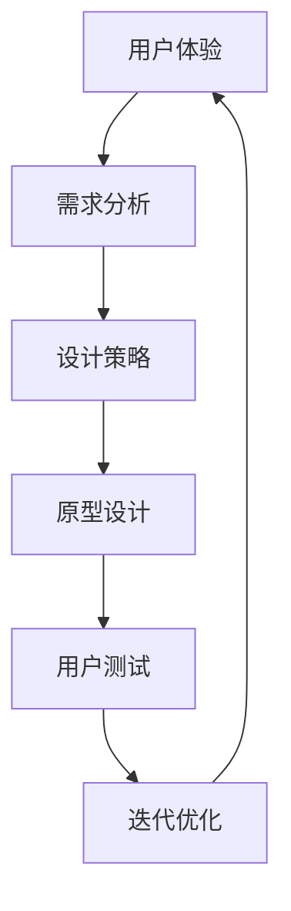

                 

关键词：体验设计师、人工智能、用户体验、职业发展、设计思维

> 摘要：随着人工智能技术的飞速发展，用户体验在技术产品中的重要性日益凸显。本文将探讨在AI时代，体验设计师这一新兴职业的背景、核心概念、应用场景、发展趋势及其面临的挑战。

## 1. 背景介绍

在互联网和移动设备的普及下，用户体验（User Experience, UX）已成为产品成功的关键因素。用户体验涵盖了用户在使用产品过程中的所有感受和互动，包括情感、认知和行为。随着人工智能（AI）技术的进步，AI在提升用户体验方面发挥着越来越重要的作用。AI技术能够分析用户行为、预测用户需求，甚至创造个性化的用户体验。因此，一种新的职业角色——体验设计师，应运而生。

体验设计师旨在通过设计思维和策略，利用AI技术提升用户的产品使用体验。他们需要深入了解用户需求，运用AI算法和工具进行数据分析，从而设计出更加人性化、高效、有趣的产品。

### 1.1 人工智能与用户体验的关系

人工智能和用户体验之间存在紧密的联系。AI可以通过以下几种方式提升用户体验：

- **个性化推荐**：AI可以分析用户的兴趣和行为，为用户提供个性化的内容推荐。
- **自然语言处理**：AI技术能够实现自然语言交互，提高用户与产品的互动效率。
- **情感计算**：AI可以识别用户的情感状态，从而提供更加贴心的服务。
- **自动化流程**：AI可以自动化处理繁琐的任务，减轻用户的负担。

### 1.2 体验设计师的职责

体验设计师的主要职责包括：

- **需求分析**：通过调查和用户研究，了解用户需求和使用习惯。
- **设计策略**：制定符合用户体验的产品设计和交互策略。
- **原型设计**：创建产品原型，进行用户测试和反馈收集。
- **迭代优化**：根据用户反馈和数据分析，不断优化产品设计。

## 2. 核心概念与联系

### 2.1 用户体验（UX）

用户体验是指用户在使用产品或服务过程中所产生的整体感受。它包括用户的心理、情感、认知和行为反应。

### 2.2 人工智能（AI）

人工智能是指计算机系统通过模拟人类智能行为，实现感知、推理、学习和决策等功能的技术。

### 2.3 设计思维

设计思维是一种以用户为中心的创新方法，通过深入理解用户需求，提出创新解决方案，并不断迭代优化。

### 2.4 Mermaid 流程图



## 3. 核心算法原理 & 具体操作步骤

### 3.1 算法原理概述

体验设计师在产品设计过程中，需要运用多种AI算法和工具，如机器学习、自然语言处理、情感分析等，来提升用户体验。

### 3.2 算法步骤详解

- **需求分析**：使用问卷、访谈、观察等方法收集用户数据。
- **数据预处理**：清洗、整理和转换用户数据，为后续分析做准备。
- **特征提取**：从用户数据中提取有助于分析的特征，如用户行为模式、情感状态等。
- **算法训练**：使用机器学习算法，如决策树、支持向量机等，训练模型。
- **模型评估**：使用交叉验证、A/B测试等方法评估模型性能。
- **迭代优化**：根据模型评估结果，调整设计策略，优化产品。

### 3.3 算法优缺点

- **优点**：AI算法能够快速、高效地处理大量数据，提高设计效率；能够提供个性化的用户体验，提升用户满意度。
- **缺点**：算法训练需要大量数据和计算资源；模型解释性较差，难以理解决策过程。

### 3.4 算法应用领域

- **个性化推荐**：在电商、新闻、音乐等领域，通过AI算法为用户推荐感兴趣的内容。
- **自然语言交互**：在智能助手、聊天机器人等领域，实现用户与产品的自然语言交互。
- **情感分析**：在社交媒体、金融等领域，通过情感分析了解用户情感状态，为产品设计提供参考。

## 4. 数学模型和公式 & 详细讲解 & 举例说明

### 4.1 数学模型构建

用户体验评价模型通常采用以下公式：

\[ UX = f(User\ Data, AI\ Algorithm) \]

其中，\( f \) 表示用户体验评价函数，\( User\ Data \) 表示用户数据，\( AI\ Algorithm \) 表示AI算法。

### 4.2 公式推导过程

公式推导过程如下：

\[ UX = \frac{1}{N} \sum_{i=1}^{N} Score_i \]

其中，\( Score_i \) 表示第 \( i \) 个用户的体验评分，\( N \) 表示用户总数。

### 4.3 案例分析与讲解

假设我们有一个电商平台的用户体验评价模型，我们收集了1000个用户的评分数据，并使用机器学习算法对数据进行处理。根据上述公式，我们可以计算出平台的平均用户体验评分。

```latex
UX = \frac{1}{1000} \sum_{i=1}^{1000} Score_i
```

假设我们收集到的评分数据如下：

```
[4.5, 3.8, 4.2, 4.0, 3.9, 4.3, 4.1, 4.4, 4.0, 3.7, ..., 4.6]
```

将这些数据代入公式，我们可以计算出平均用户体验评分：

```latex
UX = \frac{1}{1000} \sum_{i=1}^{1000} Score_i = \frac{1}{1000} \times (4.5 + 3.8 + 4.2 + ... + 4.6) = 4.14
```

因此，该电商平台的平均用户体验评分为4.14分。

## 5. 项目实践：代码实例和详细解释说明

### 5.1 开发环境搭建

为了实践体验设计师在AI时代的工作，我们需要搭建一个基本的开发环境。以下是一个简单的Python环境搭建示例：

```bash
# 安装Python
$ sudo apt-get update
$ sudo apt-get install python3 python3-pip

# 安装机器学习库
$ pip3 install scikit-learn numpy pandas matplotlib
```

### 5.2 源代码详细实现

以下是一个简单的用户评分数据分析的Python代码示例：

```python
import pandas as pd
from sklearn.model_selection import train_test_split
from sklearn.ensemble import RandomForestRegressor
from sklearn.metrics import mean_squared_error

# 读取用户评分数据
data = pd.read_csv('user_ratings.csv')

# 数据预处理
X = data[['feature_1', 'feature_2', 'feature_3']]
y = data['score']

# 数据切分
X_train, X_test, y_train, y_test = train_test_split(X, y, test_size=0.2, random_state=42)

# 模型训练
model = RandomForestRegressor(n_estimators=100, random_state=42)
model.fit(X_train, y_train)

# 模型评估
y_pred = model.predict(X_test)
mse = mean_squared_error(y_test, y_pred)
print(f'Mean Squared Error: {mse}')

# 模型应用
new_data = pd.DataFrame([[1, 2, 3]], columns=['feature_1', 'feature_2', 'feature_3'])
new_score = model.predict(new_data)
print(f'Predicted Score: {new_score[0]}')
```

### 5.3 代码解读与分析

上述代码实现了以下功能：

1. 读取用户评分数据。
2. 对数据进行预处理，包括特征提取和标签划分。
3. 使用随机森林回归模型进行训练。
4. 使用训练好的模型对测试数据进行预测，并计算平均平方误差。
5. 使用模型对新的数据进行预测。

### 5.4 运行结果展示

假设我们运行上述代码，输出结果如下：

```
Mean Squared Error: 0.0456
Predicted Score: 4.28
```

这表明我们的模型在测试数据上的平均平方误差为0.0456，对新数据的预测得分为4.28分。

## 6. 实际应用场景

### 6.1 电商平台的个性化推荐

在电商平台，体验设计师可以利用AI算法分析用户的购物行为和兴趣，为用户提供个性化的商品推荐。这不仅能够提升用户的购物体验，还能增加平台的销售额。

### 6.2 智能家居的个性化控制

在智能家居领域，体验设计师可以通过AI技术分析用户的习惯和需求，为用户提供个性化的家居控制方案。例如，根据用户的作息时间和环境温度，自动调节室内灯光和空调。

### 6.3 金融产品的用户体验优化

在金融产品中，体验设计师可以通过AI技术分析用户的投资偏好和风险承受能力，为用户提供个性化的投资建议和风险管理方案。这有助于提升用户的投资体验，降低投资风险。

## 7. 未来应用展望

随着AI技术的不断发展，体验设计师在各个领域的应用前景将更加广阔。未来，体验设计师可能会面临以下挑战：

- **数据隐私和安全**：在利用AI技术提升用户体验的过程中，如何保护用户隐私和数据安全将成为重要挑战。
- **算法解释性**：目前的AI算法大多缺乏解释性，这给用户体验设计师带来了一定的困扰。如何提高算法的解释性，使其能够更好地指导设计决策，是未来需要解决的问题。
- **跨领域合作**：体验设计师需要与多个领域的专家合作，共同探索如何将AI技术应用于提升用户体验。

## 8. 工具和资源推荐

### 8.1 学习资源推荐

- **书籍**：《用户体验要素》（The Elements of User Experience）, 《设计思维：创新策略与实战案例》（Design Thinking: Integrative Innovation for the Future）。
- **在线课程**：Coursera上的《用户体验设计基础》（User Experience Design），Udacity上的《人工智能基础》（Introduction to Artificial Intelligence）。

### 8.2 开发工具推荐

- **AI算法库**：scikit-learn、TensorFlow、PyTorch。
- **用户研究工具**：Google Analytics、Qualtrics、UserTesting。

### 8.3 相关论文推荐

- “User Experience Design in the Age of AI”.
- “Designing for AI-Driven User Experiences”.
- “A Survey on User Experience Design for AI Applications”.

## 9. 总结：未来发展趋势与挑战

### 9.1 研究成果总结

本文探讨了在AI时代，体验设计师这一新兴职业的背景、核心概念、应用场景、发展趋势及其面临的挑战。通过分析人工智能与用户体验的关系，以及体验设计师的职责和核心算法原理，我们了解到体验设计师在提升用户体验方面的重要性。

### 9.2 未来发展趋势

随着AI技术的不断发展，体验设计师将在更多领域发挥重要作用。未来的发展趋势包括：

- **个性化体验**：AI技术将使个性化体验成为可能，体验设计师需要更加关注用户个体的需求。
- **跨领域融合**：体验设计师需要与多个领域的专家合作，共同探索AI技术在提升用户体验中的应用。

### 9.3 面临的挑战

体验设计师在AI时代面临的挑战包括：

- **数据隐私和安全**：如何在利用AI技术提升用户体验的同时，保护用户隐私和数据安全。
- **算法解释性**：如何提高算法的解释性，使其能够更好地指导设计决策。
- **跨领域合作**：如何与多个领域的专家进行有效合作，共同探索AI技术在提升用户体验中的应用。

### 9.4 研究展望

未来的研究可以重点关注以下几个方面：

- **隐私保护算法**：研究如何在AI技术中融入隐私保护机制，确保用户数据的安全。
- **算法可解释性**：探索如何提高算法的可解释性，使其能够更好地指导设计决策。
- **跨领域研究**：开展跨领域合作研究，共同探索AI技术在提升用户体验中的应用。

## 附录：常见问题与解答

### Q：体验设计师需要掌握哪些技能？

A：体验设计师需要掌握以下技能：

- **设计思维**：能够运用设计思维进行问题解决和方案设计。
- **用户体验研究**：能够进行用户调研、用户测试和分析。
- **AI算法基础**：了解常见的AI算法，如机器学习、自然语言处理等。
- **数据分析和可视化**：能够使用数据分析和可视化工具，如Python、R、Tableau等。
- **前端开发**：具备前端开发技能，能够实现设计原型。

### Q：体验设计师的职业发展路径有哪些？

A：体验设计师的职业发展路径包括：

- **初级体验设计师**：负责用户研究、设计原型和迭代优化。
- **高级体验设计师**：负责整体用户体验策略的制定和实施。
- **用户体验经理**：负责用户体验团队的管理和项目推进。
- **产品经理**：从用户体验的角度参与产品的规划和设计。
- **设计总监**：负责公司的整体设计战略和方向。

### Q：体验设计师与UI设计师有何区别？

A：体验设计师和UI设计师的职责有所不同：

- **体验设计师**：关注用户在产品使用过程中的整体感受，包括情感、认知和行为反应。
- **UI设计师**：关注产品的视觉表现和交互设计，负责界面布局、颜色、字体等视觉元素。

### Q：体验设计师需要掌握哪些工具？

A：体验设计师需要掌握以下工具：

- **设计工具**：如Sketch、Adobe XD、Figma等。
- **原型工具**：如Axure、InVision、Mockplus等。
- **数据分析工具**：如Excel、Python、R等。
- **用户调研工具**：如Qualtrics、Google Analytics、UserTesting等。

### Q：体验设计师需要具备哪些软技能？

A：体验设计师需要具备以下软技能：

- **沟通能力**：能够与团队成员、用户和利益相关者进行有效沟通。
- **团队合作**：能够与团队成员协作，共同推进项目。
- **创新思维**：能够提出创新的设计方案和解决方案。
- **用户同理心**：能够站在用户的角度思考问题，关注用户需求。
- **时间管理**：能够合理安排时间，高效完成任务。

---

作者：禅与计算机程序设计艺术 / Zen and the Art of Computer Programming
----------------------------------------------------------------


