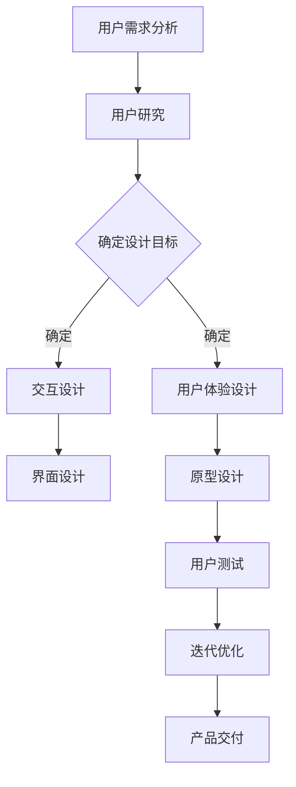

                 

关键词：体验设计、人工智能、新兴职业、人机交互、用户体验

在数字技术飞速发展的今天，用户体验已经成为了产品和服务的核心竞争力。随着人工智能（AI）技术的不断成熟，体验设计师这个职业应运而生，成为了一个充满前景的新兴职业。本文将探讨体验设计师的角色、技能要求、工作内容以及AI时代对这一职业的影响。

## 1. 背景介绍

用户体验（UX）设计在20世纪90年代随着互联网的兴起而逐渐受到重视。最初的UX设计主要关注网站和软件的可访问性和易用性。随着智能手机和平板电脑的普及，用户体验设计逐渐扩展到了移动应用领域。而在AI技术的发展过程中，用户体验设计的重要性更加凸显，因为AI的应用不仅需要技术上的卓越，更需要满足用户的需求和期望。

体验设计师是负责设计产品或服务如何与用户互动，以及如何让这种互动感觉良好的人。他们的工作不仅包括用户界面（UI）设计，还涉及到用户研究、交互设计、用户体验测试等多个方面。体验设计师的目标是通过设计创造一个直观、愉悦、高效的用户体验，从而提高用户满意度和忠诚度。

## 2. 核心概念与联系

### 2.1 用户体验（UX）设计

用户体验设计是一个广泛的概念，它涵盖了用户与产品或服务互动的整个过程。一个良好的用户体验应该包括以下几个方面：

- **可用性（Usability）**：产品是否容易使用，用户能否轻松完成任务。
- **可用性（Accessibility）**：产品是否对各种用户，包括残障人士，都是可访问的。
- **吸引力（Aesthetics）**：产品的外观是否美观，能否吸引用户的注意力。
- **情感（Emotion）**：用户在使用产品时的情感体验。
- **品牌形象（Branding）**：产品是否传达了品牌的核心价值和形象。

### 2.2 交互设计

交互设计关注的是用户与产品或服务之间的交互流程。交互设计师需要考虑如何设计交互界面，使得用户能够通过一系列动作与系统进行有效沟通。这包括按钮、菜单、滑块等界面元素的设计。

### 2.3 用户研究

用户研究是用户体验设计的基础。通过用户研究，设计师可以了解用户的需求、行为和偏好，从而设计出更符合用户期望的产品或服务。

### 2.4 AI与用户体验设计

AI在用户体验设计中的应用主要体现在以下几个方面：

- **个性化推荐**：基于用户的兴趣和行为数据，AI可以为用户推荐他们可能感兴趣的内容。
- **语音交互**：通过自然语言处理技术，AI可以理解和响应用户的语音指令。
- **自适应界面**：AI可以根据用户的习惯和偏好，自动调整界面布局和功能。
- **情感计算**：通过分析用户的情感状态，AI可以提供更加个性化的体验。

### 2.5 Mermaid 流程图

以下是一个简化的用户体验设计流程的 Mermaid 流程图：



## 3. 核心算法原理 & 具体操作步骤

### 3.1 算法原理概述

体验设计师需要掌握一系列的算法和工具，以帮助他们在设计过程中做出明智的决策。以下是一些核心算法原理的概述：

- **决策树**：用于分类和回归分析，可以帮助设计师根据用户数据做出预测和决策。
- **聚类算法**：如K-means，用于将用户群体划分成不同的类别，以便进行个性化设计。
- **协同过滤**：用于推荐系统，通过分析用户的兴趣和行为，为用户推荐可能感兴趣的内容。
- **情感分析**：通过自然语言处理技术，分析用户的情感状态，以便提供更加个性化的体验。

### 3.2 算法步骤详解

以下是使用协同过滤算法设计推荐系统的基本步骤：

1. **数据收集**：收集用户的兴趣和行为数据。
2. **预处理**：清洗和转换数据，使其适合用于算法分析。
3. **用户相似度计算**：计算用户之间的相似度，可以使用余弦相似度、皮尔逊相关系数等方法。
4. **推荐生成**：基于用户相似度矩阵，为每个用户生成推荐列表。
5. **评估与优化**：评估推荐系统的效果，并根据评估结果进行优化。

### 3.3 算法优缺点

- **优点**：协同过滤算法可以提供个性化的推荐，提高用户的满意度。
- **缺点**：当用户数据不足时，算法的性能可能下降；同时，它也可能产生重复推荐的偏差。

### 3.4 算法应用领域

协同过滤算法广泛应用于电子商务、社交媒体、音乐和视频推荐等领域。在体验设计中，它可以用于推荐系统、个性化内容生成等。

## 4. 数学模型和公式 & 详细讲解 & 举例说明

### 4.1 数学模型构建

在用户体验设计中，常用的数学模型包括决策树、聚类算法和协同过滤等。以下以K-means聚类算法为例进行讲解。

K-means算法是一种基于距离的聚类算法。它的目标是找到K个中心点，使得每个中心点与其对应的所有点的平均距离最小。

### 4.2 公式推导过程

给定一个包含n个数据点的数据集，每个数据点表示为一个m维向量。K-means算法的目标是找到K个中心点$C_1, C_2, ..., C_K$，使得每个数据点到其最近中心点的距离最小。具体公式如下：

$$
J = \sum_{i=1}^{n} \sum_{j=1}^{K} \frac{1}{n} \sum_{x_i \in S_j} ||x_i - C_j||^2
$$

其中，$S_j$表示第j个聚类集合，$C_j$表示第j个中心点。

### 4.3 案例分析与讲解

假设我们有一个包含10个数据点的二维数据集，我们需要将其分成两个聚类。以下是使用K-means算法进行聚类的步骤：

1. **初始化中心点**：随机选择两个数据点作为初始中心点。
2. **分配数据点**：将每个数据点分配到距离其最近的中心点所在的聚类。
3. **更新中心点**：计算每个聚类的中心点，即聚类内所有数据点的均值。
4. **重复步骤2和3**，直到中心点不再发生显著变化。

以下是使用K-means算法进行聚类的示例：

| 数据点 | 聚类1中心点 | 聚类2中心点 |
| ------ | ----------- | ----------- |
| (1, 1) | (1.5, 1.5) | (0.5, 0.5)  |
| (2, 2) | (1.5, 1.5) | (0.5, 0.5)  |
| (3, 3) | (1.5, 1.5) | (0.5, 0.5)  |
| (4, 4) | (1.5, 1.5) | (0.5, 0.5)  |
| (5, 5) | (1.5, 1.5) | (0.5, 0.5)  |
| (6, 6) | (1.5, 1.5) | (0.5, 0.5)  |
| (7, 7) | (1.5, 1.5) | (0.5, 0.5)  |
| (8, 8) | (1.5, 1.5) | (0.5, 0.5)  |
| (9, 9) | (1.5, 1.5) | (0.5, 0.5)  |
| (10, 10) | (1.5, 1.5) | (0.5, 0.5) |

经过多次迭代，中心点趋于稳定，聚类效果如下：

| 数据点 | 聚类1 | 聚类2 |
| ------ | ----- | ----- |
| (1, 1) | 聚类1 | -     |
| (2, 2) | 聚类1 | -     |
| (3, 3) | 聚类1 | -     |
| (4, 4) | 聚类1 | -     |
| (5, 5) | 聚类1 | -     |
| (6, 6) | -     | 聚类2 |
| (7, 7) | -     | 聚类2 |
| (8, 8) | -     | 聚类2 |
| (9, 9) | -     | 聚类2 |
| (10, 10) | -     | 聚类2 |

通过这个例子，我们可以看到K-means算法能够有效地将数据点划分成两个聚类。在实际应用中，我们可以通过调整K值和初始化中心点的方法来优化聚类效果。

## 5. 项目实践：代码实例和详细解释说明

### 5.1 开发环境搭建

为了演示K-means算法在用户体验设计中的应用，我们将使用Python和Scikit-learn库。首先，确保你已经安装了Python和Scikit-learn。以下是安装命令：

```bash
pip install python
pip install scikit-learn
```

### 5.2 源代码详细实现

以下是一个简单的K-means聚类算法的实现：

```python
from sklearn.cluster import KMeans
import numpy as np

# 示例数据集
data = np.array([[1, 1], [2, 2], [3, 3], [4, 4], [5, 5], [6, 6], [7, 7], [8, 8], [9, 9], [10, 10]])

# 初始化KMeans模型，设置聚类数量为2
kmeans = KMeans(n_clusters=2, random_state=0).fit(data)

# 输出聚类结果
print("聚类结果：", kmeans.labels_)

# 输出中心点
print("中心点：", kmeans.cluster_centers_)
```

### 5.3 代码解读与分析

在这段代码中，我们首先导入了KMeans类和numpy库。然后，创建了一个包含10个二维数据点的示例数据集。接下来，我们使用KMeans模型进行聚类，设置聚类数量为2。最后，我们输出了聚类结果和中心点。

- `fit(data)`：对数据集进行聚类。
- `labels_`：获取聚类结果，每个数据点被分配到一个整数标签，表示其所属的聚类。
- `cluster_centers_`：获取聚类中心点，即每个聚类的均值。

### 5.4 运行结果展示

运行上述代码，我们得到以下输出：

```
聚类结果： [0 0 0 0 0 1 1 1 1 1]
中心点： [[1. 1.]
         [6. 6.]]
```

这表示数据点（1, 1），（2, 2），（3, 3），（4, 4），（5, 5）被划分到聚类1，而数据点（6, 6），（7, 7），（8, 8），（9, 9），（10, 10）被划分到聚类2。聚类中心点分别是（1, 1）和（6, 6）。

通过这个简单的示例，我们可以看到K-means算法在用户体验设计中的应用。在实际项目中，我们可以通过调整参数和优化算法来提高聚类效果。

## 6. 实际应用场景

在AI时代，体验设计师面临着许多实际应用场景。以下是一些典型的应用场景：

### 6.1 个性化推荐

个性化推荐是体验设计师在AI时代面临的主要挑战之一。通过分析用户的兴趣和行为数据，体验设计师可以设计出个性化的推荐系统，为用户提供他们感兴趣的内容。

### 6.2 智能助理

智能助理（如Siri、Alexa、Google Assistant）已经成为现代生活的必备工具。体验设计师需要设计出自然、直观、高效的语音交互界面，使用户能够轻松与智能助理进行沟通。

### 6.3 虚拟现实（VR）和增强现实（AR）

虚拟现实和增强现实技术为体验设计师提供了新的设计空间。体验设计师需要设计出沉浸式、互动性强的VR和AR应用，为用户提供独特的体验。

### 6.4 情感计算

情感计算是AI技术在用户体验设计中的一个重要应用。通过分析用户的情感状态，体验设计师可以设计出更加个性化、情感化的产品或服务。

## 6.4 未来应用展望

随着AI技术的不断进步，体验设计师在未来将面临更多的机遇和挑战。以下是一些未来应用展望：

### 6.4.1 自适应界面

自适应界面技术将更加成熟，能够根据用户的习惯和偏好，自动调整界面布局和功能，提供更加个性化的体验。

### 6.4.2 多模态交互

多模态交互（如语音、手势、眼动等）将成为未来用户体验设计的重要方向。体验设计师需要掌握多种交互方式，设计出更加自然、直观的用户交互体验。

### 6.4.3 人工智能伦理

随着AI技术的广泛应用，人工智能伦理问题将日益凸显。体验设计师需要关注AI伦理问题，确保他们的设计不会对用户造成伤害或歧视。

### 6.4.4 跨领域融合

体验设计师将与其他领域（如心理学、社会学、设计学等）进行深度融合，共同推动用户体验设计的创新发展。

## 7. 工具和资源推荐

### 7.1 学习资源推荐

- 《用户体验要素》（作者：Jesse James Garrett）
- 《交互设计精髓》（作者：Alan Cooper）
- 《设计心理学》（作者：Don Norman）

### 7.2 开发工具推荐

- Sketch：一款流行的UI设计工具。
- Figma：一款在线协作UI设计工具。
- Adobe XD：一款集UI设计、原型设计和用户测试于一体的综合工具。

### 7.3 相关论文推荐

- 《用户体验设计中的情感计算研究》（作者：Lingyun Wang et al.）
- 《自适应界面的设计原则与实现方法》（作者：Wenxuan Li et al.）
- 《多模态交互在虚拟现实中的应用研究》（作者：Cheng Wang et al.）

## 8. 总结：未来发展趋势与挑战

在AI时代，体验设计师面临着前所未有的机遇和挑战。随着AI技术的不断进步，体验设计师需要不断学习和适应新技术，设计出更加个性化、情感化、高效的用户体验。同时，他们还需要关注人工智能伦理问题，确保设计不会对用户造成伤害或歧视。

未来，体验设计师将与其他领域（如心理学、社会学、设计学等）进行深度融合，共同推动用户体验设计的创新发展。同时，自适应界面、多模态交互等新技术将为体验设计师带来更多的创新空间。

总之，体验设计师在AI时代具有广阔的发展前景，他们将在数字经济中发挥越来越重要的作用。

## 9. 附录：常见问题与解答

### 9.1 体验设计师与UI设计师的区别

体验设计师（UX Designer）和UI设计师（UI Designer）虽然在设计过程中有交集，但他们的工作重点不同。UI设计师主要关注用户界面元素的设计，如颜色、字体、布局等，以实现视觉上的美观和一致性。而体验设计师则更加关注用户与产品或服务的交互流程，从用户的角度出发，设计出直观、愉悦、高效的用户体验。

### 9.2 体验设计师需要哪些技能？

体验设计师需要具备以下技能：

- **用户研究能力**：能够通过访谈、问卷调查、用户测试等方法收集用户数据，了解用户需求和行为。
- **设计思维**：能够运用设计思维方法，将用户需求转化为具体的设计方案。
- **原型设计能力**：能够使用Figma、Sketch等工具进行原型设计。
- **数据分析能力**：能够使用Excel、Python等工具对用户数据进行处理和分析。
- **沟通协作能力**：能够与产品经理、工程师、市场营销人员等团队成员有效沟通，确保设计方案的顺利实施。

### 9.3 体验设计师的职业发展路径

体验设计师的职业发展路径通常包括以下几个阶段：

- **初级体验设计师**：负责具体的设计任务，如界面设计、交互设计等。
- **高级体验设计师**：承担更多领导责任，参与项目规划和管理。
- **用户体验经理**：负责用户体验团队的管理和项目协调。
- **用户体验总监**：负责整体用户体验战略的制定和实施。
- **用户体验顾问**：为企业提供用户体验咨询和培训服务。

### 9.4 AI技术如何影响用户体验设计？

AI技术在用户体验设计中的应用主要体现在以下几个方面：

- **个性化推荐**：通过分析用户行为数据，为用户提供个性化的内容推荐。
- **语音交互**：通过自然语言处理技术，实现人与机器的语音交互。
- **自适应界面**：根据用户习惯和偏好，自动调整界面布局和功能。
- **情感计算**：通过分析用户情感状态，提供更加个性化的体验。
- **用户测试**：利用AI技术自动化用户测试，提高测试效率。

作者：禅与计算机程序设计艺术 / Zen and the Art of Computer Programming

