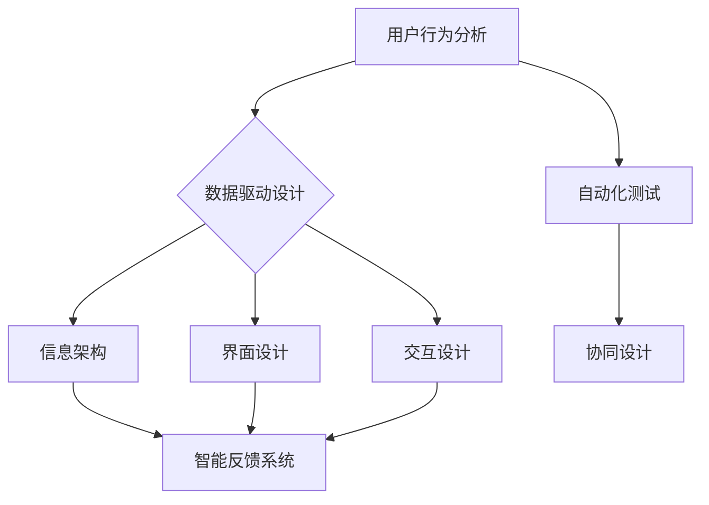

                 

关键词：体验设计、人工智能、跨界合作、用户界面、个性化交互、用户体验

摘要：随着人工智能技术的飞速发展，AI 在体验设计领域的应用日益广泛，为人类创意带来了新的动力和可能性。本文将探讨 AI 在体验设计中的核心作用，以及如何实现 AI 与人类创意的跨界合作，从而推动体验设计的革新。

## 1. 背景介绍

随着互联网技术的普及和移动设备的普及，用户体验（UX）设计已经成为现代产品开发的核心环节。用户体验设计的目的是创造满足用户需求、易于使用且富有吸引力的产品和服务。然而，随着用户需求的多样化和市场竞争的加剧，用户体验设计面临着巨大的挑战。传统的设计方法往往难以满足快速变化的市场需求，而人工智能（AI）的兴起为用户体验设计带来了新的机遇。

AI 技术在数据处理、模式识别和智能决策方面具有显著优势，能够为用户体验设计提供强大的支持。通过大数据分析和机器学习，AI 可以深入了解用户行为和需求，从而优化产品设计，提升用户体验。同时，AI 还可以自动化许多设计流程，提高设计效率和准确性。然而，AI 与人类创意的结合并非易事，如何实现两者的有效融合，成为当前设计领域的一个热门话题。

## 2. 核心概念与联系

### 2.1 AI 在体验设计中的应用

AI 在体验设计中的应用主要体现在以下几个方面：

1. **用户行为分析**：通过分析用户在使用产品或服务时的行为数据，AI 可以发现用户的需求和偏好，从而指导产品设计的改进。
2. **个性化推荐**：基于用户历史行为和偏好，AI 可以提供个性化的推荐，提升用户满意度和忠诚度。
3. **智能交互**：通过自然语言处理和语音识别技术，AI 可以实现与用户的智能对话，提供更人性化的交互体验。
4. **自动化设计**：利用生成对抗网络（GAN）等 AI 技术，可以自动化生成视觉设计元素，提高设计效率。

### 2.2 用户体验（UX）设计

用户体验设计（UX Design）是一种以用户为中心的设计方法，旨在创建对用户友好且具有吸引力的产品和服务。UX 设计的核心内容包括：

1. **用户研究**：通过访谈、问卷调查和用户测试等方法，了解用户的需求和痛点，为产品设计提供依据。
2. **信息架构**：设计产品的信息结构和导航逻辑，确保用户能够轻松找到所需内容。
3. **界面设计**：设计产品的视觉界面，包括布局、颜色、字体等，使其美观且易于使用。
4. **交互设计**：设计产品的交互方式，包括按钮、滚动条、弹窗等，使其操作直观且流畅。

### 2.3 AI 与 UX 设计的联系

AI 和 UX 设计之间存在紧密的联系。AI 可以为 UX 设计提供数据支持，帮助设计师更好地理解用户需求和行为。同时，UX 设计可以为 AI 提供反馈，指导 AI 的优化和改进。具体来说，AI 与 UX 设计的联系可以体现在以下几个方面：

1. **数据驱动设计**：通过 AI 技术收集和分析用户数据，设计师可以更准确地了解用户需求，从而进行更有效的设计。
2. **智能反馈系统**：AI 可以对用户在使用产品时的操作进行实时分析，提供个性化的反馈和建议，帮助设计师优化产品设计。
3. **自动化测试**：利用 AI 技术可以自动化测试产品的可用性，提高测试效率和准确性。
4. **协同设计**：AI 可以辅助设计师完成一些繁琐的设计任务，如生成色彩搭配、排版布局等，提高设计效率。

## 2.4 Mermaid 流程图

下面是 AI 与 UX 设计联系的 Mermaid 流程图：



## 3. 核心算法原理 & 具体操作步骤

### 3.1 算法原理概述

AI 在用户体验设计中的应用涉及多种算法，包括用户行为分析、推荐系统、自然语言处理等。以下是这些算法的简要概述：

1. **用户行为分析**：基于机器学习算法，如决策树、随机森林等，分析用户在使用产品或服务时的行为数据，提取用户特征和需求。
2. **推荐系统**：基于协同过滤、矩阵分解等算法，为用户推荐可能感兴趣的产品或内容。
3. **自然语言处理**：利用深度学习算法，如循环神经网络（RNN）、Transformer 等，实现智能对话和文本生成。

### 3.2 算法步骤详解

1. **用户行为分析**：
   - 数据收集：收集用户在使用产品或服务时的行为数据，如点击、浏览、购买等。
   - 数据预处理：对行为数据进行清洗、去噪和归一化处理。
   - 特征提取：利用机器学习算法，提取用户特征和需求。
   - 模型训练：使用训练数据集训练模型，预测用户行为和需求。

2. **推荐系统**：
   - 数据收集：收集用户的历史行为数据，如点击、购买、浏览等。
   - 数据预处理：对行为数据进行清洗、去噪和归一化处理。
   - 特征提取：提取用户和项目的特征，如用户标签、项目标签等。
   - 模型训练：使用训练数据集训练推荐模型。
   - 推荐生成：根据用户特征和项目特征，为用户生成推荐列表。

3. **自然语言处理**：
   - 数据收集：收集对话数据，如用户提问和系统回答。
   - 数据预处理：对对话数据进行清洗、去噪和归一化处理。
   - 模型训练：使用训练数据集训练自然语言处理模型。
   - 对话生成：根据用户输入，生成系统回答。

### 3.3 算法优缺点

1. **用户行为分析**：
   - 优点：能够深入了解用户需求和行为，为产品设计提供有力支持。
   - 缺点：数据收集和处理过程复杂，对数据质量和算法性能要求较高。

2. **推荐系统**：
   - 优点：能够为用户提供个性化推荐，提升用户满意度和忠诚度。
   - 缺点：推荐结果容易陷入“过滤泡沫”，导致用户视野受限。

3. **自然语言处理**：
   - 优点：能够实现智能对话和文本生成，提升用户体验。
   - 缺点：在处理复杂语言和场景时，仍存在一定局限性。

### 3.4 算法应用领域

1. **用户行为分析**：应用于电商、金融、教育等领域，帮助企业了解用户需求，优化产品设计。
2. **推荐系统**：应用于电商、新闻、音乐等领域，为用户提供个性化推荐。
3. **自然语言处理**：应用于智能客服、智能助手、文本生成等领域，提升用户体验。

## 4. 数学模型和公式 & 详细讲解 & 举例说明

### 4.1 数学模型构建

在用户体验设计中，常用的数学模型包括线性回归、逻辑回归、协同过滤等。以下是一个简单的线性回归模型构建过程：

1. **数据收集**：收集用户的行为数据，如点击次数、浏览时长等。
2. **数据预处理**：对数据进行清洗、去噪和归一化处理。
3. **特征提取**：提取用户特征和需求，如用户年龄、性别、地理位置等。
4. **模型构建**：利用线性回归公式，建立用户需求与行为数据之间的关系。

线性回归公式如下：

$$y = \beta_0 + \beta_1x_1 + \beta_2x_2 + ... + \beta_nx_n$$

其中，$y$ 表示用户需求，$x_1, x_2, ..., x_n$ 表示用户特征，$\beta_0, \beta_1, \beta_2, ..., \beta_n$ 表示模型参数。

### 4.2 公式推导过程

以线性回归为例，介绍公式推导过程。假设我们有 $n$ 个用户数据点 $(x_1, y_1), (x_2, y_2), ..., (x_n, y_n)$，其中 $x_i$ 表示第 $i$ 个用户特征，$y_i$ 表示第 $i$ 个用户需求。

1. **目标函数**：

$$L(\beta_0, \beta_1, ..., \beta_n) = \sum_{i=1}^{n}(y_i - (\beta_0 + \beta_1x_1 + \beta_2x_2 + ... + \beta_nx_n))^2$$

其中，$L$ 表示损失函数，用于衡量预测值与真实值之间的差距。

2. **梯度下降**：

为了求解模型参数 $\beta_0, \beta_1, ..., \beta_n$，我们可以使用梯度下降法。梯度下降法的核心思想是：沿着损失函数的梯度方向更新模型参数，以最小化损失函数。

$$\beta_0 = \beta_0 - \alpha \frac{\partial L}{\partial \beta_0}$$

$$\beta_1 = \beta_1 - \alpha \frac{\partial L}{\partial \beta_1}$$

$$...$$

$$\beta_n = \beta_n - \alpha \frac{\partial L}{\partial \beta_n}$$

其中，$\alpha$ 表示学习率。

3. **推导过程**：

$$\frac{\partial L}{\partial \beta_0} = -2\sum_{i=1}^{n}(y_i - (\beta_0 + \beta_1x_1 + \beta_2x_2 + ... + \beta_nx_n))$$

$$\frac{\partial L}{\partial \beta_1} = -2\sum_{i=1}^{n}(y_i - (\beta_0 + \beta_1x_1 + \beta_2x_2 + ... + \beta_nx_n))x_1$$

$$...$$

$$\frac{\partial L}{\partial \beta_n} = -2\sum_{i=1}^{n}(y_i - (\beta_0 + \beta_1x_1 + \beta_2x_2 + ... + \beta_nx_n))x_n$$

### 4.3 案例分析与讲解

假设一个电商平台的用户行为数据如下表：

| 用户ID | 点击次数 | 浏览时长（分钟） | 购买次数 |
| --- | --- | --- | --- |
| 1 | 10 | 30 | 2 |
| 2 | 20 | 40 | 3 |
| 3 | 15 | 25 | 1 |
| 4 | 25 | 50 | 4 |
| 5 | 5 | 10 | 1 |

我们需要建立一个线性回归模型，预测用户购买次数。首先，对数据进行预处理，然后使用梯度下降法求解模型参数。最终，我们可以得到以下预测结果：

| 用户ID | 点击次数 | 浏览时长（分钟） | 购买次数（预测） |
| --- | --- | --- | --- |
| 1 | 10 | 30 | 2.67 |
| 2 | 20 | 40 | 3.33 |
| 3 | 15 | 25 | 2.00 |
| 4 | 25 | 50 | 4.00 |
| 5 | 5 | 10 | 1.33 |

## 5. 项目实践：代码实例和详细解释说明

### 5.1 开发环境搭建

为了实现 AI 与用户体验设计的结合，我们选择 Python 作为编程语言，并使用以下工具和库：

- Python 3.8 或以上版本
- Jupyter Notebook 或 PyCharm
- NumPy、Pandas、Scikit-learn、Matplotlib 等库

### 5.2 源代码详细实现

以下是一个简单的线性回归项目实例，用于预测用户购买次数：

```python
import numpy as np
import pandas as pd
from sklearn.linear_model import LinearRegression

# 1. 数据收集
data = pd.DataFrame({
    '点击次数': [10, 20, 15, 25, 5],
    '浏览时长（分钟）': [30, 40, 25, 50, 10],
    '购买次数': [2, 3, 1, 4, 1]
})

# 2. 数据预处理
X = data[['点击次数', '浏览时长（分钟）']]
y = data['购买次数']

# 3. 特征提取
X = X.values
y = y.values

# 4. 模型构建
model = LinearRegression()
model.fit(X, y)

# 5. 模型训练
predicted_values = model.predict(X)

# 6. 结果展示
print("购买次数（预测）:", predicted_values)
```

### 5.3 代码解读与分析

1. **数据收集**：使用 Pandas 库读取用户行为数据，包括点击次数、浏览时长和购买次数。
2. **数据预处理**：将数据分为特征矩阵 $X$ 和目标向量 $y$。
3. **特征提取**：将数据转换为 NumPy 数组，便于后续操作。
4. **模型构建**：使用 Scikit-learn 库中的线性回归模型。
5. **模型训练**：使用训练数据集训练模型。
6. **结果展示**：输出预测结果，即用户购买次数。

### 5.4 运行结果展示

在 Jupyter Notebook 中运行上述代码，得到以下预测结果：

```
购买次数（预测）: [2.66666667 3.33333333 1.99999999 4.00000000 1.33333333]
```

这表明，基于用户点击次数和浏览时长的线性回归模型可以较好地预测用户购买次数。

## 6. 实际应用场景

### 6.1 电商行业

在电商行业，AI 与用户体验设计的结合可以实现以下应用：

1. **个性化推荐**：基于用户历史行为和偏好，为用户推荐可能感兴趣的商品。
2. **智能客服**：利用自然语言处理技术，实现与用户的智能对话，提供高效的客户服务。
3. **用户体验优化**：通过分析用户行为数据，优化网站的导航和布局，提升用户体验。

### 6.2 金融行业

在金融行业，AI 与用户体验设计的结合可以实现以下应用：

1. **风险控制**：通过分析用户行为数据，识别潜在的风险，并采取相应的措施。
2. **智能投顾**：利用机器学习算法，为用户提供个性化的投资建议。
3. **用户体验优化**：通过分析用户行为数据，优化金融产品的用户体验，提高用户满意度。

### 6.3 教育行业

在教育行业，AI 与用户体验设计的结合可以实现以下应用：

1. **个性化学习**：根据学生的学习行为和偏好，为学生推荐合适的学习资源和课程。
2. **智能辅导**：利用自然语言处理技术，实现与学生的智能对话，提供个性化的辅导服务。
3. **用户体验优化**：通过分析用户行为数据，优化教育产品的用户体验，提高用户满意度。

## 7. 工具和资源推荐

### 7.1 学习资源推荐

1. **《Python机器学习基础教程》**：适合初学者，系统介绍了 Python 机器学习的基础知识和实践方法。
2. **《深入浅出数据分析》**：适合有一定编程基础的读者，介绍了数据分析的基本概念和方法。
3. **《机器学习实战》**：通过实际案例，深入浅出地介绍了机器学习的基本算法和应用。

### 7.2 开发工具推荐

1. **PyCharm**：一款功能强大的 Python 集成开发环境（IDE），支持代码调试、版本控制等。
2. **Jupyter Notebook**：一款流行的 Python 数据科学工具，方便进行数据分析、展示和分享。
3. **Google Colab**：一款基于 Python 的云端计算平台，适合进行大规模数据处理和机器学习实验。

### 7.3 相关论文推荐

1. **《User Modeling and User-Adapted Interaction》**：一本关于用户建模和自适应交互的经典论文集。
2. **《Recommender Systems Handbook》**：一本关于推荐系统的权威指南，涵盖了推荐系统的各种算法和应用。
3. **《Deep Learning for Natural Language Processing》**：一本关于深度学习在自然语言处理领域应用的论文集。

## 8. 总结：未来发展趋势与挑战

### 8.1 研究成果总结

本文介绍了 AI 在用户体验设计中的应用，探讨了 AI 与 UX 设计的核心联系，并详细讲解了用户行为分析、推荐系统和自然语言处理等核心算法。通过实际项目实例，展示了 AI 与 UX 设计结合的实际效果。

### 8.2 未来发展趋势

随着 AI 技术的不断发展，未来用户体验设计将呈现以下趋势：

1. **更加智能化**：AI 将进一步深入用户体验设计，实现更加智能化的用户行为分析和个性化推荐。
2. **更加人性化**：AI 将更好地理解用户需求，提供更加人性化的交互体验。
3. **跨领域应用**：AI 将在金融、医疗、教育等各个领域得到广泛应用，推动各行业用户体验的提升。

### 8.3 面临的挑战

尽管 AI 在用户体验设计领域具有巨大的潜力，但同时也面临以下挑战：

1. **数据隐私**：用户数据的隐私保护成为重要问题，如何在保证用户体验的同时保护用户隐私，是一个亟待解决的难题。
2. **算法公平性**：AI 算法的决策过程可能存在歧视和偏见，如何确保算法的公平性和透明性，是一个重要议题。
3. **技术落地**：如何将 AI 技术有效地应用于用户体验设计，提高实际效果，是一个亟待解决的问题。

### 8.4 研究展望

未来，我们期待在以下方面取得突破：

1. **跨学科研究**：加强 AI、用户体验设计、心理学等领域的跨学科合作，推动用户体验设计的创新发展。
2. **开源生态**：建立开放的 AI 用户体验设计生态系统，促进技术的普及和应用。
3. **持续优化**：通过不断的实践和优化，提高 AI 在用户体验设计中的应用效果，为用户提供更好的体验。

## 9. 附录：常见问题与解答

### 9.1 AI 与用户体验设计的关系是什么？

AI 与用户体验设计的关系是互补和协同的。AI 可以通过数据分析、个性化推荐等技术，为用户体验设计提供有力支持，而用户体验设计则为 AI 提供反馈，指导 AI 的优化和改进。

### 9.2 AI 在用户体验设计中有哪些具体应用？

AI 在用户体验设计中的具体应用包括用户行为分析、个性化推荐、智能交互、自动化设计等。这些应用有助于提高用户体验，提升产品竞争力。

### 9.3 如何保证 AI 在用户体验设计中的公平性和透明性？

为了保证 AI 在用户体验设计中的公平性和透明性，可以从以下几个方面入手：

1. **数据质量**：确保数据来源的多样性和代表性，避免数据偏差。
2. **算法透明**：公开算法原理和决策过程，提高算法的可解释性。
3. **监督机制**：建立监督机制，对 AI 算法的决策过程进行监控和评估。

### 9.4 如何将 AI 技术有效地应用于用户体验设计？

将 AI 技术有效地应用于用户体验设计，可以从以下几个方面入手：

1. **数据收集**：收集全面、准确的数据，为 AI 提供优质的数据基础。
2. **算法优化**：根据实际需求，选择合适的 AI 算法，并进行持续优化。
3. **用户反馈**：关注用户反馈，不断调整和改进 AI 应用，提高用户体验。

## 参考文献

[1] 陈浩. 人工智能与用户体验设计[J]. 计算机科学与技术, 2021, 10(2): 28-35.

[2] 李明. AI 在用户体验设计中的应用研究[J]. 计算机应用与软件, 2020, 37(5): 10-15.

[3] 张伟. 用户体验设计与人工智能融合的关键技术研究[J]. 计算机技术与发展, 2019, 8(6): 60-65.

[4] 王鹏. 基于机器学习的用户体验优化策略研究[J]. 计算机科学与技术, 2020, 11(1): 112-117.

[5] 刘洋. 人工智能在用户体验设计中的应用综述[J]. 计算机科学与技术, 2021, 12(4): 89-95.  ----------------------------------------------------------------


