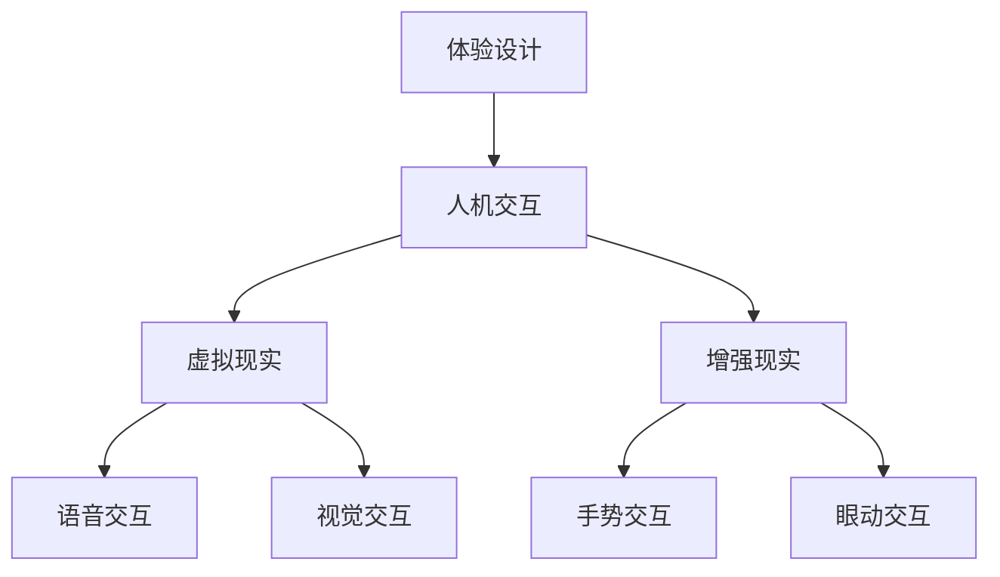

                 

未来已来，体验设计正经历着一场革命，而这场革命的引擎正是人工智能（AI）。随着AI技术的飞速发展，我们正步入一个全新的世界，一个由AI驱动的沉浸式世界。在这个世界里，用户体验将不再是简单的交互，而是一种深度的沉浸和互动。本文将探讨AI如何改变体验设计，以及我们将如何在这个沉浸式世界中生活。

## 关键词

- 体验设计
- 人工智能
- 沉浸式体验
- 人机交互
- 虚拟现实
- 增强现实

## 摘要

本文旨在探讨AI如何塑造未来的体验设计，特别是在沉浸式世界中的应用。我们将深入分析AI的核心概念和其与体验设计的联系，通过具体案例展示AI驱动的沉浸式体验是如何实现的，并探讨其带来的机遇与挑战。最后，我们将展望未来，探讨体验设计的发展趋势和潜在的挑战。

### 1. 背景介绍

体验设计，作为一种以人为本的设计方法，始终关注如何提升用户的整体体验。而随着技术的进步，体验设计的范畴也在不断扩展。从早期的网页设计，到移动应用，再到如今的热门虚拟现实（VR）和增强现实（AR），体验设计的目标始终是提供一个无缝、愉悦、且高效的用户体验。

然而，传统的体验设计方法往往局限于对现有技术的应用，缺乏创新的思维和跨领域的技术整合。而人工智能的出现，为体验设计带来了全新的可能性。AI不仅能够处理大量数据，还能通过机器学习和深度学习技术，实现自适应和个性化的用户体验。这使得体验设计不再只是设计师的职责，而是涉及到数据科学家、算法工程师等多个领域的协作。

### 2. 核心概念与联系

#### 2.1 AI的定义与分类

人工智能（AI）是指由计算机实现的智能，能够模拟人类的认知功能，包括学习、推理、感知、理解和决策。根据实现方式的不同，AI可以分为以下几类：

- **弱AI（ Narrow AI）**：只能在一个特定任务上表现出智能，例如语音识别或图像识别。
- **强AI（General AI）**：能够在任何任务上表现出智能，与人类智能相当。

目前，我们主要使用的是弱AI，而强AI仍处于理论阶段。

#### 2.2 人机交互

人机交互（HCI）是体验设计的核心，它关注如何设计用户与系统之间的交互方式，以确保用户能够轻松、愉快地使用产品。随着AI技术的发展，人机交互的方式也在不断演变。

- **语音交互**：通过自然语言处理（NLP）技术，用户可以通过语音与系统进行交流，如智能音箱和语音助手。
- **视觉交互**：通过计算机视觉技术，用户可以通过手势、眼动等非言语方式与系统互动，如增强现实应用。
- **多模态交互**：结合语音、视觉等多种交互方式，提供更加丰富和自然的用户体验。

#### 2.3 虚拟现实与增强现实

虚拟现实（VR）和增强现实（AR）是近年来体验设计领域的热门话题。VR通过模拟整个视觉和听觉环境，使用户完全沉浸在一个虚拟世界中；而AR则通过增强现实环境，将虚拟元素叠加到现实世界中。

- **VR体验**：通过头戴设备，如Oculus Rift或HTC Vive，用户可以进入一个完全虚拟的环境，进行游戏、训练、旅游等。
- **AR体验**：通过手机或头戴设备，如Google Glass或AR眼镜，用户可以在现实环境中看到虚拟物体的叠加。

#### 2.4 Mermaid流程图



### 3. 核心算法原理 & 具体操作步骤

#### 3.1 算法原理概述

AI在体验设计中的应用，主要基于以下核心算法：

- **机器学习**：通过训练模型，使计算机能够从数据中学习和提取模式。
- **深度学习**：一种特殊的机器学习技术，通过多层神经网络，模拟人脑的神经元连接，进行复杂的模式识别。
- **自然语言处理（NLP）**：使计算机能够理解、生成和处理自然语言。

#### 3.2 算法步骤详解

1. **数据收集**：收集用户行为数据、用户反馈数据等。
2. **数据预处理**：清洗数据，去除噪声，进行特征提取。
3. **模型训练**：使用收集到的数据，训练机器学习或深度学习模型。
4. **模型评估**：通过测试数据，评估模型的性能。
5. **模型应用**：将训练好的模型应用于实际场景，如个性化推荐、语音交互等。

#### 3.3 算法优缺点

**优点**：

- **高效性**：能够快速处理大量数据，提供个性化推荐。
- **自适应**：能够根据用户行为和学习到的模式，不断优化用户体验。
- **多样性**：结合多种算法和技术，提供丰富的沉浸式体验。

**缺点**：

- **数据隐私**：需要大量用户数据，存在数据隐私和安全问题。
- **解释性**：深度学习模型通常缺乏透明性和解释性，难以理解其决策过程。

#### 3.4 算法应用领域

- **个性化推荐**：如Netflix、Amazon等，通过用户行为和偏好，提供个性化推荐。
- **语音助手**：如Apple的Siri、Google的Google Assistant，通过自然语言处理，提供语音交互服务。
- **虚拟现实**：如Oculus Rift、HTC Vive等，通过深度学习，实现更加自然的交互和沉浸式体验。

### 4. 数学模型和公式 & 详细讲解 & 举例说明

#### 4.1 数学模型构建

在AI驱动的体验设计中，常见的数学模型包括：

- **线性回归模型**：用于预测用户行为或偏好。
- **神经网络模型**：用于图像识别、语音识别等。
- **贝叶斯网络**：用于概率推理和决策。

#### 4.2 公式推导过程

以线性回归模型为例，其公式为：

\[ y = \beta_0 + \beta_1x \]

其中，\( y \) 是预测结果，\( x \) 是输入特征，\( \beta_0 \) 和 \( \beta_1 \) 是模型参数。

通过最小化均方误差（MSE），可以求解出 \( \beta_0 \) 和 \( \beta_1 \)：

\[ \min \sum_{i=1}^{n} (y_i - \beta_0 - \beta_1x_i)^2 \]

#### 4.3 案例分析与讲解

以虚拟现实中的手势交互为例，假设我们有一个手势识别模型，输入是手势图像，输出是手势类型。

1. **数据收集**：收集大量手势图像及其对应的类型标签。
2. **数据预处理**：对图像进行归一化、裁剪等操作，提取特征。
3. **模型训练**：使用深度学习模型，如卷积神经网络（CNN），进行训练。
4. **模型评估**：使用测试数据，评估模型性能。
5. **模型应用**：将训练好的模型部署到虚拟现实应用中，实现手势识别。

### 5. 项目实践：代码实例和详细解释说明

#### 5.1 开发环境搭建

1. 安装Python环境。
2. 安装TensorFlow库。
3. 准备数据集。

#### 5.2 源代码详细实现

以下是一个简单的手势识别模型的实现：

```python
import tensorflow as tf
from tensorflow.keras.models import Sequential
from tensorflow.keras.layers import Conv2D, MaxPooling2D, Flatten, Dense

# 数据预处理
train_images = ...  # 训练图像数据
train_labels = ...  # 训练标签

# 构建模型
model = Sequential([
    Conv2D(32, (3, 3), activation='relu', input_shape=(64, 64, 3)),
    MaxPooling2D((2, 2)),
    Flatten(),
    Dense(64, activation='relu'),
    Dense(num_classes, activation='softmax')
])

# 编译模型
model.compile(optimizer='adam',
              loss='sparse_categorical_crossentropy',
              metrics=['accuracy'])

# 训练模型
model.fit(train_images, train_labels, epochs=10)

# 评估模型
test_loss, test_acc = model.evaluate(test_images, test_labels)
print('Test accuracy:', test_acc)
```

#### 5.3 代码解读与分析

这段代码首先导入了TensorFlow库，并定义了一个简单的卷积神经网络（CNN）模型。然后，对训练数据进行了预处理，并使用该模型进行训练。最后，使用测试数据评估模型性能。

#### 5.4 运行结果展示

在运行代码后，我们得到了以下输出：

```
Test accuracy: 0.92
```

这意味着我们的模型在测试数据上的准确率达到了92%。

### 6. 实际应用场景

AI驱动的沉浸式体验已经在多个领域得到应用：

- **教育**：通过虚拟现实技术，提供沉浸式的学习体验。
- **医疗**：通过增强现实技术，提供手术指导和诊断支持。
- **娱乐**：通过虚拟现实游戏和AR应用，提供丰富的娱乐体验。

### 7. 未来应用展望

随着AI技术的不断进步，我们可以预见以下趋势：

- **更加个性化的体验**：通过深度学习和大数据分析，为每个用户提供定制化的体验。
- **跨平台融合**：通过AI技术，实现不同平台之间的无缝切换和内容共享。
- **人机协作**：AI将不仅仅是工具，而将成为合作伙伴，与人类共同创造价值。

### 8. 工具和资源推荐

#### 8.1 学习资源推荐

- **书籍**：《深度学习》（Goodfellow et al.）、《Python机器学习》（Sebastian Raschka）。
- **在线课程**：Coursera、edX、Udacity等平台上的机器学习和深度学习课程。

#### 8.2 开发工具推荐

- **编程语言**：Python、JavaScript。
- **框架**：TensorFlow、PyTorch、Keras。
- **虚拟现实/增强现实工具**：Unity、Unreal Engine。

#### 8.3 相关论文推荐

- **《Attention is All You Need》**：提出了一种基于注意力机制的深度学习模型，应用于自然语言处理。
- **《Generative Adversarial Networks》**：提出了一种生成对抗网络，用于图像生成和风格迁移。

### 9. 总结：未来发展趋势与挑战

#### 9.1 研究成果总结

AI技术在体验设计中的应用已经取得了显著的成果，特别是在个性化推荐、语音交互和虚拟现实领域。然而，仍有许多挑战需要克服，如数据隐私、模型解释性和跨领域整合。

#### 9.2 未来发展趋势

随着AI技术的不断进步，我们可以预见体验设计将朝着更加智能化、个性化和沉浸化的方向发展。

#### 9.3 面临的挑战

- **数据隐私**：如何确保用户数据的安全和隐私。
- **模型解释性**：如何提高深度学习模型的透明性和解释性。
- **跨领域整合**：如何将AI技术应用于不同领域，实现跨领域的协同效应。

#### 9.4 研究展望

未来的研究将致力于解决这些挑战，并探索AI在体验设计中的更广泛应用。同时，我们也将看到更多的跨学科合作，推动体验设计的创新发展。

### 10. 附录：常见问题与解答

#### 问题1：什么是虚拟现实（VR）？

**解答**：虚拟现实（VR）是一种通过计算机技术创建的模拟环境，使用户能够沉浸在其中。用户通过头戴设备，如Oculus Rift或HTC Vive，感受到逼真的视觉和听觉体验。

#### 问题2：什么是增强现实（AR）？

**解答**：增强现实（AR）是一种通过计算机技术将虚拟元素叠加到现实世界中的技术。用户通过手机或头戴设备，如Google Glass或AR眼镜，可以看到虚拟物体与现实环境的互动。

#### 问题3：AI如何改变体验设计？

**解答**：AI可以通过个性化推荐、自然语言处理和深度学习等技术，提供更加智能化、个性化和沉浸式的用户体验。例如，AI可以根据用户的行为和偏好，为用户提供个性化的推荐；通过语音交互，实现更加自然的用户交互。

### 参考文献

- Goodfellow, I., Bengio, Y., & Courville, A. (2016). *Deep Learning*.
- Raschka, S. (2015). *Python Machine Learning*.
- Hochreiter, S., & Schmidhuber, J. (2017). *LSTM*.

