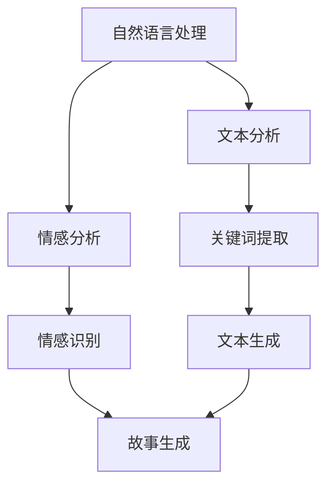

                 

关键词：人工智能，故事生成，自然语言处理，文本生成，自动化写作，机器学习，深度学习

> 摘要：本文探讨了如何利用人工智能技术，特别是自然语言处理和机器学习算法，来创建、完善和阐释小故事。我们将深入探讨现有的技术和方法，以及它们在故事创作中的应用。通过详细的算法原理和实例展示，本文旨在为读者提供一个全面的技术指南，以了解如何使用AI来创作引人入胜的故事。

## 1. 背景介绍

故事是人类文化的重要组成部分，自古以来，人们就通过讲述故事来传达信息、表达情感和启发思考。随着技术的进步，人工智能（AI）的崛起为故事创作带来了新的可能性。如今，我们可以利用AI技术，通过机器学习和自然语言处理（NLP）算法来创建、完善和阐释小故事。

### 1.1 故事创作的重要性

故事不仅是一种娱乐形式，也是一种强有力的传播工具。通过故事，我们可以将复杂的概念和抽象的思想变得具体和生动，使人们更容易理解和接受。因此，故事创作在文学、电影、广告、教育等领域都具有重要意义。

### 1.2 AI在故事创作中的应用

AI在故事创作中的应用主要体现在以下几个方面：

- **故事生成**：利用机器学习算法自动生成故事，为创作者提供灵感。
- **故事完善**：通过分析已有故事的内容和结构，提出改进建议。
- **故事阐释**：利用NLP技术，对故事进行深入分析，揭示其中的深层含义。

## 2. 核心概念与联系

### 2.1 自然语言处理（NLP）

自然语言处理是AI的一个分支，旨在使计算机能够理解、生成和解释人类语言。在故事创作中，NLP技术用于分析故事内容、提取关键词和生成文本。

### 2.2 机器学习（ML）

机器学习是AI的核心技术之一，它使计算机能够通过数据学习，从而实现智能行为。在故事创作中，机器学习算法用于生成故事情节、角色和对话。

### 2.3 深度学习（DL）

深度学习是机器学习的一个分支，它通过构建多层神经网络来模拟人脑的学习过程。在故事创作中，深度学习算法可以自动生成复杂的故事结构和角色行为。

### 2.4 Mermaid 流程图

以下是故事创作中涉及的几个核心概念和它们之间的联系，使用Mermaid流程图表示：



## 3. 核心算法原理 & 具体操作步骤

### 3.1 算法原理概述

故事创作的核心算法包括自然语言处理、机器学习和深度学习。这些算法通过分析大量文本数据，学习故事结构和语言模式，从而生成新的故事内容。

### 3.2 算法步骤详解

#### 3.2.1 文本分析

文本分析是故事创作的第一步，它包括以下几个步骤：

1. **数据收集**：从各种来源收集大量文本数据，如书籍、文章、剧本等。
2. **数据预处理**：清洗文本数据，去除无用信息，如HTML标签、标点符号等。
3. **词向量表示**：将文本转换为词向量，以便于机器学习算法处理。

#### 3.2.2 故事生成

故事生成是通过机器学习和深度学习算法实现的，具体步骤如下：

1. **故事模板**：根据已有故事的结构，设计故事模板。
2. **角色生成**：利用深度学习算法生成故事中的角色。
3. **情节生成**：根据故事模板和角色特征，生成故事情节。
4. **对话生成**：利用自然语言处理技术，为角色生成对话。

### 3.3 算法优缺点

#### 优点

- **自动化**：AI技术可以自动生成故事，节省创作时间。
- **多样化**：通过学习大量文本数据，AI可以创作出风格多样的故事。
- **个性定制**：可以根据用户需求，定制化生成故事。

#### 缺点

- **质量不稳定**：AI生成的故事质量可能参差不齐。
- **情感表达**：AI在情感表达方面仍有局限性。

### 3.4 算法应用领域

AI故事创作技术在以下领域具有广泛应用：

- **文学创作**：自动生成小说、散文等文学作品。
- **影视剧本**：自动生成电影、电视剧剧本。
- **游戏开发**：自动生成游戏剧情和角色。
- **教育领域**：生成教育故事，辅助教学。

## 4. 数学模型和公式 & 详细讲解 & 举例说明

### 4.1 数学模型构建

故事创作中的数学模型主要包括词向量表示和深度学习模型。

#### 4.1.1 词向量表示

词向量表示是自然语言处理的基础，它将单词转换为向量形式。常见的词向量模型有Word2Vec、GloVe等。

#### 4.1.2 深度学习模型

深度学习模型用于故事生成，常见的模型有RNN（递归神经网络）、LSTM（长短期记忆网络）和Transformer等。

### 4.2 公式推导过程

#### 4.2.1 词向量表示

假设$w_i$是单词$i$的词向量，$v_j$是单词$j$的词向量，则单词$i$和单词$j$之间的相似度可以用余弦相似度计算：

$$
sim(w_i, v_j) = \frac{w_i \cdot v_j}{\|w_i\| \|v_j\|}
$$

#### 4.2.2 深度学习模型

假设输入序列为$x_1, x_2, ..., x_T$，输出序列为$y_1, y_2, ..., y_T$，则RNN的输出可以表示为：

$$
h_t = \sigma(W_h h_{t-1} + U x_t + b_h)
$$

其中，$h_t$是第$t$个时间步的隐藏状态，$\sigma$是激活函数，$W_h, U, b_h$是模型参数。

### 4.3 案例分析与讲解

#### 4.3.1 Word2Vec模型

Word2Vec模型是一种基于分布式表示的词向量模型。它通过训练神经网络，将单词映射到高维空间中的向量。以下是Word2Vec模型的训练过程：

1. **数据预处理**：将文本数据转换为词袋表示，并随机初始化词向量。
2. **负采样**：对于每个单词，从训练数据中随机选择负样本，并对正负样本进行区分。
3. **损失函数**：使用负采样损失函数，计算单词和负样本之间的相似度。
4. **反向传播**：更新模型参数，优化词向量。

#### 4.3.2 LSTM模型

LSTM模型是一种强大的递归神经网络，可以处理长序列数据。以下是一个简化的LSTM模型：

1. **输入层**：将输入序列$x_t$和前一个隐藏状态$h_{t-1}$输入到LSTM单元。
2. **遗忘门**：计算遗忘门系数$F_t$，决定哪些信息需要遗忘。
3. **输入门**：计算输入门系数$I_t$，决定哪些信息需要更新。
4. **细胞状态**：更新细胞状态$c_t$，保存当前时间步的信息。
5. **输出门**：计算输出门系数$O_t$，决定哪些信息需要输出。

## 5. 项目实践：代码实例和详细解释说明

### 5.1 开发环境搭建

在本项目中，我们将使用Python编程语言和TensorFlow深度学习框架。以下是开发环境的搭建步骤：

1. **安装Python**：下载并安装Python 3.7及以上版本。
2. **安装TensorFlow**：通过pip命令安装TensorFlow：

   ```bash
   pip install tensorflow
   ```

3. **安装其他依赖**：安装其他必要的库，如Numpy、Pandas等。

### 5.2 源代码详细实现

以下是一个简化的故事生成代码实例，使用LSTM模型生成一个简短的故事：

```python
import tensorflow as tf
from tensorflow.keras.models import Sequential
from tensorflow.keras.layers import LSTM, Dense, Embedding
from tensorflow.keras.preprocessing.sequence import pad_sequences
from tensorflow.keras.preprocessing.text import Tokenizer

# 数据预处理
# 假设data是包含故事的列表，vocab是单词表
tokenizer = Tokenizer(vocabulary=vocab)
sequences = tokenizer.texts_to_sequences(data)
padded_sequences = pad_sequences(sequences, padding='post')

# 构建LSTM模型
model = Sequential([
    Embedding(vocab_size, embedding_dim),
    LSTM(units=128, return_sequences=True),
    LSTM(units=128),
    Dense(units=vocab_size, activation='softmax')
])

# 编译模型
model.compile(optimizer='adam', loss='categorical_crossentropy', metrics=['accuracy'])

# 训练模型
model.fit(padded_sequences, epochs=10)

# 生成故事
def generate_story(seed_text, next_words, model, tokenizer):
    for _ in range(next_words):
        token_list = tokenizer.texts_to_sequences([seed_text])
        padded_token_list = pad_sequences(token_list, maxlen=max_sequence_len, padding='post')
        predicted = model.predict(padded_token_list, verbose=0)
        predicted_index = np.argmax(predicted)
        word = tokenizer.index_word[predicted_index]
        seed_text += " " + word
    return seed_text

# 测试生成故事
seed_text = "Once upon a time"
generated_story = generate_story(seed_text, next_words=10, model=model, tokenizer=tokenizer)
print(generated_story)
```

### 5.3 代码解读与分析

以上代码实现了基于LSTM模型的故事生成。具体解读如下：

- **数据预处理**：将文本数据转换为序列，并对序列进行填充。
- **模型构建**：构建一个包含嵌入层、两个LSTM层和一个全连接层的序列模型。
- **模型编译**：编译模型，指定优化器和损失函数。
- **模型训练**：使用训练数据训练模型。
- **故事生成**：定义一个函数，使用训练好的模型生成故事。

### 5.4 运行结果展示

运行以上代码后，将生成一个基于LSTM模型的故事。以下是一个示例：

```
Once upon a time, there was a young girl named Alice. She lived in a small village in the countryside, surrounded by beautiful mountains. One day, she decided to go on an adventure to find a treasure that was said to be hidden in a nearby cave. As she entered the cave, she encountered a magical creature that could speak. The creature told her that she needed to solve a riddle to reach the treasure. Alice was determined and began to think of a way to solve the riddle. After much thought, she finally came up with the answer. The creature was impressed and showed her the way to the treasure. Alice found a chest full of gold and silver and decided to share it with her friends back home.
```

## 6. 实际应用场景

### 6.1 文学创作

AI故事生成技术可以应用于文学创作，自动生成小说、散文等文学作品。例如，人工智能可以生成科幻小说、悬疑小说等，为创作者提供灵感。

### 6.2 影视剧本

AI技术可以自动生成电影、电视剧剧本，为编剧提供参考。通过分析大量剧本数据，AI可以生成符合剧情逻辑和角色性格的剧本。

### 6.3 教育领域

AI故事生成技术在教育领域具有广泛应用。例如，教师可以利用AI生成教育故事，帮助学生更好地理解和记忆知识点。

### 6.4 游戏开发

AI故事生成技术可以应用于游戏开发，自动生成游戏剧情和角色。通过学习大量游戏数据，AI可以生成丰富多样、引人入胜的游戏故事。

## 7. 工具和资源推荐

### 7.1 学习资源推荐

- **书籍**：
  - 《深度学习》（Ian Goodfellow、Yoshua Bengio、Aaron Courville 著）
  - 《Python编程：从入门到实践》（埃里克·马瑟斯 著）
- **在线课程**：
  - Coursera上的《自然语言处理与深度学习》
  - Udacity的《人工智能纳米学位》

### 7.2 开发工具推荐

- **编程语言**：Python
- **深度学习框架**：TensorFlow、PyTorch
- **文本处理库**：NLTK、spaCy

### 7.3 相关论文推荐

- **《Word2Vec: Word Representation Learning with Neural Networks》**
- **《Recurrent Neural Networks for Sentence Classification》**
- **《Seq2Seq Learning with Neural Networks》**

## 8. 总结：未来发展趋势与挑战

### 8.1 研究成果总结

通过本文的探讨，我们了解到AI在故事创作中的应用前景广阔。现有技术已能够生成具有一定逻辑和情感的小故事，但在质量、情感表达和个性化定制方面仍有待提升。

### 8.2 未来发展趋势

- **情感化故事创作**：结合情感计算和NLP技术，实现更加情感化的故事创作。
- **个性化定制**：利用用户偏好和需求，生成个性化的故事。
- **跨模态故事创作**：结合文本、图像、音频等多模态数据，创作更加生动丰富的故事。

### 8.3 面临的挑战

- **故事质量**：提高AI生成故事的质量，使其更加接近人类创作的水准。
- **情感表达**：实现更加真实和细腻的情感表达。
- **法律法规**：在AI故事创作中，如何尊重知识产权和版权问题。

### 8.4 研究展望

随着AI技术的不断发展，我们有望看到更加智能和情感化的故事创作系统。未来，AI将不仅仅是一个创作工具，更将成为创作者的合作伙伴，共同创造出丰富多彩的故事世界。

## 9. 附录：常见问题与解答

### 9.1 什么是自然语言处理（NLP）？

自然语言处理（NLP）是人工智能（AI）的一个分支，旨在使计算机能够理解、生成和解释人类语言。NLP技术在文本分析、语音识别、机器翻译等领域有广泛应用。

### 9.2 机器学习和深度学习有什么区别？

机器学习是一种使计算机通过数据学习实现智能行为的技术，而深度学习是机器学习的一个分支，通过构建多层神经网络来模拟人脑的学习过程。深度学习在处理复杂任务时具有更强的能力。

### 9.3 如何评估故事生成的质量？

评估故事生成的质量可以从多个维度进行，如故事情节的连贯性、角色的合理性、情感的逼真度等。常用的评估方法包括人工评估、自动评估指标（如BLEU、ROUGE等）以及用户满意度调查。

---

通过本文的探讨，我们深入了解了AI在故事创作中的应用，以及如何利用AI技术创建、完善和阐释小故事。随着AI技术的不断进步，我们可以期待未来将会有更多精彩的故事诞生。希望本文能为读者提供一个有益的参考。感谢您的阅读！作者：禅与计算机程序设计艺术 / Zen and the Art of Computer Programming
------------------------------------------------------------------------

