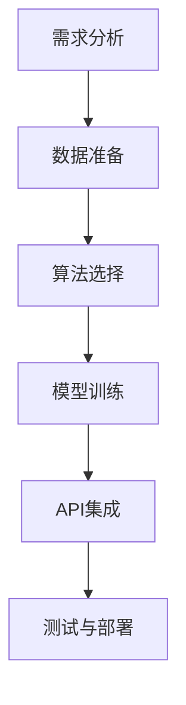

                 

在当今快速发展的技术时代，人工智能（AI）的应用已经渗透到了我们日常生活的方方面面。从智能家居到自动驾驶，从医疗诊断到金融分析，AI正在改变我们的生活方式和工作方式。然而，构建一个完整的AI应用并非易事，需要深厚的技术背景、大量的时间和资源。幸运的是，随着API（应用程序编程接口）的兴起，我们能够通过快速集成现成的服务来构建AI应用，极大地简化了开发流程。

本文将探讨如何使用API快速构建AI应用，从背景介绍、核心概念、算法原理、数学模型到实际应用，全面解析这个话题。最后，我们将展望未来AI应用的发展趋势和面临的挑战。

## 文章关键词

- 人工智能（AI）
- 应用程序编程接口（API）
- 快速构建
- AI服务
- 开发工具

## 文章摘要

本文旨在介绍如何利用API快速构建AI应用。首先，我们将回顾AI和API的发展历程及其重要性。随后，我们将探讨AI应用的构建过程，包括核心概念和算法原理。接着，我们将深入讨论数学模型和具体的应用场景。最后，我们将总结未来AI应用的发展趋势和面临的挑战。

## 1. 背景介绍

### 1.1 人工智能的发展历程

人工智能（Artificial Intelligence，简称AI）是一门旨在使计算机模拟人类智能行为的技术科学。自20世纪50年代起，AI经历了多个发展阶段，从最初的符号主义、基于规则的系统，到基于数据的机器学习和深度学习，再到如今的生成对抗网络（GAN）和强化学习（RL），每一次的进步都极大地扩展了AI的应用范围。

### 1.2  API的发展及其重要性

应用程序编程接口（API）是软件系统之间相互交互的接口和协议。API的兴起源于互联网的发展，它使得不同系统之间的数据交换和功能调用变得更加便捷和高效。API的重要性体现在以下几个方面：

1. **简化开发**：通过API，开发者可以复用已有的服务，避免从头开始编写繁琐的功能。
2. **加速创新**：API促进了开发者之间的合作，使得新的应用和服务能够更快地推向市场。
3. **降低成本**：使用API可以节省开发时间和资源，从而降低开发成本。
4. **数据共享**：API使得数据在不同系统之间的流动变得更加容易，为大数据分析和AI算法提供了丰富的数据资源。

### 1.3 AI应用的发展趋势

随着AI技术的不断成熟，AI应用正在各行各业得到广泛应用。以下是AI应用的一些发展趋势：

1. **智能化服务**：从语音助手、聊天机器人到智能客服，AI正在改变客户服务的方式。
2. **自动化生产**：在制造业中，AI用于预测维护、质量检测和生产线自动化，提高生产效率和产品质量。
3. **医疗健康**：AI在疾病诊断、药物研发和个性化治疗方面发挥着重要作用。
4. **金融科技**：AI用于风险控制、投资策略和智能投顾，提升金融服务的效率和准确性。
5. **安全防护**：AI用于网络安全、生物识别和智能监控，提高安全防护能力。

## 2. 核心概念与联系

### 2.1 AI与API的关系

AI与API的结合，使得构建AI应用变得更加高效和灵活。API为AI应用提供了数据源和功能接口，而AI则为API提供了智能分析能力。

### 2.2 AI应用构建流程

构建一个AI应用通常包括以下几个步骤：

1. **需求分析**：明确应用的目标和功能需求。
2. **数据准备**：收集和清洗数据，确保数据质量。
3. **算法选择**：根据应用需求选择合适的算法。
4. **模型训练**：使用历史数据训练模型。
5. **API集成**：将训练好的模型与API集成，提供接口供其他应用调用。
6. **测试与部署**：对AI应用进行测试，确保其稳定性和可靠性。

### 2.3 Mermaid流程图

下面是一个简化的AI应用构建流程的Mermaid流程图：



## 3. 核心算法原理 & 具体操作步骤

### 3.1 算法原理概述

AI应用的构建核心在于算法的选择和实现。常见的AI算法包括：

1. **机器学习算法**：如线性回归、决策树、支持向量机（SVM）等。
2. **深度学习算法**：如卷积神经网络（CNN）、循环神经网络（RNN）等。
3. **强化学习算法**：如Q学习、SARSA、深度Q网络（DQN）等。

### 3.2 算法步骤详解

以深度学习算法为例，其具体步骤如下：

1. **数据预处理**：对数据进行归一化、编码等处理，使其适合模型训练。
2. **模型构建**：定义神经网络结构，包括输入层、隐藏层和输出层。
3. **损失函数选择**：选择合适的损失函数，如均方误差（MSE）或交叉熵损失函数。
4. **优化器选择**：选择优化算法，如随机梯度下降（SGD）或Adam优化器。
5. **模型训练**：使用训练数据对模型进行迭代训练，直至达到设定的精度或迭代次数。
6. **模型评估**：使用验证集或测试集评估模型性能。
7. **模型部署**：将训练好的模型部署到API服务中，供其他应用调用。

### 3.3 算法优缺点

每种算法都有其优缺点，选择合适的算法取决于具体的应用需求。以下是几种常见算法的优缺点：

1. **机器学习算法**：
   - 优点：算法成熟，理论基础深厚，易于理解和实现。
   - 缺点：对大量数据进行依赖，训练时间较长，模型解释性较差。
2. **深度学习算法**：
   - 优点：能够处理复杂的非线性关系，模型性能优异，适应性强。
   - 缺点：算法复杂，参数众多，需要大量数据进行训练，模型解释性较差。
3. **强化学习算法**：
   - 优点：能够自主学习，适用于动态环境。
   - 缺点：训练过程不稳定，需要大量数据进行训练，模型解释性较差。

### 3.4 算法应用领域

不同的算法适用于不同的应用领域。例如：

1. **图像识别**：深度学习算法（如CNN）广泛应用于人脸识别、物体检测等。
2. **自然语言处理**：RNN和Transformer等算法在机器翻译、文本分类等方面表现出色。
3. **强化学习**：在游戏AI、自动驾驶等领域有着广泛的应用。

## 4. 数学模型和公式 & 详细讲解 & 举例说明

### 4.1 数学模型构建

在AI应用中，数学模型是核心。以下是一个简单的线性回归模型的数学模型构建：

1. **输入层**：定义输入特征向量 $X$。
2. **隐藏层**：定义权重矩阵 $W$ 和偏置向量 $b$。
3. **输出层**：定义输出值 $Y$。

数学公式如下：

$$
Y = X \cdot W + b
$$

其中，$X$ 是输入特征向量，$W$ 是权重矩阵，$b$ 是偏置向量，$Y$ 是输出值。

### 4.2 公式推导过程

线性回归模型的推导过程如下：

1. **损失函数**：选择均方误差（MSE）作为损失函数。

$$
Loss = \frac{1}{2} \sum_{i=1}^{n} (Y_i - \hat{Y_i})^2
$$

其中，$Y_i$ 是真实值，$\hat{Y_i}$ 是预测值。

2. **梯度下降**：使用梯度下降法来优化模型参数。

$$
\frac{\partial Loss}{\partial W} = X^T (Y - \hat{Y})
$$
$$
\frac{\partial Loss}{\partial b} = Y - \hat{Y}
$$

3. **迭代更新**：根据梯度更新模型参数。

$$
W \leftarrow W - \alpha \cdot \frac{\partial Loss}{\partial W}
$$
$$
b \leftarrow b - \alpha \cdot \frac{\partial Loss}{\partial b}
$$

其中，$\alpha$ 是学习率。

### 4.3 案例分析与讲解

以下是一个线性回归模型的案例：

假设我们有一个简单的线性回归问题，预测房价。输入特征是房屋面积，输出值是房价。数据集如下：

| 房屋面积 (平方米) | 房价 (万元) |
|------------------|-------------|
| 80               | 100         |
| 90               | 110         |
| 100              | 130         |
| 110              | 150         |
| 120              | 170         |

1. **数据预处理**：将数据分为训练集和测试集。
2. **模型构建**：定义输入层、隐藏层和输出层，初始化权重矩阵 $W$ 和偏置向量 $b$。
3. **模型训练**：使用训练集数据进行模型训练，优化权重矩阵 $W$ 和偏置向量 $b$。
4. **模型评估**：使用测试集数据评估模型性能。

通过以上步骤，我们得到一个简单的线性回归模型，可以用于预测新房屋的房价。这个模型虽然简单，但已经能够体现出AI的强大能力。

## 5. 项目实践：代码实例和详细解释说明

### 5.1 开发环境搭建

在本项目中，我们将使用Python和TensorFlow作为开发工具。首先，需要在计算机上安装Python和TensorFlow。以下是安装步骤：

1. 安装Python：

```bash
# 在Windows上
python -m pip install python
python -m ensurepip
python -m pip install --upgrade pip setuptools

# 在macOS和Linux上
sudo apt-get install python3-pip
```

2. 安装TensorFlow：

```bash
pip install tensorflow
```

### 5.2 源代码详细实现

以下是线性回归模型的代码实现：

```python
import numpy as np
import tensorflow as tf

# 数据预处理
X = np.array([[80], [90], [100], [110], [120]])
Y = np.array([[100], [110], [130], [150], [170]])

# 模型构建
W = tf.Variable(np.random.randn(), name='weights')
b = tf.Variable(np.random.randn(), name='bias')

def linear_regression(x):
    return x * W + b

# 损失函数
def loss(y_true, y_pred):
    return tf.reduce_mean(tf.square(y_true - y_pred))

# 优化器
optimizer = tf.optimizers.Adam()

# 梯度下降
def train(X, Y, epochs):
    for epoch in range(epochs):
        with tf.GradientTape() as tape:
            y_pred = linear_regression(X)
            loss_value = loss(Y, y_pred)
        
        gradients = tape.gradient(loss_value, [W, b])
        optimizer.apply_gradients(zip(gradients, [W, b]))
        
        if epoch % 10 == 0:
            print(f"Epoch {epoch}: Loss = {loss_value.numpy()}")
    
    return W.numpy(), b.numpy()

# 训练模型
W, b = train(X, Y, 100)

# 代码解读与分析
print(f"Weights: {W}, Bias: {b}")

# 运行结果展示
X_new = np.array([[95]])
y_pred = linear_regression(X_new)
print(f"Predicted Price: {y_pred.numpy()}")
```

### 5.3 代码解读与分析

上述代码实现了一个简单的线性回归模型，主要步骤如下：

1. **数据预处理**：将输入特征和输出值转化为NumPy数组。
2. **模型构建**：使用TensorFlow定义输入层、隐藏层和输出层，初始化权重矩阵 $W$ 和偏置向量 $b$。
3. **损失函数**：定义均方误差（MSE）作为损失函数。
4. **优化器**：选择Adam优化器进行梯度下降。
5. **训练模型**：使用训练数据对模型进行迭代训练，优化权重矩阵 $W$ 和偏置向量 $b$。
6. **代码解读与分析**：展示模型的权重矩阵 $W$ 和偏置向量 $b$。
7. **运行结果展示**：使用训练好的模型预测新房屋的房价。

## 6. 实际应用场景

### 6.1 智能家居

智能家居是AI应用的一个重要领域，通过API集成，可以实现以下功能：

- **智能监控**：利用图像识别API进行实时监控，识别异常行为。
- **智能控制**：通过语音识别API实现语音控制家居设备，如灯光、空调等。
- **数据分析**：利用数据挖掘API分析家居设备使用数据，优化设备运行效率。

### 6.2 医疗健康

医疗健康是AI应用的另一个重要领域，通过API集成，可以实现以下功能：

- **疾病诊断**：利用深度学习API对医学图像进行自动诊断，辅助医生做出诊断决策。
- **药物研发**：利用化学信息API和机器学习API加速药物研发过程。
- **健康监测**：利用传感器API实时监测患者健康数据，预警潜在的健康问题。

### 6.3 金融科技

金融科技是AI应用的一个快速发展领域，通过API集成，可以实现以下功能：

- **风险管理**：利用机器学习API进行风险评估，预测金融市场趋势。
- **智能投顾**：利用自然语言处理API和机器学习API为用户提供个性化的投资建议。
- **反欺诈**：利用深度学习API检测和防范金融欺诈行为。

## 7. 工具和资源推荐

### 7.1 学习资源推荐

- **《Python机器学习》**：由塞巴斯蒂安·拉斯维奇（Sebastian Raschka）所著，适合初学者入门机器学习和深度学习。
- **《深度学习》**：由伊恩·古德费洛（Ian Goodfellow）、约书亚·本吉奥（Yoshua Bengio）和 Aaron Courville 所著，是深度学习领域的经典教材。

### 7.2 开发工具推荐

- **TensorFlow**：Google开源的机器学习和深度学习框架，适用于各种规模的AI应用开发。
- **Keras**：基于TensorFlow的高级神经网络API，简化了深度学习模型的构建和训练过程。

### 7.3 相关论文推荐

- **“Deep Learning”**：由伊恩·古德费洛（Ian Goodfellow）等人撰写的深度学习综述文章。
- **“Reinforcement Learning: An Introduction”**：由理查德·萨顿（Richard Sutton）和安德鲁·巴（Andrew Barto）所著的强化学习入门教材。

## 8. 总结：未来发展趋势与挑战

### 8.1 研究成果总结

近年来，AI和API技术的快速发展，使得AI应用得以快速构建和部署。无论是智能家居、医疗健康还是金融科技，AI都发挥着越来越重要的作用。同时，深度学习、生成对抗网络和强化学习等算法的不断进步，也为AI应用提供了强大的技术支持。

### 8.2 未来发展趋势

未来，AI和API技术将继续发展，以下是几个发展趋势：

- **自动化与智能化**：AI将更多地应用于自动化流程和智能化服务，提高生产效率和用户体验。
- **边缘计算**：随着物联网（IoT）的发展，边缘计算将使AI应用更加实时和高效。
- **跨领域融合**：AI将与其他领域（如生物医学、能源等）深度融合，推动各领域的技术进步。

### 8.3 面临的挑战

尽管AI和API技术发展迅速，但仍面临以下挑战：

- **数据隐私与安全**：如何保护用户数据隐私和安全是AI应用的一个重要问题。
- **模型解释性**：如何提高AI模型的解释性，使人们能够理解模型的决策过程。
- **计算资源**：随着模型复杂性的增加，对计算资源的需求也在不断增长。

### 8.4 研究展望

未来，AI和API技术的发展将更加注重跨领域融合、自动化与智能化、以及数据隐私和安全等方面。研究人员将继续探索新的算法和技术，以应对AI应用中的各种挑战。

## 9. 附录：常见问题与解答

### 9.1 为什么要使用API快速构建AI应用？

使用API快速构建AI应用可以简化开发流程，降低成本，加速创新。通过API，开发者可以复用已有的服务和功能，避免从头开始编写繁琐的代码，从而节省时间和资源。

### 9.2 如何选择合适的算法？

选择合适的算法取决于具体的应用需求。常见的算法包括机器学习算法、深度学习算法和强化学习算法。对于需要处理大量数据和复杂关系的问题，深度学习算法通常表现更好；而对于需要实时决策的问题，强化学习算法可能更为适合。

### 9.3 如何确保数据质量？

确保数据质量是构建高质量AI应用的关键。数据清洗和预处理是确保数据质量的重要步骤，包括去除噪声、填补缺失值、归一化等。同时，数据标注和清洗工具的使用也可以提高数据质量。

### 9.4 如何提高模型解释性？

提高模型解释性是一个重要的研究方向。目前，有几种方法可以提高模型解释性，包括：

- **可视化**：通过可视化模型结构和决策过程，使人们能够理解模型的决策机制。
- **解释性算法**：选择具有解释性的算法，如决策树、线性回归等。
- **模型压缩**：通过模型压缩技术，减少模型的参数数量，从而提高模型的解释性。

### 9.5 如何保护用户数据隐私？

保护用户数据隐私是AI应用的一个重要问题。以下是一些保护用户数据隐私的方法：

- **数据加密**：对用户数据进行加密处理，确保数据在传输和存储过程中不被窃取。
- **隐私计算**：利用隐私计算技术，如联邦学习，在保证数据隐私的同时进行模型训练。
- **数据匿名化**：对用户数据进行匿名化处理，消除个人身份信息。

作者：禅与计算机程序设计艺术 / Zen and the Art of Computer Programming
```


```markdown
# 使用API快速构建AI应用

## 文章关键词
- 人工智能（AI）
- 应用程序编程接口（API）
- 快速构建
- AI服务
- 开发工具

## 文章摘要

本文介绍了如何使用API快速构建AI应用。首先，我们探讨了AI和API的发展历程及其重要性，然后详细讲解了AI应用的构建流程、核心算法原理、数学模型和应用实例。最后，我们对AI应用的实际场景进行了分析，并展望了未来的发展趋势和挑战。

## 1. 背景介绍

### 1.1 人工智能的发展历程

人工智能（Artificial Intelligence，简称AI）是一门旨在使计算机模拟人类智能行为的技术科学。自20世纪50年代起，AI经历了多个发展阶段，从最初的符号主义、基于规则的系统，到基于数据的机器学习和深度学习，再到如今的生成对抗网络（GAN）和强化学习（RL），每一次的进步都极大地扩展了AI的应用范围。

### 1.2 API的发展及其重要性

应用程序编程接口（Application Programming Interface，简称API）是软件系统之间相互交互的接口和协议。API的兴起源于互联网的发展，它使得不同系统之间的数据交换和功能调用变得更加便捷和高效。API的重要性体现在以下几个方面：

1. **简化开发**：通过API，开发者可以复用已有的服务，避免从头开始编写繁琐的功能。
2. **加速创新**：API促进了开发者之间的合作，使得新的应用和服务能够更快地推向市场。
3. **降低成本**：使用API可以节省开发时间和资源，从而降低开发成本。
4. **数据共享**：API使得数据在不同系统之间的流动变得更加容易，为大数据分析和AI算法提供了丰富的数据资源。

### 1.3 AI应用的发展趋势

随着AI技术的不断成熟，AI应用正在各行各业得到广泛应用。以下是AI应用的一些发展趋势：

1. **智能化服务**：从语音助手、聊天机器人到智能客服，AI正在改变客户服务的方式。
2. **自动化生产**：在制造业中，AI用于预测维护、质量检测和生产线自动化，提高生产效率和产品质量。
3. **医疗健康**：AI在疾病诊断、药物研发和个性化治疗方面发挥着重要作用。
4. **金融科技**：AI用于风险控制、投资策略和智能投顾，提升金融服务的效率和准确性。
5. **安全防护**：AI用于网络安全、生物识别和智能监控，提高安全防护能力。

## 2. 核心概念与联系

### 2.1 AI与API的关系

AI与API的结合，使得构建AI应用变得更加高效和灵活。API为AI应用提供了数据源和功能接口，而AI则为API提供了智能分析能力。

### 2.2 AI应用构建流程

构建一个AI应用通常包括以下几个步骤：

1. **需求分析**：明确应用的目标和功能需求。
2. **数据准备**：收集和清洗数据，确保数据质量。
3. **算法选择**：根据应用需求选择合适的算法。
4. **模型训练**：使用历史数据训练模型。
5. **API集成**：将训练好的模型与API集成，提供接口供其他应用调用。
6. **测试与部署**：对AI应用进行测试，确保其稳定性和可靠性。

### 2.3 Mermaid流程图

下面是一个简化的AI应用构建流程的Mermaid流程图：


## 3. 核心算法原理 & 具体操作步骤

### 3.1 算法原理概述

AI应用的构建核心在于算法的选择和实现。常见的AI算法包括：

1. **机器学习算法**：如线性回归、决策树、支持向量机（SVM）等。
2. **深度学习算法**：如卷积神经网络（CNN）、循环神经网络（RNN）等。
3. **强化学习算法**：如Q学习、SARSA、深度Q网络（DQN）等。

### 3.2 算法步骤详解

以深度学习算法为例，其具体步骤如下：

1. **数据预处理**：对数据进行归一化、编码等处理，使其适合模型训练。
2. **模型构建**：定义神经网络结构，包括输入层、隐藏层和输出层。
3. **损失函数选择**：选择合适的损失函数，如均方误差（MSE）或交叉熵损失函数。
4. **优化器选择**：选择优化算法，如随机梯度下降（SGD）或Adam优化器。
5. **模型训练**：使用训练数据对模型进行迭代训练，直至达到设定的精度或迭代次数。
6. **模型评估**：使用验证集或测试集评估模型性能。
7. **模型部署**：将训练好的模型部署到API服务中，供其他应用调用。

### 3.3 算法优缺点

每种算法都有其优缺点，选择合适的算法取决于具体的应用需求。以下是几种常见算法的优缺点：

1. **机器学习算法**：
   - 优点：算法成熟，理论基础深厚，易于理解和实现。
   - 缺点：对大量数据进行依赖，训练时间较长，模型解释性较差。
2. **深度学习算法**：
   - 优点：能够处理复杂的非线性关系，模型性能优异，适应性强。
   - 缺点：算法复杂，参数众多，需要大量数据进行训练，模型解释性较差。
3. **强化学习算法**：
   - 优点：能够自主学习，适用于动态环境。
   - 缺点：训练过程不稳定，需要大量数据进行训练，模型解释性较差。

### 3.4 算法应用领域

不同的算法适用于不同的应用领域。例如：

1. **图像识别**：深度学习算法（如CNN）广泛应用于人脸识别、物体检测等。
2. **自然语言处理**：RNN和Transformer等算法在机器翻译、文本分类等方面表现出色。
3. **强化学习**：在游戏AI、自动驾驶等领域有着广泛的应用。

## 4. 数学模型和公式 & 详细讲解 & 举例说明

### 4.1 数学模型构建

在AI应用中，数学模型是核心。以下是一个简单的线性回归模型的数学模型构建：

1. **输入层**：定义输入特征向量 $X$。
2. **隐藏层**：定义权重矩阵 $W$ 和偏置向量 $b$。
3. **输出层**：定义输出值 $Y$。

数学公式如下：

$$
Y = X \cdot W + b
$$

其中，$X$ 是输入特征向量，$W$ 是权重矩阵，$b$ 是偏置向量，$Y$ 是输出值。

### 4.2 公式推导过程

线性回归模型的推导过程如下：

1. **损失函数**：选择均方误差（MSE）作为损失函数。

$$
Loss = \frac{1}{2} \sum_{i=1}^{n} (Y_i - \hat{Y_i})^2
$$

其中，$Y_i$ 是真实值，$\hat{Y_i}$ 是预测值。

2. **梯度下降**：使用梯度下降法来优化模型参数。

$$
\frac{\partial Loss}{\partial W} = X^T (Y - \hat{Y})
$$
$$
\frac{\partial Loss}{\partial b} = Y - \hat{Y}
$$

3. **迭代更新**：根据梯度更新模型参数。

$$
W \leftarrow W - \alpha \cdot \frac{\partial Loss}{\partial W}
$$
$$
b \leftarrow b - \alpha \cdot \frac{\partial Loss}{\partial b}
$$

其中，$\alpha$ 是学习率。

### 4.3 案例分析与讲解

以下是一个线性回归模型的案例：

假设我们有一个简单的线性回归问题，预测房价。输入特征是房屋面积，输出值是房价。数据集如下：

| 房屋面积 (平方米) | 房价 (万元) |
|------------------|-------------|
| 80               | 100         |
| 90               | 110         |
| 100              | 130         |
| 110              | 150         |
| 120              | 170         |

1. **数据预处理**：将数据分为训练集和测试集。
2. **模型构建**：定义输入层、隐藏层和输出层，初始化权重矩阵 $W$ 和偏置向量 $b$。
3. **模型训练**：使用训练集数据进行模型训练，优化权重矩阵 $W$ 和偏置向量 $b$。
4. **模型评估**：使用测试集数据评估模型性能。

通过以上步骤，我们得到一个简单的线性回归模型，可以用于预测新房屋的房价。这个模型虽然简单，但已经能够体现出AI的强大能力。

## 5. 项目实践：代码实例和详细解释说明

### 5.1 开发环境搭建

在本项目中，我们将使用Python和TensorFlow作为开发工具。首先，需要在计算机上安装Python和TensorFlow。以下是安装步骤：

1. 安装Python：

```bash
# 在Windows上
python -m pip install python
python -m ensurepip
python -m pip install --upgrade pip setuptools

# 在macOS和Linux上
sudo apt-get install python3-pip
```

2. 安装TensorFlow：

```bash
pip install tensorflow
```

### 5.2 源代码详细实现

以下是线性回归模型的代码实现：

```python
import numpy as np
import tensorflow as tf

# 数据预处理
X = np.array([[80], [90], [100], [110], [120]])
Y = np.array([[100], [110], [130], [150], [170]])

# 模型构建
W = tf.Variable(np.random.randn(), name='weights')
b = tf.Variable(np.random.randn(), name='bias')

def linear_regression(x):
    return x * W + b

# 损失函数
def loss(y_true, y_pred):
    return tf.reduce_mean(tf.square(y_true - y_pred))

# 优化器
optimizer = tf.optimizers.Adam()

# 梯度下降
def train(X, Y, epochs):
    for epoch in range(epochs):
        with tf.GradientTape() as tape:
            y_pred = linear_regression(X)
            loss_value = loss(Y, y_pred)
        
        gradients = tape.gradient(loss_value, [W, b])
        optimizer.apply_gradients(zip(gradients, [W, b]))
        
        if epoch % 10 == 0:
            print(f"Epoch {epoch}: Loss = {loss_value.numpy()}")
    
    return W.numpy(), b.numpy()

# 训练模型
W, b = train(X, Y, 100)

# 代码解读与分析
print(f"Weights: {W}, Bias: {b}")

# 运行结果展示
X_new = np.array([[95]])
y_pred = linear_regression(X_new)
print(f"Predicted Price: {y_pred.numpy()}")
```

### 5.3 代码解读与分析

上述代码实现了一个简单的线性回归模型，主要步骤如下：

1. **数据预处理**：将输入特征和输出值转化为NumPy数组。
2. **模型构建**：使用TensorFlow定义输入层、隐藏层和输出层，初始化权重矩阵 $W$ 和偏置向量 $b$。
3. **损失函数**：定义均方误差（MSE）作为损失函数。
4. **优化器**：选择Adam优化器进行梯度下降。
5. **训练模型**：使用训练数据对模型进行迭代训练，优化权重矩阵 $W$ 和偏置向量 $b$。
6. **代码解读与分析**：展示模型的权重矩阵 $W$ 和偏置向量 $b$。
7. **运行结果展示**：使用训练好的模型预测新房屋的房价。

## 6. 实际应用场景

### 6.1 智能家居

智能家居是AI应用的一个重要领域，通过API集成，可以实现以下功能：

- **智能监控**：利用图像识别API进行实时监控，识别异常行为。
- **智能控制**：通过语音识别API实现语音控制家居设备，如灯光、空调等。
- **数据分析**：利用数据挖掘API分析家居设备使用数据，优化设备运行效率。

### 6.2 医疗健康

医疗健康是AI应用的另一个重要领域，通过API集成，可以实现以下功能：

- **疾病诊断**：利用深度学习API对医学图像进行自动诊断，辅助医生做出诊断决策。
- **药物研发**：利用化学信息API和机器学习API加速药物研发过程。
- **健康监测**：利用传感器API实时监测患者健康数据，预警潜在的健康问题。

### 6.3 金融科技

金融科技是AI应用的一个快速发展领域，通过API集成，可以实现以下功能：

- **风险管理**：利用机器学习API进行风险评估，预测金融市场趋势。
- **智能投顾**：利用自然语言处理API和机器学习API为用户提供个性化的投资建议。
- **反欺诈**：利用深度学习API检测和防范金融欺诈行为。

## 7. 工具和资源推荐

### 7.1 学习资源推荐

- **《Python机器学习》**：由塞巴斯蒂安·拉斯维奇（Sebastian Raschka）所著，适合初学者入门机器学习和深度学习。
- **《深度学习》**：由伊恩·古德费洛（Ian Goodfellow）、约书亚·本吉奥（Yoshua Bengio）和 Aaron Courville 所著，是深度学习领域的经典教材。

### 7.2 开发工具推荐

- **TensorFlow**：Google开源的机器学习和深度学习框架，适用于各种规模的AI应用开发。
- **Keras**：基于TensorFlow的高级神经网络API，简化了深度学习模型的构建和训练过程。

### 7.3 相关论文推荐

- **“Deep Learning”**：由伊恩·古德费洛（Ian Goodfellow）等人撰写的深度学习综述文章。
- **“Reinforcement Learning: An Introduction”**：由理查德·萨顿（Richard Sutton）和安德鲁·巴（Andrew Barto）所著的强化学习入门教材。

## 8. 总结：未来发展趋势与挑战

### 8.1 研究成果总结

近年来，AI和API技术的快速发展，使得AI应用得以快速构建和部署。无论是智能家居、医疗健康还是金融科技，AI都发挥着越来越重要的作用。同时，深度学习、生成对抗网络和强化学习等算法的不断进步，也为AI应用提供了强大的技术支持。

### 8.2 未来发展趋势

未来，AI和API技术将继续发展，以下是几个发展趋势：

- **自动化与智能化**：AI将更多地应用于自动化流程和智能化服务，提高生产效率和用户体验。
- **边缘计算**：随着物联网（IoT）的发展，边缘计算将使AI应用更加实时和高效。
- **跨领域融合**：AI将与其他领域（如生物医学、能源等）深度融合，推动各领域的技术进步。

### 8.3 面临的挑战

尽管AI和API技术发展迅速，但仍面临以下挑战：

- **数据隐私与安全**：如何保护用户数据隐私和安全是AI应用的一个重要问题。
- **模型解释性**：如何提高AI模型的解释性，使人们能够理解模型的决策过程。
- **计算资源**：随着模型复杂性的增加，对计算资源的需求也在不断增长。

### 8.4 研究展望

未来，AI和API技术的发展将更加注重跨领域融合、自动化与智能化、以及数据隐私和安全等方面。研究人员将继续探索新的算法和技术，以应对AI应用中的各种挑战。

## 9. 附录：常见问题与解答

### 9.1 为什么要使用API快速构建AI应用？

使用API快速构建AI应用可以简化开发流程，降低成本，加速创新。通过API，开发者可以复用已有的服务和功能，避免从头开始编写繁琐的代码，从而节省时间和资源。

### 9.2 如何选择合适的算法？

选择合适的算法取决于具体的应用需求。常见的算法包括机器学习算法、深度学习算法和强化学习算法。对于需要处理大量数据和复杂关系的问题，深度学习算法通常表现更好；而对于需要实时决策的问题，强化学习算法可能更为适合。

### 9.3 如何确保数据质量？

确保数据质量是构建高质量AI应用的关键。数据清洗和预处理是确保数据质量的重要步骤，包括去除噪声、填补缺失值、归一化等。同时，数据标注和清洗工具的使用也可以提高数据质量。

### 9.4 如何提高模型解释性？

提高模型解释性是一个重要的研究方向。目前，有几种方法可以提高模型解释性，包括：

- **可视化**：通过可视化模型结构和决策过程，使人们能够理解模型的决策机制。
- **解释性算法**：选择具有解释性的算法，如决策树、线性回归等。
- **模型压缩**：通过模型压缩技术，减少模型的参数数量，从而提高模型的解释性。

### 9.5 如何保护用户数据隐私？

保护用户数据隐私是AI应用的一个重要问题。以下是一些保护用户数据隐私的方法：

- **数据加密**：对用户数据进行加密处理，确保数据在传输和存储过程中不被窃取。
- **隐私计算**：利用隐私计算技术，如联邦学习，在保证数据隐私的同时进行模型训练。
- **数据匿名化**：对用户数据进行匿名化处理，消除个人身份信息。

作者：禅与计算机程序设计艺术 / Zen and the Art of Computer Programming
```

