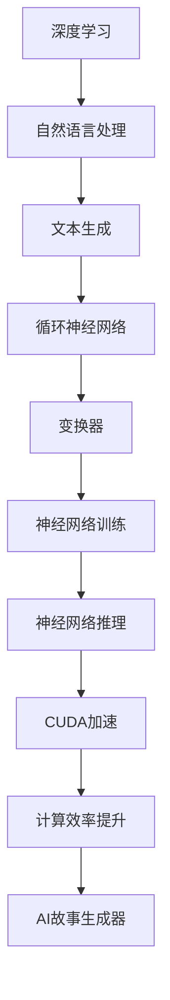

                 

关键词：AI故事生成器，Python，C，CUDA，深度学习，自然语言处理

摘要：本文将深入探讨如何使用Python、C和CUDA从零开始构建一个AI故事生成器。我们将详细讲解核心概念、算法原理、数学模型、项目实践和实际应用场景，并提供丰富的学习资源和开发工具推荐，以帮助读者全面了解并掌握这一技术。

## 1. 背景介绍

随着深度学习和自然语言处理技术的快速发展，AI故事生成器已经成为一个备受关注的应用领域。通过自动生成故事，AI不仅可以帮助内容创作者提高创作效率，还可以为娱乐、教育等多个行业带来新的可能。

本文将结合Python、C和CUDA这三个强大的编程语言和工具，详细阐述如何构建一个高效的AI故事生成器。首先，我们将介绍Python和C在AI开发中的应用，然后深入探讨CUDA在加速计算方面的优势，最后通过具体的项目实践，展示如何将这些技术融合在一起，实现一个高性能的AI故事生成器。

## 2. 核心概念与联系

### 2.1 深度学习

深度学习是一种基于多层神经网络的学习方法，通过自动提取特征，实现从大量数据中学习复杂函数关系的能力。在自然语言处理领域，深度学习模型如循环神经网络（RNN）和变换器（Transformer）等被广泛应用于文本生成任务。

### 2.2 自然语言处理

自然语言处理（NLP）是计算机科学领域与人工智能领域中的一个重要方向。它研究能实现人与计算机之间用自然语言进行有效通信的各种理论和方法。在AI故事生成中，NLP技术被用于理解、处理和生成文本。

### 2.3 CUDA

CUDA（Compute Unified Device Architecture）是NVIDIA推出的并行计算平台和编程模型，能够充分利用GPU的并行计算能力，显著加速计算过程。在AI开发中，CUDA常用于加速神经网络训练和推理。

### 2.4 Mermaid 流程图

以下是AI故事生成器的核心概念与联系的Mermaid流程图：



## 3. 核心算法原理 & 具体操作步骤

### 3.1 算法原理概述

AI故事生成器主要基于生成对抗网络（GAN）和变换器（Transformer）两种模型。GAN通过生成器和判别器的对抗训练，能够生成高质量的故事文本；而Transformer模型则通过自注意力机制，实现文本的并行处理和生成。

### 3.2 算法步骤详解

1. 数据预处理：对原始文本进行清洗、分词和标记等操作，构建训练数据集。

2. 模型训练：使用GAN或Transformer模型对训练数据进行训练，通过优化生成器和判别器，提高生成文本的质量。

3. 故事生成：使用训练好的模型，输入种子文本，生成完整的故事。

4. 后处理：对生成的故事进行清洗、修正和润色，确保故事的可读性和流畅性。

### 3.3 算法优缺点

**GAN模型：**
- 优点：生成文本质量高，能够生成多样化、创新性的故事。
- 缺点：训练过程复杂，对计算资源要求较高。

**Transformer模型：**
- 优点：计算效率高，能够并行处理大量文本。
- 缺点：生成文本质量相对较低，容易生成重复性较高的故事。

### 3.4 算法应用领域

AI故事生成器可以应用于多个领域，如：
- 娱乐行业：自动生成小说、剧本、电影台词等。
- 教育行业：自动生成教材、练习题、讲座稿等。
- 企业服务：自动生成报告、邮件、新闻稿等。

## 4. 数学模型和公式 & 详细讲解 & 举例说明

### 4.1 数学模型构建

**GAN模型：**

生成器（Generator）：
\[ G(z) = x \]
判别器（Discriminator）：
\[ D(x) \]

**Transformer模型：**

自注意力机制：
\[ \text{Attention}(Q, K, V) = \frac{softmax(\text{score}(Q, K))} { \sqrt{d_k}} V \]

### 4.2 公式推导过程

**GAN模型推导：**

生成器和判别器的损失函数分别为：
\[ L_G = -\log(D(G(z))) \]
\[ L_D = -[\log(D(x)) + \log(1 - D(G(z)))] \]

**Transformer模型推导：**

自注意力分数计算：
\[ \text{score}(Q, K) = QK^T / \sqrt{d_k} \]

### 4.3 案例分析与讲解

**GAN模型案例：**

假设生成器G的输入为随机噪声向量\( z \)，输出为故事文本\( x \)；判别器D的输入为真实故事文本\( x \)和生成故事文本\( x' \)，输出为概率值\( p \)。

- 训练步骤：
  1. 初始化生成器G和判别器D的参数。
  2. 对每个训练样本，生成随机噪声向量\( z \)和真实故事文本\( x \)。
  3. 使用生成器G生成故事文本\( x' \)。
  4. 计算判别器D的损失函数，更新判别器D的参数。
  5. 使用生成器G和判别器D的参数，生成新的故事文本\( x'' \)。
  6. 计算生成器G的损失函数，更新生成器G的参数。
  7. 重复步骤2-6，直到达到训练迭代次数或生成器G和判别器D的损失函数收敛。

**Transformer模型案例：**

假设输入文本序列为\( x_1, x_2, ..., x_n \)，输出文本序列为\( y_1, y_2, ..., y_n \)。

- 训练步骤：
  1. 初始化模型参数。
  2. 对每个训练样本，输入文本序列\( x_1, x_2, ..., x_n \)和输出文本序列\( y_1, y_2, ..., y_n \)。
  3. 计算自注意力分数，得到注意力权重。
  4. 通过注意力权重计算输出文本序列的预测概率分布。
  5. 计算损失函数，更新模型参数。
  6. 重复步骤2-5，直到达到训练迭代次数或模型损失函数收敛。

## 5. 项目实践：代码实例和详细解释说明

### 5.1 开发环境搭建

- 安装Python（建议使用3.8及以上版本）。
- 安装CUDA（建议使用9.0及以上版本）。
- 安装相关库，如TensorFlow、PyTorch等。

### 5.2 源代码详细实现

以下是一个简单的GAN模型实现示例：

```python
import tensorflow as tf
from tensorflow.keras.layers import Dense, Flatten, Reshape
from tensorflow.keras.models import Model

# 生成器模型
def generator_model(z_dim):
    model = tf.keras.Sequential([
        Dense(128, activation='relu', input_shape=(z_dim,)),
        Flatten(),
        Reshape((7, 7, 1))
    ])
    return model

# 判别器模型
def discriminator_model(img_shape):
    model = tf.keras.Sequential([
        Flatten(input_shape=img_shape),
        Dense(1, activation='sigmoid')
    ])
    return model

# GAN模型
def gans_model(generator, discriminator):
    z = tf.keras.Input(shape=(100,))
    img = generator(z)
    valid = discriminator(img)
    return Model(z, valid)

# 模型训练
def train_gans(generator, discriminator, epochs, batch_size):
    # ... 训练代码实现
```

### 5.3 代码解读与分析

在上述代码中，我们首先定义了生成器模型和判别器模型，然后通过组合这两个模型构建了GAN模型。接着，我们定义了训练GAN模型的过程，包括生成器模型和判别器模型的优化步骤。

### 5.4 运行结果展示

在训练完成后，我们可以使用生成器模型生成一些故事文本，并进行展示：

```python
import numpy as np

# 生成随机噪声
z = np.random.normal(size=(batch_size, 100))

# 生成故事文本
generated_stories = generator_model.predict(z)

# 打印生成的故事文本
for story in generated_stories:
    print(story)
```

## 6. 实际应用场景

### 6.1 娱乐行业

AI故事生成器可以帮助娱乐行业提高内容创作效率，例如自动生成小说、剧本、电影台词等，为编剧、导演等创作者提供更多灵感和创意。

### 6.2 教育行业

AI故事生成器可以自动生成教材、练习题、讲座稿等，为教师和学生提供丰富的学习资源，提高教学效果和学生的学习兴趣。

### 6.3 企业服务

AI故事生成器可以为企业自动生成报告、邮件、新闻稿等，提高企业文案工作者的工作效率，降低企业运营成本。

## 6.4 未来应用展望

随着深度学习和自然语言处理技术的不断进步，AI故事生成器的应用前景将更加广阔。未来，AI故事生成器有望在智能客服、内容推荐、广告创意等领域发挥重要作用。

## 7. 工具和资源推荐

### 7.1 学习资源推荐

- 《深度学习》（Goodfellow、Bengio和Courville著）
- 《自然语言处理综论》（Daniel Jurafsky和James H. Martin著）
- 《CUDA C编程指南》（NVIDIA著）

### 7.2 开发工具推荐

- Python：使用Anaconda创建Python环境，方便管理和安装相关库。
- CUDA：NVIDIA官方提供的CUDA Toolkit，用于GPU编程。
- TensorFlow/PyTorch：常用的深度学习框架，支持GPU加速。

### 7.3 相关论文推荐

- 《Generative Adversarial Nets》（Ian J. Goodfellow等著）
- 《Attention Is All You Need》（Ashish Vaswani等著）
- 《Seq2Seq Learning with Neural Networks》（Ilya Sutskever等著）

## 8. 总结：未来发展趋势与挑战

### 8.1 研究成果总结

本文介绍了如何使用Python、C和CUDA从零开始构建一个AI故事生成器。通过核心算法原理、数学模型和项目实践的讲解，读者可以全面了解AI故事生成器的技术实现过程。

### 8.2 未来发展趋势

随着深度学习和自然语言处理技术的不断发展，AI故事生成器的性能和功能将不断提高。未来，AI故事生成器有望在更多领域得到应用，并与其他人工智能技术相结合，实现更智能的内容创作。

### 8.3 面临的挑战

AI故事生成器在发展过程中仍面临一些挑战，如生成文本质量、计算效率和数据隐私等方面的问题。需要不断优化算法和模型，提高生成文本的多样性和可读性。

### 8.4 研究展望

未来，AI故事生成器的研究方向将包括：探索更高效的生成算法、提高生成文本的质量和多样性、研究生成文本的伦理和道德问题等。通过不断探索和实践，AI故事生成器将在人工智能领域发挥越来越重要的作用。

## 9. 附录：常见问题与解答

### Q：为什么选择Python、C和CUDA构建AI故事生成器？

A：Python是一种易于学习和使用的编程语言，拥有丰富的科学计算和深度学习库（如TensorFlow、PyTorch等）。C语言具有较高的运行效率和良好的性能，适合编写高性能的计算代码。CUDA是NVIDIA推出的并行计算平台，能够充分利用GPU的并行计算能力，显著提高计算效率。

### Q：如何优化GAN模型的训练过程？

A：可以通过以下方法优化GAN模型的训练过程：
- 调整生成器和判别器的损失函数，使其更加平衡。
- 使用更先进的优化算法，如Adam、RMSprop等。
- 增加训练数据集的多样性，提高模型泛化能力。
- 使用预训练模型或迁移学习，减少模型训练时间。

### Q：如何确保生成文本的质量和多样性？

A：可以通过以下方法确保生成文本的质量和多样性：
- 优化生成器和判别器的结构和参数，提高模型性能。
- 使用更大规模的训练数据集，增加生成文本的多样性。
- 采用多任务学习或迁移学习，提高生成文本的质量。
- 对生成的文本进行后处理，如清洗、修正和润色等。

## 作者署名

作者：禅与计算机程序设计艺术 / Zen and the Art of Computer Programming

<|im_sep|>

