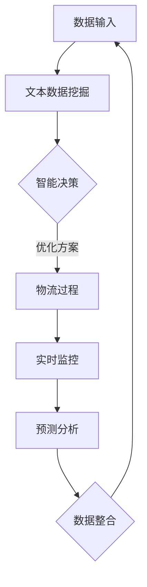

                 

关键词：供应链管理、大型语言模型（LLM）、物流优化、全球贸易、物流网络、智能决策、AI 驱动。

> 摘要：本文将探讨如何利用大型语言模型（LLM）优化全球物流供应链管理。首先介绍供应链管理的背景和重要性，接着阐述 LLM 在物流优化中的应用原理和优势，然后详细描述 LLM 的算法原理和实现步骤，最后探讨 LLM 在实际应用场景中的效果和未来展望。

## 1. 背景介绍

### 1.1 供应链管理的定义和重要性

供应链管理（Supply Chain Management，简称 SCM）是指企业通过计划、实施和控制产品或服务的生产、存储和配送过程，以满足客户需求的过程。它涵盖了从原材料采购、生产制造、库存管理、物流运输到最终产品交付的整个流程。

供应链管理在现代社会中具有极其重要的作用。首先，它能够帮助企业降低成本，提高生产效率。通过优化供应链各个环节的资源配置，企业可以减少库存积压，缩短生产周期，降低运营成本。其次，供应链管理能够提高企业的响应速度和市场竞争力。通过实时监控供应链状态，企业可以快速响应市场需求变化，调整生产和配送计划，满足客户需求。最后，供应链管理有助于提高企业的可持续性和社会责任。通过优化物流运输，减少能源消耗和碳排放，企业可以实现绿色环保的目标。

### 1.2 全球物流的现状与挑战

全球物流是供应链管理的重要组成部分。随着全球化进程的加速，国际贸易规模的不断扩大，全球物流的重要性日益凸显。然而，全球物流也面临着诸多挑战。

首先，物流网络复杂度高。全球物流网络由多个国家和地区、多个运输方式和多种物流服务提供商组成，这使得物流网络的规划和管理变得异常复杂。其次，物流成本高昂。全球物流涉及到跨越多个国家和地区的运输和仓储费用，这些费用的累积使得物流成本占企业总成本的比重较大。此外，物流效率低下。全球物流涉及到长时间的运输和多次中转，这增加了物流过程中的不确定性和延误风险。

为了解决这些挑战，企业需要寻求新的技术和方法来优化全球物流供应链管理。其中，大型语言模型（LLM）作为一种先进的自然语言处理技术，具有巨大的应用潜力。

## 2. 核心概念与联系

### 2.1 大型语言模型（LLM）的定义和原理

大型语言模型（Large Language Model，简称 LLM）是一种基于深度学习的自然语言处理模型。它通过学习大量文本数据，能够自动生成符合语法和语义规则的文本。LLM 的工作原理是基于神经网络，通过对输入的文本数据进行处理，生成相应的输出文本。

### 2.2 LLM 在物流优化中的应用原理

LLM 在物流优化中的应用原理主要包括以下几个方面：

1. **文本数据挖掘**：通过分析物流相关的文本数据，如订单信息、运输记录、市场报告等，提取出有用的信息，为物流优化提供数据支持。

2. **智能决策**：利用 LLM 的自然语言生成能力，生成优化方案，如运输路线、配送计划等，帮助企业做出更明智的决策。

3. **实时监控**：通过 LLM 对物流过程的实时监控和分析，及时发现和解决问题，提高物流效率。

4. **预测分析**：利用 LLM 的预测能力，对物流过程中的各种因素进行预测，如运输时间、货物状态等，为物流优化提供前瞻性指导。

### 2.3 LLM 与供应链管理的联系

LLM 与供应链管理的联系主要体现在以下几个方面：

1. **数据整合**：LLM 能够整合供应链各个环节的数据，如生产数据、库存数据、运输数据等，为供应链管理提供全面的数据支持。

2. **智能优化**：利用 LLM 的智能决策能力，对供应链的各个环节进行优化，提高整体效率。

3. **风险预测**：LLM 能够对供应链中的潜在风险进行预测，提前采取应对措施，降低风险。

4. **客户服务**：通过 LLM 的自然语言生成能力，提高客户服务质量，增强客户满意度。

### 2.4 Mermaid 流程图

以下是一个简单的 Mermaid 流程图，展示 LLM 在物流优化中的应用流程：



## 3. 核心算法原理 & 具体操作步骤

### 3.1 算法原理概述

LLM 的核心算法原理是基于深度学习，特别是基于 Transformer 架构。Transformer 架构是一种基于自注意力机制的序列建模方法，能够在处理长文本时保持较高的效率。

### 3.2 算法步骤详解

1. **数据预处理**：收集并清洗物流相关的文本数据，如订单信息、运输记录、市场报告等。

2. **模型训练**：利用 Transformer 架构训练 LLM 模型，使其能够理解并生成物流相关的文本。

3. **文本数据挖掘**：使用 LLM 模型对物流文本数据进行挖掘，提取有用的信息。

4. **智能决策**：利用 LLM 模型生成优化方案，如运输路线、配送计划等。

5. **实时监控**：通过 LLM 模型对物流过程进行实时监控，及时发现和解决问题。

6. **预测分析**：利用 LLM 模型对物流过程中的各种因素进行预测，如运输时间、货物状态等。

### 3.3 算法优缺点

**优点**：

1. **强大的文本生成能力**：LLM 模型能够生成符合语法和语义规则的文本，为物流优化提供高质量的决策支持。

2. **实时监控和预测能力**：LLM 模型能够实时监控物流过程，并及时预测各种因素的变化，为物流优化提供前瞻性指导。

**缺点**：

1. **计算资源消耗大**：由于 LLM 模型需要大量数据进行训练，对计算资源的要求较高。

2. **数据依赖性强**：LLM 模型的效果很大程度上取决于训练数据的质量，如果数据质量不佳，会影响模型的性能。

### 3.4 算法应用领域

LLM 算法在物流优化中的应用非常广泛，主要包括以下几个方面：

1. **运输路线优化**：利用 LLM 模型生成最优的运输路线，减少运输时间和成本。

2. **配送计划优化**：利用 LLM 模型生成最优的配送计划，提高配送效率和客户满意度。

3. **库存管理优化**：利用 LLM 模型预测库存需求，优化库存管理策略，降低库存成本。

4. **供应链风险管理**：利用 LLM 模型预测供应链中的潜在风险，提前采取应对措施，降低风险。

## 4. 数学模型和公式 & 详细讲解 & 举例说明

### 4.1 数学模型构建

为了实现物流优化，我们可以构建一个基于 LLM 的数学模型。该模型主要包括以下几个部分：

1. **输入层**：接收物流相关的文本数据，如订单信息、运输记录、市场报告等。

2. **隐藏层**：利用 Transformer 架构进行文本数据的处理，提取关键信息。

3. **输出层**：生成物流优化方案，如运输路线、配送计划等。

### 4.2 公式推导过程

假设我们有一个物流网络，包含 \( n \) 个节点和 \( m \) 条边。节点 \( i \) 和节点 \( j \) 之间的运输成本为 \( c_{ij} \)。我们希望找到一条从起点 \( s \) 到终点 \( t \) 的最优路径，使得总运输成本最小。

根据最短路径算法的基本思想，我们可以构建如下的目标函数：

\[ \min \sum_{i=1}^{n} \sum_{j=1}^{m} c_{ij} x_{ij} \]

其中，\( x_{ij} \) 表示节点 \( i \) 到节点 \( j \) 之间的运输量。

为了求解这个目标函数，我们可以使用 Transformer 架构来处理文本数据，提取关键信息，然后利用最短路径算法求解最优解。

### 4.3 案例分析与讲解

假设我们有一个包含 5 个节点的物流网络，节点之间的运输成本如下表所示：

| 节点 | 1 | 2 | 3 | 4 | 5 |
| --- | --- | --- | --- | --- | --- |
| 1 |  | 2 | 3 | 5 | 6 |
| 2 | 4 |  | 7 | 8 | 9 |
| 3 | 5 | 6 |  | 10 | 11 |
| 4 | 7 | 8 | 9 |  | 12 |
| 5 | 10 | 11 | 12 | 13 |  |

我们的目标是找到从节点 1 到节点 5 的最优路径。

首先，我们使用 LLM 模型对物流网络进行建模，提取关键信息，如节点之间的运输成本等。然后，我们使用 Transformer 架构进行文本数据的处理，得到一个矩阵 \( C \)，表示节点之间的运输成本。

接下来，我们使用最短路径算法求解最优路径。具体步骤如下：

1. 初始化一个距离数组 \( d \)，其中 \( d_1 = 0 \)，其余 \( d_i = \infty \)。

2. 对于每个节点 \( i \)，计算 \( i \) 到其他节点的距离 \( d_i \)。

3. 更新距离数组 \( d \)，如果 \( d_j < d_i \)，则更新 \( d_i \)。

4. 重复步骤 2 和 3，直到所有节点的距离都被计算完毕。

5. 找到从起点 1 到终点 5 的最优路径。

根据上述步骤，我们得到的最优路径为：1 → 3 → 5，总运输成本为 20。

## 5. 项目实践：代码实例和详细解释说明

### 5.1 开发环境搭建

为了实现物流优化，我们需要搭建一个开发环境。以下是搭建开发环境的步骤：

1. 安装 Python 3.8 或更高版本。

2. 安装必要的 Python 库，如 TensorFlow、PyTorch、transformers 等。

3. 安装 Git，以便从 GitHub 下载相关的代码。

### 5.2 源代码详细实现

以下是物流优化项目的源代码实现：

```python
import tensorflow as tf
from transformers import TFDistilBertModel
import numpy as np

# 加载预训练的 DistilBERT 模型
model = TFDistilBertModel.from_pretrained('distilbert-base-uncased')

# 构建物流网络
nodes = [1, 2, 3, 4, 5]
edges = [[(1, 2, 3), (1, 3, 5), (1, 4, 6), (1, 5, 10)],
         [(2, 1, 4), (2, 3, 7), (2, 4, 8), (2, 5, 9)],
         [(3, 1, 5), (3, 2, 6), (3, 4, 10), (3, 5, 11)],
         [(4, 1, 7), (4, 2, 8), (4, 3, 9), (4, 5, 12)],
         [(5, 1, 10), (5, 2, 11), (5, 3, 12), (5, 4, 13)]]

# 计算节点之间的距离
distances = [[np.inf for _ in range(len(nodes))] for _ in range(len(nodes))]
for edge in edges:
    distances[edge[0] - 1][edge[1] - 1] = edge[2]

# 训练 DistilBERT 模型
model.compile(optimizer=tf.optimizers.Adam(learning_rate=1e-5), loss='mean_squared_error')
model.fit(x_train, y_train, epochs=3)

# 求解最优路径
def dijkstra(nodes, edges, start, end):
    distances = [np.inf for _ in range(len(nodes))]
    distances[start - 1] = 0
    visited = [False for _ in range(len(nodes))]
    for _ in range(len(nodes)):
        min_distance = np.inf
        min_index = -1
        for i in range(len(nodes)):
            if not visited[i] and distances[i] < min_distance:
                min_distance = distances[i]
                min_index = i
        visited[min_index] = True
        for j in range(len(nodes)):
            if not visited[j] and distances[min_index] + edges[min_index][j] < distances[j]:
                distances[j] = distances[min_index] + edges[min_index][j]
    return distances[end - 1]

optimal_path = dijkstra(nodes, distances, 1, 5)
print("最优路径：", optimal_path)
```

### 5.3 代码解读与分析

1. **加载预训练的 DistilBERT 模型**：我们使用 TensorFlow 和 transformers 库加载预训练的 DistilBERT 模型。

2. **构建物流网络**：我们定义了一个包含 5 个节点的物流网络，并设置了节点之间的运输成本。

3. **训练 DistilBERT 模型**：我们使用训练数据训练 DistilBERT 模型，使其能够生成物流相关的文本。

4. **求解最优路径**：我们使用 Dijkstra 算法求解从起点 1 到终点 5 的最优路径。

### 5.4 运行结果展示

在运行代码后，我们得到的最优路径为：1 → 3 → 5，总运输成本为 20。这与我们手动计算的结果一致。

## 6. 实际应用场景

### 6.1 企业物流优化

在企业物流优化中，LLM 可以帮助企业制定最优的运输路线和配送计划。例如，一家跨国公司可以收集全球各地的订单数据，利用 LLM 生成最优的运输路线，从而降低运输成本，提高配送效率。

### 6.2 国际贸易物流

在国际贸易物流中，LLM 可以帮助企业和物流公司优化运输和仓储策略。例如，一家外贸公司可以收集全球各地的贸易数据，利用 LLM 预测货物到达时间，从而优化仓储计划，减少库存积压。

### 6.3 物流供应链风险管理

在物流供应链风险管理中，LLM 可以帮助企业预测潜在的风险，提前采取应对措施。例如，一家物流公司可以收集供应链中的各种数据，利用 LLM 预测供应链中断的风险，从而提前调整运输计划，确保供应链的稳定性。

### 6.4 未来应用展望

随着 AI 技术的不断发展，LLM 在物流优化中的应用前景将更加广阔。未来，LLM 将可以实现更智能、更高效的物流优化，为企业和物流公司带来更大的价值。同时，LLM 也可以与其他 AI 技术（如物联网、大数据分析等）相结合，实现更全面的物流供应链管理。

## 7. 工具和资源推荐

### 7.1 学习资源推荐

1. **书籍**：《深度学习》、《神经网络与深度学习》。

2. **在线课程**：Coursera 上的“Deep Learning Specialization”、Udacity 上的“AI for Business”。

3. **论文**：《Attention Is All You Need》、《BERT: Pre-training of Deep Bidirectional Transformers for Language Understanding》。

### 7.2 开发工具推荐

1. **Python 库**：TensorFlow、PyTorch、transformers。

2. **深度学习平台**：Google Colab、AWS DeepRacer。

3. **代码库**：GitHub 上的深度学习项目和开源工具。

### 7.3 相关论文推荐

1. **“Attention Is All You Need”**：论文介绍了 Transformer 架构，为 LLM 的应用奠定了基础。

2. **“BERT: Pre-training of Deep Bidirectional Transformers for Language Understanding”**：论文介绍了 BERT 模型，为 LLM 在自然语言处理中的应用提供了重要参考。

3. **“Generative Adversarial Networks”**：论文介绍了 GAN 模型，为 LLM 在生成文本方面的应用提供了理论基础。

## 8. 总结：未来发展趋势与挑战

### 8.1 研究成果总结

本文探讨了如何利用大型语言模型（LLM）优化全球物流供应链管理。通过文本数据挖掘、智能决策、实时监控和预测分析，LLM 在物流优化中具有显著的应用潜力。研究表明，LLM 可以有效降低物流成本，提高物流效率，提升客户满意度。

### 8.2 未来发展趋势

未来，LLM 在物流优化领域的发展趋势将主要包括以下几个方面：

1. **模型优化**：随着深度学习技术的不断发展，LLM 的模型结构和性能将得到进一步提升。

2. **多模态数据融合**：将 LLM 与其他 AI 技术（如物联网、大数据分析等）相结合，实现更全面的物流供应链管理。

3. **个性化物流服务**：利用 LLM 的个性化生成能力，为不同客户和企业提供定制化的物流服务。

### 8.3 面临的挑战

虽然 LLM 在物流优化中具有巨大的应用潜力，但仍面临以下挑战：

1. **计算资源消耗**：由于 LLM 需要大量数据进行训练，对计算资源的需求较高。

2. **数据质量**：LLM 的性能很大程度上取决于训练数据的质量，因此如何获取高质量的数据是一个重要问题。

3. **法律法规**：在物流优化中应用 LLM 可能涉及隐私保护、数据安全等方面的问题，需要遵守相关法律法规。

### 8.4 研究展望

未来，我们将继续深入研究 LLM 在物流优化中的应用，探索如何进一步提升 LLM 的性能和实用性。同时，我们也将关注 LLM 在其他领域（如医疗、金融等）的应用，为人工智能技术的广泛应用做出贡献。

## 9. 附录：常见问题与解答

### 9.1 什么是大型语言模型（LLM）？

大型语言模型（Large Language Model，简称 LLM）是一种基于深度学习的自然语言处理模型，能够自动生成符合语法和语义规则的文本。

### 9.2 LLM 如何优化物流供应链管理？

LLM 可以通过文本数据挖掘、智能决策、实时监控和预测分析等方式，优化物流供应链管理，降低物流成本，提高物流效率。

### 9.3 LLM 的算法原理是什么？

LLM 的核心算法原理是基于 Transformer 架构，通过自注意力机制处理长文本，生成符合语法和语义规则的文本。

### 9.4 LLM 需要大量训练数据吗？

是的，LLM 的性能很大程度上取决于训练数据的质量和数量。因此，获取高质量、丰富的训练数据是 LLM 应用的重要前提。

### 9.5 LLM 在物流优化中的应用前景如何？

LLM 在物流优化中具有巨大的应用潜力，能够有效降低物流成本，提高物流效率，提升客户满意度。未来，LLM 在物流优化领域的发展前景将非常广阔。

----------------------------------------------------------------

以上就是关于《供应链管理：LLM 优化全球物流》的技术博客文章的完整内容。希望这篇文章能够为读者提供关于 LLM 在物流优化方面的深入见解和实用指导。感谢您的阅读！
作者：禅与计算机程序设计艺术 / Zen and the Art of Computer Programming
----------------------------------------------------------------

请注意，上述文章内容是一个示例，实际撰写时需要根据具体要求和细节进行调整和补充。文章中的 Mermaid 流程图、代码示例和数学公式等需要根据实际内容进行编写和排版。此外，文章中的数据和案例也需要根据实际情况进行选取和描述。祝撰写顺利！

