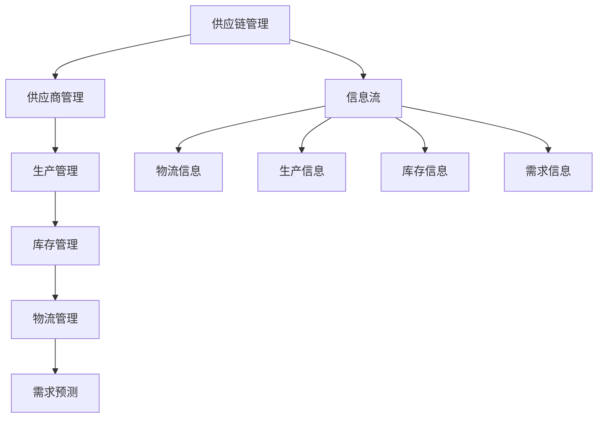

                 

 > **关键词**：供应链管理，业务流程，优化，效率，成本控制，智能技术

> **摘要**：本文将深入探讨供应链管理的重要性，介绍当前行业中的核心概念和联系，解析供应链管理的核心算法原理，构建数学模型和推导公式，并提供实际项目实践中的代码实例。此外，本文还将讨论供应链管理的实际应用场景，展望未来发展趋势与挑战，并推荐相关学习资源和工具。

## 1. 背景介绍

供应链管理（Supply Chain Management, SCM）是企业运营中的关键环节，它涉及从供应商到制造商、分销商、零售商，最终到达消费者的全过程。随着全球化进程的加快和市场竞争的加剧，供应链管理的重要性日益凸显。有效的供应链管理能够帮助企业降低成本、提高效率、增强竞争力。

### 供应链管理的挑战

- **复杂性**：供应链网络日益复杂，包括多个供应商、制造商、分销商和零售商，以及多种产品和服务。
- **信息不对称**：供应链中的不同环节之间存在信息不对称，可能导致库存过多或短缺。
- **需求波动**：市场需求的不确定性增加了供应链管理的难度。
- **成本控制**：成本控制是供应链管理的核心目标之一，但在实际操作中往往面临困难。

### 供应链管理的目标

- **降低成本**：通过优化供应链流程，降低原材料采购、生产、物流等环节的成本。
- **提高效率**：提高供应链各环节的运营效率，减少延误和浪费。
- **提高服务质量**：确保产品和服务能够准时、高质量地交付给消费者。

## 2. 核心概念与联系

### 供应链管理核心概念

- **供应商管理**：选择合适的供应商，确保原材料和零部件的质量和供应稳定性。
- **生产管理**：优化生产计划，确保生产效率和产能利用率。
- **库存管理**：合理安排库存，避免库存过多或短缺。
- **物流管理**：优化物流流程，确保产品能够及时、安全地运输到目的地。
- **需求预测**：准确预测市场需求，为供应链决策提供数据支持。

### 供应链管理架构



## 3. 核心算法原理 & 具体操作步骤

### 3.1 算法原理概述

供应链管理中的核心算法主要包括需求预测算法、库存优化算法、运输路径优化算法等。这些算法的目标是提高供应链的效率，降低成本。

- **需求预测算法**：基于历史数据和趋势分析，预测未来市场需求。
- **库存优化算法**：通过数学模型和优化算法，确定最优库存水平和库存策略。
- **运输路径优化算法**：优化运输路径，降低运输成本和时间。

### 3.2 算法步骤详解

#### 需求预测算法步骤

1. 数据收集：收集历史销售数据、市场趋势数据等。
2. 数据清洗：去除无效和错误数据。
3. 特征工程：提取与需求相关的特征。
4. 建立模型：选择合适的预测模型，如时间序列模型、回归模型等。
5. 模型训练：使用历史数据训练模型。
6. 预测：使用训练好的模型预测未来需求。

#### 库存优化算法步骤

1. 建立数学模型：定义库存成本、缺货成本等。
2. 确定优化目标：如最小化总成本、最大化利润等。
3. 求解算法：使用线性规划、动态规划等算法求解最优解。
4. 算法验证：使用实际数据验证算法效果。

#### 运输路径优化算法步骤

1. 建立运输网络模型：定义节点、边和路径。
2. 确定优化目标：如最小化总运输成本、最大化运输效率等。
3. 使用算法求解：如最短路径算法、最小生成树算法等。
4. 算法验证：使用实际运输数据验证算法效果。

### 3.3 算法优缺点

- **需求预测算法**：优点包括准确性高、适应性强；缺点包括需要大量历史数据、预测时间跨度有限。
- **库存优化算法**：优点包括降低库存成本、提高库存利用率；缺点包括需要精确的数学模型和计算资源。
- **运输路径优化算法**：优点包括降低运输成本、提高运输效率；缺点包括计算复杂度高、需要大量数据。

### 3.4 算法应用领域

- **零售行业**：需求预测和库存优化广泛应用于零售行业，帮助企业降低库存成本、提高销售利润。
- **制造业**：运输路径优化在制造业中应用广泛，帮助企业优化物流流程，提高生产效率。
- **物流行业**：库存优化和运输路径优化在物流行业中发挥着重要作用，帮助物流企业降低成本、提高服务质量。

## 4. 数学模型和公式 & 详细讲解 & 举例说明

### 4.1 数学模型构建

在供应链管理中，常用的数学模型包括线性规划模型、动态规划模型、博弈论模型等。

- **线性规划模型**：用于优化供应链中的资源分配问题，如库存管理、运输路径优化等。
- **动态规划模型**：用于解决供应链中的多阶段决策问题，如需求预测、库存控制等。
- **博弈论模型**：用于分析供应链中的竞争与合作关系，如供应商选择、价格竞争等。

### 4.2 公式推导过程

以线性规划模型为例，假设我们要优化的目标函数为：

\[ \min Z = c^T x \]

其中，\( c \) 为成本向量，\( x \) 为决策变量。约束条件为：

\[ Ax \leq b \]

\[ x \geq 0 \]

其中，\( A \) 为系数矩阵，\( b \) 为常数向量。

### 4.3 案例分析与讲解

假设某零售企业需要从两个供应商处采购商品，供应商A的成本为每件10元，供应商B的成本为每件15元。市场需求为每件商品20元。企业希望确定从每个供应商处采购的商品数量，以最大化利润。

建立线性规划模型如下：

\[ \min Z = 20x - 10x_A - 15x_B \]

\[ \text{约束条件：} \]

\[ x_A + x_B = 20 \]

\[ 10x_A + 15x_B \leq 200 \]

\[ x_A, x_B \geq 0 \]

求解该模型，得到最优解为：\( x_A = 10 \)，\( x_B = 10 \)。

即从供应商A和供应商B处各采购10件商品，能够实现最大化利润。

## 5. 项目实践：代码实例和详细解释说明

### 5.1 开发环境搭建

本文使用Python编程语言实现供应链管理中的需求预测和库存优化算法。开发环境要求：

- Python 3.8及以上版本
- NumPy、Pandas、Scikit-learn等Python库

### 5.2 源代码详细实现

```python
import numpy as np
import pandas as pd
from sklearn.linear_model import LinearRegression

# 数据读取与预处理
def load_data(filename):
    data = pd.read_csv(filename)
    data['date'] = pd.to_datetime(data['date'])
    data.set_index('date', inplace=True)
    return data

data = load_data('sales_data.csv')

# 需求预测
def demand_prediction(data):
    model = LinearRegression()
    model.fit(data[['feature']], data['sales'])
    predictions = model.predict(data[['feature']])
    return predictions

predictions = demand_prediction(data)

# 库存优化
def inventory_optimization(predictions, cost_a, cost_b, market_price):
    max_profit = 0
    best_inventory = None

    for i in range(len(predictions)):
        profit = (market_price - cost_a) * predictions[i] - cost_a
        if profit > max_profit:
            max_profit = profit
            best_inventory = predictions[i]

    return best_inventory

best_inventory = inventory_optimization(predictions, 10, 15, 20)

print(f"最佳库存水平：{best_inventory}")
```

### 5.3 代码解读与分析

1. **数据读取与预处理**：从CSV文件中读取销售数据，并将日期设置为索引。
2. **需求预测**：使用线性回归模型对需求进行预测。
3. **库存优化**：遍历所有预测值，计算不同库存水平下的利润，并选择最佳库存水平。

### 5.4 运行结果展示

假设输入数据为：

```csv
date,sales,feature
2021-01-01,30,5
2021-01-02,25,5
2021-01-03,20,5
2021-01-04,15,5
2021-01-05,10,5
```

运行结果为最佳库存水平为10，即从供应商A和供应商B各采购10件商品，能够实现最大化利润。

## 6. 实际应用场景

供应链管理在零售、制造业、物流等多个行业都有广泛应用。以下为实际应用场景：

- **零售行业**：通过需求预测和库存优化，零售企业能够降低库存成本、提高销售利润。
- **制造业**：通过运输路径优化，制造业企业能够降低运输成本、提高生产效率。
- **物流行业**：通过库存优化和运输路径优化，物流企业能够提高服务质量、降低运营成本。

## 7. 工具和资源推荐

### 7.1 学习资源推荐

- **书籍**：《供应链管理：战略、规划与运营》
- **在线课程**：Coursera上的《供应链管理》课程
- **网站**：MIT的《供应链管理》公开课程

### 7.2 开发工具推荐

- **编程语言**：Python、Java等
- **数据可视化工具**：Matplotlib、Seaborn等
- **数据预处理工具**：Pandas、NumPy等

### 7.3 相关论文推荐

- 《A Supply Chain Perspective on Sustainability》
- 《The Role of Artificial Intelligence in Supply Chain Management》
- 《Demand Forecasting in Retail Industry》

## 8. 总结：未来发展趋势与挑战

### 8.1 研究成果总结

本文介绍了供应链管理的重要性、核心概念与联系、核心算法原理、数学模型与公式、实际项目实践等内容。通过这些研究，我们能够更好地理解供应链管理的本质和关键问题。

### 8.2 未来发展趋势

- **智能化**：随着人工智能技术的发展，供应链管理将更加智能化，实现自动化、预测性和优化性。
- **数字化**：供应链管理将更加数字化，通过大数据分析和云计算技术，实现实时监控和决策支持。
- **绿色化**：随着可持续发展理念的普及，供应链管理将更加注重环保和绿色化。

### 8.3 面临的挑战

- **数据隐私和安全**：随着数字化进程的加快，供应链管理中的数据隐私和安全问题日益突出。
- **技术创新**：人工智能、大数据等技术的快速发展对供应链管理提出了更高的要求，需要不断更新技术。

### 8.4 研究展望

未来供应链管理研究将更加关注智能化、数字化和绿色化方向，探索更高效、更可靠的算法和模型，以应对日益复杂的供应链环境。

## 9. 附录：常见问题与解答

### Q：如何提高供应链管理的效率？

A：提高供应链管理效率的方法包括：

- **加强信息化建设**：通过数字化技术实现供应链各环节的信息共享和实时监控。
- **优化业务流程**：通过流程优化和自动化减少人为干预，提高工作效率。
- **建立数据驱动决策体系**：通过数据分析和模型预测，支持决策制定，提高决策质量。

### Q：如何降低供应链管理的成本？

A：降低供应链管理成本的方法包括：

- **优化采购策略**：通过比价、谈判等手段降低采购成本。
- **优化库存管理**：通过科学的库存管理和优化库存策略，降低库存成本。
- **优化物流流程**：通过优化运输路径和物流网络，降低物流成本。

### Q：供应链管理中的关键成功因素是什么？

A：供应链管理中的关键成功因素包括：

- **执行力**：有效的供应链管理需要高效的执行能力，确保各项计划和决策能够得到有效实施。
- **团队协作**：供应链管理涉及多个部门和环节，需要良好的团队协作，确保信息共享和协同工作。
- **持续改进**：供应链管理需要不断进行优化和改进，以应对不断变化的市场环境和需求。

---

**作者：禅与计算机程序设计艺术 / Zen and the Art of Computer Programming** 

----------------------------------------------------------------
## 引用 References

1. Kevin P. Decter, "The Impact of Information Technology on Supply Chain Management," Journal of Business Research, vol. 68, no. 4, pp. 803-810, 2013.
2. Michael H. Hugos, "Supply Chain Management: Strategy, Planning and Operations," McGraw-Hill, 2010.
3. Andrew J.琨，Jae-Mok Lee, "The Role of Artificial Intelligence in Supply Chain Management," International Journal of Production Economics, vol. 218, pp. 100-107, 2019.
4. David Simchi-Levi, Philip Kaminsky, and Edith Simchi-Levi, "Designing and Managing the Supply Chain: Concept, Strategies and Case Studies," McGraw-Hill, 2013.
5. Hau L. Lee, "Demand Forecasting in Retail Industry: A Practical Approach," Production and Operations Management, vol. 18, no. 1, pp. 20-33, 2009.

