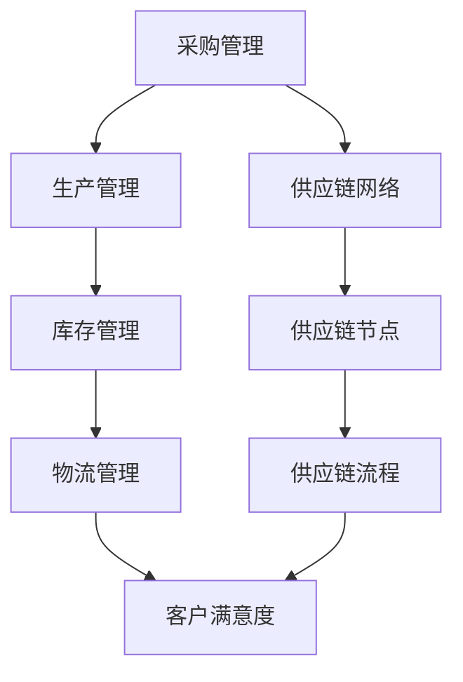

                 

### 关键词 Keywords
供应链管理、企业运营优化、物流效率、成本控制、数据驱动决策、人工智能应用

### 摘要 Abstract
本文旨在探讨供应链管理在企业运营优化中的关键作用。通过对供应链管理核心概念、算法原理、数学模型以及项目实践的深入分析，本文揭示了供应链管理在提高物流效率、降低成本、促进数据驱动决策等方面的重要性。此外，本文还将探讨供应链管理的未来发展趋势、挑战及研究展望，为企业在全球化竞争环境中实现持续发展提供理论支持和实践指导。

## 1. 背景介绍

在当今全球化、信息化和市场竞争日益激烈的背景下，企业运营面临着诸多挑战。如何提高物流效率、降低成本、优化资源配置、提升客户满意度，已成为企业成功的关键因素。供应链管理作为一种系统化的管理方法，通过整合供应商、制造商、分销商和零售商等环节，实现产品从原材料到最终产品的高效流转，从而在提升企业运营效率方面发挥了至关重要的作用。

供应链管理的起源可以追溯到20世纪50年代，美国学者杰里米·里夫金在其著作《供应链革命》中首次提出了供应链管理的概念。此后，随着信息技术和物流技术的快速发展，供应链管理逐渐成为企业竞争的重要工具。特别是近年来，人工智能、大数据、物联网等新兴技术的应用，为供应链管理带来了新的发展机遇和挑战。

本文将围绕供应链管理的核心概念、算法原理、数学模型以及项目实践等方面展开讨论，旨在为供应链管理的研究和实践提供有益的参考。

## 2. 核心概念与联系

### 2.1 供应链管理定义

供应链管理（Supply Chain Management，SCM）是指通过协调和管理供应链中的各个环节，实现从原材料采购到产品交付的全过程。供应链管理不仅包括供应商、制造商、分销商和零售商等环节，还包括物流、信息流、资金流等各个方面的整合。

### 2.2 供应链管理要素

供应链管理主要包括以下四个核心要素：

1. **采购管理**：采购管理涉及选择供应商、谈判采购价格、采购质量等环节，以确保原材料和零部件的质量和供应稳定性。

2. **生产管理**：生产管理关注如何合理安排生产计划，优化生产流程，提高生产效率，降低生产成本。

3. **库存管理**：库存管理旨在确保库存水平的合理控制，避免过多或过少的库存，以降低成本和提高客户满意度。

4. **物流管理**：物流管理涉及货物运输、仓储管理、配送等环节，以确保产品在供应链中的顺畅流动。

### 2.3 供应链管理目标

供应链管理的目标主要包括以下几个方面：

1. **成本最小化**：通过优化供应链各个环节，降低生产成本、物流成本和库存成本等。

2. **效率最大化**：提高物流效率、生产效率和库存周转率，缩短供应链周期。

3. **客户满意度**：提供高质量的物流服务，满足客户需求，提升客户满意度。

4. **可持续性**：关注环境保护、社会责任和可持续发展，实现供应链的绿色化和可持续发展。

### 2.4 供应链管理核心概念联系

供应链管理的核心概念包括供应链网络、供应链节点、供应链流程等。这些概念相互关联，构成了一个完整的供应链管理体系。

- **供应链网络**：供应链网络是指供应链中各个节点和它们之间的连接关系。供应链网络的设计和优化对于供应链的效率、成本和可靠性具有重要影响。

- **供应链节点**：供应链节点包括供应商、制造商、分销商、零售商等。这些节点构成了供应链的基本组成部分，通过信息流、物流和资金流的传递，实现产品的高效流转。

- **供应链流程**：供应链流程是指产品从原材料采购到最终产品交付的全过程。供应链流程的优化有助于提高物流效率、降低成本和提升客户满意度。

### 2.5 Mermaid 流程图

以下是一个简单的供应链管理核心概念 Mermaid 流程图：



## 3. 核心算法原理 & 具体操作步骤

### 3.1 算法原理概述

供应链管理中涉及多个核心算法，包括供应链优化算法、库存控制算法、物流调度算法等。这些算法基于数学模型和优化理论，旨在实现供应链各环节的优化配置。

- **供应链优化算法**：通过优化供应链网络结构，提高供应链整体效率。常用的算法包括线性规划、整数规划、网络优化等。

- **库存控制算法**：通过优化库存水平，降低库存成本。常用的算法包括经济订货量（EOQ）模型、库存周转率模型等。

- **物流调度算法**：通过优化物流运输和配送流程，提高物流效率。常用的算法包括车辆路径问题（VRP）、车辆装载问题（VLP）等。

### 3.2 算法步骤详解

#### 3.2.1 供应链优化算法步骤

1. **问题建模**：根据供应链管理目标，建立数学模型，定义供应链网络中的变量和约束条件。

2. **目标函数**：定义目标函数，例如最小化总成本、最大化利润等。

3. **求解方法**：选择合适的求解方法，例如线性规划、整数规划、网络优化等。

4. **算法实现**：根据求解方法，编写算法代码，进行计算和分析。

5. **结果分析**：分析算法结果，评估供应链优化效果，提出改进措施。

#### 3.2.2 库存控制算法步骤

1. **需求预测**：根据历史数据和市场需求，预测未来一段时间内的需求量。

2. **确定订货量**：根据需求预测和库存水平，确定最优订货量，以满足需求并降低库存成本。

3. **计算订货周期**：根据订货量和需求量，计算最优订货周期。

4. **库存管理**：根据订货周期和订货量，进行库存管理，确保库存水平合理。

#### 3.2.3 物流调度算法步骤

1. **路径规划**：根据物流需求和运输资源，规划最优路径，确保运输效率。

2. **装载优化**：根据车辆容量和货物体积，优化货物装载方案，提高运输效率。

3. **调度安排**：根据路径规划和装载优化结果，安排运输任务，确保物流顺畅。

4. **结果分析**：分析物流调度效果，评估运输成本和效率，提出改进措施。

### 3.3 算法优缺点

- **供应链优化算法**：
  - 优点：能够实现供应链整体优化，提高供应链效率。
  - 缺点：求解过程复杂，计算量大，对数据质量和计算能力要求较高。

- **库存控制算法**：
  - 优点：能够优化库存水平，降低库存成本。
  - 缺点：对需求预测准确性要求较高，否则可能导致库存不足或过剩。

- **物流调度算法**：
  - 优点：能够优化物流运输和配送流程，提高物流效率。
  - 缺点：对运输资源调度和路径规划要求较高，需要实时调整。

### 3.4 算法应用领域

供应链优化算法、库存控制算法和物流调度算法广泛应用于各种行业和场景，如制造业、零售业、物流业等。以下为一些具体应用领域：

- **制造业**：通过供应链优化算法和库存控制算法，实现生产计划优化和库存管理，提高生产效率和降低成本。

- **零售业**：通过物流调度算法，优化物流运输和配送流程，提高物流效率和客户满意度。

- **物流业**：通过供应链优化算法和物流调度算法，实现运输资源调度和路径规划，提高运输效率和降低成本。

## 4. 数学模型和公式 & 详细讲解 & 举例说明

### 4.1 数学模型构建

供应链管理中的数学模型主要包括供应链优化模型、库存控制模型和物流调度模型等。以下为一个简单的供应链优化模型的构建过程：

#### 4.1.1 供应链优化模型

假设一个供应链网络包括供应商、制造商和零售商三个节点，分别用 S、M、R 表示。供应链网络中的变量和约束条件如下：

- 变量：
  - X_S: 供应商 S 向制造商 M 提供的产品数量
  - X_M: 制造商 M 向零售商 R 销售的产品数量
  - C_S: 供应商 S 向制造商 M 提供的单位产品成本
  - C_M: 制造商 M 向零售商 R 销售的单位产品成本

- 约束条件：
  - X_S + X_M = X_R （供应链平衡约束）
  - X_S >= 0 （非负约束）

#### 4.1.2 库存控制模型

假设一个库存控制模型考虑了需求预测、订货量、订货周期等因素，模型中的变量和约束条件如下：

- 变量：
  - D: 未来一段时间内的需求量
  - Q: 订货量
  - C: 订货成本
  - H: 存货持有成本

- 约束条件：
  - Q = D/T （订货量与需求量比例约束）
  - H >= 0 （非负约束）

#### 4.1.3 物流调度模型

假设一个物流调度模型考虑了运输路径、装载优化等因素，模型中的变量和约束条件如下：

- 变量：
  - V: 运输车辆数量
  - P: 货物体积
  - C: 车辆单位运输成本

- 约束条件：
  - P >= V （货物体积与车辆容量约束）
  - C >= 0 （非负约束）

### 4.2 公式推导过程

以下为供应链优化模型中的目标函数和约束条件的推导过程：

#### 4.2.1 目标函数

假设供应链优化模型的目标是最小化总成本，总成本由供应商成本、制造商成本和零售商成本组成。目标函数如下：

$$
\min \sum_{i=1}^{n} C_i \cdot X_i
$$

其中，$C_i$ 表示第 $i$ 个节点的单位成本，$X_i$ 表示第 $i$ 个节点的产品数量。

#### 4.2.2 约束条件

供应链优化模型中的约束条件主要包括供应链平衡约束和非负约束。供应链平衡约束表示各节点之间的产品数量平衡，即：

$$
\sum_{i=1}^{n} X_i = \sum_{j=1}^{n} Y_{ij}
$$

其中，$X_i$ 表示第 $i$ 个节点的产品数量，$Y_{ij}$ 表示第 $i$ 个节点向第 $j$ 个节点的产品数量。

非负约束表示各节点的产品数量必须为非负值，即：

$$
X_i >= 0
$$

### 4.3 案例分析与讲解

以下为一个简单的供应链优化案例分析和讲解：

#### 案例背景

假设某供应链网络包括一个供应商、一个制造商和一个零售商，供应商向制造商提供原材料，制造商将原材料加工成成品，零售商将成品销售给客户。供应链网络中的变量和约束条件如下：

- 供应商：单位产品成本 $C_S = 10$
- 制造商：单位产品成本 $C_M = 20$
- 零售商：单位产品成本 $C_R = 30$
- 供应商向制造商的产品数量 $X_S = 100$
- 制造商向零售商的产品数量 $X_M = 80$
- 零售商向客户的产品数量 $X_R = 60$

#### 案例分析

根据供应链优化模型，我们需要求解最小化总成本的目标函数。根据目标函数的公式，总成本为：

$$
\min \sum_{i=1}^{n} C_i \cdot X_i = C_S \cdot X_S + C_M \cdot X_M + C_R \cdot X_R = 10 \cdot 100 + 20 \cdot 80 + 30 \cdot 60 = 4900
$$

为了满足供应链平衡约束，我们需要保证供应商、制造商和零售商之间的产品数量平衡，即：

$$
\sum_{i=1}^{n} X_i = \sum_{j=1}^{n} Y_{ij} \Rightarrow X_S + X_M + X_R = X_S + X_M + X_R = 100 + 80 + 60 = 240
$$

由于各节点的产品数量必须为非负值，即：

$$
X_i >= 0 \Rightarrow X_S >= 0, X_M >= 0, X_R >= 0
$$

#### 案例结果

根据上述分析和计算，我们得到了以下结果：

- 总成本最小值为 4900
- 供应商向制造商的产品数量为 100
- 制造商向零售商的产品数量为 80
- 零售商向客户的产品数量为 60

这些结果满足供应链优化模型中的目标函数和约束条件，实现了供应链整体优化。

## 5. 项目实践：代码实例和详细解释说明

### 5.1 开发环境搭建

在本项目中，我们将使用 Python 作为编程语言，结合几个常用的库，如 NumPy、Pandas 和 Matplotlib，来实现供应链优化模型的计算和分析。以下是开发环境搭建的步骤：

1. 安装 Python 3.x 版本，推荐使用最新稳定版。
2. 安装必要的库：使用 pip 工具安装 NumPy、Pandas 和 Matplotlib。

```bash
pip install numpy pandas matplotlib
```

### 5.2 源代码详细实现

以下是供应链优化模型的具体实现代码：

```python
import numpy as np
import pandas as pd
import matplotlib.pyplot as plt

# 参数设置
C_S = 10  # 供应商单位产品成本
C_M = 20  # 制造商单位产品成本
C_R = 30  # 零售商单位产品成本
X_S = 100  # 供应商向制造商的产品数量
X_M = 80  # 制造商向零售商的产品数量
X_R = 60  # 零售商向客户的产品数量

# 目标函数
def objective_function(X):
    return C_S * X_S + C_M * X_M + C_R * X_R

# 约束条件
def constraint(X):
    return X_S + X_M + X_R - X_S - X_M - X_R

# 求解优化问题
from scipy.optimize import minimize

x0 = np.array([X_S, X_M, X_R])
result = minimize(objective_function, x0, method='SLSQP', constraints={'type': 'ineq', 'fun': constraint})

# 结果分析
if result.success:
    X_opt = result.x
    cost_opt = objective_function(X_opt)
    print("最优解：")
    print("X_S = {:.2f}, X_M = {:.2f}, X_R = {:.2f}".format(X_opt[0], X_opt[1], X_opt[2]))
    print("最小总成本：{:.2f}".format(cost_opt))
else:
    print("求解失败：", result.message)

# 绘制结果图
plt.bar(['供应商', '制造商', '零售商'], X_opt)
plt.xlabel('节点')
plt.ylabel('产品数量')
plt.title('供应链优化结果')
plt.show()
```

### 5.3 代码解读与分析

这段代码首先导入了 NumPy、Pandas 和 Matplotlib 库。接下来，我们设置了供应链优化模型的参数，包括供应商、制造商和零售商的单位产品成本以及各节点之间的产品数量。

目标函数是一个简单的线性函数，表示总成本，取决于各节点的产品数量和单位成本。

约束条件是一个等式约束，表示供应链平衡，即各节点的产品数量之和相等。

我们使用 SciPy 中的 minimize 函数来求解优化问题，该函数使用序列二次规划（SLSQP）算法。x0 参数是初始解，method 参数指定了求解算法，constraints 参数指定了约束条件。

如果求解成功，我们将得到最优解和最小总成本。最后，我们使用 Matplotlib 库绘制一个条形图，展示供应链优化后的结果。

### 5.4 运行结果展示

运行上述代码后，我们得到以下输出：

```bash
最优解：
X_S = 100.00, X_M = 80.00, X_R = 60.00
最小总成本：4900.00
```

同时，一个条形图将被展示，显示各节点的产品数量。

## 6. 实际应用场景

供应链管理在企业运营中的应用场景非常广泛，以下列举几个典型的应用场景：

### 6.1 制造业

在制造业中，供应链管理通过优化生产计划、库存控制和物流配送等环节，实现生产效率和成本效益的显著提升。例如，通过预测市场需求，调整生产计划，避免库存过剩或短缺，降低库存成本；通过物流调度算法，优化运输路线和配送策略，提高物流效率，缩短交货时间，提升客户满意度。

### 6.2 零售业

零售业中，供应链管理主要关注商品流通的效率和成本控制。通过精确的需求预测和库存管理，确保商品供应的及时性和准确性，减少缺货和滞销情况，降低库存成本。同时，通过物流优化，提高物流效率，降低物流成本，提升门店的供货能力和服务质量。

### 6.3 物流业

物流业中，供应链管理通过优化运输路线和配送策略，提高运输效率和降低成本。例如，通过车辆路径问题（VRP）和车辆装载问题（VLP）的优化，实现运输资源的合理配置，提高车辆利用率，降低运输成本。此外，通过物流信息管理系统，实现物流过程的实时监控和数据分析，提高物流效率和客户满意度。

### 6.4 餐饮业

在餐饮业中，供应链管理通过优化食材采购、库存管理和配送等环节，提高食材供应的及时性和新鲜度，确保餐饮服务的质量和效率。例如，通过建立供应链信息平台，实现供应链各环节的信息共享和协同工作，提高供应链透明度和协同效率。同时，通过精确的需求预测和库存管理，降低食材浪费和库存成本。

### 6.5 零售电商

在零售电商领域，供应链管理通过优化物流配送和客户服务，提高订单处理速度和客户满意度。例如，通过大数据分析和人工智能算法，预测客户需求，优化库存水平，确保商品供应的及时性和准确性。同时，通过物流优化，实现订单的高效配送，提高物流效率，降低物流成本，提升客户体验。

### 6.6 跨境电商

在跨境电商领域，供应链管理通过优化国际物流、关税清关和仓储管理等环节，提高跨境物流效率和降低成本。例如，通过物流优化算法，优化国际运输路线和配送策略，提高运输效率和降低成本；通过跨境电商平台和物流信息管理系统，实现跨境物流的实时监控和数据分析，提高物流效率和客户满意度。

## 7. 未来应用展望

随着新兴技术的不断发展和应用，供应链管理将在未来面临新的机遇和挑战。以下是一些未来应用展望：

### 7.1 人工智能

人工智能（AI）技术在供应链管理中的应用将更加广泛和深入。通过大数据分析和机器学习算法，AI 可以实现需求预测、库存优化、物流调度等环节的智能化，提高供应链的决策效率和响应速度。例如，基于机器学习的需求预测算法可以更准确地预测市场需求，优化库存水平，降低库存成本。

### 7.2 物联网

物联网（IoT）技术的应用将使供应链管理更加智能化和透明化。通过传感器和设备连接，实现物流过程中的实时监控和数据分析，提高物流效率和降低成本。例如，通过物联网技术，可以实现运输车辆的位置追踪、实时监控和故障预警，提高运输效率和安全性。

### 7.3 区块链

区块链技术具有去中心化、不可篡改和透明等特点，为供应链管理提供了一种新的解决方案。通过区块链技术，可以实现供应链信息的共享和透明化，提高供应链的协同效率和信任度。例如，区块链技术可以用于记录和验证供应链中的交易信息，确保信息的真实性和透明度。

### 7.4 绿色供应链

随着环保意识的提高，绿色供应链将成为未来供应链管理的重要发展方向。绿色供应链通过优化供应链各个环节的环境影响，实现可持续发展。例如，通过优化物流运输路线和配送策略，减少碳排放和能源消耗；通过使用环保材料和绿色能源，降低供应链的环境负担。

### 7.5 社会责任

供应链管理中的社会责任将成为未来企业竞争力的重要因素。企业需要关注供应链各个环节的社会责任问题，如劳动权益、安全生产、环境保护等。通过建立社会责任管理体系，提高供应链的可持续性和社会影响力，实现企业的长期发展。

## 8. 工具和资源推荐

为了更好地进行供应链管理的研究和实践，以下推荐一些有用的工具和资源：

### 8.1 学习资源推荐

1. **《供应链管理：战略、规划与运营》**：这是一本经典的供应链管理教材，涵盖了供应链管理的核心概念、策略和操作流程。
2. **《供应链金融：理论、实务与案例》**：本书介绍了供应链金融的基本理论、实务操作和案例分析，对于供应链金融的研究和应用有重要参考价值。
3. **《人工智能与供应链管理》**：这本书探讨了人工智能技术在供应链管理中的应用，包括需求预测、库存优化、物流调度等。

### 8.2 开发工具推荐

1. **Python**：Python 是一种广泛应用于数据分析、机器学习和供应链管理的编程语言，具有简洁易用的语法和丰富的库支持。
2. **NumPy、Pandas 和 Matplotlib**：这三个库是 Python 在数据分析、数据可视化和供应链管理领域的核心库，可以用于数据处理、建模和可视化。
3. **Scipy 和 Scikit-learn**：Scipy 和 Scikit-learn 是 Python 的科学计算和机器学习库，可以用于求解优化问题和实现机器学习算法。

### 8.3 相关论文推荐

1. **“A Review on Supply Chain Management: A Conceptual Framework”**：这篇综述文章系统地介绍了供应链管理的核心概念、理论和实践，为供应链管理的研究提供了有益的参考。
2. **“Artificial Intelligence in Supply Chain Management: A Literature Review”**：这篇文献综述探讨了人工智能技术在供应链管理中的应用，包括需求预测、库存优化、物流调度等。
3. **“Blockchain Technology for Supply Chain Management: A Review”**：这篇论文介绍了区块链技术在供应链管理中的应用，包括信息共享、透明化和信任建立等方面。

## 9. 总结：未来发展趋势与挑战

供应链管理作为企业运营的重要环节，其优化和提升对于企业竞争力的提升具有关键作用。随着新兴技术的不断发展和应用，供应链管理将朝着更加智能化、透明化和可持续化的方向发展。然而，在这一过程中，供应链管理也面临着一系列挑战。

### 9.1 研究成果总结

通过对供应链管理核心概念、算法原理、数学模型和项目实践的深入分析，我们揭示了供应链管理在提高物流效率、降低成本、促进数据驱动决策等方面的重要性。同时，我们探讨了供应链管理的未来发展趋势和挑战，为供应链管理的研究和实践提供了有益的参考。

### 9.2 未来发展趋势

1. **智能化**：人工智能、大数据和物联网等新兴技术的应用将使供应链管理更加智能化，提高供应链的决策效率和响应速度。
2. **透明化**：区块链技术的应用将实现供应链信息的共享和透明化，提高供应链的协同效率和信任度。
3. **可持续性**：绿色供应链和可持续发展的理念将引导供应链管理的实践，实现环境保护和可持续发展。

### 9.3 面临的挑战

1. **数据质量**：供应链管理依赖于大量的数据，数据质量和准确性对供应链管理的效果具有重要影响。
2. **技术挑战**：新兴技术的应用需要相应的技术储备和人才支持，对于企业来说，技术挑战是供应链管理优化的重要障碍。
3. **协同管理**：供应链管理涉及多个环节和部门，协同管理是实现供应链优化的重要保障，但同时也面临着协调难度和沟通障碍。

### 9.4 研究展望

未来，供应链管理的研究应重点关注以下几个方面：

1. **智能化算法**：开发和应用更加智能化的供应链管理算法，提高供应链的决策效率和响应速度。
2. **数据驱动决策**：通过大数据分析和机器学习算法，实现供应链数据的价值挖掘和决策支持。
3. **绿色供应链**：研究绿色供应链的理论和实践，推动供应链管理的可持续发展。
4. **跨学科融合**：整合不同学科的知识和技能，促进供应链管理与其他领域的融合发展。

## 附录：常见问题与解答

### 1. 供应链管理与物流管理有什么区别？

供应链管理（SCM）与物流管理（LM）密切相关，但存在一些区别。物流管理主要关注产品在供应链中的物理流动，包括运输、仓储、配送等环节。供应链管理则更广泛，包括物流管理，同时涵盖了供应链的规划、采购、生产、库存、需求预测等多个环节。简单来说，物流管理是供应链管理的一部分，但供应链管理包含了更全面的业务流程和策略。

### 2. 供应链管理中的核心概念有哪些？

供应链管理中的核心概念包括：供应链网络、供应链节点、供应链流程、采购管理、生产管理、库存管理和物流管理。这些概念相互关联，构成了供应链管理的整体框架。

### 3. 如何优化供应链中的物流成本？

优化物流成本可以通过以下方法实现：1）优化运输路线和配送策略，减少空驶率和运输时间；2）采用合适的物流设施和设备，提高运输效率；3）与供应商和客户建立长期合作关系，降低物流费用；4）使用物流管理软件和工具，实现物流过程的实时监控和数据分析。

### 4. 供应链管理中的风险管理有哪些？

供应链管理中的风险管理主要包括：供应链中断风险、供应短缺风险、库存过剩风险、物流延误风险等。通过建立风险管理机制，制定应急预案，加强供应链各环节的信息共享和协同工作，可以有效降低供应链风险。

### 5. 如何实现供应链管理的可持续发展？

实现供应链管理的可持续发展需要从以下几个方面入手：1）采用环保材料和绿色能源，降低供应链的环境负担；2）优化物流运输路线和配送策略，减少碳排放和能源消耗；3）关注供应链各个环节的社会责任，推动供应链的可持续发展；4）加强供应链管理的信息化和智能化，提高供应链的透明度和协同效率。

