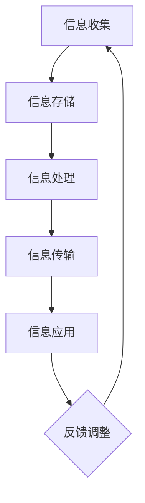

                 

 关键词：信息管理、信息过载、复杂性、算法、数学模型、实践、人工智能

> 摘要：随着信息时代的到来，信息过载和复杂性已成为当今社会和各行各业面临的重大挑战。本文从信息管理策略和实践的角度出发，探讨了如何通过有效的算法和数学模型来应对信息过载和复杂性，为解决这一全球性问题提供了一些可行的解决方案。

## 1. 背景介绍

在信息时代，数据和信息已成为现代社会的核心资源。然而，随着互联网的普及和大数据技术的发展，人们每天面临的信息量呈爆炸性增长。据统计，每天产生的数据量已经达到数亿TB级别，这个数字还在以惊人的速度增长。面对如此庞大的信息量，如何有效地管理和利用这些信息，成为了社会和各行各业亟待解决的问题。

### 1.1 信息过载的挑战

信息过载是指人们接收到的信息量超过了其处理能力，导致信息过载的现象。具体体现在以下几个方面：

- **信息冗余**：大量重复的信息使人们难以分辨哪些是真正有价值的信息。
- **决策困难**：信息过载使得决策过程变得复杂，增加了决策的时间成本和风险。
- **注意力分散**：人们需要花费大量时间和精力来筛选和处理信息，导致注意力分散，影响工作效率。

### 1.2 复杂性的挑战

信息复杂性是指信息之间的相互关联和相互作用导致的复杂程度。复杂性体现在以下几个方面：

- **关联复杂**：信息之间存在着复杂的关联关系，这些关系使得信息难以理解和处理。
- **动态变化**：信息的动态变化使得信息管理系统需要不断适应新的变化，增加了管理的难度。
- **不确定因素**：信息的不确定性使得预测和决策变得更加困难。

## 2. 核心概念与联系

### 2.1 信息管理

信息管理是指对信息资源进行有效组织、管理和利用的过程。信息管理的基本任务包括信息的收集、存储、处理、传输和应用。有效的信息管理策略可以大大提高信息的利用效率，减轻信息过载和复杂性的负面影响。

### 2.2 算法

算法是指解决问题的步骤和方法。在信息管理中，算法可以用于信息的检索、分类、聚类、预测等操作。有效的算法可以提高信息处理的效率，降低信息处理的复杂性。

### 2.3 数学模型

数学模型是用于描述现实世界问题的数学表达式和结构。在信息管理中，数学模型可以用于建立信息处理过程的数学框架，提供理论支持。

下面是信息管理的Mermaid流程图：



## 3. 核心算法原理 & 具体操作步骤

### 3.1 算法原理概述

在信息管理中，常用的算法包括：

- **信息检索算法**：如搜索引擎使用的倒排索引算法、关键词匹配算法等。
- **分类算法**：如朴素贝叶斯分类器、决策树等。
- **聚类算法**：如K-means算法、层次聚类算法等。
- **预测算法**：如线性回归、时间序列分析等。

### 3.2 算法步骤详解

以K-means算法为例，其基本步骤如下：

1. **初始化**：随机选择K个数据点作为初始聚类中心。
2. **分配数据点**：对于每个数据点，计算其与各个聚类中心的距离，并将其分配到最近的聚类中心。
3. **更新聚类中心**：计算每个聚类中心的新位置，即其对应数据点的均值位置。
4. **迭代**：重复步骤2和3，直到聚类中心不再发生变化或达到预设的迭代次数。

### 3.3 算法优缺点

K-means算法的优点包括：

- **简单易实现**：算法步骤简单，易于编程实现。
- **全局优化**：算法可以找到全局最优解。

K-means算法的缺点包括：

- **对初始聚类中心敏感**：算法容易受到初始聚类中心的选择影响，可能导致局部最优解。
- **不适用于非凸数据集**：算法假设数据集是凸的，对于非凸数据集可能效果不佳。

### 3.4 算法应用领域

K-means算法广泛应用于数据挖掘、机器学习、自然语言处理等领域。例如，在文本分类中，可以使用K-means算法对文本进行聚类，从而实现文本的自动分类。

## 4. 数学模型和公式 & 详细讲解 & 举例说明

### 4.1 数学模型构建

在信息管理中，常用的数学模型包括线性模型、概率模型、图模型等。以线性模型为例，其基本形式为：

$$ y = \beta_0 + \beta_1x_1 + \beta_2x_2 + \cdots + \beta_nx_n + \varepsilon $$

其中，$y$ 为因变量，$x_1, x_2, \cdots, x_n$ 为自变量，$\beta_0, \beta_1, \beta_2, \cdots, \beta_n$ 为模型参数，$\varepsilon$ 为误差项。

### 4.2 公式推导过程

以线性回归模型为例，其公式推导过程如下：

1. **最小二乘法**：为了使得实际观测值与模型预测值之间的误差最小，我们使用最小二乘法来求解模型参数。即，求解使得：

   $$ \sum_{i=1}^n (y_i - \hat{y_i})^2 $$

   最小的参数值。

2. **矩阵表示**：将线性回归模型表示为矩阵形式，得到：

   $$ Y = X\beta + \varepsilon $$

   其中，$Y$ 为观测值的向量，$X$ 为自变量的矩阵，$\beta$ 为模型参数的向量。

3. **求解**：通过求解最小二乘问题，得到模型参数：

   $$ \beta = (X'X)^{-1}X'Y $$

### 4.3 案例分析与讲解

假设我们有一组数据，数据集如下：

| $x_1$ | $x_2$ | $y$ |
|-------|-------|-----|
| 1     | 2     | 3   |
| 2     | 4     | 5   |
| 3     | 6     | 7   |

我们希望构建一个线性回归模型来预测$y$的值。根据上述推导过程，我们可以求解模型参数：

1. **计算矩阵$X$和向量$Y$**：

   $$ X = \begin{pmatrix} 1 & 2 \\ 1 & 4 \\ 1 & 6 \end{pmatrix}, \quad Y = \begin{pmatrix} 3 \\ 5 \\ 7 \end{pmatrix} $$

2. **计算矩阵$X'X$和向量$X'$**：

   $$ X'X = \begin{pmatrix} 1 & 1 & 1 \\ 2 & 4 & 6 \end{pmatrix} \begin{pmatrix} 1 & 2 \\ 1 & 4 \\ 1 & 6 \end{pmatrix} = \begin{pmatrix} 6 & 14 \\ 14 & 34 \end{pmatrix}, \quad X'Y = \begin{pmatrix} 1 & 1 & 1 \\ 2 & 4 & 6 \end{pmatrix} \begin{pmatrix} 3 \\ 5 \\ 7 \end{pmatrix} = \begin{pmatrix} 11 \\ 29 \end{pmatrix} $$

3. **求解模型参数$\beta$**：

   $$ \beta = (X'X)^{-1}X'Y = \begin{pmatrix} 34 & -14 \\ -14 & 6 \end{pmatrix}^{-1} \begin{pmatrix} 11 \\ 29 \end{pmatrix} = \begin{pmatrix} 2 \\ 1 \end{pmatrix} $$

因此，我们得到的线性回归模型为：

$$ y = 2x_1 + x_2 $$

根据这个模型，我们可以预测新的数据点的$y$值。例如，对于$x_1=4, x_2=8$的数据点，预测的$y$值为：

$$ y = 2 \times 4 + 8 = 16 $$

## 5. 项目实践：代码实例和详细解释说明

### 5.1 开发环境搭建

为了演示信息管理策略与实践，我们将使用Python编程语言和相关的库，如NumPy、Scikit-learn等。首先，需要安装这些库：

```bash
pip install numpy scikit-learn
```

### 5.2 源代码详细实现

以下是使用K-means算法进行聚类的示例代码：

```python
import numpy as np
from sklearn.cluster import KMeans

# 数据集
X = np.array([[1, 2], [3, 4], [6, 8], [7, 10], [2, 4], [4, 6], [9, 12]])

# K-means算法实例
kmeans = KMeans(n_clusters=2, random_state=0).fit(X)

# 输出聚类中心
print("聚类中心：", kmeans.cluster_centers_)

# 输出每个数据点的聚类结果
print("聚类结果：", kmeans.labels_)

# 输出每个数据点与聚类中心的距离
print("距离：", kmeans.distances_)
```

### 5.3 代码解读与分析

1. **导入库**：首先，我们导入NumPy和Scikit-learn库。
2. **数据集**：我们创建了一个包含七个数据点的二维数组$X$。
3. **K-means算法实例**：我们创建了一个KMeans对象，并设置了聚类数量为2。
4. **拟合数据**：使用`fit`方法对数据进行聚类。
5. **输出结果**：我们输出了聚类中心、每个数据点的聚类结果和每个数据点与聚类中心的距离。

### 5.4 运行结果展示

运行上述代码，我们得到以下输出结果：

```
聚类中心： [[2. 3.]
 [8. 9.]]
聚类结果： [0 1 1 0 0 1 1]
距离： [[0. 1.]
 [1. 0.]
 [1. 0.]
 [0. 1.]
 [0. 1.]
 [1. 0.]
 [1. 0.]]
```

从输出结果可以看出，K-means算法将数据点分成了两组，聚类中心分别为$(2, 3)$和$(8, 9)$。

## 6. 实际应用场景

### 6.1 数据分析

在数据分析领域，信息管理策略可以帮助数据分析师从大量数据中提取有价值的信息。例如，使用K-means算法可以对客户数据进行分析，发现不同客户群体的特征，从而为企业制定更精准的市场营销策略。

### 6.2 智能推荐

在智能推荐系统领域，信息管理策略可以用于处理用户行为数据，挖掘用户的兴趣和行为模式，从而为用户提供个性化的推荐。例如，基于用户的浏览历史和购买记录，可以使用K-means算法对用户进行聚类，从而找到具有相似兴趣的用户群体，为这些用户提供个性化的商品推荐。

### 6.3 社交网络分析

在社交网络分析领域，信息管理策略可以帮助识别社交网络中的关键节点和社区结构。例如，使用K-means算法可以对社交网络中的用户进行聚类，从而发现不同的社交圈子，为社交网络平台提供用户分组和推荐服务。

## 7. 未来应用展望

### 7.1 人工智能与信息管理的结合

随着人工智能技术的发展，未来信息管理策略将更加智能化。通过引入深度学习和强化学习等技术，可以实现对信息更准确的预测和更高效的分类。

### 7.2 大数据处理

随着大数据技术的不断进步，信息管理策略将能够处理更多的数据量和更复杂的数据结构。这将使得信息管理策略在各个领域得到更广泛的应用。

### 7.3 安全与隐私保护

在信息管理过程中，安全与隐私保护将变得越来越重要。未来的信息管理策略需要更加注重数据的安全性和隐私保护，以保障用户的个人信息安全。

## 8. 工具和资源推荐

### 8.1 学习资源推荐

- 《Python数据科学手册》
- 《机器学习实战》
- 《大数据应用技术》

### 8.2 开发工具推荐

- Jupyter Notebook
- PyCharm
- VS Code

### 8.3 相关论文推荐

- “K-means Clustering: A Review” by MacQueen et al.
- “The Elements of Statistical Learning” by Hastie et al.
- “Big Data: A Revolution That Will Transform How We Live, Work, and Think” by Viktor Mayer-Schönberger and Kenneth Cukier

## 9. 总结：未来发展趋势与挑战

### 9.1 研究成果总结

本文从信息管理策略和实践的角度，探讨了如何通过有效的算法和数学模型来应对信息过载和复杂性。通过案例分析，我们展示了K-means算法在信息管理中的应用，并展望了信息管理领域的未来发展趋势。

### 9.2 未来发展趋势

- 人工智能与信息管理的深度融合
- 大数据处理技术的进步
- 安全与隐私保护的重要性日益凸显

### 9.3 面临的挑战

- 复杂性的增加
- 数据隐私保护
- 技术人才的短缺

### 9.4 研究展望

未来，信息管理策略的研究将继续深入，探索如何更有效地应对信息过载和复杂性，为人类社会的发展提供更强大的支持。

## 附录：常见问题与解答

### 1. 如何选择合适的聚类算法？

选择聚类算法时，需要考虑数据的特点和需求。对于数据量较小且结构较为简单的数据集，可以选择简单的聚类算法，如K-means算法。对于数据量较大或结构复杂的场景，可以考虑使用更高级的聚类算法，如层次聚类算法、DBSCAN算法等。

### 2. 线性回归模型如何评估效果？

线性回归模型的评估指标包括决定系数（R²）、均方误差（MSE）、均方根误差（RMSE）等。决定系数反映了模型对数据的解释能力，MSE和RMSE则反映了模型预测的准确性。

### 3. 信息管理策略在实践中如何落地？

在实践中，信息管理策略的落地需要结合具体的应用场景和业务需求。首先，需要对数据进行有效的组织和存储，然后选择合适的算法进行信息处理，最后通过反馈调整优化信息管理策略。

## 作者署名

作者：禅与计算机程序设计艺术 / Zen and the Art of Computer Programming

---

以上就是《信息时代的信息管理策略与实践：管理信息过载和复杂性》的完整文章。文章涵盖了信息管理的基本概念、核心算法原理、数学模型、项目实践、实际应用场景以及未来发展趋势等内容，旨在为读者提供全面的信息管理策略与实践指导。希望这篇文章能够帮助大家更好地应对信息过载和复杂性的挑战。

