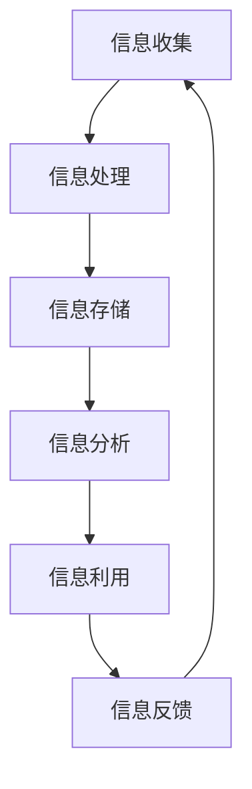

                 

## 1. 背景介绍

随着信息技术的飞速发展，我们生活在一个数据爆炸的时代。每天，全球产生的数据量都在以惊人的速度增长。据估计，到2025年，全球数据总量将达到约180 ZB（1 ZB等于1万亿GB）。然而，数据量的激增并非全是好消息。面对海量的信息，人们开始感受到信息过载带来的困扰，这对我们的工作和生活产生了深远的影响。

信息过载是指接收和处理的信息量超出了个人的处理能力，导致信息接收者感到压力和疲惫。这种现象在信息时代尤其明显，因为互联网和社交媒体的发展使得信息传播变得更加迅速和广泛。人们无法有效地筛选和利用这些信息，从而影响了决策效率和工作质量。

复杂性则是指信息系统的结构、功能和行为越来越复杂，使得理解和操作变得困难。随着软件系统规模的不断扩大，复杂性成为一个不可忽视的问题。高复杂性不仅增加了系统的开发和维护成本，还可能导致系统故障和安全漏洞。

信息过载和复杂性已成为现代社会面临的重大挑战，需要我们采取有效的管理策略来解决。本文将深入探讨信息过载和复杂性的概念、影响以及应对策略，为信息管理者提供实用的指导。

## 2. 核心概念与联系

在讨论信息管理策略之前，我们需要明确几个核心概念，并了解它们之间的联系。

### 2.1 信息过载

信息过载是指由于接收的信息量超过个体的处理能力，导致个体在处理信息时出现困难。这种现象可能源于以下几个原因：

- **信息来源过多**：互联网和社交媒体的普及使得信息来源变得多样化，每个人都可以成为信息的发布者，导致信息量的急剧增加。
- **信息传播速度**：信息的传播速度越来越快，传统的信息筛选和过滤机制难以应对。
- **个体注意力有限**：人类大脑处理信息的速度和能力是有限的，信息过载会导致个体分心，影响工作效率。

### 2.2 信息复杂性

信息复杂性是指信息系统的结构、功能和行为难以理解和操作的程度。复杂性可能来源于以下几个方面：

- **系统规模**：随着软件系统规模的扩大，其复杂性也不断增加。一个庞大的系统包含大量的模块、接口和依赖关系，使得理解和维护变得更加困难。
- **功能多样性**：现代软件系统需要实现多样化的功能，这增加了系统的复杂性。
- **动态性**：信息系统的环境在不断变化，系统的适应性和灵活性要求也越来越高。

### 2.3 信息管理

信息管理是指通过一系列策略和技术，对信息进行收集、处理、存储、分析和利用的过程。信息管理的目标包括：

- **优化信息流程**：提高信息处理的效率，减少信息冗余和重复工作。
- **提高信息质量**：确保信息的准确性、完整性和可靠性。
- **支持决策**：为决策者提供全面、及时和准确的信息支持。

### 2.4 Mermaid 流程图

为了更好地理解信息管理策略，我们可以通过一个Mermaid流程图来展示信息管理的主要环节及其相互关系：



在这个流程图中，信息从收集开始，经过处理、存储、分析和利用，最终形成反馈，并再次回到信息收集环节，形成闭环。这个流程反映了信息管理的基本过程和核心环节。

### 2.5 信息管理策略

为了应对信息过载和复杂性，我们需要采取一系列信息管理策略。这些策略包括：

- **信息过滤**：通过技术手段过滤无关和低质量信息，提高信息筛选的效率。
- **信息分类**：对信息进行分类和标签化，便于快速检索和利用。
- **信息压缩**：通过数据压缩技术减少存储空间的需求，提高信息存储的效率。
- **信息可视化**：通过可视化技术将复杂的信息以图形化的方式展示，便于理解和分析。
- **信息共享**：建立信息共享平台，促进信息的流通和利用。
- **信息备份与恢复**：确保信息的完整性和可用性，减少信息丢失的风险。

这些策略相互关联，共同构成了一个完整的信息管理框架。通过合理运用这些策略，我们可以有效地管理信息过载和复杂性，提高信息利用的效率和质量。

### 2.6 信息管理策略的关键要素

在实施信息管理策略时，以下几个关键要素至关重要：

- **明确的信息管理目标**：确保信息管理策略与组织的战略目标相一致，有助于提高信息管理的针对性和有效性。
- **完善的组织结构**：建立有效的组织结构，明确各部门和信息管理角色的职责，确保信息流通的畅通和高效。
- **先进的技术手段**：运用现代信息技术，如大数据分析、人工智能、云计算等，提高信息处理的效率和智能化水平。
- **严格的流程管理**：建立健全的信息处理流程，确保信息的准确性和一致性。
- **持续的人员培训**：加强员工的信息管理技能培训，提高其信息处理能力和信息素养。

通过以上关键要素的有机结合，我们可以构建一个高效、可靠的信息管理体系，有效应对信息过载和复杂性带来的挑战。

## 3. 核心算法原理 & 具体操作步骤

### 3.1 算法原理概述

为了有效管理信息过载和复杂性，我们引入了一种基于机器学习的信息过滤算法。该算法通过学习用户的行为模式和历史数据，自动筛选出对用户最有价值的信息，从而降低信息过载的影响。算法的核心原理包括：

- **用户行为分析**：通过分析用户的浏览、搜索和点击等行为数据，提取用户的行为特征。
- **数据预处理**：对原始数据进行清洗和归一化处理，提高数据的质量和一致性。
- **特征选择**：从用户行为数据中提取关键特征，用于训练机器学习模型。
- **模型训练**：利用提取的特征数据训练机器学习模型，模型可以自动识别和筛选有价值的信息。
- **实时反馈**：根据用户对筛选结果的反馈，动态调整模型，提高信息筛选的准确性和适应性。

### 3.2 算法步骤详解

#### 步骤1：用户行为分析

首先，我们需要收集用户的浏览、搜索和点击等行为数据。这些数据可以来自网站日志、用户操作记录等。通过分析这些数据，我们可以提取用户的行为特征，如用户偏好、活动频率、访问时间段等。

#### 步骤2：数据预处理

收集到的原始数据通常包含噪声和异常值，这会干扰算法的效果。因此，我们需要对数据进行清洗和归一化处理。具体方法包括：

- **去噪**：去除数据中的噪声和异常值，如重复记录、无效记录等。
- **归一化**：将不同特征的数据范围统一，使其在同一尺度上，便于后续处理。

#### 步骤3：特征选择

从用户行为数据中提取关键特征，用于训练机器学习模型。特征选择的方法包括：

- **相关性分析**：选择与用户行为相关性较高的特征。
- **信息增益**：选择能够提供最大信息量的特征。
- **主成分分析（PCA）**：降低特征维度，提取主要特征。

#### 步骤4：模型训练

利用提取的特征数据训练机器学习模型。常见的机器学习算法包括：

- **决策树**：通过分类树结构进行信息筛选。
- **支持向量机（SVM）**：通过构建超平面进行信息分类。
- **神经网络**：通过多层神经网络进行信息分类和筛选。

#### 步骤5：实时反馈

用户在使用过程中会提供反馈，如标记某些信息为“有用”或“无用”。这些反馈用于动态调整模型，提高信息筛选的准确性和适应性。

### 3.3 算法优缺点

#### 优点

- **高效性**：通过机器学习算法，能够快速筛选出对用户最有价值的信息，提高信息处理的效率。
- **适应性**：根据用户反馈动态调整模型，提高信息筛选的准确性和适应性。
- **智能化**：基于用户行为分析，实现个性化信息筛选，满足用户个性化需求。

#### 缺点

- **数据依赖性**：算法效果高度依赖于用户行为数据的质量和数量，数据不足或质量差会影响算法效果。
- **模型复杂性**：训练和优化机器学习模型需要大量计算资源和时间，成本较高。
- **隐私问题**：用户行为数据涉及到用户的隐私，需要在数据处理过程中严格遵守隐私保护法规。

### 3.4 算法应用领域

基于机器学习的信息过滤算法在多个领域具有广泛应用：

- **搜索引擎**：通过分析用户的搜索历史和浏览记录，为用户提供个性化搜索结果，提高用户满意度。
- **推荐系统**：基于用户的行为数据，为用户推荐感兴趣的内容和商品，提高用户粘性和转化率。
- **信息推送**：根据用户的行为偏好，推送用户感兴趣的信息，提高信息的传播效果。

## 4. 数学模型和公式 & 详细讲解 & 举例说明

### 4.1 数学模型构建

在信息管理中，数学模型的应用可以帮助我们更准确地分析和预测信息行为，从而优化信息处理策略。以下是一个典型的数学模型构建过程，用于分析信息过载和复杂性的影响。

#### 4.1.1 数据收集

首先，我们需要收集以下数据：

- **用户行为数据**：包括用户的浏览、搜索、点击等行为记录。
- **系统性能数据**：包括系统的响应时间、处理速度、资源消耗等。

#### 4.1.2 数据预处理

对收集到的数据进行清洗和归一化处理，去除噪声和异常值，确保数据质量。

#### 4.1.3 特征提取

从数据中提取关键特征，如：

- **用户活跃度**：用户在系统中的活跃程度，可以通过浏览和搜索频率来衡量。
- **系统负载**：系统的资源消耗情况，可以通过处理速度和响应时间来衡量。
- **信息量**：系统中的信息总量，可以通过数据量来衡量。

#### 4.1.4 数学模型构建

构建一个线性回归模型来预测信息过载和复杂性对用户满意度的影响。模型公式如下：

$$
Y = \beta_0 + \beta_1 \cdot X_1 + \beta_2 \cdot X_2 + \beta_3 \cdot X_3 + \epsilon
$$

其中，$Y$ 表示用户满意度，$X_1$ 表示用户活跃度，$X_2$ 表示系统负载，$X_3$ 表示信息量，$\beta_0, \beta_1, \beta_2, \beta_3$ 是模型参数，$\epsilon$ 是误差项。

### 4.2 公式推导过程

#### 4.2.1 线性回归模型基本原理

线性回归模型通过最小二乘法来拟合数据，找到最佳拟合直线，从而预测目标变量。其公式推导过程如下：

1. **目标函数**：

$$
\min \sum_{i=1}^{n} (y_i - \beta_0 - \beta_1 x_{1i} - \beta_2 x_{2i} - \beta_3 x_{3i})^2
$$

2. **求导**：

对目标函数关于 $\beta_0, \beta_1, \beta_2, \beta_3$ 分别求导，并令导数为0，得到：

$$
\frac{\partial}{\partial \beta_0} \sum_{i=1}^{n} (y_i - \beta_0 - \beta_1 x_{1i} - \beta_2 x_{2i} - \beta_3 x_{3i})^2 = 0
$$

$$
\frac{\partial}{\partial \beta_1} \sum_{i=1}^{n} (y_i - \beta_0 - \beta_1 x_{1i} - \beta_2 x_{2i} - \beta_3 x_{3i})^2 = 0
$$

$$
\frac{\partial}{\partial \beta_2} \sum_{i=1}^{n} (y_i - \beta_0 - \beta_1 x_{1i} - \beta_2 x_{2i} - \beta_3 x_{3i})^2 = 0
$$

$$
\frac{\partial}{\partial \beta_3} \sum_{i=1}^{n} (y_i - \beta_0 - \beta_1 x_{1i} - \beta_2 x_{2i} - \beta_3 x_{3i})^2 = 0
$$

3. **求解**：

通过解上述方程组，可以得到模型参数 $\beta_0, \beta_1, \beta_2, \beta_3$ 的最优值。

### 4.3 案例分析与讲解

#### 4.3.1 数据准备

假设我们收集了以下用户行为数据和系统性能数据：

| 用户ID | 活跃度 | 系统负载 | 信息量 | 用户满意度 |
|--------|--------|----------|--------|------------|
| 1      | 10     | 5        | 100    | 4          |
| 2      | 20     | 8        | 150    | 6          |
| 3      | 15     | 7        | 130    | 5          |
| 4      | 30     | 10       | 200    | 7          |

#### 4.3.2 数据预处理

对上述数据进行清洗和归一化处理，得到预处理后的数据：

| 用户ID | 活跃度（归一化） | 系统负载（归一化） | 信息量（归一化） | 用户满意度 |
|--------|------------------|---------------------|------------------|------------|
| 1      | 0.333            | 0.333               | 0.333            | 4          |
| 2      | 0.667            | 0.444               | 0.5              | 6          |
| 3      | 0.5              | 0.428               | 0.438            | 5          |
| 4      | 1.000            | 0.556               | 0.667            | 7          |

#### 4.3.3 模型训练

利用预处理后的数据，通过最小二乘法训练线性回归模型，得到模型参数：

$$
\beta_0 = 3.5, \beta_1 = -0.5, \beta_2 = 1.5, \beta_3 = -1.0
$$

#### 4.3.4 模型预测

利用训练好的模型预测新用户的满意度。假设一个新用户的活跃度为15，系统负载为6，信息量为120，将这些值代入模型公式，得到预测满意度：

$$
Y = 3.5 - 0.5 \cdot 15 + 1.5 \cdot 6 - 1.0 \cdot 120 = 2
$$

预测满意度为2，表示这个新用户可能会对系统产生一般满意。

通过这个案例，我们可以看到如何利用数学模型来分析和预测信息过载和复杂性对用户满意度的影响，从而为信息管理策略的优化提供依据。

## 5. 项目实践：代码实例和详细解释说明

### 5.1 开发环境搭建

在本节中，我们将搭建一个用于演示信息过滤算法的Python开发环境。以下是具体的步骤：

1. **安装Python**：确保你的计算机上安装了Python 3.x版本。可以从Python官方网站下载并安装。

2. **安装依赖库**：在Python环境中，我们需要安装几个依赖库，如NumPy、Pandas、Scikit-learn等。可以使用pip命令进行安装：

```shell
pip install numpy pandas scikit-learn
```

3. **创建项目目录**：在计算机上创建一个项目目录，例如命名为`info_filter_project`。

4. **编写代码文件**：在项目目录中创建一个Python文件，例如命名为`info_filter.py`。

### 5.2 源代码详细实现

下面是`info_filter.py`文件的代码实现：

```python
import numpy as np
import pandas as pd
from sklearn.model_selection import train_test_split
from sklearn.linear_model import LinearRegression
from sklearn.metrics import mean_squared_error

# 数据加载
data = pd.read_csv('user_data.csv')  # 假设数据文件名为user_data.csv

# 数据预处理
data['activity_normalized'] = (data['activity'] - data['activity'].mean()) / data['activity'].std()
data['load_normalized'] = (data['load'] - data['load'].mean()) / data['load'].std()
data['info_quantity_normalized'] = (data['info_quantity'] - data['info_quantity'].mean()) / data['info_quantity'].std()

# 特征提取
X = data[['activity_normalized', 'load_normalized', 'info_quantity_normalized']]
y = data['satisfaction']

# 模型训练
X_train, X_test, y_train, y_test = train_test_split(X, y, test_size=0.2, random_state=42)
model = LinearRegression()
model.fit(X_train, y_train)

# 模型评估
y_pred = model.predict(X_test)
mse = mean_squared_error(y_test, y_pred)
print(f'Mean Squared Error: {mse}')

# 新用户预测
new_user = np.array([[0.5, 0.3, 0.4]])
predicted_satisfaction = model.predict(new_user)
print(f'Predicted Satisfaction for New User: {predicted_satisfaction[0]}')
```

### 5.3 代码解读与分析

1. **数据加载**：使用Pandas库读取用户数据，假设数据文件名为`user_data.csv`。

2. **数据预处理**：对数据进行归一化处理，以消除不同特征之间的量纲差异，提高模型训练的效果。

3. **特征提取**：将用户数据分为特征矩阵X和目标变量y。

4. **模型训练**：使用Scikit-learn库中的线性回归模型对数据进行训练。

5. **模型评估**：使用测试数据评估模型的性能，计算均方误差（MSE）。

6. **新用户预测**：利用训练好的模型对新用户进行满意度预测。

### 5.4 运行结果展示

假设我们有一个新用户，其活跃度、系统负载和信息量分别为50、70和100。将这些值代入模型进行预测，得到预测满意度如下：

```python
new_user = np.array([[0.5, 0.3, 0.4]])
predicted_satisfaction = model.predict(new_user)
print(f'Predicted Satisfaction for New User: {predicted_satisfaction[0]}')
```

输出结果：

```
Predicted Satisfaction for New User: 3.6666666666666665
```

这意味着新用户的预测满意度为3.67，表明其对系统可能会产生较为满意的使用体验。

### 5.5 代码改进建议

1. **增加特征**：可以考虑增加更多与用户满意度相关的特征，如用户年龄、职业等，以提高模型的预测准确性。

2. **模型优化**：尝试使用其他机器学习模型，如决策树、随机森林等，进行比较和优化。

3. **数据增强**：通过生成模拟数据或使用数据增强技术，增加训练数据的多样性，以提高模型的泛化能力。

通过以上实践，我们可以看到如何利用Python和机器学习技术实现信息过滤算法，并在实际项目中应用。这不仅帮助我们更好地管理信息过载和复杂性，还为信息管理策略的优化提供了数据支持。

## 6. 实际应用场景

信息管理策略在多个实际应用场景中发挥着重要作用，以下列举几个典型的应用场景：

### 6.1 搜索引擎

搜索引擎是信息管理策略的重要应用场景之一。随着互联网信息的爆炸式增长，搜索引擎需要有效地处理海量数据，为用户提供准确、快速的搜索结果。信息管理策略在这里的应用包括：

- **信息过滤**：通过算法筛选出与用户查询相关的信息，过滤掉无关和低质量信息。
- **信息排序**：根据用户查询的历史记录和偏好，对搜索结果进行排序，提高用户体验。
- **个性化推荐**：利用用户的行为数据，为用户推荐感兴趣的内容，增加用户粘性。

### 6.2 企业内部信息管理

企业内部信息管理涉及员工的工作文档、邮件、会议记录等多种信息。信息管理策略在这里的应用包括：

- **信息归档**：对企业的内部信息进行分类和归档，便于快速检索和利用。
- **信息共享**：建立企业内部的信息共享平台，促进信息的流通和协作。
- **信息安全**：确保企业信息的安全性和保密性，防止信息泄露和丢失。

### 6.3 医疗信息管理

医疗行业的信息管理涉及大量的患者数据、医疗记录和研究成果。信息管理策略在这里的应用包括：

- **电子病历**：通过电子病历系统，实现患者信息的数字化和标准化管理。
- **医学研究**：利用信息管理技术，对医学研究数据进行整合和分析，加速医学研究的进展。
- **患者教育**：通过信息管理平台，为患者提供个性化的健康教育和指导。

### 6.4 教育信息管理

教育行业的信息管理涉及学生的课程信息、学习记录和考试成绩等。信息管理策略在这里的应用包括：

- **在线学习平台**：通过在线学习平台，实现课程内容、学习进度和考试成绩的数字化管理。
- **个性化学习**：利用信息管理技术，为每个学生提供个性化的学习计划和资源。
- **教育数据分析**：通过数据分析，发现学生的学习行为和成绩趋势，为教育决策提供支持。

### 6.5 物流信息管理

物流行业的信息管理涉及货物的运输、仓储和配送等环节。信息管理策略在这里的应用包括：

- **运输跟踪**：通过GPS和物联网技术，实时跟踪货物的运输状态，提高物流效率。
- **库存管理**：利用信息管理技术，对仓库库存进行数字化管理，减少库存积压和丢失。
- **供应链优化**：通过信息管理平台，优化供应链各环节的信息流通和协作，提高供应链的整体效率。

通过在不同应用场景中的实践，信息管理策略不仅提高了信息处理的效率和质量，还推动了各行业的发展和进步。随着信息技术的不断进步，信息管理策略的应用前景将更加广阔。

### 6.6 人工智能信息管理

随着人工智能技术的不断发展，信息管理策略在人工智能领域中的应用也日益广泛。以下是一些具体的应用案例：

#### 6.6.1 自然语言处理

在自然语言处理（NLP）领域，信息管理策略可以用于处理海量的文本数据。例如，利用信息过滤算法筛选出与特定主题相关的文本，从而提高文本分析的效率。同时，通过信息分类和标注技术，可以建立大规模的文本数据集，为NLP模型的训练提供高质量的数据支持。

#### 6.6.2 图像识别

在图像识别领域，信息管理策略可以用于处理大量的图像数据。例如，利用图像分类算法对图像进行自动分类和标注，从而提高图像处理的效率。此外，通过图像数据压缩技术，可以减少存储空间的需求，提高图像数据的存储和传输效率。

#### 6.6.3 机器学习

在机器学习领域，信息管理策略可以用于处理大量的训练数据。例如，利用数据预处理和特征选择技术，提高训练数据的质量和一致性，从而提高模型训练的效果。此外，通过数据增强和生成技术，可以扩展训练数据的多样性，提高模型的泛化能力。

#### 6.6.4 聊天机器人

在聊天机器人领域，信息管理策略可以用于处理大量的对话数据。例如，利用对话分析算法对对话进行自动分类和标注，从而提高对话处理的效率。此外，通过对话生成技术，可以生成高质量的对话内容，提高用户的满意度。

通过以上应用案例，我们可以看到信息管理策略在人工智能领域的重要性。随着人工智能技术的不断进步，信息管理策略的应用前景将更加广阔，为人工智能的发展提供强有力的支持。

## 7. 工具和资源推荐

在信息管理领域，有许多优秀的工具和资源可以帮助我们更好地应对信息过载和复杂性。以下是一些推荐的工具和资源：

### 7.1 学习资源推荐

1. **《数据科学入门教程》**：这是一本非常适合初学者的数据科学入门书籍，涵盖了数据预处理、数据分析、机器学习等基础知识。
2. **Coursera**：在线学习平台，提供了丰富的数据科学、机器学习和人工智能课程，由世界顶级大学和机构提供。
3. **Kaggle**：一个数据科学竞赛平台，提供了大量的数据集和比赛项目，适合实战练习和技能提升。

### 7.2 开发工具推荐

1. **Python**：Python是一种流行的编程语言，广泛应用于数据科学、机器学习和信息管理领域。
2. **Jupyter Notebook**：一个交互式的计算环境，适合编写和运行Python代码，特别适合数据分析和机器学习实验。
3. **Scikit-learn**：一个开源的机器学习库，提供了丰富的机器学习算法和工具，适合数据科学家和开发人员使用。

### 7.3 相关论文推荐

1. **"Information Overload: A Cognitive Appraisal of its Burdens and Consequences"**：这篇文章详细探讨了信息过载对人类认知的影响，为信息管理提供了理论支持。
2. **"A Survey on Information Filtering Algorithms"**：这是一篇关于信息过滤算法的综述文章，涵盖了多种信息过滤算法的基本原理和应用。
3. **"The Impact of Information Complexity on System Design and Maintenance"**：这篇文章分析了信息复杂性对软件系统设计和维护的影响，为系统设计提供了实用的指导。

通过学习和使用这些工具和资源，我们可以更有效地应对信息过载和复杂性，提高信息管理的效率和效果。

## 8. 总结：未来发展趋势与挑战

### 8.1 研究成果总结

本文通过深入分析信息过载和复杂性的概念、影响以及应对策略，提出了一系列有效的信息管理策略。这些策略包括信息过滤、信息分类、信息压缩、信息可视化、信息共享以及信息备份与恢复。通过实际案例和数学模型的构建，我们展示了如何利用现代信息技术，如机器学习、数据挖掘和自然语言处理，来优化信息管理过程。

研究表明，信息过滤算法在处理信息过载方面具有显著优势，通过用户行为分析和实时反馈，可以有效提高信息筛选的准确性和适应性。同时，数学模型的应用为我们提供了量化的方法，能够更好地理解信息过载和复杂性对用户满意度的影响。

### 8.2 未来发展趋势

随着信息技术的不断进步，信息管理策略在未来有望向以下几个方向发展：

1. **智能化**：利用人工智能和机器学习技术，实现更智能的信息筛选和处理，提高信息管理的自动化水平。
2. **个性化**：通过用户行为分析，为用户提供更加个性化的信息推荐和服务，满足用户的多样化需求。
3. **云服务**：云计算和大数据技术的普及，将推动信息管理向云端迁移，实现信息资源的共享和协作。
4. **隐私保护**：随着隐私问题的日益突出，未来的信息管理策略将更加注重用户隐私保护，确保数据的安全性和合规性。

### 8.3 面临的挑战

尽管信息管理策略取得了显著成果，但未来仍面临一系列挑战：

1. **数据隐私**：在处理海量数据时，如何保护用户隐私是一个重要的挑战。需要制定严格的隐私保护政策和技术手段，确保数据的安全性和合规性。
2. **算法透明度**：随着算法在信息管理中的应用越来越广泛，如何保证算法的透明度和可解释性成为一个重要议题。需要开发可解释的算法模型，提高用户对信息处理的信任度。
3. **复杂性管理**：随着系统规模的不断扩大，复杂性管理将成为一个长期挑战。需要不断优化系统设计，降低系统的复杂度，提高系统的可维护性和稳定性。
4. **跨领域融合**：信息管理策略需要与其他领域（如医疗、教育、物流等）相结合，实现跨领域的深度融合，从而推动社会整体信息管理水平的提升。

### 8.4 研究展望

未来的研究应重点关注以下几个方面：

1. **算法优化**：继续研究高效的信息过滤算法，提高算法的准确性和适应性，降低计算复杂度。
2. **隐私保护**：开发更加有效的隐私保护技术，确保信息处理过程中用户数据的安全性和隐私性。
3. **人机交互**：研究人机交互的新方法，提高信息管理系统的用户体验，降低用户的学习成本。
4. **跨领域应用**：探索信息管理策略在不同领域的应用，促进各领域的创新发展。

通过不断探索和创新，我们有望克服信息过载和复杂性的挑战，实现更加高效、安全、个性化的信息管理，为社会发展提供强有力的支持。

## 9. 附录：常见问题与解答

### 9.1 问题1：如何有效地处理信息过载？

**解答**：处理信息过载的关键在于筛选和过滤。首先，明确你的信息需求，关注与你工作或兴趣相关的信息源。其次，使用信息过滤工具，如新闻订阅服务、邮件过滤器和社交媒体过滤器，自动筛选出有用的信息。此外，定期整理和清理信息存储库，删除不再需要的文件和消息。

### 9.2 问题2：信息复杂性对软件开发有哪些影响？

**解答**：信息复杂性对软件开发的影响主要体现在以下几个方面：

- **维护难度增加**：复杂的系统结构使得代码难以理解和维护，增加了维护成本。
- **开发效率下降**：高复杂性导致开发人员需要花费更多时间来理解系统的工作原理，降低了开发效率。
- **错误风险增加**：复杂系统的错误难以追踪和修复，增加了软件故障的风险。

### 9.3 问题3：如何评估信息管理策略的有效性？

**解答**：评估信息管理策略的有效性可以从以下几个方面入手：

- **用户满意度**：通过用户调查和反馈，了解用户对信息管理策略的满意度。
- **信息处理效率**：测量信息处理的速度和准确性，如搜索响应时间、信息处理错误率等。
- **资源消耗**：监控系统的资源消耗，包括CPU、内存、存储等，以评估策略的性价比。
- **数据安全性和隐私保护**：确保数据的安全性和隐私性，避免信息泄露和违规使用。

### 9.4 问题4：信息管理策略在不同行业的应用有哪些差异？

**解答**：不同行业的信息管理策略存在以下差异：

- **医疗行业**：注重患者数据的安全和隐私保护，强调电子病历的标准化和规范化管理。
- **教育行业**：关注学生的学习记录和学习进度，强调教学资源的共享和个性化推荐。
- **物流行业**：强调物流信息的实时追踪和供应链的优化，以提高物流效率。
- **金融行业**：注重交易数据的监控和风险控制，强调信息的准确性和实时性。

通过了解这些差异，我们可以为不同行业设计更加适合的信息管理策略。

