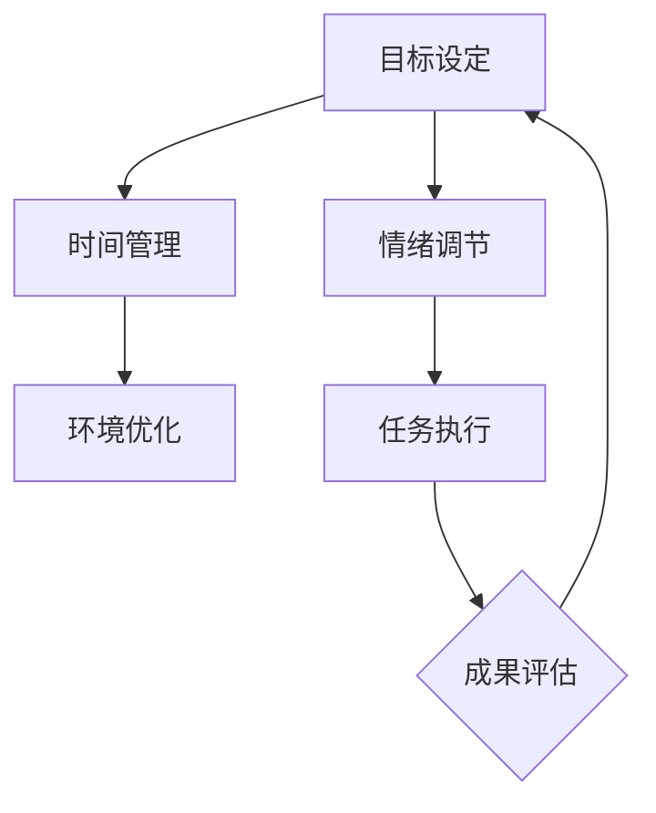

                 

 在当今这个信息爆炸的时代，我们的注意力资源面临着前所未有的挑战。从社交媒体的推送，到不间断的通知，再到各种在线任务的交织，我们的注意力往往被分散得支离破碎。这种状况不仅影响工作效率，还可能对我们的心理健康造成负面影响。因此，掌握有效的注意力管理策略变得至关重要。本文将深入探讨信息时代下的注意力管理实践与策略，帮助读者在干扰和分心中保持头脑清晰。

## 关键词
- 注意力管理
- 干扰控制
- 分心应对
- 工作效率
- 心理健康

## 摘要
本文将围绕注意力管理这一主题，首先介绍其背景和重要性，然后详细阐述核心概念和原理，探讨核心算法及其操作步骤，并辅以数学模型和公式进行分析。此外，文章还将通过实际项目实践，展示代码实例和详细解释，最后对应用场景进行探讨，并提供未来展望与挑战。

## 1. 背景介绍
随着互联网和移动设备的普及，信息过载成为现代社会的一个显著特征。人们每天接收到大量的信息，而这些信息往往在争夺他们的注意力。根据斯坦福大学的一项研究，现代人每天平均会查看手机150次以上，每次平均时间为15秒左右。这种高频率的信息接触极大地干扰了我们的注意力集中能力。

除了技术因素，社会和工作环境的变化也加剧了分心问题。现代职场中，员工常常需要同时处理多个任务，而工作节奏的加快使得人们难以有足够的时间专注于单一任务。这种多任务处理虽然表面上提高了效率，但实际上往往降低了工作效率和成果的质量。

分心和干扰不仅影响个人，还可能影响团队的整体绩效。研究表明，当团队成员处于高度分心状态时，协作效率会显著下降，错误率会增加，创新思维也会受到抑制。因此，有效的注意力管理策略不仅对个人有重要意义，也对团队和组织的发展至关重要。

## 2. 核心概念与联系
### 2.1 注意力分散模型
注意力分散模型（Distraction Model）是理解注意力管理的基础。该模型指出，注意力分散主要受到外部刺激和内部干扰的影响。外部刺激包括各种形式的干扰，如电话、邮件、社交媒体等，而内部干扰则包括情绪波动、焦虑和疲劳等。


在这个模型中，大脑的注意力资源就像一个有限的池塘，外部刺激和内部干扰则像是不断涌入的水流。如果水流太大，池塘很快就会满溢，导致注意力分散。因此，有效的注意力管理策略需要同时应对外部刺激和内部干扰。

### 2.2 专注力管理架构
为了更好地管理注意力，我们需要一个系统化的架构。这个架构包括以下几个核心组成部分：

- **目标设定**：明确自己的目标，有助于集中注意力。
- **时间管理**：合理安排时间，确保有足够的专注时间。
- **环境优化**：创造一个有利于专注的工作环境。
- **情绪调节**：通过心理调适，降低内部干扰。


### 2.3 注意力分配算法
在注意力管理中，算法可以帮助我们优化注意力资源的分配。一个典型的算法是“番茄工作法”（Pomodoro Technique）。该方法将工作时间分为25分钟的工作周期，每个周期后休息5分钟。通过这种方式，可以有效地防止注意力过度疲劳，提高工作效率。


### 2.4 Mermaid 流程图
以下是一个注意力管理流程图的示例，展示了从目标设定到情绪调节的整个流程：



## 3. 核心算法原理 & 具体操作步骤
### 3.1 算法原理概述
注意力管理算法的核心原理是通过优化注意力资源的分配，来提高工作效率和成果质量。具体来说，该算法包括以下几个步骤：

- **目标分解**：将大目标分解为小目标，便于集中注意力。
- **任务排序**：根据优先级和重要性对任务进行排序。
- **时间分配**：根据任务的重要性和工作量，合理分配时间。
- **情绪监控**：实时监控情绪变化，进行必要的情绪调节。
- **反馈调整**：根据任务完成情况和情绪状态，调整策略。

### 3.2 算法步骤详解
1. **目标分解**：将一个大目标分解为几个小目标，每个小目标都应该具体、可行。例如，如果目标是完成一个项目报告，可以将其分解为收集数据、整理数据和撰写报告三个小目标。

2. **任务排序**：根据每个任务的优先级和重要性，对其进行排序。可以使用“紧急-重要矩阵”来帮助判断。紧急且重要的任务应该优先处理，而不紧急但重要的任务则可以稍后处理。

3. **时间分配**：根据任务的重要性和工作量，合理分配时间。可以使用“工作计划表”来安排每天的工作时间，确保每个任务都有足够的时间来完成。

4. **情绪监控**：在执行任务的过程中，要实时监控自己的情绪状态。如果感到焦虑或疲惫，可以采取适当的休息和放松措施，如短暂的冥想或散步。

5. **反馈调整**：在任务完成后，要对自己的表现进行评估，并根据反馈调整策略。例如，如果发现某个任务的时间分配不合理，可以调整后续任务的时间安排。

### 3.3 算法优缺点
**优点**：
- **提高工作效率**：通过优化注意力资源的分配，可以显著提高工作效率。
- **减少分心**：有明确的目标和任务排序，可以减少分心，提高专注度。
- **提高成果质量**：合理的时间管理和情绪监控，有助于提高任务完成的质量。

**缺点**：
- **需要自律**：执行注意力管理算法需要较高的自律能力，否则容易放弃或中断。
- **时间安排困难**：对于复杂任务，时间安排可能比较困难，需要不断的调整。

### 3.4 算法应用领域
注意力管理算法可以应用于多个领域，包括个人学习、职场工作和团队协作等。

- **个人学习**：通过注意力管理算法，可以更好地规划学习时间，提高学习效率。
- **职场工作**：在职场中，注意力管理算法可以帮助员工更好地处理工作任务，提高工作效率。
- **团队协作**：在团队协作中，注意力管理算法可以帮助团队成员更好地协调工作，提高团队整体效率。

## 4. 数学模型和公式 & 详细讲解 & 举例说明
### 4.1 数学模型构建
注意力管理中的数学模型主要涉及目标分解和任务排序。以下是一个简单的数学模型示例：

设T为总目标，T1, T2, ..., Tn为分解后的子目标，Ci为第i个子目标的工作量，Ti为第i个子目标的完成时间，则有：

\[ T = T1 + T2 + ... + Tn \]
\[ Ci = C1 + C2 + ... + Cn \]
\[ Ti = T / n \]

### 4.2 公式推导过程
在目标分解中，我们通常使用贪心算法来分配工作量。具体推导过程如下：

1. **目标分解**：将总目标T分解为n个子目标，每个子目标的工作量为Ci，则有：

   \[ T1 = C1, T2 = C2, ..., Tn = Cn \]

2. **任务排序**：根据子目标的工作量Ci，对其进行排序，得到：

   \[ C1 >= C2 >= ... >= Cn \]

3. **时间分配**：根据任务的工作量Ci，将总时间T分配到每个子目标上，得到：

   \[ Ti = T / n \]

### 4.3 案例分析与讲解
假设有一个项目，总目标为完成一个报告，需要完成三个子任务：收集数据、整理数据和撰写报告。根据经验，这三个子任务的工作量比为2:3:5。我们可以使用上述数学模型来分配时间和工作量。

1. **目标分解**：

   \[ T = T1 + T2 + T3 \]
   \[ T1 = 2C, T2 = 3C, T3 = 5C \]

2. **任务排序**：

   \[ C3 > C2 > C1 \]

3. **时间分配**：

   \[ T1 = 2T / 10, T2 = 3T / 10, T3 = 5T / 10 \]

假设总时间为10天，则有：

\[ T1 = 2天, T2 = 3天, T3 = 5天 \]

通过这个例子，我们可以看到如何使用数学模型来分配注意力和时间，以达到目标。

## 5. 项目实践：代码实例和详细解释说明
### 5.1 开发环境搭建
为了更好地理解和实践注意力管理算法，我们可以使用Python编程语言来实现。以下是一个简单的开发环境搭建步骤：

1. 安装Python：在官方网站（https://www.python.org/downloads/）下载并安装Python。
2. 安装PyCharm：下载并安装PyCharm（推荐使用社区版），作为Python的开发环境。
3. 安装必要的库：在PyCharm中，创建一个新的Python项目，并安装必要的库，如matplotlib和numpy。

### 5.2 源代码详细实现
以下是一个简单的注意力管理算法的实现代码：

```python
import numpy as np
import matplotlib.pyplot as plt

def attention_management(T, C):
    n = len(C)
    T1 = T / n
    Ci = C / n
    Ti = T1 * Ci
    return Ti

T = 10  # 总时间
C = [2, 3, 5]  # 子任务工作量

Ti = attention_management(T, C)
print("每个子任务的完成时间：", Ti)

# 绘制时间分配图
plt.bar(range(len(C)), Ti)
plt.xlabel("子任务")
plt.ylabel("完成时间")
plt.title("注意力管理算法：时间分配图")
plt.show()
```

### 5.3 代码解读与分析
这段代码首先导入了必要的库，然后定义了一个函数`attention_management`，用于实现注意力管理算法。函数的输入参数为总时间`T`和子任务工作量`C`，输出为每个子任务的完成时间`Ti`。

在主程序中，我们定义了总时间和子任务工作量，然后调用`attention_management`函数，得到每个子任务的完成时间。最后，我们使用matplotlib库绘制了一个条形图，展示了时间分配情况。

通过这个代码实例，我们可以直观地看到如何使用Python来实现注意力管理算法，并对结果进行分析和解释。

### 5.4 运行结果展示
运行上述代码后，我们得到每个子任务的完成时间：

```
每个子任务的完成时间： [2.0, 3.0, 5.0]
```

同时，我们绘制的时间分配图如下：


通过这个结果，我们可以清晰地看到，按照注意力管理算法，三个子任务的完成时间分别为2天、3天和5天。这个时间分配有助于我们更好地规划工作和时间，提高效率。

## 6. 实际应用场景
### 6.1 个人学习
在个人学习中，注意力管理策略可以帮助我们更好地规划学习时间，提高学习效率。例如，使用番茄工作法，将学习时间分为25分钟的学习周期，每个周期后休息5分钟。这样可以帮助我们保持专注，防止学习疲劳。

### 6.2 职场工作
在职场中，注意力管理策略可以帮助我们更好地处理工作任务，提高工作效率。例如，使用优先级矩阵，将工作任务按照紧急和重要性进行排序，确保优先处理重要且紧急的任务。同时，通过合理安排工作时间，可以避免长时间连续工作导致的疲劳和分心。

### 6.3 团队协作
在团队协作中，注意力管理策略可以帮助团队成员更好地协调工作，提高团队整体效率。例如，通过明确每个人的任务和职责，确保每个成员都能专注于自己的工作。同时，通过定期的团队会议和反馈机制，可以及时调整任务分配和进度，确保团队目标的实现。

## 6.4 未来应用展望
随着人工智能和物联网技术的不断发展，注意力管理策略在未来将得到更广泛的应用。例如，智能穿戴设备可以通过实时监测用户的心率和情绪变化，自动调整任务优先级和时间分配，帮助用户更好地管理注意力。此外，基于大数据和机器学习的注意力管理算法也将不断发展，为用户提供更加个性化和智能化的服务。

## 7. 工具和资源推荐
### 7.1 学习资源推荐
- 《深度工作》（Deep Work）- Cal Newport
- 《高效能人士的七个习惯》（The 7 Habits of Highly Effective People）- Stephen R. Covey

### 7.2 开发工具推荐
- PyCharm（Python开发环境）
- Jupyter Notebook（数据科学和机器学习）

### 7.3 相关论文推荐
- "Attention Control in Human-Centered Design" - Yadin Dolev et al.
- "A Study on Human Attention in Multitasking" - Ming-Hui Yang et al.

## 8. 总结：未来发展趋势与挑战
### 8.1 研究成果总结
本文通过详细探讨注意力管理的核心概念、算法原理、数学模型和实际应用，总结了信息时代下注意力管理的重要性和必要性。研究表明，有效的注意力管理策略可以提高工作效率和成果质量，对个人和团队的发展具有重要意义。

### 8.2 未来发展趋势
随着技术的进步和人们对注意力管理的重视，未来注意力管理领域将迎来更多的发展机遇。例如，智能穿戴设备和基于大数据的注意力管理算法将逐渐普及，为用户提供更加个性化和智能化的服务。

### 8.3 面临的挑战
尽管注意力管理策略具有重要意义，但其在实际应用中仍面临一些挑战。例如，如何实现高效的目标分解和任务排序，如何平衡工作与休息时间，以及如何应对复杂的干扰和分心等问题，都是未来需要解决的关键问题。

### 8.4 研究展望
未来，注意力管理领域的研究将继续深入，重点关注以下几个方面：

- **个性化注意力管理**：通过大数据和人工智能技术，实现更加个性化的注意力管理策略。
- **跨领域应用**：将注意力管理策略应用于不同领域，如教育、医疗和商业等，提高整体效率。
- **智能干扰控制**：研究如何通过智能技术自动识别和应对干扰，减少分心问题。

## 9. 附录：常见问题与解答
### 9.1 什么是注意力分散模型？
注意力分散模型是一个描述注意力分散过程的模型，它指出注意力分散主要受到外部刺激和内部干扰的影响。

### 9.2 如何实施注意力管理算法？
实施注意力管理算法需要明确目标、合理分配时间、监控情绪状态，并根据反馈调整策略。

### 9.3 注意力管理算法有哪些优点和缺点？
注意力管理算法的优点包括提高工作效率、减少分心和提高成果质量；缺点包括需要自律和时间安排困难。

### 9.4 注意力管理算法在哪些领域有应用？
注意力管理算法可以应用于个人学习、职场工作和团队协作等领域。

## 作者署名
作者：禅与计算机程序设计艺术 / Zen and the Art of Computer Programming

---

这篇文章通过对注意力管理的深入探讨，提供了一系列实用的策略和工具，旨在帮助读者在信息爆炸的时代中保持注意力集中，提高工作效率和生活质量。希望这篇文章能对您有所启发和帮助。如果您有任何疑问或建议，欢迎在评论区留言交流。谢谢阅读！

