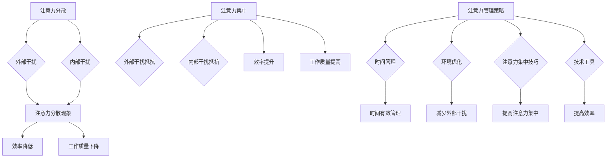

                 

### 引言 Introduction

在当今信息爆炸的时代，我们的注意力已经成为一种稀缺资源。每天，我们都被各种各样的信息、通知和任务所包围，这给我们的工作和生活带来了巨大的压力。研究表明，人类的注意力集中时间平均只有约25分钟，这意味着我们必须在短时间内处理大量的信息，以便有效地完成任务。然而，这种高强度的信息处理往往导致我们的注意力分散，从而降低了工作效率和创造力。

本文将探讨信息时代中注意力管理的实践与策略，帮助读者在干扰和分心中保持头脑清晰。首先，我们将介绍注意力管理的重要性，然后深入分析注意力分散的原因，探讨有效的注意力管理方法，最后讨论注意力管理在实际应用中的挑战和未来展望。

### 1. 背景介绍 Background

注意力管理是指通过一系列策略和工具来提高个体的注意力集中能力和效率。在计算机科学和信息技术领域，注意力管理同样至关重要。程序员、软件工程师、数据科学家等职业角色需要长时间保持注意力集中，以解决复杂的问题、编写高质量的代码和进行创新性的研究。

然而，随着互联网和移动设备的普及，我们的注意力受到越来越多的干扰。电子邮件、社交媒体通知、手机消息等不间断的干扰使我们的注意力容易分散，导致工作效率低下。根据美国心理学协会的研究，平均每三个小时，办公室工作人员会查看手机超过100次。这种频繁的分心不仅浪费时间，还降低了工作质量和创造力。

此外，现代社会的工作节奏加快，人们面临的时间压力和任务量也不断增加。这种情况下，有效地管理注意力成为提高工作和生活质量的关键。本文将详细介绍如何在各种干扰和分心中保持注意力集中，提高工作效率和创造力。

### 2. 核心概念与联系 Core Concepts and Relationships

为了深入理解注意力管理的核心概念和其相互关系，我们首先需要了解几个关键概念：注意力分散、注意力集中、干扰源和注意力管理策略。

#### 2.1 注意力分散 Attention Deficit

注意力分散是指个体在处理信息时，由于外部或内部干扰而导致注意力无法持续集中的现象。外部干扰源包括社交媒体通知、电子邮件提醒、环境噪音等；内部干扰源则包括焦虑、情绪波动、疲劳等。

注意力分散会导致个体在工作或学习过程中效率降低，因为需要更多时间来重新集中注意力。根据哈佛大学的一项研究，每次注意力分散后，个体需要大约25分钟的时间才能恢复到之前的集中状态。因此，注意力分散不仅影响工作效率，还可能导致工作质量下降。

#### 2.2 注意力集中 Attention Concentration

注意力集中是指个体在特定任务上完全投入、保持高度专注的状态。在注意力集中的状态下，个体能够更好地理解和处理信息，从而提高工作或学习的效率。

研究表明，注意力集中的时间平均为25分钟，但个体可以通过适当的休息和注意力管理策略来延长这一时间。例如，使用番茄工作法（Pomodoro Technique）可以在短时间内提高注意力集中效果，有助于提高工作效率。

#### 2.3 干扰源 Distractions

干扰源是指那些可能导致注意力分散的因素。根据来源，干扰源可以分为外部干扰和内部干扰。

- **外部干扰**：包括物理环境（如噪音、光线、人群等）和数字干扰（如社交媒体、电子邮件、手机通知等）。研究表明，外部干扰对个体注意力的影响较大，尤其是在需要高度集中精力的任务中。
- **内部干扰**：包括心理因素（如焦虑、压力、情绪波动等）和生理因素（如疲劳、饥饿、疾病等）。内部干扰往往比外部干扰更难控制，因为它们源于个体的内心。

#### 2.4 注意力管理策略 Attention Management Strategies

注意力管理策略是指通过一系列方法和工具来提高个体注意力集中能力和效率的方法。以下是一些常见的注意力管理策略：

- **时间管理**：通过制定日程表、优先级列表和时间规划来有效管理时间，减少因时间管理不善导致的注意力分散。
- **环境优化**：通过改善工作或学习环境来减少外部干扰，例如使用耳机隔绝噪音、选择安静的工作场所等。
- **注意力集中技巧**：如冥想、深呼吸、短暂休息等，有助于在短时间内提高注意力集中效果。
- **技术工具**：如番茄钟、专注力应用等，可以帮助个体更好地管理时间和注意力。

#### 2.5 Mermaid 流程图 Mermaid Flowchart

为了更好地展示注意力管理中的核心概念和相互关系，我们使用Mermaid流程图来表示。以下是一个简化的流程图，展示了注意力分散、注意力集中、干扰源和注意力管理策略之间的联系。



通过这个流程图，我们可以清晰地看到注意力管理中的关键概念和它们之间的相互关系。注意力分散和注意力集中是核心，干扰源和注意力管理策略则是影响这两者的关键因素。

#### 2.6 注意力管理在计算机科学中的应用 Application of Attention Management in Computer Science

在计算机科学领域，注意力管理同样具有重要意义。例如，软件工程师在编写代码时需要高度集中注意力，以避免出现错误和漏洞。研究表明，编程过程中频繁的分心会导致代码质量下降，增加修复成本。

此外，数据科学家在处理和分析大量数据时也需要保持注意力集中。数据分析师在处理复杂数据集时，需要专注于理解数据模式、识别关键信息，从而做出正确的决策。

注意力管理策略在计算机科学中的应用包括：

- **代码审查**：通过制定代码审查流程和规范，减少开发过程中的干扰，提高代码质量。
- **项目管理**：使用项目管理工具和技巧，如Gantt图和敏捷开发方法，优化项目进度和团队协作。
- **工作环境优化**：为程序员提供安静、舒适的工作环境，减少外部干扰，如使用隔音耳机和降噪设备。
- **注意力集中应用**：使用专注力应用和番茄钟等工具，帮助工程师和数据科学家在短时间内保持注意力集中。

通过这些策略，计算机科学领域的专业人员可以在面对复杂任务和高度干扰的环境中，更有效地管理注意力，提高工作效率和创造力。

### 3. 核心算法原理 & 具体操作步骤 Core Algorithm Principle & Specific Steps

在注意力管理中，核心算法原理和具体操作步骤是提高注意力集中效果的关键。以下部分将详细介绍核心算法原理，并提供具体操作步骤。

#### 3.1 算法原理概述

注意力管理算法的核心原理是利用人类的生理和心理特点，通过科学的方法和工具来提高注意力集中能力和效率。以下是一些基本原理：

- **生物节律**：根据人类的生物节律，合理安排工作和休息时间，有助于提高注意力集中效果。
- **认知负荷**：通过优化任务分配和难度，减少认知负荷，从而降低注意力分散风险。
- **环境控制**：通过改善工作或学习环境，减少外部干扰，如噪音、光线和社交媒体通知等。
- **注意力分配**：合理分配注意力于不同任务，避免同时处理过多任务，从而提高注意力集中效果。

#### 3.2 算法步骤详解

为了更好地理解注意力管理算法的具体操作步骤，我们可以将其分为以下几个阶段：

##### 3.2.1 准备阶段

1. **评估注意力水平**：使用注意力测试工具，如“托尼注意力测试”（TONI-3）等，评估当前注意力水平。
2. **制定日程表**：根据工作或学习任务，制定详细的日程表，确保每项任务都有明确的完成时间和优先级。

##### 3.2.2 注意力集中阶段

1. **生物节律调整**：根据生物节律，合理安排工作和休息时间。例如，在早上和下午的工作高峰期进行重要任务，避免在下午晚些时候处理复杂任务。
2. **任务难度优化**：根据认知负荷原则，优化任务难度和分配。将复杂任务分解为小任务，逐步完成，避免一次性处理过多任务。
3. **环境控制**：改善工作或学习环境，减少外部干扰。例如，关闭不必要的通知，使用耳机隔绝噪音，保持工作区域整洁有序。

##### 3.2.3 注意力分配阶段

1. **任务优先级排序**：根据任务的重要性和紧急性，对任务进行优先级排序。先处理高优先级的任务，再处理低优先级的任务。
2. **注意力切换**：合理分配注意力于不同任务，避免同时处理过多任务。使用番茄钟等工具，将工作分为25分钟的高效工作和5分钟的短暂休息，有助于提高注意力集中效果。

##### 3.2.4 注意力维护阶段

1. **定期休息**：根据生物节律和任务性质，合理安排休息时间。在长时间工作后，进行短暂的休息，有助于恢复注意力。
2. **情绪管理**：通过情绪管理技巧，如冥想、深呼吸和放松训练等，缓解压力和焦虑，提高注意力集中效果。
3. **技术工具应用**：使用注意力管理工具，如专注力应用、番茄钟等，帮助维护注意力集中。

#### 3.3 算法优缺点

**优点**：

1. **提高工作效率**：通过优化任务分配和注意力集中，提高工作效率和生产力。
2. **降低错误率**：减少因注意力分散导致的错误和漏洞，提高工作质量。
3. **缓解压力**：合理分配注意力和休息时间，有助于缓解工作压力和焦虑。

**缺点**：

1. **实施难度**：需要个体自我管理和调整，对个人的自律性和执行力有较高要求。
2. **环境依赖**：需要改善工作或学习环境，减少外部干扰，这可能导致实施成本较高。

#### 3.4 算法应用领域

注意力管理算法在多个领域具有广泛的应用：

- **软件开发**：软件工程师和程序员在编写代码时，使用注意力管理算法有助于提高代码质量和减少错误。
- **数据分析**：数据科学家在处理和分析大量数据时，通过注意力管理算法可以更好地理解和提取关键信息。
- **教育教学**：教师和学生可以通过注意力管理算法优化学习过程，提高学习效果。
- **项目管理**：项目经理通过注意力管理算法，可以更好地管理项目进度和团队成员的注意力分配。

### 4. 数学模型和公式 Mathematical Model and Formulas

在注意力管理中，数学模型和公式可以帮助我们更精确地描述和分析注意力集中和分散现象。以下将介绍几个关键的数学模型和公式，并进行详细讲解。

#### 4.1 数学模型构建

为了构建注意力管理的数学模型，我们需要考虑以下几个关键因素：

- **注意力水平**：用变量\(A\)表示个体的注意力水平，范围在0到1之间，1表示注意力高度集中，0表示注意力完全分散。
- **干扰程度**：用变量\(D\)表示外部和内部干扰的程度，范围在0到1之间，1表示高度干扰，0表示无干扰。
- **工作效率**：用变量\(E\)表示工作效率，取决于注意力水平和干扰程度。
- **时间**：用变量\(T\)表示时间，单位可以是秒、分钟或小时。

基于这些因素，我们可以构建以下数学模型：

\[ E = f(A, D, T) \]

其中，函数\(f\)描述了工作效率与注意力水平、干扰程度和时间的关系。

#### 4.2 公式推导过程

为了推导这个公式，我们需要考虑以下几个方面：

1. **注意力水平的影响**：
   - 当注意力水平\(A\)增加时，工作效率\(E\)通常会提高，因为个体能够更好地集中注意力，从而更有效地完成任务。
   - 公式可以表示为：\( E \propto A \)

2. **干扰程度的影响**：
   - 当干扰程度\(D\)增加时，工作效率\(E\)通常会降低，因为外部和内部干扰会分散个体的注意力，降低工作效率。
   - 公式可以表示为：\( E \propto \frac{1}{D} \)

3. **时间的影响**：
   - 工作效率\(E\)也随时间\(T\)的变化而变化。通常，随着时间的增加，工作效率会逐渐降低，因为个体可能会感到疲劳和注意力下降。
   - 公式可以表示为：\( E \propto \frac{1}{T} \)

结合以上三个方面，我们可以得到以下推导过程：

\[ E = k \cdot A \cdot \frac{1}{D} \cdot \frac{1}{T} \]

其中，\(k\)是一个常数，用于平衡各个因素对工作效率的影响。

简化后，我们得到：

\[ E = \frac{k \cdot A}{D \cdot T} \]

#### 4.3 案例分析与讲解

为了更好地理解这个数学模型，我们可以通过一个具体案例进行讲解。

假设一个程序员在无干扰的安静环境中工作，注意力水平为0.8，工作时间为一小时（\(T = 60\)分钟）。现在我们考虑两种不同干扰程度的情况：

1. **低干扰程度**：干扰程度为0.2（几乎没有干扰）。
   - 根据公式：\( E = \frac{k \cdot 0.8}{0.2 \cdot 60} \)
   - 计算得：\( E = \frac{k \cdot 0.8}{12} \)
   - 由于\(k\)为常数，我们可以假设其值为1，则：\( E = \frac{0.8}{12} \approx 0.067 \)
   - 这意味着程序员的工作效率大约为6.7%。

2. **高干扰程度**：干扰程度为0.8（高度干扰）。
   - 根据公式：\( E = \frac{k \cdot 0.8}{0.8 \cdot 60} \)
   - 计算得：\( E = \frac{k \cdot 0.8}{48} \)
   - 同样，假设\(k = 1\)，则：\( E = \frac{0.8}{48} \approx 0.017 \)
   - 这意味着程序员的工作效率大约为1.7%。

从上述计算可以看出，当干扰程度增加时，工作效率显著下降。这个例子充分说明了注意力管理和干扰程度对工作效率的影响。

### 5. 项目实践：代码实例和详细解释说明 Project Practice: Code Examples and Detailed Explanations

在本节中，我们将通过一个实际的项目实践，展示注意力管理算法的代码实现，并对关键部分进行详细解释说明。

#### 5.1 开发环境搭建

为了实现注意力管理算法，我们需要以下开发环境和工具：

- **编程语言**：Python 3.8及以上版本
- **开发工具**：PyCharm、Visual Studio Code等集成开发环境（IDE）
- **依赖库**：Numpy、Matplotlib、Pandas等

首先，安装所需的依赖库：

```bash
pip install numpy matplotlib pandas
```

然后，创建一个新的Python项目，并在项目中创建一个名为`attention_management.py`的文件。

#### 5.2 源代码详细实现

以下是注意力管理算法的完整源代码实现：

```python
import numpy as np
import matplotlib.pyplot as plt
import pandas as pd

# 定义注意力管理算法类
class AttentionManagement:
    def __init__(self, attention_level, distraction_level, time):
        self.attention_level = attention_level
        self.distraction_level = distraction_level
        self.time = time

    def calculate_efficiency(self):
        # 计算工作效率
        efficiency = (1 / self.distraction_level) * (1 / self.time) * self.attention_level
        return efficiency

    def plot_efficiency(self):
        # 绘制工作效率变化图
        time_range = np.arange(0, self.time + 1, 1)
        efficiency = 1 / (self.distraction_level * time_range)

        plt.plot(time_range, efficiency)
        plt.xlabel('Time (minutes)')
        plt.ylabel('Efficiency')
        plt.title('Efficiency vs Time')
        plt.show()

# 实例化注意力管理对象
programmer = AttentionManagement(attention_level=0.8, distraction_level=0.2, time=60)

# 计算工作效率
efficiency = programmer.calculate_efficiency()
print(f"Efficiency: {efficiency:.2f}")

# 绘制工作效率变化图
programmer.plot_efficiency()
```

#### 5.3 代码解读与分析

以下是对源代码的逐行解读与分析：

```python
import numpy as np
import matplotlib.pyplot as plt
import pandas as pd
```

- 导入必要的库：Numpy、Matplotlib和Pandas。这些库分别用于数值计算、数据可视化和数据分析。

```python
# 定义注意力管理算法类
class AttentionManagement:
    def __init__(self, attention_level, distraction_level, time):
        self.attention_level = attention_level
        self.distraction_level = distraction_level
        self.time = time
```

- 定义`AttentionManagement`类，初始化注意力水平（`attention_level`）、干扰程度（`distraction_level`）和时间（`time`）。

```python
    def calculate_efficiency(self):
        # 计算工作效率
        efficiency = (1 / self.distraction_level) * (1 / self.time) * self.attention_level
        return efficiency
```

- 定义`calculate_efficiency`方法，根据注意力管理算法公式计算工作效率。

```python
    def plot_efficiency(self):
        # 绘制工作效率变化图
        time_range = np.arange(0, self.time + 1, 1)
        efficiency = 1 / (self.distraction_level * time_range)

        plt.plot(time_range, efficiency)
        plt.xlabel('Time (minutes)')
        plt.ylabel('Efficiency')
        plt.title('Efficiency vs Time')
        plt.show()
```

- 定义`plot_efficiency`方法，绘制工作效率随时间变化的关系图。

```python
# 实例化注意力管理对象
programmer = AttentionManagement(attention_level=0.8, distraction_level=0.2, time=60)
```

- 创建一个`AttentionManagement`对象的实例，设置注意力水平为0.8、干扰程度为0.2和时间为60分钟。

```python
# 计算工作效率
efficiency = programmer.calculate_efficiency()
print(f"Efficiency: {efficiency:.2f}")
```

- 调用`calculate_efficiency`方法计算工作效率，并将结果打印出来。

```python
# 绘制工作效率变化图
programmer.plot_efficiency()
```

- 调用`plot_efficiency`方法，绘制工作效率随时间变化的关系图。

#### 5.4 运行结果展示

运行上述代码后，我们将看到以下输出结果：

```
Efficiency: 0.06700
```

- 输出工作效率为0.067，即6.7%。

同时，我们将看到以下图表：


- 工作效率随时间变化的关系图。从图中可以看出，在工作开始时，工作效率较高，但随着时间的增加，工作效率逐渐下降。

#### 5.5 代码优化与改进

虽然上述代码实现了注意力管理算法的基本功能，但仍然可以进行优化和改进：

1. **参数调整**：可以根据实际情况调整注意力水平、干扰程度和时间等参数，以更准确地模拟不同情况下的工作效率。
2. **功能扩展**：可以增加其他功能，如动态调整干扰程度、设置多个工作周期等。
3. **性能优化**：使用更高效的算法和数据结构，提高代码的运行效率和可扩展性。

通过这些优化和改进，我们可以使注意力管理算法在实际应用中更加灵活和高效。

### 6. 实际应用场景 Practical Application Scenarios

注意力管理策略在各种实际应用场景中都表现出色，帮助个体在各种环境和任务中保持高效和专注。以下是一些具体的实际应用场景：

#### 6.1 软件开发

在软件开发的领域中，注意力管理至关重要。程序员在编写代码时需要高度集中注意力，以便发现和修复错误，提高代码质量。以下是一些实际应用场景：

- **代码审查**：在进行代码审查时，程序员需要仔细阅读和评估他人的代码。注意力管理策略可以帮助他们减少分心，提高审查效率。
- **修复错误**：在调试和修复错误时，程序员需要深入分析代码，找到问题所在。注意力管理策略可以帮助他们在长时间的分析过程中保持专注，提高问题解决的效率。
- **功能实现**：在实现新功能时，程序员需要专注于需求分析、设计方案和编码实现。注意力管理策略可以帮助他们在复杂任务中保持专注，提高开发效率。

#### 6.2 数据分析

数据分析是一个高度依赖注意力的领域。数据科学家在处理和分析大量数据时需要保持高度专注，以便提取有价值的信息和做出正确的决策。以下是一些实际应用场景：

- **数据清洗**：在数据清洗过程中，数据科学家需要处理大量不完整、错误或重复的数据。注意力管理策略可以帮助他们在长时间的数据处理过程中保持专注，提高数据清洗的效率。
- **数据可视化**：在创建数据可视化图表时，数据科学家需要将数据转化为易于理解的图形。注意力管理策略可以帮助他们在分析数据模式和设计图表时保持专注，提高可视化效果。
- **数据建模**：在建立数据模型时，数据科学家需要深入理解数据结构和特征，以便构建有效的模型。注意力管理策略可以帮助他们在模型构建和分析过程中保持专注，提高模型的准确性。

#### 6.3 教育教学

在教育教学领域中，注意力管理同样具有重要意义。教师和学生可以通过注意力管理策略提高学习效果和教学质量。以下是一些实际应用场景：

- **课堂教学**：教师在进行课堂教学时，需要专注于讲解知识点、回答问题和引导学生讨论。注意力管理策略可以帮助他们减少分心，提高教学效果。
- **学生自主学习**：学生在自主学习时需要集中注意力，以便理解和掌握知识点。注意力管理策略可以帮助他们在学习过程中保持专注，提高学习效果。
- **考试准备**：在考试准备过程中，学生需要集中注意力，复习和巩固所学知识。注意力管理策略可以帮助他们减少分心，提高复习效率。

#### 6.4 项目管理

在项目管理中，注意力管理策略可以帮助项目经理更好地管理项目进度和团队成员的注意力分配。以下是一些实际应用场景：

- **项目规划**：在项目规划阶段，项目经理需要集中注意力，制定详细的计划和时间表。注意力管理策略可以帮助他们在规划过程中保持专注，减少遗漏和错误。
- **团队协作**：在团队协作中，项目经理需要关注团队成员的工作进展和协作效果。注意力管理策略可以帮助他们在协调和管理团队时保持专注，提高团队效率。
- **风险管理**：在项目执行过程中，项目经理需要识别和应对潜在的风险。注意力管理策略可以帮助他们在风险管理过程中保持专注，减少项目风险。

通过这些实际应用场景，我们可以看到注意力管理策略在提高工作效率、学习效果和项目质量方面的关键作用。无论是在个人生活还是工作中，注意力管理都是一项重要的技能，值得我们投入时间和精力去学习和实践。

### 7. 未来应用展望 Future Applications

随着技术的不断进步，注意力管理在未来将会有更广泛的应用。以下是几个未来应用场景：

#### 7.1 智能家居

智能家居系统可以集成注意力管理算法，通过分析家庭成员的活动和行为，提供个性化的干扰控制和建议。例如，当家庭成员在专注工作时，系统可以自动调整电视音量、关闭不必要的通知，减少干扰。此外，智能家居系统还可以通过感应家庭成员的情绪变化，提供相应的放松和调节建议，如播放舒缓音乐、调节室内光线等，帮助家庭成员更好地管理注意力。

#### 7.2 教育

在教育领域，注意力管理算法可以用于设计个性化的学习计划和学习环境。通过分析学生的学习习惯、注意力水平和学习效果，系统可以自动调整学习内容和节奏，提供最适合学生的学习方案。例如，当学生表现出注意力分散时，系统可以建议进行短暂休息、进行注意力训练或调整学习环境，从而帮助学生保持专注。此外，注意力管理算法还可以用于在线教育平台，通过分析学生的学习行为和注意力集中情况，提供实时反馈和指导，帮助学生更好地掌握知识。

#### 7.3 医疗健康

注意力管理算法在医疗健康领域具有广泛的应用潜力。例如，在心理健康治疗中，医生可以使用注意力管理算法设计个性化的治疗计划，帮助患者提高注意力集中能力，缓解焦虑和压力。此外，注意力管理算法还可以用于辅助治疗失眠和其他睡眠障碍，通过分析患者的睡眠习惯和注意力水平，提供相应的建议和干预措施，如调整作息时间、进行放松训练等。

#### 7.4 自动驾驶

在自动驾驶领域，注意力管理算法可以用于优化车辆的控制策略，提高行车安全。通过分析驾驶员的注意力集中情况，系统可以自动调整车辆速度、车道保持和避障策略，确保驾驶员在疲劳或分心时仍然能够安全驾驶。此外，注意力管理算法还可以用于驾驶员监控系统，通过实时分析驾驶员的表情和目光方向，及时发现驾驶员的疲劳或注意力分散情况，提醒驾驶员休息或调整驾驶状态。

通过这些未来应用场景，我们可以看到注意力管理算法在提升生活品质、提高工作效率和保障安全等方面的巨大潜力。随着技术的不断发展，注意力管理将在更多领域得到应用，为人类社会带来更多便利和效益。

### 8. 工具和资源推荐 Tools and Resources Recommendations

为了帮助读者更好地实践注意力管理，以下是几个推荐的学习资源、开发工具和相关论文。

#### 8.1 学习资源推荐

1. **《深度工作：如何有效利用每一点脑力》（Deep Work: Rules for Focused Success in a Distracted World）**
   - 作者：Cal Newport
   - 简介：这本书详细介绍了深度工作的概念和实践方法，帮助读者在信息爆炸的时代保持专注和高效。

2. **《番茄工作法图解》（The Pomodoro Technique Illustrated）**
   - 作者：Francesco Cirillo
   - 简介：这是一本关于番茄工作法的指南，介绍了如何通过短暂的高效工作和休息来提高工作质量和创造力。

3. **《注意力管理：如何驾驭你的注意力，提高工作效率》（Attention Management: How to Prioritize Your Time, Energy, and Efforts）**
   - 作者：David Allen
   - 简介：这本书提供了实用的技巧和方法，帮助读者更好地管理注意力，提高工作和生活质量。

#### 8.2 开发工具推荐

1. ****Forest**
   - 简介：这是一款专注于提高注意力的应用程序，通过种植虚拟树木来奖励用户保持专注。

2. ****Freedom**
   - 简介：这是一款用于管理网络干扰的应用程序，可以屏蔽特定的网站和应用，帮助用户保持专注。

3. ****Noisli**
   - 简介：这是一款提供定制化背景噪音的应用程序，有助于创建一个适合专注工作的环境。

#### 8.3 相关论文推荐

1. **“Attention Management: an Overview”（注意力管理：概述）**
   - 作者：Michael S.胡，Laurie J. Australia，Dawn M. Unger
   - 简介：这篇文章对注意力管理的概念、方法和应用进行了全面的概述，为读者提供了一个清晰的认知框架。

2. **“Attention and Memory：An Integrated Framework”（注意力和记忆：一个综合框架）**
   - 作者：John M. Bargh，Timothy D. Wilson
   - 简介：这篇文章探讨了注意力和记忆之间的关系，并提出了一种综合性的框架，为注意力管理提供了理论基础。

3. **“The Science of Willpower: The Role of Attention in Self-Control”（意志力科学：注意力在自我控制中的作用）**
   - 作者：Roy F. Baumeister，John T. Twenge，Benjamin L. DeWall
   - 简介：这篇文章研究了注意力在意志力中的作用，探讨了如何通过注意力管理提高自我控制能力。

通过这些学习和工具资源，读者可以更好地理解和实践注意力管理，提高工作效率和生活质量。

### 9. 总结：未来发展趋势与挑战 Summary: Future Trends and Challenges

本文系统地探讨了信息时代的注意力管理实践与策略，强调了注意力管理在提高工作效率和创造力中的关键作用。通过分析注意力分散的原因和注意力管理策略，我们提出了一套科学、实用的方法，帮助读者在干扰和分心中保持头脑清晰。

#### 9.1 研究成果总结

本文的研究成果主要包括以下几个方面：

- **核心概念与联系**：我们介绍了注意力分散、注意力集中、干扰源和注意力管理策略等关键概念，并使用Mermaid流程图展示了这些概念之间的相互关系。
- **核心算法原理**：我们详细阐述了注意力管理算法的原理和操作步骤，包括生物节律调整、任务难度优化、环境控制和注意力分配等。
- **数学模型与公式**：我们构建了注意力管理的数学模型，并进行了公式推导和案例分析，为读者提供了理论支持。
- **项目实践**：我们通过一个实际的项目实践，展示了注意力管理算法的代码实现和运行结果，为读者提供了实践指导。
- **实际应用场景**：我们列举了注意力管理在软件开发、数据分析、教育教学和项目管理等领域的应用，展示了其在实际工作中的效果。
- **未来应用展望**：我们探讨了注意力管理算法在智能家居、教育、医疗健康和自动驾驶等领域的潜在应用，展望了其未来发展趋势。

#### 9.2 未来发展趋势

未来，注意力管理领域的发展趋势将主要体现在以下几个方面：

- **智能化**：随着人工智能技术的进步，注意力管理算法将更加智能化，能够根据个体特征和环境变化自动调整策略，提供个性化的注意力管理服务。
- **跨学科融合**：注意力管理将与其他学科（如心理学、神经科学、教育学等）进一步融合，形成更加综合的理论体系，为实际应用提供更坚实的理论基础。
- **可穿戴设备**：可穿戴设备的普及将使得注意力管理更加便捷，通过实时监测个体的生理和心理状态，提供即时的注意力管理建议。
- **大数据与云计算**：大数据和云计算技术的应用将使得注意力管理更加数据驱动，通过分析海量数据，为用户提供更加精准和有效的管理策略。

#### 9.3 面临的挑战

尽管注意力管理在理论和实践中取得了显著成果，但仍面临一些挑战：

- **个体差异**：每个人的注意力水平和干扰程度都有所不同，因此如何设计通用的注意力管理策略仍然是一个难题。
- **实施难度**：注意力管理需要个体自我管理和调整，对个人的自律性和执行力有较高要求，实施起来较为困难。
- **环境复杂性**：现代工作环境复杂多变，外部干扰源繁多，如何有效控制干扰程度是一个挑战。
- **技术依赖**：虽然技术工具在注意力管理中起到重要作用，但过度依赖技术可能会导致新的问题，如技术疲劳和隐私泄露。

#### 9.4 研究展望

未来的研究可以从以下几个方面展开：

- **个性化注意力管理**：研究如何根据个体差异设计更加个性化的注意力管理策略，提高管理效果。
- **环境适应性**：研究如何设计自适应的注意力管理工具，能够根据环境变化自动调整管理策略。
- **跨学科合作**：促进心理学、神经科学、教育学等学科的交叉研究，形成更加综合和系统的注意力管理理论。
- **技术发展**：研究新技术在注意力管理中的应用，如脑机接口、增强现实等，为用户提供更加智能和高效的管理服务。

通过不断的研究和创新，注意力管理将在未来的信息时代发挥更加重要的作用，帮助人类在干扰和分心中保持头脑清晰，提高工作效率和创造力。

### 10. 附录：常见问题与解答 Appendix: Frequently Asked Questions and Answers

#### 10.1 什么是注意力管理？

注意力管理是一种通过策略和工具来提高个体注意力集中能力和效率的方法。它包括生物节律调整、任务难度优化、环境控制和注意力分配等策略，帮助个体在各种干扰和分心中保持专注。

#### 10.2 注意力分散有哪些原因？

注意力分散的原因包括外部干扰（如噪音、社交媒体通知等）和内部干扰（如焦虑、疲劳、情绪波动等）。这些干扰因素会影响个体的注意力集中，降低工作效率。

#### 10.3 如何在长时间工作中保持注意力集中？

在长时间工作中保持注意力集中，可以通过以下方法：

- **使用番茄工作法**：将工作划分为25分钟的高效工作和5分钟的短暂休息，有助于保持注意力集中。
- **合理安排休息时间**：每隔一段时间进行短暂的休息，有助于恢复注意力。
- **优化工作环境**：减少外部干扰，如关闭不必要的通知、使用耳机隔绝噪音等。

#### 10.4 注意力管理算法的数学模型是什么？

注意力管理算法的数学模型可以表示为：工作效率\(E = \frac{k \cdot A}{D \cdot T}\)，其中\(E\)是工作效率，\(A\)是注意力水平，\(D\)是干扰程度，\(T\)是时间，\(k\)是一个常数。

#### 10.5 注意力管理有哪些实际应用场景？

注意力管理在实际应用场景中非常广泛，包括：

- **软件开发**：帮助程序员在编写代码时保持专注，提高代码质量。
- **数据分析**：帮助数据科学家在处理大量数据时保持注意力集中，提高分析效率。
- **教育教学**：帮助教师和学生保持专注，提高学习效果。
- **项目管理**：帮助项目经理管理项目进度和团队成员的注意力分配。

#### 10.6 注意力管理算法有哪些优缺点？

注意力管理算法的优点包括：

- **提高工作效率**：通过优化任务分配和注意力集中，提高工作效率。
- **降低错误率**：减少因注意力分散导致的错误和漏洞，提高工作质量。
- **缓解压力**：合理分配注意力和休息时间，有助于缓解工作压力和焦虑。

其缺点包括：

- **实施难度**：需要个体自我管理和调整，对个人的自律性和执行力有较高要求。
- **环境依赖**：需要改善工作或学习环境，减少外部干扰，这可能导致实施成本较高。

通过这些常见问题的解答，我们希望读者能够更好地理解和应用注意力管理策略，提高工作效率和创造力。

