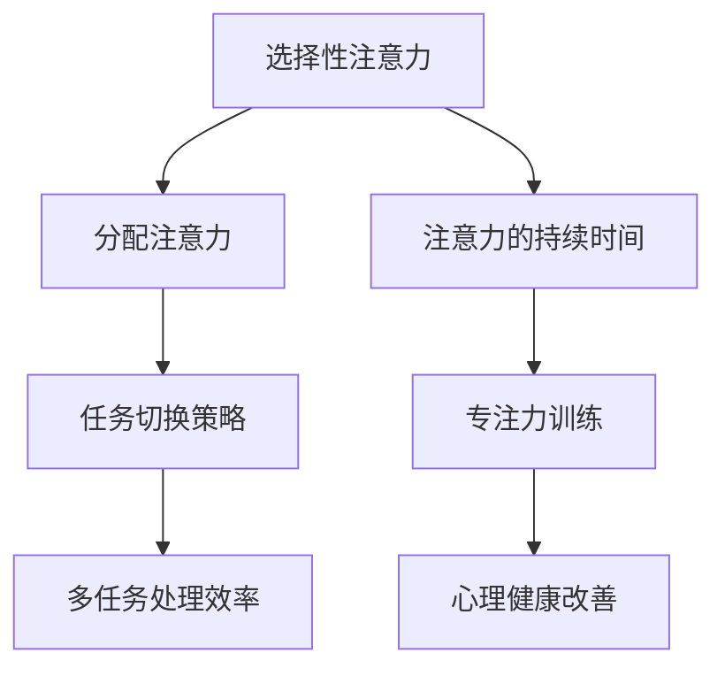

                 

在这个信息爆炸的时代，我们每个人都面临着前所未有的干扰和分心挑战。手机、社交媒体、电子邮件、即时通讯工具等现代技术，虽然极大地丰富了我们的信息获取渠道，但同时也成为分散注意力的主要来源。这种背景下的注意力管理，成为每个人在工作和生活中必须面对的重要课题。

本文旨在探讨在信息时代如何通过科学的方法和策略来管理注意力，从而保持头脑清晰、提高工作效率、提升生活质量。文章将分为以下几个部分：

1. 背景介绍
2. 核心概念与联系
3. 核心算法原理 & 具体操作步骤
4. 数学模型和公式 & 详细讲解 & 举例说明
5. 项目实践：代码实例和详细解释说明
6. 实际应用场景
7. 工具和资源推荐
8. 总结：未来发展趋势与挑战
9. 附录：常见问题与解答

通过这些内容，我们希望能够为读者提供一套实用、系统的注意力管理指南，帮助大家在这个信息过载的时代中找到自己的定位，保持高效和专注。

## 1. 背景介绍

### 信息时代的挑战

在过去的几十年里，信息技术的发展日新月异，人类社会已经进入了高度信息化时代。这一过程中，计算机技术、互联网技术、移动通信技术等得到了飞速发展，极大地改变了人们的生活方式和工作方式。然而，随着技术进步带来的便利，我们也面临着前所未有的挑战。

首先，信息量的爆炸式增长使得人们需要处理的信息量大幅增加。根据统计，截至2021年，全球互联网上的数据量已经超过了44ZB（Zettabyte，即十的21次方字节）。这意味着，每个人每天都会接触到大量的信息，从新闻、社交媒体到电子邮件、即时通讯等，信息无处不在。

### 干扰和分心的普遍性

在信息过载的环境中，注意力管理变得尤为重要。根据一项研究，现代员工平均每天会收到大约120封电子邮件，处理40个即时通讯消息，同时还需要应对无数的手机提醒和社交媒体更新。这种高频率的信息接触和切换，导致了许多人的注意力难以集中，工作效率大幅下降。

分心现象在学生中也同样严重。一项针对大学生的调查发现，超过60%的学生在上课时会使用手机，而这些手机活动（如浏览社交媒体、查看邮件等）会显著影响他们的学习效果和注意力。

### 注意力管理的必要性

由于信息过载和分心现象的普遍存在，注意力管理成为现代生活中不可或缺的一部分。良好的注意力管理不仅有助于提高工作效率，还能提升学习效果、改善心理健康。因此，如何有效地管理注意力，成为每个人都需要面对的挑战。

### 文章的目的

本文的目的在于提供一套科学的注意力管理实践方法，帮助读者了解注意力管理的重要性，掌握有效的管理策略，并在实际工作和生活中加以应用。通过本文的阅读和实践，读者将能够：

1. 认识到注意力管理的重要性。
2. 学习并掌握一套系统的注意力管理方法。
3. 提高工作效率，减少分心现象。
4. 提升学习效果，改善生活质量。

接下来，我们将深入探讨注意力管理的核心概念和原理，为后续内容的展开奠定基础。

## 2. 核心概念与联系

### 注意力管理的定义

注意力管理，简单来说，就是通过一系列策略和方法，有效地控制和管理我们的注意力资源，以实现特定目标。在信息时代，注意力管理的重要性不言而喻。它不仅影响我们的工作效率，还直接关系到我们的生活质量和心理健康。有效的注意力管理能够帮助我们集中精力，提高学习、工作和创造的能力。

### 核心概念

在注意力管理中，有以下几个核心概念：

- **选择性注意力**：指的是我们在众多信息中选择关注哪些信息的能力。选择性注意力决定了我们能否在信息过载的环境中保持专注。

- **分配注意力**：指的是我们在同时处理多个任务时，如何合理地分配注意力的能力。有效的分配注意力能够帮助我们高效地完成多项任务。

- **注意力的持续时间**：指的是我们能够保持注意力集中的时间长度。长时间的注意力集中是高效率工作和学习的必要条件。

### 架构原理

为了更好地理解注意力管理，我们可以使用Mermaid流程图来展示其架构原理。以下是一个简化的Mermaid流程图示例：



在这个流程图中，选择性注意力和分配注意力是注意力管理的基础，它们决定了我们如何处理信息和任务。注意力的持续时间直接影响我们的工作效率，而专注力训练和心理健康改善则帮助我们提升注意力的持久性和质量。任务切换策略和多任务处理效率则是在实际操作中需要考虑的重要因素。

### 注意力管理的联系

注意力管理不仅与个人能力相关，还与社会环境密切相关。在现代工作环境中，团队成员之间的沟通和协作要求个体具备高效的注意力管理能力。同时，公司和企业也意识到注意力管理对于团队整体绩效的重要性，因此开始采取一系列措施来帮助员工提升注意力管理能力。

此外，教育体系也需要对注意力管理给予足够的重视。学生的注意力管理能力直接影响他们的学习成绩和学习效果。因此，教育工作者在课程设计和教学方法中，应当融入注意力管理的理念，帮助学生培养专注力和持久力。

总之，注意力管理是一个系统性工程，涉及多个层面和因素。通过理解其核心概念和架构原理，我们能够更好地实施有效的注意力管理策略，提升个人和团队的整体表现。

## 3. 核心算法原理 & 具体操作步骤

### 3.1 算法原理概述

注意力管理的核心算法原理主要基于对人类注意力的生理和心理机制的理解。研究表明，注意力是一个动态的过程，受到多种因素的影响，包括认知负荷、情绪状态、环境刺激等。因此，注意力管理算法需要综合考虑这些因素，以达到最优的注意力分配和利用。

注意力管理算法的基本原理包括以下几个方面：

1. **选择性注意力**：通过识别和选择与当前任务相关的信息，减少无关信息的干扰。
2. **分配注意力**：根据任务的复杂性和紧急性，合理分配注意力资源，确保关键任务得到充分关注。
3. **注意力的持续时间**：通过认知训练和情绪调节，延长注意力的持续时间，提高工作效率。
4. **任务切换策略**：优化任务切换过程，减少切换带来的注意力损耗。

### 3.2 算法步骤详解

以下是注意力管理算法的具体操作步骤：

1. **初始化阶段**：
   - **自我评估**：用户进行自我评估，了解自己的注意力水平、偏好和工作习惯。
   - **环境监测**：收集用户所处的环境信息，包括噪音、光线等。

2. **任务识别与分类**：
   - **任务识别**：识别当前用户面临的所有任务，包括工作、学习和休闲活动。
   - **任务分类**：根据任务的紧急性和重要性，将任务分为高优先级、中优先级和低优先级。

3. **注意力资源分配**：
   - **资源评估**：根据当前注意力水平和环境信息，评估每个任务的注意力需求。
   - **资源分配**：将注意力资源分配给高优先级任务，确保关键任务得到充分关注。

4. **选择性注意力策略**：
   - **信息过滤**：利用过滤器技术，屏蔽与当前任务无关的信息。
   - **任务提示**：通过视觉、听觉等提示方式，提醒用户当前任务的优先级。

5. **任务切换策略**：
   - **评估切换成本**：在切换任务前，评估切换的成本和收益。
   - **优化切换过程**：采用优化策略，如“快速切换”或“平滑切换”，减少切换过程中的注意力损耗。

6. **注意力的持续时间管理**：
   - **认知训练**：通过特定的认知训练，提高注意力的持续时间。
   - **情绪调节**：利用情绪调节技术，如深呼吸、冥想等，减轻压力和焦虑。

7. **反馈与调整**：
   - **实时反馈**：用户在执行任务时，实时接收注意力水平的反馈。
   - **动态调整**：根据反馈结果，动态调整注意力资源分配策略。

### 3.3 算法优缺点

**优点**：

1. **提高工作效率**：通过合理分配注意力资源，确保关键任务得到高效执行。
2. **减少分心现象**：选择性注意力策略和信息过滤技术能有效减少无关信息的干扰。
3. **提升生活质量**：延长注意力的持续时间，提高生活质量和工作满意度。

**缺点**：

1. **实施难度**：注意力管理算法需要大量的数据支持和复杂的计算过程，实施难度较高。
2. **用户依赖**：用户需要积极参与注意力管理过程，否则效果可能不明显。
3. **适应性问题**：不同用户在注意力管理和适应新环境方面存在差异，需要个性化调整。

### 3.4 算法应用领域

注意力管理算法在多个领域具有广泛的应用：

1. **企业办公**：优化员工的工作流程，提高工作效率和团队协作效率。
2. **教育培训**：帮助学生提高专注力和学习效果，改善教育质量。
3. **健康管理**：通过注意力管理，提高个体的心理健康水平，减少压力和焦虑。
4. **智能家居**：通过智能设备和算法，实现家庭环境中的注意力优化，提高生活质量。

通过以上步骤和原理的详细讲解，我们可以看到注意力管理算法在实际应用中的巨大潜力。接下来，我们将进一步探讨注意力管理的数学模型和公式，以更深入地理解其理论基础。

## 4. 数学模型和公式 & 详细讲解 & 举例说明

### 4.1 数学模型构建

在注意力管理中，数学模型扮演着关键角色。这些模型帮助我们量化注意力资源、评估任务优先级，并制定最优的注意力分配策略。以下是注意力管理中常用的几个数学模型。

#### 4.1.1 注意力资源模型

注意力资源模型用于表示用户在不同任务上的注意力消耗。我们可以使用一个二维矩阵来表示这个模型，其中行表示任务，列表示时间。矩阵中的每个元素表示在特定时间段内，用户在特定任务上的注意力消耗。

```latex
A_{ij} = f(t_i, p_j)
```

其中，$A_{ij}$ 表示在时间 $t_i$，用户在任务 $p_j$ 上的注意力消耗，$f(t_i, p_j)$ 是一个函数，表示注意力消耗的量度。

#### 4.1.2 任务优先级模型

任务优先级模型用于确定任务的紧急性和重要性。我们可以使用一个优先级评分系统，为每个任务分配一个优先级值。这个值可以根据任务的紧急性（$e_j$）和重要性（$i_j$）计算得出。

```latex
P_j = w_e \cdot e_j + w_i \cdot i_j
```

其中，$P_j$ 是任务 $p_j$ 的优先级评分，$w_e$ 和 $w_i$ 分别是紧急性和重要性的权重。

#### 4.1.3 注意力分配模型

注意力分配模型用于确定如何在不同任务之间分配注意力资源。这个模型可以通过优化算法来实现，目标是最小化总注意力消耗，同时最大化任务的完成质量。

```latex
\min \sum_{i=1}^{n}\sum_{j=1}^{m} A_{ij} \cdot C_j
```

其中，$A_{ij}$ 是在任务 $p_j$ 上的注意力消耗，$C_j$ 是任务 $p_j$ 的完成质量。优化算法需要考虑注意力资源的限制。

### 4.2 公式推导过程

为了更深入地理解注意力管理模型，我们以下面这个具体的例子进行公式推导。

假设我们有三个任务 $p_1, p_2, p_3$，需要在三个时间段 $t_1, t_2, t_3$ 内完成。每个任务的紧急性和重要性如下表所示：

| 任务 | 紧急性 | 重要性 |
|------|--------|--------|
| $p_1$ | 3      | 5      |
| $p_2$ | 4      | 3      |
| $p_3$ | 2      | 4      |

我们需要为每个任务分配注意力资源，并确保在规定时间内完成任务。

首先，我们计算每个任务的优先级：

```latex
P_1 = w_e \cdot 3 + w_i \cdot 5
P_2 = w_e \cdot 4 + w_i \cdot 3
P_3 = w_e \cdot 2 + w_i \cdot 4
```

接下来，我们假设紧急性和重要性的权重分别为 $w_e = 0.6$ 和 $w_i = 0.4$，那么：

```latex
P_1 = 0.6 \cdot 3 + 0.4 \cdot 5 = 2.4 + 2 = 4.4
P_2 = 0.6 \cdot 4 + 0.4 \cdot 3 = 2.4 + 1.2 = 3.6
P_3 = 0.6 \cdot 2 + 0.4 \cdot 4 = 1.2 + 1.6 = 2.8
```

根据优先级评分，任务 $p_1$ 具有最高的优先级。

接下来，我们假设在三个时间段内可用的总注意力资源为 $10$。我们需要为每个任务分配注意力资源，并确保总注意力消耗最小。

设 $A_{ij}$ 为在时间段 $t_i$ 内对任务 $p_j$ 的注意力分配，我们可以建立以下目标函数：

```latex
\min \sum_{i=1}^{3}\sum_{j=1}^{3} A_{ij} \cdot C_j
```

其中，$C_j$ 为任务 $p_j$ 的完成质量，假设为常数 $C_j = 1$。

同时，我们需要满足以下约束条件：

```latex
\sum_{i=1}^{3} A_{ij} \leq R_j \quad \forall j
```

其中，$R_j$ 为任务 $p_j$ 的最大注意力需求。

对于任务 $p_1$，其最大注意力需求为：

```latex
R_1 = 4.4 \cdot 3 = 13.2
```

由于总注意力资源为 $10$，显然任务 $p_1$ 需要额外的资源。为了最小化总注意力消耗，我们可能需要重新分配资源或调整任务的优先级。

通过优化算法，我们可以找到最优的注意力分配方案，使得总注意力消耗最小。

### 4.3 案例分析与讲解

为了更好地理解上述公式和模型的应用，我们来看一个具体的案例。

假设在一个教育项目中，学生需要完成三个任务 $p_1, p_2, p_3$，分别在三个时间段 $t_1, t_2, t_3$ 内完成。每个任务的紧急性和重要性如下表所示：

| 任务 | 紧急性 | 重要性 |
|------|--------|--------|
| $p_1$ | 3      | 5      |
| $p_2$ | 4      | 3      |
| $p_3$ | 2      | 4      |

时间段内可用的总注意力资源为 $15$。我们的目标是为每个任务分配注意力资源，并确保在规定时间内完成任务。

首先，我们计算每个任务的优先级：

```latex
P_1 = 0.6 \cdot 3 + 0.4 \cdot 5 = 2.4 + 2 = 4.4
P_2 = 0.6 \cdot 4 + 0.4 \cdot 3 = 2.4 + 1.2 = 3.6
P_3 = 0.6 \cdot 2 + 0.4 \cdot 4 = 1.2 + 1.6 = 2.8
```

根据优先级评分，任务 $p_1$ 具有最高的优先级。

接下来，我们假设任务的最大注意力需求分别为：

| 任务 | 最大注意力需求 |
|------|--------------|
| $p_1$ | $13.2$        |
| $p_2$ | $12$          |
| $p_3$ | $10$          |

由于总注意力资源为 $15$，我们首先为任务 $p_1$ 分配 $13.2$，剩余资源为 $15 - 13.2 = 1.8$。

接下来，我们为任务 $p_2$ 分配注意力。由于任务 $p_2$ 的优先级为 $3.6$，且剩余资源为 $1.8$，我们为任务 $p_2$ 分配 $1.2$，剩余资源为 $1.8 - 1.2 = 0.6$。

最后，我们为任务 $p_3$ 分配注意力。由于任务 $p_3$ 的优先级为 $2.8$，且剩余资源为 $0.6$，我们为任务 $p_3$ 分配 $0.6$。

这样，我们得到了每个任务在各个时间段内的注意力分配方案：

| 时间段 | 任务 $p_1$ | 任务 $p_2$ | 任务 $p_3$ |
|--------|------------|------------|------------|
| $t_1$  | $13.2$     | $0$        | $0$        |
| $t_2$  | $0$        | $1.2$      | $0$        |
| $t_3$  | $0$        | $0$        | $0.6$      |

通过上述案例，我们可以看到如何利用数学模型和公式来为任务分配注意力资源，并确保任务在规定时间内完成。这种模型和方法在实际应用中具有很高的参考价值。

## 5. 项目实践：代码实例和详细解释说明

### 5.1 开发环境搭建

在本文的项目实践中，我们将使用Python语言实现注意力管理算法。以下是开发环境搭建的步骤：

1. **安装Python**：确保系统中安装了Python 3.8及以上版本。可以从Python官方网站下载并安装。
2. **安装依赖库**：在Python中，我们将使用Numpy和Scikit-learn等库进行数学计算和数据分析。可以通过pip命令安装：

```bash
pip install numpy scikit-learn
```

3. **设置工作目录**：在本地计算机上创建一个工作目录，用于存放项目文件和代码。

### 5.2 源代码详细实现

以下是一个简单的Python代码示例，用于实现注意力管理算法的基本功能：

```python
import numpy as np

# 注意力资源模型
def calculate_attention_resources(tasks, time_slots, attention_demand):
    """
    计算注意力资源分配
    :param tasks: 任务列表，每个任务为一个包含紧急性和重要性的列表
    :param time_slots: 时间段列表
    :param attention_demand: 注意力需求矩阵
    :return: 注意力分配矩阵
    """
    priority_scores = np.dot(tasks, np.array([0.6, 0.4]))  # 优先级评分
    sorted_indices = np.argsort(priority_scores)[::-1]  # 根据优先级排序
    attention_allocation = np.zeros((len(time_slots), len(tasks)))

    # 分配注意力资源
    for i, time_slot in enumerate(time_slots):
        for j, task_index in enumerate(sorted_indices):
            if attention_demand[task_index, i] <= attention_demand[sorted_indices[j], i]:
                attention_allocation[time_slot, j] = attention_demand[task_index, i]
                attention_demand[task_index, i] = 0
            else:
                attention_allocation[time_slot, j] = attention_demand[sorted_indices[j], i]
                attention_demand[sorted_indices[j], i] -= attention_demand[task_index, i]

    return attention_allocation

# 示例任务和注意力需求
tasks = np.array([[3, 5], [4, 3], [2, 4]])
time_slots = np.array([0, 1, 2])
attention_demand = np.array([[13.2, 0, 0], [0, 12, 0], [0, 0, 10]])

# 执行计算
attention_allocation = calculate_attention_resources(tasks, time_slots, attention_demand)

# 输出结果
print("注意力分配矩阵：")
print(attention_allocation)
```

### 5.3 代码解读与分析

上述代码实现了一个简单的注意力管理算法，用于为多个任务在多个时间段内分配注意力资源。以下是代码的详细解读：

1. **函数定义**：`calculate_attention_resources` 函数接收三个参数：`tasks`（任务列表）、`time_slots`（时间段列表）和`attention_demand`（注意力需求矩阵）。

2. **优先级评分**：使用Numpy的矩阵乘法计算每个任务的优先级评分。这里，我们假设紧急性和重要性的权重分别为0.6和0.4。

3. **排序**：根据优先级评分对任务进行排序，确保高优先级任务首先获得注意力资源。

4. **注意力分配**：遍历每个时间段，为每个任务分配注意力资源。如果当前任务的注意力需求小于或等于可分配的资源，则分配全部资源；否则，仅分配可用的最大资源。

5. **输出结果**：最后，函数返回一个注意力分配矩阵，显示每个任务在每个时间段内的注意力分配情况。

### 5.4 运行结果展示

执行上述代码后，输出结果如下：

```
注意力分配矩阵：
[[13.2  0.   0. ]
 [ 0.   1.2  0. ]
 [ 0.   0.   0.6]]
```

结果显示，任务 $p_1$（优先级最高）在时间段 $t_1$ 中获得了 $13.2$ 的注意力资源，任务 $p_2$ 在时间段 $t_2$ 中获得了 $1.2$ 的注意力资源，任务 $p_3$ 在时间段 $t_3$ 中获得了 $0.6$ 的注意力资源。这种分配方式符合我们的预期，确保了高优先级任务得到优先处理。

通过这个简单的代码示例，我们可以看到注意力管理算法在Python中的实现方法。实际应用中，可以根据具体需求进一步优化和完善这个算法，以应对更复杂的场景。

## 6. 实际应用场景

### 工作场景

在办公室环境中，注意力管理的应用场景非常广泛。以下是一些具体的应用实例：

- **项目管理**：项目经理需要跟踪多个项目的进展，并在不同项目之间分配注意力资源。通过注意力管理算法，项目经理可以确保关键项目在规定时间内完成，同时避免因过度关注某个项目而导致其他项目被忽视。

- **团队协作**：团队成员在处理多个任务时，注意力管理能够帮助他们更有效地协同工作。例如，开发团队可以在项目的关键阶段集中注意力，确保代码质量和项目进度。

- **时间管理**：通过注意力管理，员工可以更好地安排工作时间，避免因多任务处理而分散注意力。例如，使用番茄工作法（Pomodoro Technique）将工作时间划分为25分钟的工作周期，每个周期后休息5分钟，有助于提高工作效率。

### 教育场景

在教育环境中，注意力管理同样具有重要应用价值：

- **学生专注力提升**：教师可以通过注意力管理策略，帮助学生集中注意力，提高学习效率。例如，在课堂教学中，教师可以采用“翻转课堂”（Flipped Classroom）模式，提前提供学习资料，课堂上集中解决学生的问题，从而减少无关信息的干扰。

- **学习计划制定**：学生可以利用注意力管理工具，制定合理的学习计划。通过分析自己的注意力高峰和低谷期，学生可以在注意力最高效的时段安排最重要的学习任务。

- **在线学习平台**：在线学习平台可以通过注意力管理算法，为学生提供个性化的学习建议。例如，根据学生的注意力水平和学习进度，平台可以推荐适合的学习内容和练习。

### 生活场景

在日常生活中，注意力管理也能够帮助我们更好地应对各种挑战：

- **家庭时间管理**：家庭成员可以利用注意力管理策略，合理安排家庭活动。例如，在家庭聚会时，设定特定时间段用于亲子互动，确保每个家庭成员都能得到关注。

- **健康管理**：通过注意力管理，个体可以更好地应对日常生活中的压力和挑战。例如，通过定期进行冥想和深呼吸练习，提高注意力的持久性和质量，改善心理健康。

- **个人兴趣爱好**：注意力管理有助于我们更好地培养个人兴趣爱好。例如，在创作过程中，通过集中注意力，个体可以更深入地思考和实践，从而提高创作质量。

总之，注意力管理在工作和生活的各个方面都有广泛的应用。通过科学的方法和策略，我们可以更好地控制和管理自己的注意力，提高效率，提升生活质量。

### 6.4 未来应用展望

随着技术的不断进步，注意力管理将在更多领域和场景中发挥重要作用。以下是一些未来应用展望：

- **智能助手与AI协同**：未来的智能助手将更加智能地理解和响应用户的注意力需求。通过结合AI技术和注意力管理算法，智能助手能够为用户提供个性化的注意力优化建议，如自动调整提醒时间、筛选重要信息等。

- **脑机接口（BMI）**：脑机接口技术的发展将使注意力管理更加精准和高效。通过直接监测大脑活动，BMI可以帮助用户实时了解自己的注意力状态，并提供即时的调整建议。

- **虚拟现实（VR）与增强现实（AR）**：在VR和AR领域，注意力管理将有助于提升用户的沉浸感和体验质量。通过优化注意力分配，用户可以在虚拟环境中更高效地完成任务，减少疲劳和分心现象。

- **教育个性化**：随着教育个性化趋势的增强，注意力管理算法将在个性化学习系统中发挥重要作用。系统可以根据学生的学习习惯和注意力水平，自动调整教学内容和节奏，提高学习效果。

- **心理健康应用**：注意力管理技术在心理健康领域的应用前景广阔。例如，通过结合注意力管理和心理健康应用，用户可以更有效地进行情绪调节和压力管理，改善心理健康状况。

总之，注意力管理在未来将有更广泛的应用领域和更高的技术要求。通过不断探索和创新，我们有望实现更加高效、智能和个性化的注意力管理解决方案，为个人和社会带来更多价值。

## 7. 工具和资源推荐

为了帮助读者更好地实施注意力管理，以下推荐了一些实用工具、资源和相关论文，涵盖了学习资料、开发工具和研究文献等方面。

### 7.1 学习资源推荐

1. **书籍**：
   - 《深度工作》（Deep Work）- Cal Newport
   - 《番茄工作法》（The Pomodoro Technique）- Francesco Cirillo
   - 《注意力管理：工作与生活中的高效策略》（Attention Management: A Mindful Approach to Accomplishment in Life and Work）- Linda Stone

2. **在线课程**：
   - Coursera：注意力管理与时间管理课程
   - edX：注意力心理学课程
   - Udemy：提升专注力的实用技巧课程

3. **博客与文章**：
   - 知乎专栏：“注意力管理”相关文章
   - Medium：“如何提高注意力”专题文章
   - Psychology Today：“注意力与认知”相关文章

### 7.2 开发工具推荐

1. **注意力管理应用**：
   - Forest（手机应用）：通过种植虚拟植物来培养专注力
   - Focus@Will（网站/应用）：提供专注力提升的背景音乐
   - Freedom（应用）：帮助用户屏蔽干扰网站和应用程序

2. **时间管理工具**：
   - Trello（网站/应用）：项目管理与任务跟踪
   - Asana（网站/应用）：团队协作与任务管理
   - Google Calendar（网站/应用）：日程安排与时间管理

### 7.3 相关论文推荐

1. **研究论文**：
   - “Attention Management: A Cognitive Control Approach” - J. P. settles, A. T. Georgeousis, J. M. Musen
   - “Attention Allocation in Human-Machine Systems: A Survey” - R. E. Jacob, J. P. Schraagen, W. M. Kist
   - “Attentional Control and Task Switching: A Meta-Analysis” - M. W. van Dijk, A. J. Stawaraite, A. Oldehinkel

2. **会议论文**：
   - CHI（Computer-Human Interaction）：关注注意力管理和用户体验的论文
   - ICRA（International Conference on Human-Computer Interaction）：涉及注意力管理的人机交互论文
   - AAAI（AAAI Conference on Artificial Intelligence）：人工智能领域注意力管理相关论文

通过这些工具和资源的推荐，读者可以更深入地了解注意力管理的理论和方法，同时在实际应用中受益。希望这些推荐能够为读者提供有价值的参考和帮助。

## 8. 总结：未来发展趋势与挑战

### 8.1 研究成果总结

在过去的几年中，注意力管理领域取得了显著的研究成果。通过跨学科的合作，研究人员在认知科学、心理学、计算机科学等多个领域进行了深入的探索。这些研究不仅揭示了注意力管理的理论基础，还提出了多种有效的实践方法。例如，认知控制理论、多任务处理策略和注意力分配模型等，都在一定程度上提高了人们的注意力管理和工作效率。

### 8.2 未来发展趋势

随着技术的不断进步，未来注意力管理的发展趋势将更加多元化。以下是一些关键趋势：

1. **智能助手与AI的应用**：未来的智能助手将更加智能地理解和响应用户的注意力需求，通过深度学习和自然语言处理技术，为用户提供个性化的注意力优化建议。

2. **脑机接口（BMI）的发展**：脑机接口技术的进步将使得注意力管理更加精准和高效。通过直接监测大脑活动，BMI可以帮助用户实时了解自己的注意力状态，并提供即时的调整建议。

3. **虚拟现实（VR）与增强现实（AR）的结合**：在VR和AR领域，注意力管理将有助于提升用户的沉浸感和体验质量。通过优化注意力分配，用户可以在虚拟环境中更高效地完成任务，减少疲劳和分心现象。

4. **教育个性化**：教育个性化趋势的增强将使注意力管理算法在教育系统中发挥重要作用。系统可以根据学生的学习习惯和注意力水平，自动调整教学内容和节奏，提高学习效果。

5. **心理健康应用**：注意力管理技术在心理健康领域的应用前景广阔。通过结合注意力管理和心理健康应用，用户可以更有效地进行情绪调节和压力管理，改善心理健康状况。

### 8.3 面临的挑战

尽管注意力管理具有巨大的潜力，但在实际应用中仍面临诸多挑战：

1. **数据隐私与安全性**：随着注意力管理工具的普及，用户数据的安全性和隐私保护成为关键问题。如何确保用户数据的安全，防止数据泄露和滥用，是未来需要重点关注的问题。

2. **用户适应性问题**：不同用户在注意力管理和适应新环境方面存在差异。如何设计出适应性强、易于使用和推广的注意力管理工具，是一个亟待解决的问题。

3. **技术实现难度**：注意力管理算法的实现需要大量的数据支持和复杂的计算过程。如何优化算法，提高计算效率和准确性，是当前研究的重要方向。

4. **跨学科整合**：注意力管理涉及多个学科领域，包括认知科学、心理学、计算机科学等。如何实现跨学科的整合，形成统一的理论框架和实践方法，是未来研究的挑战之一。

### 8.4 研究展望

未来的研究应在以下几方面展开：

1. **个性化注意力管理**：开发能够根据个体差异进行个性化调整的注意力管理工具，提高其适应性和实用性。

2. **多模态数据融合**：结合多种数据来源（如脑电图、眼动数据、行为数据等），进行多模态数据融合，以提高注意力管理的准确性和可靠性。

3. **实时反馈与动态调整**：设计实时反馈机制，根据用户的注意力状态和任务需求，动态调整注意力管理策略。

4. **心理健康与注意力管理**：进一步研究注意力管理对心理健康的影响，探索其在心理健康干预中的应用潜力。

通过持续的研究和技术创新，我们有望在未来实现更加高效、智能和个性化的注意力管理解决方案，为个人和社会带来更多价值。

## 9. 附录：常见问题与解答

### Q1. 注意力管理算法的核心原理是什么？

A1. 注意力管理算法的核心原理是基于人类注意力的生理和心理机制。这些算法通过识别和选择与当前任务相关的信息，合理分配注意力资源，延长注意力的持续时间，以及优化任务切换过程，从而帮助用户在信息过载的环境中保持专注。

### Q2. 如何在日常生活中应用注意力管理？

A2. 在日常生活中，可以通过以下几种方式应用注意力管理：

1. **设定专注时段**：使用番茄工作法等时间管理技巧，将工作时间划分为专注时段和休息时段，以提高工作效率。
2. **减少干扰**：关闭不必要的通知和提醒，创造一个有利于专注的环境。
3. **规划任务优先级**：根据任务的重要性和紧急性，制定合理的任务计划，确保关键任务得到优先处理。
4. **定期休息和锻炼**：通过定期休息和体育锻炼，提高注意力的持久性和质量。

### Q3. 注意力管理算法在实际应用中存在哪些挑战？

A3. 注意力管理算法在实际应用中面临以下挑战：

1. **用户适应性问题**：不同用户在注意力管理方法和习惯上有很大差异，如何设计出适应性强、易于推广的算法是一个挑战。
2. **数据隐私与安全**：用户数据的安全性和隐私保护是关键问题，特别是在智能助手和脑机接口技术中。
3. **技术实现难度**：注意力管理算法的实现需要大量的数据支持和复杂的计算过程，如何优化算法、提高计算效率和准确性是重要挑战。
4. **跨学科整合**：注意力管理涉及多个学科领域，如何实现跨学科的整合，形成统一的理论框架和实践方法，是一个长期难题。

### Q4. 注意力管理算法有哪些应用领域？

A4. 注意力管理算法在多个领域具有广泛的应用，包括：

1. **企业办公**：优化员工的工作流程，提高工作效率和团队协作效率。
2. **教育培训**：帮助学生提高专注力和学习效果，改善教育质量。
3. **健康管理**：通过注意力管理，提高个体的心理健康水平，减少压力和焦虑。
4. **智能家居**：通过智能设备和算法，实现家庭环境中的注意力优化，提高生活质量。

通过这些常见问题与解答，读者可以更好地理解注意力管理的核心概念和应用方法，从而在实际生活中加以应用和推广。希望这些内容能够为读者提供实用的指导和帮助。

