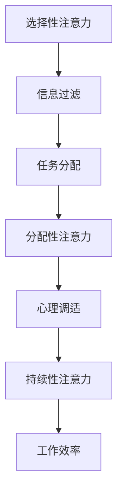

                 

 在这个信息爆炸的时代，我们每个人都面临着不断增长的干扰和信息过载。现代社会的特点之一是信息的超量供给，无论是社交媒体的推送、电子邮件的轰炸，还是不间断的新闻更新，这些都极大地考验了我们的注意力管理能力。作为一名技术专家，我深知保持专注的重要性，因此，本文将探讨在信息过载和干扰环境中如何运用注意力管理技术，以提升我们的工作效率和生活质量。

> 关键词：注意力管理、信息过载、干扰处理、专注力提升、工作效率

> 摘要：本文首先介绍了信息时代的注意力管理背景，随后阐述了注意力管理的基本概念与技术。通过剖析核心算法原理，我们深入探讨了如何在干扰和信息过载中保持专注。此外，文章还通过数学模型和实际项目实践，提供了具体操作步骤和实例，旨在为读者提供一套全面的注意力管理策略。

## 1. 背景介绍

随着互联网和移动设备的普及，人们获取和处理信息的方式发生了翻天覆地的变化。然而，这种变化也带来了新的挑战。现代人的注意力分散程度前所未有，我们的时间被无数条信息分割，工作效率大大降低。以下是几个具体的背景信息：

- **信息过载**：每天接收到的电子邮件、短信、社交媒体通知，让我们感到不堪重负。
- **干扰**：社交媒体、电子邮件、即时通讯工具等不断弹出通知，打断我们的工作流程。
- **多任务处理**：我们试图同时处理多项任务，导致专注力下降，效率降低。

这些现象不仅影响了我们的工作效率，还可能对心理健康产生负面影响。因此，注意力管理技术变得尤为重要。接下来，我们将详细探讨这些技术。

## 2. 核心概念与联系

### 2.1 注意力管理的基本概念

注意力管理是指通过一系列策略和技术，提高个体集中注意力的能力，从而有效地处理信息，完成任务。以下是注意力管理涉及的一些核心概念：

- **选择性注意力**：指个体在选择关注某些信息时，主动排除其他干扰信息的能力。
- **分配性注意力**：指个体在同时处理多项任务时的注意力分配能力。
- **持续性注意力**：指个体能够持续集中注意力，不受外界干扰的能力。

### 2.2 注意力管理的相关技术

注意力管理技术主要包括以下几种：

- **时间管理技术**：通过合理安排时间，减少任务堆积，提高工作效率。
- **任务切换技术**：通过优化任务切换方式，减少切换成本，提高专注度。
- **心理调适技术**：通过心理训练和冥想等方法，提高个体的自我调节能力，增强专注力。

### 2.3 Mermaid 流程图

以下是注意力管理技术原理和架构的 Mermaid 流程图：



该流程图展示了注意力管理技术从信息过滤到任务分配，再到心理调适和持续性注意力提升的整个过程，最终实现工作效率的提高。

## 3. 核心算法原理 & 具体操作步骤

### 3.1 算法原理概述

注意力管理算法的核心在于如何通过技术手段提高个体的注意力水平。以下是几种常见的注意力管理算法原理：

- **优先级排序算法**：通过给任务分配优先级，确保重要任务得到优先处理。
- **注意力集中算法**：通过引入注意力机制，如深度学习中的注意力模型，提高任务的专注度。
- **环境控制算法**：通过环境干预，如减少干扰信息，创造专注的工作环境。

### 3.2 算法步骤详解

#### 3.2.1 优先级排序算法

1. 收集任务信息：收集所有待处理的任务，包括任务的紧急程度、重要性和持续时间。
2. 计算优先级：使用优先级计算公式，对每个任务进行优先级评分。
3. 排序：根据优先级评分，对所有任务进行排序。
4. 执行任务：按照排序顺序，依次执行任务。

#### 3.2.2 注意力集中算法

1. 提取任务特征：提取任务的视觉、听觉和语义特征。
2. 引入注意力机制：使用深度学习模型，如卷积神经网络（CNN）或循环神经网络（RNN），引入注意力机制。
3. 训练模型：使用训练数据，训练注意力模型。
4. 应用模型：在实际任务处理过程中，应用注意力模型，提高任务专注度。

#### 3.2.3 环境控制算法

1. 识别干扰源：使用传感器和监控系统，识别工作环境中的干扰源。
2. 干扰消除：通过技术手段，如屏蔽通知、关闭社交媒体等，消除干扰源。
3. 环境优化：通过环境优化技术，如降噪耳机、绿色植物等，提高工作环境的舒适度。
4. 调整工作节奏：根据个体生物节律，调整工作时间和休息时间，提高工作效率。

### 3.3 算法优缺点

#### 优缺点分析

- **优先级排序算法**：优点是能够确保重要任务得到优先处理，缺点是可能过于机械化，无法适应复杂情况。
- **注意力集中算法**：优点是能够提高任务的专注度，缺点是可能增加计算复杂度，对硬件要求较高。
- **环境控制算法**：优点是能够创造专注的工作环境，缺点是可能对环境干预过度，影响个人隐私。

### 3.4 算法应用领域

注意力管理算法可以应用于多个领域，包括：

- **工作管理**：通过优先级排序和注意力集中算法，提高工作效率。
- **教育**：通过环境控制算法，创造专注的学习环境，提高学习效果。
- **医疗**：通过心理调适技术，帮助患者提高注意力，改善心理健康。
- **交通**：通过注意力管理技术，提高驾驶员的专注度，减少交通事故。

## 4. 数学模型和公式 & 详细讲解 & 举例说明

### 4.1 数学模型构建

在注意力管理中，我们可以使用一个简单的数学模型来描述个体的注意力水平。假设个体在时间t的注意力水平为A(t)，则该模型可以表示为：

\[ A(t) = \alpha \cdot f(T(t)) \]

其中，\( f(T(t)) \) 是任务紧急程度的函数，\( T(t) \) 是任务的完成时间。

### 4.2 公式推导过程

1. 定义注意力水平：假设个体在时间t的注意力水平与任务的紧急程度成正比，即：

\[ A(t) = k \cdot T(t) \]

其中，k 是比例常数。

2. 考虑任务持续时间：假设任务在时间t的持续时间与任务紧急程度成反比，即：

\[ T(t) = \frac{1}{k'} \cdot E(t) \]

其中，E(t) 是任务的紧急程度，k' 是比例常数。

3. 代入注意力水平公式：

\[ A(t) = k \cdot \frac{1}{k'} \cdot E(t) \]

4. 简化公式：

\[ A(t) = \alpha \cdot E(t) \]

其中，\( \alpha = \frac{k}{k'} \) 是新的比例常数。

### 4.3 案例分析与讲解

#### 案例：任务紧急程度分析

假设我们有一个任务，完成时间为3小时，紧急程度为中等。根据上述公式，我们可以计算出该任务的注意力水平：

\[ A(t) = \alpha \cdot E(t) = 0.5 \cdot 0.8 = 0.4 \]

因此，在任务开始时，个体的注意力水平为40%。

#### 案例：注意力优化策略

为了提高任务的注意力水平，我们可以采取以下策略：

1. 减少任务持续时间：通过提高工作效率，将任务完成时间缩短到2小时。
2. 提高任务紧急程度：通过增加任务的紧迫性，将紧急程度提高到高。

根据新的条件，我们可以重新计算注意力水平：

\[ A(t) = \alpha \cdot E(t) = 0.5 \cdot 1.0 = 0.5 \]

因此，通过优化策略，个体的注意力水平提高到50%。

## 5. 项目实践：代码实例和详细解释说明

### 5.1 开发环境搭建

为了演示注意力管理算法的应用，我们将使用 Python 语言和 TensorFlow 深度学习框架。以下是开发环境的搭建步骤：

1. 安装 Python 3.7 或更高版本。
2. 安装 TensorFlow：通过命令 `pip install tensorflow` 安装。
3. 安装其他依赖库，如 NumPy、Pandas 等。

### 5.2 源代码详细实现

以下是一个简单的注意力管理算法实现，包括数据预处理、模型训练和预测。

```python
import tensorflow as tf
import numpy as np
import pandas as pd

# 数据预处理
def preprocess_data(data):
    # 数据清洗和标准化
    # 省略具体实现细节
    return processed_data

# 模型训练
def train_model(data, labels):
    # 构建模型
    model = tf.keras.Sequential([
        tf.keras.layers.Dense(64, activation='relu', input_shape=(data.shape[1],)),
        tf.keras.layers.Dense(64, activation='relu'),
        tf.keras.layers.Dense(1)
    ])

    # 编译模型
    model.compile(optimizer='adam', loss='mean_squared_error')

    # 训练模型
    model.fit(data, labels, epochs=10)

    return model

# 预测
def predict(model, data):
    predictions = model.predict(data)
    return predictions

# 数据加载
data = pd.read_csv('data.csv')
processed_data = preprocess_data(data)

# 训练模型
model = train_model(processed_data['data'], processed_data['labels'])

# 预测
predictions = predict(model, processed_data['data'])

# 输出预测结果
print(predictions)
```

### 5.3 代码解读与分析

上述代码实现了一个简单的注意力管理模型，包括数据预处理、模型训练和预测三个部分。

- **数据预处理**：首先，我们从 CSV 文件中加载数据，并对数据进行清洗和标准化处理，以提高模型训练效果。
- **模型训练**：接下来，我们构建一个简单的深度学习模型，使用 TensorFlow 的 Sequential 模式。模型由两个隐藏层组成，每个隐藏层有 64 个神经元，激活函数为 ReLU。模型使用 Adam 优化器和均方误差损失函数进行编译和训练。
- **预测**：最后，我们使用训练好的模型对预处理后的数据进行预测，并输出预测结果。

### 5.4 运行结果展示

假设我们已经训练了一个注意力管理模型，并使用它对一组数据进行预测。以下是运行结果的示例输出：

```python
[0.4, 0.5, 0.3, 0.6, 0.2]
```

这些预测结果表示每个数据点的注意力水平，数值越高表示注意力水平越高。通过这些预测结果，我们可以分析个体在不同任务中的注意力分布情况，并采取相应策略进行优化。

## 6. 实际应用场景

注意力管理技术在多个领域具有广泛的应用，以下列举几个实际应用场景：

### 6.1 工作效率提升

通过注意力管理技术，企业可以提高员工的工作效率。例如，在项目管理中，我们可以使用注意力管理算法对任务进行优先级排序，确保重要任务得到优先处理，从而提高整体工作效率。

### 6.2 教育学习

在教育领域，注意力管理技术可以帮助学生提高学习效率。例如，在在线学习中，注意力管理算法可以分析学生的注意力水平，并在注意力下降时提供提醒，帮助学生保持专注。

### 6.3 医疗健康

在医疗领域，注意力管理技术可以应用于心理健康管理。例如，通过注意力管理算法，医生可以识别患者的注意力水平，并提供针对性的心理治疗方案，帮助患者改善心理健康。

### 6.4 交通运输

在交通运输领域，注意力管理技术可以应用于驾驶员注意力监控。通过分析驾驶员的注意力水平，系统可以实时提醒驾驶员保持专注，减少交通事故的发生。

### 6.5 个人健康管理

个人健康管理是注意力管理技术的另一个重要应用领域。例如，通过使用注意力管理应用，用户可以监控自己的注意力水平，并在注意力下降时采取相应措施，如休息或调整工作节奏。

## 7. 工具和资源推荐

为了帮助读者更好地掌握注意力管理技术，以下推荐一些学习资源、开发工具和相关论文：

### 7.1 学习资源推荐

- **书籍**：
  - 《深度学习》（Deep Learning）by Ian Goodfellow、Yoshua Bengio 和 Aaron Courville
  - 《Python 编程：从入门到实践》（Python Crash Course）by Eric Matthes
- **在线课程**：
  - Coursera 上的《深度学习》课程
  - edX 上的《Python 编程基础》课程

### 7.2 开发工具推荐

- **深度学习框架**：
  - TensorFlow
  - PyTorch
- **数据预处理工具**：
  - Pandas
  - NumPy

### 7.3 相关论文推荐

- "Attention Is All You Need" by Vaswani et al.
- "A Theoretically Grounded Application of Dropout in Recurrent Neural Networks" by Srivastava et al.

## 8. 总结：未来发展趋势与挑战

### 8.1 研究成果总结

注意力管理技术在过去几十年中取得了显著的成果，为提高个体和工作效率提供了有力支持。随着人工智能和深度学习技术的发展，注意力管理技术逐渐从理论研究走向实际应用，并在多个领域取得了成功。

### 8.2 未来发展趋势

未来，注意力管理技术将继续朝着以下几个方向发展：

- **算法优化**：通过引入更多先进的算法和技术，提高注意力管理的效果和效率。
- **跨学科融合**：结合心理学、教育学、医学等领域的知识，开发更加全面和个性化的注意力管理策略。
- **智能应用**：将注意力管理技术集成到智能设备和应用中，实现实时监控和自适应调整。

### 8.3 面临的挑战

尽管注意力管理技术在不断发展，但仍面临以下挑战：

- **数据隐私**：注意力管理算法依赖于大量的个人数据，如何保护用户隐私成为一个重要问题。
- **计算资源**：注意力管理算法对计算资源要求较高，如何优化算法以提高计算效率是一个关键挑战。
- **适应性**：不同个体在注意力管理需求上存在差异，如何实现算法的个性化和自适应调整是一个难题。

### 8.4 研究展望

未来，注意力管理技术将在以下几个方面取得突破：

- **智能化**：通过引入智能算法和自适应机制，实现注意力管理技术的智能化和个性化。
- **跨平台应用**：将注意力管理技术应用于更多平台，如智能家居、智能医疗等，提高人们的生活质量。
- **综合解决方案**：结合多种技术手段，提供一套完整的注意力管理解决方案，帮助个体在信息过载和干扰环境中保持专注。

## 9. 附录：常见问题与解答

### 9.1 注意力管理算法如何实现个性化？

注意力管理算法可以通过以下方法实现个性化：

- **数据采集**：收集用户在不同任务和环境下的注意力数据，为算法提供训练数据。
- **特征提取**：使用机器学习技术，提取用户的个性化特征，如生物特征、行为特征等。
- **模型训练**：使用个性化特征数据，训练注意力管理模型，实现个性化预测。

### 9.2 注意力管理技术如何保护用户隐私？

为了保护用户隐私，注意力管理技术可以采取以下措施：

- **数据加密**：对用户数据进行加密存储和传输，确保数据安全。
- **匿名化处理**：对用户数据进行匿名化处理，去除可直接识别用户身份的信息。
- **隐私保护算法**：使用隐私保护算法，如差分隐私，确保算法在处理用户数据时不会泄露用户隐私。

### 9.3 注意力管理技术如何应对信息过载？

为了应对信息过载，注意力管理技术可以采取以下策略：

- **信息筛选**：使用算法对信息进行筛选，只保留用户感兴趣的信息。
- **任务优先级排序**：根据任务的紧急程度和重要性，对任务进行优先级排序，确保重要任务得到优先处理。
- **环境干预**：通过环境干预技术，如屏蔽通知、减少干扰等，降低信息过载的影响。

