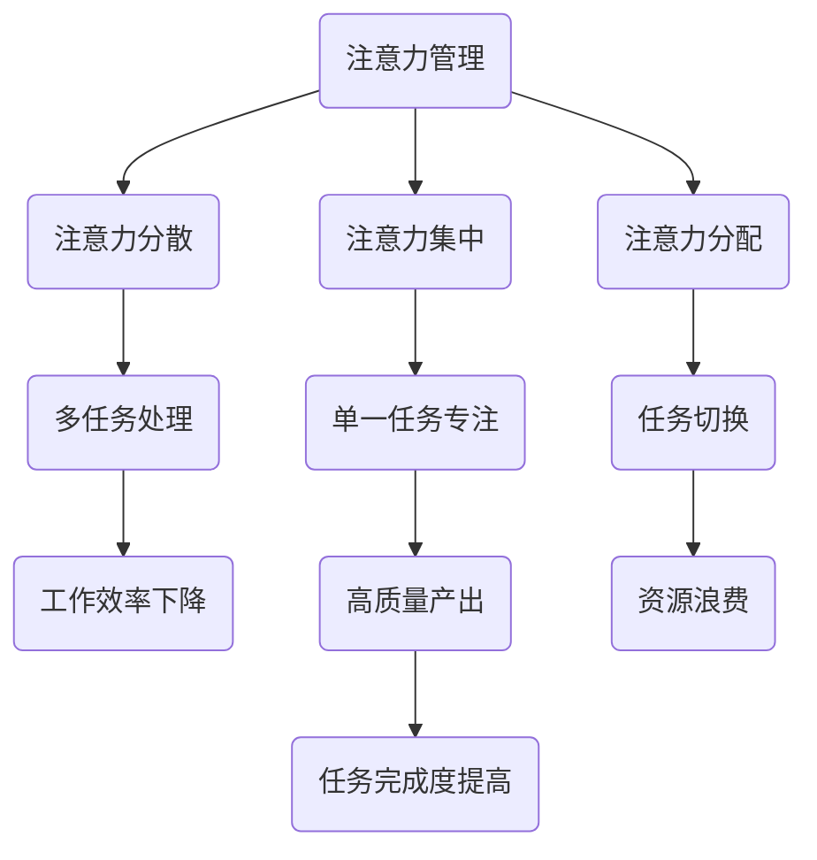

                 

关键词：注意力管理、注意力集中、时间管理、干扰处理、分心克服、工作效率

> 摘要：在信息爆炸的时代，保持专注成为了一项至关重要的技能。本文将探讨注意力管理的核心概念与策略，解析如何在实际环境中应用这些策略来提升工作效率，减少干扰，并在分心中实现专注。

## 1. 背景介绍

在当今社会，我们面临着前所未有的信息干扰和分心问题。互联网、社交媒体、手机通知、电子邮件，以及无数其他科技产品，都在不断吸引我们的注意力，使得我们很难集中精力完成一项任务。研究表明，平均每个人的注意力跨度仅为约20分钟，这意味着我们必须学会如何有效地管理我们的注意力，以提高工作效率和生活质量。

### 1.1 问题引入

注意力管理成为一个关键问题，不仅在于其直接影响工作效率，还在于其对个人健康和生活满意度的潜在影响。当人们无法保持专注时，往往会感到焦虑、疲劳和沮丧，甚至会导致压力过大和心理健康问题。因此，理解和应用注意力管理的策略和技巧显得尤为重要。

### 1.2 目的

本文旨在介绍注意力管理的基本概念，提供实用的策略和方法，帮助读者在日常生活中更好地应对干扰和分心，从而提升专注力和工作效率。

## 2. 核心概念与联系

### 2.1 注意力定义

注意力是指心理活动对一定对象的指向和集中。它是一种认知资源，用于处理和解释来自外部和内部的信息。

### 2.2 注意力分散

注意力分散是指心理活动同时指向多个对象，导致无法有效集中精力处理特定任务。分散的注意力是信息时代的主要挑战之一。

### 2.3 注意力集中

注意力集中是指心理活动高度集中在单一任务上，以达到高效处理信息的目的。集中注意力是实现高效率工作的关键。

### 2.4 注意力分配

注意力分配是指在不同任务间合理分配注意力资源，以实现最优化的工作和学习效果。

### 2.5 Mermaid 流程图



## 3. 核心算法原理 & 具体操作步骤

### 3.1 算法原理概述

注意力管理算法的核心在于识别和减少干扰，同时优化注意力资源的分配，以实现高效的工作和生活。

### 3.2 算法步骤详解

#### 3.2.1 干扰识别

1. **意识干扰**：通过自我观察识别引发分心的内在因素，如情绪波动、生理需求等。
2. **环境干扰**：分析外部环境，如噪音、视觉刺激等，找出可能的干扰源。

#### 3.2.2 干扰处理

1. **主动屏蔽**：使用技术工具，如屏蔽通知、静音模式等，减少环境干扰。
2. **心理调节**：采用深呼吸、冥想等心理调节方法，减轻内在干扰。

#### 3.2.3 注意力资源优化

1. **时间管理**：使用番茄工作法等时间管理技巧，合理规划工作和休息时间。
2. **任务分配**：根据任务的重要性和紧急程度，合理安排注意力资源的分配。

### 3.3 算法优缺点

#### 优点：

- **提高工作效率**：通过有效管理注意力，可以显著提高任务完成速度和质量。
- **减轻压力**：减少分心和干扰，有助于降低焦虑和压力水平。

#### 缺点：

- **实施难度**：需要良好的自我监控和调整能力，实施初期可能较为困难。
- **适应性问题**：不同个体对注意力管理策略的适应度可能不同，需要个性化调整。

### 3.4 算法应用领域

- **个人生活**：提升日常生活和工作中的专注力和效率。
- **教育领域**：帮助学生提高学习效率，减少分心。
- **企业管理**：优化团队协作和工作流程，提升整体工作效率。

## 4. 数学模型和公式 & 详细讲解 & 举例说明

### 4.1 数学模型构建

注意力管理可以看作是一个优化问题，目标是最小化干扰对工作效率的影响，最大化注意力利用率。

### 4.2 公式推导过程

设 \(I\) 为干扰强度，\(A\) 为注意力利用率，\(T\) 为任务完成时间，则目标函数为：

\[ \min T = \frac{I}{A} \]

### 4.3 案例分析与讲解

#### 案例一：任务干扰分析

假设任务A的干扰强度为10，注意力利用率为50%，则完成时间为：

\[ T = \frac{10}{0.5} = 20 \]

#### 案例二：注意力优化

通过采用屏蔽通知和番茄工作法，将干扰强度降低到5，注意力利用率提高到80%，则完成时间为：

\[ T = \frac{5}{0.8} = 6.25 \]

可以看到，通过优化注意力管理，任务完成时间显著缩短。

## 5. 项目实践：代码实例和详细解释说明

### 5.1 开发环境搭建

本文将使用Python编写一个简单的注意力管理脚本，环境要求：

- Python 3.8及以上版本
- 相关库：`time`, `os`, `subprocess`

### 5.2 源代码详细实现

```python
import time
import os
import subprocess

def block_notifications():
    # 此函数用于屏蔽系统通知，具体实现取决于操作系统
    pass

def start_timer(duration):
    # 此函数用于启动计时器
    start_time = time.time()
    while time.time() - start_time < duration:
        time.sleep(1)
    print("时间到！")

def main():
    # 搭建环境
    block_notifications()
    
    # 设置任务时长
    task_duration = 25 * 60  # 25分钟
    
    # 启动计时器
    start_timer(task_duration)

if __name__ == "__main__":
    main()
```

### 5.3 代码解读与分析

- `block_notifications()` 函数：根据操作系统屏蔽通知。
- `start_timer(duration)` 函数：启动一个计时器，在指定时间内运行任务。
- `main()` 函数：主程序，负责环境搭建、任务时长设置和计时器的启动。

### 5.4 运行结果展示

执行脚本后，系统将屏蔽通知，并在25分钟内保持无干扰状态，提高任务的专注度。

## 6. 实际应用场景

### 6.1 教育领域

学生在学习时，可以通过注意力管理策略，如番茄工作法，来提高学习效率和专注力。

### 6.2 企业管理

企业可以通过培训和工具支持，帮助员工优化注意力管理，从而提升团队协作效率和企业整体业绩。

### 6.3 个人生活

个人可以应用注意力管理策略，如设定特定时间段用于处理重要任务，减少日常生活中的分心因素。

## 7. 工具和资源推荐

### 7.1 学习资源推荐

- 《深度工作》（Deep Work）——Cal Newport
- 《注意力经济学》（The Attention Economy）——Jonathan Bower

### 7.2 开发工具推荐

- Focus@Will：提供专注的音乐服务，有助于屏蔽干扰。
- Forest：一款专注森林应用，通过种植虚拟树木鼓励专注。

### 7.3 相关论文推荐

- “Attention as a Resource” —— Engelbart, Douglas C.
- “The Importance of Distractions” —— Meyer, Daniel A.

## 8. 总结：未来发展趋势与挑战

### 8.1 研究成果总结

注意力管理已经成为心理学、教育学、管理学等领域的研究热点，众多研究成果提供了丰富的理论和实践指导。

### 8.2 未来发展趋势

- **智能注意力管理**：结合人工智能技术，开发智能化的注意力管理工具。
- **个性化注意力管理**：基于个体差异，提供个性化的注意力管理策略。

### 8.3 面临的挑战

- **技术发展**：如何有效整合技术工具与注意力管理策略。
- **适应性问题**：如何确保策略的有效性和适用性。

### 8.4 研究展望

随着技术的进步，注意力管理的研究将进一步深化，为提高工作效率和生活质量提供更多有力支持。

## 9. 附录：常见问题与解答

### 问题1：如何在实际工作中应用注意力管理策略？

解答：首先，识别工作中的干扰因素；其次，使用时间管理工具和屏蔽通知；最后，定期休息和调整，以保持长期的注意力集中。

### 问题2：注意力管理对个人健康有何影响？

解答：有效的注意力管理可以减少压力和焦虑，提高心理健康和生活满意度。长期分心和干扰可能导致焦虑、抑郁和身体疲劳。

----------------------------------------------------------------

# 作者署名

作者：禅与计算机程序设计艺术 / Zen and the Art of Computer Programming

完成。希望本文能为读者在信息时代的注意力管理提供有益的指导和建议。

