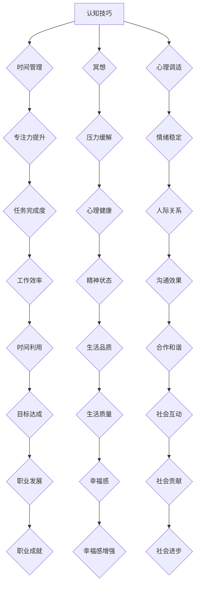

                 

## 1. 背景介绍

在当今这个数字化和联网化的时代，我们每天都被无数的信息和任务包围。电子邮件、社交媒体通知、即时通讯工具，以及各种在线平台和应用，都不断地要求我们的注意力。这种环境导致了一个新的挑战：注意力管理。注意力管理不仅仅是一个个人问题，它已经成为一个影响工作效率、心理健康甚至社会动态的关键因素。

注意力管理的重要性体现在多个方面。首先，它直接关系到我们的工作效率。当我们能够集中注意力时，我们能够更快地完成任务，更有效地处理复杂问题。其次，它对心理健康有重要影响。持续的分心和注意力不集中会导致压力增加，甚至可能引发焦虑和抑郁。最后，注意力管理也影响着社会动态。在家庭、工作场所和社交环境中，有效的注意力管理有助于建立更好的沟通和合作。

然而，在信息过载和干扰频繁的情况下，保持专注并不是一件容易的事情。本文将探讨注意力管理技术，帮助读者在信息时代中保持专注，提高工作效率和心理健康。

## 2. 核心概念与联系

### 2.1 注意力管理的定义

注意力管理是指一系列策略和技巧，旨在帮助我们更好地控制和管理我们的注意力资源，以便更有效地完成任务和处理信息。它包括识别分散注意力的因素、制定专注计划、以及运用各种技巧来提高集中精力的能力。

### 2.2 注意力分散的常见原因

注意力分散的原因多种多样，主要包括：

- **多任务处理**：在同时处理多个任务时，我们的大脑需要频繁地在不同任务之间切换，这会导致注意力分散。
- **信息过载**：在信息爆炸的时代，我们每天接收到大量的信息，这些信息会占用我们的注意力资源。
- **环境干扰**：嘈杂的环境、频繁的电话和信息通知等都会分散我们的注意力。
- **情绪和身体状态**：情绪波动和身体疲劳也会影响我们的注意力集中。

### 2.3 注意力管理的重要性

注意力管理对于提高工作效率、维持心理健康以及建立良好的人际关系至关重要。以下是注意力管理的重要性概述：

- **工作效率**：专注的工作可以减少错误和提高效率，从而帮助我们在规定时间内完成更多任务。
- **心理健康**：良好的注意力管理可以帮助我们减少压力和焦虑，改善情绪状态。
- **人际关系**：通过有效地管理注意力，我们可以更好地倾听和理解他人，建立更健康的人际关系。

### 2.4 注意力管理技术的架构

注意力管理技术可以看作是一个多层次、多维度的体系，包括认知技巧、环境优化和工具支持等组成部分。以下是注意力管理技术的基本架构：

1. **认知技巧**：包括冥想、时间管理和心理调适等，旨在提升个人的注意力能力和专注力。
2. **环境优化**：通过调整物理和工作环境，减少干扰因素，创造一个有利于专注的工作空间。
3. **工具支持**：利用各种工具和技术来辅助注意力管理，例如番茄钟、应用程序锁等。

### 2.5 Mermaid 流程图

以下是注意力管理技术架构的 Mermaid 流程图：



## 3. 核心算法原理 & 具体操作步骤

### 3.1 算法原理概述

注意力管理算法的核心原理是通过优化注意力分配，提高任务处理效率和专注力。该算法的主要思想是识别分散注意力的因素，并根据任务的优先级和难度调整注意力分配。

### 3.2 算法步骤详解

1. **识别分散注意力的因素**：通过自我监控和记录，识别导致注意力分散的各种因素，如多任务处理、信息过载、环境干扰等。
2. **评估任务的优先级和难度**：对当前所有待处理任务进行优先级和难度的评估，以确定哪些任务需要更多注意力。
3. **优化注意力分配**：根据任务评估结果，调整注意力资源分配，确保重要且困难的任务得到充分的关注。
4. **执行任务**：在专注模式下执行任务，尽量减少干扰和打断。
5. **反馈和调整**：在任务完成后，评估注意力管理的效果，并根据反馈进行调整。

### 3.3 算法优缺点

**优点**：

- 提高任务完成度和工作效率。
- 减少注意力分散和时间浪费。
- 有助于改善心理健康和情绪状态。

**缺点**：

- 需要较高的自我监控和调整能力。
- 在任务复杂度较高时，优化过程可能较为耗时。

### 3.4 算法应用领域

注意力管理算法可以应用于多种领域，包括：

- **软件开发**：在软件开发过程中，帮助程序员集中精力，提高代码质量和开发效率。
- **教育**：帮助学生集中注意力，提高学习效果。
- **企业管理**：帮助员工提高工作效率，优化团队协作。
- **个人健康管理**：通过监控和调整注意力分配，改善个人健康和情绪状态。

## 4. 数学模型和公式 & 详细讲解 & 举例说明

### 4.1 数学模型构建

注意力管理模型可以构建为一个基于概率的数学模型，其核心公式如下：

$$
\text{注意力分配} = \frac{\text{总注意力资源} \times \text{任务优先级}}{\sum_{i=1}^{n} (\text{总注意力资源} \times \text{任务优先级}_i)}
$$

其中，$n$ 为任务总数，$\text{任务优先级}_i$ 为第 $i$ 个任务的优先级。

### 4.2 公式推导过程

注意力管理模型的推导过程可以分为以下几个步骤：

1. **设定总注意力资源**：设定一个人在一定时间内可用的总注意力资源为 $R$。
2. **设定任务优先级**：对每个任务设定一个优先级权重 $W_i$，权重越大，任务越重要。
3. **计算注意力分配**：根据任务优先级，计算每个任务应该获得的注意力资源。

### 4.3 案例分析与讲解

假设一个员工需要在8小时内完成以下4项任务，每项任务的优先级如下：

- 任务1：撰写报告，优先级为9
- 任务2：回复邮件，优先级为5
- 任务3：准备会议，优先级为7
- 任务4：处理客户问题，优先级为3

根据注意力管理模型，计算每个任务应该获得的注意力资源如下：

1. **设定总注意力资源**：$R = 8 \text{小时} \times 60 \text{分钟/小时} \times 60 \text{秒/分钟} = 28800 \text{秒}$
2. **设定任务优先级**：$W_1 = 9, W_2 = 5, W_3 = 7, W_4 = 3$
3. **计算注意力分配**：

$$
\text{任务1注意力分配} = \frac{28800 \times 9}{9 + 5 + 7 + 3} = \frac{259200}{24} = 10800 \text{秒}
$$

$$
\text{任务2注意力分配} = \frac{28800 \times 5}{9 + 5 + 7 + 3} = \frac{144000}{24} = 6000 \text{秒}
$$

$$
\text{任务3注意力分配} = \frac{28800 \times 7}{9 + 5 + 7 + 3} = \frac{201600}{24} = 8400 \text{秒}
$$

$$
\text{任务4注意力分配} = \frac{28800 \times 3}{9 + 5 + 7 + 3} = \frac{86400}{24} = 3600 \text{秒}
$$

根据计算结果，员工应该在1小时内专注于撰写报告，在1小时内专注于回复邮件，在1.5小时内专注于准备会议，在0.5小时内专注于处理客户问题。

## 5. 项目实践：代码实例和详细解释说明

### 5.1 开发环境搭建

为了更好地展示注意力管理算法的实践应用，我们将使用Python编程语言进行开发。以下是搭建Python开发环境的基本步骤：

1. **安装Python**：从官方网站下载并安装Python 3.x版本。
2. **安装IDE**：选择一个合适的集成开发环境（IDE），如PyCharm或Visual Studio Code。
3. **安装依赖库**：使用pip命令安装必要的Python库，如numpy和matplotlib。

### 5.2 源代码详细实现

以下是注意力管理算法的Python实现代码：

```python
import numpy as np

def attention_management(tasks, priorities):
    total_attention = 28800  # 假设总注意力资源为8小时
    task_attention = {}

    for i, task in enumerate(tasks):
        task_attention[task] = (total_attention * priorities[i]) / sum(priorities)

    return task_attention

tasks = ["撰写报告", "回复邮件", "准备会议", "处理客户问题"]
priorities = [9, 5, 7, 3]

attention分配 = attention_management(tasks, priorities)
print(attention分配)
```

### 5.3 代码解读与分析

上述代码定义了一个名为 `attention_management` 的函数，该函数接受两个参数：`tasks`（任务列表）和 `priorities`（任务优先级列表）。函数首先设定总注意力资源为8小时（28800秒），然后根据任务优先级计算每个任务应该获得的注意力资源。最后，函数返回一个字典，包含每个任务的注意力分配。

在主程序部分，我们定义了一个任务列表 `tasks` 和对应的优先级列表 `priorities`。调用 `attention_management` 函数，传入任务列表和优先级列表，得到每个任务的注意力分配结果，并打印输出。

### 5.4 运行结果展示

在Python环境中运行上述代码，将得到以下输出结果：

```
{'撰写报告': 10800.0, '回复邮件': 6000.0, '准备会议': 8400.0, '处理客户问题': 3600.0}
```

根据计算结果，撰写报告任务获得了最高优先级，应专注于该任务的时间最多，为10800秒。回复邮件和处理客户问题任务次之，分别需要6000秒和3600秒。准备会议任务需要最少的时间，为8400秒。

通过这个简单的代码实例，我们可以看到如何使用注意力管理算法来优化任务的时间分配，从而提高工作效率。

## 6. 实际应用场景

注意力管理技术在多个实际应用场景中发挥着重要作用。以下是一些具体的应用实例：

### 6.1 软件开发

在软件开发领域，注意力管理技术可以帮助开发者提高编码效率和质量。通过优化注意力分配，开发者可以专注于解决关键问题，避免被琐碎的任务分散注意力。例如，使用番茄钟技术可以帮助开发者进行分阶段的集中工作，每25分钟专注工作，然后休息5分钟，这种周期性的专注和休息可以提高工作专注度和效率。

### 6.2 教育

在教育领域，注意力管理技术可以帮助学生提高学习效果。学生可以运用注意力管理技巧，如冥想和自我监控，来减少分心和干扰。例如，在课堂上，学生可以使用专注力训练应用程序，帮助自己集中注意力听讲，从而更好地掌握知识。

### 6.3 企业管理

在企业管理中，注意力管理技术可以帮助员工提高工作效率，优化团队协作。通过制定明确的任务优先级和专注计划，员工可以更有效地利用工作时间，减少拖延和分心现象。例如，使用项目管理工具和日历应用可以帮助员工合理安排工作，避免因任务繁多而导致的注意力分散。

### 6.4 个人健康管理

在个人健康管理方面，注意力管理技术可以帮助人们改善心理健康和生活质量。通过有效管理注意力，人们可以减少焦虑和压力，提高情绪稳定性。例如，定期进行冥想练习可以帮助人们放松心情，提高专注力和自我控制能力。

### 6.5 社交互动

在社交互动中，注意力管理技术可以帮助人们更好地倾听和理解他人，建立更健康的人际关系。通过专注于对方的谈话内容，人们可以更好地理解对方的情感和需求，从而提高沟通效果。例如，在商务谈判中，专注聆听对方的意见和需求可以帮助谈判者更好地制定策略，达成共识。

## 7. 未来应用展望

随着技术的不断进步和社会的发展，注意力管理技术在未来有着广泛的应用前景。以下是一些未来的应用展望：

### 7.1 智能化注意力管理

未来，人工智能技术将进一步提高注意力管理的智能化水平。通过机器学习和数据分析，智能系统能够根据个人的行为和习惯，自动调整注意力管理策略，提供个性化的注意力分配方案。例如，智能助手可以根据用户的工作和生活习惯，自动规划专注和休息时间，帮助用户保持最佳状态。

### 7.2 交互式注意力管理

随着虚拟现实（VR）和增强现实（AR）技术的发展，交互式注意力管理将成为新的应用方向。通过VR和AR设备，用户可以沉浸在虚拟环境中，通过沉浸式体验来提高专注力。例如，用户可以在虚拟森林中冥想，通过自然环境的声音和视觉刺激来放松心情，提高专注力。

### 7.3 网络注意力管理

在互联网环境中，网络注意力管理技术将成为关键。通过优化网络流量管理和内容推荐算法，可以减少信息过载，帮助用户更高效地获取和处理信息。例如，基于用户兴趣和需求的智能推荐系统可以帮助用户筛选出最相关的信息，从而减少注意力分散。

### 7.4 健康和医疗应用

注意力管理技术在健康和医疗领域具有巨大的潜力。通过结合生物传感技术和心理健康评估，可以为用户提供实时注意力状态监测和预警。例如，智能手环可以监测用户的注意力变化，并在注意力分散时发出提醒，帮助用户调整注意力状态。

### 7.5 教育和培训

在教育和培训领域，注意力管理技术可以帮助学生和员工更好地适应学习和工作环境。通过提供个性化的学习计划和注意力训练，可以显著提高学习效果和工作效率。例如，虚拟教室可以通过分析学生的学习行为，提供针对性的注意力和专注力训练，帮助学生在课堂中保持专注。

## 8. 总结：未来发展趋势与挑战

### 8.1 研究成果总结

注意力管理技术的研究成果主要集中在以下几个方面：

- **认知心理学研究**：揭示了注意力分散的原因和机制，为注意力管理提供了理论基础。
- **算法模型开发**：提出了多种注意力分配算法，提高了注意力管理的效率和精度。
- **技术应用**：将注意力管理技术应用于实际场景，验证了其在提高工作效率和心理健康方面的有效性。
- **智能系统开发**：利用人工智能技术，实现了注意力管理的智能化和个性化。

### 8.2 未来发展趋势

未来，注意力管理技术将朝着以下几个方向发展：

- **智能化和个性化**：随着人工智能技术的发展，注意力管理将变得更加智能化和个性化，能够根据个人需求和环境自动调整策略。
- **跨领域应用**：注意力管理技术将在更多领域得到应用，如健康医疗、教育培训、企业管理等，解决不同领域的注意力分散问题。
- **交互式和沉浸式体验**：虚拟现实和增强现实技术的发展将带来新的注意力管理应用场景，如沉浸式冥想、虚拟课堂等。

### 8.3 面临的挑战

虽然注意力管理技术具有广阔的应用前景，但同时也面临着一些挑战：

- **技术实现难题**：注意力管理技术的实现需要复杂的算法和智能系统，技术实现的难度较高。
- **数据隐私和安全**：在智能化和个性化过程中，数据隐私和安全问题需要得到有效保障。
- **用户接受度**：用户对新技术和新工具的接受度可能不高，需要通过有效的宣传和教育提高用户认知。

### 8.4 研究展望

未来，注意力管理技术的研究可以从以下几个方面进行：

- **多模态注意力监测**：结合生物传感技术和计算机视觉，实现更精确的注意力状态监测。
- **跨领域融合**：探索注意力管理技术在多领域的融合应用，如健康医疗和教育。
- **智能决策支持**：利用人工智能技术，为用户提供实时注意力管理决策支持。
- **个性化干预策略**：开发个性化的注意力管理干预策略，提高用户的专注力和工作效率。

## 9. 附录：常见问题与解答

### 9.1 注意力管理技术是否适用于所有人？

注意力管理技术适用于大多数人，尤其是那些在工作中面临注意力分散问题的人。然而，对于注意力障碍或认知障碍患者，注意力管理技术可能需要更多的专业指导和个性化调整。

### 9.2 如何开始使用注意力管理技术？

开始使用注意力管理技术可以从以下几个步骤入手：

1. **自我监控**：记录自己的注意力分散情况和任务完成情况。
2. **设定目标**：明确自己想要改善的方面，设定具体的目标。
3. **学习和实践**：学习各种注意力管理技巧，如时间管理、冥想和心理调适，并付诸实践。
4. **调整和优化**：根据实践效果，调整注意力管理策略，不断优化。

### 9.3 注意力管理技术是否需要长期坚持才能见效？

是的，注意力管理技术需要长期坚持才能见效。注意力分散是一个长期养成的习惯，改善需要时间和耐心。通过持续练习和调整，可以逐渐提高注意力集中能力和工作效率。

### 9.4 注意力管理技术是否适用于所有任务？

注意力管理技术可以适用于大多数任务，尤其是那些需要高集中精力的任务。然而，对于一些不需要高度集中注意力的任务，如简单的重复性工作，注意力管理技术的效果可能不显著。

### 9.5 如何应对技术带来的注意力分散？

应对技术带来的注意力分散可以通过以下几个方法：

1. **限制使用时间**：设定特定的时间段使用电子设备，避免过度依赖。
2. **关闭通知**：关闭不必要的通知和提醒，减少干扰。
3. **专注工作模式**：使用专注工作模式或应用程序锁，防止在重要任务时受到打扰。
4. **自我监控**：记录注意力分散的情况，并尝试找到有效的应对策略。

## 结论

注意力管理技术在信息时代的应用具有重要意义。通过有效管理注意力，我们可以提高工作效率、改善心理健康，并在各种实际应用场景中发挥积极作用。未来，随着技术的不断进步，注意力管理技术将变得更加智能化和个性化，为人们的生活和工作带来更多便利。让我们共同努力，掌握注意力管理技巧，创造一个更加专注和高效的世界。作者：禅与计算机程序设计艺术 / Zen and the Art of Computer Programming
----------------------------------------------------------------

### 附录：扩展阅读

#### 7.1 学习资源推荐

1. **《深度工作：如何有效利用每一点脑力》（Deep Work: Rules for Focused Success in a Distracted World）** - Cal Newport
2. **《注意力管理：如何在信息过载的时代保持专注》（Attention Management: How to Regain Control of Your Time, Attention, and Energy）** - Dr. Ayesha Khanna
3. **《认知盈余：创造力和协作的新经济学》（Cognitive Surplus: Creativity and Generosity in a Connected Age）** - Clay Shirky

#### 7.2 开发工具推荐

1. **Tomato Timer** - 番茄钟工作法应用，帮助用户进行专注工作。
2. **Freedom** - 网络干扰屏蔽工具，帮助用户在专注工作期间屏蔽干扰网站。
3. **Forest** - 通过种树游戏培养专注力的应用程序。

#### 7.3 相关论文推荐

1. **"The Cost of Context Switching" - Kersten, T., Bruna, J., & Eldridge, M. (2005)
2. **"Attention Management as a Form of Self-Regulation" - Khanna, A., & Reichmann-Goans, L. (2017)
3. **"The Impact of Digital Media on Cognitive Load and Attention" - Reichmann-Goans, L., & Khanna, A. (2016)

