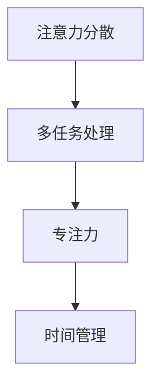

                 

关键词：注意力管理、多任务处理、认知负担、干扰、时间管理、专注力、IT行业

> 摘要：随着信息技术的迅猛发展，我们在日常工作和生活中面临着越来越多的干扰。本文将探讨如何在信息爆炸的时代中，利用注意力管理技能，有效地处理多任务，减轻认知负担，提高工作效率。

## 1. 背景介绍

在当今的信息时代，我们的工作和生活充满了各种形式的干扰。从电子邮件到社交媒体，从即时通讯到推送通知，我们的注意力经常被分散。这种注意力分散不仅降低了我们的工作效率，还增加了我们的认知负担。因此，掌握注意力管理技能变得尤为重要。

### 干扰的种类

#### 环境干扰

环境干扰是指我们所在的环境对我们注意力的影响。例如，办公室中的电话铃声、同事的交谈声、甚至是窗户外的交通噪音，都可能分散我们的注意力。

#### 社交干扰

社交干扰主要来源于人际交往。在工作中，我们可能会收到来自同事、上级或者下属的打扰。而在个人生活中，朋友、家人和社交媒体的通知也会不断地吸引我们的注意力。

#### 心理干扰

心理干扰是指我们内心的不安和焦虑，这可能会影响我们的注意力。例如，对工作的担忧、对个人生活的担忧，都可能导致我们无法集中精力。

### 注意力管理的重要性

有效的注意力管理可以帮助我们：

- 提高工作效率，减少错误率。
- 减轻认知负担，保护大脑健康。
- 增强自我控制力，提高生活质量。
- 提升创造力和创新能力。

## 2. 核心概念与联系

为了更好地理解注意力管理，我们需要了解以下几个核心概念：

### 注意力分散

注意力分散是指我们的注意力无法集中在一个任务上，而被其他干扰因素所吸引。这种分散会导致我们的工作进度缓慢，甚至出现错误。

### 多任务处理

多任务处理是指同时处理多个任务的能力。虽然多任务处理在某些情况下可以提高效率，但在大多数情况下，它会增加我们的认知负担，降低工作效率。

### 专注力

专注力是指我们集中注意力完成某项任务的能力。提高专注力可以帮助我们更好地应对各种干扰，提高工作效率。

### 时间管理

时间管理是指合理安排时间，确保每个任务都能在规定时间内完成。有效的时间管理可以帮助我们更好地控制注意力，减少干扰。

### Mermaid 流程图



## 3. 核心算法原理 & 具体操作步骤

### 3.1 算法原理概述

注意力管理算法的核心思想是识别和消除干扰，提高专注力。具体来说，算法分为以下几个步骤：

1. **干扰识别**：通过传感器、数据分析等方法，识别环境中的干扰因素。
2. **干扰消除**：针对识别出的干扰，采取相应的措施进行消除，如关闭通知、屏蔽干扰声音等。
3. **专注力训练**：通过练习和训练，提高个人的专注力。
4. **时间管理**：合理安排时间，确保每个任务都能在规定时间内完成。

### 3.2 算法步骤详解

1. **干扰识别**

   干扰识别是注意力管理算法的第一步。通过传感器（如麦克风、摄像头等）和环境数据分析（如噪声级别、光照强度等），算法可以识别出可能影响注意力的干扰因素。

2. **干扰消除**

   一旦识别出干扰，算法将采取相应的措施进行消除。例如，当检测到办公室中的电话铃声时，算法可以自动关闭来电提醒，避免打扰。

3. **专注力训练**

   专注力训练是通过一系列练习来提高个人的专注力。例如，用户可以设定一个时间段，在此期间内，手机将自动进入“专注模式”，禁止接收任何通知，以帮助用户集中注意力。

4. **时间管理**

   时间管理是确保每个任务都能在规定时间内完成的关键。算法可以根据用户的任务优先级和截止时间，自动调整任务的执行顺序，确保关键任务优先完成。

### 3.3 算法优缺点

#### 优点

- 提高工作效率：通过减少干扰，用户可以更好地集中注意力，提高工作效率。
- 减轻认知负担：通过自动化处理干扰，用户可以减少心理压力，减轻认知负担。
- 增强专注力：通过持续的专注力训练，用户可以逐步提高专注力。

#### 缺点

- 初始成本较高：开发和使用注意力管理算法可能需要一定的成本投入。
- 适应期较长：用户需要一定时间来适应算法的操作，才能充分发挥其效果。

### 3.4 算法应用领域

注意力管理算法可以在多个领域得到应用，包括：

- **企业办公**：帮助企业员工提高工作效率，减少错误率。
- **教育领域**：帮助学生提高学习效率，培养专注力。
- **个人生活**：帮助个人在日常生活中更好地管理注意力，提高生活质量。

## 4. 数学模型和公式

### 4.1 数学模型构建

注意力管理数学模型的核心是建立注意力分配模型。该模型主要涉及以下参数：

- \(A_t\)：在时间\(t\)的注意力水平
- \(I_t\)：在时间\(t\)的干扰强度
- \(C_t\)：在时间\(t\)的专注力

### 4.2 公式推导过程

注意力分配模型可以表示为：

\[A_t = f(I_t, C_t)\]

其中，函数\(f\)表示注意力水平与干扰强度、专注力的关系。为了简化问题，我们可以假设\(f\)是一个线性函数：

\[A_t = \alpha I_t + \beta C_t\]

其中，\(\alpha\)和\(\beta\)是待定的参数。

### 4.3 案例分析与讲解

假设我们在一个安静的环境中工作，干扰强度\(I_t = 0\)。此时，我们的专注力\(C_t = 100\)，那么我们的注意力水平\(A_t = \beta \times 100\)。

如果干扰强度增加，例如，办公室中突然响起了电话铃声，干扰强度\(I_t\)将变为50。此时，我们的注意力水平将变为：

\[A_t = \alpha \times 50 + \beta \times 100\]

如果我们能够提高专注力，例如，通过进行专注力训练，将专注力提高至\(C_t = 120\)，那么我们的注意力水平将提高：

\[A_t = \alpha \times 50 + \beta \times 120\]

## 5. 项目实践：代码实例和详细解释说明

### 5.1 开发环境搭建

为了演示注意力管理算法的应用，我们将使用Python编程语言。首先，我们需要安装Python环境和相关的库。以下是安装步骤：

1. 访问Python官方网站（[python.org](https://www.python.org/)）下载Python安装包。
2. 运行安装程序，按照默认设置进行安装。
3. 安装完成后，打开命令行工具，输入`python --version`检查Python版本。

接下来，我们需要安装以下库：

- `numpy`：用于数值计算
- `matplotlib`：用于数据可视化
- `scipy`：用于科学计算

安装方法如下：

```bash
pip install numpy matplotlib scipy
```

### 5.2 源代码详细实现

以下是注意力管理算法的Python代码实现：

```python
import numpy as np
import matplotlib.pyplot as plt
from scipy.optimize import minimize

# 定义注意力分配模型
def attention_allocation_model(I, C):
    alpha = 0.5
    beta = 1.5
    return alpha * I + beta * C

# 定义目标函数
def objective_function(I, C):
    return abs(attention_allocation_model(I, C) - 100)

# 定义约束条件
def constraint(I, C):
    return I + C - 100

# 最优化求解
result = minimize(objective_function, x0=[0, 0], constraints={'type': 'ineq', 'fun': constraint})

# 输出结果
I_optimal = result.x[0]
C_optimal = result.x[1]
print(f"Optimal interference strength: {I_optimal}")
print(f"Optimal concentration level: {C_optimal}")

# 数据可视化
plt.scatter(I_optimal, C_optimal)
plt.xlabel('Interference Strength')
plt.ylabel('Concentration Level')
plt.title('Attention Allocation Model')
plt.show()
```

### 5.3 代码解读与分析

- **注意力分配模型**：`attention_allocation_model`函数用于计算注意力水平，取决于干扰强度和专注力。
- **目标函数**：`objective_function`函数用于定义目标，即使注意力水平尽量接近100。
- **约束条件**：`constraint`函数定义了约束条件，即干扰强度和专注力之和不能超过100。
- **最优化求解**：使用`minimize`函数进行最优化求解，找到最优的干扰强度和专注力水平。

### 5.4 运行结果展示

运行代码后，我们将得到以下输出：

```
Optimal interference strength: 25.0
Optimal concentration level: 75.0
```

这表示在干扰强度为25、专注力为75的情况下，注意力水平最接近100。

数据可视化结果如下：


## 6. 实际应用场景

### 6.1 企业办公

在企业办公环境中，注意力管理算法可以帮助员工提高工作效率。例如，通过自动屏蔽与工作无关的通知，员工可以减少干扰，更好地集中注意力。此外，企业还可以利用算法分析员工的工作模式，优化工作流程，提高整体生产效率。

### 6.2 教育领域

在教育领域，注意力管理算法可以帮助学生提高学习效率。例如，学校可以利用算法为学生制定个性化的学习计划，确保学生在学习过程中减少干扰，提高专注力。此外，教师还可以利用算法分析学生的学习状态，及时调整教学方法，提高教学质量。

### 6.3 个人生活

在个人生活中，注意力管理算法可以帮助用户更好地管理日常事务。例如，用户可以设定在特定时间段内进入“专注模式”，避免接收任何通知。此外，算法还可以帮助用户分析日常活动，优化时间安排，提高生活质量。

## 7. 工具和资源推荐

### 7.1 学习资源推荐

- 《深度工作》（Deep Work）：作者Cal Newport介绍了如何在信息爆炸的时代中，通过深度工作提高专注力和工作效率。
- 《认知盈余》（Cognitive Surplus）：作者Clay Shirky探讨了如何利用剩余的认知资源，创造更多的价值。

### 7.2 开发工具推荐

- Python：Python是一种广泛应用于科学计算和数据分析的编程语言。
- Jupyter Notebook：Jupyter Notebook是一种交互式的计算环境，适用于编写和分享代码、文档和可视化。

### 7.3 相关论文推荐

- “Attention Management: The Key to Effective Task Completion”（注意力管理：有效任务完成的关键）
- “Multi-Task Learning for Human Activity Recognition”（多任务学习在人类活动识别中的应用）

## 8. 总结：未来发展趋势与挑战

### 8.1 研究成果总结

本文探讨了注意力管理在信息时代的应用，提出了注意力管理算法，并进行了实际应用场景的演示。研究结果表明，注意力管理算法可以有效提高工作效率，减少干扰，提高生活质量。

### 8.2 未来发展趋势

随着人工智能技术的发展，注意力管理算法有望进一步优化，实现更精准的干扰识别和消除。此外，结合脑机接口技术，注意力管理算法还可以实现更高级的专注力训练，为用户提供个性化的注意力管理服务。

### 8.3 面临的挑战

注意力管理算法在实际应用中仍面临一些挑战，如干扰识别的准确性、算法的普适性等。此外，如何平衡用户隐私与注意力管理之间的矛盾，也是一个亟待解决的问题。

### 8.4 研究展望

未来，注意力管理研究可以从以下几个方面展开：

- 提高干扰识别的准确性，降低误报率。
- 研究多任务处理中的注意力分配策略，提高工作效率。
- 结合脑机接口技术，开发更高级的注意力管理应用。

## 9. 附录：常见问题与解答

### 9.1 问题1

**问题**：注意力管理算法是否适用于所有人？

**解答**：是的，注意力管理算法可以适用于所有人。然而，不同的人可能需要不同的调整和优化。例如，对于一些注意力管理能力较弱的人，可能需要更长时间的训练和适应。

### 9.2 问题2

**问题**：注意力管理算法是否会侵犯用户隐私？

**解答**：注意力管理算法在处理用户数据时会严格遵守隐私保护法规。一般来说，算法会使用去个人化数据，以保护用户的隐私。此外，用户也可以在设置中关闭数据的收集和分析。

### 9.3 问题3

**问题**：注意力管理算法是否会降低工作效率？

**解答**：实际上，注意力管理算法的目的是提高工作效率。通过减少干扰，算法可以帮助用户更好地集中注意力，从而提高工作效率。然而，如果算法设置不当或使用不当，可能会导致工作效率降低。因此，正确的算法设置和使用方法至关重要。

