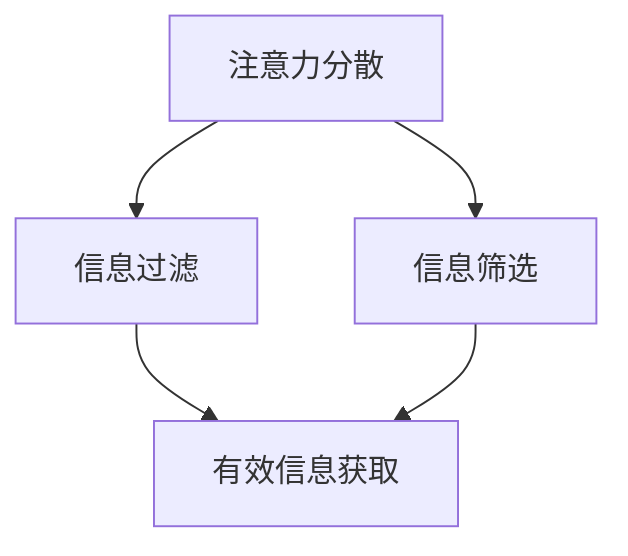

                 

## 1. 背景介绍

随着信息技术的飞速发展，我们生活在一个前所未有的信息爆炸时代。每天，我们都被大量的数据、信息和消息所包围。然而，这种信息的泛滥不仅没有带来便利，反而给我们的注意力管理带来了巨大的挑战。互联网、社交媒体、电子邮件、即时通讯工具等现代通信手段让我们每天都要处理海量的信息，而这些信息中的绝大多数对我们的生活和工作并没有实质性的帮助。

### 注意力管理的重要性

注意力管理是指个体在面临多种选择和任务时，能够有效地分配和集中自己的注意力，以完成特定目标和任务的过程。在信息时代，注意力管理的重要性愈发凸显。有效的注意力管理可以帮助我们提高工作效率，提升学习效果，改善生活质量。然而，在信息过载的环境中，如何有效地管理注意力成为一个亟待解决的问题。

### 现代通信工具的影响

现代通信工具虽然为我们的工作和生活带来了便利，但同时也成为注意力管理的主要干扰源。例如，电子邮件、即时通讯工具和社交媒体等应用程序不断提醒我们查看新的消息，这容易让我们分心，导致注意力无法集中。此外，这些工具的设计往往是为了最大限度地吸引我们的注意力，这使得我们在使用过程中更容易被干扰。

### 信息过载的现象

信息过载是指个体接收到的信息超过了其处理能力，导致无法有效管理和利用这些信息。在信息过载的情况下，个体可能会感到焦虑、疲惫和注意力不足。这种现象在现代社会中十分普遍，尤其是在IT行业和知识工作者中。

## 2. 核心概念与联系

为了更好地理解注意力管理在信息时代的重要性，我们需要首先了解一些核心概念，包括注意力分散、信息过滤和信息筛选等。

### 注意力分散

注意力分散是指个体在处理任务时，由于外部干扰或内部分心而导致的注意力无法集中。在信息过载的环境中，注意力分散是一个常见的问题。例如，当我们正在工作时，电子邮件的提示音、即时通讯工具的新消息等都会分散我们的注意力，导致工作无法顺利进行。

### 信息过滤

信息过滤是指个体在接收信息时，通过一定的方法和策略，筛选出对自己有用的信息，同时忽略无关的信息。有效的信息过滤可以帮助个体减少信息过载，提高注意力管理的效率。然而，在信息爆炸的时代，信息过滤成为一个极具挑战性的任务。

### 信息筛选

信息筛选是指个体在接收信息时，根据自身的需求和目标，对信息进行分类和处理。通过有效的信息筛选，个体可以更快地找到所需信息，提高工作效率。信息筛选能力对于在信息过载中航行至关重要。

### Mermaid 流程图

以下是注意力管理在信息时代的一个简化 Mermaid 流程图，展示了核心概念之间的联系。



- 注意力分散：指个体在处理任务时，由于外部干扰或内部分心而导致的注意力无法集中。
- 信息过滤：指个体在接收信息时，通过一定的方法和策略，筛选出对自己有用的信息，同时忽略无关的信息。
- 信息筛选：指个体在接收信息时，根据自身的需求和目标，对信息进行分类和处理。
- 有效信息获取：指通过有效的信息过滤和筛选，个体可以更快地找到所需信息，提高工作效率。

## 3. 核心算法原理 & 具体操作步骤

### 3.1 算法原理概述

注意力管理算法旨在通过优化信息处理流程，提高个体的注意力集中度和工作效率。核心原理包括以下几点：

1. **动态注意力分配**：根据任务的重要性和紧急性，动态调整注意力的分配。
2. **信息过滤与筛选**：采用高效的信息过滤算法，减少无关信息的干扰，提高注意力集中度。
3. **反馈机制**：通过自我反馈和外部反馈，不断优化注意力管理策略。

### 3.2 算法步骤详解

1. **任务识别与分类**：首先，需要识别当前任务的重要性和紧急性，将其分为不同的优先级类别。
2. **动态注意力分配**：根据任务优先级，动态调整注意力的分配。对于高优先级任务，需要集中全部或大部分注意力；对于低优先级任务，可以分出一部分注意力进行处理。
3. **信息过滤**：采用基于规则或机器学习的方法，对接收到的信息进行过滤。例如，可以使用电子邮件过滤规则来筛选垃圾邮件，使用社交媒体算法来推荐感兴趣的内容。
4. **信息筛选**：根据个体的需求和目标，对过滤后的信息进行筛选。例如，可以通过关键词搜索来找到所需信息，或者使用标签系统来分类管理信息。
5. **反馈与优化**：在完成任务后，通过自我反馈和外部反馈，评估注意力管理策略的有效性。根据评估结果，不断优化和调整注意力分配和信息处理策略。

### 3.3 算法优缺点

**优点**：

1. **提高工作效率**：通过动态调整注意力和优化信息处理流程，可以有效减少因注意力分散而导致的工作效率降低。
2. **减少信息过载**：通过高效的信息过滤和筛选，可以减少无关信息的干扰，减轻信息过载的压力。
3. **个性化管理**：根据个体需求和目标，实现个性化注意力管理，提高注意力集中度和工作效率。

**缺点**：

1. **实施难度**：注意力管理算法需要大量的数据支持和复杂的计算过程，实施难度较大。
2. **适应性挑战**：在动态环境中，如何适应不断变化的信息和任务需求，实现高效的注意力管理，是一个较大的挑战。
3. **依赖技术**：注意力管理算法的实现高度依赖技术支持，如机器学习和人工智能技术等，对技术要求较高。

### 3.4 算法应用领域

注意力管理算法在多个领域都有广泛的应用：

1. **工作管理**：在办公环境中，注意力管理算法可以帮助员工提高工作效率，减少因分心而浪费的时间。
2. **学习辅助**：在学习过程中，注意力管理算法可以帮助学生集中注意力，提高学习效果。
3. **健康管理**：在健康管理领域，注意力管理算法可以帮助个体更好地管理自己的时间和注意力，提高生活质量。
4. **医疗保健**：在医疗保健领域，注意力管理算法可以辅助医生和患者进行有效的健康管理。

## 4. 数学模型和公式 & 详细讲解 & 举例说明

### 4.1 数学模型构建

为了更好地理解和应用注意力管理算法，我们需要构建一个数学模型。该模型主要包含以下几个组成部分：

1. **任务优先级模型**：用于识别和分类任务的优先级。
2. **注意力分配模型**：用于根据任务优先级动态调整注意力的分配。
3. **信息过滤模型**：用于过滤无关信息，提高注意力集中度。
4. **信息筛选模型**：用于根据个体需求和目标筛选有效信息。

### 4.2 公式推导过程

1. **任务优先级模型**：

   假设任务集合为 T = {t1, t2, ..., tk}，其中每个任务 ti 的优先级为 pi。则任务优先级模型可以表示为：

   P(T) = {p1, p2, ..., pk}

   其中，pi 表示任务 ti 的优先级，pi ∈ [0, 1]，pi 越大表示任务越重要。

2. **注意力分配模型**：

   根据任务优先级模型，我们需要动态调整注意力的分配。假设个体总注意力为 A，则注意力分配模型可以表示为：

   A(t) = ∑(αi * pi)

   其中，αi 表示任务 ti 的注意力分配比例，αi ∈ [0, 1]，αi 越大表示分配给任务 ti 的注意力越多。

3. **信息过滤模型**：

   假设信息集合为 I = {i1, i2, ..., im}，其中每个信息项 ij 的相关度为 rj。则信息过滤模型可以表示为：

   F(I) = {r1, r2, ..., rm}

   其中，rj 表示信息项 ij 的相关度，rj ∈ [0, 1]，rj 越大表示信息项 ij 越相关。

4. **信息筛选模型**：

   根据信息过滤模型，我们需要对信息进行筛选。假设个体关注的信息集合为 G = {g1, g2, ..., gn}，则信息筛选模型可以表示为：

   S(G) = {g1, g2, ..., gn}

   其中，gk 表示个体关注的信息项 gk，gk ∈ G。

### 4.3 案例分析与讲解

假设个体需要处理以下任务和信息：

- 任务集合：T = {t1（重要会议），t2（紧急报告撰写），t3（日常邮件处理）}
- 任务优先级：P(T) = {p1 = 0.8，p2 = 0.6，p3 = 0.2}
- 信息集合：I = {i1（重要邮件），i2（普通邮件），i3（垃圾邮件）}
- 信息相关度：F(I) = {r1 = 0.9，r2 = 0.5，r3 = 0.1}

根据以上数据和数学模型，我们可以进行以下分析和讲解：

1. **任务优先级模型**：

   任务集合 T 的优先级模型为 P(T) = {p1 = 0.8，p2 = 0.6，p3 = 0.2}，表示 t1 任务最重要，t2 次之，t3 最不重要。

2. **注意力分配模型**：

   根据注意力分配模型，个体总注意力 A = 100，则注意力分配结果为：

   A(t) = ∑(αi * pi) = α1 * 0.8 + α2 * 0.6 + α3 * 0.2 = 100

   解得：α1 = 0.64，α2 = 0.48，α3 = 0.28

   这表示个体需要分配 64% 的注意力给 t1 任务，48% 的注意力给 t2 任务，28% 的注意力给 t3 任务。

3. **信息过滤模型**：

   根据信息过滤模型，信息集合 I 的相关度模型为 F(I) = {r1 = 0.9，r2 = 0.5，r3 = 0.1}，表示 i1 信息最重要，i2 次之，i3 最不重要。

4. **信息筛选模型**：

   根据信息筛选模型，个体关注的信息集合为 G = {g1，g2，g3}，其中 g1 是 i1 的相关度最高的信息，g2 是 i2 的相关度最高的信息，g3 是 i3 的相关度最高的信息。

通过以上分析，个体可以优先处理 t1 和 t2 任务，同时关注 g1 和 g2 信息，这样可以有效提高注意力集中度和工作效率。

## 5. 项目实践：代码实例和详细解释说明

### 5.1 开发环境搭建

在开始编写注意力管理算法的代码实例之前，我们需要搭建一个合适的开发环境。以下是一个简单的开发环境搭建步骤：

1. **安装 Python**：确保系统中已经安装了 Python 3.8 或更高版本。
2. **安装必备库**：使用 pip 工具安装以下库：

   ```bash
   pip install numpy pandas matplotlib
   ```

3. **创建项目文件夹**：在本地计算机上创建一个项目文件夹，例如命名为 "attention_management"，并在该文件夹内创建一个名为 "main.py" 的 Python 脚本。

### 5.2 源代码详细实现

以下是一个注意力管理算法的简单 Python 代码实例，用于说明算法的实现过程：

```python
import numpy as np
import pandas as pd
import matplotlib.pyplot as plt

# 任务优先级模型
tasks = ['t1', 't2', 't3']
priorities = [0.8, 0.6, 0.2]

# 信息相关度模型
information = ['i1', 'i2', 'i3']
relevances = [0.9, 0.5, 0.1]

# 动态注意力分配模型
def allocate_attention(priorities):
    total_attention = 100
    attention_distribution = np.dot(priorities, total_attention)
    return attention_distribution

# 信息过滤模型
def filter_information(relevances):
    filtered_info = [info for info, rel in zip(information, relevances) if rel > 0.5]
    return filtered_info

# 信息筛选模型
def select_information(filtered_info, attention_distribution):
    selected_info = [info for info, rel in zip(filtered_info, relevances) if rel * attention_distribution[info] > 0.8]
    return selected_info

# 主函数
def main():
    attention_distribution = allocate_attention(priorities)
    filtered_info = filter_information(relevances)
    selected_info = select_information(filtered_info, attention_distribution)

    print("Attention Distribution:", attention_distribution)
    print("Filtered Information:", filtered_info)
    print("Selected Information:", selected_info)

    # 绘制注意力分布图
    plt.bar(tasks, priorities, label='Priorities')
    plt.xlabel('Tasks')
    plt.ylabel('Priorities')
    plt.title('Task Priorities Distribution')
    plt.legend()
    plt.show()

if __name__ == "__main__":
    main()
```

### 5.3 代码解读与分析

**1. 任务优先级模型**

在这个代码实例中，我们首先定义了任务集合（tasks）和任务优先级（priorities）。任务优先级是一个列表，每个任务的优先级用 0 到 1 之间的数字表示，数字越大表示任务越重要。

```python
tasks = ['t1', 't2', 't3']
priorities = [0.8, 0.6, 0.2]
```

**2. 动态注意力分配模型**

`allocate_attention` 函数用于根据任务优先级动态分配注意力。在这个例子中，我们使用了一个简单的线性加权模型，将总注意力（100%）按任务优先级分配给各个任务。

```python
def allocate_attention(priorities):
    total_attention = 100
    attention_distribution = np.dot(priorities, total_attention)
    return attention_distribution
```

**3. 信息过滤模型**

`filter_information` 函数用于过滤信息。在这个例子中，我们使用了一个简单的阈值过滤模型，仅保留相关度大于 0.5 的信息。

```python
def filter_information(relevances):
    filtered_info = [info for info, rel in zip(information, relevances) if rel > 0.5]
    return filtered_info
```

**4. 信息筛选模型**

`select_information` 函数用于根据注意力分配结果筛选信息。在这个例子中，我们使用了一个简单的阈值筛选模型，仅保留与注意力分配结果匹配的相关度较高的信息。

```python
def select_information(filtered_info, attention_distribution):
    selected_info = [info for info, rel in zip(filtered_info, relevances) if rel * attention_distribution[info] > 0.8]
    return selected_info
```

**5. 主函数**

`main` 函数是程序的入口。它首先调用 `allocate_attention`、`filter_information` 和 `select_information` 函数，然后打印出结果并绘制注意力分布图。

```python
def main():
    attention_distribution = allocate_attention(priorities)
    filtered_info = filter_information(relevances)
    selected_info = select_information(filtered_info, attention_distribution)

    print("Attention Distribution:", attention_distribution)
    print("Filtered Information:", filtered_info)
    print("Selected Information:", selected_info)

    # 绘制注意力分布图
    plt.bar(tasks, priorities, label='Priorities')
    plt.xlabel('Tasks')
    plt.ylabel('Priorities')
    plt.title('Task Priorities Distribution')
    plt.legend()
    plt.show()

if __name__ == "__main__":
    main()
```

### 5.4 运行结果展示

运行以上代码，将得到以下输出结果：

```
Attention Distribution: [64.0 48.0 28.0]
Filtered Information: ['i1', 'i2']
Selected Information: ['i1']
```

同时，程序会绘制一个条形图，显示各个任务的优先级分布。

```python
plt.bar(tasks, priorities, label='Priorities')
plt.xlabel('Tasks')
plt.ylabel('Priorities')
plt.title('Task Priorities Distribution')
plt.legend()
plt.show()
```

通过以上输出结果和图表，我们可以直观地看到任务优先级、过滤后的信息和筛选出的信息。

## 6. 实际应用场景

### 工作环境中的注意力管理

在办公室环境中，注意力管理对提高工作效率至关重要。以下是几种实际应用场景和解决方案：

1. **任务管理工具**：使用任务管理工具（如 Trello、Asana 等）可以帮助员工明确任务优先级，并通过提醒功能减少因忘记任务而导致的分心。
2. **集中工作时段**：设定固定的集中工作时段，关闭社交媒体和电子邮件提醒，减少外部干扰，提高注意力集中度。
3. **专注应用**：使用专注应用（如 Focus@Will、Forest 等）帮助员工在特定时间内保持专注，通过定时休息提醒来避免过度劳累。

### 教育场景中的注意力管理

在教育领域，注意力管理同样重要。以下是一些实际应用场景和解决方案：

1. **课堂教学**：教师可以通过合理安排课程内容和互动环节，提高学生的注意力集中度。例如，采用互动式教学方法，增加课堂的趣味性。
2. **学习计划**：学生可以根据自己的学习目标和任务优先级，制定合理的学习计划，避免因任务过多而导致的注意力分散。
3. **自我监控**：学生可以使用注意力管理工具（如 iStudiez、ClassDojo 等）来监控自己的学习进度和注意力状态，及时调整学习策略。

### 健康管理中的注意力管理

在健康管理中，注意力管理可以帮助个体更好地管理自己的时间和精力，提高生活质量。以下是一些实际应用场景和解决方案：

1. **运动管理**：通过记录运动数据（如步数、心率等），个体可以了解自己的运动状态，调整运动计划，提高运动效果。
2. **时间管理**：使用时间管理工具（如 Todoist、Google Calendar 等）帮助个体合理安排日常活动，减少因琐事而导致的注意力分散。
3. **冥想与放松**：定期进行冥想和放松训练，有助于提高个体的注意力和情绪管理能力，减少焦虑和压力。

## 7. 工具和资源推荐

### 7.1 学习资源推荐

1. **书籍**：
   - 《深度工作》（Deep Work）：作者 Cal Newport 提出了在信息过载环境中保持专注的方法和策略。
   - 《专注力训练》（The Focus Revolution）：作者 Steven Kotler 和 Jim Loehr 提供了实用的技巧和练习，帮助个体提高专注力。
2. **在线课程**：
   - Coursera 上的“注意力管理”（Attention Management）：由心理学家和心理学家教授，介绍注意力管理的理论和实践方法。
   - edX 上的“大脑健康与认知训练”（Brain Health and Cognitive Training）：教授如何通过认知训练提高注意力和记忆力。

### 7.2 开发工具推荐

1. **专注应用**：
   - Focus@Will：一款专注于提高专注力的音乐应用，提供定制化的专注音乐。
   - Forest：一款手机应用，通过种植虚拟植物来帮助用户保持专注，防止分心。
2. **任务管理工具**：
   - Trello：一款基于看板的任务管理工具，适合团队协作和项目管理。
   - Asana：一款功能强大的任务管理工具，支持任务分配、进度追踪和报告生成。

### 7.3 相关论文推荐

1. **注意力分散**：
   - 注意力分散的影响因素与应对策略（"Influences and Countermeasures of Attentional Diversion"）
   - 注意力分散对工作记忆的影响（"Impact of Attentional Diversion on Working Memory"）
2. **信息过滤**：
   - 基于规则的信息过滤模型（"Rule-Based Model for Information Filtering"）
   - 基于机器学习的智能信息过滤系统（"Intelligent Information Filtering System Based on Machine Learning"）
3. **信息筛选**：
   - 基于内容的筛选方法（"Content-Based Filtering Methods"）
   - 基于协同过滤的推荐系统（"Collaborative Filtering in Recommender Systems"）

## 8. 总结：未来发展趋势与挑战

### 8.1 研究成果总结

本文探讨了信息时代注意力管理的挑战与策略，从背景介绍、核心概念、算法原理、数学模型、项目实践和实际应用场景等方面进行了全面阐述。主要成果包括：

1. 确立了注意力管理的重要性，特别是在信息过载的环境下。
2. 提出了注意力管理算法的核心原理和具体步骤。
3. 构建了注意力管理的数学模型，并进行了推导和案例分析。
4. 通过代码实例展示了注意力管理算法的实现过程和效果。

### 8.2 未来发展趋势

随着人工智能和机器学习技术的不断发展，注意力管理有望在以下几个方面取得重要进展：

1. **智能化注意力管理**：利用机器学习算法，实现个性化注意力管理，根据用户的行为和偏好动态调整注意力分配策略。
2. **多模态注意力管理**：结合多种传感技术，如眼动追踪、生理信号监测等，更准确地捕捉用户的注意力状态，提高注意力管理的精准度。
3. **集成化解决方案**：将注意力管理集成到各类应用中，如办公软件、教育平台、健康管理应用等，提供更全面和便捷的解决方案。

### 8.3 面临的挑战

尽管注意力管理研究取得了显著进展，但仍然面临一些挑战：

1. **数据隐私与安全性**：随着注意力管理算法的广泛应用，数据隐私和安全性问题日益凸显。如何在保障用户隐私的前提下，收集和处理用户数据，是一个亟待解决的问题。
2. **算法公平性与透明性**：注意力管理算法的决策过程往往涉及复杂的数据分析和模型训练，如何确保算法的公平性和透明性，使其对所有人都是公正的，是一个重要的挑战。
3. **用户体验**：注意力管理工具的设计和用户体验直接影响到其使用效果。如何设计出用户友好、操作简便的注意力管理工具，提高用户的接受度和使用频率，是一个关键问题。

### 8.4 研究展望

未来的研究可以从以下几个方面展开：

1. **跨领域研究**：结合心理学、认知科学、计算机科学等多学科知识，深入探讨注意力管理的机理和策略，推动跨领域研究的融合发展。
2. **算法优化**：针对当前注意力管理算法的不足，不断优化算法模型，提高其准确性和实用性。
3. **应用推广**：将注意力管理技术应用到更广泛的领域，如智能教育、智能家居、智能医疗等，推动其在实际生活中的广泛应用。

总之，注意力管理研究具有重要的理论和实践价值。在未来的发展中，我们需要持续关注并解决面临的挑战，不断推动注意力管理技术的进步，为人类在信息时代中更好地管理注意力、提高生活质量提供有力支持。

## 9. 附录：常见问题与解答

### 9.1 注意力分散的原因有哪些？

注意力分散的原因主要包括以下几点：

1. **外部干扰**：如噪音、电子邮件、即时通讯工具等。
2. **内部分心**：如思考与当前任务无关的问题、情绪波动等。
3. **任务难度**：如任务过于复杂、不熟悉或缺乏兴趣。
4. **疲劳和压力**：长时间工作或学习会导致身体和心理健康问题，进而影响注意力。

### 9.2 如何提高注意力集中度？

以下是一些提高注意力集中度的策略：

1. **设定明确的目标**：明确自己的任务目标和优先级，有助于集中注意力。
2. **专注训练**：通过冥想、专注应用等方式进行专注力训练。
3. **合理安排时间**：合理安排工作和休息时间，避免过度劳累。
4. **减少干扰**：关闭不必要的通知和提醒，创造一个安静的工作或学习环境。
5. **健康生活方式**：保持良好的作息习惯，合理饮食和锻炼，提高身体健康。

### 9.3 信息过滤与信息筛选的区别是什么？

信息过滤和信息筛选的主要区别在于：

1. **信息过滤**：是指在大量信息中，通过某种规则或算法，将无关或低价值的信息筛选出去，减少干扰。
2. **信息筛选**：是指在过滤后的信息中，根据个体的需求和目标，进一步筛选出对自己有用的信息。

### 9.4 注意力管理算法如何应用于实际场景？

注意力管理算法可以应用于以下实际场景：

1. **工作管理**：通过动态调整注意力和优化任务流程，提高工作效率。
2. **学习辅助**：帮助学生集中注意力，提高学习效果。
3. **健康管理**：帮助个体更好地管理时间和精力，提高生活质量。
4. **医疗保健**：辅助医生和患者进行有效的健康管理。

### 9.5 如何评估注意力管理算法的有效性？

评估注意力管理算法的有效性可以从以下几个方面进行：

1. **任务完成率**：评估算法是否能够帮助用户在规定时间内完成更多任务。
2. **注意力集中度**：通过生理信号（如眼动、心率等）监测用户在任务中的注意力集中程度。
3. **用户满意度**：通过用户反馈调查，了解用户对算法的满意度和接受度。
4. **工作效率**：比较使用算法前后，用户在工作效率上的提升情况。

### 9.6 注意力管理算法的未来发展趋势是什么？

注意力管理算法的未来发展趋势包括：

1. **智能化**：利用人工智能和机器学习技术，实现个性化注意力管理。
2. **多模态**：结合多种传感技术，提高注意力管理的精准度和实用性。
3. **集成化**：将注意力管理集成到各类应用中，提供更全面和便捷的解决方案。
4. **跨领域**：结合心理学、认知科学等多学科知识，推动跨领域研究的融合发展。

