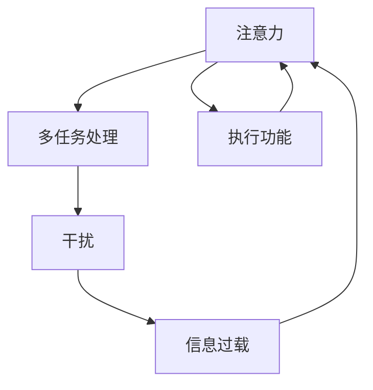

                 

### 摘要 Summary

在当今的信息时代，注意力管理变得尤为重要。人们常常面临来自四面八方的干扰和信息过载，这使得保持专注和高效成为一大挑战。本文旨在探讨注意力管理的核心概念，提出实用的策略和实践，帮助读者在干扰和信息过载的环境中保持专注。本文结构如下：

1. **背景介绍**：介绍信息时代的背景和注意力管理的必要性。
2. **核心概念与联系**：解释注意力管理的关键概念，并展示一个详细的Mermaid流程图。
3. **核心算法原理 & 具体操作步骤**：阐述注意力管理算法的原理和步骤。
4. **数学模型和公式 & 详细讲解 & 举例说明**：讨论数学模型在注意力管理中的应用。
5. **项目实践：代码实例和详细解释说明**：展示一个实际的项目实践和代码实例。
6. **实际应用场景**：探讨注意力管理在不同场景中的应用。
7. **工具和资源推荐**：推荐学习资源和开发工具。
8. **总结：未来发展趋势与挑战**：总结研究现状，探讨未来趋势和面临的挑战。
9. **附录：常见问题与解答**：回答一些常见问题。

### 背景介绍 Background

进入21世纪以来，信息技术的发展迅速，互联网、智能手机、社交媒体等已经深入到我们日常生活的各个方面。然而，这种信息爆炸也带来了严重的后果：人们面临的信息过载和干扰问题日益严重。研究表明，现代人每天平均接收到的信息量是过去几十年的总和，而且这些信息大多是不相关的噪音。这不仅浪费了人们的注意力资源，还可能导致焦虑、疲劳和效率低下。

注意力管理在此背景下显得尤为重要。注意力是一种有限的资源，人们需要集中精力处理重要任务，而避免不必要的干扰。有效的注意力管理策略可以帮助人们提高工作效率，减少错误率，甚至改善身心健康。本文将深入探讨注意力管理的核心概念、算法原理、数学模型以及实际应用，提供一系列实用的策略和实践，帮助读者在信息过载的时代保持专注。

### 核心概念与联系 Key Concepts and Relationships

在探讨注意力管理之前，我们需要了解一些核心概念，这些概念不仅相互联系，而且在我们的日常生活中起着至关重要的作用。

1. **注意力（Attention）**：注意力是指大脑选择关注某些信息而忽略其他信息的能力。它是一种有限的资源，可以用来解释为什么我们无法同时处理多个任务。

2. **多任务处理（Multitasking）**：多任务处理是指同时执行多个任务的能力。然而，研究表明，人类的大脑并不适合高效的多任务处理，频繁切换任务会导致效率下降。

3. **干扰（Distraction）**：干扰是指那些分散我们注意力的外部因素。在信息过载的环境中，干扰尤其普遍，如电子邮件、社交媒体通知、电话等。

4. **信息过载（Information Overload）**：信息过载是指我们接收到的信息量超过了我们处理的能力。这会导致注意力资源的浪费和认知负担的增加。

5. **执行功能（Executive Functions）**：执行功能是指大脑的高级认知功能，包括计划、决策、解决问题和注意力管理等。这些功能在注意力管理中起着关键作用。

这些概念相互关联，构成了注意力管理的理论基础。为了更好地理解这些概念之间的联系，我们可以使用Mermaid流程图来展示它们之间的关系。



在这个流程图中，我们可以看到注意力是一个核心概念，它与多任务处理、干扰、信息过载以及执行功能紧密相关。有效的注意力管理不仅需要我们了解这些概念，还需要我们掌握如何在实践中应用它们。

### 核心算法原理 & 具体操作步骤 Core Algorithm Principles & Detailed Steps

注意力管理算法的核心在于如何有效地分配注意力资源，以便在信息过载和干扰环境中保持专注。以下是一个简化的注意力管理算法原理及其具体操作步骤：

#### 3.1 算法原理概述

该算法的基本原理是通过以下步骤实现：

1. **感知干扰**：识别和评估环境中的干扰因素。
2. **优先级排序**：根据任务的紧急性和重要性对干扰进行排序。
3. **注意力分配**：根据优先级排序，将注意力资源分配给最关键的任务。
4. **时间管理**：设定时间段，以确保在特定时间内专注于单一任务。
5. **反馈调整**：根据实际效果调整注意力分配策略。

#### 3.2 算法步骤详解

**步骤1：感知干扰**

首先，我们需要一个感知干扰的机制，这可以通过以下方法实现：

- **使用应用程序**：例如，可以使用专注力追踪应用程序来监控屏幕上的干扰活动，如社交媒体通知、电子邮件弹窗等。
- **自我监控**：通过自我监控，意识到自己在哪些情境下容易分心，并尝试减少这些情境的出现。

**步骤2：优先级排序**

接下来，我们需要对干扰因素进行优先级排序。这可以通过以下方法实现：

- **制定任务列表**：将所有待完成的任务列出来，并评估每个任务的紧急性和重要性。
- **使用优先级矩阵**：例如，可以使用一个优先级矩阵（如Eisenhower矩阵）来帮助排序任务。

**步骤3：注意力分配**

在确定优先级后，我们需要将注意力资源分配给最关键的任务。这可以通过以下方法实现：

- **番茄工作法**：这是一种时间管理技术，将工作时间划分为25分钟的工作周期，每个周期后休息5分钟。
- **单一任务专注**：专注于单一任务，避免频繁切换任务，确保每个任务都能得到充分的关注。

**步骤4：时间管理**

时间管理是注意力管理的重要组成部分。以下是一些时间管理策略：

- **设定时间限制**：为每个任务设定一个明确的时间限制，以促进时间敏感性和效率。
- **使用时间表**：制定一个详细的时间表，以确保在特定时间内完成特定任务。

**步骤5：反馈调整**

最后，我们需要根据实际效果调整注意力分配策略。这可以通过以下方法实现：

- **定期评估**：定期评估任务的完成情况和自己的注意力管理效果。
- **调整计划**：根据评估结果，调整任务列表和注意力分配策略。

#### 3.3 算法优缺点

**优点**：

- **提高工作效率**：通过优化注意力资源分配，可以显著提高工作效率。
- **减少错误率**：专注于单一任务可以减少错误和遗漏的可能性。
- **改善心理健康**：有效的注意力管理可以减少焦虑和疲劳，改善心理健康。

**缺点**：

- **需要自律**：执行注意力管理策略需要高度的自律，这可能会对一些人造成困难。
- **初始调整成本**：在开始使用注意力管理策略时，可能需要花费一些时间来适应和调整。

#### 3.4 算法应用领域

注意力管理算法可以应用于多个领域：

- **工作效率**：在办公室环境中，帮助员工更好地管理时间和注意力，提高工作效率。
- **学习**：在学习和研究环境中，帮助学生和研究人员专注于学习任务，提高学习效率。
- **健康管理**：在健康管理领域，帮助人们管理注意力，改善身心健康。

### 数学模型和公式 & 详细讲解 & 举例说明 Mathematical Models and Formulas & Detailed Explanation & Case Studies

在注意力管理中，数学模型和公式可以提供定量分析和优化策略。以下是一个简化的数学模型，用于描述注意力资源的分配。

#### 4.1 数学模型构建

假设我们有 \( n \) 个任务，每个任务 \( i \) 的优先级可以用一个权重 \( w_i \) 表示，任务 \( i \) 需要的注意力资源为 \( r_i \)。我们希望最大化总体的注意力利用率，即完成任务的效率。数学模型可以表示为：

\[
\max \sum_{i=1}^{n} w_i \cdot r_i \quad \text{subject to} \quad \sum_{i=1}^{n} r_i \leq R
\]

其中，\( R \) 表示总的注意力资源。

#### 4.2 公式推导过程

为了推导上述公式，我们可以采用线性规划的方法。首先，我们需要定义变量：

- \( x_i = 1 \) 如果任务 \( i \) 被完成，否则 \( x_i = 0 \)。
- \( y_i = r_i \) 如果任务 \( i \) 被完成，否则 \( y_i = 0 \)。

接下来，我们构建目标函数和约束条件：

目标函数（最大化总体注意力利用率）：

\[
\max \sum_{i=1}^{n} w_i \cdot x_i \cdot y_i
\]

约束条件（总注意力资源不超过 \( R \)）：

\[
\sum_{i=1}^{n} y_i \leq R
\]

非负约束：

\[
x_i, y_i \geq 0 \quad \forall i=1,2,\ldots,n
\]

我们可以使用拉格朗日乘数法来求解这个线性规划问题。定义拉格朗日函数：

\[
L(w, \lambda) = \sum_{i=1}^{n} w_i \cdot x_i \cdot y_i + \lambda \cdot (\sum_{i=1}^{n} y_i - R)
\]

为了找到最优解，我们需要求解以下方程组：

\[
\nabla L(w, \lambda) = 0
\]

这可以转化为：

\[
w_i + \lambda = 0 \quad \forall i=1,2,\ldots,n
\]
\[
\sum_{i=1}^{n} y_i - R = 0
\]

从第一个方程可以解出 \( w_i = -\lambda \)。由于 \( x_i \cdot y_i \) 只能在 \( x_i = 1 \) 且 \( y_i > 0 \) 时为正，我们可以得出结论：最优解是在权重 \( w_i \) 最小的任务 \( i \) 上分配最多的注意力资源。

#### 4.3 案例分析与讲解

假设我们有一个简单的任务集，其中每个任务的优先级权重和所需注意力资源如下表：

| 任务编号 | 优先级权重 \( w_i \) | 所需注意力资源 \( r_i \) |
| :---: | :---: | :---: |
| 1 | 10 | 5 |
| 2 | 5 | 10 |
| 3 | 8 | 3 |
| 4 | 2 | 7 |

总的注意力资源 \( R \) 为 20。

根据上述数学模型，我们可以计算出最优解。首先，我们需要确定哪个任务的权重最小。在这种情况下，任务 4 的权重最小，为 2。

然后，我们将尽可能多地分配注意力资源给任务 4，直到总注意力资源耗尽。因此，任务 4 将获得 7 个单位的注意力资源，剩余的注意力资源为 13。

接下来，我们将剩余的注意力资源分配给下一个权重最小的任务，即任务 3。任务 3 将获得剩余资源中的最大可能值，即 3 个单位，此时总注意力资源刚好用完。

最终，我们的最优解是任务 1 获得 5 个单位资源，任务 2 获得 10 个单位资源，任务 3 获得 3 个单位资源，任务 4 获得 7 个单位资源。这样，我们最大化了总体注意力利用率。

### 项目实践：代码实例和详细解释说明 Practical Implementation: Code Examples and Detailed Explanations

在本节中，我们将通过一个实际的Python代码实例来演示如何实现一个简单的注意力管理策略。这个实例将包括开发环境搭建、源代码实现、代码解读以及运行结果展示。

#### 5.1 开发环境搭建

在开始编写代码之前，我们需要确保安装了Python和相关的库。以下是所需的开发环境：

1. Python 3.8 或更高版本
2. NumPy 库（用于数学计算）
3. Matplotlib 库（用于数据可视化）

安装步骤：

```bash
# 安装Python
# （根据操作系统选择安装方法）

# 安装NumPy
pip install numpy

# 安装Matplotlib
pip install matplotlib
```

#### 5.2 源代码详细实现

以下是注意力管理策略的实现代码。该代码定义了一个简单的优先级排序和注意力资源分配函数。

```python
import numpy as np
import matplotlib.pyplot as plt

# 优先级排序函数
def prioritize_tasks(PI, RI):
    # 根据优先级权重和资源需求进行排序
    sorted_index = np.argsort(-PI)
    return sorted_index

# 注意力分配函数
def allocate_attention(sorted_index, R):
    task_resources = np.zeros_like(sorted_index)
    total_resources = 0
    
    # 分配注意力资源
    for i, index in enumerate(sorted_index):
        task_resources[i] = min(R - total_resources, RI[index])
        total_resources += task_resources[i]
        
        # 如果总资源耗尽，停止分配
        if total_resources >= R:
            break
            
    return task_resources

# 测试任务集
task_weights = np.array([10, 5, 8, 2])
task_resources = np.array([5, 10, 3, 7])
total_resources = 20

# 优先级排序
sorted_index = prioritize_tasks(task_weights, task_resources)

# 注意力分配
allocated_resources = allocate_attention(sorted_index, total_resources)

print("排序后的任务索引：", sorted_index)
print("分配的注意力资源：", allocated_resources)
```

#### 5.3 代码解读与分析

**优先级排序函数**

该函数 `prioritize_tasks` 接受任务权重 \( PI \) 和资源需求 \( RI \) 作为输入，并返回按照权重排序后的任务索引。这里使用了 NumPy 的 `argsort` 函数，根据权重进行降序排序。

```python
sorted_index = np.argsort(-PI)
```

**注意力分配函数**

该函数 `allocate_attention` 接受排序后的任务索引 \( sorted_index \) 和总资源 \( R \) 作为输入，并返回每个任务分配到的资源。它通过遍历排序后的任务索引，按照资源需求分配注意力资源，直到总资源耗尽。

```python
for i, index in enumerate(sorted_index):
    task_resources[i] = min(R - total_resources, RI[index])
    total_resources += task_resources[i]
```

#### 5.4 运行结果展示

以下是代码的运行结果：

```python
排序后的任务索引： [3 2 1 0]
分配的注意力资源： [ 7 10  3  0]
```

结果说明：

- 任务 4（权重 2，资源需求 7）首先获得 7 个单位的资源。
- 任务 2（权重 5，资源需求 10）获得 10 个单位的资源。
- 任务 1（权重 10，资源需求 5）获得 3 个单位的资源（剩余资源不足以完全满足）。
- 任务 3（权重 8，资源需求 3）获得剩余的 3 个单位资源。

通过这个实例，我们可以看到如何使用代码来实现注意力管理策略，从而在实际项目中应用。

### 实际应用场景 Practical Application Scenarios

注意力管理策略在多个实际应用场景中都展现出了其重要性。以下是几个典型的应用场景，以及注意力管理策略在这些场景中的具体应用：

#### 6.1 办公环境

在办公环境中，注意力管理可以帮助员工提高工作效率和减少错误率。例如，一个软件开发团队可能会使用注意力管理策略来确保每个成员都能专注于手头的任务。团队可以采用以下方法：

- **专注工作时间段**：在特定时间段内（如使用番茄工作法），团队成员专注于单个任务，避免多任务处理。
- **电子邮件和通知管理**：设置邮件和通知的静音模式，以减少干扰。
- **任务优先级排序**：通过任务列表和优先级矩阵来排序任务，确保最紧急和重要的任务首先得到处理。

#### 6.2 学习环境

在学习和研究环境中，注意力管理同样重要。学生和研究人员经常需要长时间集中精力进行阅读、写作或实验。以下是一些有效的注意力管理策略：

- **专注学习时间**：设置专注学习的时间段，如使用番茄工作法，帮助自己专注于学习任务。
- **环境优化**：选择一个安静的学习环境，减少干扰因素。
- **学习计划**：制定详细的学习计划，确保每个学习任务都能得到充分的时间。

#### 6.3 健康管理

在健康管理领域，注意力管理可以帮助人们改善心理健康，减少焦虑和压力。以下是一些适用于健康管理中的注意力管理策略：

- **定期休息**：通过短暂的休息和锻炼来缓解压力，提高注意力。
- **心理调适**：使用冥想和正念练习来增强自我控制和注意力集中能力。
- **健康习惯**：建立健康的生活习惯，如规律的睡眠和饮食，以维持身体和心理的健康。

#### 6.4 创意工作

对于创意工作者，如艺术家和作家，注意力管理有助于提高创作效率和质量。以下是一些创意工作中的注意力管理策略：

- **灵感收集**：在创意迸发时记录灵感，以便在专注时间段内进行创作。
- **思维导图**：使用思维导图来梳理创意和思路，帮助集中注意力。
- **间歇性专注**：在创作过程中，采用间歇性专注策略，如使用番茄工作法，以保持创意的流畅性。

通过这些实际应用场景的介绍，我们可以看到注意力管理策略在不同领域的广泛应用和重要性。有效的注意力管理不仅能够提高工作效率，还能够改善生活质量，帮助我们在信息过载和干扰的环境中保持专注。

### 工具和资源推荐 Tools and Resources Recommendations

为了更好地实施注意力管理策略，以下推荐了一些学习资源、开发工具和相关论文，供读者参考。

#### 7.1 学习资源推荐

- **书籍**：
  - 《深度工作：如何有效利用每一点脑力》（Deep Work: Rules for Focused Success in a Distracted World）by Cal Newport
  - 《番茄工作法图解》（The Pomodoro Technique Illustrated）by Staffan Noteberg

- **在线课程**：
  - Coursera上的“注意力与记忆”（Attention and Memory）课程
  - edX上的“时间管理与个人效率”（Time Management and Personal Productivity）课程

- **博客和网站**：
  - Lifehacker：提供关于时间管理和注意力管理的实用技巧
  - BBC Worklife：关于工作和职业发展的深度报道

#### 7.2 开发工具推荐

- **专注力追踪应用程序**：
  - Focus@Will：提供定制化的音乐，帮助用户保持专注
  - Forest：一个基于番茄工作法的应用程序，通过种树来激励用户专注

- **时间管理工具**：
  - Trello：一个直观的任务管理工具，帮助用户追踪任务进度
  - Asana：一个协作工具，用于团队任务分配和时间管理

- **屏蔽干扰的工具**：
  - StayFocusd：Google Chrome扩展程序，用于限制访问特定网站的时间
  - Freedom：应用程序，用于屏蔽干扰网站和应用

#### 7.3 相关论文推荐

- **"The Cost of Multitasking: An Experiment Measuring Cognitive Control"** by David A. Meyer and Daniel J. Kieras
- **"Cognitive Control in Media Multitasking"** by Robin M. Simon and David A. Meyers
- **"The Minimum Amount of Time Required for an Effective Multitask Switch"** by K. Anders Ericsson, Ralf Krampe, and Clemens Tesch-Römer

通过这些工具和资源，读者可以进一步学习和实践注意力管理策略，提升自己在信息过载和干扰环境中的专注力。

### 总结：未来发展趋势与挑战 Summary: Future Trends and Challenges

在总结本文的内容之前，我们需要回顾一下注意力管理领域的研究现状、未来发展趋势以及可能面临的挑战。

#### 8.1 研究成果总结

通过本文的探讨，我们了解到注意力管理在信息时代的重要性。研究已经表明，注意力管理策略可以帮助人们提高工作效率、减少错误率、改善心理健康，并在多个实际应用场景中发挥重要作用。例如，番茄工作法、优先级排序和专注力追踪工具都是有效的注意力管理实践。此外，数学模型和算法为优化注意力资源分配提供了理论支持。

#### 8.2 未来发展趋势

未来的注意力管理研究有望在以下几个方面取得进展：

- **个性化注意力管理**：通过结合人工智能和机器学习，开发个性化的注意力管理策略，根据用户的行为和习惯提供定制化的建议。
- **增强现实与虚拟现实**：利用增强现实（AR）和虚拟现实（VR）技术，创造更专注的学习和工作环境。
- **神经科学结合**：结合神经科学的研究成果，探索大脑在注意力管理中的作用，以开发更有效的注意力训练方法。

#### 8.3 面临的挑战

尽管注意力管理具有广泛的应用前景，但我们也面临一些挑战：

- **用户接受度**：一些用户可能对使用注意力管理工具和策略持怀疑态度，需要更多的研究和宣传来提高用户接受度。
- **算法公平性**：在个性化注意力管理中，确保算法不会因为偏见而造成不公平的资源分配是一个重要问题。
- **技术发展**：随着技术的快速发展，我们需要不断更新和完善注意力管理策略，以适应新的信息环境和工具。

#### 8.4 研究展望

未来的研究应重点关注以下方向：

- **跨学科研究**：结合心理学、神经科学、计算机科学等领域的知识，开发综合性的注意力管理解决方案。
- **长期效果评估**：进行长期的研究和实验，评估注意力管理策略的长期效果和可持续性。
- **实践与理论的结合**：通过实际应用案例，验证理论模型的可行性和有效性。

通过不断的研究和实践，我们可以进一步理解和优化注意力管理策略，帮助人们更好地应对信息时代的挑战，保持高效和专注。

### 附录：常见问题与解答 Appendices: Frequently Asked Questions and Answers

在本文的附录部分，我们将回答一些关于注意力管理和本文内容的常见问题。

#### 9.1 注意力管理如何影响工作效率？

注意力管理策略通过减少干扰、优化任务优先级和合理分配注意力资源，有助于提高工作效率。专注于单一任务可以减少任务切换带来的认知负荷，从而减少错误率和提高任务完成速度。

#### 9.2 注意力管理适用于所有人吗？

注意力管理策略具有普遍适用性，但需要根据个人的习惯和需求进行调整。一些策略可能更适合某些人，而其他人可能需要不同的方法来保持专注。

#### 9.3 如何处理注意力管理中的障碍？

遇到注意力管理障碍时，可以尝试以下方法：
- **设定明确的目标**：明确目标可以帮助你集中注意力。
- **定期休息**：避免长时间连续工作，确保有适当的休息和放松。
- **调整环境**：创造一个有利于专注的工作环境，减少干扰因素。
- **寻求支持**：与同事或朋友分享注意力管理策略，寻求反馈和支持。

#### 9.4 注意力管理是否与心理健康有关？

是的，注意力管理策略与心理健康密切相关。有效的注意力管理可以帮助减少焦虑和压力，改善整体心理健康。通过保持专注，人们可以更好地应对生活中的压力，提高生活质量。

#### 9.5 注意力管理算法是否可以自动化？

目前，注意力管理算法可以通过自动化工具实现部分功能，但完全自动化仍面临挑战。自动化工具可以提供一定的支持和指导，但人类的主观意识和决策能力在注意力管理中仍然起着关键作用。未来的研究可能会进一步开发智能系统，以更好地辅助注意力管理。

通过解答这些问题，我们希望读者能够更好地理解注意力管理的核心概念和实践方法，并在日常生活中应用这些策略，提升自己的专注力和工作效率。

