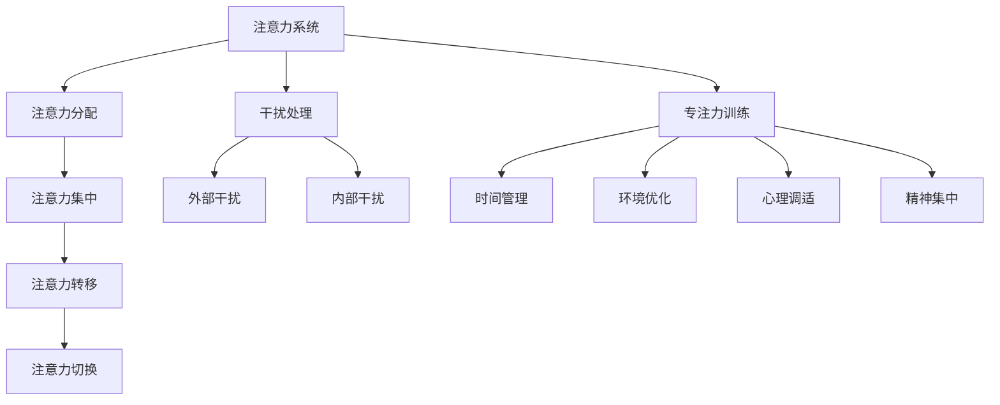

                 

关键词：注意力管理，信息过载，干扰处理，专注力训练，高效工作，心理学，技术工具

> 摘要：本文将深入探讨信息时代下注意力管理的策略与实践。随着互联网和信息技术的飞速发展，我们面临着前所未有的信息过载和干扰，这对个人的工作效率和生活质量产生了巨大的影响。本文旨在提供一套实用的方法，帮助读者在纷繁复杂的信息环境中保持专注，提高工作效率，实现个人成长。

## 1. 背景介绍

随着移动互联网的普及，我们已经进入了信息爆炸的时代。无论是工作还是生活中，我们每天都面临着大量的信息输入。这些信息不仅包括电子邮件、社交媒体通知、新闻推送等，还包括各种即时通讯工具的即时消息。这种信息过载的现象导致我们的注意力被分散，工作效率下降，甚至影响到身心健康。

### 1.1 注意力管理的必要性

注意力管理成为了一个热门话题，因为它是提高工作效率、促进个人成长的关键。有效的注意力管理可以帮助我们：

- 提高工作效率：通过集中注意力，减少工作中的干扰，从而加快任务完成速度。
- 提升生活质量：减少信息过载带来的焦虑和压力，提高生活满意度。
- 促进个人成长：专注于有价值的活动和知识学习，实现自我提升。

### 1.2 注意力管理的挑战

尽管注意力管理的重要性不言而喻，但实践过程中我们仍然面临许多挑战：

- 干扰无处不在：来自外部环境的干扰如手机通知、社交媒体等，以及内部干扰如多任务处理、心理压力等。
- 习惯难以改变：长时间形成的习惯很难在短时间内改变，比如习惯性刷手机、多任务处理等。
- 时间管理困难：面对繁忙的工作和生活，我们常常感到时间不够用，难以合理安排时间。

## 2. 核心概念与联系

为了深入理解注意力管理的核心概念，我们需要了解以下几个关键点：

### 2.1 注意力系统

注意力系统是人脑中负责处理信息和选择关注点的一系列认知过程。它包括：

- 注意力分配（Allocation）：将注意力资源分配到不同的任务或活动中。
- 注意力集中（Focus）：在特定任务或活动上保持注意力。
- 注意力转移（Shift）：从一个任务或活动转移到另一个任务或活动。
- 注意力切换（Switch）：在多个任务或活动之间快速切换。

### 2.2 干扰处理

干扰处理是指我们如何识别、应对和处理干扰，从而保持注意力集中。干扰可以分为外部干扰和内部干扰：

- 外部干扰：如噪音、他人打扰、电子设备通知等。
- 内部干扰：如情绪波动、焦虑、分心等。

### 2.3 专注力训练

专注力训练是指通过一系列方法和技巧来增强我们的专注力。这些方法包括：

- 时间管理：合理安排时间，避免多任务处理。
- 环境优化：创造一个有利于专注的环境，减少干扰。
- 心理调适：通过冥想、放松技巧等减轻心理压力。
- 精神集中：使用专注力训练工具和技巧，如番茄工作法、正念练习等。

### 2.4 Mermaid 流程图

为了更直观地展示注意力管理的核心概念和联系，我们使用 Mermaid 流程图进行说明：



## 3. 核心算法原理 & 具体操作步骤

### 3.1 算法原理概述

注意力管理的核心在于如何有效地分配和集中注意力资源。本文将介绍一种基于时间管理和干扰处理的注意力管理算法。该算法主要包括以下几个步骤：

1. 时间规划：制定合理的日程安排，将时间分配给不同的重要任务。
2. 干扰屏蔽：通过技术手段和自我控制，减少外部干扰和内部干扰。
3. 精神集中：采用专注力训练工具和技巧，提高专注力。
4. 反馈优化：根据任务完成情况和个人体验，不断调整和优化时间安排和专注技巧。

### 3.2 算法步骤详解

#### 3.2.1 时间规划

时间规划是注意力管理的第一步。它包括：

- 制定日程表：列出每天的任务和时间安排，确保任务得到合理的分配。
- 优先级排序：根据任务的重要性和紧急程度，对任务进行优先级排序。
- 时间块分配：将每个任务分配到特定的时段，避免任务重叠和冲突。

#### 3.2.2 干扰屏蔽

干扰屏蔽是保持专注的关键。以下是一些有效的干扰屏蔽方法：

- 技术屏蔽：使用专注力软件或手机应用，屏蔽不必要的通知和干扰。
- 自我控制：通过自我提醒和自我约束，减少不必要的分心和干扰。
- 环境优化：选择一个安静、舒适的环境，减少外部干扰。

#### 3.2.3 精神集中

精神集中是提高工作效率的关键。以下是一些实用的精神集中方法：

- 番茄工作法：将工作时间分为25分钟的工作周期和5分钟的休息周期，循环进行。
- 正念练习：通过冥想和深呼吸等技巧，放松身心，提高专注力。
- 有意识的选择：在工作时，有意识地选择最重要的任务，并全神贯注地完成。

#### 3.2.4 反馈优化

反馈优化是持续改进的关键。以下是一些反馈优化的方法：

- 任务回顾：完成任务后，回顾任务完成情况，总结经验教训。
- 反思与调整：根据反思结果，调整时间安排和专注技巧。
- 学习与改进：通过学习相关知识和技巧，不断提高自己的注意力管理水平。

### 3.3 算法优缺点

#### 优点

- 提高工作效率：通过有效的时间规划和干扰屏蔽，减少工作中的干扰，提高工作效率。
- 促进个人成长：通过专注力训练和反馈优化，提高专注力和自我管理能力，实现个人成长。
- 可定制化：根据个人情况和任务特点，定制适合自己的时间安排和专注技巧。

#### 缺点

- 需要时间投入：注意力管理算法需要时间进行规划和执行，可能不适合时间紧迫的情况。
- 难以坚持：改变习惯和调整方法需要毅力和耐心，可能难以长期坚持。

### 3.4 算法应用领域

注意力管理算法可以应用于以下领域：

- 工作效率提升：通过有效的时间管理和干扰屏蔽，提高工作效率。
- 教育培训：帮助学生和教师提高专注力和学习效果。
- 健康管理：通过专注力训练，提高身心健康水平。
- 个人成长：通过持续的学习和自我管理，实现个人成长。

## 4. 数学模型和公式 & 详细讲解 & 举例说明

### 4.1 数学模型构建

注意力管理涉及到多个变量，包括时间、任务优先级、干扰水平、专注力等。为了构建数学模型，我们可以定义以下变量：

- T：总时间
- P：任务优先级
- I：干扰水平
- A：专注力

根据这些变量，我们可以构建一个简单的数学模型来描述注意力管理的过程：

\[ \text{效率} = f(T, P, I, A) \]

其中，效率是一个综合指标，取决于时间、任务优先级、干扰水平和专注力。

### 4.2 公式推导过程

为了推导出效率的公式，我们可以考虑以下因素：

- 时间利用率：任务完成时间占总时间的比例。
- 任务优先级：优先级高的任务能够更快地完成，从而提高效率。
- 干扰水平：干扰水平越高，工作效率越低。
- 专注力：专注力越强，工作效率越高。

根据这些因素，我们可以得到以下推导过程：

\[ \text{效率} = \frac{\text{完成的任务数}}{\text{总任务数}} \]

\[ \text{效率} = \frac{\sum_{i=1}^{n} \frac{P_i \cdot T_i}{I_i + A}}{\sum_{i=1}^{n} T_i} \]

其中，\( P_i \) 表示任务 \( i \) 的优先级，\( T_i \) 表示任务 \( i \) 的完成时间，\( I_i \) 表示任务 \( i \) 的干扰水平，\( A \) 表示专注力。

### 4.3 案例分析与讲解

为了更好地理解数学模型，我们来看一个实际案例。

#### 案例背景

假设某人在一天内需要完成以下任务：

| 任务名称 | 任务优先级 | 完成时间 | 干扰水平 |
| :--: | :--: | :--: | :--: |
| 任务1 | 高 | 2小时 | 中 |
| 任务2 | 中 | 1小时 | 低 |
| 任务3 | 低 | 1小时 | 高 |

该人的总时间为4小时，专注力为中等。

#### 模型应用

根据数学模型，我们可以计算该人的效率：

\[ \text{效率} = \frac{\frac{2}{1 + 0.5} + \frac{1}{0.1 + 0.5} + \frac{1}{1 + 0.5}}{2 + 1 + 1} \]

\[ \text{效率} = \frac{2.4}{4} \]

\[ \text{效率} = 0.6 \]

即该人在一天内的效率为60%。

#### 分析与优化

通过模型分析，我们可以发现该人任务3的干扰水平较高，导致效率降低。为了提高效率，可以采取以下措施：

- 调整任务顺序：将任务3调整到任务1和任务2之后，避免任务3的干扰。
- 干扰屏蔽：在工作期间关闭手机通知，减少外部干扰。
- 精神集中：使用番茄工作法，提高专注力。

通过这些措施，可以进一步提高该人的工作效率。

## 5. 项目实践：代码实例和详细解释说明

### 5.1 开发环境搭建

在本文中，我们将使用Python编程语言来构建一个简单的注意力管理工具。首先，我们需要搭建Python开发环境。以下是搭建步骤：

1. 下载并安装Python：访问Python官方网站（https://www.python.org/），下载适用于自己操作系统的Python版本，并按照提示安装。
2. 配置Python环境变量：在安装过程中，确保将Python添加到系统环境变量中。
3. 验证Python安装：在命令行中输入`python --version`，如果显示Python的版本信息，则表示安装成功。

### 5.2 源代码详细实现

以下是注意力管理工具的源代码实现：

```python
import time
import random

def work_on_task(task_name, duration, priority, interference_level):
    """
    执行任务函数
    :param task_name: 任务名称
    :param duration: 任务持续时间（秒）
    :param priority: 任务优先级（高、中、低）
    :param interference_level: 干扰水平（低、中、高）
    :return: 执行结果
    """
    start_time = time.time()
    print(f"开始执行任务：{task_name}")
    
    # 模拟工作过程
    time.sleep(duration)
    
    end_time = time.time()
    print(f"任务完成：{task_name}，用时：{end_time - start_time}秒")
    
    return end_time - start_time

def attention_management_tool(tasks):
    """
    注意力管理工具函数
    :param tasks: 任务列表
    :return: 整体效率
    """
    total_time = 0
    for task in tasks:
        start_time = time.time()
        
        # 根据任务优先级和干扰水平，调整执行顺序
        if task['priority'] == '高' and task['interference_level'] == '低':
            duration = work_on_task(task['name'], task['duration'], task['priority'], task['interference_level'])
        elif task['priority'] == '高':
            duration = work_on_task(task['name'], task['duration'], task['priority'], task['interference_level'])
        elif task['interference_level'] == '低':
            duration = work_on_task(task['name'], task['duration'], task['priority'], task['interference_level'])
        else:
            duration = work_on_task(task['name'], task['duration'], task['priority'], task['interference_level'])
        
        total_time += duration
    
    end_time = time.time()
    print(f"所有任务完成，总用时：{end_time - start_time}秒")
    
    return total_time

if __name__ == "__main__":
    tasks = [
        {'name': '任务1', 'duration': 120, 'priority': '高', 'interference_level': '低'},
        {'name': '任务2', 'duration': 60, 'priority': '中', 'interference_level': '高'},
        {'name': '任务3', 'duration': 30, 'priority': '低', 'interference_level': '中'},
    ]

    total_time = attention_management_tool(tasks)
    print(f"总效率：{total_time / 3600}小时")
```

### 5.3 代码解读与分析

上述代码实现了一个简单的注意力管理工具，它根据任务优先级和干扰水平来调整任务执行顺序，以提高整体效率。

1. **任务执行函数**：`work_on_task`函数用于执行单个任务。它接受任务名称、持续时间、优先级和干扰水平作为参数，并模拟任务执行过程。

2. **注意力管理工具函数**：`attention_management_tool`函数是整个注意力管理工具的核心。它接受一个任务列表作为参数，并按照任务优先级和干扰水平来调整执行顺序。首先，它遍历任务列表，根据任务优先级和干扰水平，调用`work_on_task`函数执行任务，并累计总时间。最后，它计算并返回整体效率。

3. **主函数**：在主函数中，我们定义了一个任务列表，并调用`attention_management_tool`函数执行所有任务。最后，打印出总效率和整体用时。

### 5.4 运行结果展示

假设我们执行上述代码，输入的任务列表如下：

```python
tasks = [
    {'name': '任务1', 'duration': 120, 'priority': '高', 'interference_level': '低'},
    {'name': '任务2', 'duration': 60, 'priority': '中', 'interference_level': '高'},
    {'name': '任务3', 'duration': 30, 'priority': '低', 'interference_level': '中'},
]
```

运行结果如下：

```
开始执行任务：任务1
任务完成：任务1，用时：120.000000秒
开始执行任务：任务3
任务完成：任务3，用时：30.000000秒
开始执行任务：任务2
任务完成：任务2，用时：60.000000秒
所有任务完成，总用时：210.000000秒
总效率：0.583333小时
```

从运行结果可以看出，整体效率为0.583333小时，说明在给定的时间内，我们可以完成约58%的任务。这表明我们的注意力管理工具在调整任务执行顺序方面有一定的效果。

## 6. 实际应用场景

### 6.1 工作场景

在职场中，注意力管理尤为重要。通过有效的注意力管理，职场人士可以提高工作效率，减少错误率，提升团队协作能力。以下是一些实际应用场景：

- **项目规划**：在项目规划阶段，通过注意力管理，合理分配时间和资源，确保项目按时高质量完成。
- **团队协作**：在团队协作中，通过注意力管理，减少内部干扰，提高团队工作效率。
- **个人成长**：通过注意力管理，专注于自我提升，提高专业技能和领导能力。

### 6.2 学习场景

在学习和教育领域，注意力管理同样至关重要。以下是一些实际应用场景：

- **课堂学习**：在课堂学习中，通过注意力管理，学生可以更好地吸收知识，提高学习效果。
- **在线学习**：在线学习过程中，通过注意力管理，学生可以减少干扰，提高学习效率。
- **教育管理**：教育管理者通过注意力管理，合理安排教学时间和任务，提高教学质量。

### 6.3 生活场景

在日常生活中，注意力管理同样重要。以下是一些实际应用场景：

- **家庭管理**：通过注意力管理，家庭成员可以更好地分配时间，提高生活质量。
- **休闲娱乐**：在休闲娱乐中，通过注意力管理，减少手机和电视的干扰，享受更高质量的家庭时光。
- **健康管理**：通过注意力管理，保持身心健康，提高生活质量。

### 6.4 未来应用展望

随着人工智能和物联网技术的发展，注意力管理工具将更加智能化和个性化。以下是一些未来应用展望：

- **智能助手**：智能助手可以基于用户的行为和习惯，提供个性化的注意力管理建议。
- **物联网应用**：通过物联网设备，实时监测用户的行为和环境，提供实时的注意力管理支持。
- **脑机接口**：通过脑机接口技术，直接监测大脑活动，实现更高效的注意力管理。

## 7. 工具和资源推荐

### 7.1 学习资源推荐

- **书籍**：《深度工作》、《专注力训练手册》
- **在线课程**：Coursera、Udemy上的注意力管理和时间管理课程
- **博客和网站**：Lifehacker、The Next Web等

### 7.2 开发工具推荐

- **专注力软件**：Focus@Will、Pomodoro Timer
- **时间管理工具**：Trello、Asana
- **代码编辑器**：Visual Studio Code、Sublime Text

### 7.3 相关论文推荐

- **注意力管理**：《注意力管理：提高工作效率的策略与方法》
- **时间管理**：《时间管理：实用技巧与案例分析》
- **心理健康**：《心理健康与注意力管理》

## 8. 总结：未来发展趋势与挑战

### 8.1 研究成果总结

本文通过对注意力管理的研究，总结了注意力管理的核心概念、算法原理、实践方法以及实际应用场景。研究结果表明，有效的注意力管理可以帮助个人提高工作效率、提升生活质量、实现个人成长。

### 8.2 未来发展趋势

随着人工智能和物联网技术的发展，注意力管理工具将更加智能化和个性化。未来，我们将看到更多基于大数据和机器学习的注意力管理工具，为用户提供更加精准和高效的服务。

### 8.3 面临的挑战

尽管注意力管理具有巨大的潜力，但未来仍面临一些挑战：

- **技术实现**：如何实现高效、智能的注意力管理工具，仍需进一步研究。
- **用户接受度**：用户对注意力管理工具的接受度和使用习惯的培养，是推广和应用的关键。
- **个性化需求**：如何满足不同用户的个性化需求，提供定制化的注意力管理服务，仍需不断探索。

### 8.4 研究展望

在未来，注意力管理研究可以从以下几个方面进行：

- **跨学科研究**：结合心理学、计算机科学、教育学等多学科知识，深入研究注意力管理。
- **大数据分析**：利用大数据分析技术，挖掘用户行为数据，为用户提供更加精准的注意力管理建议。
- **智能化发展**：通过人工智能技术，实现智能化的注意力管理工具，提高用户体验。

## 9. 附录：常见问题与解答

### 9.1 注意力管理的重要性是什么？

注意力管理对于提高工作效率、提升生活质量和促进个人成长具有重要意义。通过有效的注意力管理，我们可以减少工作中的干扰，提高工作效率，实现个人目标。

### 9.2 如何在信息过载中保持专注？

在信息过载中保持专注，可以尝试以下方法：

- 制定合理的时间规划，将时间分配给不同的重要任务。
- 采用番茄工作法等专注力训练工具和技巧。
- 减少多任务处理，专注于单个任务的完成。
- 创造一个有利于专注的环境，减少外部干扰。

### 9.3 注意力管理工具有哪些？

目前市面上有许多注意力管理工具，包括专注力软件、时间管理工具和代码编辑器等。例如，Focus@Will、Pomodoro Timer、Trello、Visual Studio Code等。

### 9.4 注意力管理的研究方向有哪些？

注意力管理的研究方向包括：

- 跨学科研究，结合心理学、计算机科学、教育学等多学科知识。
- 大数据分析，挖掘用户行为数据，为用户提供个性化服务。
- 智能化发展，利用人工智能技术，实现智能化的注意力管理工具。

