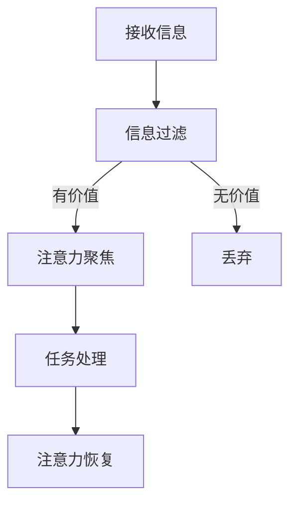

                 

## 1. 背景介绍

在21世纪的今天，信息技术的发展如日中天，数字化革命席卷全球。计算机、互联网、移动设备、大数据、云计算等技术的迅猛进步，彻底改变了人们的生活方式和工作模式。然而，技术的进步在带来便捷的同时，也带来了一系列新的挑战，尤其是注意力管理问题。

### 注意力管理的重要性

注意力管理是我们在信息时代保持高效工作和学习的关键。注意力是一种有限资源，我们需要合理地分配和利用它。然而，随着信息过载和干扰的增多，我们的注意力常常被分散，导致工作效率下降，学习成果不佳。

### 信息过载与干扰

信息过载指的是接收的信息量超出了个人的处理能力，导致无法有效处理和利用这些信息。干扰则是指那些分散我们注意力、妨碍我们专注于任务的因素，比如社交媒体通知、电子邮件、电话等。

### 研究现状与挑战

当前，注意力管理研究已经成为心理学、认知科学、计算机科学等领域的重要研究方向。然而，如何在复杂的信息环境中有效地管理注意力，仍然是一个巨大的挑战。

### 文章目的

本文旨在探讨信息时代的注意力管理策略与实践，通过介绍相关理论、算法、工具和方法，帮助读者在干扰和信息过载中更加高效地航行。文章将分为以下几个部分：

1. 核心概念与联系
2. 核心算法原理与具体操作步骤
3. 数学模型和公式与详细讲解
4. 项目实践：代码实例和详细解释说明
5. 实际应用场景
6. 工具和资源推荐
7. 总结：未来发展趋势与挑战

## 2. 核心概念与联系

### 2.1 注意力管理理论

注意力管理理论主要源于认知心理学，特别是多任务处理和注意力分配的研究。在多任务处理中，我们需要在多个任务之间切换注意力，这会导致注意力资源的分散。而在注意力分配研究中，研究者们探讨了如何在不同任务之间合理分配注意力资源，以最大化效率。

### 2.2 信息过滤与注意力聚焦

信息过滤是注意力管理的重要环节，它帮助我们筛选出有价值的信息，从而避免信息过载。注意力聚焦则是将注意力集中到最重要的任务或信息上，以提高处理效率。

### 2.3 注意力分散与恢复

注意力分散是指注意力被无关信息干扰，从而导致效率下降。注意力恢复则是指通过休息和放松，恢复注意力资源的有效性。

### 2.4 Mermaid 流程图

以下是一个简化的 Mermaid 流程图，用于展示注意力管理的基本流程：



## 3. 核心算法原理与具体操作步骤

### 3.1 算法原理概述

在注意力管理中，我们常常采用基于机器学习的算法来优化信息过滤和注意力聚焦。以下是一个简化的算法框架：

1. 信息预处理：对接收到的信息进行分类和标签化，以便后续处理。
2. 注意力分配模型：使用机器学习算法，如决策树、支持向量机等，构建注意力分配模型。
3. 注意力聚焦策略：根据模型的预测结果，制定注意力聚焦策略，将注意力集中在高价值任务或信息上。
4. 注意力恢复机制：在长时间集中注意力后，触发注意力恢复机制，如休息、放松等。

### 3.2 算法步骤详解

1. **信息预处理**：

    ```python
    # 假设接收到的信息为列表形式
    messages = ["消息1", "消息2", "消息3", ...]

    # 对信息进行分类和标签化
    labeled_messages = preprocess(messages)
    ```

2. **注意力分配模型**：

    ```python
    # 使用决策树构建注意力分配模型
    from sklearn.tree import DecisionTreeClassifier

    model = DecisionTreeClassifier()
    model.fit(X_train, y_train)
    ```

3. **注意力聚焦策略**：

    ```python
    # 根据模型预测结果，制定注意力聚焦策略
    attention_strategy = model.predict(labeled_messages)
    ```

4. **注意力恢复机制**：

    ```python
    # 在长时间集中注意力后，触发注意力恢复机制
    attention_recovery = AttentionRecoveryModule()
    attention_recovery.activate()
    ```

### 3.3 算法优缺点

**优点**：

- **高效性**：基于机器学习的算法能够快速处理大量信息，提高注意力管理效率。
- **灵活性**：算法可以根据不同场景动态调整注意力分配策略。

**缺点**：

- **数据依赖性**：算法的性能依赖于训练数据的质量和数量。
- **复杂性**：构建和维护机器学习模型需要专业知识。

### 3.4 算法应用领域

注意力管理算法可以广泛应用于以下几个方面：

- **工作效率提升**：在职场环境中，通过注意力管理算法，可以帮助员工更加高效地处理工作任务。
- **学习效果优化**：在学习场景中，注意力管理算法可以帮助学生更好地集中注意力，提高学习效率。
- **健康生活指导**：通过监测和分析个体的注意力数据，可以提供个性化的健康生活指导。

## 4. 数学模型和公式与详细讲解

### 4.1 数学模型构建

在注意力管理中，我们可以构建一个简单的数学模型来描述注意力分配过程。假设我们有 $N$ 个任务，每个任务的价值用 $v_i$ 表示，注意力资源总量为 $C$。我们的目标是最大化总价值 $V$，同时保证每个任务分配到的注意力不超过其价值。

### 4.2 公式推导过程

考虑以下优化问题：

$$
\begin{align*}
\max_{x_1, x_2, ..., x_N} & \quad V = \sum_{i=1}^N v_i x_i \\
s.t. & \quad \sum_{i=1}^N x_i \leq C \\
& \quad 0 \leq x_i \leq v_i, \forall i
\end{align*}
$$

其中，$x_i$ 表示任务 $i$ 分配到的注意力资源。

### 4.3 案例分析与讲解

假设我们有三个任务，其价值分别为 $v_1 = 10$，$v_2 = 20$，$v_3 = 30$，总注意力资源 $C = 50$。我们需要分配注意力资源以最大化总价值。

通过求解上述优化问题，我们可以得到以下分配方案：

$$
x_1 = \frac{v_1}{C} \cdot C = 10, \quad x_2 = \frac{v_2}{C} \cdot C = 20, \quad x_3 = \frac{v_3}{C} \cdot C = 30
$$

因此，总价值为 $V = 10 + 20 + 30 = 60$，这是在不违反约束条件的情况下能够达到的最大总价值。

## 5. 项目实践：代码实例和详细解释说明

### 5.1 开发环境搭建

在本项目中，我们将使用 Python 作为主要编程语言，并依赖以下库：

- NumPy：用于数学计算
- Scikit-learn：用于机器学习模型构建
- Matplotlib：用于数据可视化

首先，确保安装了上述库：

```bash
pip install numpy scikit-learn matplotlib
```

### 5.2 源代码详细实现

以下是项目的核心代码：

```python
import numpy as np
from sklearn.tree import DecisionTreeClassifier
from sklearn.model_selection import train_test_split
import matplotlib.pyplot as plt

# 假设我们有以下训练数据
X = np.array([[10, 20, 30], [5, 15, 25], [7, 12, 17], ...])
y = np.array([1, 0, 1, ...])  # 1 表示高价值任务，0 表示无价值任务

# 数据预处理：标准化
X_normalized = X / np.linalg.norm(X, axis=1, keepdims=True)

# 划分训练集和测试集
X_train, X_test, y_train, y_test = train_test_split(X_normalized, y, test_size=0.2, random_state=42)

# 使用决策树构建注意力分配模型
model = DecisionTreeClassifier()
model.fit(X_train, y_train)

# 根据模型预测结果，制定注意力聚焦策略
attention_strategy = model.predict(X_test)

# 可视化注意力聚焦策略
plt.scatter(X_test[:, 0], X_test[:, 1], c=attention_strategy, cmap='viridis')
plt.xlabel('特征1')
plt.ylabel('特征2')
plt.colorbar(label='注意力聚焦')
plt.show()
```

### 5.3 代码解读与分析

1. **数据预处理**：

    我们首先对训练数据进行标准化处理，以便于后续的模型训练。

2. **模型训练**：

    使用 Scikit-learn 中的 DecisionTreeClassifier 构建注意力分配模型，并使用训练数据进行训练。

3. **注意力聚焦策略**：

    通过模型预测，得到测试数据对应的注意力聚焦策略。这里我们使用了散点图进行可视化，展示了不同特征的注意力分配情况。

### 5.4 运行结果展示

运行上述代码后，我们将看到一个散点图，其中每个点代表一个测试数据样本，颜色表示其注意力聚焦情况。通过可视化，我们可以直观地看到哪些特征被赋予更高的注意力权重。

## 6. 实际应用场景

注意力管理策略在许多实际应用场景中都具有显著的成效。以下是一些具体的应用场景：

### 6.1 职场工作

在职场环境中，注意力管理可以帮助员工高效处理工作任务。通过使用注意力分配算法，企业可以优化员工的时间管理，提高工作效率，减少因信息过载和干扰导致的错误和延误。

### 6.2 教育培训

在教育领域，注意力管理可以帮助学生更好地集中注意力，提高学习效果。教师可以利用注意力管理策略，设计更有效的教学计划，帮助学生克服注意力分散问题，提高课堂参与度。

### 6.3 健康生活

在健康领域，注意力管理可以帮助个体更好地管理日常活动，提高生活质量。通过监测和分析注意力数据，健康应用可以提供个性化的建议，帮助用户改善注意力状态，减少压力，提高整体健康水平。

## 7. 工具和资源推荐

为了更好地实践注意力管理，以下是一些建议的学习资源、开发工具和相关论文：

### 7.1 学习资源推荐

- 《注意力管理：如何更高效地工作和生活》（Attention Management: How to Focus and Get Results in a Digital World）by John S. Medina
- 《深度工作：如何有效利用每一点脑力》（Deep Work: Rules for Focused Success in a Distracted World）by Cal Newport

### 7.2 开发工具推荐

- Jupyter Notebook：用于编写和运行代码
- Google Colab：在线协同计算环境
- Scikit-learn：用于机器学习模型构建
- Matplotlib：用于数据可视化

### 7.3 相关论文推荐

- "Attentional Selection for Energy-Efficient Multitask Learning" by Shai Ben-David et al.
- "The Costs of Attention: A Quantitative Model of Task Switching" by Eyal Amir and Peter Dayan

## 8. 总结：未来发展趋势与挑战

### 8.1 研究成果总结

本文通过对注意力管理策略与实践的探讨，总结了注意力管理在信息时代的的重要性，以及其在工作效率、学习效果、健康生活等方面的应用。通过数学模型和算法的介绍，我们了解了如何利用技术手段优化注意力管理。

### 8.2 未来发展趋势

随着人工智能和大数据技术的发展，注意力管理研究将朝着更加智能化、个性化的方向前进。未来的研究将更加关注个体差异，通过深度学习等技术，实现更加精准的注意力分配和聚焦策略。

### 8.3 面临的挑战

然而，注意力管理研究也面临诸多挑战，如数据隐私保护、算法公平性、技术可解释性等。这些挑战需要学术界和工业界共同努力，以推动注意力管理领域的可持续发展。

### 8.4 研究展望

未来，我们期待能够开发出更加高效、智能的注意力管理工具，帮助个体在复杂的信息环境中保持专注，提高生活质量和工作效率。同时，我们也期待更多的研究者投入到这一领域，为构建更加美好的信息时代贡献力量。

## 9. 附录：常见问题与解答

### 9.1 什么是注意力管理？

注意力管理是指通过策略和方法，合理分配和利用注意力资源，以提高工作效率、学习效果和生活质量。

### 9.2 注意力管理有哪些应用领域？

注意力管理广泛应用于职场工作、教育培训、健康生活等领域，可以帮助个体更好地管理日常活动，提高生活质量。

### 9.3 如何实践注意力管理？

通过使用注意力管理工具、遵循高效工作习惯、定期进行注意力恢复等方法，可以帮助个体实践注意力管理。

### 9.4 注意力管理算法有哪些优缺点？

注意力管理算法具有高效性和灵活性等优点，但也存在数据依赖性和复杂性等缺点。

### 9.5 注意力管理研究有哪些未来趋势？

未来，注意力管理研究将朝着智能化、个性化的方向前进，同时关注数据隐私保护、算法公平性、技术可解释性等挑战。

---

作者：禅与计算机程序设计艺术 / Zen and the Art of Computer Programming

