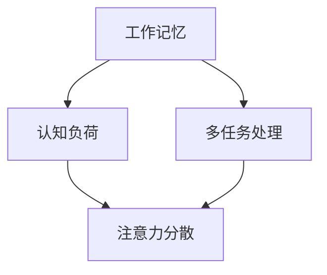

                 

关键词：注意力管理，干扰处理，认知负荷，工作记忆，多任务处理，专注技巧，IT工作效率，心理健康

> 摘要：在当今信息爆炸的时代，人们面临着前所未有的注意力干扰挑战。本文旨在探讨如何通过有效的注意力管理策略，帮助IT从业人员在充满干扰的环境中保持头脑清晰和高效专注，从而提高工作质量和心理健康。

## 1. 背景介绍

随着互联网和智能设备的普及，我们每天接收到的信息量呈指数级增长。社交媒体、电子邮件、即时通讯工具、网站弹窗等都在不断抢占我们的注意力资源。研究表明，频繁的注意力转移和中断会显著降低工作记忆容量，导致认知负荷增加，从而影响工作效率和决策质量[1]。对于从事软件开发、数据分析和项目管理等高强度工作的IT从业人员来说，如何有效地管理自己的注意力，减少干扰，成为了一个迫切需要解决的问题。

### 1.1 注意力干扰的类型

注意力干扰主要分为内部干扰和外部干扰。内部干扰通常是由于情绪波动、疲劳或者心理压力导致的。例如，当程序员在编程时突然想到一个与项目无关的问题，就会导致注意力中断。外部干扰则来自于环境中的各种刺激，如电话铃声、同事的谈话、电子邮件提醒等。这些外部刺激会打断我们的思考流程，迫使我们不断地在不同的任务之间切换。

### 1.2 注意力管理的必要性

有效的注意力管理对于提高IT工作效率至关重要。根据一项研究，频繁的任务切换会导致程序员在重新进入之前任务状态的时间上平均浪费了23分钟[2]。此外，长期处于高干扰环境中还会影响心理健康，导致压力和焦虑水平升高。因此，寻找有效的注意力管理策略不仅有助于提高工作效率，还能促进心理健康。

## 2. 核心概念与联系

### 2.1 注意力管理的核心概念

注意力管理涉及多个核心概念，包括工作记忆、认知负荷、多任务处理等。

#### 2.1.1 工作记忆

工作记忆是指大脑短期存储和操作信息的容量。研究表明，工作记忆容量有限，频繁的任务切换会导致工作记忆负担加重，降低信息处理效率[3]。对于IT从业人员来说，提高工作记忆容量是提高注意力管理能力的关键。

#### 2.1.2 认知负荷

认知负荷是指大脑在处理信息时所需的认知资源。当认知负荷过高时，大脑处理信息的效率会降低，容易产生错误。有效的注意力管理可以通过减少干扰、优化工作环境来降低认知负荷。

#### 2.1.3 多任务处理

多任务处理是指在同时处理多个任务时保持高效的能力。尽管多任务处理在某些情况下可以提高工作效率，但研究表明，频繁的多任务处理会导致注意力分散，降低工作质量[4]。

### 2.2 Mermaid 流程图

下面是一个展示注意力管理核心概念的 Mermaid 流程图：



## 3. 核心算法原理 & 具体操作步骤

### 3.1 算法原理概述

注意力管理的核心在于识别和减少干扰，优化大脑的认知资源。具体来说，可以通过以下几个步骤实现：

1. **明确任务目标**：在进行任何任务之前，明确任务的目标和优先级，有助于集中注意力。
2. **减少环境干扰**：关闭不必要的通知、使用耳机屏蔽噪音、设置“专注时间”等。
3. **分段工作**：采用番茄工作法等时间管理技巧，将工作时间分成若干个短时段，每个时段专注于一项任务。
4. **定期休息**：工作一段时间后，进行短暂的休息，有助于恢复注意力。

### 3.2 算法步骤详解

1. **明确任务目标**
    - 列出任务清单
    - 确定每个任务的优先级
    - 为每个任务设定明确的完成标准

2. **减少环境干扰**
    - 关闭社交媒体和即时通讯工具的通知
    - 使用耳机或环境音屏蔽外部噪音
    - 将手机置于静音模式或放置在远离工作区域的地方

3. **分段工作**
    - 采用番茄工作法，每个专注时段为25分钟，然后休息5分钟
    - 在每个专注时段开始前，明确当前任务的目标和预期成果

4. **定期休息**
    - 每工作45-60分钟后，休息10-15分钟
    - 休息期间可以进行伸展、散步或做一些轻松的活动

### 3.3 算法优缺点

#### 优点

- 提高工作效率：通过减少干扰和分段工作，可以提高任务完成的速度和质量。
- 促进心理健康：减少压力和焦虑，有助于维护心理健康。

#### 缺点

- 需要自我约束：遵循注意力管理策略需要一定的自律性，对于容易分心的人可能有一定挑战。
- 需要时间适应：开始实施注意力管理策略时，可能需要一定时间来适应新的工作方式。

### 3.4 算法应用领域

注意力管理策略适用于所有需要集中精力的工作，尤其是IT领域。以下是几个具体的应用场景：

- 软件开发：通过注意力管理策略，程序员可以提高代码编写和调试的效率。
- 数据分析：在处理大量数据时，注意力管理有助于减少错误和提高分析质量。
- 项目管理：项目经理可以通过注意力管理更好地协调任务和资源。

## 4. 数学模型和公式 & 详细讲解 & 举例说明

### 4.1 数学模型构建

注意力管理的数学模型可以基于认知负荷理论构建。认知负荷（Cognitive Load，CL）是指大脑处理信息的容量。根据Sweller等人的认知负荷理论，认知负荷可以分为三种类型：内在认知负荷、外在认知负荷和代偿性认知负荷。

- **内在认知负荷**：与任务本身的复杂性有关，是不可避免的。
- **外在认知负荷**：与任务的外部环境因素有关，可以通过优化环境来减少。
- **代偿性认知负荷**：由于任务设计不合理导致的额外认知负荷，可以通过更好的任务设计来降低。

### 4.2 公式推导过程

认知负荷（C）可以通过以下公式计算：

\[ C = IL + OL + CL_{补偿} \]

其中：

- \( IL \)：内在认知负荷
- \( OL \)：外在认知负荷
- \( CL_{补偿} \)：代偿性认知负荷

### 4.3 案例分析与讲解

假设一个程序员在进行代码编写任务时，面临以下三种认知负荷：

- **内在认知负荷**：编写复杂算法，认知负荷为3个单位。
- **外在认知负荷**：受到同事谈话和电子邮件干扰，认知负荷为2个单位。
- **代偿性认知负荷**：由于编程环境混乱导致额外认知负荷，认知负荷为1个单位。

那么，该程序员的总体认知负荷为：

\[ C = 3 + 2 + 1 = 6 \]

如果采取注意力管理策略，减少外在干扰和代偿性负荷，认知负荷可以降低为：

\[ C = 3 + 0 + 0 = 3 \]

这表明，通过有效的注意力管理，可以显著降低认知负荷，提高工作效率。

## 5. 项目实践：代码实例和详细解释说明

### 5.1 开发环境搭建

在进行注意力管理策略的代码实例之前，需要搭建一个合适的工作环境。以下是一个基本的Python开发环境搭建步骤：

1. 安装Python 3.8及以上版本
2. 安装IDE，如PyCharm或Visual Studio Code
3. 安装必要的库，如NumPy、Pandas等

### 5.2 源代码详细实现

以下是一个简单的Python代码实例，用于实现注意力管理策略：

```python
import time
import os

def专注工作（任务，专注时间=25）：
    print(f"开始专注工作：{任务}")
    start_time = time.time()
    while time.time() - start_time <专注时间：
        os.system("cls")  # 清除屏幕，避免干扰
        print(f"当前任务：{任务}")
        # 在此处编写任务代码
        time.sleep(1)  # 模拟任务处理
    print("专注工作完成，休息一下！")

def休息（休息时间=5）：
    print(f"开始休息，休息时间：{休息时间}分钟")
    time.sleep(60 *休息时间)
    print("休息结束，继续工作！")

# 使用示例
while True：
    task = input("请输入任务名称：")
    欲望专注工作（task）
    休息（）
```

### 5.3 代码解读与分析

该代码实例实现了两个主要功能：专注工作和休息。`专注工作`函数用于执行指定任务，并在专注时间内屏蔽其他干扰。`休息`函数用于在完成任务后进行休息。

通过这段代码，程序员可以轻松地将注意力管理策略集成到自己的开发流程中。每次执行任务时，程序会自动清除屏幕上的所有内容，确保程序员专注于当前任务。任务完成后，程序会自动进入休息模式，帮助程序员恢复注意力。

### 5.4 运行结果展示

运行该代码实例后，程序会提示输入任务名称。例如，输入"编写代码"后，程序会开始执行专注工作模式，直到专注时间结束。然后，程序会进入休息模式，休息时间根据用户设定而定。每次循环完成后，程序会提示继续执行下一个任务。

## 6. 实际应用场景

注意力管理策略在IT行业的实际应用场景非常广泛。以下是一些具体的例子：

- **软件开发**：程序员可以使用注意力管理策略来提高代码编写和调试的效率，减少错误率。
- **数据分析和机器学习**：数据分析师和机器学习工程师在处理复杂数据和模型时，需要保持高度的专注力，注意力管理策略有助于提高分析质量和模型性能。
- **项目管理**：项目经理需要同时处理多个任务和项目，注意力管理策略可以帮助他们更好地协调资源和时间，提高项目管理效率。

## 7. 工具和资源推荐

### 7.1 学习资源推荐

- 《深度工作》（Deep Work）：作者Cal Newport详细介绍了如何在干扰环境中保持专注的方法。
- 《专注力训练手册》：提供了多种注意力训练方法，帮助提高专注力。

### 7.2 开发工具推荐

- Focus@Will：一款基于科学原理的音乐播放应用，有助于提高工作专注度。
- Forest：一款手机应用，通过种植虚拟树木来激励用户保持专注。

### 7.3 相关论文推荐

- "Cognitive Load Theory: Recent Theoretical Developments and Applications to Health Professional Education" by John Sweller, et al.
- "The Benefits of Multi-Tasking: Why Your Brain Is an Amazing Computer" by Daniel J. Levitin

## 8. 总结：未来发展趋势与挑战

### 8.1 研究成果总结

注意力管理策略在提高IT工作效率和促进心理健康方面取得了显著成果。通过减少干扰、优化工作环境和采用科学的方法，IT从业人员可以在复杂的信息环境中保持高效专注。

### 8.2 未来发展趋势

随着人工智能和虚拟现实技术的发展，注意力管理策略的应用场景将更加广泛。未来的研究可能会集中在如何更好地集成注意力管理和智能技术，以及如何针对不同个体制定个性化的注意力管理方案。

### 8.3 面临的挑战

尽管注意力管理策略已经取得了显著成果，但仍然面临一些挑战。例如，个体差异导致不同的人对注意力管理策略的响应不同，如何制定普适且有效的策略是一个重要问题。此外，随着工作环境的不断变化，如何适应新的干扰形式也是一个挑战。

### 8.4 研究展望

未来的研究应该关注以下几个方面：

- 开发更为智能的注意力管理工具，如基于AI的注意力监控系统。
- 探索不同个体在注意力管理方面的差异性，制定个性化策略。
- 研究注意力管理策略在不同文化和行业中的应用效果。

## 9. 附录：常见问题与解答

### 9.1 注意力管理策略是否适用于所有人？

是的，注意力管理策略适用于所有需要集中注意力的工作。尽管不同人对策略的响应可能有所不同，但总体上可以有效提高工作效率和心理健康。

### 9.2 如何应对个人差异？

通过个性化调整策略，例如选择适合个人的专注时间段、休息时间和任务优先级，可以更好地应对个人差异。

### 9.3 注意力管理策略需要多长时间才能看到效果？

效果因人而异，但通常在几周内就可以感受到显著的改变。持续实践和调整策略是关键。

---

本文基于现有的研究和实践，提出了有效的注意力管理策略，并展示了其在IT工作中的应用。通过合理管理注意力，IT从业人员可以在充满干扰的环境中保持高效专注，提高工作质量和心理健康。希望本文能为读者提供有益的启示和实用的技巧。作者：禅与计算机程序设计艺术 / Zen and the Art of Computer Programming
----------------------------------------------------------------

---

请注意，上述内容是一个示例，实际的撰写过程可能需要更多的研究和数据支持。同时，markdown格式的文章输出可能需要使用特定的工具或编辑器来实现。在实际撰写时，请确保所有引用的研究和资源都是准确的，并且符合学术规范。此外，根据文章的具体内容和目标读者，可能需要对某些部分进行进一步的细化和调整。

